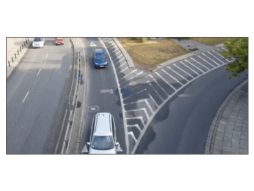
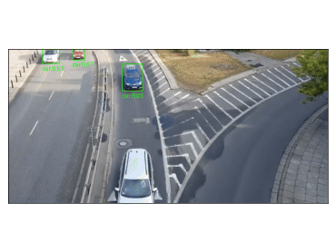
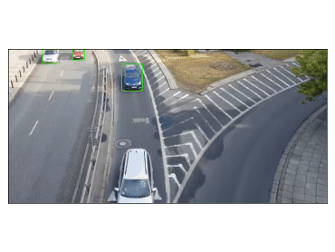

.. DO NOT EDIT.
.. THIS FILE WAS AUTOMATICALLY GENERATED BY SPHINX-GALLERY.
.. TO MAKE CHANGES, EDIT THE SOURCE PYTHON FILE:
.. "auto_demos/Video_Processing.py"
.. LINE NUMBERS ARE GIVEN BELOW.

.. only:: html

    .. note::
        :class: sphx-glr-download-link-note

        :ref:`Go to the end <sphx_glr_download_auto_demos_Video_Processing.py>`
        to download the full example code or to run this example in your browser via Binder.

.. rst-class:: sphx-glr-example-title

.. _sphx_glr_auto_demos_Video_Processing.py:

Video processing, Object detection & Tracking
==============================================

.. GENERATED FROM PYTHON SOURCE LINES 8-21

**Demonstrating the video processing capabilities of Stone Soup**

This notebook will guide you progressively through the steps necessary to:

1. Use the Stone Soup :class:`~.FrameReader` components to open and process video data;
2. Use the :class:`~.UltralyticsBoxObjectDetector` to detect objects in video data, making use of Ultralytics_ YOLO object detection models;
3. Build a :class:`~.MultiTargetTracker` to perform tracking of multiple object in video data.

.. _MoviePy: https://zulko.github.io/moviepy/index.html
.. _ffmpeg-python: https://github.com/kkroening/ffmpeg-python
.. _FFmpeg: https://www.ffmpeg.org/download.html
.. _Ultralytics: https://docs.ultralytics.com/
.. _yt-dlp: https://github.com/yt-dlp/yt-dlp

.. GENERATED FROM PYTHON SOURCE LINES 23-63

Software dependencies
---------------------
Before we begin with this tutorial, there are a few things that we need to install in order to
proceed.

FFmpeg
~~~~~~
FFmpeg is a free and open-source project consisting of a vast software suite of libraries and
programs for handling video, audio, and other multimedia files and streams. Stone Soup (or more
accurately some of its extra dependencies) make use of FFmpeg to read and output video. Download
links and installation instructions for FFmpeg can be found `here <https://www.ffmpeg.org/download.html>`__.

Ultralytics
~~~~~~~~~~~
Ultralytics_ is a free and open-source library that provides an easy-to-use interface to the YOLO
family of object detection models. It ships with a collection of pre-trained models that can be
used for out-of-the-box inference, and downloads the requested model weights automatically on
first use. Installation instructions can be found in the
`Ultralytics quickstart guide <https://docs.ultralytics.com/quickstart/>`__.

Stone Soup
~~~~~~~~~~
To perform video-processing using Stone Soup, we need to install some extra dependencies. The
easiest way to achieve this is by running the following commands in a Terminal window:

.. code::

    git clone "https://github.com/dstl/Stone-Soup.git"
    cd Stone-Soup
    python -m pip install -e .[dev,video,ultralytics]

yt-dlp
~~~~~~
We will also use yt-dlp_ to download a YouTube video for the purposes of this tutorial. This is
installed as part of the ``video`` extra above, but can also be installed on its own by running
the following command in the same Terminal window:

.. code::

    pip install yt-dlp

.. GENERATED FROM PYTHON SOURCE LINES 65-78

Using the Stone Soup :class:`~.FrameReader` classes
---------------------------------------------------
The :class:`~.FrameReader` abstract class is intended as the base class for Stone Soup readers
that read frames from any form of imagery data. As of now, Stone Soup has two implementations of
:class:`~.FrameReader` subclasses:

1. The :class:`~.VideoClipReader` component, which uses MoviePy_ to read video frames from a file.
2. The :class:`~.FFmpegVideoStreamReader` component, which uses ffmpeg-python_ to read frames from real-time video streams (e.g. RTSP).

In this tutorial we will focus on the :class:`~.VideoClipReader`, since setting up a stream for
the :class:`~.FFmpegVideoStreamReader` is more involved. Nevertheless, the use and interface of
the two readers is mostly identical after initialisation and an example of how to initialise the
later will also be provided

.. GENERATED FROM PYTHON SOURCE LINES 80-84

Download and store the video
~~~~~~~~~~~~~~~~~~~~~~~~~~~~
First we will download the video that we will use throughout this tutorial. The code snippet
shown below will download the video and save it your working directory as ``sample1.mp4``.

.. GENERATED FROM PYTHON SOURCE LINES 84-96

.. code-block:: Python

    import os
    import yt_dlp
    VIDEO_FILENAME = 'sample1'
    VIDEO_EXTENTION = '.mp4'
    VIDEO_PATH = os.path.join(os.getcwd(), VIDEO_FILENAME+VIDEO_EXTENTION)

    if not os.path.exists(VIDEO_PATH):
        ydl_opts = {'outtmpl': VIDEO_PATH, 'format': '18'}  # format 18 is 360p mp4
        with yt_dlp.YoutubeDL(ydl_opts) as ydl:
            ydl.download(['https://www.youtube.com/watch?v=MNn9qKG2UFI'])

.. rst-class:: sphx-glr-script-out

 .. code-block:: none

    [youtube] Extracting URL: https://www.youtube.com/watch?v=MNn9qKG2UFI
    [youtube] MNn9qKG2UFI: Downloading webpage
    [youtube] MNn9qKG2UFI: Downloading android vr player API JSON
    [info] MNn9qKG2UFI: Downloading 1 format(s): 18

    [download]   0.0% of   20.91MiB at  Unknown B/s ETA Unknown
    [download]   0.0% of   20.91MiB at    1.86MiB/s ETA 00:11  
    [download]   0.0% of   20.91MiB at    1.88MiB/s ETA 00:11
    [download]   0.1% of   20.91MiB at    3.44MiB/s ETA 00:06
    [download]   0.1% of   20.91MiB at    3.51MiB/s ETA 00:05
    [download]   0.3% of   20.91MiB at    4.56MiB/s ETA 00:04
    [download]   0.6% of   20.91MiB at    2.63MiB/s ETA 00:07
    [download]   1.2% of   20.91MiB at    2.63MiB/s ETA 00:07
    [download]   2.4% of   20.91MiB at    3.21MiB/s ETA 00:06
    [download]   4.8% of   20.91MiB at    3.86MiB/s ETA 00:05
    [download]   9.6% of   20.91MiB at    5.15MiB/s ETA 00:03
    [download]  19.1% of   20.91MiB at    6.64MiB/s ETA 00:02
    [download]  38.3% of   20.91MiB at    8.48MiB/s ETA 00:01
    [download]  46.8% of   20.91MiB at    9.09MiB/s ETA 00:01
    [download]  46.8% of   20.91MiB at  Unknown B/s ETA Unknown
    [download]  46.8% of   20.91MiB at    2.41MiB/s ETA 00:04  
    [download]  46.9% of   20.91MiB at    4.33MiB/s ETA 00:02
    [download]  46.9% of   20.91MiB at    7.63MiB/s ETA 00:01
    [download]  47.0% of   20.91MiB at    3.30MiB/s ETA 00:03
    [download]  47.1% of   20.91MiB at    4.30MiB/s ETA 00:02
    [download]  47.4% of   20.91MiB at    4.27MiB/s ETA 00:02
    [download]  48.0% of   20.91MiB at    4.40MiB/s ETA 00:02
    [download]  49.2% of   20.91MiB at    5.17MiB/s ETA 00:02
    [download]  51.6% of   20.91MiB at    6.14MiB/s ETA 00:01
    [download]  56.4% of   20.91MiB at    6.81MiB/s ETA 00:01
    [download]  66.0% of   20.91MiB at    8.12MiB/s ETA 00:00
    [download]  85.1% of   20.91MiB at    9.79MiB/s ETA 00:00
    [download]  93.5% of   20.91MiB at   10.11MiB/s ETA 00:00
    [download]  93.5% of   20.91MiB at  Unknown B/s ETA Unknown
    [download]  93.5% of   20.91MiB at    2.22MiB/s ETA 00:00  
    [download]  93.5% of   20.91MiB at    3.71MiB/s ETA 00:00
    [download]  93.5% of   20.91MiB at    6.63MiB/s ETA 00:00
    [download]  93.6% of   20.91MiB at    4.87MiB/s ETA 00:00
    [download]  93.7% of   20.91MiB at    4.47MiB/s ETA 00:00
    [download]  94.0% of   20.91MiB at    4.94MiB/s ETA 00:00
    [download]  94.6% of   20.91MiB at    4.07MiB/s ETA 00:00
    [download]  95.8% of   20.91MiB at    5.25MiB/s ETA 00:00
    [download]  98.2% of   20.91MiB at    6.15MiB/s ETA 00:00
    [download] 100.0% of   20.91MiB at    5.35MiB/s ETA 00:00
    [download] 100% of   20.91MiB in 00:00:02 at 7.79MiB/s   

.. GENERATED FROM PYTHON SOURCE LINES 97-105

Building the video reader
~~~~~~~~~~~~~~~~~~~~~~~~~

VideoClipReader
***************
We will use the :class:`~.VideoClipReader` class to read and replay the downloaded file. We also
configure the reader to only replay the clip for the a duration of 2 seconds between `00:10` and
`00:12`.

.. GENERATED FROM PYTHON SOURCE LINES 105-111

.. code-block:: Python

    import datetime
    from stonesoup.reader.video import VideoClipReader
    start_time = datetime.timedelta(minutes=0, seconds=10)
    end_time = datetime.timedelta(minutes=0, seconds=12)
    frame_reader = VideoClipReader(VIDEO_PATH, start_time, end_time)

.. GENERATED FROM PYTHON SOURCE LINES 112-117

It is also possible to apply clip transformations and effects, as per the
`MoviePy documentation <https://zulko.github.io/moviepy/getting_started/modifying.html>`_.
The underlying MoviePy :class:`~VideoFileClip` instance can be accessed through the
:attr:`~.VideoClipReader.clip` class property. For example, we can crop out 100 pixels from
the top and left of the frames, as they are read by the reader, as shown below.

.. GENERATED FROM PYTHON SOURCE LINES 117-120

.. code-block:: Python

    frame_reader.clip = frame_reader.clip.cropped(x1=100, y1=100)
    num_frames = len(list(frame_reader.clip.iter_frames()))

.. GENERATED FROM PYTHON SOURCE LINES 121-143

FFmpegVideoStreamReader
***********************
For reference purposes, we also include here an example of how to build a
:class:`~.FFmpegVideoStreamReader`. Let's assume that we have a camera which broadcasts its feed
through a public RTSP stream, under the URL ``rtsp://192.168.55.10:554/stream``. We can build a
:class:`~.FFmpegVideoStreamReader` object to read frames from this stream as follows:

.. code:: python

  in_opts = {'threads': 1, 'fflags': 'nobuffer'}
  out_opts = {'format': 'rawvideo', 'pix_fmt': 'bgr24'}
  stream_url = 'rtsp://192.168.55.10:554/stream'
  video_reader = FFmpegVideoStreamReader(stream_url, input_opts=in_opts, output_opts=out_opts)

.. important::

  Note that the above code is an illustrative example and will not be run.

:attr:`~.FFmpegVideoStreamReader.input_opts` and :attr:`~.FFmpegVideoStreamReader.output_opts`
are optional arguments, which allow users to specify options for the input and output FFmpeg
streams, as documented by `FFmpeg <https://ffmpeg.org/ffmpeg.html#toc-Options>`__ and
ffmpeg-python_.

.. GENERATED FROM PYTHON SOURCE LINES 145-150

Reading frames from the reader
~~~~~~~~~~~~~~~~~~~~~~~~~~~~~~
All :class:`~.FrameReader` objects, of which the :class:`~.VideoClipReader` is a subclass,
generate frames in the form of :class:`~.ImageFrame` objects. Below we show an example of how to
read and visualise these frames using `matplotlib`.

.. GENERATED FROM PYTHON SOURCE LINES 150-177

.. code-block:: Python

    from copy import copy
    from PIL import Image
    from matplotlib import pyplot as plt
    from matplotlib import animation

    fig, ax = plt.subplots(num="VideoClipReader output")
    artists = []

    print('Running FrameReader example...')
    for timestamp, frame in frame_reader:
        if not (len(artists)+1) % 10:
            print("Frame: {}/{}".format(len(artists)+1, num_frames))

        # Read the frame pixels
        pixels = copy(frame.pixels)

        # Plot output
        image = Image.fromarray(pixels)
        ax.axes.xaxis.set_visible(False)
        ax.axes.yaxis.set_visible(False)
        fig.tight_layout()
        artist = ax.imshow(image, animated=True)
        artists.append([artist])

    ani = animation.ArtistAnimation(fig, artists, interval=20, blit=True, repeat_delay=200)

.. rst-class:: sphx-glr-script-out

 .. code-block:: none

    Running FrameReader example...
    Frame: 10/60
    Frame: 20/60
    Frame: 30/60
    Frame: 40/60
    Frame: 50/60
    Frame: 60/60

.. GENERATED FROM PYTHON SOURCE LINES 178-186

Using the :class:`~.UltralyticsBoxObjectDetector` class
-------------------------------------------------------
We now continue by demonstrating how to use the :class:`~.UltralyticsBoxObjectDetector` to detect
objects, and more specifically cars, within the frames read in by our ``frame_reader``. The
:class:`~.UltralyticsBoxObjectDetector` can utilise both pre-trained and custom-trained
Ultralytics_ YOLO models which generate detections in the form of bounding boxes. In this
example, we will make use of a small pre-trained model, but the process of using a
custom-trained YOLO model is the same.

.. GENERATED FROM PYTHON SOURCE LINES 188-199

The model
~~~~~~~~~
Unlike some other object detection frameworks, Ultralytics handles model management for us: when
we reference a pre-trained model by name (e.g. ``yolo11n.pt``), the corresponding weights are
downloaded automatically the first time they are required and cached for subsequent runs. There
is therefore no need to manually download a model or a separate label file.

The particular model we will use is
`YOLO11 <https://docs.ultralytics.com/models/yolo11/>`_ in its smallest (``nano``) configuration,
pre-trained on the MS COCO dataset. Larger variants (e.g. ``yolo11s.pt``, ``yolo11m.pt``) trade
inference speed for accuracy.

.. GENERATED FROM PYTHON SOURCE LINES 201-212

Building the detector
~~~~~~~~~~~~~~~~~~~~~
Next, we proceed to initialise our detector object. To do this, we require the ``frame_reader``
object we built previously, as well as the name (or path) of the YOLO model we wish to use.

The :class:`~.UltralyticsBoxObjectDetector` object can optionally be configured to digest frames
from the provided reader asynchronously, and only perform detection on the last frame digested,
by setting ``run_async=True``. This is suitable when the detector is applied to readers
generating a live feed (e.g. the :class:`~.FFmpegVideoStreamReader`), where real-time
processing is paramount. Since we are using a :class:`~.VideoClipReader` in this example, we set
``run_async=False``, which is also the default setting.

.. GENERATED FROM PYTHON SOURCE LINES 212-217

.. code-block:: Python

    from stonesoup.detector.ultralytics import UltralyticsBoxObjectDetector

    run_async = False                           # Configure the detector to run in synchronous mode
    detector = UltralyticsBoxObjectDetector(frame_reader, 'yolo11n.pt', run_async=run_async)

.. rst-class:: sphx-glr-script-out

 .. code-block:: none


    Downloading https://github.com/ultralytics/assets/releases/download/v8.4.0/yolo11n.pt to 'yolo11n.pt': 11% ━─────────── 608.0KB/5.4MB 5.9MB/s 0.1s<0.8s
    Downloading https://github.com/ultralytics/assets/releases/download/v8.4.0/yolo11n.pt to 'yolo11n.pt': 24% ━━╸───────── 1.3/5.4MB 7.3MB/s 0.2s<0.6s
    Downloading https://github.com/ultralytics/assets/releases/download/v8.4.0/yolo11n.pt to 'yolo11n.pt': 39% ━━━━╸─────── 2.1/5.4MB 7.7MB/s 0.3s<0.4s
    Downloading https://github.com/ultralytics/assets/releases/download/v8.4.0/yolo11n.pt to 'yolo11n.pt': 59% ━━━━━━━───── 3.2/5.4MB 10.0MB/s 0.4s<0.2s
    Downloading https://github.com/ultralytics/assets/releases/download/v8.4.0/yolo11n.pt to 'yolo11n.pt': 77% ━━━━━━━━━─── 4.1/5.4MB 9.4MB/s 0.5s<0.1s
    Downloading https://github.com/ultralytics/assets/releases/download/v8.4.0/yolo11n.pt to 'yolo11n.pt': 99% ━━━━━━━━━━━╸ 5.3/5.4MB 7.8MB/s 0.7s<0.0s
    Downloading https://github.com/ultralytics/assets/releases/download/v8.4.0/yolo11n.pt to 'yolo11n.pt': 100% ━━━━━━━━━━━━ 5.4MB 8.0MB/s 0.7s

.. GENERATED FROM PYTHON SOURCE LINES 218-237

Filtering-out unwanted detections
~~~~~~~~~~~~~~~~~~~~~~~~~~~~~~~~~
In this section we showcase how we can utilise Stone Soup :class:`~.Feeder` objects in order to
filter out unwanted detections. One example of feeder we can use is the
:class:`~.MetadataValueFilter`, which allows us to filter detections by applying a custom
operator on particular fields of the :attr:`~.Detection.metadata` property of detections.

Each detection generated by :class:`~.UltralyticsBoxObjectDetector` carries the following
:attr:`~.Detection.metadata` fields:

 - ``raw_box``: The raw bounding box containing the normalised coordinates ``[y_0, x_0, y_1, x_1]``.
 - ``class``: A dict with keys ``id`` and ``name`` relating to the id and name of the detection class.
 - ``score``: A float in the range ``(0, 1]`` indicating the detector's confidence.

Detection models trained on the MS COCO dataset, such as the one we are using, are able to detect
80 different classes of objects (see the `Ultralytics COCO documentation
<https://docs.ultralytics.com/datasets/detect/coco/>`_ for a full list). Instead, as we discussed
at the beginning of the tutorial, we wish to limit the detections to only those classified as
cars. This can be done as follows:

.. GENERATED FROM PYTHON SOURCE LINES 237-240

.. code-block:: Python

    from stonesoup.feeder.filter import MetadataValueFilter
    detector = MetadataValueFilter(detector, 'class', lambda x: x['name'] == 'car')

.. GENERATED FROM PYTHON SOURCE LINES 241-242

Continuing, we may want to filter out detections which have a low confidence score:

.. GENERATED FROM PYTHON SOURCE LINES 242-244

.. code-block:: Python

    detector = MetadataValueFilter(detector, 'score', lambda x: x > 0.1)

.. GENERATED FROM PYTHON SOURCE LINES 245-248

Finally, we observed that the detector tends to incorrectly generate detections which are much
larger the the size we expect for a car. Therefore, we can filter out those detections by only
allowing ones whose width is less the 20\% of the frame width (i.e. ``x_1-x_0 < 0.2``):

.. GENERATED FROM PYTHON SOURCE LINES 248-250

.. code-block:: Python

    detector = MetadataValueFilter(detector, 'raw_box', lambda x: x[3]-x[1] < 0.2)

.. GENERATED FROM PYTHON SOURCE LINES 251-253

You are encouraged to comment out any/all of the above filter definitions and observe the
produced output.

.. GENERATED FROM PYTHON SOURCE LINES 255-263

Reading and visualising detections
~~~~~~~~~~~~~~~~~~~~~~~~~~~~~~~~~~
Detections generated by the :class:`~.UltralyticsBoxObjectDetector` have a 4-dimensional
:attr:`~.Detection.state_vector` in the form of a bounding boxes that captures the area of the
frame where an object is detected. Each bounding box is represented by a vector of the form
``[x, y, w, h]``, where ``x, y`` denote the relative pixel coordinates of the top-left corner,
while ``w, h`` denote the relative width and height of the bounding box. Below we show an example
of how to read and visualise these detections using `matplotlib`.

.. GENERATED FROM PYTHON SOURCE LINES 263-326

.. code-block:: Python

    import numpy as np
    from PIL import ImageDraw

    def draw_detections(image, detections, show_class=False, show_score=False):
        """ Draw detections on an image

        Parameters
        ----------
        image: :class:`PIL.Image`
            Image on which to draw the detections
        detections: : set of :class:`~.Detection`
            A set of detections generated by :class:`~.UltralyticsBoxObjectDetector`
        show_class: bool
            Whether to draw the class of the object. Default is ``False``
        show_score: bool
            Whether to draw the score of the object. Default is ``False``

        Returns
        -------
        : :class:`PIL.Image`
            Image with detections drawn
        """
        draw = ImageDraw.Draw(image)
        for detection in detections:
            x0, y0, w, h = np.array(detection.state_vector).reshape(4)
            x1, y1 = (x0 + w, y0 + h)
            draw.rectangle([x0, y0, x1, y1], outline=(0, 255, 0), width=1)
            class_ = detection.metadata['class']['name']
            score = round(float(detection.metadata['score']),2)
            if show_class and show_score:
                draw.text((x0,y1 + 2), '{}:{}'.format(class_, score), fill=(0, 255, 0))
            elif show_class:
                draw.text((x0, y1 + 2), '{}'.format(class_), fill=(0, 255, 0))
            elif show_score:
                draw.text((x0, y1 + 2), '{}'.format(score), fill=(0, 255, 0))

        del draw
        return image

    fig2, ax2 = plt.subplots(num="UltralyticsBoxObjectDetector output")
    artists2 = []
    print("Running UltralyticsBoxObjectDetector example... Be patient...")
    for timestamp, detections in detector:
        if not (len(artists2)+1) % 10:
            print("Frame: {}/{}".format(len(artists2)+1, num_frames))

        # Read the frame pixels
        frame = frame_reader.frame
        pixels = copy(frame.pixels)

        # Plot output
        image = Image.fromarray(pixels)
        image = draw_detections(image, detections, True, True)
        ax2.axes.xaxis.set_visible(False)
        ax2.axes.yaxis.set_visible(False)
        fig2.tight_layout()
        artist = ax2.imshow(image, animated=True)
        artists2.append([artist])

    ani2 = animation.ArtistAnimation(fig2, artists2, interval=20, blit=True, repeat_delay=200)

.. rst-class:: sphx-glr-script-out

 .. code-block:: none

    Running UltralyticsBoxObjectDetector example... Be patient...
    Frame: 10/60
    Frame: 20/60
    Frame: 30/60
    Frame: 40/60
    Frame: 50/60
    Frame: 60/60

.. GENERATED FROM PYTHON SOURCE LINES 327-349

Constructing a Multi-Object Video Tracker
-----------------------------------------
In this final segment of the tutorial we will see how we can use the above demonstrated
components to perform tracking of multiple objects within Stone Soup.

Defining the state-space models
~~~~~~~~~~~~~~~~~~~~~~~~~~~~~~~
Transition Model
****************
We begin our definition of the state-space models by defining the hidden state
:math:`\mathrm{x}_k`, i.e. the state that we wish to estimate:

.. math::
      \mathrm{x}_k = [x_k, \dot{x}_k, y_k, \dot{y}_k, w_k, h_k]

where :math:`x_k, y_k` denote the pixel coordinates of the top-left corner of the bounding box
containing an object, with :math:`\dot{x}_k, \dot{y}_k` denoting their respective rate of change,
while :math:`w_k` and :math:`h_k` denote the width and height of the box, respectively.

We assume that :math:`x_k` and :math:`y_k` move with nearly :class:`~.ConstantVelocity`, while
:math:`w_k` and :math:`h_k` evolve according to a :class:`~.RandomWalk`.Using these assumptions,
we proceed to construct our Stone Soup :class:`~.TransitionModel` as follows:

.. GENERATED FROM PYTHON SOURCE LINES 349-354

.. code-block:: Python

    from stonesoup.models.transition.linear import (CombinedLinearGaussianTransitionModel,
                                                    ConstantVelocity, RandomWalk)
    t_models = [ConstantVelocity(20**2), ConstantVelocity(20**2), RandomWalk(20**2), RandomWalk(20**2)]
    transition_model = CombinedLinearGaussianTransitionModel(t_models)

.. GENERATED FROM PYTHON SOURCE LINES 355-367

Measurement Model
*****************
Continuing, we define the measurement state :math:`\mathrm{y}_k`, which follows naturally from
the form of the detections generated by the :class:`~.UltralyticsBoxObjectDetector` we previously
discussed:

.. math::
      \mathrm{y}_k = [x_k, y_k, w_k, h_k]

We make use of a 4-dimensional :class:`~.LinearGaussian` model as our :class:`~.MeasurementModel`,
whereby we can see that the individual indices of :math:`\mathrm{y}_k` map to indices `[0,2,4,5]`
of the 6-dimensional state :math:`\mathrm{x}_k`:

.. GENERATED FROM PYTHON SOURCE LINES 367-372

.. code-block:: Python

    from stonesoup.models.measurement.linear import LinearGaussian
    measurement_model = LinearGaussian(ndim_state=6, mapping=[0, 2, 4, 5],
                                       noise_covar=np.diag([1**2, 1**2, 3**2, 3**2]))

.. GENERATED FROM PYTHON SOURCE LINES 373-382

Defining the tracker components
~~~~~~~~~~~~~~~~~~~~~~~~~~~~~~~
With the state-space models defined, we proceed to build our tracking components

Filtering
*********
Since we have assumed Linear-Gaussian models, we will be using a Kalman Filter to perform
filtering of the underlying single-target densities. This is done by making use of the
:class:`~.KalmanPredictor` and :class:`~.KalmanUpdater` classes, which we define below:

.. GENERATED FROM PYTHON SOURCE LINES 382-384

.. code-block:: Python

    from stonesoup.predictor.kalman import KalmanPredictor
    predictor = KalmanPredictor(transition_model)

.. GENERATED FROM PYTHON SOURCE LINES 385-387

.. code-block:: Python

    from stonesoup.updater.kalman import KalmanUpdater
    updater = KalmanUpdater(measurement_model)

.. GENERATED FROM PYTHON SOURCE LINES 388-398

.. note::

  For more information on the above classes and how they operate you can refer to the Stone
  Soup tutorial on
  `using the Kalman Filter <https://stonesoup.readthedocs.io/en/latest/auto_tutorials/01_KalmanFilterTutorial.html>`_.

Data Association
****************
We utilise a :class:`~.DistanceHypothesiser` to generate hypotheses between tracks and
measurements, where :class:`~.Mahalanobis` distance is used as a measure of quality:

.. GENERATED FROM PYTHON SOURCE LINES 398-401

.. code-block:: Python

    from stonesoup.hypothesiser.distance import DistanceHypothesiser
    from stonesoup.measures import Mahalanobis
    hypothesiser = DistanceHypothesiser(predictor, updater, Mahalanobis(), 10)

.. GENERATED FROM PYTHON SOURCE LINES 402-404

Continuing the :class:`~.GNNWith2DAssigment` class is used to perform fast joint data association,
based on the Global Nearest Neighbour (GNN) algorithm:

.. GENERATED FROM PYTHON SOURCE LINES 404-406

.. code-block:: Python

    from stonesoup.dataassociator.neighbour import GNNWith2DAssignment
    data_associator = GNNWith2DAssignment(hypothesiser)

.. GENERATED FROM PYTHON SOURCE LINES 407-412

.. note::
  For more information on the above classes and how they operate you can refer to the
  `Data Association - clutter <https://stonesoup.readthedocs.io/en/latest/auto_tutorials/05_DataAssociation-Clutter.html>`_
  and `Data Association - Multi-Target Tracking <https://stonesoup.readthedocs.io/en/latest/auto_tutorials/06_DataAssociation-MultiTargetTutorial.html>`_
  tutorials.

.. GENERATED FROM PYTHON SOURCE LINES 414-421

Track Initiation
****************
For initialising tracks we will use a :class:`~.MultiMeasurementInitiator`, which allows our
tracker to tentatively initiate tracks from unassociated measurements, and hold them within the
initiator until they have survived for at least 10 frames. We also define a
:class:`~.UpdateTimeStepsDeleter` deleter to be used by the initiator to delete tentative tracks
that have not been associated to a measurement in the last 3 frames.

.. GENERATED FROM PYTHON SOURCE LINES 421-431

.. code-block:: Python

    from stonesoup.types.state import GaussianState
    from stonesoup.types.array import CovarianceMatrix, StateVector
    from stonesoup.initiator.simple import MultiMeasurementInitiator
    from stonesoup.deleter.time import UpdateTimeStepsDeleter
    prior_state = GaussianState(StateVector(np.zeros((6,1))),
                                CovarianceMatrix(np.diag([100**2, 30**2, 100**2, 30**2, 100**2, 100**2])))
    deleter_init = UpdateTimeStepsDeleter(time_steps_since_update=3)
    initiator = MultiMeasurementInitiator(prior_state, deleter_init, data_associator, updater,
                                          measurement_model, min_points=10)

.. GENERATED FROM PYTHON SOURCE LINES 432-436

Track Deletion
**************
For confirmed tracks we used again a :class:`~.UpdateTimeStepsDeleter`, but this time configured
to delete tracks after they have not bee associated to a measurement in the last 15 frames.

.. GENERATED FROM PYTHON SOURCE LINES 436-437

.. code-block:: Python

    deleter = UpdateTimeStepsDeleter(time_steps_since_update=15)

.. GENERATED FROM PYTHON SOURCE LINES 438-447

.. note::

  For more information on the above classes and how they operate you can refer to the Stone
  `Initiators & Deleters <https://stonesoup.readthedocs.io/en/latest/auto_tutorials/09_Initiators_&_Deleters.html>`_
  tutorial.

Building the tracker
~~~~~~~~~~~~~~~~~~~~
Now that we have defined all our tracker components we proceed to build our multi-target tracker:

.. GENERATED FROM PYTHON SOURCE LINES 447-457

.. code-block:: Python

    from stonesoup.tracker.simple import MultiTargetTracker
    tracker = MultiTargetTracker(
        initiator=initiator,
        deleter=deleter,
        detector=detector,
        data_associator=data_associator,
        updater=updater,
    )

.. GENERATED FROM PYTHON SOURCE LINES 458-460

Running the tracker
~~~~~~~~~~~~~~~~~~~

.. GENERATED FROM PYTHON SOURCE LINES 460-532

.. code-block:: Python

    def draw_tracks(image, tracks, show_history=True, show_class=True, show_score=True):
        """ Draw tracks on an image

        Parameters
        ----------
        image: :class:`PIL.Image`
            Image on which to draw the tracks
        detections: : set of :class:`~.Tracks`
            A set of tracks generated by our :class:`~.MultiTargetTracker`
        show_history: bool
            Whether to draw the trajectory of the track. Default is ``True``
        show_class: bool
            Whether to draw the class of the object. Default is ``True``
        show_score: bool
            Whether to draw the score of the object. Default is ``True``

        Returns
        -------
        : :class:`PIL.Image`
            Image with tracks drawn

        """
        draw = ImageDraw.Draw(image)
        for track in tracks:
            bboxes = np.array([np.array(state.state_vector[[0, 2, 4, 5]]).reshape(4)
                               for state in track.states])
            x0, y0, w, h = bboxes[-1]
            x1 = x0 + w
            y1 = y0 + h
            draw.rectangle([x0, y0, x1, y1], outline=(255, 0, 0), width=2)

            if show_history:
                pts = [(box[0] + box[2] / 2, box[1] + box[3] / 2) for box in bboxes]
                draw.line(pts, fill=(255, 0, 0), width=2)

            class_ = track.metadata['class']['name']
            score = round(float(track.metadata['score']), 2)
            if show_class and show_score:
                draw.text((x0, y1 + 2), '{}:{}'.format(class_, score), fill=(255, 0, 0))
            elif show_class:
                draw.text((x0, y1 + 2), '{}'.format(class_), fill=(255, 0, 0))
            elif show_score:
                draw.text((x0, y1 + 2), '{}'.format(score), fill=(255, 0, 0))
        return image

    fig3, ax3 = plt.subplots(num="MultiTargetTracker output")
    fig3.tight_layout()
    artists3 = []
    print("Running MultiTargetTracker example... Be patient...")
    for timestamp, tracks in tracker:
        if not (len(artists3) + 1) % 10:
            print("Frame: {}/{}".format(len(artists3) + 1, num_frames))

        # Read the detections
        detections = detector.detections

        # Read frame
        frame = frame_reader.frame
        pixels = copy(frame.pixels)

        # Plot output
        image = Image.fromarray(pixels)
        image = draw_detections(image, detections)
        image = draw_tracks(image, tracks)
        ax3.axes.xaxis.set_visible(False)
        ax3.axes.yaxis.set_visible(False)
        fig3.tight_layout()
        artist = ax3.imshow(image, animated=True)
        artists3.append([artist])
    ani3 = animation.ArtistAnimation(fig3, artists3, interval=20, blit=True, repeat_delay=200)

.. rst-class:: sphx-glr-script-out

 .. code-block:: none

    Running MultiTargetTracker example... Be patient...
    Frame: 10/60
    Frame: 20/60
    Frame: 30/60
    Frame: 40/60
    Frame: 50/60
    Frame: 60/60

.. rst-class:: sphx-glr-timing

   **Total running time of the script:** (1 minutes 15.434 seconds)

.. _sphx_glr_download_auto_demos_Video_Processing.py:

.. only:: html

  .. container:: sphx-glr-footer sphx-glr-footer-example

    .. container:: sphx-glr-download sphx-glr-download-jupyter

      :download:`Download Jupyter notebook: Video_Processing.ipynb <Video_Processing.ipynb>`

    .. container:: sphx-glr-download sphx-glr-download-python

      :download:`Download Python source code: Video_Processing.py <Video_Processing.py>`

.. only:: html

 .. rst-class:: sphx-glr-signature

    `Gallery generated by Sphinx-Gallery <https://sphinx-gallery.github.io>`_
