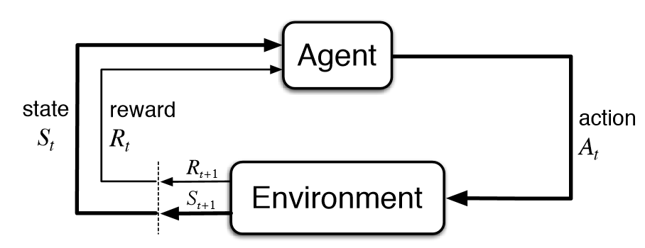

.. DO NOT EDIT.
.. THIS FILE WAS AUTOMATICALLY GENERATED BY SPHINX-GALLERY.
.. TO MAKE CHANGES, EDIT THE SOURCE PYTHON FILE:
.. "auto_examples/Reinforcement_Learning_Sensor_Manager.py"
.. LINE NUMBERS ARE GIVEN BELOW.

.. only:: html

    .. note::
        :class: sphx-glr-download-link-note

        Click :ref:`here <sphx_glr_download_auto_examples_Reinforcement_Learning_Sensor_Manager.py>`
        to download the full example code or to run this example in your browser via Binder

.. rst-class:: sphx-glr-example-title

.. _sphx_glr_auto_examples_Reinforcement_Learning_Sensor_Manager.py:

Reinforcement Learning Sensor Manager
=====================================
This example looks at how to interface a reinforcement learning framework with a Stone Soup sensor manager.

.. GENERATED FROM PYTHON SOURCE LINES 10-24

Making a Reinforcement Learning Sensor Manager
----------------------------------------------
This example introduces using a Deep Q Network (DQN) reinforcement learning (RL) sensor management algorithm
in Stone Soup.

This is compared to the performance of a brute force algorithm using the same metrics shown in the sensor
management tutorials.

This example is similar to the tutorials, simulating 3 targets and a :class:~.RadarRotatingBearingRange sensor,
which can be actioned to point in different directions.

Tensorflow-agents is used as the reinforcement learning framework. This currently only works on Linux based OSes,
or via Windows Subsystem for Linux (WSL). See Tensorflow instructions for creating environments (with GPU support
if applicable) [#]_.

.. GENERATED FROM PYTHON SOURCE LINES 24-35

.. code-block:: default

    # Some general imports and set up
    import numpy as np
    import random
    from datetime import datetime, timedelta

    start_time = datetime.now()

    from stonesoup.models.transition.linear import CombinedLinearGaussianTransitionModel, ConstantVelocity
    from stonesoup.types.groundtruth import GroundTruthPath, GroundTruthState

.. GENERATED FROM PYTHON SOURCE LINES 36-46

Generate ground truths
----------------------
Following the methods from previous Stone Soup tutorials, generate a series of combined linear Gaussian transition
models and generate ground truths. Each ground truth is offset in the y-direction by 10.

The number of targets in this simulation is defined by `ntruths` - here there are 3 targets travelling in different
directions. The time the simulation is observed for is defined by `time_max`.

We can fix our random number generator in order to probe a particular example repeatedly. To produce random examples,
comment out the next two lines.

.. GENERATED FROM PYTHON SOURCE LINES 46-80

.. code-block:: default

    np.random.seed(1990)
    random.seed(1990)

    # Generate transition model
    # i.e. fk(xk|xk-1)
    transition_model = CombinedLinearGaussianTransitionModel([ConstantVelocity(0.005),
                                                              ConstantVelocity(0.005)])

    yps = range(0, 100, 10)  # y value for prior state
    truths = []
    ntruths = 3  # number of ground truths in simulation
    time_max = 50  # timestamps the simulation is observed over

    xdirection = 1
    ydirection = 1

    # Generate ground truths
    for j in range(0, ntruths):
        truth = GroundTruthPath([GroundTruthState([0, xdirection, yps[j], ydirection],
                                                  timestamp=start_time)],
                                id=f"id{j}")

        for k in range(1, time_max):
            truth.append(
                GroundTruthState(transition_model.function(truth[k - 1], noise=True, time_interval=timedelta(seconds=1)),
                                 timestamp=start_time + timedelta(seconds=k)))
        truths.append(truth)

        # alternate directions when initiating tracks
        xdirection *= -1
        if j % 2 == 0:
            ydirection *= -1

.. GENERATED FROM PYTHON SOURCE LINES 81-82

Plot the ground truths. This is done using the :class:`~.Plotterly` class from Stone Soup.

.. GENERATED FROM PYTHON SOURCE LINES 82-92

.. code-block:: default

    from stonesoup.plotter import Plotterly

    # Stonesoup plotter requires sets not lists
    truths_set = set(truths)

    plotter = Plotterly()
    plotter.plot_ground_truths(truths_set, [0, 2])
    plotter.fig

.. raw:: html

    

    
                            
                            

                    

    

     
     

.. GENERATED FROM PYTHON SOURCE LINES 93-105

Create sensors
--------------
Create a sensor for each sensor management algorithm. This tutorial uses the
:class:`~.RadarRotatingBearingRange` sensor. This sensor is an :class:`~.Actionable` so
is capable of returning the actions it can possibly
take at a given time step and can also be given an action to take before taking
measurements.
See the Creating an Actionable Sensor Example for a more detailed explanation of actionable sensors.

The :class:`~.RadarRotatingBearingRange` has a dwell centre which is an :class:`~.ActionableProperty`
so in this case the action is changing the dwell centre to point in a specific direction.

.. GENERATED FROM PYTHON SOURCE LINES 105-135

.. code-block:: default

    from stonesoup.types.state import StateVector
    from stonesoup.sensor.radar.radar import RadarRotatingBearingRange

    sensorA = RadarRotatingBearingRange(
        position_mapping=(0, 2),
        noise_covar=np.array([[np.radians(0.5) ** 2, 0],
                              [0, 1 ** 2]]),
        ndim_state=4,
        position=np.array([[10], [0]]),
        rpm=60,
        fov_angle=np.radians(45),
        dwell_centre=StateVector([0.0]),
        max_range=np.inf
    )
    sensorA.timestamp = start_time

    sensorB = RadarRotatingBearingRange(
        position_mapping=(0, 2),
        noise_covar=np.array([[np.radians(0.5) ** 2, 0],
                              [0, 1 ** 2]]),
        ndim_state=4,
        position=np.array([[10], [0]]),
        rpm=60,
        fov_angle=np.radians(45),
        dwell_centre=StateVector([0.0]),
        max_range=np.inf
    )
    sensorB.timestamp = start_time

.. GENERATED FROM PYTHON SOURCE LINES 136-142

Create the Kalman predictor and updater
---------------------------------------
Construct a predictor and updater using the :class:`~.KalmanPredictor` and :class:`~.ExtendedKalmanUpdater`
components from Stone Soup. The :class:`~.ExtendedKalmanUpdater` is used because it can be used for both linear
and nonlinear measurement models.

.. GENERATED FROM PYTHON SOURCE LINES 142-150

.. code-block:: default

    from stonesoup.predictor.kalman import KalmanPredictor
    predictor = KalmanPredictor(transition_model)

    from stonesoup.updater.kalman import ExtendedKalmanUpdater
    updater = ExtendedKalmanUpdater(measurement_model=None)
    # measurement model is added to detections by the sensor

.. GENERATED FROM PYTHON SOURCE LINES 151-158

Run the Kalman filters
----------------------
First create `ntruths` priors which estimate the targets’ initial states, one for each target. In this example
each prior is offset by 0.5 in the y direction meaning the position of the track is initially not very accurate. The
velocity is also systematically offset by +0.5 in both the x and y directions.

.. GENERATED FROM PYTHON SOURCE LINES 158-173

.. code-block:: default

    from stonesoup.types.state import GaussianState

    priors = []
    xdirection = 1.2
    ydirection = 1.2
    for j in range(0, ntruths):
        priors.append(GaussianState([[0], [xdirection], [yps[j]+0.1], [ydirection]],
                                    np.diag([0.5, 0.5, 0.5, 0.5]+np.random.normal(0,5e-4,4)),
                                    timestamp=start_time))
        xdirection *= -1
        if j % 2 == 0:
            ydirection *= -1

.. GENERATED FROM PYTHON SOURCE LINES 174-177

Initialise the tracks by creating an empty list and appending the priors generated. This needs to be done separately
for both sensor manager methods as they will generate different sets of tracks.

.. GENERATED FROM PYTHON SOURCE LINES 177-189

.. code-block:: default

    from stonesoup.types.track import Track

    # Initialise tracks from the RandomSensorManager
    tracksA = []
    for j, prior in enumerate(priors):
        tracksA.append(Track([prior]))

    tracksB = []
    for j, prior in enumerate(priors):
        tracksB.append(Track([prior]))

.. GENERATED FROM PYTHON SOURCE LINES 190-200

Reward function
---------------
A reward function is used to quantify the benefit of sensors taking a particular action or set of actions.
This can be crafted specifically for an example in order to achieve a particular objective. The function used in
this example is quite generic but could be substituted for any callable function which returns a numeric
value that the sensor manager can maximise.

The :class:`~.UncertaintyRewardFunction` calculates the uncertainty reduction by computing the difference between the
covariance matrix norms of the
prediction, and the posterior assuming a predicted measurement corresponding to that prediction.

.. GENERATED FROM PYTHON SOURCE LINES 200-211

.. code-block:: default

    from stonesoup.hypothesiser.distance import DistanceHypothesiser
    from stonesoup.measures import Mahalanobis
    hypothesiser = DistanceHypothesiser(predictor, updater, measure=Mahalanobis(), missed_distance=5)

    from stonesoup.dataassociator.neighbour import GNNWith2DAssignment
    data_associator = GNNWith2DAssignment(hypothesiser)

    from stonesoup.sensormanager.reward import UncertaintyRewardFunction
    reward_function = UncertaintyRewardFunction(predictor=predictor, updater=updater)

.. GENERATED FROM PYTHON SOURCE LINES 212-224

Reinforcement Learning
----------------------
Reinforcement learning is when an intelligent agents make decisions to maximise a cumulative reward. First, the agent
must train in an environment to create a policy, which determines which actions to take. During training, the agent
makes decisions and receives rewards, which is uses to optimise the policy.

Once training has completed, the policy can be exploited to gain rewards.

.. GENERATED FROM PYTHON SOURCE LINES 226-236

Design Environment
------------------
An environment is needed for the RL agent to learn in. There are resources online for how to design these [#]_.

For this tutorial, a pre-designed environment has been created for you to go through.
In this example, the action space is equal to the number of targets in the simulation, so at each time step, the
sensor can select one target to look at.
The :class:`~.UncertaintyRewardFunction` is used to calculate the reward obtained for each step in the environment.
The trace of the covariances for each object is used as the observation for the agent to learn from - it should learn
to select targets with a larger covariance (higher uncertainty).

.. GENERATED FROM PYTHON SOURCE LINES 236-377

.. code-block:: default

    from abc import ABC
    import numpy as np
    import copy
    from ordered_set import OrderedSet

    from stonesoup.sensor.action.dwell_action import DwellActionsGenerator
    from stonesoup.functions import mod_bearing

    from tf_agents.environments import py_environment
    from tf_agents.specs import array_spec
    from tf_agents.trajectories import time_step as ts
    from tf_agents.environments import utils

    class StoneSoupEnv(py_environment.PyEnvironment, ABC):
        """Example reinforcement learning environment. Environments must contain __init__, _reset,
        _step, and generate_action methods
        """

        def __init__(self):
            super().__init__()
            # Action size is number of targets
            self._action_spec = array_spec.BoundedArraySpec(
                shape=(), dtype=np.int32, minimum=0, maximum=ntruths-1, name='action')
            # Observation size is also number of targets
            self.obs_size = ntruths
            self._observation_spec = array_spec.BoundedArraySpec(
                shape=(self.obs_size,), dtype=np.float32, name='observation')
            self._episode_ended = False
            self.max_episode_length = time_max
            self.current_step = 0
            self.start_time = start_time
            # Use deepcopy to prevent the original sensor/tracks being changed
            self.sensor = copy.deepcopy(sensorA)
            self.sensor.timestamp = start_time
            self.tracks = copy.deepcopy(tracksA)
        
        def action_spec(self):
            """Return action_spec."""
            return self._action_spec

        def observation_spec(self):
            """Return observation_spec."""
            return self._observation_spec

        def _reset(self):
            """Restarts the environment from the first step, resets the initial state
            and observation values, and returns an initial observation
            """
            self._episode_ended = False
            self.current_step = 0
            self.sensor = copy.deepcopy(sensorA)
            self.sensor.timestamp = start_time
            self.tracks = copy.deepcopy(tracksA)
            return ts.restart(np.zeros((self.obs_size,), dtype=np.float32))

        def _step(self, action):
            """Apply action and take one step through environment, and return new time_step.
            """

            reward = 0
            if self._episode_ended:
                # The last action ended the episode. Ignore the current action and start
                # a new episode.
                return self.reset()

            uncertainty = []
            for i, target in enumerate(self.tracks):
                # Calculate the bearing of the chosen target from the sensor
                if i == action:
                    x_target = target.state.state_vector[0]-self.sensor.position[0]
                    y_target = target.state.state_vector[2]-self.sensor.position[1]
                    bearing_target = mod_bearing(np.arctan2(y_target, x_target))

                uncertainty.append(np.trace(target.covar))

            current_timestep = self.start_time + timedelta(seconds=self.current_step)
            next_timestep = self.start_time + timedelta(seconds=self.current_step+1)

            # Create action generator which contains possible actions
            action_generator = DwellActionsGenerator(self.sensor,
                                                     attribute='dwell_centre',
                                                     start_time=current_timestep,
                                                     end_time=next_timestep)

            # Action the environment's sensor to point towards the chosen target
            current_action = [action_generator.action_from_value(bearing_target)]
            config = ({self.sensor: current_action})
            reward += reward_function(config, self.tracks, next_timestep)

            self.sensor.add_actions(current_action)
            self.sensor.act(next_timestep)

            # Calculate a measurement from the sensor
            measurement = set()
            measurement |= self.sensor.measure(OrderedSet(truth[current_timestep] for truth in truths), noise=True)
            hypotheses = data_associator.associate(self.tracks,
                                                   measurement,
                                                   current_timestep)

            for track in self.tracks:
                hypothesis = hypotheses[track]
                if hypothesis.measurement:
                    post = updater.update(hypothesis)
                    track.append(post)
                else:  # When data associator says no detections are good enough, we'll keep the prediction
                    track.append(hypothesis.prediction)

            # Set the observation as the prior uncertainty of each target
            observation = np.array(uncertainty, dtype=np.float32)

            self.current_step += 1

            if self.current_step >= self.max_episode_length-1:
                self._episode_ended = True
                return ts.termination(observation, reward)
            else:
                return ts.transition(observation, reward=reward, discount=1.0)

        @staticmethod
        def generate_action(action, tracks, sensor):
            """This method is used to convert a tf-agents action into a Stone Soup action"""
            for i, target in enumerate(tracks):
                if i == action:
                    x_target = target.state.state_vector[0]-sensor.position[0]
                    y_target = target.state.state_vector[2]-sensor.position[1]
                    action_bearing = mod_bearing(np.arctan2(y_target, x_target))

            action_generators = DwellActionsGenerator(sensor,
                                                      attribute='dwell_centre',
                                                      start_time=sensor.timestamp,
                                                      end_time=sensor.timestamp+timedelta(seconds=1))

            current_action = [action_generators.action_from_value(action_bearing)]
            return current_action

    # Validate the environment to ensure that the environment returns the expected specs
    train_env = StoneSoupEnv()
    utils.validate_py_environment(train_env, episodes=5)

.. GENERATED FROM PYTHON SOURCE LINES 378-394

RL Sensor Manager
-------------------------------------
To be able to use the RL environment we have designed, we need to make a ReinforcementSensorManager class, which
inherits from :class:~.SensorManager.

We introduce some additional methods that are used by tensorflow-agents: :func:`compute_avg_return`,
:func:`dense_layer`, and :func:`train`.  
:func:`compute_avg_return` is used to find the average reward by using a given policy. This is used to evaluate the
training.  
:func:`dense_layer` is used when generating the Q-Network, a neural network model that learns to predict Q-Values.
 
:func:`train` is used to generate the policy by running a large number of episodes through the Q-Network to work out
which actions are best.

We also need to re-define the :func:`choose_actions` method from :class:~.SensorManager to be able to interface Stone
Soup actions with tensorflow-agent actions.

.. GENERATED FROM PYTHON SOURCE LINES 394-654

.. code-block:: default

    from stonesoup.sensormanager.base import SensorManager
    from stonesoup.base import Property
    from tf_agents.environments import tf_py_environment

    class ReinforcementSensorManager(SensorManager):
        """A sensor manager that employs reinforcement learning algorithms from tensorflow-agents.
        The sensor manager trains on an environment to find an optimal policy, which is then exploited
        to choose actions.
        """
        env: py_environment.PyEnvironment = Property(doc="The environment which the agent learns the policy with.")

        def __init__(self, *args, **kwargs):
            super().__init__(*args, **kwargs)
            self.tf_env = tf_py_environment.TFPyEnvironment(self.env)
            self.test_env = tf_py_environment.TFPyEnvironment(self.env)
            self.agent = None

        @staticmethod
        def compute_avg_return(environment, policy, num_episodes=10):
            """Used to calculate the average reward over a set of episodes.

            Parameters
            ----------
            environment:
                tf-agents environment for evaluating policy on

            policy:
                tf-agents policy for choosing actions in environment

            num_episodes: int
                Number of episodes to sample over

            Returns
            -------
            : int
                average reward calculated over num_episodes

            """
            time_step = None
            episode_return = None
            total_return = 0.0
            for _ in range(num_episodes):
                time_step = environment.reset()
                episode_return = 0.0

                while not time_step.is_last():
                    action_step = policy.action(time_step)
                    time_step = environment.step(action_step.action)
                    episode_return += time_step.reward
                total_return += episode_return

            avg_return = total_return / num_episodes
            return avg_return.numpy()[0]

        @staticmethod
        def dense_layer(num_units):
            """Method for generating fully connected layers for use in the neural network.

            Parameters
            ----------
            num_units: int
                Number of nodes in dense layer

            Returns
            -------
            : tensorflow dense layer

            """
            # Define a helper function to create Dense layers configured with the right
            # activation and kernel initializer.
            return tf.keras.layers.Dense(
                num_units,
                activation=tf.keras.activations.relu,
                kernel_initializer=tf.keras.initializers.VarianceScaling(
                    scale=2.0, mode='fan_in', distribution='truncated_normal'))

        def train(self, hyper_parameters):
            """Trains a DQN agent on the specified environment to learn a policy that is later
            used to select actions.

            Parameters
            ----------
            hyper_parameters: dict
                Dictionary containing hyperparameters used in training. See tutorial for
                necessary hyperparameters.

            """
            if self.env is not None:
                self.env.reset()

                train_py_env = self.env
                eval_py_env = self.env
                self.train_env = tf_py_environment.TFPyEnvironment(train_py_env)
                self.eval_env = tf_py_environment.TFPyEnvironment(eval_py_env)

                fc_layer_params = hyper_parameters['fc_layer_params']
                action_tensor_spec = tensor_spec.from_spec(self.env.action_spec())
                num_actions = action_tensor_spec.maximum - action_tensor_spec.minimum + 1

                # QNetwork consists of a sequence of Dense layers followed by a dense layer
                # with `num_actions` units to generate one q_value per available action as
                # its output.

                dense_layers = [self.dense_layer(num_units) for num_units in fc_layer_params]
                q_values_layer = tf.keras.layers.Dense(
                    num_actions,
                    activation=None,
                    kernel_initializer=tf.keras.initializers.RandomUniform(
                        minval=-0.03, maxval=0.03),
                    bias_initializer=tf.keras.initializers.Constant(-0.2))
                q_net = sequential.Sequential(dense_layers + [q_values_layer])

                optimizer = tf.keras.optimizers.Adam(hyper_parameters['learning_rate'])

                train_step_counter = tf.Variable(0)

                self.agent = dqn_agent.DdqnAgent(
                    self.train_env.time_step_spec(),
                    self.train_env.action_spec(),
                    q_network=q_net,
                    optimizer=optimizer,
                    td_errors_loss_fn=common.element_wise_squared_loss,
                    train_step_counter=train_step_counter)

                self.agent.initialize()

                random_policy = random_tf_policy.RandomTFPolicy(self.train_env.time_step_spec(),
                                                                self.train_env.action_spec())

                # See also the metrics module for standard implementations of different metrics.
                # https://github.com/tensorflow/agents/tree/master/tf_agents/metrics

                self.compute_avg_return(self.eval_env, random_policy,
                                        hyper_parameters['num_eval_episodes'])

                table_name = 'uniform_table'
                replay_buffer_signature = tensor_spec.from_spec(
                    self.agent.collect_data_spec)
                replay_buffer_signature = tensor_spec.add_outer_dim(
                    replay_buffer_signature)

                table = reverb.Table(
                    table_name,
                    max_size=hyper_parameters['replay_buffer_max_length'],
                    sampler=reverb.selectors.Uniform(),
                    remover=reverb.selectors.Fifo(),
                    rate_limiter=reverb.rate_limiters.MinSize(1),
                    signature=replay_buffer_signature)

                reverb_server = reverb.Server([table])

                replay_buffer = reverb_replay_buffer.ReverbReplayBuffer(
                    self.agent.collect_data_spec,
                    table_name=table_name,
                    sequence_length=2,
                    local_server=reverb_server)

                rb_observer = reverb_utils.ReverbAddTrajectoryObserver(
                    replay_buffer.py_client,
                    table_name,
                    sequence_length=2)

                py_driver.PyDriver(
                    self.env,
                    py_tf_eager_policy.PyTFEagerPolicy(
                        random_policy, use_tf_function=True),
                    [rb_observer],
                    max_steps=hyper_parameters['initial_collect_steps']).run(train_py_env.reset())

                # Dataset generates trajectories with shape [Bx2x...]
                dataset = replay_buffer.as_dataset(
                    num_parallel_calls=3,
                    sample_batch_size=hyper_parameters['batch_size'],
                    num_steps=2).prefetch(3)

                iterator = iter(dataset)

                # (Optional) Optimize by wrapping some code in a graph using TF function.
                self.agent.train = common.function(self.agent.train)

                # Reset the train step.
                self.agent.train_step_counter.assign(0)

                # Evaluate the agent's policy once before training.
                avg_return = self.compute_avg_return(self.eval_env, self.agent.policy,
                                                     hyper_parameters['num_eval_episodes'])
                returns = [avg_return]

                # Reset the environment.
                time_step = train_py_env.reset()

                # Create a driver to collect experience.
                collect_driver = py_driver.PyDriver(
                    self.env,
                    py_tf_eager_policy.PyTFEagerPolicy(
                        self.agent.collect_policy, use_tf_function=True),
                    [rb_observer],
                    max_steps=hyper_parameters['collect_steps_per_iteration'])

                for _ in range(hyper_parameters['num_iterations']):
                    # Collect a few steps and save to the replay buffer.
                    time_step, _ = collect_driver.run(time_step)

                    # Sample a batch of data from the buffer and update the agent's network.
                    experience, unused_info = next(iterator)
                    train_loss = self.agent.train(experience).loss

                    step = self.agent.train_step_counter.numpy()

                    if step % hyper_parameters['log_interval'] == 0:
                        print('step = {0}: loss = {1}'.format(step, train_loss))

                    if step % hyper_parameters['eval_interval'] == 0:
                        # Agent Policy Output
                        avg_return = self.compute_avg_return(self.eval_env, self.agent.policy,
                                                             hyper_parameters['num_eval_episodes'])
                        returns.append(avg_return)
                        print('step = {0}: Average Return = {1}'.format(step, avg_return))
                        if ('max_train_reward' in hyper_parameters) and\
                                (avg_return > hyper_parameters['max_train_reward']):
                            break

                print('\n-----\nTraining complete\n-----')

        def choose_actions(self, tracks, sensors, timestamp, nchoose=1, **kwargs):
            """Returns a chosen [list of] action(s) from the action set for each sensor.
            Chosen action(s) is selected by exploiting the reinforcement learning agent's
            policy that was found during training.

            Parameters
            ----------
            tracks: set of :class:`~Track`
                Set of tracks at given time. Used in reward function.
            sensors: :class:`~Sensor`
                Sensor(s) used for observation
            timestamp: :class:`tf_agents.trajectories.TimeSpec`
                Timestep of environment at current time
            nchoose : int
                Number of actions from the set to choose (default is 1)

            Returns
            -------
            : dict
                The pairs of :class:`~.Sensor`: [:class:`~.Action`] selected
            """

            configs = [dict() for _ in range(nchoose)]
            for sensor_action_assignment in configs:
                for sensor in sensors:
                    chosen_actions = []
                    action_step = self.agent.policy.action(timestamp)
                    action = action_step.action
                    stonesoup_action = self.env.generate_action(action, tracks, sensor)
                    chosen_actions.append(stonesoup_action)
                    sensor_action_assignment[sensor] = chosen_actions

                return configs

.. GENERATED FROM PYTHON SOURCE LINES 655-659

Create Sensor Managers
----------------------
We initiate our reinforcement learning sensor manager with the environment we have designed

.. GENERATED FROM PYTHON SOURCE LINES 659-664

.. code-block:: default

    from stonesoup.sensormanager import BruteForceSensorManager
    reinforcementsensormanager = ReinforcementSensorManager({sensorA}, env=StoneSoupEnv())
    bruteforcesensormanager = BruteForceSensorManager({sensorB}, reward_function=reward_function)

.. GENERATED FROM PYTHON SOURCE LINES 665-671

Train RL agent
--------------
To generate a policy, we need to train the reinforcement learning agent using the environment we created above.
Some hyperparameters are created that the agent uses to train with.

To train the agent, the hyperparameters are passed to the train method in the :class:`~.ReinforcementSensorManager`.

.. GENERATED FROM PYTHON SOURCE LINES 671-713

.. code-block:: default

    import tensorflow as tf
    import reverb
    from tf_agents.agents.dqn import dqn_agent
    from tf_agents.drivers import py_driver
    from tf_agents.networks import sequential
    from tf_agents.policies import py_tf_eager_policy, random_tf_policy
    from tf_agents.replay_buffers import reverb_replay_buffer, reverb_utils
    from tf_agents.specs import tensor_spec
    from tf_agents.utils import common

    num_iterations = 10000

    initial_collect_steps = 100
    collect_steps_per_iteration = 1
    replay_buffer_max_length = 100000

    batch_size = 64
    learning_rate = 1e-4
    log_interval = 500

    num_eval_episodes = 10
    eval_interval = 1000
    fc_layer_params = (100, 50)

    # ---- Optional ----
    max_train_reward = 250

    hyper_parameters = {'num_iterations': num_iterations,
                        'initial_collect_steps': initial_collect_steps,
                        'collect_steps_per_iteration': collect_steps_per_iteration,
                        'replay_buffer_max_length': replay_buffer_max_length,
                        'batch_size': batch_size,
                        'learning_rate': learning_rate,
                        'log_interval': log_interval,
                        'num_eval_episodes': num_eval_episodes,
                        'eval_interval': eval_interval,
                        'fc_layer_params': fc_layer_params,
                        'max_train_reward': max_train_reward}

    reinforcementsensormanager.train(hyper_parameters)

.. rst-class:: sphx-glr-script-out

 .. code-block:: none

    WARNING:tensorflow:From /home/sgboakes/venvs/stonesoup-rl/lib/python3.10/site-packages/tensorflow/python/util/dispatch.py:1176: calling foldr_v2 (from tensorflow.python.ops.functional_ops) with back_prop=False is deprecated and will be removed in a future version.
    Instructions for updating:
    back_prop=False is deprecated. Consider using tf.stop_gradient instead.
    Instead of:
    results = tf.foldr(fn, elems, back_prop=False)
    Use:
    results = tf.nest.map_structure(tf.stop_gradient, tf.foldr(fn, elems))
    step = 500: loss = 1727.934326171875
    step = 1000: loss = 1749.6923828125
    step = 1000: Average Return = 159.75791931152344
    step = 1500: loss = 3428.916015625
    step = 2000: loss = 3601.62548828125
    step = 2000: Average Return = 91.29715728759766
    step = 2500: loss = 910.464111328125
    step = 3000: loss = 33995.375
    step = 3000: Average Return = 44.98343276977539
    step = 3500: loss = 151150.125
    step = 4000: loss = 236675.28125
    step = 4000: Average Return = 44.49712371826172
    step = 4500: loss = 95538.4296875
    step = 5000: loss = 255830.71875
    step = 5000: Average Return = 47.508697509765625
    step = 5500: loss = 35272.10546875
    step = 6000: loss = 231395.609375
    step = 6000: Average Return = 57.81113815307617
    step = 6500: loss = 54115.125
    step = 7000: loss = 25424.27734375
    step = 7000: Average Return = 122.56587982177734
    step = 7500: loss = 39500.046875
    step = 8000: loss = 879706.625
    step = 8000: Average Return = 47.48198699951172
    step = 8500: loss = 69783.6875
    step = 9000: loss = 52967.8828125
    step = 9000: Average Return = 49.471832275390625
    step = 9500: loss = 86618.609375
    step = 10000: loss = 98661.0625
    step = 10000: Average Return = 106.8991470336914

    -----
    Training complete
    -----

.. GENERATED FROM PYTHON SOURCE LINES 714-719

Run the sensor managers
-----------------------
To be able to exploit the policy generated by the reinforcement sensor manager, it  must be passed appropriate
'timesteps'.
These are distinct from the timesteps in Stonesoup, and is of the form time_step_spec from tf-agents.

.. GENERATED FROM PYTHON SOURCE LINES 719-779

.. code-block:: default

    from itertools import chain

    timesteps = []
    for state in truths[0]:
        timesteps.append(state.timestamp)

    tf_timestep = reinforcementsensormanager.test_env.reset()
    reinforcementsensormanager.env.reset()
    for timestep in timesteps[1:]:

        # Generate chosen configuration
        # i.e. {a}k
        # Need to make our own "timestamp" that matches tensorflow time_step_spec
        observation = []
        uncertainty = []
        for target in tracksA:
            x_target = target.state.state_vector[0]-sensorA.position[0]
            y_target = target.state.state_vector[2]-sensorA.position[1]
            bearing_target = mod_bearing(np.arctan2(y_target, x_target))
            uncertainty.append(np.trace(target.covar))

            # observation.append(np.degrees(bearing_target))
            observation.append(np.trace(target.covar))

        observation = np.array(uncertainty, dtype=np.float32)
        # observation = np.array(observation, dtype=np.float32)

        chosen_actions = reinforcementsensormanager.choose_actions(tracksA, [sensorA], tf_timestep)

        # Create empty dictionary for measurements
        measurementsA = []

        for chosen_action in chosen_actions:
            # chosen_action is a pair of {sensor, action}
            for sensor, actions in chosen_action.items():
                sensor.add_actions(list(chain.from_iterable(actions)))

        sensorA.act(timestep)

        # Observe this ground truth
        # i.e. {z}k
        measurements = sensorA.measure(OrderedSet(truth[timestep] for truth in truths), noise=True)
        measurementsA.extend(measurements)

        hypotheses = data_associator.associate(tracksA,
                                               measurementsA,
                                               timestep)
        for track in tracksA:
            hypothesis = hypotheses[track]
            if hypothesis.measurement:
                post = updater.update(hypothesis)
                track.append(post)
            else:  # When data associator says no detections are good enough, we'll keep the prediction
                track.append(hypothesis.prediction)

        # Propagate environment
        action_step = reinforcementsensormanager.agent.policy.action(tf_timestep)
        tf_timestep = reinforcementsensormanager.test_env.step(action_step.action)

.. GENERATED FROM PYTHON SOURCE LINES 780-781

Plot ground truths, tracks and uncertainty ellipses for each target.

.. GENERATED FROM PYTHON SOURCE LINES 781-788

.. code-block:: default

    plotterA = Plotterly()
    plotterA.plot_sensors(sensorA)
    plotterA.plot_ground_truths(truths_set, [0, 2])
    plotterA.plot_tracks(set(tracksA), [0, 2], uncertainty=True)
    plotterA.fig

.. raw:: html

    

    
                            
                            

            <script type="text/javascript">                                    window.PLOTLYENV=window.PLOTLYENV || {};                                    if (document.getElementById("ca423cae-f1c5-4bbc-9287-ca534bfeacf6")) {                    Plotly.newPlot(                        "ca423cae-f1c5-4bbc-9287-ca534bfeacf6",                        [{"legendgroup":"Sensors","legendrank":50,"marker":{"color":"black","symbol":"x"},"mode":"markers","name":"Sensors","showlegend":true,"x":[10],"y":[0],"type":"scatter"},{"legendgroup":"Ground Truth","legendrank":100,"line":{"dash":"dash"},"mode":"lines","name":"Ground Truth","showlegend":true,"text":["GroundTruthState [[ 0]\n [-1]\n [10]\n [-1]] 2023-11-06 14:13:09.419821","GroundTruthState [[-0.97331269]\n [-0.97017382]\n [ 8.99161485]\n [-1.05761107]] 2023-11-06 14:13:10.419821","GroundTruthState [[-1.92998836]\n [-0.93554483]\n [ 7.98234696]\n [-1.02752892]] 2023-11-06 14:13:11.419821","GroundTruthState [[-2.86571807]\n [-0.89867842]\n [ 6.95110088]\n [-1.11612956]] 2023-11-06 14:13:12.419821","GroundTruthState [[-3.71619402]\n [-0.8018948 ]\n [ 5.83286758]\n [-1.11578999]] 2023-11-06 14:13:13.419821","GroundTruthState [[-4.5862394 ]\n [-0.90076672]\n [ 4.70956666]\n [-1.13343868]] 2023-11-06 14:13:14.419821","GroundTruthState [[-5.41898766]\n [-0.78330007]\n [ 3.56098339]\n [-1.13095111]] 2023-11-06 14:13:15.419821","GroundTruthState [[-6.1505379 ]\n [-0.65890266]\n [ 2.42771491]\n [-1.11530977]] 2023-11-06 14:13:16.419821","GroundTruthState [[-6.82194342]\n [-0.67118719]\n [ 1.27504482]\n [-1.18266487]] 2023-11-06 14:13:17.419821","GroundTruthState [[-7.50852883]\n [-0.71284487]\n [ 0.088035  ]\n [-1.13908857]] 2023-11-06 14:13:18.419821","GroundTruthState [[-8.24090174]\n [-0.70285664]\n [-0.99644145]\n [-1.07332735]] 2023-11-06 14:13:19.419821","GroundTruthState [[-8.88040799]\n [-0.66175389]\n [-2.03106539]\n [-1.0276089 ]] 2023-11-06 14:13:20.419821","GroundTruthState [[-9.51025119]\n [-0.58721263]\n [-3.02254495]\n [-0.96083188]] 2023-11-06 14:13:21.419821","GroundTruthState [[-10.11007064]\n [ -0.56659771]\n [ -3.93607905]\n [ -0.89662898]] 2023-11-06 14:13:22.419821","GroundTruthState [[-10.64567477]\n [ -0.51761049]\n [ -4.805989  ]\n [ -0.87312855]] 2023-11-06 14:13:23.419821","GroundTruthState [[-11.26102208]\n [ -0.62123976]\n [ -5.72747725]\n [ -0.9901584 ]] 2023-11-06 14:13:24.419821","GroundTruthState [[-11.84829582]\n [ -0.58234787]\n [ -6.70126675]\n [ -1.01749089]] 2023-11-06 14:13:25.419821","GroundTruthState [[-12.45009571]\n [ -0.64311801]\n [ -7.79265588]\n [ -1.10182289]] 2023-11-06 14:13:26.419821","GroundTruthState [[-13.10924016]\n [ -0.59337747]\n [ -8.83930034]\n [ -1.09788013]] 2023-11-06 14:13:27.419821","GroundTruthState [[-13.70370885]\n [ -0.59263974]\n [ -9.9424339 ]\n [ -1.1517299 ]] 2023-11-06 14:13:28.419821","GroundTruthState [[-14.28701672]\n [ -0.60584333]\n [-11.05767272]\n [ -1.10369766]] 2023-11-06 14:13:29.419821","GroundTruthState [[-14.87167043]\n [ -0.56976892]\n [-12.17893186]\n [ -1.13722919]] 2023-11-06 14:13:30.419821","GroundTruthState [[-15.41829871]\n [ -0.54519935]\n [-13.28726932]\n [ -1.0383462 ]] 2023-11-06 14:13:31.419821","GroundTruthState [[-15.96529117]\n [ -0.55415448]\n [-14.26176762]\n [ -0.94486402]] 2023-11-06 14:13:32.419821","GroundTruthState [[-16.54117233]\n [ -0.58325428]\n [-15.1848673 ]\n [ -0.86851518]] 2023-11-06 14:13:33.419821","GroundTruthState [[-17.09771822]\n [ -0.54120127]\n [-16.0277843 ]\n [ -0.84037158]] 2023-11-06 14:13:34.419821","GroundTruthState [[-17.67185639]\n [ -0.58937755]\n [-16.88733825]\n [ -0.81871575]] 2023-11-06 14:13:35.419821","GroundTruthState [[-18.24600903]\n [ -0.58646095]\n [-17.69521444]\n [ -0.72341427]] 2023-11-06 14:13:36.419821","GroundTruthState [[-18.80640171]\n [ -0.51807645]\n [-18.37687474]\n [ -0.66872839]] 2023-11-06 14:13:37.419821","GroundTruthState [[-19.3867699 ]\n [ -0.63303611]\n [-19.05967331]\n [ -0.71732293]] 2023-11-06 14:13:38.419821","GroundTruthState [[-19.99561017]\n [ -0.63534153]\n [-19.8603715 ]\n [ -0.83334245]] 2023-11-06 14:13:39.419821","GroundTruthState [[-20.66004954]\n [ -0.70245638]\n [-20.67589631]\n [ -0.78774249]] 2023-11-06 14:13:40.419821","GroundTruthState [[-21.33091985]\n [ -0.62534133]\n [-21.50575141]\n [ -0.81009275]] 2023-11-06 14:13:41.419821","GroundTruthState [[-21.94706798]\n [ -0.55675468]\n [-22.26459692]\n [ -0.7420524 ]] 2023-11-06 14:13:42.419821","GroundTruthState [[-22.47177099]\n [ -0.55831679]\n [-22.93746593]\n [ -0.63737026]] 2023-11-06 14:13:43.419821","GroundTruthState [[-22.99452237]\n [ -0.4983036 ]\n [-23.58914318]\n [ -0.60744311]] 2023-11-06 14:13:44.419821","GroundTruthState [[-23.51182807]\n [ -0.56054356]\n [-24.16466617]\n [ -0.6010825 ]] 2023-11-06 14:13:45.419821","GroundTruthState [[-24.02380209]\n [ -0.45794134]\n [-24.80897026]\n [ -0.68968258]] 2023-11-06 14:13:46.419821","GroundTruthState [[-24.49160476]\n [ -0.47549414]\n [-25.54660556]\n [ -0.74528043]] 2023-11-06 14:13:47.419821","GroundTruthState [[-24.9621073 ]\n [ -0.42652147]\n [-26.26664965]\n [ -0.70537537]] 2023-11-06 14:13:48.419821","GroundTruthState [[-25.43002351]\n [ -0.46905983]\n [-26.95616689]\n [ -0.63311618]] 2023-11-06 14:13:49.419821","GroundTruthState [[-25.9026116 ]\n [ -0.43749882]\n [-27.56835101]\n [ -0.63773525]] 2023-11-06 14:13:50.419821","GroundTruthState [[-26.37055243]\n [ -0.49247109]\n [-28.21333413]\n [ -0.63688718]] 2023-11-06 14:13:51.419821","GroundTruthState [[-26.86243009]\n [ -0.52802774]\n [-28.8579962 ]\n [ -0.6933815 ]] 2023-11-06 14:13:52.419821","GroundTruthState [[-27.44567542]\n [ -0.69600112]\n [-29.55758816]\n [ -0.71266654]] 2023-11-06 14:13:53.419821","GroundTruthState [[-28.17655736]\n [ -0.75371671]\n [-30.23374142]\n [ -0.61417228]] 2023-11-06 14:13:54.419821","GroundTruthState [[-28.92602524]\n [ -0.7535069 ]\n [-30.84222423]\n [ -0.59350584]] 2023-11-06 14:13:55.419821","GroundTruthState [[-29.68555988]\n [ -0.69157756]\n [-31.46280431]\n [ -0.58237187]] 2023-11-06 14:13:56.419821","GroundTruthState [[-30.33191912]\n [ -0.62304843]\n [-32.09469201]\n [ -0.65858827]] 2023-11-06 14:13:57.419821","GroundTruthState [[-30.91573788]\n [ -0.55719086]\n [-32.76778953]\n [ -0.71530296]] 2023-11-06 14:13:58.419821"],"x":[0,-0.9733126895203568,-1.9299883611115223,-2.8657180675250804,-3.7161940172600274,-4.586239399139096,-5.418987655994909,-6.150537895753105,-6.821943422790228,-7.508528832039406,-8.240901737735951,-8.880407992479201,-9.510251187745395,-10.110070643730667,-10.645674765107902,-11.261022079068352,-11.848295822045774,-12.450095708612308,-13.109240164643197,-13.70370885487114,-14.287016722849371,-14.871670434909399,-15.418298709312886,-15.965291171957473,-16.541172326976096,-17.0977182177739,-17.671856387966468,-18.24600902995875,-18.806401709485876,-19.38676989868042,-19.995610172410093,-20.660049538894874,-21.330919853685486,-21.947067978338104,-22.47177099291766,-22.99452237497913,-23.511828071531216,-24.023802089388187,-24.49160476352958,-24.962107303226723,-25.430023512740835,-25.9026115969473,-26.370552429306475,-26.862430087322284,-27.44567541775362,-28.176557361308802,-28.92602524029008,-29.685559884568878,-30.331919117262476,-30.91573788497819],"y":[10,8.991614853029997,7.982346955681971,6.9511008807138,5.832867579530728,4.709566658075888,3.5609833885406927,2.427714914979377,1.27504482493505,0.08803499536513613,-0.9964414477493737,-2.0310653884947123,-3.0225449462252483,-3.9360790515393496,-4.805989002014136,-5.727477248791482,-6.7012667549729805,-7.79265588091065,-8.839300343985013,-9.94243390421377,-11.057672716535306,-12.178931858116796,-13.287269323493785,-14.26176762186834,-15.184867295163198,-16.027784299833026,-16.887338253963065,-17.695214437415107,-18.37687474243751,-19.059673310424117,-19.860371497747455,-20.675896313002223,-21.50575140645717,-22.264596923969847,-22.937465928974802,-23.589143180552643,-24.16466617186037,-24.80897025769439,-25.546605557095013,-26.26664964694905,-26.956166885460316,-27.568351014660315,-28.213334126977653,-28.85799620070116,-29.55758815678393,-30.233741418894127,-30.84222423491662,-31.462804309962106,-32.09469200729998,-32.767789530438066],"type":"scatter"},{"legendgroup":"Ground Truth","legendrank":100,"line":{"dash":"dash"},"mode":"lines","name":"Ground Truth","showlegend":false,"text":["GroundTruthState [[0]\n [1]\n [0]\n [1]] 2023-11-06 14:13:09.419821","GroundTruthState [[0.9893974 ]\n [1.04019666]\n [0.9966697 ]\n [0.98364249]] 2023-11-06 14:13:10.419821","GroundTruthState [[2.0566408 ]\n [1.07842161]\n [1.95142746]\n [0.88856775]] 2023-11-06 14:13:11.419821","GroundTruthState [[3.11671454]\n [1.11664376]\n [2.88222347]\n [0.90315265]] 2023-11-06 14:13:12.419821","GroundTruthState [[4.26392931]\n [1.17837142]\n [3.65833865]\n [0.71534604]] 2023-11-06 14:13:13.419821","GroundTruthState [[5.45818028]\n [1.22342893]\n [4.36130375]\n [0.69516906]] 2023-11-06 14:13:14.419821","GroundTruthState [[6.68569551]\n [1.2065384 ]\n [5.04972738]\n [0.70439841]] 2023-11-06 14:13:15.419821","GroundTruthState [[7.96342527]\n [1.28293561]\n [5.80271228]\n [0.70322803]] 2023-11-06 14:13:16.419821","GroundTruthState [[9.22005381]\n [1.24784341]\n [6.52965928]\n [0.67740348]] 2023-11-06 14:13:17.419821","GroundTruthState [[10.4970401 ]\n [ 1.27850448]\n [ 7.18586116]\n [ 0.61093518]] 2023-11-06 14:13:18.419821","GroundTruthState [[11.76624714]\n [ 1.29321314]\n [ 7.81272894]\n [ 0.63583035]] 2023-11-06 14:13:19.419821","GroundTruthState [[13.04149203]\n [ 1.24387687]\n [ 8.41103669]\n [ 0.61407517]] 2023-11-06 14:13:20.419821","GroundTruthState [[14.24761314]\n [ 1.175732  ]\n [ 9.02773553]\n [ 0.57707113]] 2023-11-06 14:13:21.419821","GroundTruthState [[15.5055568 ]\n [ 1.30800951]\n [ 9.62049519]\n [ 0.54781123]] 2023-11-06 14:13:22.419821","GroundTruthState [[16.84350894]\n [ 1.37406193]\n [10.18043897]\n [ 0.60362725]] 2023-11-06 14:13:23.419821","GroundTruthState [[18.29023997]\n [ 1.42859447]\n [10.78738089]\n [ 0.6375124 ]] 2023-11-06 14:13:24.419821","GroundTruthState [[19.76176224]\n [ 1.48509312]\n [11.36530267]\n [ 0.60030411]] 2023-11-06 14:13:25.419821","GroundTruthState [[21.1995444 ]\n [ 1.49561139]\n [11.95680513]\n [ 0.5615977 ]] 2023-11-06 14:13:26.419821","GroundTruthState [[22.68005004]\n [ 1.43907348]\n [12.52138507]\n [ 0.5686915 ]] 2023-11-06 14:13:27.419821","GroundTruthState [[24.16455589]\n [ 1.50782563]\n [13.11843122]\n [ 0.6621933 ]] 2023-11-06 14:13:28.419821","GroundTruthState [[25.6910055 ]\n [ 1.57152865]\n [13.82228252]\n [ 0.73038877]] 2023-11-06 14:13:29.419821","GroundTruthState [[27.30732875]\n [ 1.63147906]\n [14.5123013 ]\n [ 0.70030909]] 2023-11-06 14:13:30.419821","GroundTruthState [[28.89483697]\n [ 1.58617138]\n [15.17869687]\n [ 0.65650419]] 2023-11-06 14:13:31.419821","GroundTruthState [[30.50071609]\n [ 1.61631273]\n [15.86498254]\n [ 0.71531237]] 2023-11-06 14:13:32.419821","GroundTruthState [[32.09109934]\n [ 1.55835209]\n [16.58171794]\n [ 0.74242384]] 2023-11-06 14:13:33.419821","GroundTruthState [[33.66489693]\n [ 1.55065915]\n [17.39046221]\n [ 0.88548285]] 2023-11-06 14:13:34.419821","GroundTruthState [[35.20989565]\n [ 1.53783934]\n [18.32370725]\n [ 0.92083713]] 2023-11-06 14:13:35.419821","GroundTruthState [[36.73800758]\n [ 1.54615807]\n [19.35639459]\n [ 1.0937865 ]] 2023-11-06 14:13:36.419821","GroundTruthState [[38.27073975]\n [ 1.49801427]\n [20.43171506]\n [ 1.15836153]] 2023-11-06 14:13:37.419821","GroundTruthState [[39.75096571]\n [ 1.5066285 ]\n [21.52262819]\n [ 1.14236467]] 2023-11-06 14:13:38.419821","GroundTruthState [[41.24548882]\n [ 1.52931918]\n [22.69230073]\n [ 1.17355861]] 2023-11-06 14:13:39.419821","GroundTruthState [[42.77582282]\n [ 1.5089466 ]\n [23.84296023]\n [ 1.10822804]] 2023-11-06 14:13:40.419821","GroundTruthState [[44.324576  ]\n [ 1.54074676]\n [25.02197981]\n [ 1.25277507]] 2023-11-06 14:13:41.419821","GroundTruthState [[45.94194345]\n [ 1.61920412]\n [26.28461276]\n [ 1.25683768]] 2023-11-06 14:13:42.419821","GroundTruthState [[47.50992166]\n [ 1.51341645]\n [27.49741408]\n [ 1.19343677]] 2023-11-06 14:13:43.419821","GroundTruthState [[49.08246132]\n [ 1.58503889]\n [28.68450897]\n [ 1.15184222]] 2023-11-06 14:13:44.419821","GroundTruthState [[50.68763643]\n [ 1.62363487]\n [29.82888258]\n [ 1.07612595]] 2023-11-06 14:13:45.419821","GroundTruthState [[52.30276917]\n [ 1.64318579]\n [30.92268633]\n [ 1.08052709]] 2023-11-06 14:13:46.419821","GroundTruthState [[53.92019166]\n [ 1.54977046]\n [32.00072955]\n [ 1.03071239]] 2023-11-06 14:13:47.419821","GroundTruthState [[55.45566739]\n [ 1.5074451 ]\n [33.05149883]\n [ 1.04503274]] 2023-11-06 14:13:48.419821","GroundTruthState [[57.03749678]\n [ 1.62822223]\n [34.02357892]\n [ 0.88092875]] 2023-11-06 14:13:49.419821","GroundTruthState [[58.59353643]\n [ 1.47466537]\n [34.87495   ]\n [ 0.84122124]] 2023-11-06 14:13:50.419821","GroundTruthState [[60.09131563]\n [ 1.47229854]\n [35.75989713]\n [ 0.83104764]] 2023-11-06 14:13:51.419821","GroundTruthState [[61.58782601]\n [ 1.48668615]\n [36.53933038]\n [ 0.76080559]] 2023-11-06 14:13:52.419821","GroundTruthState [[62.98271294]\n [ 1.32691841]\n [37.33240199]\n [ 0.80034496]] 2023-11-06 14:13:53.419821","GroundTruthState [[64.34944536]\n [ 1.33652087]\n [38.22801608]\n [ 0.90148801]] 2023-11-06 14:13:54.419821","GroundTruthState [[65.63550282]\n [ 1.26943079]\n [39.12023134]\n [ 0.91232777]] 2023-11-06 14:13:55.419821","GroundTruthState [[66.83967525]\n [ 1.16216225]\n [40.02282423]\n [ 0.87937327]] 2023-11-06 14:13:56.419821","GroundTruthState [[68.08305509]\n [ 1.28770974]\n [40.93268054]\n [ 0.94518308]] 2023-11-06 14:13:57.419821","GroundTruthState [[69.38695617]\n [ 1.30224267]\n [41.96722493]\n [ 1.08321919]] 2023-11-06 14:13:58.419821"],"x":[0,0.9893973973614787,2.056640804389175,3.1167145352158516,4.263929313923897,5.458180282304253,6.685695510587328,7.963425265880301,9.220053805032439,10.49704010040622,11.766247140091682,13.041492032835848,14.247613142391273,15.505556798891705,16.843508936172633,18.29023997441558,19.76176223640003,21.19954439973072,22.680050044165018,24.164555889410998,25.691005496856036,27.307328754439766,28.89483697482363,30.50071608707973,32.09109934034874,33.66489692991074,35.209895653560906,36.738007576946956,38.27073975294268,39.750965708166795,41.2454888234644,42.77582282415579,44.32457599663492,45.94194344693898,47.509921658990365,49.082461323915325,50.68763643430976,52.302769166234604,53.92019166091384,55.455667389337165,57.03749678252632,58.593536428171,60.09131562753373,61.587826005265505,62.982712938165854,64.34944535591872,65.63550282406126,66.8396752484983,68.08305508619615,69.38695616676095],"y":[0,0.9966696960883556,1.951427457273027,2.88222347458036,3.6583386466698524,4.361303750748592,5.04972738444826,5.802712280233346,6.529659280162841,7.185861161861761,7.812728936597637,8.411036690371045,9.027735527766401,9.620495192710852,10.180438974680264,10.787380890738154,11.365302671649763,11.956805125507792,12.52138507180686,13.118431223930136,13.822282518372841,14.512301299068438,15.178696872430798,15.864982540160376,16.58171794333089,17.390462212021927,18.32370724837566,19.35639458777209,20.431715064495968,21.52262819048583,22.692300727232144,23.842960229220232,25.02197980982772,26.284612761432548,27.497414076520847,28.6845089719183,29.828882575596577,30.922686327207302,32.00072955400686,33.05149882702067,34.02357892033132,34.87495000336286,35.7598971302576,36.53933038326331,37.33240198828703,38.22801607840703,39.1202313351066,40.02282423348028,40.93268053629052,41.96722493186914],"type":"scatter"},{"legendgroup":"Ground Truth","legendrank":100,"line":{"dash":"dash"},"mode":"lines","name":"Ground Truth","showlegend":false,"text":["GroundTruthState [[ 0]\n [ 1]\n [20]\n [-1]] 2023-11-06 14:13:09.419821","GroundTruthState [[ 1.01664956]\n [ 0.95331305]\n [19.048748  ]\n [-0.95661609]] 2023-11-06 14:13:10.419821","GroundTruthState [[ 2.0234389 ]\n [ 1.02310869]\n [18.12737158]\n [-0.9549    ]] 2023-11-06 14:13:11.419821","GroundTruthState [[ 2.98368337]\n [ 0.9453227 ]\n [17.20566838]\n [-0.90353668]] 2023-11-06 14:13:12.419821","GroundTruthState [[ 3.89284343]\n [ 0.84879909]\n [16.34263949]\n [-0.88381206]] 2023-11-06 14:13:13.419821","GroundTruthState [[ 4.7838522 ]\n [ 0.89030971]\n [15.42077734]\n [-0.9099168 ]] 2023-11-06 14:13:14.419821","GroundTruthState [[ 5.66559253]\n [ 0.86954678]\n [14.49343659]\n [-0.94151729]] 2023-11-06 14:13:15.419821","GroundTruthState [[ 6.48259142]\n [ 0.73944795]\n [13.57072994]\n [-0.94276991]] 2023-11-06 14:13:16.419821","GroundTruthState [[ 7.24196938]\n [ 0.74241915]\n [12.57018224]\n [-1.09039692]] 2023-11-06 14:13:17.419821","GroundTruthState [[ 7.94444019]\n [ 0.69032166]\n [11.45812014]\n [-1.10262923]] 2023-11-06 14:13:18.419821","GroundTruthState [[ 8.61851286]\n [ 0.73677701]\n [10.38335313]\n [-1.01927772]] 2023-11-06 14:13:19.419821","GroundTruthState [[ 9.33648512]\n [ 0.71000879]\n [ 9.31861278]\n [-1.07988216]] 2023-11-06 14:13:20.419821","GroundTruthState [[10.09372855]\n [ 0.7546838 ]\n [ 8.22048775]\n [-1.09046297]] 2023-11-06 14:13:21.419821","GroundTruthState [[10.76789539]\n [ 0.71968476]\n [ 7.1405317 ]\n [-1.08649472]] 2023-11-06 14:13:22.419821","GroundTruthState [[11.50328491]\n [ 0.81532796]\n [ 6.06751257]\n [-1.07229845]] 2023-11-06 14:13:23.419821","GroundTruthState [[12.29349198]\n [ 0.70327367]\n [ 5.04049097]\n [-1.05250744]] 2023-11-06 14:13:24.419821","GroundTruthState [[13.02356486]\n [ 0.75286845]\n [ 3.93096712]\n [-1.12829009]] 2023-11-06 14:13:25.419821","GroundTruthState [[13.77094906]\n [ 0.77513203]\n [ 2.85015376]\n [-1.03602258]] 2023-11-06 14:13:26.419821","GroundTruthState [[14.53090456]\n [ 0.73550647]\n [ 1.7897566 ]\n [-1.08463173]] 2023-11-06 14:13:27.419821","GroundTruthState [[15.26179298]\n [ 0.68756649]\n [ 0.76202357]\n [-0.96698838]] 2023-11-06 14:13:28.419821","GroundTruthState [[15.92572884]\n [ 0.66916281]\n [-0.24439345]\n [-1.08485362]] 2023-11-06 14:13:29.419821","GroundTruthState [[16.61049486]\n [ 0.71036273]\n [-1.27859491]\n [-0.9222305 ]] 2023-11-06 14:13:30.419821","GroundTruthState [[17.31521851]\n [ 0.72268963]\n [-2.24052528]\n [-1.00163062]] 2023-11-06 14:13:31.419821","GroundTruthState [[17.99114285]\n [ 0.62951184]\n [-3.2528789 ]\n [-1.06732284]] 2023-11-06 14:13:32.419821","GroundTruthState [[18.55981321]\n [ 0.56095385]\n [-4.26943821]\n [-0.98287027]] 2023-11-06 14:13:33.419821","GroundTruthState [[19.0739405 ]\n [ 0.40925403]\n [-5.26866194]\n [-0.9836899 ]] 2023-11-06 14:13:34.419821","GroundTruthState [[19.489778  ]\n [ 0.44850559]\n [-6.25584635]\n [-0.95416282]] 2023-11-06 14:13:35.419821","GroundTruthState [[19.91433897]\n [ 0.42772067]\n [-7.15013337]\n [-0.92284898]] 2023-11-06 14:13:36.419821","GroundTruthState [[20.37844333]\n [ 0.46509633]\n [-8.07531556]\n [-0.88282286]] 2023-11-06 14:13:37.419821","GroundTruthState [[20.84303393]\n [ 0.48118335]\n [-8.99454563]\n [-0.93914894]] 2023-11-06 14:13:38.419821","GroundTruthState [[21.26361848]\n [ 0.40397784]\n [-9.93182099]\n [-0.95629512]] 2023-11-06 14:13:39.419821","GroundTruthState [[ 21.68854156]\n [  0.4895365 ]\n [-10.93915268]\n [ -1.03626681]] 2023-11-06 14:13:40.419821","GroundTruthState [[ 22.21666611]\n [  0.58920782]\n [-12.05210149]\n [ -1.09747256]] 2023-11-06 14:13:41.419821","GroundTruthState [[ 22.86032881]\n [  0.64495785]\n [-13.17759538]\n [ -1.17405215]] 2023-11-06 14:13:42.419821","GroundTruthState [[ 23.51428241]\n [  0.74587544]\n [-14.30507196]\n [ -1.11718007]] 2023-11-06 14:13:43.419821","GroundTruthState [[ 24.22942226]\n [  0.77506168]\n [-15.40841721]\n [ -1.06210557]] 2023-11-06 14:13:44.419821","GroundTruthState [[ 25.00274504]\n [  0.78121102]\n [-16.45153373]\n [ -1.02692197]] 2023-11-06 14:13:45.419821","GroundTruthState [[ 25.77068654]\n [  0.73321492]\n [-17.45446742]\n [ -1.04382273]] 2023-11-06 14:13:46.419821","GroundTruthState [[ 26.55827041]\n [  0.84772749]\n [-18.51015281]\n [ -1.0404462 ]] 2023-11-06 14:13:47.419821","GroundTruthState [[ 27.45993311]\n [  0.97286031]\n [-19.56553762]\n [ -1.05724252]] 2023-11-06 14:13:48.419821","GroundTruthState [[ 28.52103444]\n [  1.11460941]\n [-20.63873242]\n [ -1.07290545]] 2023-11-06 14:13:49.419821","GroundTruthState [[ 29.67773278]\n [  1.15317256]\n [-21.69918712]\n [ -1.10430288]] 2023-11-06 14:13:50.419821","GroundTruthState [[ 30.79331516]\n [  1.05878299]\n [-22.77009966]\n [ -1.04696073]] 2023-11-06 14:13:51.419821","GroundTruthState [[ 31.83133315]\n [  1.03895768]\n [-23.78234508]\n [ -0.94740636]] 2023-11-06 14:13:52.419821","GroundTruthState [[ 32.83462379]\n [  0.93930877]\n [-24.75678008]\n [ -0.97059465]] 2023-11-06 14:13:53.419821","GroundTruthState [[ 33.7416144 ]\n [  0.90507563]\n [-25.768665  ]\n [ -1.07769544]] 2023-11-06 14:13:54.419821","GroundTruthState [[ 34.60748533]\n [  0.83986419]\n [-26.84737664]\n [ -1.11894447]] 2023-11-06 14:13:55.419821","GroundTruthState [[ 35.43852866]\n [  0.82612719]\n [-27.98527142]\n [ -1.14822192]] 2023-11-06 14:13:56.419821","GroundTruthState [[ 36.27889145]\n [  0.83134103]\n [-29.10251303]\n [ -1.16716492]] 2023-11-06 14:13:57.419821","GroundTruthState [[ 37.04778808]\n [  0.75236725]\n [-30.28831714]\n [ -1.24278467]] 2023-11-06 14:13:58.419821"],"x":[0,1.0166495558337476,2.023438902842779,2.9836833656399833,3.8928434346880194,4.78385219866485,5.665592526502125,6.482591420201845,7.241969380629406,7.9444401922997985,8.618512861528655,9.336485118352984,10.093728547369672,10.767895390937959,11.50328491302578,12.293491982916642,13.023564864253302,13.770949062250581,14.530904560975381,15.261792984097141,15.9257288444309,16.61049485904189,17.31521851303341,17.9911428476105,18.559813209444265,19.073940496500665,19.489778004392445,19.914338974525304,20.378443334339693,20.843033925213863,21.263618475466988,21.688541562884048,22.21666610572574,22.860328806635952,23.514282412223288,24.229422260169716,25.002745039697643,25.770686539312653,26.558270405404695,27.45993310585353,28.52103444435865,29.677732775871124,30.793315155256796,31.831333147907834,32.834623791075295,33.741614399925616,34.60748533018476,35.438528660597754,36.278891449461454,37.047788076020026],"y":[20,19.048748001295184,18.127371582844344,17.205668378429465,16.342639491932996,15.420777343390965,14.493436593175455,13.57072993676291,12.570182239918958,11.45812013599411,10.383353130721625,9.31861278110823,8.220487749566017,7.140531698267381,6.067512565108187,5.040490967599949,3.9309671184067088,2.850153759696182,1.7897565991307627,0.7620235729034426,-0.24439344633287202,-1.2785949064997184,-2.2405252802971667,-3.252878903662942,-4.269438205878609,-5.268661937904412,-6.25584634772372,-7.150133366046742,-8.075315558666624,-8.994545629710698,-9.931820993942685,-10.939152682964412,-12.05210148662359,-13.177595383624208,-14.305071956353922,-15.408417213765102,-16.4515337278963,-17.4544674244681,-18.51015280813566,-19.56553762050416,-20.638732421493557,-21.699187119176653,-22.77009966476415,-23.78234507742334,-24.756780083270822,-25.768664998892337,-26.847376643272735,-27.985271423048307,-29.10251303246006,-30.288317135906638],"type":"scatter"},{"legendgroup":"Tracks","legendrank":300,"marker":{"symbol":["circle","circle","circle","square","square","square","square","square","square","circle","circle","circle","circle","circle","circle","circle","circle","square","square","circle","circle","circle","circle","circle","square","circle","circle","circle","circle","circle","circle","circle","circle","square","square","circle","circle","circle","circle","circle","square","square","circle","circle","circle","circle","circle","square","square","circle"]},"mode":"markers+lines","name":"Tracks","showlegend":true,"text":["GaussianState [[0. ]\n [1.2]\n [0.1]\n [1.2]] 2023-11-06 14:13:09.419821","GaussianStatePrediction [[1.2]\n [1.2]\n [1.3]\n [1.2]] 2023-11-06 14:13:10.419821","GaussianStatePrediction [[2.4]\n [1.2]\n [2.5]\n [1.2]] 2023-11-06 14:13:11.419821","GaussianStateUpdate [[2.70930556]\n [0.93120412]\n [3.1678758 ]\n [1.03941154]] 2023-11-06 14:13:12.419821","GaussianStateUpdate [[3.88801685]\n [0.97437269]\n [3.98888568]\n [0.9445128 ]] 2023-11-06 14:13:13.419821","GaussianStateUpdate [[4.8855838 ]\n [0.97809595]\n [4.91145999]\n [0.93714697]] 2023-11-06 14:13:14.419821","GaussianStateUpdate [[6.35051967]\n [1.16023667]\n [5.57694269]\n [0.88133202]] 2023-11-06 14:13:15.419821","GaussianStateUpdate [[7.94911776]\n [1.26662093]\n [5.91341364]\n [0.74177015]] 2023-11-06 14:13:16.419821","GaussianStateUpdate [[9.22163216]\n [1.23266775]\n [6.49800744]\n [0.70582467]] 2023-11-06 14:13:17.419821","GaussianStatePrediction [[10.45429991]\n [ 1.23266775]\n [ 7.20383211]\n [ 0.70582467]] 2023-11-06 14:13:18.419821","GaussianStatePrediction [[11.68696766]\n [ 1.23266775]\n [ 7.90965678]\n [ 0.70582467]] 2023-11-06 14:13:19.419821","GaussianStatePrediction [[12.91963541]\n [ 1.23266775]\n [ 8.61548145]\n [ 0.70582467]] 2023-11-06 14:13:20.419821","GaussianStatePrediction [[14.15230315]\n [ 1.23266775]\n [ 9.32130612]\n [ 0.70582467]] 2023-11-06 14:13:21.419821","GaussianStatePrediction [[15.3849709 ]\n [ 1.23266775]\n [10.02713079]\n [ 0.70582467]] 2023-11-06 14:13:22.419821","GaussianStatePrediction [[16.61763865]\n [ 1.23266775]\n [10.73295546]\n [ 0.70582467]] 2023-11-06 14:13:23.419821","GaussianStatePrediction [[17.8503064 ]\n [ 1.23266775]\n [11.43878013]\n [ 0.70582467]] 2023-11-06 14:13:24.419821","GaussianStatePrediction [[19.08297415]\n [ 1.23266775]\n [12.14460481]\n [ 0.70582467]] 2023-11-06 14:13:25.419821","GaussianStateUpdate [[20.66444078]\n [ 1.28352884]\n [11.60559769]\n [ 0.55884817]] 2023-11-06 14:13:26.419821","GaussianStateUpdate [[22.55019953]\n [ 1.41406898]\n [12.58274352]\n [ 0.55704294]] 2023-11-06 14:13:27.419821","GaussianStatePrediction [[23.96426851]\n [ 1.41406898]\n [13.13978646]\n [ 0.55704294]] 2023-11-06 14:13:28.419821","GaussianStatePrediction [[25.37833748]\n [ 1.41406898]\n [13.69682941]\n [ 0.55704294]] 2023-11-06 14:13:29.419821","GaussianStatePrediction [[26.79240646]\n [ 1.41406898]\n [14.25387235]\n [ 0.55704294]] 2023-11-06 14:13:30.419821","GaussianStatePrediction [[28.20647544]\n [ 1.41406898]\n [14.8109153 ]\n [ 0.55704294]] 2023-11-06 14:13:31.419821","GaussianStatePrediction [[29.62054442]\n [ 1.41406898]\n [15.36795824]\n [ 0.55704294]] 2023-11-06 14:13:32.419821","GaussianStateUpdate [[32.11356755]\n [ 1.56161212]\n [16.51449273]\n [ 0.60932971]] 2023-11-06 14:13:33.419821","GaussianStatePrediction [[33.67517966]\n [ 1.56161212]\n [17.12382244]\n [ 0.60932971]] 2023-11-06 14:13:34.419821","GaussianStatePrediction [[35.23679178]\n [ 1.56161212]\n [17.73315215]\n [ 0.60932971]] 2023-11-06 14:13:35.419821","GaussianStatePrediction [[36.7984039 ]\n [ 1.56161212]\n [18.34248187]\n [ 0.60932971]] 2023-11-06 14:13:36.419821","GaussianStatePrediction [[38.36001602]\n [ 1.56161212]\n [18.95181158]\n [ 0.60932971]] 2023-11-06 14:13:37.419821","GaussianStatePrediction [[39.92162814]\n [ 1.56161212]\n [19.56114129]\n [ 0.60932971]] 2023-11-06 14:13:38.419821","GaussianStatePrediction [[41.48324026]\n [ 1.56161212]\n [20.170471  ]\n [ 0.60932971]] 2023-11-06 14:13:39.419821","GaussianStatePrediction [[43.04485237]\n [ 1.56161212]\n [20.77980072]\n [ 0.60932971]] 2023-11-06 14:13:40.419821","GaussianStatePrediction [[44.60646449]\n [ 1.56161212]\n [21.38913043]\n [ 0.60932971]] 2023-11-06 14:13:41.419821","GaussianStateUpdate [[45.57813739]\n [ 1.42612629]\n [26.27995197]\n [ 1.13539442]] 2023-11-06 14:13:42.419821","GaussianStateUpdate [[47.67723385]\n [ 1.50332962]\n [27.73224684]\n [ 1.16168126]] 2023-11-06 14:13:43.419821","GaussianStatePrediction [[49.18056347]\n [ 1.50332962]\n [28.89392809]\n [ 1.16168126]] 2023-11-06 14:13:44.419821","GaussianStatePrediction [[50.68389309]\n [ 1.50332962]\n [30.05560935]\n [ 1.16168126]] 2023-11-06 14:13:45.419821","GaussianStatePrediction [[52.18722271]\n [ 1.50332962]\n [31.2172906 ]\n [ 1.16168126]] 2023-11-06 14:13:46.419821","GaussianStatePrediction [[53.69055233]\n [ 1.50332962]\n [32.37897186]\n [ 1.16168126]] 2023-11-06 14:13:47.419821","GaussianStatePrediction [[55.19388195]\n [ 1.50332962]\n [33.54065311]\n [ 1.16168126]] 2023-11-06 14:13:48.419821","GaussianStateUpdate [[58.13558707]\n [ 1.7034096 ]\n [34.55065226]\n [ 1.11052007]] 2023-11-06 14:13:49.419821","GaussianStateUpdate [[59.83261731]\n [ 1.70478517]\n [35.56927676]\n [ 1.09542645]] 2023-11-06 14:13:50.419821","GaussianStatePrediction [[61.53740248]\n [ 1.70478517]\n [36.66470321]\n [ 1.09542645]] 2023-11-06 14:13:51.419821","GaussianStatePrediction [[63.24218765]\n [ 1.70478517]\n [37.76012967]\n [ 1.09542645]] 2023-11-06 14:13:52.419821","GaussianStatePrediction [[64.94697282]\n [ 1.70478517]\n [38.85555612]\n [ 1.09542645]] 2023-11-06 14:13:53.419821","GaussianStatePrediction [[66.65175799]\n [ 1.70478517]\n [39.95098257]\n [ 1.09542645]] 2023-11-06 14:13:54.419821","GaussianStatePrediction [[68.35654316]\n [ 1.70478517]\n [41.04640902]\n [ 1.09542645]] 2023-11-06 14:13:55.419821","GaussianStateUpdate [[66.63387508]\n [ 1.27195004]\n [40.4521532 ]\n [ 0.90276258]] 2023-11-06 14:13:56.419821","GaussianStateUpdate [[67.87833644]\n [ 1.26957543]\n [41.26276246]\n [ 0.88916869]] 2023-11-06 14:13:57.419821","GaussianStatePrediction [[69.14791188]\n [ 1.26957543]\n [42.15193115]\n [ 0.88916869]] 2023-11-06 14:13:58.419821"],"x":[0.0,1.2,2.4,2.7093055556798076,3.8880168484844915,4.885583796662018,6.350519672583108,7.9491177640001665,9.221632158769406,10.45429990763496,11.686967656500514,12.919635405366067,14.152303154231621,15.384970903097175,16.61763865196273,17.850306400828284,19.08297414969384,20.66444078426487,22.550199527982652,23.964268506250058,25.378337484517463,26.792406462784868,28.206475441052273,29.62054441931968,32.11356754505526,33.67517966339836,35.23679178174146,36.79840390008456,38.36001601842766,39.92162813677076,41.483240255113856,43.044852373456955,44.606464491800054,45.578137389389724,47.67723385076941,49.18056347086292,50.68389309095643,52.18722271104994,53.69055233114345,55.19388195123696,58.135587068900094,59.832617313497124,61.53740248232718,63.24218765115724,64.9469728199873,66.65175798881735,68.35654315764741,66.63387507661466,67.8783364448678,69.14791187564579],"y":[0.1,1.3,2.5,3.167875796756518,3.988885677021421,4.911459987462817,5.576942689679612,5.913413643134944,6.498007441516687,7.203832111962827,7.909656782408968,8.615481452855109,9.32130612330125,10.027130793747391,10.732955464193532,11.438780134639673,12.144604805085814,11.60559768760527,12.582743520579434,13.139786464703885,13.696829408828336,14.253872352952786,14.810915297077237,15.367958241201688,16.51449272800594,17.123822440591514,17.733152153177087,18.34248186576266,18.951811578348234,19.561141290933808,20.17047100351938,20.779800716104955,21.389130428690528,26.279951967337215,27.732246839118535,28.89392809412212,30.055609349125707,31.217290604129293,32.37897185913288,33.54065311413647,34.55065225773344,35.56927676410508,36.66470321470657,37.76012966530806,38.85555611590954,39.95098256651103,41.046409017112516,40.4521531991899,41.2627624594889,42.151931148215596],"type":"scatter"},{"legendgroup":"Tracks","legendrank":300,"marker":{"symbol":["circle","square","square","circle","circle","circle","square","square","square","circle","circle","square","square","square","circle","circle","circle","square","circle","circle","circle","circle","circle","square","circle","circle","circle","square","square","circle","circle","circle","circle","circle","circle","square","square","circle","circle","circle","circle","circle","square","square","circle","circle","circle","circle","circle","square"]},"mode":"markers+lines","name":"a781001e-e46b-4d77-b4fe-28f64a4fdff3","showlegend":false,"text":["GaussianState [[ 0. ]\n [ 1.2]\n [20.1]\n [-1.2]] 2023-11-06 14:13:09.419821","GaussianStateUpdate [[ 0.70797334]\n [ 0.95307472]\n [19.63141142]\n [-0.83288386]] 2023-11-06 14:13:10.419821","GaussianStateUpdate [[ 2.41978595]\n [ 1.30811379]\n [17.22200182]\n [-1.55010915]] 2023-11-06 14:13:11.419821","GaussianStatePrediction [[ 3.72789974]\n [ 1.30811379]\n [15.67189267]\n [-1.55010915]] 2023-11-06 14:13:12.419821","GaussianStatePrediction [[ 5.03601353]\n [ 1.30811379]\n [14.12178353]\n [-1.55010915]] 2023-11-06 14:13:13.419821","GaussianStatePrediction [[ 6.34412732]\n [ 1.30811379]\n [12.57167438]\n [-1.55010915]] 2023-11-06 14:13:14.419821","GaussianStateUpdate [[ 6.44469497]\n [ 1.06049961]\n [12.45608641]\n [-1.29122747]] 2023-11-06 14:13:15.419821","GaussianStateUpdate [[ 6.91809063]\n [ 0.8736674 ]\n [12.80511193]\n [-1.01005181]] 2023-11-06 14:13:16.419821","GaussianStateUpdate [[ 7.45235257]\n [ 0.75991459]\n [12.72499052]\n [-0.85886323]] 2023-11-06 14:13:17.419821","GaussianStatePrediction [[ 8.21226716]\n [ 0.75991459]\n [11.86612729]\n [-0.85886323]] 2023-11-06 14:13:18.419821","GaussianStatePrediction [[ 8.97218175]\n [ 0.75991459]\n [11.00726406]\n [-0.85886323]] 2023-11-06 14:13:19.419821","GaussianStateUpdate [[ 9.25452527]\n [ 0.62094398]\n [10.69625431]\n [-0.78294435]] 2023-11-06 14:13:20.419821","GaussianStateUpdate [[10.09031005]\n [ 0.73961619]\n [ 9.75733212]\n [-0.81958963]] 2023-11-06 14:13:21.419821","GaussianStateUpdate [[10.82343934]\n [ 0.72864053]\n [ 8.29789905]\n [-0.92434199]] 2023-11-06 14:13:22.419821","GaussianStatePrediction [[11.55207987]\n [ 0.72864053]\n [ 7.37355706]\n [-0.92434199]] 2023-11-06 14:13:23.419821","GaussianStatePrediction [[12.28072039]\n [ 0.72864053]\n [ 6.44921507]\n [-0.92434199]] 2023-11-06 14:13:24.419821","GaussianStatePrediction [[13.00936092]\n [ 0.72864053]\n [ 5.52487308]\n [-0.92434199]] 2023-11-06 14:13:25.419821","GaussianStateUpdate [[14.05449439]\n [ 0.83914182]\n [ 2.87458335]\n [-1.20748781]] 2023-11-06 14:13:26.419821","GaussianStatePrediction [[14.89363621]\n [ 0.83914182]\n [ 1.66709554]\n [-1.20748781]] 2023-11-06 14:13:27.419821","GaussianStatePrediction [[15.73277803]\n [ 0.83914182]\n [ 0.45960773]\n [-1.20748781]] 2023-11-06 14:13:28.419821","GaussianStatePrediction [[16.57191985]\n [ 0.83914182]\n [-0.74788009]\n [-1.20748781]] 2023-11-06 14:13:29.419821","GaussianStatePrediction [[17.41106168]\n [ 0.83914182]\n [-1.9553679 ]\n [-1.20748781]] 2023-11-06 14:13:30.419821","GaussianStatePrediction [[18.2502035 ]\n [ 0.83914182]\n [-3.16285572]\n [-1.20748781]] 2023-11-06 14:13:31.419821","GaussianStateUpdate [[18.24003567]\n [ 0.66735765]\n [-3.20553304]\n [-0.96408231]] 2023-11-06 14:13:32.419821","GaussianStatePrediction [[18.90739332]\n [ 0.66735765]\n [-4.16961535]\n [-0.96408231]] 2023-11-06 14:13:33.419821","GaussianStatePrediction [[19.57475097]\n [ 0.66735765]\n [-5.13369766]\n [-0.96408231]] 2023-11-06 14:13:34.419821","GaussianStatePrediction [[20.24210862]\n [ 0.66735765]\n [-6.09777997]\n [-0.96408231]] 2023-11-06 14:13:35.419821","GaussianStateUpdate [[19.59003258]\n [ 0.43939686]\n [-7.03103633]\n [-1.02389721]] 2023-11-06 14:13:36.419821","GaussianStateUpdate [[20.28698713]\n [ 0.49063932]\n [-8.12966086]\n [-1.01516939]] 2023-11-06 14:13:37.419821","GaussianStatePrediction [[20.77762645]\n [ 0.49063932]\n [-9.14483025]\n [-1.01516939]] 2023-11-06 14:13:38.419821","GaussianStatePrediction [[ 21.26826577]\n [  0.49063932]\n [-10.15999963]\n [ -1.01516939]] 2023-11-06 14:13:39.419821","GaussianStatePrediction [[ 21.7589051 ]\n [  0.49063932]\n [-11.17516902]\n [ -1.01516939]] 2023-11-06 14:13:40.419821","GaussianStatePrediction [[ 22.24954442]\n [  0.49063932]\n [-12.1903384 ]\n [ -1.01516939]] 2023-11-06 14:13:41.419821","GaussianStatePrediction [[ 22.74018374]\n [  0.49063932]\n [-13.20550779]\n [ -1.01516939]] 2023-11-06 14:13:42.419821","GaussianStatePrediction [[ 23.23082307]\n [  0.49063932]\n [-14.22067717]\n [ -1.01516939]] 2023-11-06 14:13:43.419821","GaussianStateUpdate [[ 24.2155502 ]\n [  0.5534864 ]\n [-15.47840491]\n [ -1.03849054]] 2023-11-06 14:13:44.419821","GaussianStateUpdate [[ 24.79276383]\n [  0.59204226]\n [-16.25955938]\n [ -0.97892085]] 2023-11-06 14:13:45.419821","GaussianStatePrediction [[ 25.38480609]\n [  0.59204226]\n [-17.23848023]\n [ -0.97892085]] 2023-11-06 14:13:46.419821","GaussianStatePrediction [[ 25.97684835]\n [  0.59204226]\n [-18.21740108]\n [ -0.97892085]] 2023-11-06 14:13:47.419821","GaussianStatePrediction [[ 26.56889061]\n [  0.59204226]\n [-19.19632194]\n [ -0.97892085]] 2023-11-06 14:13:48.419821","GaussianStatePrediction [[ 27.16093287]\n [  0.59204226]\n [-20.17524279]\n [ -0.97892085]] 2023-11-06 14:13:49.419821","GaussianStatePrediction [[ 27.75297513]\n [  0.59204226]\n [-21.15416364]\n [ -0.97892085]] 2023-11-06 14:13:50.419821","GaussianStateUpdate [[ 29.7366688 ]\n [  0.83912978]\n [-21.3805872 ]\n [ -0.82510653]] 2023-11-06 14:13:51.419821","GaussianStateUpdate [[ 30.9029701 ]\n [  0.88391041]\n [-22.55754958]\n [ -0.86868733]] 2023-11-06 14:13:52.419821","GaussianStatePrediction [[ 31.78688051]\n [  0.88391041]\n [-23.42623691]\n [ -0.86868733]] 2023-11-06 14:13:53.419821","GaussianStatePrediction [[ 32.67079092]\n [  0.88391041]\n [-24.29492424]\n [ -0.86868733]] 2023-11-06 14:13:54.419821","GaussianStatePrediction [[ 33.55470133]\n [  0.88391041]\n [-25.16361157]\n [ -0.86868733]] 2023-11-06 14:13:55.419821","GaussianStatePrediction [[ 34.43861174]\n [  0.88391041]\n [-26.03229889]\n [ -0.86868733]] 2023-11-06 14:13:56.419821","GaussianStatePrediction [[ 35.32252216]\n [  0.88391041]\n [-26.90098622]\n [ -0.86868733]] 2023-11-06 14:13:57.419821","GaussianStateUpdate [[ 36.9068411 ]\n [  0.94398472]\n [-29.50389358]\n [ -1.10573861]] 2023-11-06 14:13:58.419821"],"x":[0.0,0.707973342883149,2.419785950728595,3.72789974211634,5.036013533504084,6.344127324891828,6.444694967160701,6.9180906257980395,7.452352571945782,8.21226715998785,8.972181748029918,9.254525265537861,10.090310048963074,10.823439341076014,11.552079867491317,12.28072039390662,13.009360920321923,14.054494385140531,14.893636208302958,15.732778031465385,16.57191985462781,17.411061677790237,18.25020350095266,18.240035669896912,18.907393321204072,19.574750972511232,20.242108623818392,19.59003257718035,20.286987125180325,20.777626448546272,21.26826577191222,21.758905095278166,22.249544418644113,22.74018374201006,23.230823065376008,24.21555019898135,24.79276383217829,25.38480609251009,25.97684835284189,26.568890613173693,27.160932873505494,27.752975133837296,29.73666879835265,30.902970095256943,31.78688050760448,32.67079091995201,33.554701332299544,34.438611744647076,35.32252215699461,36.90684109610775],"y":[20.1,19.631411418540527,17.222001819721417,15.671892674658778,14.12178352959614,12.571674384533502,12.45608641360629,12.805111925920972,12.7249905206216,11.866127291824942,11.007264063028284,10.696254314225492,9.757332119150881,8.297899045172235,7.373557056274123,6.449215067376011,5.524873078477899,2.87458335262009,1.667095539045426,0.45960772547076223,-0.7478800881039016,-1.9553679016785654,-3.1628557152532295,-3.205533044760359,-4.1696153527178526,-5.133697660675346,-6.09777996863284,-7.031036325788177,-8.129660861325295,-9.144830246756916,-10.159999632188537,-11.175169017620158,-12.19033840305178,-13.2055077884834,-14.220677173915021,-15.478404907054855,-16.259559384821287,-17.238480234899868,-18.217401084978448,-19.19632193505703,-20.17524278513561,-21.15416363521419,-21.38058720268056,-22.557549584475794,-23.426236911391587,-24.29492423830738,-25.163611565223174,-26.032298892138968,-26.90098621905476,-29.50389358126578],"type":"scatter"},{"legendgroup":"Tracks","legendrank":300,"marker":{"symbol":["circle","circle","circle","square","square","square","circle","circle","circle","square","square","circle","circle","circle","square","square","square","circle","circle","square","square","square","square","circle","circle","square","square","circle","circle","square","square","square","square","circle","circle","circle","circle","square","square","square","circle","circle","circle","circle","square","square","square","circle","circle","circle"]},"mode":"markers+lines","name":"cac87038-7a84-4397-9fed-0dac140e3439","showlegend":false,"text":["GaussianState [[ 0. ]\n [-1.2]\n [10.1]\n [-1.2]] 2023-11-06 14:13:09.419821","GaussianStatePrediction [[-1.2]\n [-1.2]\n [ 8.9]\n [-1.2]] 2023-11-06 14:13:10.419821","GaussianStatePrediction [[-2.4]\n [-1.2]\n [ 7.7]\n [-1.2]] 2023-11-06 14:13:11.419821","GaussianStateUpdate [[-3.69380578]\n [-1.22830927]\n [ 7.34011875]\n [-0.94645533]] 2023-11-06 14:13:12.419821","GaussianStateUpdate [[-3.91845911]\n [-0.97659038]\n [ 5.85337946]\n [-1.11220412]] 2023-11-06 14:13:13.419821","GaussianStateUpdate [[-4.47440186]\n [-0.8443439 ]\n [ 4.82487132]\n [-1.01429161]] 2023-11-06 14:13:14.419821","GaussianStatePrediction [[-5.31874576]\n [-0.8443439 ]\n [ 3.81057971]\n [-1.01429161]] 2023-11-06 14:13:15.419821","GaussianStatePrediction [[-6.16308966]\n [-0.8443439 ]\n [ 2.7962881 ]\n [-1.01429161]] 2023-11-06 14:13:16.419821","GaussianStatePrediction [[-7.00743356]\n [-0.8443439 ]\n [ 1.7819965 ]\n [-1.01429161]] 2023-11-06 14:13:17.419821","GaussianStateUpdate [[-7.4532879 ]\n [-0.78896746]\n [ 0.08494172]\n [-1.17222284]] 2023-11-06 14:13:18.419821","GaussianStateUpdate [[-7.89841033]\n [-0.73680244]\n [-1.05547748]\n [-1.15106422]] 2023-11-06 14:13:19.419821","GaussianStatePrediction [[-8.63521278]\n [-0.73680244]\n [-2.2065417 ]\n [-1.15106422]] 2023-11-06 14:13:20.419821","GaussianStatePrediction [[-9.37201522]\n [-0.73680244]\n [-3.35760592]\n [-1.15106422]] 2023-11-06 14:13:21.419821","GaussianStatePrediction [[-10.10881766]\n [ -0.73680244]\n [ -4.50867013]\n [ -1.15106422]] 2023-11-06 14:13:22.419821","GaussianStateUpdate [[-10.7065978 ]\n [ -0.7353704 ]\n [ -4.94771757]\n [ -0.9682561 ]] 2023-11-06 14:13:23.419821","GaussianStateUpdate [[-11.72622262]\n [ -0.77623955]\n [ -5.98107884]\n [ -0.98007412]] 2023-11-06 14:13:24.419821","GaussianStateUpdate [[-12.11648731]\n [ -0.73339426]\n [ -6.69832764]\n [ -0.90052765]] 2023-11-06 14:13:25.419821","GaussianStatePrediction [[-12.84988156]\n [ -0.73339426]\n [ -7.59885529]\n [ -0.90052765]] 2023-11-06 14:13:26.419821","GaussianStatePrediction [[-13.58327582]\n [ -0.73339426]\n [ -8.49938294]\n [ -0.90052765]] 2023-11-06 14:13:27.419821","GaussianStateUpdate [[-13.40623714]\n [ -0.56969008]\n [ -9.53827084]\n [ -0.96968817]] 2023-11-06 14:13:28.419821","GaussianStateUpdate [[-14.19876737]\n [ -0.58255653]\n [-10.93437274]\n [ -1.08702416]] 2023-11-06 14:13:29.419821","GaussianStateUpdate [[-14.43090547]\n [ -0.52937672]\n [-11.82704114]\n [ -1.04498868]] 2023-11-06 14:13:30.419821","GaussianStateUpdate [[-15.42597515]\n [ -0.61344783]\n [-13.0353838 ]\n [ -1.06736929]] 2023-11-06 14:13:31.419821","GaussianStatePrediction [[-16.03942299]\n [ -0.61344783]\n [-14.10275309]\n [ -1.06736929]] 2023-11-06 14:13:32.419821","GaussianStatePrediction [[-16.65287082]\n [ -0.61344783]\n [-15.17012238]\n [ -1.06736929]] 2023-11-06 14:13:33.419821","GaussianStateUpdate [[-17.55915901]\n [ -0.65710978]\n [-16.46501037]\n [ -1.1119863 ]] 2023-11-06 14:13:34.419821","GaussianStateUpdate [[-18.33169889]\n [ -0.68703761]\n [-17.45998366]\n [ -1.0756761 ]] 2023-11-06 14:13:35.419821","GaussianStatePrediction [[-19.0187365 ]\n [ -0.68703761]\n [-18.53565977]\n [ -1.0756761 ]] 2023-11-06 14:13:36.419821","GaussianStatePrediction [[-19.70577411]\n [ -0.68703761]\n [-19.61133587]\n [ -1.0756761 ]] 2023-11-06 14:13:37.419821","GaussianStateUpdate [[-20.48295948]\n [ -0.72939455]\n [-20.16934339]\n [ -0.95444484]] 2023-11-06 14:13:38.419821","GaussianStateUpdate [[-20.53358285]\n [ -0.63077591]\n [-20.57606775]\n [ -0.85987376]] 2023-11-06 14:13:39.419821","GaussianStateUpdate [[-21.0124551 ]\n [ -0.60439196]\n [-21.36236991]\n [ -0.85043513]] 2023-11-06 14:13:40.419821","GaussianStateUpdate [[-21.40955268]\n [ -0.57019784]\n [-22.05861288]\n [ -0.82273495]] 2023-11-06 14:13:41.419821","GaussianStatePrediction [[-21.97975052]\n [ -0.57019784]\n [-22.88134784]\n [ -0.82273495]] 2023-11-06 14:13:42.419821","GaussianStatePrediction [[-22.54994836]\n [ -0.57019784]\n [-23.70408279]\n [ -0.82273495]] 2023-11-06 14:13:43.419821","GaussianStatePrediction [[-23.1201462 ]\n [ -0.57019784]\n [-24.52681774]\n [ -0.82273495]] 2023-11-06 14:13:44.419821","GaussianStatePrediction [[-23.69034403]\n [ -0.57019784]\n [-25.3495527 ]\n [ -0.82273495]] 2023-11-06 14:13:45.419821","GaussianStateUpdate [[-24.52090757]\n [ -0.64499389]\n [-24.78285165]\n [ -0.57451476]] 2023-11-06 14:13:46.419821","GaussianStateUpdate [[-25.63775032]\n [ -0.70465108]\n [-25.89641584]\n [ -0.66095792]] 2023-11-06 14:13:47.419821","GaussianStateUpdate [[-25.38907735]\n [ -0.56302869]\n [-25.80964228]\n [ -0.54452422]] 2023-11-06 14:13:48.419821","GaussianStatePrediction [[-25.95210604]\n [ -0.56302869]\n [-26.3541665 ]\n [ -0.54452422]] 2023-11-06 14:13:49.419821","GaussianStatePrediction [[-26.51513473]\n [ -0.56302869]\n [-26.89869071]\n [ -0.54452422]] 2023-11-06 14:13:50.419821","GaussianStatePrediction [[-27.07816342]\n [ -0.56302869]\n [-27.44321493]\n [ -0.54452422]] 2023-11-06 14:13:51.419821","GaussianStatePrediction [[-27.64119211]\n [ -0.56302869]\n [-27.98773915]\n [ -0.54452422]] 2023-11-06 14:13:52.419821","GaussianStateUpdate [[-26.62536692]\n [ -0.299894  ]\n [-29.38262908]\n [ -0.72442248]] 2023-11-06 14:13:53.419821","GaussianStateUpdate [[-27.84818583]\n [ -0.46572749]\n [-29.70602154]\n [ -0.61935991]] 2023-11-06 14:13:54.419821","GaussianStateUpdate [[-28.55720185]\n [ -0.519201  ]\n [-30.16584417]\n [ -0.57391462]] 2023-11-06 14:13:55.419821","GaussianStatePrediction [[-29.07640285]\n [ -0.519201  ]\n [-30.73975878]\n [ -0.57391462]] 2023-11-06 14:13:56.419821","GaussianStatePrediction [[-29.59560386]\n [ -0.519201  ]\n [-31.3136734 ]\n [ -0.57391462]] 2023-11-06 14:13:57.419821","GaussianStatePrediction [[-30.11480486]\n [ -0.519201  ]\n [-31.88758801]\n [ -0.57391462]] 2023-11-06 14:13:58.419821"],"x":[0.0,-1.2,-2.4,-3.6938057762538685,-3.918459110091975,-4.474401863635902,-5.31874576242578,-6.1630896612156585,-7.007433560005537,-7.453287899841824,-7.898410332378464,-8.63521277616184,-9.372015219945215,-10.10881766372859,-10.706597801577354,-11.7262226197183,-12.116487305398902,-12.849881561931156,-13.58327581846341,-13.406237138660686,-14.198767372052934,-14.430905468812812,-15.425975150950375,-16.039422985656742,-16.65287082036311,-17.559159010163377,-18.331698892726326,-19.0187365012681,-19.705774109809877,-20.482959484283572,-20.53358285452491,-21.01245509593457,-21.409552681831887,-21.979750519753846,-22.549948357675806,-23.120146195597766,-23.690344033519725,-24.5209075746756,-25.637750323275895,-25.389077354242854,-25.95210604231601,-26.515134730389168,-27.078163418462324,-27.64119210653548,-26.62536691658103,-27.848185828257833,-28.557201853306093,-29.07640285499722,-29.595603856688346,-30.114804858379472],"y":[10.1,8.9,7.7,7.340118751290809,5.853379460413061,4.824871322277396,3.810579713241509,2.7962881042056225,1.7819964951697356,0.08494171663612793,-1.0554774777049094,-2.2065416964318474,-3.3576059151587856,-4.508670133885723,-4.947717565272911,-5.981078841826385,-6.698327639207021,-7.598855290535047,-8.499382941863074,-9.538270836086964,-10.93437274324316,-11.827041139366958,-13.035383796694294,-14.10275308645343,-15.170122376212564,-16.465010370960428,-17.459983662994485,-18.535659766212536,-19.611335869430587,-20.16934339475658,-20.576067749409784,-21.362369911025713,-22.05861288134071,-22.881347835193225,-23.70408278904574,-24.526817742898253,-25.349552696750767,-24.782851654814355,-25.896415836851993,-25.809642275268914,-26.354166495037788,-26.898690714806662,-27.443214934575536,-27.98773915434441,-29.38262908036413,-29.70602154458142,-30.16584416598376,-30.73975878169179,-31.31367339739982,-31.88758801310785],"type":"scatter"},{"fill":"toself","fillcolor":"#FFA15A","hoverinfo":"skip","legendgroup":"Tracks (Ellipses)","legendrank":310,"mode":"none","name":"Tracks (Ellipses)","opacity":0.2,"showlegend":true,"x":[-0.706782824808293,-0.6913379243260934,-0.6456782391434223,-0.5717993166022401,-0.4729300201279997,-0.3533914124041464,-0.21840790419809344,-0.07387892254118181,0.07387892254118228,0.21840790419809386,0.35339141240414673,0.47293002012799984,0.5717993166022406,0.6456782391434224,0.6913379243260935,0.706782824808293,0.6913379243260934,0.6456782391434223,0.5717993166022401,0.4729300201279997,0.3533914124041462,0.2184079041980938,0.07387892254118189,-0.07387892254118297,-0.21840790419809483,-0.3533914124041472,-0.47293002012800045,-0.5717993166022409,-0.6456782391434226,-0.6913379243260936,-0.706782824808293],"y":[0.10000000000000005,0.24700915621389877,0.3875933068730525,0.5156082499960561,0.6254591182845833,0.7123449016714762,0.772468274498482,0.8032015568691084,0.8032015568691083,0.7724682744984819,0.7123449016714761,0.6254591182845832,0.5156082499960555,0.38759330687305227,0.2470091562138983,0.09999999999999973,-0.047009156213899145,-0.1875933068730525,-0.3156082499960562,-0.4254591182845834,-0.5123449016714764,-0.5724682744984819,-0.6032015568691085,-0.6032015568691084,-0.5724682744984816,-0.512344901671476,-0.4254591182845827,-0.3156082499960551,-0.18759330687305173,-0.04700915621389776,0.10000000000000005],"type":"scatter"},{"fill":"toself","fillcolor":"#FFA15A","hoverinfo":"skip","legendgroup":"Tracks (Ellipses)","legendrank":310,"mode":"none","name":"Tracks (Ellipses)","opacity":0.2,"showlegend":false,"x":[0.1996531377259212,0.22151311676501906,0.28613766790248685,0.3907023881506152,0.5306372974773644,0.6998265688629605,0.8908758192876547,1.0954352797518714,1.3045647202481285,1.5091241807123452,1.7001734311370391,1.8693627025226354,2.0092976118493846,2.113862332097513,2.1784868832349806,2.2003468622740785,2.1784868832349806,2.113862332097513,2.0092976118493846,1.8693627025226358,1.7001734311370398,1.5091241807123454,1.3045647202481292,1.0954352797518712,0.8908758192876548,0.6998265688629605,0.5306372974773642,0.3907023881506153,0.2861376679024872,0.22151311676501906,0.1996531377259212],"y":[1.3,1.5080819004126425,1.7070696232895135,1.8882664502918614,2.0437532106008396,2.166734386682691,2.2518351110134818,2.2953360735813746,2.2953360735813746,2.2518351110134818,2.166734386682691,2.0437532106008396,1.8882664502918614,1.7070696232895133,1.5080819004126427,1.3,1.0919180995873574,0.8929303767104868,0.711733549708139,0.5562467893991607,0.4332656133173093,0.3481648889865182,0.3046639264186254,0.3046639264186254,0.3481648889865181,0.43326561331730906,0.5562467893991607,0.7117335497081386,0.8929303767104859,1.091918099587358,1.3],"type":"scatter"},{"fill":"toself","fillcolor":"#FFA15A","hoverinfo":"skip","legendgroup":"Tracks (Ellipses)","legendrank":310,"mode":"none","name":"Tracks (Ellipses)","opacity":0.2,"showlegend":false,"x":[0.8154444907857994,0.8500708304325959,0.9524365121748086,1.118067664515263,1.3397254113102326,1.6077222453928997,1.9103454191223634,2.2343688476595456,2.5656311523404547,2.8896545808776364,3.1922777546071,3.460274588689767,3.6819323354847366,3.8475634878251914,3.9499291695674037,3.9845555092142004,3.9499291695674037,3.847563487825192,3.6819323354847366,3.4602745886897672,3.1922777546071006,2.8896545808776364,2.5656311523404556,2.234368847659546,1.9103454191223634,1.6077222453928992,1.3397254113102322,1.1180676645152625,0.9524365121748091,0.8500708304325961,0.8154444907857994],"y":[2.5,2.829614039283884,3.144822363387419,3.431848856009928,3.678149082117886,3.872958539950763,4.007763121401769,4.076671219397347,4.076671219397347,4.00776312140177,3.8729585399507633,3.678149082117886,3.431848856009928,3.1448223633874184,2.8296140392838836,2.5,2.1703859607161164,1.8551776366125816,1.5681511439900722,1.3218509178821138,1.1270414600492373,0.9922368785982303,0.9233287806026536,0.9233287806026533,0.9922368785982301,1.1270414600492369,1.3218509178821145,1.5681511439900733,1.8551776366125803,2.1703859607161156,2.5],"type":"scatter"},{"fill":"toself","fillcolor":"#FFA15A","hoverinfo":"skip","legendgroup":"Tracks (Ellipses)","legendrank":310,"mode":"none","name":"Tracks (Ellipses)","opacity":0.2,"showlegend":false,"x":[2.741580852665642,2.848403197944728,2.9546055110030656,3.060072279810752,3.1646947964534133,3.268118745747069,3.3696710367659666,3.466572751454188,3.4452912096267303,3.331927845948277,3.2205970386007943,3.110412573845827,3.001087356854809,2.892468088269834,2.7844486661116004,2.677030258693973,2.5702067520812673,2.464005947509881,2.3585396560383383,2.253930776798174,2.150480250546914,2.0489322463511135,1.9520382621597747,1.9733200253478915,2.086692033049715,2.1980271317376454,2.3081832947652896,2.417522899543371,2.5261426678433088,2.6341636196130964,2.741580852665642],"y":[3.2237032908833405,3.1612601139690066,3.0977632744047803,3.0331519168766463,2.967223799134478,2.899663296116405,2.829664684087314,2.7546378196172547,2.717826279320461,2.7643600689030032,2.817434606072472,2.873364580260921,2.931125965171412,2.99028322718826,3.050633456030801,3.1120483026296957,3.1744921659781715,3.237988109101812,3.302599164815758,3.368518532538942,3.436096390631636,3.5060925191263443,3.5811138602566035,3.617925272579112,3.571387539808992,3.5183105269189654,3.4623949244221075,3.4046260874543552,3.345468562392862,3.2851174735894353,3.2237032908833405],"type":"scatter"},{"fill":"toself","fillcolor":"#FFA15A","hoverinfo":"skip","legendgroup":"Tracks (Ellipses)","legendrank":310,"mode":"none","name":"Tracks (Ellipses)","opacity":0.2,"showlegend":false,"x":[3.923331652988894,4.009572380256276,4.095122104160424,4.179860142802611,4.263649256403316,4.346106045672013,4.426447244471633,4.50148259248765,4.478883537457049,4.385524201536333,4.294327362124641,4.204391420929712,4.115390448639959,4.027162020546986,3.9396019207085042,3.852702043980089,3.766460413350493,3.6809127647077977,3.5961741928345745,3.512395520574067,3.4299208188500403,3.3495786019545033,3.274551091939584,3.297150176993326,3.3905186767730853,3.4817139097303555,3.5716303670520557,3.6606425770908024,3.7488704670665545,3.8364326935308006,3.923331652988894],"y":[4.042701324685739,3.985391088040991,3.9270580768149927,3.8676473229457633,3.806969945659877,3.744728887054921,3.6801760857500168,3.6109524617302933,3.576514102070628,3.617795570493618,3.665808501150622,3.7166929674875817,3.7694044480367803,3.8234974228601746,3.87876227511308,3.9350700293571035,3.992380873965319,4.050712467377104,4.110123576488932,4.1707932338513745,4.233047759859906,4.297601870598458,4.366818905926994,4.4012572458849695,4.359971209224002,4.3119586914109,4.261085297819737,4.208367310982256,4.154274683954454,4.099008492161119,4.042701324685739],"type":"scatter"},{"fill":"toself","fillcolor":"#FFA15A","hoverinfo":"skip","legendgroup":"Tracks (Ellipses)","legendrank":310,"mode":"none","name":"Tracks (Ellipses)","opacity":0.2,"showlegend":false,"x":[4.924516334953791,4.983027030645399,5.040766582774248,5.0976172156590165,5.153417202842744,5.207770979534226,5.259822390727651,5.3061728037842615,5.282060172833045,5.21515578387252,5.150955487534544,5.08825384263881,5.026628278452595,4.965880727661682,4.905897131567459,4.846651258370245,4.7881399755009095,4.7304024445857795,4.67355078763301,4.6177573824702804,4.563393657438946,4.511339166305709,4.464994790159836,4.489107419392878,4.556019639465585,4.620215610759393,4.682905877291591,4.744538869992564,4.805285355610818,4.865271063842505,4.924516334953791],"y":[4.953843214352733,4.899359021452277,4.844066153832479,4.787934184026916,4.730823177996148,4.672528120178135,4.612526167571644,4.5493134415915435,4.523063649355386,4.563886730892474,4.610670443869288,4.659899144620881,4.710654177049005,4.762545932111063,4.815391712251128,4.869076760572901,4.923561507807257,4.978852427521271,5.034985379272003,5.09208948961828,5.150395121001495,5.2104011523870115,5.273606532284743,5.299856326099184,5.25902785170568,5.212246862046876,5.163027178090614,5.11226617149825,5.060375353633292,5.00752772457028,4.953843214352733],"type":"scatter"},{"fill":"toself","fillcolor":"#FFA15A","hoverinfo":"skip","legendgroup":"Tracks (Ellipses)","legendrank":310,"mode":"none","name":"Tracks (Ellipses)","opacity":0.2,"showlegend":false,"x":[6.395369397687293,6.436422221190344,6.476577405684802,6.515712799051083,6.553637494645105,6.5899207569714084,6.623598648430116,6.650936267704785,6.624096456085274,6.57268718520224,6.524799691991852,6.478769181402634,6.434038737375808,6.390354755547588,6.34758033152366,6.305669947478922,6.264616731171188,6.224463392006261,6.185326814196379,6.147406312062139,6.111117402903405,6.07743632857739,6.050103077974642,6.0769428876371645,6.128358938844774,6.176241228362598,6.222264728174521,6.267000300769733,6.310683007260542,6.353459423104558,6.395369397687293],"y":[5.610710626003418,5.555293393352916,5.499232779343438,5.442522453677499,5.385064808826221,5.3267391462644795,5.267228716850765,5.205864912110451,5.1856568739056215,5.228885220749643,5.2777057843694,5.328705788830183,5.38102959795471,5.434317792228318,5.4884023543007165,5.543174753355806,5.598592525052694,5.654650535711425,5.7113625291047505,5.768813631285808,5.827148213073789,5.886664972649316,5.948020465598847,5.968228506402898,5.924993663532469,5.876177908569132,5.8251857964016365,5.77285614866347,5.719569553681859,5.665482498554411,5.610710626003418],"type":"scatter"},{"fill":"toself","fillcolor":"#FFA15A","hoverinfo":"skip","legendgroup":"Tracks (Ellipses)","legendrank":310,"mode":"none","name":"Tracks (Ellipses)","opacity":0.2,"showlegend":false,"x":[7.999529362924949,8.022227690378822,8.043905027575668,8.064439776471245,8.08361766767483,8.100985213610565,8.115508175229474,8.123304245390825,8.094456491097263,8.059082259883922,8.028280179539147,7.999758978134356,7.972792644663288,7.947056988690856,7.9223845115381035,7.898706165075384,7.8760076350895964,7.854331586617946,7.833795881319021,7.814619899724109,7.79725007173863,7.7827279986112,7.77493128260712,7.803779036519681,7.839151575103886,7.86995578979806,7.898473479077552,7.925442711760533,7.95117724473797,7.975851236956479,7.999529362924949],"y":[5.93491681026187,5.880345823541254,5.825374139868877,5.770028756985495,5.714273849519566,5.658109573573573,5.601505106246621,5.5450218922240895,5.532716826159271,5.577439760968317,5.627096149994259,5.678510839794937,5.730936909369641,5.784066715994374,5.837756932243674,5.891910476008017,5.946481962426732,6.001450311250219,6.056798167119464,6.1125472266690135,6.168718556835185,6.225319215106477,6.281805393516959,6.294110460474944,6.249390043545064,6.199730376886562,6.148322216614867,6.095890721251399,6.042763316542486,5.989069861990148,5.93491681026187],"type":"scatter"},{"fill":"toself","fillcolor":"#FFA15A","hoverinfo":"skip","legendgroup":"Tracks (Ellipses)","legendrank":310,"mode":"none","name":"Tracks (Ellipses)","opacity":0.2,"showlegend":false,"x":[9.274358160987237,9.28206092707537,9.288701349526244,9.294171245608913,9.298259145016543,9.300536559181594,9.30001810268548,9.293178630886862,9.263224881428958,9.241139845615079,9.224578027578511,9.210602381748886,9.198343445485781,9.18741930849007,9.177636608482635,9.168906156551577,9.161203325567232,9.154563294908261,9.149093103062956,9.14500553189486,9.142727743956568,9.143246086808704,9.150085686542683,9.180039435902884,9.202123562787579,9.21868648213644,9.232660508740501,9.244920797568726,9.255844453536637,9.265627792609617,9.274358160987237],"y":[6.505771618963614,6.4498978085205625,6.393900078077484,6.337834781044391,6.281723349151692,6.225680939935769,6.169944850035053,6.116052565850292,6.111641721174282,6.1612774308137315,6.214494935337959,6.268821633133077,6.323724006576671,6.378988833089273,6.43452027071454,6.490243264069759,6.5461175799422895,6.602111791937805,6.658179740176955,6.7142853895358465,6.770334657611272,6.826067304463456,6.879962316791046,6.884373162186135,6.83474002802429,6.781519259360118,6.727199237025165,6.672291231885026,6.617029029297447,6.561494109636808,6.505771618963614],"type":"scatter"},{"fill":"toself","fillcolor":"#FFA15A","hoverinfo":"skip","legendgroup":"Tracks (Ellipses)","legendrank":310,"mode":"none","name":"Tracks (Ellipses)","opacity":0.2,"showlegend":false,"x":[10.579149459848942,10.57941330570229,10.576797894103585,10.571024929473957,10.561533827025599,10.547224611312652,10.525711011159212,10.490825689055528,10.439565400772198,10.402241104293543,10.377724530139078,10.36024124417364,10.347499184119119,10.338435327401209,10.332507471249235,10.329450355420978,10.329186515590433,10.33180261473468,10.337575577084799,10.347066589196972,10.361375359285327,10.382888772630132,10.417774851745236,10.469035167685236,10.506358676131343,10.53087546836607,10.548359338240745,10.561101624058868,10.570165736354099,10.576092367457404,10.579149459848942],"y":[7.206578221736288,7.131055681903481,7.05569084581784,6.980713053556999,6.906562390473603,6.834046260713074,6.7652712427161745,6.709052076147533,6.7079239590958695,6.762555555244211,6.830317412170104,6.90213110966613,6.9757896664919485,7.050435356882775,7.125624505265308,7.201086002189365,7.276608938200576,7.351986013882182,7.426958045322146,7.5011056263830405,7.573618601323781,7.6423929039998235,7.698612792734282,7.699739652398558,7.645108744432323,7.577346181091152,7.505529351420347,7.431867719524708,7.357216273984622,7.282039323129891,7.206578221736288],"type":"scatter"},{"fill":"toself","fillcolor":"#FFA15A","hoverinfo":"skip","legendgroup":"Tracks (Ellipses)","legendrank":310,"mode":"none","name":"Tracks (Ellipses)","opacity":0.2,"showlegend":false,"x":[11.919067845429266,11.911241529789134,11.897191827943544,11.876425256500744,11.847970421663579,11.810098930463685,11.759947145647844,11.694475858814979,11.621015019780119,11.560541459078825,11.517851411380962,11.488515122609334,11.46911939139959,11.457694309152288,11.453135055371037,11.454867467571761,11.462693204330458,11.47674473708306,11.497510368596279,11.525964820521272,11.563834856525808,11.613987857176092,11.679454461979324,11.752915500956442,11.81339357921859,11.856082661403004,11.885420138691943,11.904816115655121,11.916241572899304,11.920800185757566,11.919067845429266],"y":[7.898766847785681,7.797046670384867,7.6963401107052585,7.597550445998937,7.502136032948776,7.412768825935293,7.33541950869263,7.285163407111028,7.2886122598051,7.3447758251774,7.426483872156199,7.519001560338269,7.616659614559303,7.716953649515124,7.8185460340029,7.920546717032255,8.022261506687798,8.122980689608712,8.221764364879153,8.317177331026539,8.406541758168807,8.483893691818253,8.534148256533896,8.530703665264543,8.474538131389679,8.39283280316456,8.300312211070608,8.202652680450392,8.102352594363502,8.0007729490931,7.898766847785681],"type":"scatter"},{"fill":"toself","fillcolor":"#FFA15A","hoverinfo":"skip","legendgroup":"Tracks (Ellipses)","legendrank":310,"mode":"none","name":"Tracks (Ellipses)","opacity":0.2,"showlegend":false,"x":[13.278453458777635,13.26145028447262,13.233687281225576,13.194593838474649,13.143105528153603,13.077634499952135,12.996673992692592,12.901634161283651,12.803045142279606,12.717433268669401,12.652212961269097,12.60604485834499,12.575846782463348,12.559187393574048,12.554480992319823,12.5608173519545,12.577822551852012,12.605584496932746,12.644673444417434,12.69616522447392,12.761636097768948,12.842596863602717,12.937628198023358,13.03621764953099,13.121837580877834,13.187057688562748,13.233225914737819,13.263422220013997,13.2800837217191,13.284789735116036,13.278453458777635],"y":[8.583875588510091,8.451860212005801,8.322408410197033,8.19753021528419,8.080264792126888,7.975610226422516,7.8926987087216816,7.847183691981816,7.855870208432571,7.917295103769172,8.013083041060867,8.127570964434687,8.25204131074403,8.381816768110863,8.514120308997258,8.647087317200127,8.779114579158735,8.908558202212086,9.033423164301038,9.150698001687134,9.255352399951361,9.338264231577474,9.383777484025464,9.375095877742433,9.313667759919793,9.217880176921025,9.103392061606044,8.978931591111817,8.849142318859673,8.716830540174856,8.583875588510091],"type":"scatter"},{"fill":"toself","fillcolor":"#FFA15A","hoverinfo":"skip","legendgroup":"Tracks (Ellipses)","legendrank":310,"mode":"none","name":"Tracks (Ellipses)","opacity":0.2,"showlegend":false,"x":[14.6526291291197,14.625463291506954,14.582097809341802,14.522124182692794,14.444763502620269,14.349325773704056,14.236351633000858,14.110528838665108,13.983712773454865,13.870845098296105,13.78076714162227,13.714792808361512,13.670973798111268,13.647007040691195,13.64106952248611,13.651977179343541,13.67914420847668,13.722505042239366,13.782486891316017,13.859847929398152,13.955280507778015,14.068263710558544,14.194074239383525,14.320890474924079,14.43376885794163,14.52383914674831,14.589816734481639,14.633634842552471,14.657598282222423,14.663536697061351,14.6526291291197],"y":[9.263987274424464,9.098750600559965,8.938227715303354,8.785872517582966,8.646420266494456,8.527090228324202,8.438759106338274,8.39593754380911,8.410466726904481,8.480626500244218,8.592226046140828,8.73003955194022,8.883372106761973,9.045365454382232,9.211520050519963,9.378624972178036,9.543867171233087,9.704373999858953,9.856749942565788,9.99619974648939,10.115521990910505,10.203858239485577,10.246674319731252,10.232146623418636,10.161978735897081,10.050386233222374,9.91256397077075,9.759229113156199,9.597257832598801,9.431086544578452,9.263987274424464],"type":"scatter"},{"fill":"toself","fillcolor":"#FFA15A","hoverinfo":"skip","legendgroup":"Tracks (Ellipses)","legendrank":310,"mode":"none","name":"Tracks (Ellipses)","opacity":0.2,"showlegend":false,"x":[16.039479140182703,16.001313067088265,15.940807766399928,15.857929114577805,15.752580457076956,15.62529496311853,15.4787440084373,15.320117579480673,15.16226663187759,15.01989920979349,14.903055596246407,14.81518316554702,14.755747273187056,14.722937445511711,14.714959985217249,14.730462666011645,14.768629404149376,14.829139612370469,14.912025736091763,15.017372288358661,15.14464437650334,15.291189889884778,15.449822860904638,15.60767388001355,15.75003589823506,15.866884373333047,15.954765531820682,16.014200880249444,16.047005925321212,16.054981767836644,16.039479140182703],"y":[9.940330467180937,9.739491827320384,9.545986505697531,9.364870203026399,9.202694852649902,9.068400450996808,8.973882228563024,8.932520651904998,8.95345498485489,9.034738477132793,9.164185639310313,9.326996154946267,9.511014928850368,9.707484056918537,9.910084125298228,10.113931120313845,10.314772427291857,10.508289719235615,10.689415348483415,10.851580814521258,10.985859046777854,11.0803757666232,11.121740842389807,11.100807048621698,11.019528639710911,10.890078608589642,10.727248988217697,10.543220122916365,10.346761946606541,10.144174713929356,9.940330467180937],"type":"scatter"},{"fill":"toself","fillcolor":"#FFA15A","hoverinfo":"skip","legendgroup":"Tracks (Ellipses)","legendrank":310,"mode":"none","name":"Tracks (Ellipses)","opacity":0.2,"showlegend":false,"x":[17.43775661961263,17.387864881785497,17.30892318001746,17.201456853975497,17.06627864126718,16.9053837900884,16.723491461174888,16.529850142880726,16.338423129158173,16.164384438342246,16.018971538932384,15.907476639992447,15.830840605264049,15.787997528366812,15.777366302330194,15.797520684312826,15.847412793673193,15.926357144899583,16.033827115021957,16.169003515933586,16.329891530644424,16.511781854591415,16.70542652965744,16.896853575948263,17.070889479779336,17.216304283187814,17.327803735059092,17.404439961330226,17.44728063276153,17.457910972968204,17.43775661961263],"y":[10.613625571505978,10.375086302194168,10.146861237621787,9.935720112122382,9.749959353499728,9.600036732989228,9.498499416083499,9.457877527727248,9.48573090935463,9.579853461685076,9.729014423894888,9.918562646086063,10.13513739674926,10.368153386851484,10.609417799160555,10.852285356881087,11.09082597633574,11.319056844150166,11.530201785844826,11.715957122458063,11.865872724540925,11.967409978869558,12.008033378243486,11.980180220447876,11.886060073072148,11.73689847951781,11.547341581703513,11.33076111753835,11.097749823860486,10.856491729189706,10.613625571505978],"type":"scatter"},{"fill":"toself","fillcolor":"#FFA15A","hoverinfo":"skip","legendgroup":"Tracks (Ellipses)","legendrank":310,"mode":"none","name":"Tracks (Ellipses)","opacity":0.2,"showlegend":false,"x":[18.84660065183067,18.784335202173565,18.68581860306591,18.552279609063262,18.385611180383087,18.189376045238973,17.970266572232184,17.739428968903606,17.512087736541417,17.304292501700832,17.1285731841201,16.991926367380742,16.896763734001453,16.84290456616547,16.829127450763615,16.8540121498259,16.91627781133164,17.014795882595187,17.148336740732557,17.315003915299116,17.511235437688505,17.73034412518993,17.961183518042095,18.18852476638676,18.39631850908414,18.57203862812461,18.7086878947326,18.803850820423875,18.857708721868068,18.871485335685797,18.84660065183067],"y":[11.284321268872795,11.00614996974802,10.74155863328911,10.499104580858427,10.288787632507919,10.12242063610003,10.013090997643177,9.972773218778043,10.008018751356344,10.116340244085071,10.286881577381092,10.504852547536524,10.75575887410058,11.02726787119499,11.309271687268179,11.59323900040656,11.871411016568672,12.13600533023234,12.37846106778279,12.588775034089235,12.755138750013845,12.864468562941628,12.904787046507817,12.86954161702005,12.761221337760274,12.59067993290262,12.372704742354914,12.121795193999205,11.85028836736067,11.56828783448783,11.284321268872795],"type":"scatter"},{"fill":"toself","fillcolor":"#FFA15A","hoverinfo":"skip","legendgroup":"Tracks (Ellipses)","legendrank":310,"mode":"none","name":"Tracks (Ellipses)","opacity":0.2,"showlegend":false,"x":[20.26535724917486,20.19012842773334,20.071000322101423,19.91002995091739,19.710307449409743,19.477029203142763,19.21882330557454,18.948686315661067,18.683251466164606,18.439721542326172,18.232022695370024,18.06880107849239,17.953933945191103,17.888213239632357,17.87088264538558,17.90059105021282,17.97582458528679,18.094948947062537,18.25592031913152,18.45564200215902,18.688918258618507,18.94712383173299,19.21726181663327,19.482696674493823,19.726225765744925,19.93392497306335,20.0971479588539,20.21201533688037,20.277735345118895,20.295065342758065,20.26535724917486],"y":[11.952715813497282,11.633109039013352,11.330551742276706,11.055489318550126,10.819586235382975,10.635926806450753,10.518126422888436,10.477831485623483,10.520908942410516,10.644567413294187,10.837979606510673,11.085985047801822,11.372941078770724,11.68479416458552,12.009483623395305,12.336493796674352,12.656115695088149,12.958659874656403,13.233723095835842,13.469624497592893,13.653282286151985,13.771082835914473,13.811378125218056,13.76830071996896,13.644642897720988,13.451230759565856,13.203223132814733,12.916265247888104,12.604413235127893,12.279710148382687,11.952715813497282],"type":"scatter"},{"fill":"toself","fillcolor":"#FFA15A","hoverinfo":"skip","legendgroup":"Tracks (Ellipses)","legendrank":310,"mode":"none","name":"Tracks (Ellipses)","opacity":0.2,"showlegend":false,"x":[20.77624180951074,20.69845236994731,20.618411060758376,20.536044658196943,20.451037306476987,20.362866504538566,20.270364836148957,20.171233967698164,20.11357553180467,20.149469661187055,20.204268324613153,20.266644378781507,20.333641230654187,20.403996633940576,20.477111693800403,20.552639759018998,20.63042982085595,20.710463644571327,20.792830152233368,20.87783646713561,20.966014948639177,21.058514716463876,21.157648147285638,21.21530596756564,21.17941294135279,21.124613319917575,21.062243047181447,20.99524589932072,20.924891006209535,20.851769288303228,20.77624180951074],"y":[11.516231833180656,11.421232402663753,11.328190725535128,11.23746042227129,11.149575958986796,11.065720421848525,10.988648065774985,10.929461275464485,10.975548731433673,11.085286268833507,11.192492817362602,11.296980656670538,11.399260076900388,11.49959175664255,11.598155289205401,11.694963542029885,11.789963714290762,11.882996874997565,11.973727725026805,12.06161165069098,12.145474849393285,12.222545794064448,12.281734294069375,12.235646067937553,12.125911406611648,12.018702693271086,11.914224032760766,11.811943482746791,11.711612025978848,11.61303931560715,11.516231833180656],"type":"scatter"},{"fill":"toself","fillcolor":"#FFA15A","hoverinfo":"skip","legendgroup":"Tracks (Ellipses)","legendrank":310,"mode":"none","name":"Tracks (Ellipses)","opacity":0.2,"showlegend":false,"x":[22.638702142995527,22.571684234897596,22.502875512767897,22.432242014153392,22.359561691464407,22.28448474565076,22.206265053803158,22.124058811239248,22.07994143427787,22.11169860642451,22.15966395909517,22.214027243148838,22.27225213175212,22.333244698055463,22.396493749545467,22.461696912969778,22.52871532962792,22.597516913093347,22.668149481602306,22.74083121202772,22.81590663905317,22.894132793627843,22.976340504036646,23.0204575834588,22.988701096624496,22.940740294110668,22.88637652689158,22.828153229729846,22.767160273269557,22.70390482517802,22.638702142995527],"y":[12.500795193254625,12.430237745284497,12.361495371339982,12.29488164686582,12.230888139635201,12.170581006816402,12.116453750028855,12.078271758703476,12.11912161196917,12.204018698205346,12.28617077714173,12.3656555605973,12.443036975802253,12.518576324483277,12.59245305808818,12.664691847904244,12.735249817710267,12.803985226284363,12.870598487821136,12.934593699629156,12.994900230876022,13.049032549049633,13.087215340769122,13.046365166166785,12.961469604904844,12.879324358284968,12.799838014329891,12.722458133601988,12.646917821998965,12.573033435939461,12.500795193254625],"type":"scatter"},{"fill":"toself","fillcolor":"#FFA15A","hoverinfo":"skip","legendgroup":"Tracks (Ellipses)","legendrank":310,"mode":"none","name":"Tracks (Ellipses)","opacity":0.2,"showlegend":false,"x":[24.113403122887398,24.02941792232498,23.942190405606468,23.851707878191732,23.757886056760633,23.660511796427027,23.559635400160037,23.459645399558198,23.401586906996755,23.415754680664605,23.4605723790616,23.519014950154915,23.585562788001095,23.65782790153473,23.73457818415722,23.815133889612717,23.899119487359602,23.98635975651774,24.07683544277092,24.170653750183675,24.268026292732507,24.36890156672476,24.468893262863702,24.526950369702504,24.512782347131495,24.467964058081552,24.40952021862953,24.342969452836797,24.270698062031197,24.19395846312793,24.113403122887398],"y":[12.99408054423991,12.911549824065204,12.83276045750693,12.75836479253064,12.689613624310208,12.628888941687686,12.581712031632941,12.565214297603196,12.621936603765498,12.722284906195808,12.824229976932582,12.922988298464963,13.018379960975127,13.110561088349366,13.199610253473484,13.28549238516786,13.368023479895282,13.446823829698712,13.521213056571035,13.589961214313863,13.650684588276976,13.697860881413655,13.714358405912982,13.657634681419752,13.557288069195444,13.455341862141067,13.356581792855845,13.261186547268208,13.168998430866745,13.079962270147076,12.99408054423991],"type":"scatter"},{"fill":"toself","fillcolor":"#FFA15A","hoverinfo":"skip","legendgroup":"Tracks (Ellipses)","legendrank":310,"mode":"none","name":"Tracks (Ellipses)","opacity":0.2,"showlegend":false,"x":[25.145239832618206,25.251502248438843,25.36332388767618,25.480344201352473,25.602165310996167,25.728003226404493,25.855063077192852,25.97195486026488,26.045561441939,26.05503366653684,26.02125819570511,25.962998901299613,25.889306545526082,25.804674661320625,25.71156134979732,25.61143513641672,25.50517883101188,25.393342881759324,25.276329277181272,25.154509930371354,25.02867608468156,24.901612523801532,24.784727823264188,24.711116542504314,24.701641219939013,24.735415131310873,24.793675920672218,24.867369417571016,24.95200669503207,25.045108198419925,25.145239832618206],"y":[13.932609238002,14.031531654071834,14.12335987492463,14.206663836704402,14.27896837470716,14.335793237967533,14.368115640175668,14.35730231293726,14.28284406537745,14.165843341100121,14.039157896656219,13.913982372680936,13.792998183368677,13.67694521236148,13.56616727342016,13.461049579654672,13.362132514846696,13.270292648809653,13.186994003878182,13.114690586906429,13.057867172137193,13.025543252815089,13.036353400850448,13.110807002780222,13.227814845500296,13.354496597451844,13.479676174307917,13.600662113513433,13.716721732352562,13.827485495441564,13.932609238002],"type":"scatter"},{"fill":"toself","fillcolor":"#FFA15A","hoverinfo":"skip","legendgroup":"Tracks (Ellipses)","legendrank":310,"mode":"none","name":"Tracks (Ellipses)","opacity":0.2,"showlegend":false,"x":[26.463301994407125,26.59544343369732,26.736008216907827,26.883889233619193,27.037617737207967,27.19458446017616,27.348545464003816,27.48434849406193,27.575694894110907,27.606623888906267,27.58669294182025,27.531617226718673,27.45224071723823,27.355046088126368,27.243979291663297,27.12151093116261,26.989355849291325,26.848800129575526,26.70093281225968,26.547195367854652,26.3902290453684,26.236267378464976,26.100475795722545,26.00912392285384,25.978189035166512,25.998119836822028,26.05319561990677,26.132566829945155,26.229770155613455,26.340845333951165,26.463301994407125],"y":[14.594264422686422,14.712333687808552,14.81873088536559,14.911001570621245,14.98523276826748,15.035045500148271,15.049794645389555,15.014261630496257,14.919776762264776,14.782864746905766,14.629487782722874,14.474289861256871,14.323142301806534,14.178469199567536,14.041579750727905,13.913480283219151,13.795399771552972,13.68901065493214,13.596748209107941,13.522512010573122,13.472699333206188,13.457950064816758,13.493476797357513,13.587956374251192,13.7248800421985,13.87825634783381,14.033454667716484,14.184593460012433,14.329279976108992,14.466178210883053,14.594264422686422],"type":"scatter"},{"fill":"toself","fillcolor":"#FFA15A","hoverinfo":"skip","legendgroup":"Tracks (Ellipses)","legendrank":310,"mode":"none","name":"Tracks (Ellipses)","opacity":0.2,"showlegend":false,"x":[27.772081928594137,27.932760305214344,28.10512171825545,28.28691556997009,28.475257935411932,28.665221622696617,28.847584902624277,29.005644231976902,29.117004010375965,29.167860599562836,29.162003577102418,29.11151958688851,29.02747390566332,28.91771831149004,28.787626453091555,28.64086895351041,28.480183897108173,28.307834487964517,28.12601997955342,27.93771415326061,27.747729333050604,27.565348407244606,27.40731090078689,27.295949387161606,27.24508818692343,27.25094729316492,27.301423620718285,27.38548506743413,27.495228951295136,27.625329990669563,27.772081928594137],"y":[15.266622876593013,15.405843687107465,15.527834655762337,15.628993118818835,15.704125878436967,15.745557289885236,15.742684486598264,15.684190909767896,15.567365385789875,15.406709551919073,15.224400015038238,15.0366163301579,14.852121802266616,14.67535802930894,14.509044706043454,14.355207717561461,14.21598165908989,14.093999306739176,13.992830109777879,13.917711382827708,13.87627331259116,13.87914904761984,13.937636962380664,14.054460832291374,14.215138735053845,14.397430505956288,14.58519340084799,14.769723754351432,14.946467408054467,15.11279230904244,15.266622876593013],"type":"scatter"},{"fill":"toself","fillcolor":"#FFA15A","hoverinfo":"skip","legendgroup":"Tracks (Ellipses)","legendrank":310,"mode":"none","name":"Tracks (Ellipses)","opacity":0.2,"showlegend":false,"x":[29.07259841024505,29.263936945429233,29.470534152031554,29.688743308809457,29.913862857255694,30.1387450254617,30.351728552469496,30.53513126295772,30.668598900271068,30.739083729791187,30.747076252857664,30.701713462863808,30.6134626688073,30.491093859677537,30.341108265454437,30.168490428394307,29.97714856815858,29.770534051134938,29.552362972672704,29.32719819735511,29.10234790313134,28.88937319808997,28.705959331491385,28.57249105764254,28.50200755196841,28.494012206957606,28.539383771499264,28.627617818427865,28.75000825923752,28.899983272955776,29.07259841024505],"y":[15.947900648088092,16.10992915643872,16.248414646165426,16.358611773253923,16.434205096947597,16.46688037315396,16.446778409545914,16.365767300547535,16.224505404499446,16.036793783847834,15.823022177363312,15.600385500797897,15.379869125124795,15.168295018524951,14.969864239415266,14.788015834315283,14.62598481064927,14.487489706303952,14.37731208355784,14.30170455385489,14.269036256445885,14.289134892630527,14.37014796107934,14.51140925571067,14.699109627110039,14.912890230008749,15.135558333659077,15.356030360551873,15.567641378504115,15.76605542009544,15.947900648088092],"type":"scatter"},{"fill":"toself","fillcolor":"#FFA15A","hoverinfo":"skip","legendgroup":"Tracks (Ellipses)","legendrank":310,"mode":"none","name":"Tracks (Ellipses)","opacity":0.2,"showlegend":false,"x":[31.977637208097402,32.07984267396232,32.18491389512544,32.29276288210603,32.40328459545096,32.516335045419495,32.63100160909059,32.739950114261724,32.792875421919696,32.76215168504558,32.69857825497756,32.62101072868391,32.53534747965008,32.444103820962944,32.3485778421569,32.249497882013124,32.14729193509327,32.04220543108358,31.934364724444826,31.823847219157575,31.710798806082185,31.596133532234017,31.48718325323698,31.434259643567117,31.46498338155894,31.528557616977523,31.60612676904661,31.691793692271904,31.783045117840302,31.87855769986208,31.977637208097402],"y":[16.692706876377237,16.76742134470201,16.8376515619325,16.902701802569492,16.961228683853125,17.01066566745455,17.04514819749917,17.047135656049253,16.97774864857857,16.873201227089357,16.771734209335854,16.675780436874433,16.584670548955938,16.497866204666444,16.415091771252232,16.336278579634644,16.261563774614036,16.191323856270483,16.12627939894037,16.06775517372492,16.018319317446032,15.983837268844933,15.981850297778134,16.05123860036538,16.155784182263034,16.257252316637175,16.35320775542503,16.44432099935038,16.5311318001266,16.613894059668528,16.692706876377237],"type":"scatter"},{"fill":"toself","fillcolor":"#FFA15A","hoverinfo":"skip","legendgroup":"Tracks (Ellipses)","legendrank":310,"mode":"none","name":"Tracks (Ellipses)","opacity":0.2,"showlegend":false,"x":[33.502754196287164,33.622496244844996,33.74597334638638,33.87295114418947,34.00313322356178,34.13597294788476,34.26944948164794,34.39232470814624,34.45426439762395,34.42908947480831,34.36223563549221,34.2761892811958,34.17893393725972,34.07398926520897,33.96319476091374,33.84760513050956,33.72786262923721,33.60437120761272,33.477403015323546,33.347224990896734,33.21437238360503,33.080909853843,32.958033861274934,32.89609484747848,32.92126984855799,32.98813189655638,33.07417082677656,33.17142946718421,33.27638280889619,33.387164987549326,33.502754196287164],"y":[17.354073807517295,17.439415814431566,17.518653032185593,17.590789349346423,17.653967250400232,17.704673583395646,17.73520869988572,17.7254101094117,17.642698564550205,17.52203062685704,17.402552876792896,17.289339035487377,17.18219950267782,17.080659910000513,16.98445899607955,16.893571073665733,16.808228760088472,16.72898289706453,16.65685279780121,16.59367714290861,16.54296685118541,16.512436182322567,16.522235079010127,16.60494712986068,16.72561424627162,16.84510418284352,16.95830677579354,17.065449567605846,17.166996627887926,17.263186233227167,17.354073807517295],"type":"scatter"},{"fill":"toself","fillcolor":"#FFA15A","hoverinfo":"skip","legendgroup":"Tracks (Ellipses)","legendrank":310,"mode":"none","name":"Tracks (Ellipses)","opacity":0.2,"showlegend":false,"x":[35.00682041667738,35.149204802114596,35.29678205935252,35.44896720735922,35.6049870502505,35.763377201510146,35.9197420100998,36.057811236864424,36.1320510919693,36.11979813430709,36.05500545055717,35.96253656285604,35.85333294419896,35.732612755787706,35.603194091441004,35.46676314680554,35.32438282035872,35.176789620176145,35.02461391990565,34.868596779072426,34.71021348422928,34.55384294073544,34.4157726748982,34.34153255362878,34.353785023516814,34.41857446462583,34.511046828511546,34.620252444605455,34.74098074508143,34.87038574741256,35.00682041667738],"y":[18.043398039436397,18.142722800072036,18.233122305676634,18.31305292071065,18.379775117828995,18.428288057331503,18.44848344677819,18.419329440658405,18.31917491224231,18.178593234571846,18.034851886120567,17.897417800627935,17.767542473902115,17.6451819952295,17.530254459828836,17.422906266917778,17.323584165569226,17.233175226108468,17.15325021826842,17.086529287623268,17.03801789759461,17.01782086193233,17.046974674028764,17.147129005149022,17.287709745059775,17.43144608507498,17.568886280187677,17.69876382396514,17.821131711736893,17.93604673616409,18.043398039436397],"type":"scatter"},{"fill":"toself","fillcolor":"#FFA15A","hoverinfo":"skip","legendgroup":"Tracks (Ellipses)","legendrank":310,"mode":"none","name":"Tracks (Ellipses)","opacity":0.2,"showlegend":false,"x":[36.49607769214809,36.66517515043543,36.84138086011889,37.023502639518576,37.209927954805416,37.39766508865323,37.57928027306227,37.73448663871554,37.823494437664806,37.82670172296865,37.76757619297827,37.67071505779464,37.54975185054477,37.41193480874645,37.26138474937926,37.100730108021025,36.93165614246516,36.75541820448056,36.57330422012173,36.386880232259635,36.199144929835185,36.0175274926818,35.862322221423284,35.77331372719435,35.77010608375762,35.82923064353876,35.926092514712906,36.04705661333608,36.1848800381624,36.33540185642112,36.49607769214809],"y":[18.752447179629517,18.868331733427496,18.971389115565568,19.059324763918642,19.128282015374424,19.171604764194736,19.177319862874725,19.125957515069153,19.005258980503005,18.841807437102833,18.669988546469806,18.50343733163656,18.34571340759552,18.197713767328093,18.059803096196482,17.932516551895805,17.816646916869345,17.713569941737298,17.625638563775393,17.556681834787803,17.513359289905317,17.5076438724345,17.559005506875685,17.679703528712473,17.843156328428392,18.0149731611065,18.181526065324302,18.33925110313509,18.4872569285344,18.625142599894012,18.752447179629517],"type":"scatter"},{"fill":"toself","fillcolor":"#FFA15A","hoverinfo":"skip","legendgroup":"Tracks (Ellipses)","legendrank":310,"mode":"none","name":"Tracks (Ellipses)","opacity":0.2,"showlegend":false,"x":[37.97417882998539,38.17322949184846,38.38166463492946,38.59743072418438,38.817663765240106,39.037466377349695,39.24624345038477,39.42114630671481,39.527034419081424,39.54625157079232,39.494666617613,39.39497610641013,39.262642073943866,39.10690736716518,38.93343670013247,38.745853206869924,38.546784239108675,38.338361289909614,38.12261885287436,37.90236848878071,37.682566274652636,37.47378848649654,37.29889797227068,37.19300281676582,37.17378047637577,37.225365195427194,37.325055814604255,37.45737831047754,37.613129426246665,37.786611574952644,37.97417882998539],"y":[19.476120772617538,19.61057379012205,19.727350960977386,19.82327323864158,19.89326513889981,19.929212758553987,19.91820906205446,19.84359430186797,19.699696930560528,19.510532000258536,19.307928352031116,19.10876247279323,18.919295512632306,18.741839320985783,18.577574170782942,18.42750238407893,18.29303806099068,18.17626911760631,18.080356659024435,18.01035807148143,17.9744104409491,17.985414114981946,18.060019596079854,18.203911784368024,18.393091257937503,18.595694230082852,18.794860492529818,18.984312902280333,19.16178875574024,19.32606310122524,19.476120772617538],"type":"scatter"},{"fill":"toself","fillcolor":"#FFA15A","hoverinfo":"skip","legendgroup":"Tracks (Ellipses)","legendrank":310,"mode":"none","name":"Tracks (Ellipses)","opacity":0.2,"showlegend":false,"x":[39.44310940390771,39.674779990388934,39.918408535386384,40.17076214561244,40.42761115374875,40.68172369514675,40.91964743286269,41.11688769364273,41.24152871504625,41.27694786341513,41.23375436853213,41.132242697465394,40.98887811228217,40.814644285424556,40.616766286914434,40.4001468696338,40.16846443411311,39.92484356209414,39.67246781771945,39.41565397969475,39.16153274478787,38.923620298233004,38.72637522915269,38.60173077328755,38.56630804013377,38.609501854502376,38.71100927839672,38.8543946658824,39.028615130077384,39.22650033226917,39.44310940390771],"y":[20.211572643674806,20.36623481371118,20.49755587215103,20.601368332154056,20.671480164749394,20.69857896838694,20.669642985356795,20.571042367737654,20.401619220697473,20.183966428039586,19.94822555126,19.71368893995426,19.489380905207952,19.279346169642842,19.085853808287933,18.91070993819281,18.756040625638256,18.624724720608484,18.52090516456687,18.45080415647474,18.42370361450711,18.452636411801823,18.55123477358562,18.720655393911468,18.938304267658566,19.174056872061847,19.408585701310344,19.63292409014753,19.842939806944372,20.036437959562498,20.211572643674806],"type":"scatter"},{"fill":"toself","fillcolor":"#FFA15A","hoverinfo":"skip","legendgroup":"Tracks (Ellipses)","legendrank":310,"mode":"none","name":"Tracks (Ellipses)","opacity":0.2,"showlegend":false,"x":[40.904043196671545,41.17061180737142,41.45196831502212,41.743529034920776,42.039336615697906,42.32980803151699,42.598877049685385,42.820967319534205,42.96605782965211,43.01796152934676,42.983571052768575,42.880853677279305,42.72663666024788,42.53338829973375,42.30991893728196,42.06243731355617,41.79586101085242,41.51454127550613,41.22293538386384,40.92714537863329,40.636675959145066,40.367578374968936,40.1455169548473,40.000424663950696,39.94851836878343,39.98290857647082,40.08562617465031,40.239853423807666,40.43307099717995,40.65656819282232,40.904043196671545],"y":[20.957120003981565,21.133394846317902,21.279961256371354,21.391645067684426,21.461176592621992,21.478425026815017,21.43077406165076,21.307358751214426,21.110299074838792,20.861611049145434,20.590498085307026,20.31824976799069,20.056443080320435,19.811154667476746,19.58603523699452,19.383822003057197,19.207542619979808,19.06099392349993,18.949291916909733,18.879765642332043,18.862516820599676,18.910176386597385,19.033580008338472,19.230638373555276,19.47935741853098,19.750440550862034,20.022690889547373,20.284512801201135,20.52976348201174,20.754912766910962,20.957120003981565],"type":"scatter"},{"fill":"toself","fillcolor":"#FFA15A","hoverinfo":"skip","legendgroup":"Tracks (Ellipses)","legendrank":310,"mode":"none","name":"Tracks (Ellipses)","opacity":0.2,"showlegend":false,"x":[42.357751970625216,42.66122803179609,42.982551909300064,43.3155947990509,43.65242867097734,43.98126367376274,44.283606314655614,44.532758525795025,44.69985257055994,44.76867713753103,44.743339291449914,44.63974899099201,44.47474787930469,44.26210241663549,44.011904807027946,43.73195277628869,43.42847166419557,43.107122115610046,42.774138375741536,42.437236638404336,42.10844696821037,41.80611579882277,41.556948441601904,41.389853419238264,41.321028823536096,41.34636421030616,41.44997185714651,41.61494074925116,41.82762412388384,42.07780423076598,42.357751970625216],"y":[21.71167834684462,21.91081088745473,22.073259867619957,22.19283117281059,22.261282385276935,22.267976713439012,22.20093488741607,22.05178778560053,21.82516602109454,21.543042292834365,21.234406723205772,20.92229063000226,20.620687041550703,20.337928730411186,20.078969792711362,19.847923085365288,19.64878761616601,19.486328258504372,19.366778334642216,19.298314396659617,19.291624197908828,19.358659899596255,19.507811658425137,19.734432702119236,20.016540584536706,20.325188923452977,20.6373471022704,20.938889620669865,21.221698116994844,21.480635598890995,21.71167834684462],"type":"scatter"},{"fill":"toself","fillcolor":"#FFA15A","hoverinfo":"skip","legendgroup":"Tracks (Ellipses)","legendrank":310,"mode":"none","name":"Tracks (Ellipses)","opacity":0.2,"showlegend":false,"x":[43.8047906864715,44.14699175837303,44.51031256975817,44.88691628425742,45.26684544441728,45.63594691253387,45.973485518588525,46.25173669740145,46.44227472584663,46.528565989578425,46.512535830261854,46.40826461334907,46.2325039362204,45.99987741622892,45.722018079494916,45.40813829712861,45.06593385658917,44.70259624588546,44.32597669469441,43.94606060082567,43.576987648165996,43.23945460092288,42.96119364700878,42.77065505403421,42.68436418395782,42.70039217066263,42.80467304568151,42.980444591080335,43.2130655202854,43.49091373282567,43.8047906864715],"y":[22.47449131322258,22.697615298405704,22.876547446101792,23.004074599630357,23.071100313390286,23.06666001353159,22.979594888403636,22.803717160137406,22.545753141338576,22.228078537058384,21.87986705760284,21.525801970635932,21.182384027528446,20.859908272205754,20.565243314105018,20.303769544158477,20.08064363570437,19.901705017203877,19.7741768860525,19.70715852369994,19.71160015633088,19.79866129835827,19.974542445522538,20.23250604734631,20.550170303365668,20.89838826705085,21.2524802171626,21.595908487508666,21.91836939360042,22.213020197523846,22.47449131322258],"type":"scatter"},{"fill":"toself","fillcolor":"#FFA15A","hoverinfo":"skip","legendgroup":"Tracks (Ellipses)","legendrank":310,"mode":"none","name":"Tracks (Ellipses)","opacity":0.2,"showlegend":false,"x":[45.39034628300357,45.52169986983055,45.657219422361514,45.79606188797638,45.937044533971104,46.07796564090179,46.213250961857646,46.326719019300604,46.384065038468485,46.370832379269366,46.31120155418914,46.22567997590251,46.1243486837615,46.01225661481085,45.89219801007644,45.765928495775874,45.63458777050393,45.49904707029661,45.36021171844813,45.219230581217325,45.07831211830729,44.943024000922314,44.82955415738987,44.77220939697561,44.78544234085975,44.84507162457985,44.93059457804394,45.031926992666826,45.14402518829123,45.26406488799524,45.39034628300357],"y":[26.586400796113985,26.66120129128503,26.726873861612617,26.78194032429131,26.823833551060908,26.848014718921487,26.846006282473564,26.803042471898216,26.709463199439497,26.588855169867525,26.46740117858871,26.352820236773706,26.24622449766769,26.147519987986687,26.056572360286125,25.973503138560446,25.89870942408622,25.83302641149968,25.777963200277384,25.736070464539207,25.711889492868742,25.71389762427181,25.756862664425853,25.850442708245815,25.971048588181993,26.09250022631884,26.207083434898678,26.313680295394366,26.412389667328902,26.503323193085894,26.586400796113985],"type":"scatter"},{"fill":"toself","fillcolor":"#FFA15A","hoverinfo":"skip","legendgroup":"Tracks (Ellipses)","legendrank":310,"mode":"none","name":"Tracks (Ellipses)","opacity":0.2,"showlegend":false,"x":[47.51312702895121,47.61321186695566,47.71707719279275,47.823992685914234,47.93295326689345,48.04210336238067,48.14691607286168,48.23524789868207,48.283681228612366,48.28145008677429,48.24310475396038,48.18322179370031,48.10973398815472,48.026821024646274,47.93685151315259,47.84134067258761,47.7412694540752,47.637385289934606,47.53047444468976,47.421514663698474,47.31236568016995,47.20755161490332,47.11922073314532,47.07078675457796,47.0730176179918,47.11136231630549,47.17124576641392,47.2447341289081,47.32765096662967,47.417603790803405,47.51312702895121],"y":[27.974698373257038,28.037528793272994,28.09284593015386,28.139363492088627,28.1749067527542,28.195719862531295,28.19506899818487,28.16211551888852,28.09055938446866,27.9963083695873,27.898758140629297,27.80515945592616,27.717210153451152,27.63524041678101,27.559355328195878,27.48979530498003,27.42697278735572,27.371645216391556,27.325129967101024,27.28958698613325,27.26877395890615,27.269424682089213,27.30237748360767,27.373933178988185,27.468185322194188,27.56573434583873,27.659334032198124,27.747283973437398,27.829257165762822,27.90512864240003,27.974698373257038],"type":"scatter"},{"fill":"toself","fillcolor":"#FFA15A","hoverinfo":"skip","legendgroup":"Tracks (Ellipses)","legendrank":310,"mode":"none","name":"Tracks (Ellipses)","opacity":0.2,"showlegend":false,"x":[48.9699235499646,49.086972029959384,49.20904128132906,49.334893595892986,49.46279020703649,49.589765208483186,49.70948393027891,49.80846871100215,49.866333171024635,49.873389531851174,49.839484601352346,49.77805114260991,49.69810535588759,49.60499764052175,49.501998710484145,49.391203391761245,49.27414406498195,49.15208205666108,49.0262433394269,48.89833686233692,48.771362095945264,48.651642953843506,48.55266516103591,48.49479648886458,48.48773741802429,48.52164219636084,48.58307572755664,48.6630147359618,48.75613215915633,48.85913793938878,48.9699235499646],"y":[29.202518076320693,29.27568893314268,29.338541622573576,29.389296214448976,29.42510007039708,29.441393287711072,29.430964869547694,29.384660827904707,29.299884184722817,29.190841290012724,29.075550871501626,28.963238847039037,28.857168592029584,28.758467799076,28.66769199605567,28.585338111923548,28.51216107388201,28.449312906625085,28.39856341958169,28.362756144750307,28.346462913280448,28.356891332480618,28.403189730355777,28.487963498374018,28.597014956897855,28.712304983611965,28.824617232132077,28.930679544844676,29.029391140795447,29.120172041525464,29.202518076320693],"type":"scatter"},{"fill":"toself","fillcolor":"#FFA15A","hoverinfo":"skip","legendgroup":"Tracks (Ellipses)","legendrank":310,"mode":"none","name":"Tracks (Ellipses)","opacity":0.2,"showlegend":false,"x":[50.406588123338906,50.54666692806534,50.69359855260064,50.845200111603084,50.998604452986854,51.14907087904251,51.28823096993197,51.40196271386801,51.47293714465114,51.49242240975478,51.46591933784287,51.40454881460909,51.31781539783353,51.21227069814261,51.09237465651561,50.961198058573956,50.821113628154436,50.67419294290139,50.522573722656645,50.36920044986129,50.21871535705303,50.079542715535645,49.96582630588633,49.894850392610614,49.8753642812849,49.90186682716187,49.96322814075185,50.04997861011734,50.15551146041862,50.275416452372525,50.406588123338906],"y":[30.458567508694284,30.54542957026276,30.61760795418935,30.672612701999203,30.706818613629938,30.71496535680207,30.69011502101306,30.625752727119764,30.522616579229528,30.39341371704673,30.25454557412077,30.116901701037722,29.985866272349753,29.86390365857922,29.752460548605985,29.65265118955713,29.5657860046133,29.493613019341065,29.438602339987302,29.40440280272371,29.396253338828487,29.42110791171851,29.48546343462723,29.58859856230595,29.717818165769746,29.856673072587004,29.994300482606903,30.125362652628414,30.24731088951966,30.358762288331853,30.458567508694284],"type":"scatter"},{"fill":"toself","fillcolor":"#FFA15A","hoverinfo":"skip","legendgroup":"Tracks (Ellipses)","legendrank":310,"mode":"none","name":"Tracks (Ellipses)","opacity":0.2,"showlegend":false,"x":[51.829283565986124,51.99677309769513,52.17336834139802,52.35563067815254,52.53911221314434,52.717238760610954,52.87980781748623,53.01228951814929,53.09923275792133,53.132249985595365,53.11394911140993,53.05321181830241,52.95932658982411,52.839865780853174,52.700377529748266,52.54516185611376,52.37766961073742,52.20106065754296,52.01883107834964,51.835312441205375,51.65720983854786,51.49464665914216,51.36215704137502,51.27521327783646,51.24219580769347,51.260495551995476,51.32124258026421,51.41510925322038,51.534591524548205,51.674070219171874,51.829283565986124],"y":[31.733640270175798,31.83663624088711,31.9194176936199,31.97872190743883,32.010214759134605,32.00834596663548,31.966977300461533,31.882080671091497,31.756659035475195,31.60280436742745,31.436062201717657,31.26862559875703,31.107825019505587,30.95798356379277,30.821648101530833,30.700940938082788,30.59794349933658,30.51515697798173,30.455863410057756,30.424364644451295,30.426234861455217,30.467600118894957,30.55249945568434,30.677920728220055,30.83176703254462,30.99851589806643,31.165974423840105,31.326742334503212,31.476610730151823,31.61293513281304,31.733640270175798],"type":"scatter"},{"fill":"toself","fillcolor":"#FFA15A","hoverinfo":"skip","legendgroup":"Tracks (Ellipses)","legendrank":310,"mode":"none","name":"Tracks (Ellipses)","opacity":0.2,"showlegend":false,"x":[53.241516390370286,53.43971209331808,53.649584704986204,53.86619152007013,54.08334239050507,54.292540492034185,54.481950429986476,54.63660438421556,54.74180730534471,54.78906054862125,54.77904896338957,54.71883710436042,54.61732964763606,54.482672111944076,54.32159149202611,54.139588271916615,53.941391250783305,53.73151218381827,53.51489965020297,53.29775422364052,53.088566668068225,52.899158357242364,52.744500762084144,52.63929763868118,52.59204453426671,52.602055245727755,52.66227064211653,52.76378239742646,52.8984379545637,53.05951427974557,53.241516390370286],"y":[33.022674544868444,33.14367734655441,33.23808588754759,33.30186374122094,33.33012494903703,33.31730910691504,33.25827899113924,33.15102042836935,33.000209561106345,32.81802607895163,32.619885597636944,32.41914146100066,32.2251133117252,32.04385120059562,31.87948683455353,31.73526917339732,31.614265674549262,31.51985493264212,31.4560770749597,31.427818444332623,31.440634175107014,31.49966276110196,31.60692281158695,31.757733537747217,31.939913089204968,32.138055625828585,32.338809698092184,32.5328420663501,32.71409881213365,32.87845788005126,33.022674544868444],"type":"scatter"},{"fill":"toself","fillcolor":"#FFA15A","hoverinfo":"skip","legendgroup":"Tracks (Ellipses)","legendrank":310,"mode":"none","name":"Tracks (Ellipses)","opacity":0.2,"showlegend":false,"x":[54.645239189097865,54.87679048439742,55.12285180926612,55.376804747031656,55.63060143149915,55.873829145200006,56.09308622580691,56.272725216382824,56.398098428483806,56.460288025900525,56.45856048823743,56.39858441305764,56.288818209829614,56.1378889572826,55.953537387850574,55.74252471337605,55.510972750904656,55.264908238373266,55.01095276027654,54.75715909614484,54.51393630098859,54.29467966184672,54.11503890937272,53.989665610586506,53.92747616830034,53.92920320192168,53.98918065288003,54.098948991273446,54.24987753616875,54.4342270674736,54.645239189097865],"y":[34.32296400464204,34.463507741834704,34.57043605694324,34.638958502549144,34.66375930433672,34.639431300505585,34.56183224895117,34.43060470331223,34.25183467925113,34.03823661396331,33.80565975742016,33.56869555178062,33.338526861499375,33.12309926774245,32.928173321904005,32.75834222363089,32.61779814013685,32.5108688121405,32.442346534223304,32.417546909155824,32.44187459430526,32.519472949816745,32.650701298781925,32.829471262049765,33.04306739716857,33.27564490586896,33.512613844464475,33.74278497363221,33.95821012185625,34.15313341568172,34.32296400464204],"type":"scatter"},{"fill":"toself","fillcolor":"#FFA15A","hoverinfo":"skip","legendgroup":"Tracks (Ellipses)","legendrank":310,"mode":"none","name":"Tracks (Ellipses)","opacity":0.2,"showlegend":false,"x":[57.86010540425686,57.98741805140283,58.12174963668486,58.260976093777046,58.40233177697123,58.54132602822973,58.67031659324653,58.77689795820387,58.84628475816398,58.87053883851799,58.8532539938456,58.80336660445865,58.72906627249524,58.63633908637388,58.52936425794825,58.411068733543324,58.2837520698291,58.14943627963849,58.01018919101966,57.86883904091647,57.72984935940475,57.60084687935554,57.494278188303014,57.424890428276186,57.40063510849314,57.41791982029155,57.46780902192937,57.542113165797836,57.634826427905885,57.74181334244667,57.86010540425686],"y":[34.923645190802134,35.00823663100185,35.078840138406726,35.13300342994674,35.167250680892195,35.176679952081706,35.155074282342525,35.09690184502805,35.00295344093074,34.88399103761883,34.754338303763326,34.62426800791679,34.49923983811054,34.38208193908799,34.274467471797614,34.177659324664745,34.09306549754824,34.02246977535238,33.96829826383068,33.93405329864195,33.92462451745231,33.94623371439959,34.004400955205,34.098348650225134,34.21732469521528,34.34696500363161,34.47703952303497,34.602072309024805,34.71921290631879,34.82684018064303,34.923645190802134],"type":"scatter"},{"fill":"toself","fillcolor":"#FFA15A","hoverinfo":"skip","legendgroup":"Tracks (Ellipses)","legendrank":310,"mode":"none","name":"Tracks (Ellipses)","opacity":0.2,"showlegend":false,"x":[59.60634583166899,59.71154217016324,59.82249729456038,59.93738910795676,60.053849079170895,60.16807624320364,60.27372263157949,60.360733304148674,60.41736544980127,60.437326413309904,60.42334860683688,60.382495473874116,60.3213877302403,60.2449376449694,60.1566204386138,60.05888879532526,59.95368946642437,59.84274906496641,59.7278397527733,59.611386637892174,59.49715979875692,59.39150198143575,59.304502769884266,59.24786993493241,59.22790801474895,59.241885655936166,59.28273866556882,59.34385034472487,59.42028839794508,59.50861676558724,59.60634583166899],"y":[35.88019842887565,35.94890691335217,36.005874815775265,36.04907460185095,36.07566069232346,36.08167801110992,36.06222444409528,36.013125621416854,35.93530615970079,35.837425340815464,35.730904105751144,35.62406308715406,35.521428347675176,35.42537440477565,35.33732673933999,35.258355099334516,35.189644872847964,35.132683941926174,35.089477166348985,35.06289299597642,35.05687544257795,35.07633252952213,35.12542664280747,35.2032456028899,35.3011387756444,35.40764805314309,35.5144894530417,35.61713012613203,35.71316956762615,35.8012290986591,35.88019842887565],"type":"scatter"},{"fill":"toself","fillcolor":"#FFA15A","hoverinfo":"skip","legendgroup":"Tracks (Ellipses)","legendrank":310,"mode":"none","name":"Tracks (Ellipses)","opacity":0.2,"showlegend":false,"x":[61.26023385760939,61.38398658193938,61.514912418711184,61.65048833552358,61.787453056075236,61.92097292461357,62.04350736167416,62.14424202153706,62.21155608952503,62.23896046678693,62.22813591419977,62.18552005879,62.11794300402212,62.03100400756796,61.92881763204597,61.81457110704497,61.690816380513624,61.55988038962431,61.42432887564431,61.287336437418865,61.15383442672507,61.03130443055796,60.93056381088593,60.86324935817173,60.83584494447809,60.846668535917516,60.8892912818122,60.95685497831133,61.04380960878297,61.145989036138694,61.26023385760939],"y":[37.04560275966723,37.12566129840204,37.19072057901108,37.23827587014003,37.26500307078696,37.26663201477176,37.23839280914477,37.177025175660035,37.084518276799024,36.96978427667881,36.8445096039564,36.717981644975076,36.595855134635705,36.48150253414794,36.37693001677606,36.28380366974591,36.20374398796327,36.13868068784987,36.09113393821853,36.06440165945636,36.06277418380412,36.09101094359886,36.152380465552305,36.244887084460125,36.35961483283567,36.484894483491914,36.611438982722,36.73354068150448,36.84791387405171,36.95247796613366,37.04560275966723],"type":"scatter"},{"fill":"toself","fillcolor":"#FFA15A","hoverinfo":"skip","legendgroup":"Tracks (Ellipses)","legendrank":310,"mode":"none","name":"Tracks (Ellipses)","opacity":0.2,"showlegend":false,"x":[62.89857660718356,63.04577606476332,63.2020190071957,63.36376848258106,63.526565666470546,63.68419189535017,63.8277836416759,63.94584128256244,64.02683009839528,64.06400764392741,64.05792147489854,64.01409931708908,63.93938275313903,63.839920595033504,63.720714448547085,63.58579869513092,63.43859807536632,63.282349388866486,63.120594673181344,62.95780217196239,62.8001855090542,62.65659541247038,62.53853446924292,62.45754546857581,62.420368079209325,62.42645346743028,62.47027877717442,62.54499910289589,62.64445946920688,62.76366182818143,62.89857660718356],"y":[38.23310181264796,38.327124069552724,38.40168591149465,38.4536997840399,38.479359396576086,38.474213899475345,38.433946549662856,38.356487425858255,38.24500811927686,38.10878652044735,37.959781740161965,37.80829210630872,37.66140056688355,37.52364234057074,37.39809023800874,37.287157517968154,37.19313461418203,37.11857065650172,37.06655660296346,37.040899424044575,37.04604512649953,37.0863111191533,37.16377148039505,37.275250652695604,37.411468728413055,37.560475497131776,37.711974165102994,37.85886940574043,37.996622704277634,38.12216999795053,38.23310181264796],"type":"scatter"},{"fill":"toself","fillcolor":"#FFA15A","hoverinfo":"skip","legendgroup":"Tracks (Ellipses)","legendrank":310,"mode":"none","name":"Tracks (Ellipses)","opacity":0.2,"showlegend":false,"x":[64.52479457156564,64.69931423155276,64.88510336620868,65.07736155016784,65.27019725796076,65.45584537014027,65.62406254560278,65.76257927646927,65.85968883657813,65.90824585131037,65.90777320209291,65.86290581030087,65.78034671164161,65.66676603024177,65.52802471276293,65.36915106840895,65.194630765555,65.00883852848172,64.81657778199332,64.62374492585252,64.43810170750703,64.26988506641338,64.13136658952011,64.03425694234217,63.985700087910246,63.98617224729038,64.0310410052393,64.11360215697489,64.22718211578993,64.36592145880023,64.52479457156564],"y":[39.437989132706505,39.54802657571515,39.6331895581089,39.68976152894028,39.71350577805576,39.699942270576045,39.64537004688326,39.54893143262744,39.41495993375521,39.253311754483974,39.076465303587725,38.895815681551866,38.71994005291954,38.554821905985996,38.404746869324654,38.27312309911258,38.16308530720944,38.077921262871655,38.02134937061284,37.99760634825198,38.01116969113826,38.06574122447798,38.162180578999795,38.29615201475975,38.45779830434661,38.63464547787472,38.815299802086244,38.991177759160685,39.15629344629729,39.30636586490732,39.437989132706505],"type":"scatter"},{"fill":"toself","fillcolor":"#FFA15A","hoverinfo":"skip","legendgroup":"Tracks (Ellipses)","legendrank":310,"mode":"none","name":"Tracks (Ellipses)","opacity":0.2,"showlegend":false,"x":[66.14127920373834,66.34624966981825,66.5650097111855,66.79129205653334,67.0176116546494,67.2345554683599,67.43044382671455,67.59209592405317,67.70735451356644,67.76851956571058,67.7741970182651,67.72823006043889,67.63714709296421,67.50807537688972,67.34773735237907,67.16223677389637,66.95726178825909,66.73850422231826,66.51222060183491,66.2859026836031,66.0689614072879,65.87307319988,65.71142017007216,65.59616153799179,65.53499660398495,65.52931886852568,65.57528642881006,65.6663705064695,65.79544193312623,65.95578231773119,66.14127920373834],"y":[40.65695096153487,40.78465698020017,40.88132303728536,40.94258035402525,40.96382387355581,40.940652085130004,40.870043535994256,40.75230138377579,40.59290407538316,40.40249962534847,40.19435190270183,39.98107396540056,39.77280741947899,39.57711068047213,39.39965478575131,39.24501417148719,39.1173057557097,39.020641367133756,38.95938416633818,38.938141261609374,38.96131284726974,39.031921048698514,39.149663632969244,39.309060910582026,39.499464339729066,39.70761231466515,39.92089272512895,40.12916067372016,40.324856165469676,40.50231388819859,40.65695096153487],"type":"scatter"},{"fill":"toself","fillcolor":"#FFA15A","hoverinfo":"skip","legendgroup":"Tracks (Ellipses)","legendrank":310,"mode":"none","name":"Tracks (Ellipses)","opacity":0.2,"showlegend":false,"x":[67.74959094002757,67.98763325444966,68.24225138698174,68.50552521528816,68.76826439210835,69.01932643380938,69.2455239540213,69.43261363960809,69.56775380010332,69.6425604478724,69.65478995027333,69.60759274710249,69.5073334882834,69.36156541840128,69.177873325555,68.96349537526724,68.72543197686028,68.47083377918821,68.20755928862745,67.94482110596728,67.69376043096614,67.46756293921956,67.2804727384503,67.14533255596416,67.0705259873806,67.05829632316502,67.10549380471531,67.20575367764673,67.35152162947483,67.5352300413516,67.74959094002757],"y":[41.88779527922966,42.0345565542276,42.14350550396213,42.20959494142146,42.22790525752152,42.19417983012552,42.10609540873757,41.96506776727398,41.77772997483203,41.55570390390048,41.313269215526255,41.06438916381574,40.82084309070414,40.59186071524664,40.38462889372152,40.205022754995376,40.058250519962264,39.94931214027447,39.883222798567274,39.8649127991281,39.898638065539934,39.98672230694301,40.12775020311943,40.31508797969775,40.537113481400844,40.779548253565316,41.028429652973635,41.27197656958646,41.5009582863995,41.7082056904076,41.88779527922966],"type":"scatter"},{"fill":"toself","fillcolor":"#FFA15A","hoverinfo":"skip","legendgroup":"Tracks (Ellipses)","legendrank":310,"mode":"none","name":"Tracks (Ellipses)","opacity":0.2,"showlegend":false,"x":[66.3075119929143,66.44647193758637,66.59403726197682,66.74641179700531,66.89893077673922,67.04543368551045,67.17777549107112,67.28618796947252,67.36137759895566,67.39776650585245,67.39516404327804,67.35744659449976,67.290072719984,67.19840831424268,67.08713221696641,66.96023816031501,66.8212776747488,66.67370974272326,66.52133304938262,66.36881645206218,66.2223176517458,66.08997630436306,65.9815623712482,65.9063726675421,65.8699838693918,65.87258593341983,65.91030459666952,65.97768021470006,66.0693439745495,66.18061838635376,66.3075119929143],"y":[40.91529601152044,41.000403902882994,41.0658519974648,41.10875787298719,41.125820895068046,41.11354062856026,41.069029087074256,40.99166161017167,40.88495970692687,40.75683768264221,40.61723580408898,40.47514395658831,40.337255646440155,40.20819287007312,40.0912420677271,39.98901038685936,39.90390221076746,39.83845325789484,39.79554746749251,39.77848544579017,39.79076553432233,39.83527648892864,39.91264460095491,40.01934645189697,40.14746689259471,40.287069400048246,40.429165176433706,40.56705539362335,40.69611610883041,40.813064744241274,40.91529601152044],"type":"scatter"},{"fill":"toself","fillcolor":"#FFA15A","hoverinfo":"skip","legendgroup":"Tracks (Ellipses)","legendrank":310,"mode":"none","name":"Tracks (Ellipses)","opacity":0.2,"showlegend":false,"x":[67.61587094793097,67.72838183037877,67.84779746098062,67.9711816185057,68.09489053632306,68.21401473174629,68.32188606456762,68.41028459448195,68.47125207133723,68.50007195761448,68.49680133339015,68.46497212647873,68.40930678301072,68.33428981776244,68.24372820402068,68.14080194180463,68.0282904827098,67.90887204733727,67.78548548276072,67.66177902997245,67.54265934390739,67.43478861233837,67.3463885025725,67.2854209421843,67.25660115461041,67.2598713671821,67.29170197303013,67.34736918340542,67.42238538382519,67.51294516731956,67.61587094793097],"y":[41.63278268348469,41.70243377951555,41.75656415373391,41.7928353242246,41.808491400224405,41.8004969442872,41.7661822124155,41.704686250093104,41.61873505675152,41.51497654934416,41.40182685122497,41.2867603010484,41.175181925862205,41.07071999651058,40.97590671771444,40.8927422354931,40.82309083113349,40.76895949997711,40.73268836212728,40.7170334008962,40.72502775977657,40.75934184490271,40.82083846511731,40.906789599206704,41.01054639810282,41.123696877455814,41.2387677156048,41.3503480487836,41.45480769559287,41.549618643581546,41.63278268348469],"type":"scatter"},{"fill":"toself","fillcolor":"#FFA15A","hoverinfo":"skip","legendgroup":"Tracks (Ellipses)","legendrank":310,"mode":"none","name":"Tracks (Ellipses)","opacity":0.2,"showlegend":false,"x":[68.83388882261623,68.96502804081383,69.10451033737692,69.24858508730324,69.39269144002955,69.53092736245094,69.65569397744918,69.75811236882807,69.82985588680472,69.86582711341997,69.86555753996488,69.83221363573581,69.77055862865852,69.6854656701159,69.58131465175451,69.46193492867533,69.33079533561856,69.19131124662118,69.04723506694516,68.90313041354386,68.76489726065599,68.64013089453883,68.5377115087797,68.46596794221405,68.42999680883167,68.43026609631701,68.46361076021603,68.52526696287283,68.61035953108878,68.71450940949006,68.83388882261623],"y":[42.59494267995492,42.675436004126766,42.73686097639392,42.776477250244504,42.791244591536895,42.77806768495425,42.73456473624752,42.66049759596469,42.55928457464329,42.438116059594414,42.305983376196735,42.171186436036145,42.0401030053696,41.91727558119914,41.8060035055798,41.708919616476265,41.62842609537782,41.567000544058175,41.52738435832749,41.51261768771081,41.52579442739006,41.569296985678484,41.643364573759094,41.74457756063882,41.86574498912313,41.99787803664928,42.13267764534397,42.26376245735081,42.386588503263525,42.49785907934512,42.59494267995492],"type":"scatter"},{"fill":"toself","fillcolor":"#19D3F3","hoverinfo":"skip","legendgroup":"Tracks (Ellipses)","legendrank":310,"mode":"none","name":"Tracks (Ellipses)","opacity":0.2,"showlegend":false,"x":[-0.7063715689825641,-0.6909356554268691,-0.6453025382518985,-0.5714666036501899,-0.4726548362679612,-0.3531857844912821,-0.2182808191589078,-0.07383593460170881,0.0738359346017088,0.2182808191589078,0.35318578449128196,0.4726548362679613,0.5714666036501899,0.6453025382518986,0.690935655426869,0.7063715689825641,0.690935655426869,0.6453025382518988,0.5714666036501898,0.4726548362679613,0.35318578449128174,0.21828081915890787,0.0738359346017092,-0.07383593460170904,-0.2182808191589077,-0.3531857844912822,-0.4726548362679614,-0.5714666036501899,-0.6453025382518983,-0.6909356554268691,-0.7063715689825641],"y":[20.1,20.2470235336399,20.38762143336255,20.515648896286493,20.62551050793802,20.712404788713467,20.772534041577924,20.803270329649038,20.803270329649038,20.772534041577924,20.712404788713467,20.62551050793802,20.515648896286493,20.38762143336255,20.2470235336399,20.1,19.952976466360102,19.812378566637452,19.68435110371351,19.574489492061982,19.487595211286536,19.42746595842208,19.396729670350965,19.396729670350965,19.42746595842208,19.487595211286536,19.574489492061982,19.68435110371351,19.812378566637452,19.952976466360102,20.1],"type":"scatter"},{"fill":"toself","fillcolor":"#19D3F3","hoverinfo":"skip","legendgroup":"Tracks (Ellipses)","legendrank":310,"mode":"none","name":"Tracks (Ellipses)","opacity":0.2,"showlegend":false,"x":[0.8702465163200319,0.9131356679901266,0.952119960042457,0.9866928378860993,1.015852616187702,1.0376688678355506,1.0477691726407445,1.0331848647513517,0.9676332049223637,0.8884723320153445,0.8181836182147706,0.7547346547153897,0.696448003934117,0.6424367490754985,0.5922501279910235,0.5457001694462659,0.5028108102730866,0.4638207542260474,0.42925113897735107,0.4000929308062232,0.37827765287744725,0.36817751432191287,0.382762779013045,0.448315610544974,0.527474287181982,0.5977637115205305,0.6612146953972697,0.7195034138957931,0.7735183602700331,0.8236968025078961,0.8702465163200319],"y":[19.706961140428284,19.61005618854755,19.51169407667737,19.41202939242882,19.31133332389489,19.21006865131319,19.109722979797077,19.018551349618466,18.988030851240353,19.035559041405683,19.10788157523634,19.18975934222416,19.276890023040522,19.367495670900464,19.460660520200307,19.55586169665277,19.65276714287831,19.751144790798854,19.850801906837248,19.951493952675367,20.052755166103537,20.153099769289703,20.244273464584346,20.274791446262853,20.227263853234113,20.154940504480777,20.07305976563109,19.98592529378099,19.89531227740396,19.802161839868926,19.706961140428284],"type":"scatter"},{"fill":"toself","fillcolor":"#19D3F3","hoverinfo":"skip","legendgroup":"Tracks (Ellipses)","legendrank":310,"mode":"none","name":"Tracks (Ellipses)","opacity":0.2,"showlegend":false,"x":[2.576208073618849,2.620070428193974,2.660321169566157,2.696516514171918,2.727754679676334,2.752290441892372,2.7660997814408095,2.756178265804551,2.6880987498441,2.6074542137174963,2.5372320788811695,2.4738851416606487,2.4155651368528854,2.3612951944676976,2.3106290370551155,2.2633638278383414,2.219501223973306,2.179243451886797,2.1430512285068026,2.111822796944591,2.0872813468611753,2.073472136654867,2.0833936441226175,2.151473173476652,2.232117469668849,2.3023401930263567,2.365674812311646,2.424013656251777,2.4782866622868616,2.52894315416868,2.576208073618849],"y":[17.291633276444834,17.188520473946653,17.08409608706032,16.978457080266367,16.871810938523968,16.764477978353007,16.65753571159966,16.557941130786936,16.527635451505432,16.586914802163943,16.668743893367406,16.758824254113712,16.853376435985037,16.95096119484937,17.050771619021948,17.152370362998,17.25548377998136,17.359927506777726,17.46555957944467,17.572171600903644,17.679526261143472,17.786467619380748,17.88606253045123,17.91636817964505,17.85708905607394,17.775259260757966,17.685197648699678,17.59061539972883,17.493023681107527,17.39323142395389,17.291633276444834],"type":"scatter"},{"fill":"toself","fillcolor":"#19D3F3","hoverinfo":"skip","legendgroup":"Tracks (Ellipses)","legendrank":310,"mode":"none","name":"Tracks (Ellipses)","opacity":0.2,"showlegend":false,"x":[4.057180087855291,4.1254678739802175,4.185146779796187,4.23504506629995,4.272953622889913,4.294712451909718,4.291558416906242,4.243052949081087,4.127100889015322,3.990006583671456,3.8651629495692266,3.7531223801728326,3.651625634525328,3.559167781430173,3.4749368617969787,3.3986193963773887,3.3303313860694694,3.270646617613787,3.2207528857432326,3.182845698037022,3.161085619185974,3.164240572272656,3.212746994532409,3.3286993645829526,3.4657897759199208,3.590651171874637,3.7026776689103778,3.804177191176636,3.8966414604643154,3.980862903020668,4.057180087855291],"y":[15.816841494493413,15.650824616580229,15.481973552561689,15.310902240993189,15.138559186854216,14.966731212197303,14.800313738495362,14.658844952712762,14.607802572304168,14.66757454275018,14.777622264419747,14.909729099565887,15.054075086785625,15.206396851447243,15.364460947826096,15.526943854824143,15.692961318492255,15.86183060166921,16.032889042292968,16.205227077919705,16.37707527852534,16.543467827311435,16.684941019147427,16.735982695363454,16.676212996692623,16.566147764714586,16.434055511054858,16.289705125006133,16.137371308855982,15.979323840564621,15.816841494493413],"type":"scatter"},{"fill":"toself","fillcolor":"#19D3F3","hoverinfo":"skip","legendgroup":"Tracks (Ellipses)","legendrank":310,"mode":"none","name":"Tracks (Ellipses)","opacity":0.2,"showlegend":false,"x":[5.566983269372788,5.662864303689975,5.743765701322681,5.807592360636315,5.850564070786698,5.865851762154276,5.840356196285897,5.750127385991103,5.581280110536245,5.382812871759628,5.196133266803814,5.027471535377537,4.875367291783765,4.738148897575812,4.614810926033752,4.50504379763538,4.409166953562271,4.3282559754869725,4.264433976270726,4.221463059764314,4.206175224854247,4.2316705446738405,4.321892466848668,4.490736281669723,4.68921299230077,4.875887174102814,5.0445551996903095,5.196661720382353,5.333887803735159,5.457210631701713,5.566983269372788],"y":[14.354769409736782,14.117381524565857,13.8753631317071,13.630162143403929,13.383928824816469,13.14066217319113,12.910451583820505,12.72376328094613,12.649678956581448,12.709685901222516,12.846803183958706,13.02276200024424,13.221104538505767,13.434084955451707,13.657516067708269,13.888797649455498,14.126174192742539,14.368221978882406,14.613408230796196,14.859637724841537,15.102895955493857,15.33311414069805,15.519795910112874,15.593888121186447,15.533881821730459,15.396769863149636,15.220805450711298,15.022459738837298,14.80946591462721,14.586061754587178,14.354769409736782],"type":"scatter"},{"fill":"toself","fillcolor":"#19D3F3","hoverinfo":"skip","legendgroup":"Tracks (Ellipses)","legendrank":310,"mode":"none","name":"Tracks (Ellipses)","opacity":0.2,"showlegend":false,"x":[7.08798980193276,7.212724883632416,7.31548571893974,7.393185681204907,7.440420144909323,7.447758742513043,7.3983626255884545,7.265948274039888,7.041791297235693,6.779734446438674,6.528767603363937,6.300488218487847,6.094770414844125,5.910061520416139,5.745295514050767,5.600264847850897,5.4755424573175135,5.372763838071125,5.295068520449606,5.24783457256102,5.240495604141362,5.289891969798552,5.422306375199634,5.646463351784439,5.908520038635913,6.159482860899007,6.387765931147571,6.5934856083376,6.778202912422495,6.942941908312771,7.08798980193276],"y":[12.897744714675046,12.585565458751708,12.266858512229005,11.944077571069194,11.620810309355507,11.30362385293505,11.007876526894458,10.773542632318971,10.675283960233736,10.73670250044074,10.900791573754429,11.121124659543693,11.37491788074813,11.650773962003916,11.942362003111443,12.245604054391958,12.557748189532811,12.8765082528976,13.199273478512604,13.522537717227856,13.839719503898186,14.135472068322748,14.36980613621107,14.468064808796987,14.406646346431591,14.24256063995741,14.022224662438434,13.7684290133935,13.492558866977417,13.20101989828207,12.897744714675046],"type":"scatter"},{"fill":"toself","fillcolor":"#19D3F3","hoverinfo":"skip","legendgroup":"Tracks (Ellipses)","legendrank":310,"mode":"none","name":"Tracks (Ellipses)","opacity":0.2,"showlegend":false,"x":[6.540444586875385,6.565985892856198,6.589645439128662,6.611227136852528,6.630361895548351,6.646287411085266,6.657267867112745,6.656981274070338,6.598871087077302,6.548091487798856,6.506968196820621,6.470361867142459,6.436770598714458,6.405532113073819,6.376307278973091,6.348945347446017,6.323403799064753,6.299745218255127,6.278162942256584,6.259030211559355,6.243101944969051,6.232121110574545,6.232408659853345,6.290518845434792,6.341304262515861,6.382423339558249,6.419023778358358,6.452619106554446,6.4838568579578775,6.513082933762426,6.540444586875385],"y":[12.47662482750474,12.353113396490338,12.229240597445466,12.105083442759252,11.980619303085696,11.855964500731918,11.731288693978183,11.608099002670686,11.595634297889763,11.70785370996625,11.826075037831398,11.94631485062858,12.067663207343902,12.189752169090356,12.31242582529297,12.435547999707838,12.55906064859784,12.682928273134634,12.80708850399858,12.931538235248507,13.056213518594628,13.18090044132143,13.304073821014796,13.31653853237651,13.204303851497942,13.086092816871542,12.965872811570364,12.844510482248506,12.722424563225035,12.599745791769482,12.47662482750474],"type":"scatter"},{"fill":"toself","fillcolor":"#19D3F3","hoverinfo":"skip","legendgroup":"Tracks (Ellipses)","legendrank":310,"mode":"none","name":"Tracks (Ellipses)","opacity":0.2,"showlegend":false,"x":[7.000472567957841,7.021482652984845,7.040860788138095,7.0584355966460395,7.073883817582767,7.086539169151752,7.0948800945563555,7.093363491848496,7.044317836264498,7.001508171556881,6.9670126616058425,6.936423509977787,6.908442556873743,6.882497676995218,6.858296505901715,6.835708683638238,6.814698404437165,6.795321173427796,6.777745769393346,6.762299122873508,6.7496417453138795,6.741300438078211,6.7428177594291165,6.791863414066952,6.834678314499891,6.8691695879763905,6.8997542753302845,6.927738509118708,6.953682614382781,6.977884970322282,7.000472567957841],"y":[12.823153812316834,12.723444314064915,12.62341854615164,12.523145172845343,12.422612930477307,12.321929410971357,12.221276807799017,12.122135352187962,12.111394212363331,12.200813839425837,12.295749561697034,12.392521054963597,12.490296976116465,12.58874055746692,12.687705068329015,12.78707003952511,12.886780497268312,12.986801465124138,13.087077986174915,13.187598957145486,13.288297561405944,13.388961130603228,13.488088497320472,13.498829641465424,13.409396914763343,13.314471314338885,13.217714371834555,13.119927552962821,13.021487080135742,12.922517830691868,12.823153812316834],"type":"scatter"},{"fill":"toself","fillcolor":"#19D3F3","hoverinfo":"skip","legendgroup":"Tracks (Ellipses)","legendrank":310,"mode":"none","name":"Tracks (Ellipses)","opacity":0.2,"showlegend":false,"x":[7.538190686266907,7.555005485120318,7.570084411645052,7.583244958886143,7.594137229048414,7.602046880202965,7.6053326625636615,7.598075243684082,7.549572399604566,7.509644556124348,7.478488661432223,7.451491983020029,7.427269373033677,7.405210578354758,7.385005790028695,7.366514457624657,7.349699515559584,7.334621518413134,7.321460262455249,7.310568952117336,7.302658195961301,7.299372473500565,7.306629900079486,7.355132743962299,7.395058974721462,7.426216806099213,7.453210398851123,7.4774356232571675,7.499493394277154,7.519699527291685,7.538190686266907],"y":[12.741899968175982,12.65212232044334,12.562057821046581,12.471791390189757,12.381343964660353,12.290873893679757,12.200704847583534,12.113138432500604,12.103583746214989,12.181859259853809,12.266532844094803,12.353253967055878,12.441065994196412,12.529584106522575,12.618632854659213,12.708081073067216,12.797859527463618,12.88791821398542,12.978189072927226,13.068627263445359,13.159108166126375,13.249271959692278,13.336842608198802,13.346397295482863,13.2681256960573,13.183447228998281,13.096736547563076,13.0089156113538,12.920401865071742,12.831347385872839,12.741899968175982],"type":"scatter"},{"fill":"toself","fillcolor":"#19D3F3","hoverinfo":"skip","legendgroup":"Tracks (Ellipses)","legendrank":310,"mode":"none","name":"Tracks (Ellipses)","opacity":0.2,"showlegend":false,"x":[8.370143335104297,8.389564337712677,8.405490753424646,8.417538391713764,8.424963527527812,8.42627474249742,8.418078258991212,8.389577639326731,8.317386609592605,8.254733380006256,8.207071723445027,8.167431255272858,8.133253290298544,8.103368364820009,8.077170503350454,8.054390984871398,8.0349698673209,8.019045276739945,8.006997513882789,7.99957155959687,7.998259583436239,8.00645597491037,8.034956713338657,8.107147761062393,8.169800638838176,8.21746269528931,8.257097098946351,8.291275923488696,8.32116255553614,8.347363975360883,8.370143335104297],"y":[11.896159496314525,11.784918614701532,11.67321050188387,11.561291730154856,11.449393256200946,11.338124787518316,11.229078699225674,11.130641367618974,11.116908684388205,11.198006789021706,11.29642635017653,11.400422176136747,11.507231445806529,11.615752787282032,11.72549233847344,11.836095087335371,11.947336692461441,12.059030490212752,12.170944929569965,12.282843135901075,12.394130050013253,12.503175282329348,12.60161327124516,12.615345859906407,12.53424832306638,12.435827999511522,12.331849610148998,12.225040392063784,12.116515066546276,12.006761529994021,11.896159496314525],"type":"scatter"},{"fill":"toself","fillcolor":"#19D3F3","hoverinfo":"skip","legendgroup":"Tracks (Ellipses)","legendrank":310,"mode":"none","name":"Tracks (Ellipses)","opacity":0.2,"showlegend":false,"x":[9.22998174263442,9.252685222815783,9.269038910260203,9.27834130006659,9.279216050327747,9.26902733359993,9.242192551375144,9.185522083316293,9.089363239546094,8.998724672122881,8.927199547083282,8.8686926540984,8.819604019900744,8.778080923297816,8.743157426080973,8.714381753425416,8.691678191902293,8.67532287175778,8.666021913928965,8.66514751241413,8.675337230617137,8.70217093791287,8.758842294910432,8.855001388108805,8.945638809887445,9.017167941067607,9.075671718896693,9.124761834736287,9.166287601547362,9.201206201939502,9.22998174263442],"y":[11.05535823087125,10.916819900581727,10.777670338559487,10.638437083582092,10.500025882398546,10.364126353354335,10.235163214635454,10.130385797180598,10.112446084194556,10.189742810870095,10.300348176980897,10.423437981469617,10.552849510861686,10.686060418504084,10.821763778009215,10.959169895185319,11.09770880188074,11.236876168536147,11.376098313505501,11.514504503283938,11.650410081285106,11.779364889973596,11.884143185222852,11.902081561194757,11.824785332749647,11.714172584488466,11.591088060998628,11.461671731550036,11.328449944899061,11.19276378108473,11.05535823087125],"type":"scatter"},{"fill":"toself","fillcolor":"#19D3F3","hoverinfo":"skip","legendgroup":"Tracks (Ellipses)","legendrank":310,"mode":"none","name":"Tracks (Ellipses)","opacity":0.2,"showlegend":false,"x":[9.34083237366339,9.343262100819933,9.343975860155554,9.34281198259105,9.339438777868315,9.333197098986336,9.322566216750957,9.302197011370687,9.251891776890172,9.22539689409475,9.208373433570058,9.195666521139781,9.185797883856933,9.178121945250414,9.172313803978557,9.168218157412332,9.165788415408805,9.16507466243171,9.16623853379239,9.169611219414694,9.175853605352147,9.18648347942597,9.206853519213643,9.25715875360509,9.283652421102015,9.300677409278043,9.313382732682527,9.323252588955144,9.330928281615666,9.336736773233048,9.34083237366339],"y":[10.699131557669215,10.601235436911207,10.50332830581089,10.405515272735338,10.307856265805851,10.21059722888983,10.114235982554314,10.02159876132828,10.019921723436335,10.111002342899159,10.206433868834294,10.303074454121855,10.400281505410986,10.497803629142583,10.595535571579008,10.69337707078177,10.791274106696783,10.889175882135119,10.986992701006407,11.084641181863805,11.181913485044724,11.278266897686535,11.370909865768972,11.372586906332648,11.281511965394937,11.186072690302789,11.089445294734922,10.992227775317136,10.894709429389952,10.796972142758694,10.699131557669215],"type":"scatter"},{"fill":"toself","fillcolor":"#19D3F3","hoverinfo":"skip","legendgroup":"Tracks (Ellipses)","legendrank":310,"mode":"none","name":"Tracks (Ellipses)","opacity":0.2,"showlegend":false,"x":[10.164615969644247,10.164944507613953,10.163805040020566,10.161061497327793,10.156431979014048,10.149358779864652,10.138556842581556,10.11949476527849,10.07552367953384,10.054495472375022,10.041646619566933,10.032506850774158,10.025803288095284,10.020980370904805,10.017758784147446,10.016004128281901,10.015675594043056,10.016814980847752,10.019558575807546,10.024187445419392,10.031261559737603,10.042065191738665,10.061125332026252,10.105096417730593,10.126126851525138,10.138973777769111,10.14811232989589,10.154816770824716,10.159639565975962,10.162861337365266,10.164615969644247],"y":[9.758210527361443,9.670092787724478,9.581994346460654,9.49400601934008,9.40617855683618,9.318727018184596,9.232092832544918,9.148602682589308,9.14808287964923,9.231086850465761,9.317451255529956,9.404723886254612,9.49240766435242,9.58030949597197,9.668351990240732,9.756453710940319,9.84457229055168,9.932666338114332,10.020657617335619,10.108475361898108,10.19593966521071,10.282583678368992,10.366061553999865,10.366581360349954,10.283565164429334,10.197210544074656,10.109950652809006,10.022257174821206,9.9343582932416,9.846311408410015,9.758210527361443],"type":"scatter"},{"fill":"toself","fillcolor":"#19D3F3","hoverinfo":"skip","legendgroup":"Tracks (Ellipses)","legendrank":310,"mode":"none","name":"Tracks (Ellipses)","opacity":0.2,"showlegend":false,"x":[10.892039538613215,10.885686580098147,10.877975659612321,10.868787758498055,10.857865635182288,10.84470886772274,10.828156817429452,10.804212950169278,10.76406301876242,10.750822424456508,10.745432142422413,10.743554319173205,10.743967488258948,10.746140603053547,10.74980819004319,10.754839143538813,10.761192168018571,10.768902651971274,10.778090856300352,10.7890116699425,10.802170152095538,10.818720682083466,10.84266573142721,10.882815663006225,10.896055761457685,10.901446616864815,10.903324292534299,10.902911203008548,10.900738208962363,10.897070451109364,10.892039538613215],"y":[8.292938693555442,8.214268704285022,8.13573300099642,8.057427706392847,7.979426328106141,7.90197663053171,7.825591941619173,7.752921312700784,7.755824480131921,7.831188617705858,7.909153333380853,7.9877010470277785,8.066453757557,8.145269225173335,8.22409307230692,8.302859396789028,8.381530124798491,8.460061637634897,8.538369857284701,8.616362779743836,8.69382324634977,8.770201463059852,8.842876776487195,8.83997361143693,8.76461427970082,8.68664294043301,8.608106130474933,8.529344863665463,8.450532334288928,8.371704277493942,8.292938693555442],"type":"scatter"},{"fill":"toself","fillcolor":"#19D3F3","hoverinfo":"skip","legendgroup":"Tracks (Ellipses)","legendrank":310,"mode":"none","name":"Tracks (Ellipses)","opacity":0.2,"showlegend":false,"x":[11.687391415941347,11.675530209390917,11.660742264417667,11.642780443077468,11.621101265391841,11.594649817048365,11.56106486383548,11.513515787130709,11.450653037903765,11.42020152710236,11.406208786381328,11.400037087622959,11.39894519651358,11.401723746845601,11.407765553322072,11.41676831904129,11.428629614321904,11.443415566654759,11.46137631880359,11.483054897823692,11.509509956018714,11.543094605439832,11.5906440024665,11.653506739383323,11.683958072281577,11.697950960760963,11.704122144524318,11.705214686377989,11.702436511017442,11.696394131258117,11.687391415941347],"y":[7.359059817877359,7.261845106914659,7.165102556867019,7.069126437078565,6.9742725144029345,6.881376078294491,6.792492484494066,6.716879130640678,6.72361416848131,6.807585153970591,6.901565470980435,6.997971750088222,7.095265604022214,7.19286517789897,7.290532674463502,7.388054294670918,7.4852696528851075,7.582000304305961,7.677973261669617,7.77282749431736,7.865738152548107,7.9546210423605865,8.030235034164553,8.023499881426078,7.939529587267053,7.845548517890322,7.74915690283965,7.651863225016385,7.5542603339877115,7.456580786726711,7.359059817877359],"type":"scatter"},{"fill":"toself","fillcolor":"#19D3F3","hoverinfo":"skip","legendgroup":"Tracks (Ellipses)","legendrank":310,"mode":"none","name":"Tracks (Ellipses)","opacity":0.2,"showlegend":false,"x":[12.513624004685209,12.495227436883278,12.471207306585322,12.441111155427624,12.404015464678269,12.35814868581224,12.300029125366521,12.223547510538644,12.137894872737466,12.08168166322574,12.050513413722664,12.033890113975481,12.027090595805028,12.02784033037927,12.034951187363982,12.047816783128031,12.066213435333902,12.090236894958638,12.120331218930808,12.157425861081379,12.203296148201048,12.261411654235495,12.337894104331152,12.423546617179198,12.479759119466632,12.510929174199232,12.527550820448988,12.534350323218522,12.533599941849241,12.52648956036125,12.513624004685209],"y":[6.419494411817162,6.29735571372761,6.176458714081859,6.057467880815722,5.941561734256007,5.83096017877844,5.731063414244925,5.660111249052869,5.671040820528602,5.758926582869985,5.870208341766206,5.988791595101446,6.1102949395739845,6.233020795679373,6.3560907259118435,6.47893572293486,6.601074905982592,6.7219866316428245,6.840967846644984,6.956869890151943,7.0674783836124915,7.167366709249088,7.238319277724683,7.227388727062885,7.139503564841339,7.028212619303824,6.909636962638766,6.788129383267846,6.665393758269702,6.542338918226886,6.419494411817162],"type":"scatter"},{"fill":"toself","fillcolor":"#19D3F3","hoverinfo":"skip","legendgroup":"Tracks (Ellipses)","legendrank":310,"mode":"none","name":"Tracks (Ellipses)","opacity":0.2,"showlegend":false,"x":[13.359349233256296,13.33348448956344,13.298291980404356,13.253154167047086,13.196812060801353,13.127048889299873,13.040454330208577,12.934800712526975,12.824734707315551,12.741032152908152,12.68743150821388,12.655506229119649,12.639383913694175,12.635749259749813,12.642744070666636,12.65937260738755,12.68523548293122,12.720432667926564,12.765568273449635,12.821909638757385,12.891670450870942,12.978267084144456,13.083929622677868,13.19399467076061,13.277689389931526,13.33128899374886,13.363215558989053,13.379338039576407,13.38297244723781,13.375978500876371,13.359349233256296],"y":[5.476079311723971,5.324322406755595,5.174990394413465,5.029542217216348,4.890349734316292,4.761740939766153,4.653180316631138,4.587625875598161,4.602967274293597,4.694924854237842,4.823034628113977,4.96581643656233,5.115109471959037,5.267348310519275,5.420631773023597,5.573666845231826,5.725414508238112,5.874766124986909,6.020205637463866,6.159396118560414,6.288001318153164,6.396565429994641,6.462122596454158,6.446774332458643,6.3548218139979875,6.226715963115578,6.083930051466185,5.934634887941716,5.78238711119082,5.629123784444478,5.476079311723971],"type":"scatter"},{"fill":"toself","fillcolor":"#19D3F3","hoverinfo":"skip","legendgroup":"Tracks (Ellipses)","legendrank":310,"mode":"none","name":"Tracks (Ellipses)","opacity":0.2,"showlegend":false,"x":[14.094593626416845,14.042120123365587,13.988886152663369,13.934857353332198,13.87989394199929,13.823789269372842,13.76600848400952,13.704920704938237,13.679248872328344,13.719520307608743,13.764979414216414,13.81262569589213,13.861653322625203,13.911720432453825,13.96266838980067,14.014395143864217,14.066869202952962,14.120101887819247,14.174131004077097,14.229087435308664,14.285204282358615,14.342986150035067,14.404068077559494,14.42973989152134,14.389464105298213,14.344005421831309,14.296369525645877,14.247335823532751,14.197269025563696,14.146319840241409,14.094593626416845],"y":[2.842266728991644,2.777921101934889,2.714205295870297,2.651219659958947,2.589088028319338,2.5281386976058937,2.4690529838139925,2.414552172907963,2.43524149671153,2.506508093032902,2.575525586591585,2.643314757783547,2.7102167731335993,2.776395841828699,2.8419514102725696,2.906899976248536,2.9712462770823564,3.0349605468634357,3.0979465708397425,3.1600704672666913,3.22103307355601,3.280119455730733,3.3346145415704096,3.3139251946278545,3.2426516638792307,3.1736353699410156,3.105860916055,3.038950436363358,2.972771759816322,2.9072146084585557,2.842266728991644],"type":"scatter"},{"fill":"toself","fillcolor":"#19D3F3","hoverinfo":"skip","legendgroup":"Tracks (Ellipses)","legendrank":310,"mode":"none","name":"Tracks (Ellipses)","opacity":0.2,"showlegend":false,"x":[14.98574618309804,14.915299238478758,14.842998828917475,14.768801119520552,14.692463274891892,14.613597995136276,14.531354824631716,14.44443218641065,14.397449851368167,14.432133268253384,14.483174334365916,14.540691494460207,14.602124733233547,14.666382533135842,14.732950550052125,14.801526233507875,14.87197373172885,14.944267144302056,15.018464598077111,15.094802324950463,15.173674295249164,15.255915988886395,15.342840628865023,15.389822498815452,15.355140021565564,15.304098168520252,15.246586174623431,15.18515329106914,15.12089564512911,15.054321342130098,14.98574618309804],"y":[1.584387222270077,1.5078150443160494,1.4330553944262656,1.3604211771530126,1.2903972505322512,1.224044322267185,1.1638346927824028,1.1195745644816535,1.161760948419982,1.2529312032227908,1.341155863778921,1.4266898363034803,1.510097295650298,1.5916567543747389,1.6715503319050662,1.7498038558207751,1.8263766209584458,1.9011291935248558,1.9737635380803322,2.043787809277423,2.110146655427325,2.170355334102679,2.2146166234222022,2.1724297215256203,2.0812615814503417,1.9930353505718006,1.9075086646878523,1.8241011252217352,1.7425414259993708,1.6626401328022415,1.584387222270077],"type":"scatter"},{"fill":"toself","fillcolor":"#19D3F3","hoverinfo":"skip","legendgroup":"Tracks (Ellipses)","legendrank":310,"mode":"none","name":"Tracks (Ellipses)","opacity":0.2,"showlegend":false,"x":[15.907877113368924,15.81436499126918,15.717001952470877,15.61578367547502,15.510618625706547,15.401285218254799,15.28792005555434,15.175852640404875,15.109190589490858,15.120833165775714,15.16785703242634,15.230993397977858,15.30376236168641,15.383333809347825,15.468243080144541,15.557678949561845,15.651191490036005,15.748567971959377,15.849778548405386,15.954939798148327,16.064274850838608,16.177635975253455,16.289704874772536,16.356365764791068,16.34472290684732,16.297696992824253,16.234561154170617,16.161789132722767,16.082210747135168,15.99731260031279,15.907877113368924],"y":[0.2929845325586815,0.1987972337009991,0.10896171165919183,0.02426113633893706,-0.05382060262099275,-0.12246120145688966,-0.17517216740437236,-0.19239209755158693,-0.12895806850577174,-0.0161732846185369,0.09966155122317105,0.21226514145902445,0.3211679274043139,0.4264528338444002,0.5281638810933771,0.626230918382843,0.7204186209518952,0.8102659479457208,0.8949591945624977,0.9730376833950533,1.0416788914429245,1.0943876070472023,1.11160732886903,1.0481720798746048,0.9353887682036961,0.8195497874782081,0.7069478706603454,0.598041128232676,0.4927481673812217,0.39105113197365066,0.2929845325586815],"type":"scatter"},{"fill":"toself","fillcolor":"#19D3F3","hoverinfo":"skip","legendgroup":"Tracks (Ellipses)","legendrank":310,"mode":"none","name":"Tracks (Ellipses)","opacity":0.2,"showlegend":false,"x":[16.841472907809596,16.72156501918083,16.595213966944666,16.462800276901895,16.32472678322849,16.181793539307353,16.036999961601445,15.903014772476823,15.817663142965145,15.805349810463918,15.842333821824479,15.90722962197869,15.989746049608831,16.084779123766996,16.189539515557392,16.302366801446027,16.422268210252447,16.54863513467043,16.68104117210942,16.81911262322436,16.962041053629108,17.10683896562129,17.240816972839994,17.326173381716163,17.338489992492924,17.3015077727807,17.236610248338856,17.154092510504608,17.0590533119277,16.95430592614572,16.841472907809596],"y":[-1.0128909794956282,-1.1277781408769543,-1.2346880044370323,-1.3319913141348145,-1.416867543961263,-1.4842036079678746,-1.5236519526887164,-1.5136106579576478,-1.4296924844109333,-1.2959043964646992,-1.150457026901433,-1.0064050446331474,-0.8669112783196632,-0.732871021869845,-0.6047054335784801,-0.48286919671217504,-0.3679878787315179,-0.2610647375351938,-0.1637676831974939,-0.07889279847790609,-0.011558540814209706,0.02789166947541999,0.017853531435919057,-0.06605978083023922,-0.19985499600480583,-0.34529800020663504,-0.48935482599091235,-0.6288506574248662,-0.7628986716688048,-0.8910481644476016,-1.0128909794956282],"type":"scatter"},{"fill":"toself","fillcolor":"#19D3F3","hoverinfo":"skip","legendgroup":"Tracks (Ellipses)","legendrank":310,"mode":"none","name":"Tracks (Ellipses)","opacity":0.2,"showlegend":false,"x":[17.037819054366096,17.186603775992374,17.34487355034787,17.51155384260535,17.685269453388333,17.863480553839757,18.03972446287925,18.19686766097593,18.302578611616063,18.33681521832525,18.312399321332787,18.24859986075546,18.157972834958205,18.047774271920055,17.92233361514252,17.784304301214377,17.635501217616067,17.477243749413255,17.310573325537078,17.136854161822363,16.95864382392171,16.782398790657833,16.625272328803884,16.519553223338153,16.48530813646865,16.50972376686616,16.57352337901027,16.66414825469117,16.774353491064023,16.899805519065428,17.037819054366096],"y":[-1.5814478769518923,-1.4437039008583399,-1.3185386516268114,-1.208635469584935,-1.1183254373197349,-1.054848864204184,-1.030752770542139,-1.0652828559366454,-1.1711938171449032,-1.328382617342295,-1.5045836678603148,-1.6826786134170213,-1.8562337319251945,-2.022704610627687,-2.1807348818743977,-2.3292879264052386,-2.4670476478570857,-2.592201548160367,-2.702098074750557,-2.792410250693234,-2.8558866736244664,-2.8799830318433832,-2.845461456970376,-2.7395586358142623,-2.582353083969858,-2.4061531571946677,-2.2280574493607546,-2.054505879891425,-1.8880251448919294,-1.7299825880913438,-1.5814478769518923],"type":"scatter"},{"fill":"toself","fillcolor":"#19D3F3","hoverinfo":"skip","legendgroup":"Tracks (Ellipses)","legendrank":310,"mode":"none","name":"Tracks (Ellipses)","opacity":0.2,"showlegend":false,"x":[17.764788493663858,17.944456652529606,18.137022453969017,18.340388728114977,18.5519230158921,18.766860230130106,18.975527676057087,19.158281094679744,19.286254075420537,19.341460287959876,19.330458391913762,19.269494824563658,19.17201001982658,19.04697478898603,18.900222079434986,18.735618508241465,18.555939553910044,18.363380718039,18.15999330445428,17.948484090488503,17.733546979371393,17.524879270141106,17.342133645394036,17.21415738745336,17.158946708506196,17.169948572533105,17.230912137821797,17.328410480720088,17.453434852008286,17.600193966777294,17.764788493663858],"y":[-2.671241436373629,-2.5089137444287135,-2.3645865789141736,-2.2421329710024485,-2.1473112645402423,-2.089070462554906,-2.0807158180092924,-2.1382501846448694,-2.267860795417832,-2.4513217325671355,-2.6598666239539024,-2.874047380792104,-3.0843364897440453,-3.286153514178219,-3.4768654821378777,-3.6544699941328296,-3.816806594137244,-3.961127442290267,-4.083591642357595,-4.178400127769011,-4.2366409331245904,-4.244995606350525,-4.187465805390996,-4.057858430492358,-3.874389642158661,-3.6658450136900793,-3.4516641536965187,-3.2413501407210004,-3.0395541196140448,-2.848835266840391,-2.671241436373629],"type":"scatter"},{"fill":"toself","fillcolor":"#19D3F3","hoverinfo":"skip","legendgroup":"Tracks (Ellipses)","legendrank":310,"mode":"none","name":"Tracks (Ellipses)","opacity":0.2,"showlegend":false,"x":[18.277913239953882,18.36167667629573,18.44463308783283,18.526606188795906,18.60737283342013,18.686382412034504,18.762407309438817,18.83011592795324,18.808571164272468,18.72008960341235,18.631805660318296,18.54438690761037,18.457761173834022,18.37186802062476,18.286660175014756,18.20215809983994,18.11839390894297,18.035442654613956,17.95346567714381,17.872707289162044,17.793687905996983,17.717667693736992,17.649955412295014,17.67150017485854,17.759977320971355,17.84826683246183,17.935674881044818,18.022309608628454,18.10819875357801,18.193411932752916,18.277913239953882],"y":[-3.1262821653719524,-3.1672647409184687,-3.209813564187601,-3.2540247845435597,-3.300167985016518,-3.348723249762445,-3.400820451333059,-3.4598714587297494,-3.504949361278786,-3.4893510027588213,-3.4629164628357705,-3.4319292769604828,-3.3980671618253577,-3.362047696627477,-3.324223009322784,-3.2847839241487655,-3.2438009707215096,-3.201254838953768,-3.1570415965230114,-3.110903289615571,-3.062342182773696,-3.0102483555278026,-2.9511946313210924,-2.906116728222326,-2.9217139428828958,-2.9481500091108455,-2.9791332350609023,-3.0129987013985673,-3.049016420185558,-3.0868434300024705,-3.1262821653719524],"type":"scatter"},{"fill":"toself","fillcolor":"#19D3F3","hoverinfo":"skip","legendgroup":"Tracks (Ellipses)","legendrank":310,"mode":"none","name":"Tracks (Ellipses)","opacity":0.2,"showlegend":false,"x":[18.98270652121936,19.0859981152066,19.187477196035488,19.286702615789547,19.3830326788442,19.475060087894587,19.559423443767674,19.622696992742597,19.587870135260818,19.481159619391047,19.37026743630784,19.260029399134783,19.15099945810732,19.043309899420752,18.936966631416645,18.83208012118876,18.728787849261956,18.627321309046106,18.528099072713225,18.43176849819022,18.339726413815477,18.2553637053081,18.192089618463374,18.226916587737442,18.33362630488771,18.44451938101131,18.55474037757747,18.663770534205774,18.771464100801296,18.877820710135335,18.98270652121936],"y":[-4.0239408322479076,-4.07929612167524,-4.137738450164737,-4.199416388259504,-4.264784208445203,-4.334660524315947,-4.410791507997083,-4.496740068355679,-4.564104037502605,-4.562171771062367,-4.5373560464562415,-4.5026647573943785,-4.461861307373754,-4.416563939747449,-4.367561884438248,-4.315289873187783,-4.259934207279775,-4.201499343619766,-4.139824061852404,-4.074456868352116,-4.004570066447211,-3.9284397185563384,-3.8424905604176103,-3.7751266490668978,-3.777058822275427,-3.8018747074756725,-3.8365600855499906,-3.8773627559227726,-3.922661185113272,-3.971669156463915,-4.0239408322479076],"type":"scatter"},{"fill":"toself","fillcolor":"#19D3F3","hoverinfo":"skip","legendgroup":"Tracks (Ellipses)","legendrank":310,"mode":"none","name":"Tracks (Ellipses)","opacity":0.2,"showlegend":false,"x":[19.715319149753753,19.844547520233853,19.969651919439546,20.089581722778156,20.202450507890926,20.304701124585286,20.388232106667875,20.42970838164859,20.37976177545408,20.25885930934258,20.12084953078653,19.980221845944524,19.840350213987513,19.70235830155777,19.566820083095436,19.43418279526871,19.304953966787224,19.179836046643608,19.05991589965338,18.94705071744212,18.844789855780185,18.761270277817594,18.71979353874333,18.76974078637536,18.890641779638454,19.02866861620443,19.16928103222174,19.309156877238642,19.44715922762843,19.582682344565434,19.715319149753753],"y":[-4.874058657539965,-4.948093175036917,-5.028266894252109,-5.114779553011695,-5.208139279984484,-5.309310554517429,-5.4196148728668545,-5.536921714595044,-5.629177266140349,-5.6585736991916225,-5.648929421101572,-5.618612737425922,-5.575138442909208,-5.522011727872952,-5.461075801993005,-5.393336663810726,-5.3193018689301415,-5.239118941908752,-5.1526124445087875,-5.059255396813056,-4.958072576011939,-4.847781183900324,-4.730472886223917,-4.638217681951903,-4.608821656191342,-4.618468417399174,-4.648782834213111,-4.692258681002853,-4.745390113708735,-4.806319751235065,-4.874058657539965],"type":"scatter"},{"fill":"toself","fillcolor":"#19D3F3","hoverinfo":"skip","legendgroup":"Tracks (Ellipses)","legendrank":310,"mode":"none","name":"Tracks (Ellipses)","opacity":0.2,"showlegend":false,"x":[20.4593893586306,20.61783098444697,20.768838383043786,20.910254256636435,21.03853181974744,21.147374295418896,21.224307612058873,21.244439917172322,21.178853177667353,21.04339911839554,20.87875279092162,20.705431788843292,20.530916385474537,20.358290218352202,20.18917621291371,20.024827889006186,19.866403211191646,19.715370567994064,19.573962014224243,19.44568570619583,19.336844667317635,19.259909674405893,19.23977736957377,19.30536428249129,19.440818017614703,19.605461396196,19.778785053622965,19.95330211499463,20.1259367073611,20.29502278582942,20.4593893586306],"y":[-5.708417997118098,-5.803797112833589,-5.909308364710406,-6.024906806955748,-6.150823069207758,-6.287327872635725,-6.4333201533416,-6.580058652575551,-6.697588752491575,-6.757503746541,-6.768685685714933,-6.747729694915287,-6.704673978896138,-6.64502214994058,-6.571895034972626,-6.487141940147581,-6.391773810707002,-6.286245319446403,-6.170652260858004,-6.044737172431428,-5.908234602610378,-5.7622398911307835,-5.615501010845767,-5.49797100770136,-5.438056213971287,-5.426874124530318,-5.447830165314307,-5.490886333135097,-5.5505415648586025,-5.623656247185721,-5.708417997118098],"type":"scatter"},{"fill":"toself","fillcolor":"#19D3F3","hoverinfo":"skip","legendgroup":"Tracks (Ellipses)","legendrank":310,"mode":"none","name":"Tracks (Ellipses)","opacity":0.2,"showlegend":false,"x":[19.650482747054152,19.742885906213253,19.834000995575266,19.92358231592627,20.01128699160348,20.096315799003236,20.176851345055162,20.245276495282386,20.211829116226742,20.10991939273548,20.009585796927357,19.910991145107833,19.813826643227085,19.7179246919018,19.62317642164597,19.529582407306545,19.437178448001337,19.346069790054162,19.256484906160146,19.1687871835496,19.083748825152163,19.003216865103266,18.934788659254405,18.96823603779514,19.070141736741665,19.170479990410758,19.269063811177766,19.36623626196433,19.46213452440679,19.556889553710917,19.650482747054152],"y":[-6.937343614840391,-6.998267900414439,-7.061050037777586,-7.125780753831653,-7.192758882571572,-7.2624965254855285,-7.336192329666401,-7.417086753927267,-7.468927395404389,-7.439923490219282,-7.396922056566447,-7.348187968238673,-7.295888135225753,-7.2409459089654655,-7.183809375603338,-7.124729036735963,-7.063804212029121,-7.001026583783138,-6.936293430977823,-6.869320881318674,-6.799575671206256,-6.725883357124864,-6.644985897941293,-6.593145256131956,-6.622147628144177,-6.665150890606268,-6.713879395713601,-6.766183264339979,-6.821123248114807,-6.878263782794814,-6.937343614840391],"type":"scatter"},{"fill":"toself","fillcolor":"#19D3F3","hoverinfo":"skip","legendgroup":"Tracks (Ellipses)","legendrank":310,"mode":"none","name":"Tracks (Ellipses)","opacity":0.2,"showlegend":false,"x":[20.343711828289702,20.415276832830806,20.485634382532727,20.55456958528831,20.621769161201925,20.686519483347688,20.74718786500645,20.79706055717594,20.76604807222106,20.6846279015949,20.605287354220856,20.527747077970545,20.451626218103353,20.37673330589561,20.30294988448966,20.230262422070947,20.158696808861325,20.088344476324018,20.019406963961362,19.95221182378186,19.88745450177476,19.826788446137655,19.77691352881636,19.80792655111663,19.889343462202493,19.968687225314014,20.046219353292965,20.12234548573263,20.19723602895643,20.271024993870576,20.343711828289702],"y":[-8.05499830181526,-8.1105340897852,-8.16754983654691,-8.226104760401123,-8.286425129763535,-8.34888638336091,-8.414363847707675,-8.484996999587135,-8.525817013006435,-8.496701796393056,-8.455806884329874,-8.410164384159968,-8.36159652257414,-8.310878437680865,-8.258383083606182,-8.20432342083533,-8.148787150365608,-8.091775706072644,-8.033218965867603,-7.972902835171058,-7.910435071410826,-7.844960297767042,-7.774324381651863,-7.733504776479452,-7.762618590346689,-7.803515022045294,-7.84915252362005,-7.897723522402984,-7.948439869098627,-8.000939096100295,-8.05499830181526],"type":"scatter"},{"fill":"toself","fillcolor":"#19D3F3","hoverinfo":"skip","legendgroup":"Tracks (Ellipses)","legendrank":310,"mode":"none","name":"Tracks (Ellipses)","opacity":0.2,"showlegend":false,"x":[20.881185609902506,20.965610687568258,21.047528863118085,21.126524022412063,21.201739837384384,21.27155614653555,21.332085297360287,21.369111703909116,21.323574655183016,21.226607070634593,21.128877383007794,21.03347214016873,20.940427912453085,20.849526465821626,20.76073489767031,20.674067287190038,20.589641706960784,20.5077084216543,20.428718942778737,20.35352695737609,20.28369642591427,20.223167778721553,20.18614118983825,20.231678270150276,20.328645493909566,20.42637598799285,20.52176279659622,20.61483680364628,20.705743842278657,20.794518529189297,20.881185609902506],"y":[-9.01596793389653,-9.086111254122372,-9.158965126503077,-9.23464657952425,-9.313379749296521,-9.395670964423926,-9.482408480846894,-9.573543167808324,-9.630206554150101,-9.613658230546783,-9.573211994155157,-9.522728550781682,-9.46623479798645,-9.405380300586115,-9.34104647435242,-9.273692559617302,-9.203548807654188,-9.130680978459656,-9.055003999922542,-8.976296073083525,-8.893989115347354,-8.807252313752537,-8.716117297524399,-8.6594539365664,-8.67600215295972,-8.716448727365067,-8.76692166917648,-8.823433261403082,-8.884292343308491,-8.948614417048299,-9.01596793389653],"type":"scatter"},{"fill":"toself","fillcolor":"#19D3F3","hoverinfo":"skip","legendgroup":"Tracks (Ellipses)","legendrank":310,"mode":"none","name":"Tracks (Ellipses)","opacity":0.2,"showlegend":false,"x":[21.441147451469444,21.543075340915525,21.640179101685867,21.731472358867812,21.815161303786955,21.887865238831456,21.942066469233144,21.957368603186595,21.896244575866916,21.783388072594416,21.66207569753467,21.54206035007476,21.425064998518977,21.311486445390088,21.20151734673279,21.095384092354994,20.99345585001061,20.896341862834095,20.805056054635838,20.721369775112784,20.64865845081795,20.59446571899967,20.579163044503314,20.640287545435964,20.753141536736504,20.874470421127903,20.994471892054776,21.111470653504373,21.2250576260972,21.335014579911306,21.441147451469444],"y":[-9.952460740618074,-10.04164291409493,-10.135599513369362,-10.234314452969237,-10.337895425965542,-10.44654763998181,-10.559948980696197,-10.671880489698731,-10.745258398568257,-10.750434666232046,-10.717623520999979,-10.665745512988194,-10.602153986067533,-10.530207960986878,-10.451673040030727,-10.367538523759002,-10.278356025892638,-10.184388957385835,-10.085681209577704,-9.982103213838494,-9.873438248645076,-9.760052132157444,-9.648118168450827,-9.57474065410493,-9.56956429837416,-9.602381051187553,-9.654254095796256,-9.717847706228499,-9.789799758070599,-9.868326512816228,-9.952460740618074],"type":"scatter"},{"fill":"toself","fillcolor":"#19D3F3","hoverinfo":"skip","legendgroup":"Tracks (Ellipses)","legendrank":310,"mode":"none","name":"Tracks (Ellipses)","opacity":0.2,"showlegend":false,"x":[22.015026144602793,22.13772983193288,22.252310333183825,22.356933665932594,22.448512651510427,22.521554558296067,22.565315581136282,22.558934153049822,22.480801896104843,22.35054042700848,22.203573757816084,22.054940157916253,21.909248607444308,21.768129243315713,21.63239821777269,21.50278404595354,21.380091941775667,21.265493257434983,21.160875708955082,21.069297737413475,20.99625691289408,20.952494640985794,20.95887668756446,21.037010069894464,21.16726956944917,21.314233296544305,21.46286968219751,21.608562768993064,21.749689260077023,21.885399034868637,22.015026144602793],"y":[-10.874667326300454,-10.986261103566955,-11.105319021198412,-11.231460934370336,-11.364321288052782,-11.503137510880125,-11.644958792098791,-11.777909175183574,-11.869581325299546,-11.896949945118328,-11.876213534444936,-11.826091446864073,-11.756722863476263,-11.673414088520419,-11.579131718495345,-11.475670708939862,-11.364088176225245,-11.245011654022543,-11.118876030716677,-10.986017070279425,-10.847203495164523,-10.705379434658036,-10.572426957571688,-10.48075576663426,-10.453388089302114,-10.474123707084885,-10.52424644371093,-10.593615807554587,-10.676929297029352,-10.771196661709105,-10.874667326300454],"type":"scatter"},{"fill":"toself","fillcolor":"#19D3F3","hoverinfo":"skip","legendgroup":"Tracks (Ellipses)","legendrank":310,"mode":"none","name":"Tracks (Ellipses)","opacity":0.2,"showlegend":false,"x":[22.59956501070267,22.745518962189664,22.879165174617636,22.997624633035155,23.096341195913695,23.16787700760071,23.19965672211633,23.173147830873148,23.07610596159896,22.92542137959587,22.751085558658847,22.571120420283464,22.39324008890698,22.220841470538794,22.05580615544039,21.899523826585558,21.753556022997824,21.619919687280237,21.501471050938292,21.402747739577148,21.331212024896587,21.299432111834392,21.325935163184344,21.42297064660569,21.57366755020989,21.748002635037736,21.927968213482536,22.10583777604938,22.278252671294364,22.443298579494606,22.59956501070267],"y":[-11.785670179895181,-11.922335257737396,-12.069664187076873,-12.226650750009034,-12.392023751950877,-12.563471974842706,-12.73501823834401,-12.89116307395637,-13.003349336590071,-13.052069192508622,-13.045334934349231,-12.999245315876523,-12.92537797449644,-12.830779310147356,-12.71976085247629,-12.595006626208377,-12.458327499785328,-12.311007837318746,-12.1540361473214,-11.988653245523599,-11.81720545321768,-11.645658474752592,-11.489526940835479,-11.377335154713975,-11.328607603498462,-11.335341768184652,-11.381431420618954,-11.455293510151321,-11.549900740992781,-11.660927637297304,-11.785670179895181],"type":"scatter"},{"fill":"toself","fillcolor":"#19D3F3","hoverinfo":"skip","legendgroup":"Tracks (Ellipses)","legendrank":310,"mode":"none","name":"Tracks (Ellipses)","opacity":0.2,"showlegend":false,"x":[23.19310173951922,23.364321787066103,23.518287630110088,23.650923938102693,23.75629201664678,23.825323933716874,23.844772380064683,23.798948470986865,23.681156938648403,23.50699671941897,23.303266745063517,23.089686338835246,22.876825428569926,22.670105566684878,22.472776182511367,22.2872657445009,22.11603774320233,21.962077478056283,21.829431419554417,21.724079087864837,21.655043580054905,21.635594486161907,21.68141579442042,21.799204671792705,21.973359641281895,22.177100604851297,22.390672424952143,22.60356328562453,22.81026525531106,23.007600651890677,23.19310173951922],"y":[-12.686846752031258,-12.850776169011349,-13.02899455805735,-13.219565542190173,-13.420089600394324,-13.626240960005676,-13.829212137109893,-14.011199235879955,-14.146086047708334,-14.216006818018663,-14.224076879856185,-14.183443569334727,-14.106061517707174,-14.000299744071848,-13.871751001777934,-13.724168824935543,-13.56023105288873,-13.382017973234621,-13.191430257932236,-12.990934284803998,-12.784774748255257,-12.581814749497678,-12.399822706286143,-12.264933576022646,-12.195010894694315,-12.186938685317523,-12.22756953939166,-12.304963410834448,-12.410717776791467,-12.539271330867477,-12.686846752031258],"type":"scatter"},{"fill":"toself","fillcolor":"#19D3F3","hoverinfo":"skip","legendgroup":"Tracks (Ellipses)","legendrank":310,"mode":"none","name":"Tracks (Ellipses)","opacity":0.2,"showlegend":false,"x":[23.794610185918604,23.992835278260984,24.168214848147876,24.3154347679366,24.42719791454815,24.493244276164774,24.50031446406732,24.43528346038481,24.295027399438833,24.09472711312076,23.859436124334753,23.610126262128365,23.359811267955887,23.11614241007706,22.884013829186898,22.66703594483341,22.468806187288944,22.29345066523306,22.146209146645568,22.034451674230716,21.968402446300434,21.96133475961597,22.026360869905556,22.16661570351815,22.366944263770954,22.602206284750636,22.851510301655082,23.101839059723996,23.345475233652152,23.577637901617198,23.794610185918604],"y":[-13.579038017316487,-13.772116097324352,-13.983475116030851,-14.210056355683207,-14.447985355631344,-14.690810969939715,-14.927126774355168,-15.13756874069155,-15.297191193249766,-15.388743066443162,-15.412135847659455,-15.377871374653509,-15.297646121612285,-15.180777489331964,-15.034062440865739,-14.862316330513556,-14.669233208663195,-14.457905443338719,-14.231294047519594,-13.993378190770743,-13.750547053983146,-13.514201714655577,-13.303788893836776,-13.144165362861276,-13.052604887859635,-13.029218386239112,-13.063480727115586,-13.143709916567815,-13.260561008556742,-13.40729588486173,-13.579038017316487],"type":"scatter"},{"fill":"toself","fillcolor":"#19D3F3","hoverinfo":"skip","legendgroup":"Tracks (Ellipses)","legendrank":310,"mode":"none","name":"Tracks (Ellipses)","opacity":0.2,"showlegend":false,"x":[24.346302422881084,24.428865259517284,24.50843208331257,24.584500236669815,24.656247890088572,24.721941615842518,24.777520323831446,24.808104853111804,24.747910709589963,24.64188094065049,24.540163733107665,24.442808070963256,24.348969309784145,24.258174547043325,24.17013451356262,24.0847979750816,24.00223460575308,23.92267762334998,23.84661173728477,23.774863390447365,23.70915866737016,23.653580366814996,23.622995543056913,23.68318976887689,23.78921881655949,23.890936849696985,23.988277293504115,24.08211667514423,24.172915170718916,24.260966453689836,24.346302422881084],"y":[-15.36012196973029,-15.45417558256099,-15.550657381112126,-15.649548961518839,-15.751062967964847,-15.855487866640267,-15.96329688791398,-16.072929366785115,-16.127383132142974,-16.085999978680864,-16.01993066262843,-15.94412188794595,-15.862592180423427,-15.777028825235833,-15.688233379100348,-15.596687844379403,-15.502633605919048,-15.406164101407958,-15.307276500217336,-15.205763047737198,-15.101321750178315,-14.993513599552557,-14.88388036623567,-14.829426691851749,-14.870809476947137,-14.936879285364856,-15.012675479637638,-15.09420455254552,-15.179770561171015,-15.268577027531794,-15.36012196973029],"type":"scatter"},{"fill":"toself","fillcolor":"#19D3F3","hoverinfo":"skip","legendgroup":"Tracks (Ellipses)","legendrank":310,"mode":"none","name":"Tracks (Ellipses)","opacity":0.2,"showlegend":false,"x":[24.904250168856755,24.970896361038474,25.034951228346227,25.095975782350035,25.153248899786878,25.205258809746162,25.24846794596537,25.270215237614284,25.22027653839708,25.134058631730873,25.05108684639378,24.971757386260276,24.895442942011464,24.821685412833936,24.750317522108684,24.68127749549983,24.6146308945181,24.550584436082925,24.489543606531125,24.432288562054254,24.380268676880025,24.337059875624632,24.31531242758358,24.36525116425531,24.451468664270013,24.534441114745245,24.61375642698782,24.6900951846275,24.763832985785886,24.835210581114648,24.904250168856755],"y":[-16.160033070914476,-16.237096922427476,-16.316219156750194,-16.39737219182658,-16.48071632133269,-16.566457640242515,-16.654878813982563,-16.744125233952182,-16.7887066508778,-16.757014005503876,-16.704090832973414,-16.64271400100825,-16.57641114386365,-16.50658888117826,-16.43401337453275,-16.3590856987281,-16.282021359029265,-16.202909848151652,-16.121735106978612,-16.038417502905443,-15.952660810492473,-15.864240344271206,-15.774993497243411,-15.73041212227321,-15.762104564001021,-15.81502814929636,-15.876393332798344,-15.942717144405462,-16.012520783091382,-16.085105856454398,-16.160033070914476],"type":"scatter"},{"fill":"toself","fillcolor":"#19D3F3","hoverinfo":"skip","legendgroup":"Tracks (Ellipses)","legendrank":310,"mode":"none","name":"Tracks (Ellipses)","opacity":0.2,"showlegend":false,"x":[25.556317093198924,25.63521537118928,25.70961870119449,25.778759619097936,25.841193624096153,25.89417596646576,25.93152442833774,25.93568881221523,25.87197908355224,25.76989208383792,25.66701847329216,25.56823885145061,25.473659464974038,25.383037806461775,25.296243011216596,25.213295091821255,25.134396499023214,25.059984101666142,24.99084920260426,24.92841766184235,24.87543308029562,24.83808776073454,24.83392363902393,24.89763410946442,24.999720084571443,25.10260049493607,25.201374822893683,25.29595743030218,25.386585945333323,25.473369521984708,25.556317093198924],"y":[-17.086503285652217,-17.179621527352474,-17.276059004303743,-17.375731687876783,-17.478574438133425,-17.58449392205422,-17.69265450683904,-17.79599248557982,-17.85244681396066,-17.835877897457205,-17.78578956354996,-17.720443741553513,-17.64609093768998,-17.56546543967162,-17.47998768161198,-17.390457184147518,-17.297338553558674,-17.200888676813673,-17.101223629510617,-16.998384422460227,-16.89245933448826,-16.784305980184268,-16.68096700111466,-16.6245135098542,-16.641082566247317,-16.691174889695155,-16.75651781443486,-16.83087349099204,-16.91150588300941,-16.99697314750392,-17.086503285652217],"type":"scatter"},{"fill":"toself","fillcolor":"#19D3F3","hoverinfo":"skip","legendgroup":"Tracks (Ellipses)","legendrank":310,"mode":"none","name":"Tracks (Ellipses)","opacity":0.2,"showlegend":false,"x":[26.234043787268426,26.329348854031185,26.41694767501296,26.49536648565566,26.56205184352959,26.61240277470918,26.637299134655294,26.61856876156428,26.53793609072406,26.41770110086163,26.28971034204649,26.164515364516756,26.04447193054718,25.930138269513833,25.821754167304803,25.719652918415356,25.624353816624826,25.53674327150708,25.458329381051957,25.391644998468372,25.341295160829223,25.316397599435422,25.335131246847272,25.415767894185237,25.53599509374763,25.663982422423317,25.78918106008563,25.90922612073716,26.02356613553311,26.131935683981375,26.234043787268426],"y":[-17.989883570646132,-18.104474690187295,-18.22442715359188,-18.349266642263792,-18.47841187811011,-18.610741706615464,-18.74275242810838,-18.86158217546257,-18.932914605287927,-18.937010382632327,-18.896193275195817,-18.830075987556416,-18.748134432139928,-18.655076918670726,-18.55348483600436,-18.444918599310764,-18.330335118945957,-18.210366551161226,-18.085534068841703,-17.95639059179885,-17.824064585385976,-17.69205026026101,-17.573213066445597,-17.501885131821716,-17.49779169588438,-17.538607171210668,-17.604726010510895,-17.686668748503624,-17.7797320001712,-17.88131048157029,-17.989883570646132],"type":"scatter"},{"fill":"toself","fillcolor":"#19D3F3","hoverinfo":"skip","legendgroup":"Tracks (Ellipses)","legendrank":310,"mode":"none","name":"Tracks (Ellipses)","opacity":0.2,"showlegend":false,"x":[26.92673470340916,27.04132476241267,27.143886098602927,27.23201718002799,27.301852712210625,27.347034242692384,27.35687214427925,27.31594054784954,27.215767860905977,27.074487830691904,26.918974219231476,26.763462419741327,26.613271647831045,26.470455393469106,26.336094319507133,26.211046522938226,26.09644471508204,25.993891871194418,25.905767623466488,25.835928589632832,25.79074711625062,25.780909089571487,25.821833143151036,25.922000025776367,26.063293484753963,26.21880630792386,26.374318609922767,26.524503000183365,26.66733054722839,26.80170091787336,26.92673470340916],"y":[-18.879316845051214,-19.019189765427654,-19.16700670093373,-19.321590048779168,-19.481361845097723,-19.643505841649255,-19.801356948053673,-19.93871686694599,-20.02745148684704,-20.05151419977484,-20.022712625076714,-19.958308005914326,-19.86971094188165,-19.763590074605965,-19.643961647695473,-19.513327025062843,-19.37343856344716,-19.225632024580115,-19.071060882565494,-18.91128223231648,-18.749138748904006,-18.591286833218394,-18.45393952552963,-18.365198353554046,-18.341129673604065,-18.36993102653168,-18.4343357642563,-18.522928525676974,-18.629057648679847,-18.748695759649006,-18.879316845051214],"type":"scatter"},{"fill":"toself","fillcolor":"#19D3F3","hoverinfo":"skip","legendgroup":"Tracks (Ellipses)","legendrank":310,"mode":"none","name":"Tracks (Ellipses)","opacity":0.2,"showlegend":false,"x":[27.63040311292584,27.766447503752648,27.88523656701057,27.98330599005741,28.05555889558913,28.09428895754318,28.088524448615136,28.026120175566696,27.90402452134102,27.73840653846601,27.55315364585535,27.3645936794683,27.180913977686796,27.006056554073268,26.84231770741916,26.69146263408515,26.555412008939538,26.436627381043287,26.33855106212935,26.266309171490803,26.227576801273493,26.23333943743368,26.295741927006215,26.41783544609915,26.58344889694815,26.768711981192652,26.957264459872967,27.140969900327068,27.31581198914656,27.479555721535096,27.63040311292584],"y":[-19.758109771340745,-19.926130032658957,-20.105092500400414,-20.29277618026351,-20.48632658297219,-20.680786297713958,-20.86666211041418,-21.026040459039532,-21.134522561951176,-21.177739856591515,-21.161594924517992,-21.100251993898564,-21.005743376617293,-20.88626487311301,-20.747250507787292,-20.592375798930473,-20.424347063317835,-20.24539004097426,-20.05769010208062,-19.864166923045328,-19.669699394757917,-19.48383362309255,-19.324450499447778,-19.21596599351061,-19.172746365988605,-19.188890619652337,-19.250230338757707,-19.344753097361295,-19.464222839978117,-19.603242250512405,-19.758109771340745],"type":"scatter"},{"fill":"toself","fillcolor":"#19D3F3","hoverinfo":"skip","legendgroup":"Tracks (Ellipses)","legendrank":310,"mode":"none","name":"Tracks (Ellipses)","opacity":0.2,"showlegend":false,"x":[28.343236249605436,28.50251235769313,28.638580885340357,28.746886602664507,28.821175495863134,28.85291669284879,28.831500235805823,28.74759448664592,28.60145152122241,28.408539501438007,28.191207696910535,27.967254215766054,27.747346648711503,27.537621977765617,27.341740825269465,27.162714018069156,27.003434521778548,26.867352858581594,26.7590643227393,26.68476477238225,26.65303369113566,26.67445635388241,26.758353952218016,26.904496024377796,27.097436358028045,27.31473887107299,27.538736898589672,27.75860208639076,27.96835559127766,28.164213734882864,28.343236249605436],"y":[-20.6277876503947,-20.826270860012265,-21.039036045455916,-21.262600687561406,-21.492438296664364,-21.721551417388056,-21.937822553173028,-22.122397734101305,-22.25272245746934,-22.315024804940418,-22.31163849557345,-22.253989163498137,-22.153956245690622,-22.020880100408675,-21.861417518994177,-21.680539620033677,-21.48205170077885,-21.26926184736439,-21.045728201012004,-20.815846710870503,-20.586779590383113,-20.37047968314519,-20.18593206633256,-20.05560634128728,-19.993299039887443,-19.996688233056897,-20.054352861231074,-20.154370186749247,-20.28746693649449,-20.446913654665703,-20.6277876503947],"type":"scatter"},{"fill":"toself","fillcolor":"#19D3F3","hoverinfo":"skip","legendgroup":"Tracks (Ellipses)","legendrank":310,"mode":"none","name":"Tracks (Ellipses)","opacity":0.2,"showlegend":false,"x":[29.92335587819563,30.003916650808122,30.079609853167288,30.14962656699137,30.212440541906837,30.26515034780492,30.30123849322266,30.302330975563844,30.232919525475527,30.12521987239263,30.017830596990247,29.915294060369618,29.817507725868694,29.724121371686227,29.634948075574798,29.54998171850967,29.469420624187563,29.393718193580277,29.323707612272816,29.260896141175017,29.208184208347433,29.17209910730747,29.171006938404066,29.24041915671897,29.34811770651073,29.45551393990852,29.558045101505634,29.6558347628147,29.749228157958502,29.8383898792408,29.92335587819563],"y":[-21.22533186702851,-21.326682629132893,-21.431398130254966,-21.539364953972136,-21.650467517276432,-21.764518987045395,-21.880436639657844,-21.99017325235533,-22.047898960277237,-22.026819699346348,-21.970208668359398,-21.89758717554732,-21.815574747909686,-21.72705631126492,-21.633530157722834,-21.53584253833261,-21.434491352366802,-21.3297623681461,-21.221803842412776,-21.11070512684557,-20.996647796094813,-20.880737784517773,-20.771000107839914,-20.713275323673564,-20.734354698824117,-20.79097011614872,-20.863588449204627,-20.945604040152478,-21.034130019287552,-21.12764464122764,-21.22533186702851],"type":"scatter"},{"fill":"toself","fillcolor":"#19D3F3","hoverinfo":"skip","legendgroup":"Tracks (Ellipses)","legendrank":310,"mode":"none","name":"Tracks (Ellipses)","opacity":0.2,"showlegend":false,"x":[31.05322653452269,31.121569839193278,31.185955264095938,31.245703538212027,31.299540511820712,31.34504737686844,31.376797945491163,31.379580564228196,31.32418390724175,31.23574753426654,31.14644723444795,31.060670223956574,30.97855605714492,30.89990855187662,30.82462030827096,30.752713655991197,30.684370084444065,30.61997698718612,30.560233893247577,30.5063989929193,30.46088977108159,30.42914224784228,30.42635984503852,30.481757082255662,30.57019264427022,30.65949962758667,30.745271112257004,30.827388018356423,30.906041458665772,30.981320177871982,31.05322653452269],"y":[-22.424625886670277,-22.505470745990735,-22.589227005410866,-22.67581357559553,-22.765163307158318,-22.857171538484774,-22.95105154967471,-23.040494140558554,-23.08950113398779,-23.075831160376033,-23.03287206769681,-22.976480701436422,-22.91215111317217,-22.84229486347668,-22.768166408555658,-22.69047328228131,-22.60962809231587,-22.525861294121544,-22.439281340130478,-22.349934623212235,-22.257920534914426,-22.16404763169054,-22.07460425027976,-22.025597912741084,-22.039268004263104,-22.082230986466435,-22.138619299224843,-22.20295131295319,-22.272813511055627,-22.34693306560512,-22.424625886670277],"type":"scatter"},{"fill":"toself","fillcolor":"#19D3F3","hoverinfo":"skip","legendgroup":"Tracks (Ellipses)","legendrank":310,"mode":"none","name":"Tracks (Ellipses)","opacity":0.2,"showlegend":false,"x":[31.994148076167626,32.075569443794386,32.150994291875826,32.219298499637574,32.27849235689137,32.32492364475255,32.351035566958345,32.34021919899996,32.27255347722387,32.1694688336066,32.06104362706482,31.955550315420922,31.854464254711754,31.75803287500189,31.6663518852415,31.579612939041333,31.498192608305082,31.4227607255124,31.354461379891564,31.295268726645862,31.248839320318964,31.22272558556599,31.23354188957045,31.30120771774031,31.404290889379908,31.512711883091125,31.618210568097894,31.71929850848951,31.815735965205736,31.907407952064638,31.994148076167626],"y":[-23.24161696579086,-23.338380825201497,-23.4394141869221,-23.544419179072104,-23.653049298974928,-23.764639654544254,-23.876815475857477,-23.979335142633257,-24.03960730271941,-24.03854141486763,-23.99967863980578,-23.940704047890065,-23.869391776646765,-23.789451581257296,-23.70288194706639,-23.610856856992314,-23.514094303626578,-23.41305106285441,-23.308052752299503,-23.199424664304985,-23.08783993631162,-22.975659663730443,-22.873138507697668,-22.81286646705678,-22.81393211982111,-22.852792581628147,-22.911769690834852,-22.983083392141584,-23.0630291870059,-23.149590695276128,-23.24161696579086],"type":"scatter"},{"fill":"toself","fillcolor":"#19D3F3","hoverinfo":"skip","legendgroup":"Tracks (Ellipses)","legendrank":310,"mode":"none","name":"Tracks (Ellipses)","opacity":0.2,"showlegend":false,"x":[32.959720866296955,33.05802445878722,33.14699250406412,33.22476632680472,33.28827933558902,33.332279812555484,33.34736502562702,33.31826193755257,33.234308893519426,33.113084611884254,32.98074819837662,32.84931865319296,32.72266303352756,32.602106196021644,32.48832338180854,32.38186097360707,32.28354361695943,32.194585591032514,32.11681521474938,32.05330260724488,32.00930232471591,31.994216816044236,32.02332077977859,32.10727461601541,32.228497284589515,32.36083239024627,32.492262944122245,32.618919324248886,32.73948088697407,32.85327461966261,32.959720866296955],"y":[-24.036281709364406,-24.154289426814454,-24.278653818712783,-24.408585425621013,-24.54306682352028,-24.680186512487303,-24.815007757195794,-24.933745058322224,-25.00889842401554,-25.024729509440768,-24.994866858528205,-24.93601259461209,-24.858055978899305,-24.766430829345484,-24.664301035725874,-24.553566767250356,-24.43554126171582,-24.311188967091937,-24.181262496836766,-24.04678190859372,-23.909663256085526,-23.774840662698097,-23.656101835776788,-23.580949355055335,-23.565118971673108,-23.594981180047128,-23.653835751522468,-23.73179285536164,-23.823421996854414,-23.925563082874888,-24.036281709364406],"type":"scatter"},{"fill":"toself","fillcolor":"#19D3F3","hoverinfo":"skip","legendgroup":"Tracks (Ellipses)","legendrank":310,"mode":"none","name":"Tracks (Ellipses)","opacity":0.2,"showlegend":false,"x":[33.94141804857154,34.05932243912239,34.16347649738227,34.25110675096317,34.317923887071714,34.35729816514503,34.35904591655584,34.310609602004845,34.207253473898454,34.0643969349554,33.90509802208958,33.743820115765566,33.58709578066346,33.43785513578582,33.297730044915745,33.167984616027546,33.05007266089121,32.945924012701234,32.858305494123485,32.791478812085316,32.75210453183774,32.750356755624004,32.798788548474164,32.90214170278702,33.045005784488666,33.20430441039223,33.3655824475289,33.522288074984985,33.671550765835036,33.81168179646711,33.94141804857154],"y":[-24.816200490585437,-24.959344322917126,-25.111466065466427,-25.270997496756888,-25.435779558427235,-25.602213257492537,-25.76261548782224,-25.901099462077113,-25.99394754801994,-26.027316581450872,-26.008451798949018,-25.951531650096193,-25.86749026074368,-25.763341154881207,-25.643545787142575,-25.51102263986091,-25.36786876559009,-25.21575357797498,-25.05624557962478,-24.891443677617346,-24.72501010988334,-24.56460758827791,-24.42613071456889,-24.33327931838135,-24.299906547260882,-24.3187712740006,-24.375691434714508,-24.459721214255296,-24.56388449008915,-24.683685936837584,-24.816200490585437],"type":"scatter"},{"fill":"toself","fillcolor":"#19D3F3","hoverinfo":"skip","legendgroup":"Tracks (Ellipses)","legendrank":310,"mode":"none","name":"Tracks (Ellipses)","opacity":0.2,"showlegend":false,"x":[34.93520904744368,35.0747712556569,35.19530144588346,35.29299169834954,35.36246228454041,35.39601207492105,35.383539015750344,35.315167218612565,35.18982956855347,35.02201951450494,34.83305379443793,34.63902041508951,34.448878254875424,34.267489594755716,34.0978022561157,33.942014441850475,33.802448101833924,33.68193081965146,33.58422629003095,33.51475935951455,33.481211511756825,33.49368777084782,33.56205400309893,33.68739044634861,33.85521928936661,34.04416817258553,34.23820979818886,34.42835734391548,34.6097198390735,34.77942639419954,34.93520904744368],"y":[-25.58503990286515,-25.756306916693546,-25.939578956732284,-26.1321764383562,-26.330648768397143,-26.52927084381886,-26.717947569679676,-26.8795285036745,-26.9924122986232,-27.04356119316811,-27.036296035841936,-26.98222330631671,-26.892442586885185,-26.775187181221145,-26.63622069171365,-26.479557881412784,-26.30828524512991,-26.125033880070543,-25.932408593389127,-25.733942061608204,-25.535328481280718,-25.34663516176328,-25.185072536318145,-25.07218740143371,-25.021034881205214,-25.028301490934886,-25.08237703820558,-25.172161997921744,-25.289400305250563,-25.428381788050736,-25.58503990286515],"type":"scatter"},{"fill":"toself","fillcolor":"#19D3F3","hoverinfo":"skip","legendgroup":"Tracks (Ellipses)","legendrank":310,"mode":"none","name":"Tracks (Ellipses)","opacity":0.2,"showlegend":false,"x":[35.93906080353043,36.101956160452566,36.23983743103802,36.34784463045536,36.41955967091513,36.446644934464054,36.41943631687818,36.33035062105173,36.18079435452283,35.98509266131714,35.76388013867272,35.53454593105235,35.30826297601898,35.09200183860885,34.89006513493767,34.705983510458786,34.54308584426743,34.405195912668944,34.29720822901879,34.22547903890101,34.198399408162445,34.225604641365,34.31469250714469,34.46424823071698,34.65993926077656,34.88115999321202,35.11052359767318,35.336760496820204,35.553061050807365,35.75498213710295,35.93906080353043],"y":[-26.34468291647365,-26.54651159287483,-26.763700899130843,-26.992269043564395,-27.22708841293276,-27.460454669751858,-27.68004333605394,-27.867594634285435,-28.002538824621013,-28.07194287195231,-28.076509645546768,-28.0256679839512,-27.93025484070276,-27.7994235531751,-27.640007107445605,-27.45728952163587,-27.25545763370848,-27.038251735486604,-26.80972522601791,-26.574858099905665,-26.341521975532,-26.121941213892537,-25.934379419594343,-25.799434627511964,-25.73003166342954,-25.725462333065128,-25.77631268480289,-25.871706860322025,-26.002561826298454,-26.16196795679274,-26.34468291647365],"type":"scatter"},{"fill":"toself","fillcolor":"#19D3F3","hoverinfo":"skip","legendgroup":"Tracks (Ellipses)","legendrank":310,"mode":"none","name":"Tracks (Ellipses)","opacity":0.2,"showlegend":false,"x":[37.13718260024248,37.22819680305371,37.31227034490786,37.38803375767898,37.453120656270364,37.503264306806564,37.52996769304253,37.516119956350316,37.44388234708879,37.333255706504566,37.21422831128829,37.097066774009114,36.984203442977616,36.87628314273119,36.77359849118033,36.67649959197301,36.585491063303934,36.50140629429647,36.42564761733847,36.360561669819795,36.31041914130324,36.283714540619265,36.29756511275314,36.369806558263896,36.48042600735761,36.59945018629813,36.716615154903586,36.82948002178274,36.93740634251492,37.04007723550662,37.13718260024248],"y":[-29.28717300201001,-29.390009943786147,-29.49799943209391,-29.610747263716007,-29.72779163790608,-29.84823268767431,-29.969106736696272,-30.079087147928373,-30.147056929889747,-30.154185912397942,-30.120171981375492,-30.062790370519757,-29.990699727345568,-29.908218006614224,-29.817714053741113,-29.720614160521546,-29.617784042365358,-29.509780085165907,-29.39703857406348,-29.27999579658285,-29.159558252951346,-29.038680907605404,-28.92869346445794,-28.860727759854715,-28.853601179434623,-28.887613697585543,-28.944996641829036,-29.017088331517517,-29.099575164063257,-29.19006702975935,-29.28717300201001],"type":"scatter"},{"fill":"toself","fillcolor":"#FF6692","hoverinfo":"skip","legendgroup":"Tracks (Ellipses)","legendrank":310,"mode":"none","name":"Tracks (Ellipses)","opacity":0.2,"showlegend":false,"x":[0.0,0.14704437242995105,0.2876622001875296,0.4157078094405285,0.5255849926335884,0.6124915896119504,0.6726293650635394,0.7033700096280581,0.7033700096280582,0.6726293650635395,0.6124915896119504,0.5255849926335886,0.4157078094405286,0.28766220018752947,0.14704437242995136,8.66124551826256e-17,-0.1470443724299512,-0.28766220018752936,-0.41570780944052843,-0.525584992633588,-0.6124915896119502,-0.6726293650635392,-0.7033700096280581,-0.7033700096280581,-0.6726293650635395,-0.6124915896119504,-0.5255849926335883,-0.41570780944052865,-0.2876622001875296,-0.14704437242995144,0.0],"y":[10.807153116150163,10.791700123913717,10.746016517116793,10.672098888590684,10.573177793398115,10.453576558075081,10.318522330515602,10.173917628526109,10.02608237147389,9.881477669484397,9.746423441924918,9.626822206601885,9.527901111409316,9.453983482883206,9.408299876086282,9.392846883849836,9.408299876086282,9.453983482883206,9.527901111409316,9.626822206601885,9.746423441924918,9.881477669484397,10.02608237147389,10.173917628526109,10.3185223305156,10.453576558075081,10.573177793398115,10.672098888590684,10.746016517116793,10.791700123913717,10.807153116150163],"type":"scatter"},{"fill":"toself","fillcolor":"#FF6692","hoverinfo":"skip","legendgroup":"Tracks (Ellipses)","legendrank":310,"mode":"none","name":"Tracks (Ellipses)","opacity":0.2,"showlegend":false,"x":[-1.2,-0.9918696979364237,-0.7928356887930212,-0.6115967138404984,-0.4560737859653724,-0.3330640033975921,-0.24794348390179588,-0.20443240263351958,-0.20443240263351947,-0.24794348390179577,-0.333064003397592,-0.45607378596537196,-0.6115967138404983,-0.7928356887930205,-0.9918696979364232,-1.1999999999999997,-1.4081303020635756,-1.607164311206978,-1.7884032861595012,-1.9439262140346272,-2.0669359966024072,-2.1520565160982037,-2.1955675973664803,-2.1955675973664803,-2.152056516098204,-2.066935996602408,-1.9439262140346285,-1.7884032861595016,-1.6071643112069796,-1.408130302063577,-1.2],"y":[9.901009635126226,9.87913517291014,9.814467805226041,9.709833806350183,9.56980618412307,9.400504817563114,9.20932898878707,9.004633998875859,8.795366001124142,8.590671011212931,8.399495182436889,8.23019381587693,8.090166193649818,7.98553219477396,7.9208648270898605,7.898990364873775,7.9208648270898605,7.98553219477396,8.090166193649818,8.230193815876929,8.399495182436887,8.59067101121293,8.79536600112414,9.004633998875859,9.20932898878707,9.400504817563112,9.56980618412307,9.709833806350183,9.814467805226041,9.87913517291014,9.901009635126226],"type":"scatter"},{"fill":"toself","fillcolor":"#FF6692","hoverinfo":"skip","legendgroup":"Tracks (Ellipses)","legendrank":310,"mode":"none","name":"Tracks (Ellipses)","opacity":0.2,"showlegend":false,"x":[-3.9857171865474283,-3.9510654614637275,-3.8486247328762078,-3.682872152189298,-3.4610519025481437,-3.192858593273715,-2.8900135589155838,-2.5657525806869104,-2.234247419313091,-1.909986441084416,-1.6071414067262866,-1.3389480974518575,-1.1171278478107016,-0.9513752671237923,-0.8489345385362725,-0.8142828134525715,-0.8489345385362721,-0.9513752671237914,-1.117127847810701,-1.338948097451855,-1.607141406726284,-1.909986441084413,-2.2342474193130877,-2.565752580686909,-2.8900135589155824,-3.192858593273713,-3.4610519025481414,-3.6828721521892973,-3.848624732876207,-3.951065461463727,-3.9857171865474283],"y":[7.7,8.029692566150695,8.344975985120149,8.632070858601697,8.878429762990146,9.073285632002541,9.208122329140842,9.277046843721845,9.277046843721845,9.208122329140842,9.073285632002541,8.878429762990148,8.632070858601697,8.344975985120149,8.029692566150697,7.700000000000001,7.370307433849306,7.055024014879853,6.767929141398305,6.521570237009856,6.32671436799746,6.19187767085916,6.1229531562781565,6.122953156278156,6.191877670859158,6.326714367997458,6.521570237009852,6.767929141398303,7.05502401487985,7.370307433849303,7.7],"type":"scatter"},{"fill":"toself","fillcolor":"#FF6692","hoverinfo":"skip","legendgroup":"Tracks (Ellipses)","legendrank":310,"mode":"none","name":"Tracks (Ellipses)","opacity":0.2,"showlegend":false,"x":[-3.637179513848207,-3.5222001777538643,-3.4084539959377644,-3.2962173171402234,-3.1858522692726687,-3.078225777160033,-2.9753123122506446,-2.8856474016262252,-2.9167370059947433,-3.037852037079997,-3.159370616601988,-3.279747730894888,-3.399000217013113,-3.517176183791018,-3.6343336249148903,-3.7504320386595293,-3.8654123613833358,-3.979150233426018,-4.0913908832556585,-4.201748072119171,-4.309386295477953,-4.412295554754826,-4.501964150696628,-4.470874546815058,-4.349764053976185,-4.228240341210963,-4.107876122464916,-3.988614907753758,-3.870442991603161,-3.753276921582414,-3.637179513848207],"y":[7.45859820714599,7.40220793727032,7.343448924137556,7.282178830520544,7.217998106565215,7.150189372857658,7.077086274809467,6.993820219870297,6.928771261729436,6.946244616296639,6.980408123983487,7.02157030574196,7.067134474205448,7.115988070105455,7.167587917403914,7.221639295435626,7.278030061767108,7.336784693202822,7.3980567870307565,7.462232637311845,7.53004847414051,7.603148370047393,7.6864172824723695,7.7514662408459625,7.733993959176294,7.699829190193403,7.658671675483022,7.613104452790907,7.564252690564812,7.512649129268032,7.45859820714599],"type":"scatter"},{"fill":"toself","fillcolor":"#FF6692","hoverinfo":"skip","legendgroup":"Tracks (Ellipses)","legendrank":310,"mode":"none","name":"Tracks (Ellipses)","opacity":0.2,"showlegend":false,"x":[-3.8673129247265527,-3.7679274435521846,-3.669709665760958,-3.572948146450413,-3.47803199633386,-3.3858624586078725,-3.2985506207176445,-3.225158051284786,-3.251476866038558,-3.3538177077479174,-3.4583907276719374,-3.562383218619936,-3.6655451400837675,-3.7678066965549606,-3.8691833246718494,-3.9696052954573977,-4.068991553476507,-4.167200240240853,-4.26396216124484,-4.358877813713788,-4.451055639301844,-4.53836587510397,-4.611760450254469,-4.585440861566359,-4.483102676956373,-4.378527633837464,-4.274544294521292,-4.1713815517782695,-4.069120203206611,-3.9677341023072965,-3.8673129247265527],"y":[5.970324831296485,5.925447945302894,5.8781772848351785,5.828368191521461,5.775625295493381,5.719225373698123,5.657528310547318,5.586008325709554,5.525829498280705,5.531165825132774,5.553390387116011,5.5827809658888405,5.616668171032016,5.653902300672355,5.693924991003544,5.736434089529638,5.781311337558148,5.828577502134296,5.878386507199639,5.931128744817324,5.987533467704962,6.049229256666266,6.120751005837506,6.180929494785464,6.1755934428878865,6.153368569572684,6.123980816889129,6.090093693322094,6.052859918536464,6.01283360519462,5.970324831296485],"type":"scatter"},{"fill":"toself","fillcolor":"#FF6692","hoverinfo":"skip","legendgroup":"Tracks (Ellipses)","legendrank":310,"mode":"none","name":"Tracks (Ellipses)","opacity":0.2,"showlegend":false,"x":[-4.43567130660014,-4.343190485224668,-4.251632590350842,-4.1612673312350115,-4.072448177948338,-3.9859972748358627,-3.903862878925941,-3.834532033898207,-3.8539505395119704,-3.945334234992907,-4.040670895504445,-4.136179854901646,-4.231312159327196,-4.3258854927739,-4.419858377719204,-4.513132420671663,-4.605613937581498,-4.697162643149079,-4.787527294483121,-4.876348126308395,-4.962812899900613,-5.044939592684668,-5.114271871643003,-5.094852903135421,-5.0034710080944755,-4.908125565604217,-4.812631932026134,-4.717501196096393,-4.622927034430695,-4.528944641983668,-4.43567130660014],"y":[4.938839482317834,4.906110425691958,4.871016579926523,4.833399446039836,4.792856788711284,4.748636553046013,4.69904212816967,4.639290486513263,4.582149021249878,4.577013468168383,4.587731982171307,4.605345986986346,4.627316956317012,4.652549094865046,4.680505928906413,4.710903162236957,4.743632474982102,4.778722675657915,4.816339241213601,4.856882288367355,4.901109626275166,4.950699662696558,5.010452393175225,5.067593701130345,5.072729264547211,5.062009536754062,5.044398351671262,5.022428095976672,4.997196037753951,4.969236494941734,4.938839482317834],"type":"scatter"},{"fill":"toself","fillcolor":"#FF6692","hoverinfo":"skip","legendgroup":"Tracks (Ellipses)","legendrank":310,"mode":"none","name":"Tracks (Ellipses)","opacity":0.2,"showlegend":false,"x":[-5.256281951468313,-5.133659933122862,-5.012810870648945,-4.894232633773789,-4.778905806854338,-4.668663311634123,-4.568044579220246,-4.494318129104048,-4.520323678466064,-4.630202648564005,-4.753730313601427,-4.879771925719706,-5.006142955255606,-5.132084537999555,-5.257199005732551,-5.381209573383248,-5.503832250586467,-5.6247014111371465,-5.743270483184649,-5.858592370854497,-5.968829093312093,-6.069446808029307,-6.1431733999404505,-6.117167837601638,-6.007289055473956,-5.8837601760597105,-5.757712171711587,-5.631336078285393,-5.505385234808658,-5.380291845176702,-5.256281951468313],"y":[4.0107919995250265,3.970094667751898,3.9249270629301347,3.874966472796836,3.8195544348500383,3.757364222523726,3.6856821480730004,3.5991021662644864,3.5157477913148796,3.4864503979716677,3.4846996334699734,3.4962282932460385,3.5162232814129752,3.5425500852228193,3.5741184024291037,3.6103674269579917,3.6510649908146258,3.696240589483635,3.7461981516409892,3.8016084294062353,3.8637957512927206,3.93547716234903,4.022057269600398,4.105411640501382,4.1347090112844365,4.136459742800703,4.124930178133983,4.1049338292899975,4.078604304904174,4.047040840319924,4.0107919995250265],"type":"scatter"},{"fill":"toself","fillcolor":"#FF6692","hoverinfo":"skip","legendgroup":"Tracks (Ellipses)","legendrank":310,"mode":"none","name":"Tracks (Ellipses)","opacity":0.2,"showlegend":false,"x":[-6.069959039495726,-5.911759317959651,-5.7565984371121255,-5.605544884151676,-5.460494096603935,-5.325021155230252,-5.207510367067023,-5.133865183172346,-5.167265449873026,-5.293659800444446,-5.447152282597195,-5.607939129373668,-5.77078360903561,-5.933731823055201,-6.095774708585183,-6.25622028293559,-6.41442058517223,-6.569598876455953,-6.720640330870696,-6.865686378222696,-7.00117183621641,-7.118668948897552,-7.192314364308025,-7.15891320379084,-7.032519531167811,-6.879010191796673,-6.718238867595097,-6.555389238728209,-6.392428418730816,-6.230404016441778,-6.069959039495726],"y":[3.1086690073275642,3.05740443474143,2.998612063269843,2.9318334415306926,2.8560853737242833,2.7694972709217134,2.668723847416483,2.5504397887163965,2.4384062030076734,2.3797594376054665,2.359786465930472,2.361517281472134,2.3775632724505424,2.4043994298447218,2.4401735689506356,2.4839072010836807,2.5351719772991137,2.5939714985038482,2.6607455866230145,2.736491494303958,2.8230888181136122,2.923852354110207,3.042137297097533,3.154170616331362,3.2128167685862947,3.2327905250067586,3.2310588478283466,3.2150120686324626,3.1881730796588856,3.1524024918595908,3.1086690073275642],"type":"scatter"},{"fill":"toself","fillcolor":"#FF6692","hoverinfo":"skip","legendgroup":"Tracks (Ellipses)","legendrank":310,"mode":"none","name":"Tracks (Ellipses)","opacity":0.2,"showlegend":false,"x":[-6.878953322738508,-6.681469068940895,-6.488690259945096,-6.302490357304906,-6.126009439309949,-5.965022819978596,-5.832270373302763,-5.759596306141121,-5.801194240779049,-5.944243670339711,-6.128128764489702,-6.325878060774916,-6.528460883880334,-6.732186474465576,-6.935117559522574,-7.135913797272566,-7.333393332113227,-7.526192099699146,-7.712379725002816,-7.8888574102702105,-8.049837325293776,-8.182595661134888,-8.255270854186358,-8.21367270170914,-8.070625124347597,-7.886747337543684,-7.6889893789369435,-7.486402922805144,-7.282664306628152,-7.079754440364218,-6.878953322738508],"y":[2.2236250325775293,2.1599891203468675,2.085019624237915,1.9981552897366557,1.8981488053655198,1.7827675922022583,1.6488427163957318,1.4965150704334587,1.3535289770285344,1.2639590692116562,1.2221489355664015,1.2111361759494015,1.2214090888929214,1.2479847421738866,1.2881343095023805,1.3403679577619418,1.40400219716315,1.478979848876346,1.5658392167672632,1.6658440144539455,1.7812196271920246,1.9151488599631734,2.067478187405065,2.2104642174353653,2.3000333101694985,2.3418429260288907,2.3528568155534026,2.342583591883335,2.3160055439895353,2.275859800536187,2.2236250325775293],"type":"scatter"},{"fill":"toself","fillcolor":"#FF6692","hoverinfo":"skip","legendgroup":"Tracks (Ellipses)","legendrank":310,"mode":"none","name":"Tracks (Ellipses)","opacity":0.2,"showlegend":false,"x":[-7.444932691320545,-7.3295767598342865,-7.214557479918504,-7.100166718816126,-6.986731384124113,-6.875052972972293,-6.767093474306485,-6.672148151399442,-6.676181581061832,-6.775919239122667,-6.886771187151948,-7.000444470797161,-7.11526455277676,-7.2305751139352585,-7.346112706450929,-7.461643108363253,-7.576999859778488,-7.692006271875402,-7.8063945833030735,-7.9198314900677165,-8.031522747695744,-8.139481206200653,-8.234427786631839,-8.230394068192139,-8.130657717832491,-8.019804693237152,-7.90614444363804,-7.791325889078768,-7.6760128091088,-7.560462270820871,-7.444932691320545],"y":[0.23596093931243317,0.2280046835857439,0.21682528222792105,0.2021356543538086,0.18332077563124383,0.1591765666371402,0.1269735767200033,0.07828957502940051,0.005383281549230137,-0.03253024880555688,-0.0526270639565915,-0.06430528628028248,-0.07049142345735543,-0.0724720924352669,-0.0708951212573381,-0.06607750604016896,-0.0581211824384969,-0.04694319965935581,-0.032254334045617075,-0.013439773124867868,0.010706846944957285,0.04290944929857499,0.09159397542185468,0.16450025292528414,0.20241340076967762,0.22251048637533097,0.23418772947519778,0.24037435593496942,0.24235551228945484,0.24077853154129122,0.23596093931243317],"type":"scatter"},{"fill":"toself","fillcolor":"#FF6692","hoverinfo":"skip","legendgroup":"Tracks (Ellipses)","legendrank":310,"mode":"none","name":"Tracks (Ellipses)","opacity":0.2,"showlegend":false,"x":[-7.901825329042857,-7.805685693867744,-7.709610323679121,-7.613830086816606,-7.518586417091883,-7.424486467549174,-7.333038275721214,-7.251645870336491,-7.250014725013912,-7.329446558610547,-7.4197062280880255,-7.513004232050878,-7.607680943250438,-7.703080104756513,-7.798926324097101,-7.89499533571416,-7.991135643049772,-8.087199950798974,-8.182977767285402,-8.278222386522854,-8.37233417535479,-8.463781544935927,-8.545174894407642,-8.546805843834987,-8.46737493638266,-8.377114458294647,-8.283828209054697,-8.189152469584112,-8.093750918323984,-7.997893669501409,-7.901825329042857],"y":[-0.9275642630734179,-0.9263337205383123,-0.9278566468213908,-0.9323966687316501,-0.9404977462932376,-0.9532354604176143,-0.973053547066105,-1.0076419847980052,-1.068735017828863,-1.1076174392201263,-1.1322864636856311,-1.1500288688242668,-1.163199979302588,-1.1728434895411335,-1.1794896752343174,-1.1833906923364033,-1.1846212340414322,-1.1830986300810782,-1.1785591174555536,-1.1704584816096466,-1.157719498667166,-1.137901645631208,-1.1033128968312456,-1.042219858570421,-1.0033377981782141,-0.9786684965599333,-0.9609279901467411,-0.9477564892455957,-0.9381123413026011,-0.9314652434818254,-0.9275642630734179],"type":"scatter"},{"fill":"toself","fillcolor":"#FF6692","hoverinfo":"skip","legendgroup":"Tracks (Ellipses)","legendrank":310,"mode":"none","name":"Tracks (Ellipses)","opacity":0.2,"showlegend":false,"x":[-8.645591132681318,-8.528068948339145,-8.410689709591118,-8.293855469382118,-8.178308135224288,-8.065418816115386,-7.958759620297543,-7.872723766238532,-7.868618408047455,-7.948663032639558,-8.05144433898661,-8.16164382216446,-8.275305447938461,-8.39087463737459,-8.507548144611187,-8.624834419642362,-8.742357172673042,-8.859753957679711,-8.97657890299161,-9.092121512933748,-9.205007885757524,-9.311665868815465,-9.397694856299365,-9.40181321796888,-9.32176257994396,-9.218980096905947,-9.108777714527875,-8.995111401664353,-8.879532951275436,-8.762876841323445,-8.645591132681318],"y":[-2.0031866968815417,-1.9995116783577047,-2.000624148613336,-2.0069965436636523,-2.019576008754288,-2.040207303677703,-2.072843238450619,-2.127242660414943,-2.207811362835201,-2.2706784314955293,-2.3140029461364713,-2.3460192627217618,-2.3702961935537683,-2.3885291175121544,-2.401588087333503,-2.409896695982153,-2.4135717209427425,-2.412458682860921,-2.406086146839115,-2.3935068053421955,-2.3728758225483473,-2.3402401801723447,-2.2858487878337823,-2.205280749054634,-2.1424049934288543,-2.0990800644437746,-2.0670631374007287,-2.042785602662537,-2.024551872665893,-2.011495254037513,-2.0031866968815417],"type":"scatter"},{"fill":"toself","fillcolor":"#FF6692","hoverinfo":"skip","legendgroup":"Tracks (Ellipses)","legendrank":310,"mode":"none","name":"Tracks (Ellipses)","opacity":0.2,"showlegend":false,"x":[-9.39217994371543,-9.247004310832265,-9.102171228692944,-8.95868255944876,-8.81817072984923,-8.683664907967547,-8.562419204768347,-8.47538373766776,-8.468696653540752,-8.544566240753628,-8.657863180710258,-8.786661055536202,-8.923133716942479,-9.06390432387112,-9.207186188867794,-9.351850496175,-9.497026539723954,-9.641872022314203,-9.78535081218331,-9.925859641847298,-10.060357612576649,-10.181630475855833,-10.268646837847989,-10.275333682230595,-10.19944660895007,-10.086174769181767,-9.957369450182494,-9.820893859831676,-9.680113492513005,-9.536843843265396,-9.39217994371543],"y":[-3.045309040300902,-3.0399143840862473,-3.042719786425064,-3.0545144158007647,-3.076827202409818,-3.1124689861433974,-3.166644452256274,-3.247713762752983,-3.351276693085379,-3.4428520444988373,-3.512187732278131,-3.5648276304090047,-3.605024500417729,-3.635172566223491,-3.6565827235902826,-3.669902790016669,-3.6752974501309703,-3.6724914122494576,-3.660697070190958,-3.63838464189955,-3.602745515863766,-3.548555785882598,-3.4674978313315465,-3.3639348855190705,-3.2723458155011613,-3.203027765987918,-3.1503842225540515,-3.1101866114053194,-3.080036990160669,-3.058629057782108,-3.045309040300902],"type":"scatter"},{"fill":"toself","fillcolor":"#FF6692","hoverinfo":"skip","legendgroup":"Tracks (Ellipses)","legendrank":310,"mode":"none","name":"Tracks (Ellipses)","opacity":0.2,"showlegend":false,"x":[-10.140560259604465,-9.963216178353784,-9.786618108706932,-9.612725311700205,-9.444535396946822,-9.287365228151797,-9.152240795520184,-9.06290163257359,-9.053587739815205,-9.126323962853425,-9.248583574615653,-9.396194758216176,-9.557494234094104,-9.726715985936679,-9.900642269668989,-10.077075067852714,-10.254394453391415,-10.431025590702475,-10.604910848283794,-10.773099600269793,-10.93026843121741,-11.065394563947846,-11.154733588308057,-11.16404765846863,-11.091311336603681,-10.969053296527264,-10.821440883093784,-10.660140288573121,-10.490911143619694,-10.317017505408234,-10.140560259604465],"y":[-4.067033656600871,-4.060488226900744,-4.0667058928785575,-4.086817781555359,-4.122902471165608,-4.178438143325141,-4.2586938808946995,-4.3683674171775575,-4.497953358406746,-4.619275775523898,-4.718031874096253,-4.795472932777814,-4.855239344455003,-4.900011548086299,-4.931426083206167,-4.950306611170576,-4.956852000642028,-4.950633759578033,-4.930522352104881,-4.894437887460791,-4.8389028744308975,-4.758646361132517,-4.648973092906537,-4.519387164428104,-4.398064462190066,-4.299309374505834,-4.221867472142754,-4.1621006715231905,-4.117326913413077,-4.085917676510709,-4.067033656600871],"type":"scatter"},{"fill":"toself","fillcolor":"#FF6692","hoverinfo":"skip","legendgroup":"Tracks (Ellipses)","legendrank":310,"mode":"none","name":"Tracks (Ellipses)","opacity":0.2,"showlegend":false,"x":[-10.75123286442845,-10.641739221362997,-10.531523737630206,-10.420792880554087,-10.309951859061368,-10.199710523740638,-10.092081236165187,-9.997044414234958,-9.978232370762052,-10.047426134314284,-10.138758829465372,-10.23776262006907,-10.34074963018413,-10.446235366101542,-10.553454329944945,-10.661962738726258,-10.771456991709575,-10.88169152016224,-10.992414385592863,-11.10325100238006,-11.213485908748785,-11.321114177857078,-11.416151198745716,-11.434963226883815,-11.36576962201305,-11.274436045504926,-11.175426338758513,-11.072434989145556,-10.966941308107332,-10.859740674286074,-10.75123286442845],"y":[-4.773631531338435,-4.747606595738385,-4.7256134928275095,-4.708106915546088,-4.696001648708274,-4.691078867863926,-4.697350501612802,-4.726693404471126,-4.800064257040369,-4.87151540322989,-4.928799922942649,-4.977525809942147,-5.020245182519949,-5.058175702441517,-5.091933532528039,-5.121803599207387,-5.1478286683390655,-5.169825168892757,-5.187329793836104,-5.199434066843931,-5.204356265099568,-5.198084655175854,-5.168741719621775,-5.095370863120761,-5.023919841324698,-4.966634810678276,-4.917906341027501,-4.875185720295857,-4.837253066580065,-4.803501421606578,-4.773631531338435],"type":"scatter"},{"fill":"toself","fillcolor":"#FF6692","hoverinfo":"skip","legendgroup":"Tracks (Ellipses)","legendrank":310,"mode":"none","name":"Tracks (Ellipses)","opacity":0.2,"showlegend":false,"x":[-11.767022553655897,-11.672758942889207,-11.577814622300343,-11.482346412673266,-11.386670371778113,-11.291331283924473,-11.197896382881655,-11.114448867426923,-11.09700582015868,-11.15682671576962,-11.235445749489413,-11.320578104673672,-11.409123183651639,-11.49982998451012,-11.592053523832075,-11.685422685780702,-11.77968683734118,-11.874648067162182,-11.970109610509583,-12.065781951712069,-12.161114592843019,-12.25454865165193,-12.337996383905267,-12.3554394127813,-12.295618687865534,-12.216998934156996,-12.131860680587048,-12.043311932989177,-11.952598483654999,-11.86039118508742,-11.767022553655897],"y":[-5.834123991646081,-5.809689059995343,-5.788638219314955,-5.771355812100485,-5.75861779618586,-5.7519351951274995,-5.75473182350446,-5.777393588336066,-5.840220624927176,-5.902658925488438,-5.953223656223929,-5.996645333036952,-6.035053643045365,-6.069460057562231,-6.1003750204089835,-6.128033692006689,-6.1524687538670575,-6.173522992484478,-6.19080358343597,-6.203540632456505,-6.210222507303567,-6.207425882216289,-6.184764088146783,-6.121937046449354,-6.0594988827082386,-6.008933714953959,-5.965509336907661,-5.927099948085636,-5.892691653178391,-5.861782496019113,-5.834123991646081],"type":"scatter"},{"fill":"toself","fillcolor":"#FF6692","hoverinfo":"skip","legendgroup":"Tracks (Ellipses)","legendrank":310,"mode":"none","name":"Tracks (Ellipses)","opacity":0.2,"showlegend":false,"x":[-12.16050837123906,-12.072941229612036,-11.984619237281398,-11.895730362999059,-11.80662031489173,-11.717903640609759,-11.63134032415967,-11.555419701849553,-11.537544872101604,-11.588025567433768,-11.658290829224638,-11.735736642000292,-11.816961012031452,-11.900582549468666,-11.98588910305075,-12.072466239558745,-12.160033831662702,-12.248369891182193,-12.337251977996736,-12.426358414085488,-12.515071804743954,-12.601634204571194,-12.677556560105955,-12.695428970111433,-12.644949106059087,-12.574683073785025,-12.497234285316178,-12.416006431332278,-12.332378215018997,-12.247085067460237,-12.16050837123906],"y":[-6.552201907338584,-6.527614948195851,-6.506490807930333,-6.489236260210843,-6.476660987136982,-6.470333514907289,-6.473759735336024,-6.4969450279366505,-6.556275252932445,-6.617541171407267,-6.6682124760585,-6.7119416791953475,-6.75068022102196,-6.785395051786004,-6.816578526734751,-6.844453371075457,-6.869040447478764,-6.890167628608606,-6.907420328160774,-6.91999474494136,-6.926321785429744,-6.922895553425013,-6.899709150128392,-6.840378196173771,-6.779114160964034,-6.728442359640729,-6.684711702595909,-6.6459718793677425,-6.61125483997142,-6.580076600593083,-6.552201907338584],"type":"scatter"},{"fill":"toself","fillcolor":"#FF6692","hoverinfo":"skip","legendgroup":"Tracks (Ellipses)","legendrank":310,"mode":"none","name":"Tracks (Ellipses)","opacity":0.2,"showlegend":false,"x":[-12.919462918222203,-12.811197928133547,-12.701738476259788,-12.591630527376234,-12.48173455674179,-12.37365087038543,-12.271568260375952,-12.189506751409477,-12.165843201537653,-12.209099776115421,-12.283861022144945,-12.37251929154385,-12.468697236576796,-12.569605002224161,-12.67377047940359,-12.780300205640108,-12.888565534226208,-12.99803539734534,-13.10813544880894,-13.218028714126515,-13.326103826146246,-13.428192224672028,-13.510256586229431,-13.533919867393195,-13.490665095813156,-13.415908712900114,-13.32724370723007,-13.231063327857964,-13.130148073586806,-13.025992316794772,-12.919462918222203],"y":[-7.374312691582301,-7.343832824555101,-7.319292886365022,-7.301429554352291,-7.291630498339841,-7.29247875241288,-7.3091708480543,-7.352369980957863,-7.428732992643199,-7.510767602871073,-7.582261784552319,-7.644073269194363,-7.698132006808054,-7.745657591432879,-7.787317059089657,-7.823397889487793,-7.853877842250064,-7.878419784922565,-7.896281392621474,-7.906080089524004,-7.905232428987842,-7.888540490556384,-7.845340385445226,-7.768977290492513,-7.686945095148039,-7.615454056989339,-7.553637234352758,-7.499577263170185,-7.4520486350253865,-7.4103934012851305,-7.374312691582301],"type":"scatter"},{"fill":"toself","fillcolor":"#FF6692","hoverinfo":"skip","legendgroup":"Tracks (Ellipses)","legendrank":310,"mode":"none","name":"Tracks (Ellipses)","opacity":0.2,"showlegend":false,"x":[-13.686415309193295,-13.551527426073108,-13.414916734511563,-13.277835319939378,-13.142144551661477,-13.011198274783748,-12.892387148880472,-12.803213476760636,-12.772694726103547,-12.807680771750153,-12.884733336357975,-12.984756136953639,-13.098192548528171,-13.220216565520467,-13.348125923903835,-13.480136327733524,-13.615006441666623,-13.75164179275432,-13.888717066503318,-14.024406800425696,-14.155351720156803,-14.27416449544565,-14.36333705864062,-14.39385699543413,-14.358870861057596,-14.281819476790904,-14.18179572897881,-14.06835844006836,-13.946328773220074,-13.818442731399678,-13.686415309193295],"y":[-8.16958889223343,-8.13242470602532,-8.105014239851576,-8.088561543080921,-8.085183848726162,-8.098505393169471,-8.134642967693283,-8.201861933414994,-8.29944935621336,-8.405496128402724,-8.502888758360891,-8.588442642256702,-8.66297647965057,-8.727555317854627,-8.782872968292864,-8.829176991492718,-8.86633693836356,-8.89375275943814,-8.910204397452624,-8.913582043916353,-8.900260794527734,-8.864122912589625,-8.796905390655176,-8.699318338808014,-8.593269748277939,-8.49587831070022,-8.410323411085315,-8.335789023721839,-8.271207556867685,-8.21589955552703,-8.16958889223343],"type":"scatter"},{"fill":"toself","fillcolor":"#FF6692","hoverinfo":"skip","legendgroup":"Tracks (Ellipses)","legendrank":310,"mode":"none","name":"Tracks (Ellipses)","opacity":0.2,"showlegend":false,"x":[-13.478262731934526,-13.37647632197263,-13.273355869283598,-13.169232104877947,-13.064641526654352,-12.960582110527746,-12.859817653465782,-12.77396628867532,-12.747510118150492,-12.792336811040634,-12.865470677454784,-12.950199258319318,-13.041202863407447,-13.136237278576996,-13.234136442206225,-13.334211545386845,-13.43599836270367,-13.539131494701325,-13.643247094540152,-13.747834091708397,-13.851900464743991,-13.95265661219377,-14.038508618188018,-14.06496399537186,-14.020137473944786,-13.946997143020546,-13.86227388545488,-13.771267018917632,-13.676224805743608,-13.578337441426978,-13.478262731934526],"y":[-9.346074600359673,-9.31053463288726,-9.27985286564394,-9.254650916426808,-9.236124502245557,-9.226550046865523,-9.230821324559306,-9.26107177831117,-9.331667370935332,-9.410890178230641,-9.48032709394556,-9.541503479112754,-9.596275553704263,-9.645707630411481,-9.690359359793867,-9.730467071814255,-9.766007171147754,-9.7966923509662,-9.821891798269814,-9.84041735676146,-9.849991933548896,-9.845720349327342,-9.815469421110711,-9.744873531181728,-9.665651502898378,-9.596209357104764,-9.535037452541511,-9.480263669409133,-9.430828112637359,-9.38618214405002,-9.346074600359673],"type":"scatter"},{"fill":"toself","fillcolor":"#FF6692","hoverinfo":"skip","legendgroup":"Tracks (Ellipses)","legendrank":310,"mode":"none","name":"Tracks (Ellipses)","opacity":0.2,"showlegend":false,"x":[-14.267042110401466,-14.17719542990975,-14.086048949127806,-13.99383833809014,-13.900949850391447,-13.808088887039473,-13.71730806587942,-13.638033041936259,-13.612220690960916,-13.652385300759859,-13.717232934481974,-13.792021552077026,-13.872229462686425,-13.955962897756358,-14.042241379521709,-14.130492633704403,-14.220339703783877,-14.311498361274792,-14.403701697295922,-14.496586755143154,-14.58945002824351,-14.680226657120913,-14.759502531354475,-14.785313850453639,-14.74514945694624,-14.680298605605364,-14.605511632825268,-14.525300586316302,-14.441560184605907,-14.35529298879353,-14.267042110401466],"y":[-10.770746609704647,-10.735502299482215,-10.70433523879309,-10.677776309714865,-10.656853777370664,-10.643535255041629,-10.642137445781868,-10.664084716530974,-10.725944727577676,-10.797730343328457,-10.861268784958241,-10.91790476256252,-10.969208123341485,-11.016063278316778,-11.058929916846244,-11.097998876781672,-11.133243330152252,-11.164414218477763,-11.190970545839434,-11.211892060609243,-11.225210611193363,-11.226608042457325,-11.204660234513828,-11.142799792905855,-11.07101515939209,-11.007474003897512,-10.950839648122306,-10.899534565288528,-10.852676069547469,-10.809815393425978,-10.770746609704647],"type":"scatter"},{"fill":"toself","fillcolor":"#FF6692","hoverinfo":"skip","legendgroup":"Tracks (Ellipses)","legendrank":310,"mode":"none","name":"Tracks (Ellipses)","opacity":0.2,"showlegend":false,"x":[-14.50359948063278,-14.419491442968011,-14.3339583007666,-14.247243112283922,-14.159728717477869,-14.07212421418896,-13.986478203430108,-13.911907534429467,-13.885213835043238,-13.918381718933075,-13.976139306169243,-14.044229633643551,-14.118029367262498,-14.195570769977135,-14.275830983899993,-14.358211456992844,-14.442319831605284,-14.527863503202758,-14.614571925055008,-14.702083339627816,-14.789693766293976,-14.87533272428544,-14.949903963182036,-14.976597010923635,-14.943429224597955,-14.885666454883728,-14.817580392898076,-14.743778001635997,-14.66623020262594,-14.58597963056224,-14.50359948063278],"y":[-11.668466432232842,-11.63219017964265,-11.599952491662096,-11.57230054257278,-11.550280704366733,-11.535883536935234,-11.533424971421315,-11.55388829519159,-11.612117067156177,-11.681970653976467,-11.745248873201,-11.802227709394474,-11.854157266087796,-11.901803536273423,-11.945570213509749,-11.985615846501075,-12.021892235361221,-12.054133578771076,-12.081782914702474,-12.103801812496448,-12.118199507065174,-12.120657308055414,-12.100193622101813,-12.041964551409443,-11.97211163275041,-11.908828569153327,-11.85185387661504,-11.799922675811581,-11.752272984619253,-11.7085118988852,-11.668466432232842],"type":"scatter"},{"fill":"toself","fillcolor":"#FF6692","hoverinfo":"skip","legendgroup":"Tracks (Ellipses)","legendrank":310,"mode":"none","name":"Tracks (Ellipses)","opacity":0.2,"showlegend":false,"x":[-15.504510122734256,-15.423402216767917,-15.340714800487707,-15.25671339682858,-15.171801780359502,-15.086738085181878,-15.003678217476061,-14.931748827510486,-14.903828379557774,-14.931377339414212,-14.983988676702431,-15.047631905381317,-15.117457180496148,-15.191358850027303,-15.268235633745716,-15.347440179166494,-15.428548380439636,-15.511245015645706,-15.59524004647216,-15.680149094318338,-15.765221952377752,-15.848271657705151,-15.92020183891442,-15.948121891057708,-15.92057319566046,-15.867954801644885,-15.804317944479141,-15.734490441904805,-15.660582835749567,-15.583714386631545,-15.504510122734256],"y":[-12.876538636565764,-12.838833654157801,-12.805275211193413,-12.77644702570866,-12.753449173756024,-12.73835850214622,-12.73560353945206,-12.755894242682512,-12.812365758551067,-12.881840426206113,-12.94615904260752,-13.004594388890906,-13.058099901619725,-13.107340359749912,-13.152673503524102,-13.194228956822824,-13.231934067887638,-13.265495955869854,-13.294321539520977,-13.31731855087226,-13.332410239761689,-13.33516408653995,-13.314873111547382,-13.258401399985827,-13.188927526045216,-13.124601512225182,-13.06617282905525,-13.012665785686526,-12.963421843445406,-12.918093933329452,-12.876538636565764],"type":"scatter"},{"fill":"toself","fillcolor":"#FF6692","hoverinfo":"skip","legendgroup":"Tracks (Ellipses)","legendrank":310,"mode":"none","name":"Tracks (Ellipses)","opacity":0.2,"showlegend":false,"x":[-16.157338521329844,-16.055773079929466,-15.95174048593648,-15.845901829256121,-15.73921557177462,-15.633460630129543,-15.533070537987651,-15.45089513109387,-15.41432869501973,-15.433110136840286,-15.48613318243077,-15.557376515050981,-15.639420196609192,-15.728652408830056,-15.823095412161045,-15.92150744998364,-16.02306483073256,-16.12711235890456,-16.232945217161884,-16.339630146909315,-16.44538256397506,-16.545775172785536,-16.627953676461274,-16.66451756099241,-16.645735943439693,-16.59271449124853,-16.521469639751796,-16.43942490555718,-16.35018753794924,-16.25575812488309,-16.157338521329844],"y":[-13.86922499179166,-13.821850801582107,-13.781255410532216,-13.748444632094504,-13.725197473348148,-13.714684233229397,-13.722859191545737,-13.760145760051127,-13.832561292146474,-13.920828153256277,-14.006467282549169,-14.0853246789402,-14.157372743909162,-14.223058462955095,-14.282681190934984,-14.336281181115199,-14.383651916291393,-14.424253177986547,-14.457061827722498,-14.480308657918844,-14.490821873086597,-14.482647038167064,-14.445357966568904,-14.372941146120827,-14.2846782630319,-14.199041085642214,-14.120181672536635,-14.04813273419524,-13.982443612934592,-13.922829417180672,-13.86922499179166],"type":"scatter"},{"fill":"toself","fillcolor":"#FF6692","hoverinfo":"skip","legendgroup":"Tracks (Ellipses)","legendrank":310,"mode":"none","name":"Tracks (Ellipses)","opacity":0.2,"showlegend":false,"x":[-16.82184951568842,-16.694570300453726,-16.56365159535925,-16.43046421504284,-16.296973763620247,-16.166567406261088,-16.046366523009066,-15.951467565014418,-15.904315569289496,-15.913327239724037,-15.964727530873825,-16.042954566431654,-16.13842165923623,-16.24570172564288,-16.361546969850682,-16.483892125037798,-16.611184909087473,-16.74209442980455,-16.875270658734852,-17.008767713359045,-17.139173705749123,-17.25937518187189,-17.354266439772108,-17.40142422476244,-17.392414381782867,-17.34101438836238,-17.2627871828835,-17.167325144970636,-17.060036203924312,-16.944182144077878,-16.82184951568842],"y":[-14.838623016016477,-14.779856428298014,-14.731738149813708,-14.695851418878656,-14.674799953153666,-14.672807510504617,-14.696557713418999,-14.75432230340971,-14.846831393290273,-14.957551679522728,-15.068774339263143,-15.1731305743712,-15.268789986630951,-15.35547647186428,-15.4331433506316,-15.501621736408651,-15.560393953018826,-15.60850800552584,-15.644391865661389,-15.66544478396511,-15.667437281607402,-15.643687016178948,-15.585930274914125,-15.493424136057405,-15.382693007576076,-15.271470864324773,-15.167114301568231,-15.071459379333671,-14.984765556820689,-14.90709372869101,-14.838623016016477],"type":"scatter"},{"fill":"toself","fillcolor":"#FF6692","hoverinfo":"skip","legendgroup":"Tracks (Ellipses)","legendrank":310,"mode":"none","name":"Tracks (Ellipses)","opacity":0.2,"showlegend":false,"x":[-17.680610560277056,-17.583021554942043,-17.482839185371102,-17.380509101325586,-17.276668330766636,-17.17251015415114,-17.07136441233567,-16.984933382443486,-16.94512882146069,-16.964719097583664,-17.017684557779745,-17.087297349423228,-17.166647946658006,-17.252530589490227,-17.343227104738965,-17.437707460049698,-17.53529567400234,-17.63548740381384,-17.73781081718122,-17.841649574528006,-17.94580231891675,-18.046952343195468,-18.133384781798448,-18.17318921277388,-18.153599448597294,-18.1006368353837,-18.031020753863185,-17.951668547404648,-17.86577994742057,-17.77509165704286,-17.680610560277056],"y":[-16.255122691651426,-16.20223747024138,-16.155217439042808,-16.114967803754595,-16.08312555155555,-16.06269542495151,-16.05974208031073,-16.08682379503271,-16.15561228485416,-16.244044285104735,-16.330269075858116,-16.41038908586762,-16.484550091503976,-16.553208967526725,-16.616642353022925,-16.67489805026943,-16.7277828713323,-16.77480700929518,-16.81505360757886,-16.846895160794478,-16.86732461503618,-16.870278782035857,-16.84319684813087,-16.77440828308063,-16.68597761340355,-16.599756125744754,-16.51963174105039,-16.445469338274147,-16.376806192159425,-16.313378875527462,-16.255122691651426],"type":"scatter"},{"fill":"toself","fillcolor":"#FF6692","hoverinfo":"skip","legendgroup":"Tracks (Ellipses)","legendrank":310,"mode":"none","name":"Tracks (Ellipses)","opacity":0.2,"showlegend":false,"x":[-18.44392241074809,-18.356591270569126,-18.266848885012447,-18.175052058774938,-18.081705361777203,-17.987752963008408,-17.895949573821053,-17.81643874001202,-17.779135865825218,-17.796542780798763,-17.844006286771588,-17.906268173628405,-17.977182785209685,-18.053925010118565,-18.134987294099187,-18.21947537470456,-18.30680676783072,-18.396557037645575,-18.48834767808319,-18.58169239045861,-18.67563895860921,-18.76746366962649,-18.846959210271937,-18.88426193661238,-18.866848685270153,-18.819395027997096,-18.75712963561276,-18.686213438707625,-18.609465690448864,-18.528410254713815,-18.44392241074809],"y":[-17.275372488412206,-17.22548751504506,-17.18071941555146,-17.14186912982883,-17.11039157657464,-17.088972917363094,-17.08312469081381,-17.10474126553067,-17.16610548624172,-17.246627423110603,-17.325451247836632,-17.398991267146073,-17.46736627659979,-17.530968659439424,-17.59003239136013,-17.644594837576765,-17.694479946338483,-17.739251671575687,-17.77809894322889,-17.809575739842753,-17.830993473796852,-17.836841737664468,-17.815225955848867,-17.753861645263303,-17.673325767089725,-17.594520853337674,-17.52097608392437,-17.45259966097194,-17.38899317431202,-17.329934772407853,-17.275372488412206],"type":"scatter"},{"fill":"toself","fillcolor":"#FF6692","hoverinfo":"skip","legendgroup":"Tracks (Ellipses)","legendrank":310,"mode":"none","name":"Tracks (Ellipses)","opacity":0.2,"showlegend":false,"x":[-19.174017923615654,-19.06713171576468,-18.95678402036677,-18.84369708927569,-18.728882793196913,-18.614218510099118,-18.504378993992745,-18.41253092001399,-18.36559719080179,-18.374976274110725,-18.422147679201327,-18.490760141162845,-18.572557814717445,-18.6633517874513,-18.760809379372958,-18.86345507892055,-18.97032955689497,-19.08069535694015,-19.19377674992055,-19.308589941086165,-19.423252418775142,-19.533093926313573,-19.62494234612702,-19.671875872139868,-19.662496753556187,-19.615326416208305,-19.546713038687326,-19.464914551684753,-19.374115833935576,-19.276674436713147,-19.174017923615654],"y":[-18.28331457107594,-18.222279982006224,-18.168835043567434,-18.124214298716737,-18.09054786103346,-18.0715758851369,-18.074188935162656,-18.11005314444051,-18.186324120911188,-18.28447921188373,-18.383710468824003,-18.47751742694497,-18.564836466662374,-18.645673599164155,-18.720104448002086,-18.78800496134913,-18.849033358887503,-18.90248729852052,-18.947105523916875,-18.980771608192867,-18.999743469950698,-18.997130610625526,-18.96126618723247,-18.88499508572239,-18.786840399969133,-18.687610834801255,-18.593802316462487,-18.50648244968272,-18.42564150888083,-18.35122276506116,-18.28331457107594],"type":"scatter"},{"fill":"toself","fillcolor":"#FF6692","hoverinfo":"skip","legendgroup":"Tracks (Ellipses)","legendrank":310,"mode":"none","name":"Tracks (Ellipses)","opacity":0.2,"showlegend":false,"x":[-19.918323833053506,-19.786921234621822,-19.65061354850797,-19.51077470498581,-19.369347657815343,-19.229674696093642,-19.098898602564905,-18.99237073987232,-18.933440572523416,-18.932356197198196,-18.976566253847498,-19.050398589559144,-19.14376999087469,-19.250837666477715,-19.368071360924027,-19.493224386566247,-19.624640245805974,-19.76093901722507,-19.900764725683132,-20.04220040153311,-20.181873030156307,-20.312649684876213,-20.41916927059954,-20.4781048669062,-20.47919200879811,-20.43498218621477,-20.361149726289984,-20.267784520213276,-20.160707014794195,-20.043464841138455,-19.918323833053506],"y":[-19.26787360316553,-19.19355240598526,-19.130502564914437,-19.080570923993037,-19.046752903276477,-19.03388590297058,-19.049683233771322,-19.104005875479206,-19.199238077576577,-19.318801498243857,-19.442888405479433,-19.562147743849497,-19.673636163013093,-19.776497562203755,-19.870349915150655,-19.954798135695643,-20.029126150070446,-20.0921709609342,-20.14209816651088,-20.175918807960837,-20.18878583553483,-20.172988486501076,-20.1186730624593,-20.0234442200424,-19.90387017162687,-19.779783774764784,-19.66052412612184,-19.549042259924704,-19.446171084389736,-19.35231299752853,-19.26787360316553],"type":"scatter"},{"fill":"toself","fillcolor":"#FF6692","hoverinfo":"skip","legendgroup":"Tracks (Ellipses)","legendrank":310,"mode":"none","name":"Tracks (Ellipses)","opacity":0.2,"showlegend":false,"x":[-20.6353273255001,-20.535878460367005,-20.432997397084954,-20.327256749405077,-20.21944573503672,-20.111044668698685,-20.005963563117703,-19.91624877089193,-19.86919308326059,-19.877146512438518,-19.920971443868815,-19.98468323558517,-20.060564657871797,-20.144783205856655,-20.235228803288276,-20.330591643067045,-20.430032082308568,-20.532928259418817,-20.638663247046775,-20.746472975150255,-20.85487158956341,-20.95995516888619,-21.04967286080587,-21.096726524738994,-21.088772525439918,-21.044948922117396,-20.98123590129406,-20.90535353686603,-20.821130152185937,-20.73069790960472,-20.6353273255001],"y":[-19.94072200842076,-19.87886161138059,-19.823782926451972,-19.776623729665122,-19.73936503312437,-19.71553738689164,-19.711874722277496,-19.74066764814156,-19.811270489096394,-19.90515949267247,-20.00073852868493,-20.09161651936996,-20.17678177987615,-20.256222587923887,-20.329990998699305,-20.3979647810924,-20.459820301031602,-20.514907152994574,-20.5620634696369,-20.599321681772988,-20.62314901876159,-20.626812090785723,-20.598017338055364,-20.52741314837926,-20.433527524245008,-20.337950614617064,-20.24707047990226,-20.161904218648985,-20.082459295045464,-20.008701690574842,-19.94072200842076],"type":"scatter"},{"fill":"toself","fillcolor":"#FF6692","hoverinfo":"skip","legendgroup":"Tracks (Ellipses)","legendrank":310,"mode":"none","name":"Tracks (Ellipses)","opacity":0.2,"showlegend":false,"x":[-20.669377080719855,-20.58101710180899,-20.48959991479598,-20.395608134241332,-20.29970446729543,-20.203134963502663,-20.10925256346736,-20.028697005319383,-19.98641874383399,-19.993835661347042,-20.03321152714605,-20.090118665946374,-20.157718387972942,-20.23264310240593,-20.313046232356093,-20.397788628329963,-20.48614198787714,-20.57757198881298,-20.671558581200497,-20.767461015098483,-20.864028039149076,-20.957912859354053,-21.0384721593526,-21.08074778113099,-21.07333013243573,-21.03395558252445,-20.977047191037226,-20.90944656257869,-20.83451740671465,-20.754125562383738,-20.669377080719855],"y":[-20.37488445930579,-20.31913755925655,-20.269321121186703,-20.226433122176335,-20.192218156515402,-20.169800655383302,-20.1652054449997,-20.18969349278462,-20.252327181094792,-20.33619950762836,-20.421551840263568,-20.502726320990867,-20.578872137890823,-20.649998194071387,-20.716158279222647,-20.77725103951378,-20.83299404707623,-20.88281748635813,-20.92570278864283,-20.959917274198933,-20.982334424637845,-20.986930077885386,-20.962439732700123,-20.8998042626467,-20.815936265647352,-20.730586011903483,-20.649409362563134,-20.57326258166689,-20.50213272244835,-20.43598190273754,-20.37488445930579],"type":"scatter"},{"fill":"toself","fillcolor":"#FF6692","hoverinfo":"skip","legendgroup":"Tracks (Ellipses)","legendrank":310,"mode":"none","name":"Tracks (Ellipses)","opacity":0.2,"showlegend":false,"x":[-21.143231326569996,-21.060320326278195,-20.974442589140207,-20.886078674932545,-20.79588707831138,-20.705103523793472,-20.61699304664697,-20.541568009032368,-20.501345081359805,-20.506728568802888,-20.542222654384947,-20.594568949911107,-20.6572807261796,-20.7271163447996,-20.802286482472258,-20.881678865299143,-20.964582432047184,-21.050473070410213,-21.138832334683016,-21.229022896835296,-21.319804525799125,-21.407916977312592,-21.483343980832696,-21.523565572207417,-21.518181669588927,-21.482688615090982,-21.43034138101913,-21.367628856028478,-21.297789287420393,-21.22263052229102,-21.143231326569996],"y":[-21.170963343979516,-21.11808507294994,-21.0709161932276,-21.0304271729881,-20.998301668369308,-20.977533538169578,-20.973814154311604,-20.997465052554887,-21.05633465658683,-21.13519956181645,-21.215932518651453,-21.292955074409097,-21.3652986502229,-21.43289680326493,-21.49576358443697,-21.55377647807191,-21.606650336445238,-21.65382638984366,-21.694312984413976,-21.726438088973016,-21.747205963044006,-21.75092568331778,-21.727273572335772,-21.668403055294437,-21.589540422321182,-21.50880918250862,-21.43178492601805,-21.35944053192021,-21.291838928753638,-21.228981558665247,-21.170963343979516],"type":"scatter"},{"fill":"toself","fillcolor":"#FF6692","hoverinfo":"skip","legendgroup":"Tracks (Ellipses)","legendrank":310,"mode":"none","name":"Tracks (Ellipses)","opacity":0.2,"showlegend":false,"x":[-21.541458184192532,-21.46116871903874,-21.377848391807504,-21.292018332687604,-21.20439142021133,-21.116297168416974,-21.031120919297756,-20.958581992404294,-20.91890517500983,-20.921557774068233,-20.95345808094967,-21.0023362816711,-21.0618243160946,-21.12864751542212,-21.20097359428889,-21.27764717947124,-21.357927375251265,-21.441261666417738,-21.527087628312216,-21.61471374122393,-21.702806711750245,-21.78798440010005,-21.8605232496246,-21.90020015326368,-21.89754760043163,-21.86564799205387,-21.81676920792033,-21.757280610612487,-21.690453977968776,-21.61814021874638,-21.541458184192532],"y":[-21.86847640483304,-21.816627591677673,-21.770575467335977,-21.73131968856395,-21.700569770162353,-21.68132161252028,-21.67910950856911,-21.703396994588275,-21.760589623163895,-21.837040434692913,-21.916049948905577,-21.99182447619425,-22.063134001032232,-22.129779364142816,-22.191707315683196,-22.248749357848382,-22.30059261589233,-22.346652672145133,-22.385906317293,-22.416655933683646,-22.435903947488658,-22.43811625909294,-22.413828851350146,-22.356636282605944,-22.280185371195703,-22.201177132364204,-22.12540145530719,-22.05409128729326,-21.987442833560063,-21.925525184109944,-21.86847640483304],"type":"scatter"},{"fill":"toself","fillcolor":"#FF6692","hoverinfo":"skip","legendgroup":"Tracks (Ellipses)","legendrank":310,"mode":"none","name":"Tracks (Ellipses)","opacity":0.2,"showlegend":false,"x":[-22.162969988582145,-22.062891315638346,-21.95842498095714,-21.850617237021837,-21.74093492085158,-21.631885255374915,-21.52885092012977,-21.443361688860904,-21.392988627853963,-21.38619402767435,-21.41458708056812,-21.466649683949903,-21.534648454588833,-21.61399531957144,-21.70188711695492,-21.796531050925548,-21.89661907642036,-22.001079166337185,-22.108875391075685,-22.21856600780405,-22.327615466212983,-22.43065016942875,-22.516133286438667,-22.566509991309616,-22.57330700515693,-22.544914082941563,-22.492851417064628,-22.424858312795973,-22.345503265031038,-22.25760556751731,-22.162969988582145],"y":[-22.617889272948833,-22.5540967107765,-22.49912029683446,-22.45449673729939,-22.42268877997475,-22.40763878387509,-22.415603864670484,-22.45459206116805,-22.52702937617723,-22.620735824359247,-22.72010094440576,-22.817094616355757,-22.908855900245186,-22.994383473833356,-23.073180119417035,-23.144806397437616,-23.208604399703113,-23.263576838407495,-23.308195945957674,-23.340006865956845,-23.35505687226751,-23.347091794256247,-23.308108442312648,-23.235673661390127,-23.141959795117128,-23.04259501906667,-22.94560114944101,-22.85384661602958,-22.768309792893426,-22.689508676508968,-22.617889272948833],"type":"scatter"},{"fill":"toself","fillcolor":"#FF6692","hoverinfo":"skip","legendgroup":"Tracks (Ellipses)","legendrank":310,"mode":"none","name":"Tracks (Ellipses)","opacity":0.2,"showlegend":false,"x":[-22.7987643635366,-22.674203803764122,-22.543476664832042,-22.408507558735412,-22.271823576911423,-22.137612559128414,-22.013302418344377,-21.91149355335464,-21.847739384901583,-21.829923026273146,-21.853138735466597,-21.907444021008295,-21.984359335416993,-22.078048997956223,-22.18454887271524,-22.301132351815014,-22.425697996840437,-22.556415829792172,-22.69140033580219,-22.82805748103039,-22.962284105899254,-23.086605831482533,-23.188400567727335,-23.25215608396378,-23.269973262703907,-23.24675799541424,-23.19246036480912,-23.115530320826522,-23.021850906110572,-22.915343393694158,-22.7987643635366],"y":[-23.34640020015273,-23.268264684822363,-23.203158817373296,-23.153308787879933,-23.121959540504957,-23.113832356748297,-23.135184432360504,-23.191954237285938,-23.28360474676914,-23.398786612069472,-23.52277450194508,-23.645794063455106,-23.763018737690334,-23.872236912247992,-23.97215233294564,-24.061765377938748,-24.139903752066598,-24.205004925368435,-24.254860172410787,-24.286203664529932,-24.294333223447715,-24.272977321753885,-24.21621363264111,-24.124564060721237,-24.009366821676572,-23.885391124060607,-23.762385369232494,-23.645137535431292,-23.535931984750523,-23.43600947163811,-23.34640020015273],"type":"scatter"},{"fill":"toself","fillcolor":"#FF6692","hoverinfo":"skip","legendgroup":"Tracks (Ellipses)","legendrank":310,"mode":"none","name":"Tracks (Ellipses)","opacity":0.2,"showlegend":false,"x":[-23.445111646531522,-23.29250926573023,-23.131651218826647,-22.965594497534767,-22.79830597386853,-22.635698893561514,-22.487073055831665,-22.365880155756575,-22.28659047224677,-22.257019854298438,-22.274547886603834,-22.330749485011324,-22.416981748692727,-22.526296832529894,-22.653655150036737,-22.79518074466401,-22.947785838039906,-23.108657641300933,-23.27468589016641,-23.44200771925946,-23.604590589758168,-23.75321020517774,-23.87441107705581,-23.953701298693332,-23.983272213587405,-23.965745213821357,-23.909533608284665,-23.823317721850888,-23.713983603039466,-23.586634911726048,-23.445111646531522],"y":[-24.059326439326448,-23.965068358555545,-23.88900140547981,-23.834085931480168,-23.80429220323716,-23.804768514171403,-23.841318507814364,-23.91791757244724,-24.0319833107024,-24.172279611639787,-24.3243197728177,-24.476880575739578,-24.623333847643014,-24.759826460274518,-24.88411065815266,-24.994309046470057,-25.088568604065497,-25.16464071325101,-25.219546463732748,-25.249345283504628,-25.2488672959254,-25.21232071687833,-25.135719005679725,-25.021653641491234,-24.881365734943408,-24.729318551623887,-24.576735640257436,-24.430311812553608,-24.29379589980131,-24.169522799637072,-24.059326439326448],"type":"scatter"},{"fill":"toself","fillcolor":"#FF6692","hoverinfo":"skip","legendgroup":"Tracks (Ellipses)","legendrank":310,"mode":"none","name":"Tracks (Ellipses)","opacity":0.2,"showlegend":false,"x":[-24.099988599381117,-23.91648093583059,-23.722380916959143,-23.522099542804927,-23.32119992748438,-23.127432577219576,-22.951819633906926,-22.808607661545423,-22.711973733522232,-22.66999659116495,-22.68164199517018,-22.739769022859242,-22.83572933304861,-22.961823186689045,-23.11181847470677,-23.280699467658334,-23.46420861108904,-23.65831592078778,-23.858603920031513,-24.059497598952063,-24.2532528759806,-24.428863748866497,-24.57207984949554,-24.668714015006906,-24.710691061870055,-24.699046580121234,-24.640915312523976,-24.544950169124913,-24.418858724553,-24.268868341244307,-24.099988599381117],"y":[-24.759566249310378,-24.64776375019612,-24.560072045398364,-24.50019267437038,-24.472697209134047,-24.482921228944242,-24.535989080015582,-24.634202226245172,-24.773378518278424,-24.941886427716927,-25.12496994318388,-25.310083116857985,-25.488704861896963,-25.655441701861424,-25.806667815796498,-25.939539144191155,-26.05134242664294,-26.139036647005177,-26.19891611833027,-26.226408639171005,-26.216184596953827,-26.16311850236948,-26.064903714560153,-25.925727587421775,-25.757224119633616,-25.57413805047197,-25.38901357251928,-25.210387294226024,-25.043656626640306,-24.89243646485253,-24.759566249310378],"type":"scatter"},{"fill":"toself","fillcolor":"#FF6692","hoverinfo":"skip","legendgroup":"Tracks (Ellipses)","legendrank":310,"mode":"none","name":"Tracks (Ellipses)","opacity":0.2,"showlegend":false,"x":[-24.729608862863195,-24.619545676166776,-24.50447782950819,-24.38530614741539,-24.263250634645686,-24.140532393476494,-24.02238421462642,-23.921856745728196,-23.862191532450783,-23.8551153539358,-23.888433223551267,-23.947479323942307,-24.023391622168017,-24.11123372042939,-24.208099592948,-24.312206286488006,-24.42228403314538,-24.537342003089567,-24.656508578487994,-24.77856431527554,-24.901281913981066,-25.01943099921878,-25.119961979937997,-25.179625008678975,-25.186699786241046,-25.153382258565546,-25.0943359366338,-25.01842381617804,-24.930577725988748,-24.83370254478104,-24.729608862863195],"y":[-24.50688630547497,-24.42985400518643,-24.36174015544761,-24.304171513091557,-24.259821771258746,-24.233187858784856,-24.231999915462804,-24.26780382588354,-24.346696762986046,-24.453179161630274,-24.56653937224664,-24.677365947468875,-24.782731198976524,-24.88171743938183,-24.97387978879668,-25.058817004153738,-25.135858706388827,-25.203965677109736,-25.26153161603501,-25.305881479218883,-25.332515343280072,-25.33370338544755,-25.297897025132162,-25.219002435954238,-25.112524083567727,-24.999164718164963,-24.888337537944317,-24.78297246894125,-24.683982051051427,-24.591812071519794,-24.50688630547497],"type":"scatter"},{"fill":"toself","fillcolor":"#FF6692","hoverinfo":"skip","legendgroup":"Tracks (Ellipses)","legendrank":310,"mode":"none","name":"Tracks (Ellipses)","opacity":0.2,"showlegend":false,"x":[-25.805701748754338,-25.71254072733807,-25.615417211137334,-25.51501616590168,-25.412265046933808,-25.308877565792027,-25.209046772252854,-25.123935915162328,-25.07485768094287,-25.07231632427411,-25.10403644863045,-25.156747156917636,-25.222940190713,-25.298580134085025,-25.381359568607873,-25.469798897797453,-25.562946255908415,-25.660088025119727,-25.760484944817396,-25.86323539705007,-25.966622010231113,-26.06645390759805,-26.151565122245966,-26.200643103453967,-26.20318431622859,-26.17146465552704,-26.118753607748356,-26.05256013013514,-25.97691682257447,-25.894153384906694,-25.805701748754338],"y":[-25.6685774819865,-25.604833756647334,-25.54827201854746,-25.500179161747205,-25.462706818415384,-25.439545810662622,-25.437258350669616,-25.466278386730423,-25.532856325127952,-25.622743131882274,-25.717429321860056,-25.809335803058534,-25.896400691969145,-25.978075948194544,-26.05413233388439,-26.124254191717487,-26.187989265032083,-26.24456209648519,-26.292652709166116,-26.33012479437673,-26.353285715545304,-26.35557331905385,-26.326553021616373,-26.259974896711018,-26.17008850883562,-26.075403330814673,-25.983496046124937,-25.896430596689488,-25.814752063518874,-25.73870983182171,-25.6685774819865],"type":"scatter"},{"fill":"toself","fillcolor":"#FF6692","hoverinfo":"skip","legendgroup":"Tracks (Ellipses)","legendrank":310,"mode":"none","name":"Tracks (Ellipses)","opacity":0.2,"showlegend":false,"x":[-25.546885358283383,-25.460935985696402,-25.371232568636884,-25.278479917183937,-25.183635505566425,-25.088445571197678,-24.997011331752457,-24.919564902997035,-24.874331824754307,-24.870294144040272,-24.8975996496104,-24.94470717436309,-25.004725660065887,-25.073840596805727,-25.149812499610313,-25.231269350202325,-25.317230322956576,-25.406925856665378,-25.499674959363045,-25.594519044122144,-25.689708450789386,-25.78114342544035,-25.858592279069494,-25.90382380721978,-25.907860556645502,-25.880555340632924,-25.83344762463244,-25.773428932135072,-25.704311148385813,-25.628331801365555,-25.546885358283383],"y":[-25.594623626067953,-25.53626316257453,-25.484813381726006,-25.441514482099443,-25.40841097086214,-25.388949733216222,-25.389065646434297,-25.417638740454873,-25.479268687726417,-25.56172196605975,-25.648984657824716,-25.733959022646136,-25.8145134557583,-25.89001282288982,-25.960156181368824,-26.024660924469874,-26.083028651460438,-26.13447310681917,-26.177770137509388,-26.210873534710995,-26.230334737743423,-26.230218896970865,-26.201644064600515,-26.140012979674182,-26.057562535873373,-25.9703005237644,-25.88532566590012,-25.804770955161292,-25.729268762941366,-25.659119480636484,-25.594623626067953],"type":"scatter"},{"fill":"toself","fillcolor":"#FF6692","hoverinfo":"skip","legendgroup":"Tracks (Ellipses)","legendrank":310,"mode":"none","name":"Tracks (Ellipses)","opacity":0.2,"showlegend":false,"x":[-26.161997607085066,-26.05706066882998,-25.94694711564112,-25.832925556878827,-25.716775036550587,-25.60141391944828,-25.492763806081115,-25.402382959788735,-25.3464434096662,-25.333186023073367,-25.356331095751358,-25.405443870493972,-25.47271360512101,-25.553185610986016,-25.643712234875537,-25.742214477546955,-25.847158504454793,-25.95726740654501,-26.071271894706985,-26.18743697790949,-26.30279801467457,-26.411448313155063,-26.501824834798914,-26.557766717720167,-26.571026059273947,-26.547881038951935,-26.498768249831343,-26.431507924741332,-26.351024608602376,-26.260493611617523,-26.161997607085066],"y":[-26.06774779112328,-25.997603221638922,-25.937446888468777,-25.88906216182873,-25.855217025809353,-25.840153996378998,-25.850203615637923,-25.8926596327801,-25.968997369103263,-26.067963932557404,-26.17459501568816,-26.280060646708446,-26.380633800078716,-26.474770591173336,-26.561645847247675,-26.640585198952294,-26.710734071182806,-26.770887287483376,-26.81926554545589,-26.853115949001314,-26.868178988731465,-26.858129365902375,-26.815676765078013,-26.739340738261827,-26.64036902195021,-26.53373811641041,-26.42827240568172,-26.327711552098048,-26.233560431776024,-26.146681679521237,-26.06774779112328],"type":"scatter"},{"fill":"toself","fillcolor":"#FF6692","hoverinfo":"skip","legendgroup":"Tracks (Ellipses)","legendrank":310,"mode":"none","name":"Tracks (Ellipses)","opacity":0.2,"showlegend":false,"x":[-26.793421081365143,-26.664628207274703,-26.528742590723436,-26.38798730667795,-26.245251955265523,-26.10517896686914,-25.975535833876958,-25.868655357664636,-25.798974820979474,-25.774252154550677,-25.79114689933461,-25.840994026707296,-25.91567576854141,-26.009173345429115,-26.11723127520225,-26.236848379413193,-26.365644941689503,-26.50151266021994,-26.64228956312419,-26.785016472899493,-26.92508878638918,-27.054745816208367,-27.161612309100214,-27.23129369777446,-27.256017572841333,-27.239122997734395,-27.189275894232132,-27.114589271788205,-27.021106498255726,-26.913035008977644,-26.793421081365143],"y":[-26.51831228307207,-26.43371775495049,-26.363486774231358,-26.31010948151497,-26.277082634280006,-26.26927256102507,-26.292724517130466,-26.352613821468434,-26.447858241266346,-26.567838581248367,-26.698512625831995,-26.829648120199625,-26.95568073387884,-27.073690903064772,-27.181925424497436,-27.279069146541254,-27.36366583618181,-27.43388827474633,-27.487274232861296,-27.520298640504485,-27.52810895317426,-27.504652761078688,-27.444769166375742,-27.34952536989638,-27.22952997427163,-27.098870456787633,-26.967734246704474,-26.841694326009193,-26.723702138058922,-26.615453144332015,-26.51831228307207],"type":"scatter"},{"fill":"toself","fillcolor":"#FF6692","hoverinfo":"skip","legendgroup":"Tracks (Ellipses)","legendrank":310,"mode":"none","name":"Tracks (Ellipses)","opacity":0.2,"showlegend":false,"x":[-27.436596863276893,-27.280299424966554,-27.11463724527396,-26.943052143511295,-26.769944959359975,-26.60166205255346,-26.44769982598052,-26.321050785131444,-26.23522794259083,-26.197954005134534,-26.20790845356863,-26.25806584090447,-26.340412982608,-26.448147612607922,-26.57596539581569,-26.719729973647755,-26.876029254967335,-27.041700675616667,-27.21329469753157,-27.3863949876979,-27.554662021376053,-27.708620867765028,-27.835275292260178,-27.921098458786787,-27.958372281549508,-27.948418916090912,-27.898255848545617,-27.815902761811966,-27.708171461212814,-27.580359884641208,-27.436596863276893],"y":[-26.952517293085275,-26.851506534488518,-26.77023043623695,-26.711924276804268,-26.680744391910824,-26.68181511630996,-26.720523002790976,-26.80008634935343,-26.917578700953232,-27.06243247420613,-27.22086973075274,-27.38149096062665,-27.536908437243756,-27.682639153058368,-27.81574068406946,-27.933912576065797,-28.03492438010973,-28.116204043259064,-28.174510849689653,-28.20568669497252,-28.204615075767006,-28.16590940532688,-28.086344219504817,-27.968852104562796,-27.82400401931186,-27.665562868712744,-27.504926789862353,-27.349503974509528,-27.203781559466666,-27.070687747357614,-26.952517293085275],"type":"scatter"},{"fill":"toself","fillcolor":"#FF6692","hoverinfo":"skip","legendgroup":"Tracks (Ellipses)","legendrank":310,"mode":"none","name":"Tracks (Ellipses)","opacity":0.2,"showlegend":false,"x":[-28.089018023019925,-27.90232555792327,-27.703718236041862,-27.498076321373095,-27.291454396627323,-27.092011364535086,-26.910835360760924,-26.761616305792234,-26.657667500556187,-26.607000908209418,-26.609742984480608,-26.660211333282053,-26.750670456588193,-26.873718504792834,-27.023044980667642,-27.193366190051037,-27.380059591013868,-27.57867147338121,-27.784317308544573,-27.990935217059175,-28.19037089368536,-28.37154591690684,-28.520767564959698,-28.62471650479944,-28.675382895547756,-28.672641511391564,-28.62217098537088,-28.531708854469315,-28.40866199524432,-28.25933845512446,-28.089018023019925],"y":[-27.37379711172827,-27.254812214116324,-27.161699658474287,-27.09843881553041,-27.0697122458762,-27.080681508506796,-27.135915847291614,-27.236987741945207,-27.379495361019885,-27.55245702002853,-27.74184441982278,-27.935100358943554,-28.12307167452891,-28.299569041308217,-28.460250506254688,-28.601681196960552,-28.720666610672865,-28.813780786591646,-28.877041620659547,-28.905766320018365,-28.89479713021906,-28.839563832799854,-28.738490894683625,-28.59598337379252,-28.423024502660812,-28.233635851106715,-28.040372885756398,-27.852398317097514,-27.67590468618276,-27.51522706892022,-27.37379711172827],"type":"scatter"},{"fill":"toself","fillcolor":"#FF6692","hoverinfo":"skip","legendgroup":"Tracks (Ellipses)","legendrank":310,"mode":"none","name":"Tracks (Ellipses)","opacity":0.2,"showlegend":false,"x":[-26.85205919004688,-26.737732025455987,-26.61784843407363,-26.493641505030546,-26.36683356019741,-26.24033349921641,-26.120329486407588,-26.01979369721854,-25.95815116644369,-25.94529263873613,-25.972928205810252,-26.02854671426193,-26.103354772559364,-26.19199546671782,-26.291149699470722,-26.39867464311518,-26.513011401273634,-26.632888633845056,-26.757080287869993,-26.883900164388926,-27.010400051773747,-27.13040439844874,-27.23093386163565,-27.292579905978712,-27.305441190029466,-27.277805725670834,-27.222187175470435,-27.147386944550625,-27.058735870601552,-26.959575658093467,-26.85205919004688],"y":[-29.078241931070586,-29.000205401556904,-28.9325519654106,-28.877159992409066,-28.837002397955096,-28.81677346129896,-28.82380936404306,-28.86729256263539,-28.95006567734979,-29.058837020689456,-29.17582771466502,-29.291231411491385,-29.40123158213185,-29.50435272802021,-29.599827275485957,-29.687016229657672,-29.765058737107886,-29.83270783316706,-29.888093539452807,-29.928255736191616,-29.948484681176666,-29.94144878581782,-29.897970355555522,-29.815199857570406,-29.706421087397864,-29.589430711181155,-29.474026845647803,-29.36403678828135,-29.26090280269467,-29.1654234061712,-29.078241931070586],"type":"scatter"},{"fill":"toself","fillcolor":"#FF6692","hoverinfo":"skip","legendgroup":"Tracks (Ellipses)","legendrank":310,"mode":"none","name":"Tracks (Ellipses)","opacity":0.2,"showlegend":false,"x":[-28.039453481352936,-27.94564951149871,-27.847146763158683,-27.74483306404738,-27.639930996738624,-27.53457156874964,-27.433536025968188,-27.347685763015203,-27.294638250449083,-27.283632433007206,-27.306770526267325,-27.352891278007075,-27.41455840955121,-27.487392981253524,-27.568738581186842,-27.65691817516273,-27.75073169875404,-27.84922806182804,-27.951532181199116,-28.056440539453142,-28.16179970892251,-28.26283568396323,-28.348678993558025,-28.401730375244835,-28.412739218984154,-28.389601261679285,-28.343480440960924,-28.28181743262728,-28.208976235455992,-28.127624643414784,-28.039453481352936],"y":[-29.46249203783751,-29.39461651734712,-29.334906637273562,-29.284886236031333,-29.24700311114625,-29.22522941216591,-29.226057722595684,-29.258329976186086,-29.325876140395355,-29.416920819701836,-29.51527519394988,-29.61247357084803,-29.70541583773377,-29.79295354435443,-29.874495841047647,-29.949551051325333,-30.017432920590718,-30.077138190372466,-30.127154108590297,-30.165039943082704,-30.18681363412031,-30.185985358194916,-30.153717915696394,-30.086174790287817,-29.99512221558274,-29.89676825310502,-29.799569626933057,-29.70663282969991,-29.619086878560385,-29.537539470990925,-29.46249203783751],"type":"scatter"},{"fill":"toself","fillcolor":"#FF6692","hoverinfo":"skip","legendgroup":"Tracks (Ellipses)","legendrank":310,"mode":"none","name":"Tracks (Ellipses)","opacity":0.2,"showlegend":false,"x":[-28.736106091203645,-28.650190194388454,-28.559843017474623,-28.465933210329162,-28.369663421667685,-28.2730928997945,-28.180728633512278,-28.102392906506136,-28.053393138081745,-28.041832237965107,-28.061306858107418,-28.102130331545933,-28.157581948620788,-28.223606773202462,-28.297710339412706,-28.378297615408542,-28.46422127561044,-28.554563296783158,-28.64846252036442,-28.744740192585013,-28.84131054853296,-28.93367511661696,-29.012005392669245,-29.061008104388506,-29.07257146581483,-29.053096933800358,-29.01227342176381,-28.9568268828021,-28.890794944305483,-28.8166865456879,-28.736106091203645],"y":[-29.93947792833099,-29.877059768987156,-29.822346009793076,-29.77677938867499,-29.742653017156055,-29.723627784309535,-29.725546380546547,-29.756034580873937,-29.81803665845015,-29.901290937133542,-29.991599483498927,-30.081160843130277,-30.16694747395594,-30.247778572056337,-30.3230349883969,-30.39221040363653,-30.454633730554544,-30.509343747333272,-30.554905570079878,-30.589035288748782,-30.608060521327864,-30.606141943997528,-30.57565756793091,-30.513657816531655,-30.430397350779245,-30.340089093680625,-30.25052757267564,-30.164747838710436,-30.08390755211646,-30.008646984248657,-29.93947792833099],"type":"scatter"},{"fill":"toself","fillcolor":"#FF6692","hoverinfo":"skip","legendgroup":"Tracks (Ellipses)","legendrank":310,"mode":"none","name":"Tracks (Ellipses)","opacity":0.2,"showlegend":false,"x":[-29.311102683687157,-29.206685953426472,-29.0962495372928,-28.981299619379215,-28.863798100593957,-28.747057317047645,-28.63715767956255,-28.544968296872884,-28.484459849367067,-28.46334496791631,-28.477809596134723,-28.519370661535042,-28.580768035680244,-28.657015029061537,-28.744757050894886,-28.841703026307282,-28.946124423813437,-29.05655504318329,-29.17151653550824,-29.288999031999964,-29.40574833835261,-29.51563885705668,-29.607834753460903,-29.66834447122467,-29.689460564625126,-29.674996127862713,-29.633438869265404,-29.572031450542514,-29.49579150529628,-29.40804464185655,-29.311102683687157],"y":[-30.443557329901676,-30.368499229826202,-30.304300031424685,-30.252980739624125,-30.2174967037373,-30.202224194335002,-30.213174989052643,-30.25651520971974,-30.332880822496968,-30.43254347601019,-30.54202666802442,-30.652191935828764,-30.75845199915023,-30.858635204107724,-30.951464793194198,-31.035960233481905,-31.111021364041846,-31.175216950424065,-31.22654076397746,-31.262018949205547,-31.277293367485484,-31.266344910878622,-31.223004405457065,-31.146639799188485,-31.046983551980002,-30.937490948150113,-30.82733354102591,-30.72105629677555,-30.62088332592961,-30.52804891938518,-30.443557329901676],"type":"scatter"},{"fill":"toself","fillcolor":"#FF6692","hoverinfo":"skip","legendgroup":"Tracks (Ellipses)","legendrank":310,"mode":"none","name":"Tracks (Ellipses)","opacity":0.2,"showlegend":false,"x":[-29.90318898722484,-29.775496484958584,-29.639657039186602,-29.49813435131271,-29.354123170878296,-29.21244982618225,-29.08088746297204,-28.97102304987221,-28.89578280110403,-28.8626735696031,-28.870082272715116,-28.911141139860334,-28.978581399600873,-29.06654573545568,-29.170775777921218,-29.28801872615185,-29.415713628265397,-29.551565403264256,-29.69306455704235,-29.837104214504006,-29.978786691677907,-30.11031163504686,-30.220183528478998,-30.29542425607203,-30.328533307231076,-30.32112012159226,-30.28005900355677,-30.21263113609703,-30.124651739412027,-30.02042991602229,-29.90318898722484],"y":[-30.925826922594318,-30.835292998718057,-30.760035592341968,-30.702788693337823,-30.66723036661242,-30.658203766781384,-30.68136821131536,-30.741072945383646,-30.83594689606267,-30.95653088383338,-31.089873754162525,-31.225776266973583,-31.357927923194303,-31.482669067602526,-31.597805146335354,-31.70151987220532,-31.792055308617286,-31.867318271673497,-31.924555208792224,-31.96011960045129,-31.969141752161157,-31.945981458095442,-31.88627478886238,-31.79140121791971,-31.67082495463674,-31.537444702789973,-31.401552095604934,-31.269426786222454,-31.144664995646863,-31.02953965624999,-30.925826922594318],"type":"scatter"},{"fill":"toself","fillcolor":"#FF6692","hoverinfo":"skip","legendgroup":"Tracks (Ellipses)","legendrank":310,"mode":"none","name":"Tracks (Ellipses)","opacity":0.2,"showlegend":false,"x":[-30.50773141165332,-30.35317164212155,-30.187943236387994,-30.015743618124116,-29.841233492777985,-29.67093778858568,-29.514219201585227,-29.383343952313254,-29.29082597020636,-29.244328257762557,-29.243849502514554,-29.283968470353052,-29.357677054200924,-29.458568041152528,-29.581385907216237,-29.721878305105623,-29.876439265329967,-30.041673598489773,-30.213878681187982,-30.3883839791285,-30.55866968543397,-30.71538651299077,-30.84626527594776,-30.938783444790772,-30.985280831334137,-30.98576049863395,-30.94563865356403,-30.871926288468345,-30.771036942422036,-30.64822282789776,-30.50773141165332],"y":[-31.39210811925575,-31.28398713766252,-31.196517265919475,-31.13319554307563,-31.098325495908156,-31.09696713949762,-31.134130075285736,-31.212506652631582,-31.32917190451447,-31.474465684665443,-31.635527531208535,-31.80102536700027,-31.962997191159584,-32.11624630645236,-32.25720575624878,-32.38306790695996,-32.491189618104755,-32.57866195576979,-32.64198408522699,-32.67685137856967,-32.67820911942173,-32.64104753200957,-32.56266979779945,-32.446004694002454,-32.30071459869968,-32.139650731780094,-31.974143301292287,-31.812167404104517,-31.658923516890418,-31.51796927680663,-31.39210811925575],"type":"scatter"}],                        {"colorway":["#636EFA","#EF553B","#00CC96","#AB63FA","#FFA15A","#19D3F3","#FF6692","#B6E880","#FF97FF","#FECB52"],"xaxis":{"title":{"text":"<i>x</i>"}},"yaxis":{"scaleanchor":"x","scaleratio":1,"title":{"text":"<i>y</i>"}},"template":{"data":{"histogram2dcontour":[{"type":"histogram2dcontour","colorbar":{"outlinewidth":0,"ticks":""},"colorscale":[[0.0,"#0d0887"],[0.1111111111111111,"#46039f"],[0.2222222222222222,"#7201a8"],[0.3333333333333333,"#9c179e"],[0.4444444444444444,"#bd3786"],[0.5555555555555556,"#d8576b"],[0.6666666666666666,"#ed7953"],[0.7777777777777778,"#fb9f3a"],[0.8888888888888888,"#fdca26"],[1.0,"#f0f921"]]}],"choropleth":[{"type":"choropleth","colorbar":{"outlinewidth":0,"ticks":""}}],"histogram2d":[{"type":"histogram2d","colorbar":{"outlinewidth":0,"ticks":""},"colorscale":[[0.0,"#0d0887"],[0.1111111111111111,"#46039f"],[0.2222222222222222,"#7201a8"],[0.3333333333333333,"#9c179e"],[0.4444444444444444,"#bd3786"],[0.5555555555555556,"#d8576b"],[0.6666666666666666,"#ed7953"],[0.7777777777777778,"#fb9f3a"],[0.8888888888888888,"#fdca26"],[1.0,"#f0f921"]]}],"heatmap":[{"type":"heatmap","colorbar":{"outlinewidth":0,"ticks":""},"colorscale":[[0.0,"#0d0887"],[0.1111111111111111,"#46039f"],[0.2222222222222222,"#7201a8"],[0.3333333333333333,"#9c179e"],[0.4444444444444444,"#bd3786"],[0.5555555555555556,"#d8576b"],[0.6666666666666666,"#ed7953"],[0.7777777777777778,"#fb9f3a"],[0.8888888888888888,"#fdca26"],[1.0,"#f0f921"]]}],"heatmapgl":[{"type":"heatmapgl","colorbar":{"outlinewidth":0,"ticks":""},"colorscale":[[0.0,"#0d0887"],[0.1111111111111111,"#46039f"],[0.2222222222222222,"#7201a8"],[0.3333333333333333,"#9c179e"],[0.4444444444444444,"#bd3786"],[0.5555555555555556,"#d8576b"],[0.6666666666666666,"#ed7953"],[0.7777777777777778,"#fb9f3a"],[0.8888888888888888,"#fdca26"],[1.0,"#f0f921"]]}],"contourcarpet":[{"type":"contourcarpet","colorbar":{"outlinewidth":0,"ticks":""}}],"contour":[{"type":"contour","colorbar":{"outlinewidth":0,"ticks":""},"colorscale":[[0.0,"#0d0887"],[0.1111111111111111,"#46039f"],[0.2222222222222222,"#7201a8"],[0.3333333333333333,"#9c179e"],[0.4444444444444444,"#bd3786"],[0.5555555555555556,"#d8576b"],[0.6666666666666666,"#ed7953"],[0.7777777777777778,"#fb9f3a"],[0.8888888888888888,"#fdca26"],[1.0,"#f0f921"]]}],"surface":[{"type":"surface","colorbar":{"outlinewidth":0,"ticks":""},"colorscale":[[0.0,"#0d0887"],[0.1111111111111111,"#46039f"],[0.2222222222222222,"#7201a8"],[0.3333333333333333,"#9c179e"],[0.4444444444444444,"#bd3786"],[0.5555555555555556,"#d8576b"],[0.6666666666666666,"#ed7953"],[0.7777777777777778,"#fb9f3a"],[0.8888888888888888,"#fdca26"],[1.0,"#f0f921"]]}],"mesh3d":[{"type":"mesh3d","colorbar":{"outlinewidth":0,"ticks":""}}],"scatter":[{"fillpattern":{"fillmode":"overlay","size":10,"solidity":0.2},"type":"scatter"}],"parcoords":[{"type":"parcoords","line":{"colorbar":{"outlinewidth":0,"ticks":""}}}],"scatterpolargl":[{"type":"scatterpolargl","marker":{"colorbar":{"outlinewidth":0,"ticks":""}}}],"bar":[{"error_x":{"color":"#2a3f5f"},"error_y":{"color":"#2a3f5f"},"marker":{"line":{"color":"#E5ECF6","width":0.5},"pattern":{"fillmode":"overlay","size":10,"solidity":0.2}},"type":"bar"}],"scattergeo":[{"type":"scattergeo","marker":{"colorbar":{"outlinewidth":0,"ticks":""}}}],"scatterpolar":[{"type":"scatterpolar","marker":{"colorbar":{"outlinewidth":0,"ticks":""}}}],"histogram":[{"marker":{"pattern":{"fillmode":"overlay","size":10,"solidity":0.2}},"type":"histogram"}],"scattergl":[{"type":"scattergl","marker":{"colorbar":{"outlinewidth":0,"ticks":""}}}],"scatter3d":[{"type":"scatter3d","line":{"colorbar":{"outlinewidth":0,"ticks":""}},"marker":{"colorbar":{"outlinewidth":0,"ticks":""}}}],"scattermapbox":[{"type":"scattermapbox","marker":{"colorbar":{"outlinewidth":0,"ticks":""}}}],"scatterternary":[{"type":"scatterternary","marker":{"colorbar":{"outlinewidth":0,"ticks":""}}}],"scattercarpet":[{"type":"scattercarpet","marker":{"colorbar":{"outlinewidth":0,"ticks":""}}}],"carpet":[{"aaxis":{"endlinecolor":"#2a3f5f","gridcolor":"white","linecolor":"white","minorgridcolor":"white","startlinecolor":"#2a3f5f"},"baxis":{"endlinecolor":"#2a3f5f","gridcolor":"white","linecolor":"white","minorgridcolor":"white","startlinecolor":"#2a3f5f"},"type":"carpet"}],"table":[{"cells":{"fill":{"color":"#EBF0F8"},"line":{"color":"white"}},"header":{"fill":{"color":"#C8D4E3"},"line":{"color":"white"}},"type":"table"}],"barpolar":[{"marker":{"line":{"color":"#E5ECF6","width":0.5},"pattern":{"fillmode":"overlay","size":10,"solidity":0.2}},"type":"barpolar"}],"pie":[{"automargin":true,"type":"pie"}]},"layout":{"autotypenumbers":"strict","colorway":["#636efa","#EF553B","#00cc96","#ab63fa","#FFA15A","#19d3f3","#FF6692","#B6E880","#FF97FF","#FECB52"],"font":{"color":"#2a3f5f"},"hovermode":"closest","hoverlabel":{"align":"left"},"paper_bgcolor":"white","plot_bgcolor":"#E5ECF6","polar":{"bgcolor":"#E5ECF6","angularaxis":{"gridcolor":"white","linecolor":"white","ticks":""},"radialaxis":{"gridcolor":"white","linecolor":"white","ticks":""}},"ternary":{"bgcolor":"#E5ECF6","aaxis":{"gridcolor":"white","linecolor":"white","ticks":""},"baxis":{"gridcolor":"white","linecolor":"white","ticks":""},"caxis":{"gridcolor":"white","linecolor":"white","ticks":""}},"coloraxis":{"colorbar":{"outlinewidth":0,"ticks":""}},"colorscale":{"sequential":[[0.0,"#0d0887"],[0.1111111111111111,"#46039f"],[0.2222222222222222,"#7201a8"],[0.3333333333333333,"#9c179e"],[0.4444444444444444,"#bd3786"],[0.5555555555555556,"#d8576b"],[0.6666666666666666,"#ed7953"],[0.7777777777777778,"#fb9f3a"],[0.8888888888888888,"#fdca26"],[1.0,"#f0f921"]],"sequentialminus":[[0.0,"#0d0887"],[0.1111111111111111,"#46039f"],[0.2222222222222222,"#7201a8"],[0.3333333333333333,"#9c179e"],[0.4444444444444444,"#bd3786"],[0.5555555555555556,"#d8576b"],[0.6666666666666666,"#ed7953"],[0.7777777777777778,"#fb9f3a"],[0.8888888888888888,"#fdca26"],[1.0,"#f0f921"]],"diverging":[[0,"#8e0152"],[0.1,"#c51b7d"],[0.2,"#de77ae"],[0.3,"#f1b6da"],[0.4,"#fde0ef"],[0.5,"#f7f7f7"],[0.6,"#e6f5d0"],[0.7,"#b8e186"],[0.8,"#7fbc41"],[0.9,"#4d9221"],[1,"#276419"]]},"xaxis":{"gridcolor":"white","linecolor":"white","ticks":"","title":{"standoff":15},"zerolinecolor":"white","automargin":true,"zerolinewidth":2},"yaxis":{"gridcolor":"white","linecolor":"white","ticks":"","title":{"standoff":15},"zerolinecolor":"white","automargin":true,"zerolinewidth":2},"scene":{"xaxis":{"backgroundcolor":"#E5ECF6","gridcolor":"white","linecolor":"white","showbackground":true,"ticks":"","zerolinecolor":"white","gridwidth":2},"yaxis":{"backgroundcolor":"#E5ECF6","gridcolor":"white","linecolor":"white","showbackground":true,"ticks":"","zerolinecolor":"white","gridwidth":2},"zaxis":{"backgroundcolor":"#E5ECF6","gridcolor":"white","linecolor":"white","showbackground":true,"ticks":"","zerolinecolor":"white","gridwidth":2}},"shapedefaults":{"line":{"color":"#2a3f5f"}},"annotationdefaults":{"arrowcolor":"#2a3f5f","arrowhead":0,"arrowwidth":1},"geo":{"bgcolor":"white","landcolor":"#E5ECF6","subunitcolor":"white","showland":true,"showlakes":true,"lakecolor":"white"},"title":{"x":0.05},"mapbox":{"style":"light"}}}},                        {"responsive": true}                    )                };                            </script>        

    

     
     

.. GENERATED FROM PYTHON SOURCE LINES 789-791

Run brute force sensor manager
------------------------------

.. GENERATED FROM PYTHON SOURCE LINES 791-822

.. code-block:: default

    for timestep in timesteps[1:]:

        # Generate chosen configuration
        # i.e. {a}k
        chosen_actions = bruteforcesensormanager.choose_actions(tracksB, timestep)

        # Create empty dictionary for measurements
        measurementsB = set()

        for chosen_action in chosen_actions:
            for sensor, actions in chosen_action.items():
                sensor.add_actions(actions)

        sensorB.act(timestep)

        # Observe this ground truth
        # i.e. {z}k
        measurementsB |= sensorB.measure(OrderedSet(truth[timestep] for truth in truths), noise=True)

        hypotheses = data_associator.associate(tracksB,
                                               measurementsB,
                                               timestep)
        for track in tracksB:
            hypothesis = hypotheses[track]
            if hypothesis.measurement:
                post = updater.update(hypothesis)
                track.append(post)
            else:  # When data associator says no detections are good enough, we'll keep the prediction
                track.append(hypothesis.prediction)

.. GENERATED FROM PYTHON SOURCE LINES 823-824

Plot ground truths, tracks and uncertainty ellipses for each target.

.. GENERATED FROM PYTHON SOURCE LINES 824-831

.. code-block:: default

    plotterB = Plotterly()
    plotterB.plot_sensors(sensorA)
    plotterB.plot_ground_truths(truths_set, [0, 2])
    plotterB.plot_tracks(set(tracksB), [0, 2], uncertainty=True)
    plotterB.fig

.. raw:: html

    

    
                            
                            

            <script type="text/javascript">                                    window.PLOTLYENV=window.PLOTLYENV || {};                                    if (document.getElementById("7fa7f204-6327-4286-ac47-a25a37682dca")) {                    Plotly.newPlot(                        "7fa7f204-6327-4286-ac47-a25a37682dca",                        [{"legendgroup":"Sensors","legendrank":50,"marker":{"color":"black","symbol":"x"},"mode":"markers","name":"Sensors","showlegend":true,"x":[10],"y":[0],"type":"scatter"},{"legendgroup":"Ground Truth","legendrank":100,"line":{"dash":"dash"},"mode":"lines","name":"Ground Truth","showlegend":true,"text":["GroundTruthState [[ 0]\n [-1]\n [10]\n [-1]] 2023-11-06 14:13:09.419821","GroundTruthState [[-0.97331269]\n [-0.97017382]\n [ 8.99161485]\n [-1.05761107]] 2023-11-06 14:13:10.419821","GroundTruthState [[-1.92998836]\n [-0.93554483]\n [ 7.98234696]\n [-1.02752892]] 2023-11-06 14:13:11.419821","GroundTruthState [[-2.86571807]\n [-0.89867842]\n [ 6.95110088]\n [-1.11612956]] 2023-11-06 14:13:12.419821","GroundTruthState [[-3.71619402]\n [-0.8018948 ]\n [ 5.83286758]\n [-1.11578999]] 2023-11-06 14:13:13.419821","GroundTruthState [[-4.5862394 ]\n [-0.90076672]\n [ 4.70956666]\n [-1.13343868]] 2023-11-06 14:13:14.419821","GroundTruthState [[-5.41898766]\n [-0.78330007]\n [ 3.56098339]\n [-1.13095111]] 2023-11-06 14:13:15.419821","GroundTruthState [[-6.1505379 ]\n [-0.65890266]\n [ 2.42771491]\n [-1.11530977]] 2023-11-06 14:13:16.419821","GroundTruthState [[-6.82194342]\n [-0.67118719]\n [ 1.27504482]\n [-1.18266487]] 2023-11-06 14:13:17.419821","GroundTruthState [[-7.50852883]\n [-0.71284487]\n [ 0.088035  ]\n [-1.13908857]] 2023-11-06 14:13:18.419821","GroundTruthState [[-8.24090174]\n [-0.70285664]\n [-0.99644145]\n [-1.07332735]] 2023-11-06 14:13:19.419821","GroundTruthState [[-8.88040799]\n [-0.66175389]\n [-2.03106539]\n [-1.0276089 ]] 2023-11-06 14:13:20.419821","GroundTruthState [[-9.51025119]\n [-0.58721263]\n [-3.02254495]\n [-0.96083188]] 2023-11-06 14:13:21.419821","GroundTruthState [[-10.11007064]\n [ -0.56659771]\n [ -3.93607905]\n [ -0.89662898]] 2023-11-06 14:13:22.419821","GroundTruthState [[-10.64567477]\n [ -0.51761049]\n [ -4.805989  ]\n [ -0.87312855]] 2023-11-06 14:13:23.419821","GroundTruthState [[-11.26102208]\n [ -0.62123976]\n [ -5.72747725]\n [ -0.9901584 ]] 2023-11-06 14:13:24.419821","GroundTruthState [[-11.84829582]\n [ -0.58234787]\n [ -6.70126675]\n [ -1.01749089]] 2023-11-06 14:13:25.419821","GroundTruthState [[-12.45009571]\n [ -0.64311801]\n [ -7.79265588]\n [ -1.10182289]] 2023-11-06 14:13:26.419821","GroundTruthState [[-13.10924016]\n [ -0.59337747]\n [ -8.83930034]\n [ -1.09788013]] 2023-11-06 14:13:27.419821","GroundTruthState [[-13.70370885]\n [ -0.59263974]\n [ -9.9424339 ]\n [ -1.1517299 ]] 2023-11-06 14:13:28.419821","GroundTruthState [[-14.28701672]\n [ -0.60584333]\n [-11.05767272]\n [ -1.10369766]] 2023-11-06 14:13:29.419821","GroundTruthState [[-14.87167043]\n [ -0.56976892]\n [-12.17893186]\n [ -1.13722919]] 2023-11-06 14:13:30.419821","GroundTruthState [[-15.41829871]\n [ -0.54519935]\n [-13.28726932]\n [ -1.0383462 ]] 2023-11-06 14:13:31.419821","GroundTruthState [[-15.96529117]\n [ -0.55415448]\n [-14.26176762]\n [ -0.94486402]] 2023-11-06 14:13:32.419821","GroundTruthState [[-16.54117233]\n [ -0.58325428]\n [-15.1848673 ]\n [ -0.86851518]] 2023-11-06 14:13:33.419821","GroundTruthState [[-17.09771822]\n [ -0.54120127]\n [-16.0277843 ]\n [ -0.84037158]] 2023-11-06 14:13:34.419821","GroundTruthState [[-17.67185639]\n [ -0.58937755]\n [-16.88733825]\n [ -0.81871575]] 2023-11-06 14:13:35.419821","GroundTruthState [[-18.24600903]\n [ -0.58646095]\n [-17.69521444]\n [ -0.72341427]] 2023-11-06 14:13:36.419821","GroundTruthState [[-18.80640171]\n [ -0.51807645]\n [-18.37687474]\n [ -0.66872839]] 2023-11-06 14:13:37.419821","GroundTruthState [[-19.3867699 ]\n [ -0.63303611]\n [-19.05967331]\n [ -0.71732293]] 2023-11-06 14:13:38.419821","GroundTruthState [[-19.99561017]\n [ -0.63534153]\n [-19.8603715 ]\n [ -0.83334245]] 2023-11-06 14:13:39.419821","GroundTruthState [[-20.66004954]\n [ -0.70245638]\n [-20.67589631]\n [ -0.78774249]] 2023-11-06 14:13:40.419821","GroundTruthState [[-21.33091985]\n [ -0.62534133]\n [-21.50575141]\n [ -0.81009275]] 2023-11-06 14:13:41.419821","GroundTruthState [[-21.94706798]\n [ -0.55675468]\n [-22.26459692]\n [ -0.7420524 ]] 2023-11-06 14:13:42.419821","GroundTruthState [[-22.47177099]\n [ -0.55831679]\n [-22.93746593]\n [ -0.63737026]] 2023-11-06 14:13:43.419821","GroundTruthState [[-22.99452237]\n [ -0.4983036 ]\n [-23.58914318]\n [ -0.60744311]] 2023-11-06 14:13:44.419821","GroundTruthState [[-23.51182807]\n [ -0.56054356]\n [-24.16466617]\n [ -0.6010825 ]] 2023-11-06 14:13:45.419821","GroundTruthState [[-24.02380209]\n [ -0.45794134]\n [-24.80897026]\n [ -0.68968258]] 2023-11-06 14:13:46.419821","GroundTruthState [[-24.49160476]\n [ -0.47549414]\n [-25.54660556]\n [ -0.74528043]] 2023-11-06 14:13:47.419821","GroundTruthState [[-24.9621073 ]\n [ -0.42652147]\n [-26.26664965]\n [ -0.70537537]] 2023-11-06 14:13:48.419821","GroundTruthState [[-25.43002351]\n [ -0.46905983]\n [-26.95616689]\n [ -0.63311618]] 2023-11-06 14:13:49.419821","GroundTruthState [[-25.9026116 ]\n [ -0.43749882]\n [-27.56835101]\n [ -0.63773525]] 2023-11-06 14:13:50.419821","GroundTruthState [[-26.37055243]\n [ -0.49247109]\n [-28.21333413]\n [ -0.63688718]] 2023-11-06 14:13:51.419821","GroundTruthState [[-26.86243009]\n [ -0.52802774]\n [-28.8579962 ]\n [ -0.6933815 ]] 2023-11-06 14:13:52.419821","GroundTruthState [[-27.44567542]\n [ -0.69600112]\n [-29.55758816]\n [ -0.71266654]] 2023-11-06 14:13:53.419821","GroundTruthState [[-28.17655736]\n [ -0.75371671]\n [-30.23374142]\n [ -0.61417228]] 2023-11-06 14:13:54.419821","GroundTruthState [[-28.92602524]\n [ -0.7535069 ]\n [-30.84222423]\n [ -0.59350584]] 2023-11-06 14:13:55.419821","GroundTruthState [[-29.68555988]\n [ -0.69157756]\n [-31.46280431]\n [ -0.58237187]] 2023-11-06 14:13:56.419821","GroundTruthState [[-30.33191912]\n [ -0.62304843]\n [-32.09469201]\n [ -0.65858827]] 2023-11-06 14:13:57.419821","GroundTruthState [[-30.91573788]\n [ -0.55719086]\n [-32.76778953]\n [ -0.71530296]] 2023-11-06 14:13:58.419821"],"x":[0,-0.9733126895203568,-1.9299883611115223,-2.8657180675250804,-3.7161940172600274,-4.586239399139096,-5.418987655994909,-6.150537895753105,-6.821943422790228,-7.508528832039406,-8.240901737735951,-8.880407992479201,-9.510251187745395,-10.110070643730667,-10.645674765107902,-11.261022079068352,-11.848295822045774,-12.450095708612308,-13.109240164643197,-13.70370885487114,-14.287016722849371,-14.871670434909399,-15.418298709312886,-15.965291171957473,-16.541172326976096,-17.0977182177739,-17.671856387966468,-18.24600902995875,-18.806401709485876,-19.38676989868042,-19.995610172410093,-20.660049538894874,-21.330919853685486,-21.947067978338104,-22.47177099291766,-22.99452237497913,-23.511828071531216,-24.023802089388187,-24.49160476352958,-24.962107303226723,-25.430023512740835,-25.9026115969473,-26.370552429306475,-26.862430087322284,-27.44567541775362,-28.176557361308802,-28.92602524029008,-29.685559884568878,-30.331919117262476,-30.91573788497819],"y":[10,8.991614853029997,7.982346955681971,6.9511008807138,5.832867579530728,4.709566658075888,3.5609833885406927,2.427714914979377,1.27504482493505,0.08803499536513613,-0.9964414477493737,-2.0310653884947123,-3.0225449462252483,-3.9360790515393496,-4.805989002014136,-5.727477248791482,-6.7012667549729805,-7.79265588091065,-8.839300343985013,-9.94243390421377,-11.057672716535306,-12.178931858116796,-13.287269323493785,-14.26176762186834,-15.184867295163198,-16.027784299833026,-16.887338253963065,-17.695214437415107,-18.37687474243751,-19.059673310424117,-19.860371497747455,-20.675896313002223,-21.50575140645717,-22.264596923969847,-22.937465928974802,-23.589143180552643,-24.16466617186037,-24.80897025769439,-25.546605557095013,-26.26664964694905,-26.956166885460316,-27.568351014660315,-28.213334126977653,-28.85799620070116,-29.55758815678393,-30.233741418894127,-30.84222423491662,-31.462804309962106,-32.09469200729998,-32.767789530438066],"type":"scatter"},{"legendgroup":"Ground Truth","legendrank":100,"line":{"dash":"dash"},"mode":"lines","name":"Ground Truth","showlegend":false,"text":["GroundTruthState [[0]\n [1]\n [0]\n [1]] 2023-11-06 14:13:09.419821","GroundTruthState [[0.9893974 ]\n [1.04019666]\n [0.9966697 ]\n [0.98364249]] 2023-11-06 14:13:10.419821","GroundTruthState [[2.0566408 ]\n [1.07842161]\n [1.95142746]\n [0.88856775]] 2023-11-06 14:13:11.419821","GroundTruthState [[3.11671454]\n [1.11664376]\n [2.88222347]\n [0.90315265]] 2023-11-06 14:13:12.419821","GroundTruthState [[4.26392931]\n [1.17837142]\n [3.65833865]\n [0.71534604]] 2023-11-06 14:13:13.419821","GroundTruthState [[5.45818028]\n [1.22342893]\n [4.36130375]\n [0.69516906]] 2023-11-06 14:13:14.419821","GroundTruthState [[6.68569551]\n [1.2065384 ]\n [5.04972738]\n [0.70439841]] 2023-11-06 14:13:15.419821","GroundTruthState [[7.96342527]\n [1.28293561]\n [5.80271228]\n [0.70322803]] 2023-11-06 14:13:16.419821","GroundTruthState [[9.22005381]\n [1.24784341]\n [6.52965928]\n [0.67740348]] 2023-11-06 14:13:17.419821","GroundTruthState [[10.4970401 ]\n [ 1.27850448]\n [ 7.18586116]\n [ 0.61093518]] 2023-11-06 14:13:18.419821","GroundTruthState [[11.76624714]\n [ 1.29321314]\n [ 7.81272894]\n [ 0.63583035]] 2023-11-06 14:13:19.419821","GroundTruthState [[13.04149203]\n [ 1.24387687]\n [ 8.41103669]\n [ 0.61407517]] 2023-11-06 14:13:20.419821","GroundTruthState [[14.24761314]\n [ 1.175732  ]\n [ 9.02773553]\n [ 0.57707113]] 2023-11-06 14:13:21.419821","GroundTruthState [[15.5055568 ]\n [ 1.30800951]\n [ 9.62049519]\n [ 0.54781123]] 2023-11-06 14:13:22.419821","GroundTruthState [[16.84350894]\n [ 1.37406193]\n [10.18043897]\n [ 0.60362725]] 2023-11-06 14:13:23.419821","GroundTruthState [[18.29023997]\n [ 1.42859447]\n [10.78738089]\n [ 0.6375124 ]] 2023-11-06 14:13:24.419821","GroundTruthState [[19.76176224]\n [ 1.48509312]\n [11.36530267]\n [ 0.60030411]] 2023-11-06 14:13:25.419821","GroundTruthState [[21.1995444 ]\n [ 1.49561139]\n [11.95680513]\n [ 0.5615977 ]] 2023-11-06 14:13:26.419821","GroundTruthState [[22.68005004]\n [ 1.43907348]\n [12.52138507]\n [ 0.5686915 ]] 2023-11-06 14:13:27.419821","GroundTruthState [[24.16455589]\n [ 1.50782563]\n [13.11843122]\n [ 0.6621933 ]] 2023-11-06 14:13:28.419821","GroundTruthState [[25.6910055 ]\n [ 1.57152865]\n [13.82228252]\n [ 0.73038877]] 2023-11-06 14:13:29.419821","GroundTruthState [[27.30732875]\n [ 1.63147906]\n [14.5123013 ]\n [ 0.70030909]] 2023-11-06 14:13:30.419821","GroundTruthState [[28.89483697]\n [ 1.58617138]\n [15.17869687]\n [ 0.65650419]] 2023-11-06 14:13:31.419821","GroundTruthState [[30.50071609]\n [ 1.61631273]\n [15.86498254]\n [ 0.71531237]] 2023-11-06 14:13:32.419821","GroundTruthState [[32.09109934]\n [ 1.55835209]\n [16.58171794]\n [ 0.74242384]] 2023-11-06 14:13:33.419821","GroundTruthState [[33.66489693]\n [ 1.55065915]\n [17.39046221]\n [ 0.88548285]] 2023-11-06 14:13:34.419821","GroundTruthState [[35.20989565]\n [ 1.53783934]\n [18.32370725]\n [ 0.92083713]] 2023-11-06 14:13:35.419821","GroundTruthState [[36.73800758]\n [ 1.54615807]\n [19.35639459]\n [ 1.0937865 ]] 2023-11-06 14:13:36.419821","GroundTruthState [[38.27073975]\n [ 1.49801427]\n [20.43171506]\n [ 1.15836153]] 2023-11-06 14:13:37.419821","GroundTruthState [[39.75096571]\n [ 1.5066285 ]\n [21.52262819]\n [ 1.14236467]] 2023-11-06 14:13:38.419821","GroundTruthState [[41.24548882]\n [ 1.52931918]\n [22.69230073]\n [ 1.17355861]] 2023-11-06 14:13:39.419821","GroundTruthState [[42.77582282]\n [ 1.5089466 ]\n [23.84296023]\n [ 1.10822804]] 2023-11-06 14:13:40.419821","GroundTruthState [[44.324576  ]\n [ 1.54074676]\n [25.02197981]\n [ 1.25277507]] 2023-11-06 14:13:41.419821","GroundTruthState [[45.94194345]\n [ 1.61920412]\n [26.28461276]\n [ 1.25683768]] 2023-11-06 14:13:42.419821","GroundTruthState [[47.50992166]\n [ 1.51341645]\n [27.49741408]\n [ 1.19343677]] 2023-11-06 14:13:43.419821","GroundTruthState [[49.08246132]\n [ 1.58503889]\n [28.68450897]\n [ 1.15184222]] 2023-11-06 14:13:44.419821","GroundTruthState [[50.68763643]\n [ 1.62363487]\n [29.82888258]\n [ 1.07612595]] 2023-11-06 14:13:45.419821","GroundTruthState [[52.30276917]\n [ 1.64318579]\n [30.92268633]\n [ 1.08052709]] 2023-11-06 14:13:46.419821","GroundTruthState [[53.92019166]\n [ 1.54977046]\n [32.00072955]\n [ 1.03071239]] 2023-11-06 14:13:47.419821","GroundTruthState [[55.45566739]\n [ 1.5074451 ]\n [33.05149883]\n [ 1.04503274]] 2023-11-06 14:13:48.419821","GroundTruthState [[57.03749678]\n [ 1.62822223]\n [34.02357892]\n [ 0.88092875]] 2023-11-06 14:13:49.419821","GroundTruthState [[58.59353643]\n [ 1.47466537]\n [34.87495   ]\n [ 0.84122124]] 2023-11-06 14:13:50.419821","GroundTruthState [[60.09131563]\n [ 1.47229854]\n [35.75989713]\n [ 0.83104764]] 2023-11-06 14:13:51.419821","GroundTruthState [[61.58782601]\n [ 1.48668615]\n [36.53933038]\n [ 0.76080559]] 2023-11-06 14:13:52.419821","GroundTruthState [[62.98271294]\n [ 1.32691841]\n [37.33240199]\n [ 0.80034496]] 2023-11-06 14:13:53.419821","GroundTruthState [[64.34944536]\n [ 1.33652087]\n [38.22801608]\n [ 0.90148801]] 2023-11-06 14:13:54.419821","GroundTruthState [[65.63550282]\n [ 1.26943079]\n [39.12023134]\n [ 0.91232777]] 2023-11-06 14:13:55.419821","GroundTruthState [[66.83967525]\n [ 1.16216225]\n [40.02282423]\n [ 0.87937327]] 2023-11-06 14:13:56.419821","GroundTruthState [[68.08305509]\n [ 1.28770974]\n [40.93268054]\n [ 0.94518308]] 2023-11-06 14:13:57.419821","GroundTruthState [[69.38695617]\n [ 1.30224267]\n [41.96722493]\n [ 1.08321919]] 2023-11-06 14:13:58.419821"],"x":[0,0.9893973973614787,2.056640804389175,3.1167145352158516,4.263929313923897,5.458180282304253,6.685695510587328,7.963425265880301,9.220053805032439,10.49704010040622,11.766247140091682,13.041492032835848,14.247613142391273,15.505556798891705,16.843508936172633,18.29023997441558,19.76176223640003,21.19954439973072,22.680050044165018,24.164555889410998,25.691005496856036,27.307328754439766,28.89483697482363,30.50071608707973,32.09109934034874,33.66489692991074,35.209895653560906,36.738007576946956,38.27073975294268,39.750965708166795,41.2454888234644,42.77582282415579,44.32457599663492,45.94194344693898,47.509921658990365,49.082461323915325,50.68763643430976,52.302769166234604,53.92019166091384,55.455667389337165,57.03749678252632,58.593536428171,60.09131562753373,61.587826005265505,62.982712938165854,64.34944535591872,65.63550282406126,66.8396752484983,68.08305508619615,69.38695616676095],"y":[0,0.9966696960883556,1.951427457273027,2.88222347458036,3.6583386466698524,4.361303750748592,5.04972738444826,5.802712280233346,6.529659280162841,7.185861161861761,7.812728936597637,8.411036690371045,9.027735527766401,9.620495192710852,10.180438974680264,10.787380890738154,11.365302671649763,11.956805125507792,12.52138507180686,13.118431223930136,13.822282518372841,14.512301299068438,15.178696872430798,15.864982540160376,16.58171794333089,17.390462212021927,18.32370724837566,19.35639458777209,20.431715064495968,21.52262819048583,22.692300727232144,23.842960229220232,25.02197980982772,26.284612761432548,27.497414076520847,28.6845089719183,29.828882575596577,30.922686327207302,32.00072955400686,33.05149882702067,34.02357892033132,34.87495000336286,35.7598971302576,36.53933038326331,37.33240198828703,38.22801607840703,39.1202313351066,40.02282423348028,40.93268053629052,41.96722493186914],"type":"scatter"},{"legendgroup":"Ground Truth","legendrank":100,"line":{"dash":"dash"},"mode":"lines","name":"Ground Truth","showlegend":false,"text":["GroundTruthState [[ 0]\n [ 1]\n [20]\n [-1]] 2023-11-06 14:13:09.419821","GroundTruthState [[ 1.01664956]\n [ 0.95331305]\n [19.048748  ]\n [-0.95661609]] 2023-11-06 14:13:10.419821","GroundTruthState [[ 2.0234389 ]\n [ 1.02310869]\n [18.12737158]\n [-0.9549    ]] 2023-11-06 14:13:11.419821","GroundTruthState [[ 2.98368337]\n [ 0.9453227 ]\n [17.20566838]\n [-0.90353668]] 2023-11-06 14:13:12.419821","GroundTruthState [[ 3.89284343]\n [ 0.84879909]\n [16.34263949]\n [-0.88381206]] 2023-11-06 14:13:13.419821","GroundTruthState [[ 4.7838522 ]\n [ 0.89030971]\n [15.42077734]\n [-0.9099168 ]] 2023-11-06 14:13:14.419821","GroundTruthState [[ 5.66559253]\n [ 0.86954678]\n [14.49343659]\n [-0.94151729]] 2023-11-06 14:13:15.419821","GroundTruthState [[ 6.48259142]\n [ 0.73944795]\n [13.57072994]\n [-0.94276991]] 2023-11-06 14:13:16.419821","GroundTruthState [[ 7.24196938]\n [ 0.74241915]\n [12.57018224]\n [-1.09039692]] 2023-11-06 14:13:17.419821","GroundTruthState [[ 7.94444019]\n [ 0.69032166]\n [11.45812014]\n [-1.10262923]] 2023-11-06 14:13:18.419821","GroundTruthState [[ 8.61851286]\n [ 0.73677701]\n [10.38335313]\n [-1.01927772]] 2023-11-06 14:13:19.419821","GroundTruthState [[ 9.33648512]\n [ 0.71000879]\n [ 9.31861278]\n [-1.07988216]] 2023-11-06 14:13:20.419821","GroundTruthState [[10.09372855]\n [ 0.7546838 ]\n [ 8.22048775]\n [-1.09046297]] 2023-11-06 14:13:21.419821","GroundTruthState [[10.76789539]\n [ 0.71968476]\n [ 7.1405317 ]\n [-1.08649472]] 2023-11-06 14:13:22.419821","GroundTruthState [[11.50328491]\n [ 0.81532796]\n [ 6.06751257]\n [-1.07229845]] 2023-11-06 14:13:23.419821","GroundTruthState [[12.29349198]\n [ 0.70327367]\n [ 5.04049097]\n [-1.05250744]] 2023-11-06 14:13:24.419821","GroundTruthState [[13.02356486]\n [ 0.75286845]\n [ 3.93096712]\n [-1.12829009]] 2023-11-06 14:13:25.419821","GroundTruthState [[13.77094906]\n [ 0.77513203]\n [ 2.85015376]\n [-1.03602258]] 2023-11-06 14:13:26.419821","GroundTruthState [[14.53090456]\n [ 0.73550647]\n [ 1.7897566 ]\n [-1.08463173]] 2023-11-06 14:13:27.419821","GroundTruthState [[15.26179298]\n [ 0.68756649]\n [ 0.76202357]\n [-0.96698838]] 2023-11-06 14:13:28.419821","GroundTruthState [[15.92572884]\n [ 0.66916281]\n [-0.24439345]\n [-1.08485362]] 2023-11-06 14:13:29.419821","GroundTruthState [[16.61049486]\n [ 0.71036273]\n [-1.27859491]\n [-0.9222305 ]] 2023-11-06 14:13:30.419821","GroundTruthState [[17.31521851]\n [ 0.72268963]\n [-2.24052528]\n [-1.00163062]] 2023-11-06 14:13:31.419821","GroundTruthState [[17.99114285]\n [ 0.62951184]\n [-3.2528789 ]\n [-1.06732284]] 2023-11-06 14:13:32.419821","GroundTruthState [[18.55981321]\n [ 0.56095385]\n [-4.26943821]\n [-0.98287027]] 2023-11-06 14:13:33.419821","GroundTruthState [[19.0739405 ]\n [ 0.40925403]\n [-5.26866194]\n [-0.9836899 ]] 2023-11-06 14:13:34.419821","GroundTruthState [[19.489778  ]\n [ 0.44850559]\n [-6.25584635]\n [-0.95416282]] 2023-11-06 14:13:35.419821","GroundTruthState [[19.91433897]\n [ 0.42772067]\n [-7.15013337]\n [-0.92284898]] 2023-11-06 14:13:36.419821","GroundTruthState [[20.37844333]\n [ 0.46509633]\n [-8.07531556]\n [-0.88282286]] 2023-11-06 14:13:37.419821","GroundTruthState [[20.84303393]\n [ 0.48118335]\n [-8.99454563]\n [-0.93914894]] 2023-11-06 14:13:38.419821","GroundTruthState [[21.26361848]\n [ 0.40397784]\n [-9.93182099]\n [-0.95629512]] 2023-11-06 14:13:39.419821","GroundTruthState [[ 21.68854156]\n [  0.4895365 ]\n [-10.93915268]\n [ -1.03626681]] 2023-11-06 14:13:40.419821","GroundTruthState [[ 22.21666611]\n [  0.58920782]\n [-12.05210149]\n [ -1.09747256]] 2023-11-06 14:13:41.419821","GroundTruthState [[ 22.86032881]\n [  0.64495785]\n [-13.17759538]\n [ -1.17405215]] 2023-11-06 14:13:42.419821","GroundTruthState [[ 23.51428241]\n [  0.74587544]\n [-14.30507196]\n [ -1.11718007]] 2023-11-06 14:13:43.419821","GroundTruthState [[ 24.22942226]\n [  0.77506168]\n [-15.40841721]\n [ -1.06210557]] 2023-11-06 14:13:44.419821","GroundTruthState [[ 25.00274504]\n [  0.78121102]\n [-16.45153373]\n [ -1.02692197]] 2023-11-06 14:13:45.419821","GroundTruthState [[ 25.77068654]\n [  0.73321492]\n [-17.45446742]\n [ -1.04382273]] 2023-11-06 14:13:46.419821","GroundTruthState [[ 26.55827041]\n [  0.84772749]\n [-18.51015281]\n [ -1.0404462 ]] 2023-11-06 14:13:47.419821","GroundTruthState [[ 27.45993311]\n [  0.97286031]\n [-19.56553762]\n [ -1.05724252]] 2023-11-06 14:13:48.419821","GroundTruthState [[ 28.52103444]\n [  1.11460941]\n [-20.63873242]\n [ -1.07290545]] 2023-11-06 14:13:49.419821","GroundTruthState [[ 29.67773278]\n [  1.15317256]\n [-21.69918712]\n [ -1.10430288]] 2023-11-06 14:13:50.419821","GroundTruthState [[ 30.79331516]\n [  1.05878299]\n [-22.77009966]\n [ -1.04696073]] 2023-11-06 14:13:51.419821","GroundTruthState [[ 31.83133315]\n [  1.03895768]\n [-23.78234508]\n [ -0.94740636]] 2023-11-06 14:13:52.419821","GroundTruthState [[ 32.83462379]\n [  0.93930877]\n [-24.75678008]\n [ -0.97059465]] 2023-11-06 14:13:53.419821","GroundTruthState [[ 33.7416144 ]\n [  0.90507563]\n [-25.768665  ]\n [ -1.07769544]] 2023-11-06 14:13:54.419821","GroundTruthState [[ 34.60748533]\n [  0.83986419]\n [-26.84737664]\n [ -1.11894447]] 2023-11-06 14:13:55.419821","GroundTruthState [[ 35.43852866]\n [  0.82612719]\n [-27.98527142]\n [ -1.14822192]] 2023-11-06 14:13:56.419821","GroundTruthState [[ 36.27889145]\n [  0.83134103]\n [-29.10251303]\n [ -1.16716492]] 2023-11-06 14:13:57.419821","GroundTruthState [[ 37.04778808]\n [  0.75236725]\n [-30.28831714]\n [ -1.24278467]] 2023-11-06 14:13:58.419821"],"x":[0,1.0166495558337476,2.023438902842779,2.9836833656399833,3.8928434346880194,4.78385219866485,5.665592526502125,6.482591420201845,7.241969380629406,7.9444401922997985,8.618512861528655,9.336485118352984,10.093728547369672,10.767895390937959,11.50328491302578,12.293491982916642,13.023564864253302,13.770949062250581,14.530904560975381,15.261792984097141,15.9257288444309,16.61049485904189,17.31521851303341,17.9911428476105,18.559813209444265,19.073940496500665,19.489778004392445,19.914338974525304,20.378443334339693,20.843033925213863,21.263618475466988,21.688541562884048,22.21666610572574,22.860328806635952,23.514282412223288,24.229422260169716,25.002745039697643,25.770686539312653,26.558270405404695,27.45993310585353,28.52103444435865,29.677732775871124,30.793315155256796,31.831333147907834,32.834623791075295,33.741614399925616,34.60748533018476,35.438528660597754,36.278891449461454,37.047788076020026],"y":[20,19.048748001295184,18.127371582844344,17.205668378429465,16.342639491932996,15.420777343390965,14.493436593175455,13.57072993676291,12.570182239918958,11.45812013599411,10.383353130721625,9.31861278110823,8.220487749566017,7.140531698267381,6.067512565108187,5.040490967599949,3.9309671184067088,2.850153759696182,1.7897565991307627,0.7620235729034426,-0.24439344633287202,-1.2785949064997184,-2.2405252802971667,-3.252878903662942,-4.269438205878609,-5.268661937904412,-6.25584634772372,-7.150133366046742,-8.075315558666624,-8.994545629710698,-9.931820993942685,-10.939152682964412,-12.05210148662359,-13.177595383624208,-14.305071956353922,-15.408417213765102,-16.4515337278963,-17.4544674244681,-18.51015280813566,-19.56553762050416,-20.638732421493557,-21.699187119176653,-22.77009966476415,-23.78234507742334,-24.756780083270822,-25.768664998892337,-26.847376643272735,-27.985271423048307,-29.10251303246006,-30.288317135906638],"type":"scatter"},{"legendgroup":"Tracks","legendrank":300,"marker":{"symbol":["circle","circle","square","circle","square","square","square","circle","square","circle","square","circle","square","square","circle","square","circle","square","circle","square","circle","square","circle","circle","square","circle","circle","square","circle","circle","square","circle","circle","square","circle","circle","square","circle","circle","square","circle","circle","square","circle","circle","circle","square","circle","circle","square"]},"mode":"markers+lines","name":"Tracks","showlegend":true,"text":["GaussianState [[0. ]\n [1.2]\n [0.1]\n [1.2]] 2023-11-06 14:13:09.419821","GaussianStatePrediction [[1.2]\n [1.2]\n [1.3]\n [1.2]] 2023-11-06 14:13:10.419821","GaussianStateUpdate [[2.32810208]\n [1.17110785]\n [2.07542467]\n [1.0293774 ]] 2023-11-06 14:13:11.419821","GaussianStatePrediction [[3.49920993]\n [1.17110785]\n [3.10480208]\n [1.0293774 ]] 2023-11-06 14:13:12.419821","GaussianStateUpdate [[3.59683912]\n [0.8638122 ]\n [4.18789929]\n [0.98147083]] 2023-11-06 14:13:13.419821","GaussianStateUpdate [[5.10893312]\n [1.07779869]\n [4.75509008]\n [0.87158642]] 2023-11-06 14:13:14.419821","GaussianStateUpdate [[6.5734337 ]\n [1.18299286]\n [5.33126958]\n [0.807649  ]] 2023-11-06 14:13:15.419821","GaussianStatePrediction [[7.75642656]\n [1.18299286]\n [6.13891858]\n [0.807649  ]] 2023-11-06 14:13:16.419821","GaussianStateUpdate [[9.26249938]\n [1.25523501]\n [6.53257928]\n [0.72208085]] 2023-11-06 14:13:17.419821","GaussianStatePrediction [[10.51773439]\n [ 1.25523501]\n [ 7.25466013]\n [ 0.72208085]] 2023-11-06 14:13:18.419821","GaussianStateUpdate [[11.80875988]\n [ 1.25468336]\n [ 7.61410609]\n [ 0.64671827]] 2023-11-06 14:13:19.419821","GaussianStatePrediction [[13.06344324]\n [ 1.25468336]\n [ 8.26082436]\n [ 0.64671827]] 2023-11-06 14:13:20.419821","GaussianStateUpdate [[14.31886272]\n [ 1.25793822]\n [ 8.84541984]\n [ 0.63240251]] 2023-11-06 14:13:21.419821","GaussianStateUpdate [[15.49435805]\n [ 1.2349685 ]\n [ 9.33312288]\n [ 0.61065622]] 2023-11-06 14:13:22.419821","GaussianStatePrediction [[16.72932655]\n [ 1.2349685 ]\n [ 9.9437791 ]\n [ 0.61065622]] 2023-11-06 14:13:23.419821","GaussianStateUpdate [[18.44941205]\n [ 1.3706785 ]\n [10.9020754 ]\n [ 0.62245037]] 2023-11-06 14:13:24.419821","GaussianStatePrediction [[19.82009055]\n [ 1.3706785 ]\n [11.52452577]\n [ 0.62245037]] 2023-11-06 14:13:25.419821","GaussianStateUpdate [[21.42503422]\n [ 1.43377452]\n [12.21954332]\n [ 0.60801859]] 2023-11-06 14:13:26.419821","GaussianStatePrediction [[22.85880874]\n [ 1.43377452]\n [12.82756191]\n [ 0.60801859]] 2023-11-06 14:13:27.419821","GaussianStateUpdate [[24.05671624]\n [ 1.38530009]\n [13.28492578]\n [ 0.59755095]] 2023-11-06 14:13:28.419821","GaussianStatePrediction [[25.44201633]\n [ 1.38530009]\n [13.88247673]\n [ 0.59755095]] 2023-11-06 14:13:29.419821","GaussianStateUpdate [[26.68085096]\n [ 1.36698105]\n [14.27837682]\n [ 0.56006496]] 2023-11-06 14:13:30.419821","GaussianStatePrediction [[28.04783201]\n [ 1.36698105]\n [14.83844178]\n [ 0.56006496]] 2023-11-06 14:13:31.419821","GaussianStatePrediction [[29.41481307]\n [ 1.36698105]\n [15.39850674]\n [ 0.56006496]] 2023-11-06 14:13:32.419821","GaussianStateUpdate [[31.76282069]\n [ 1.55765775]\n [16.05485243]\n [ 0.51128444]] 2023-11-06 14:13:33.419821","GaussianStatePrediction [[33.32047844]\n [ 1.55765775]\n [16.56613687]\n [ 0.51128444]] 2023-11-06 14:13:34.419821","GaussianStatePrediction [[34.87813618]\n [ 1.55765775]\n [17.07742132]\n [ 0.51128444]] 2023-11-06 14:13:35.419821","GaussianStateUpdate [[36.40047681]\n [ 1.48725766]\n [18.78501511]\n [ 0.77538623]] 2023-11-06 14:13:36.419821","GaussianStatePrediction [[37.88773447]\n [ 1.48725766]\n [19.56040134]\n [ 0.77538623]] 2023-11-06 14:13:37.419821","GaussianStatePrediction [[39.37499213]\n [ 1.48725766]\n [20.33578757]\n [ 0.77538623]] 2023-11-06 14:13:38.419821","GaussianStateUpdate [[41.8275613 ]\n [ 1.60366853]\n [22.17724909]\n [ 0.95228858]] 2023-11-06 14:13:39.419821","GaussianStatePrediction [[43.43122983]\n [ 1.60366853]\n [23.12953767]\n [ 0.95228858]] 2023-11-06 14:13:40.419821","GaussianStatePrediction [[45.03489835]\n [ 1.60366853]\n [24.08182624]\n [ 0.95228858]] 2023-11-06 14:13:41.419821","GaussianStateUpdate [[45.83959031]\n [ 1.42464197]\n [26.19713931]\n [ 1.22037345]] 2023-11-06 14:13:42.419821","GaussianStatePrediction [[47.26423228]\n [ 1.42464197]\n [27.41751275]\n [ 1.22037345]] 2023-11-06 14:13:43.419821","GaussianStatePrediction [[48.68887424]\n [ 1.42464197]\n [28.6378862 ]\n [ 1.22037345]] 2023-11-06 14:13:44.419821","GaussianStateUpdate [[50.00114606]\n [ 1.41963846]\n [29.47515006]\n [ 1.15162382]] 2023-11-06 14:13:45.419821","GaussianStatePrediction [[51.42078452]\n [ 1.41963846]\n [30.62677388]\n [ 1.15162382]] 2023-11-06 14:13:46.419821","GaussianStatePrediction [[52.84042298]\n [ 1.41963846]\n [31.7783977 ]\n [ 1.15162382]] 2023-11-06 14:13:47.419821","GaussianStateUpdate [[55.69102086]\n [ 1.64426983]\n [33.11138476]\n [ 1.14124118]] 2023-11-06 14:13:48.419821","GaussianStatePrediction [[57.33529069]\n [ 1.64426983]\n [34.25262594]\n [ 1.14124118]] 2023-11-06 14:13:49.419821","GaussianStatePrediction [[58.97956052]\n [ 1.64426983]\n [35.39386711]\n [ 1.14124118]] 2023-11-06 14:13:50.419821","GaussianStateUpdate [[60.26014408]\n [ 1.60345805]\n [35.91001369]\n [ 1.04195544]] 2023-11-06 14:13:51.419821","GaussianStatePrediction [[61.86360212]\n [ 1.60345805]\n [36.95196913]\n [ 1.04195544]] 2023-11-06 14:13:52.419821","GaussianStatePrediction [[63.46706017]\n [ 1.60345805]\n [37.99392458]\n [ 1.04195544]] 2023-11-06 14:13:53.419821","GaussianStatePrediction [[65.07051822]\n [ 1.60345805]\n [39.03588002]\n [ 1.04195544]] 2023-11-06 14:13:54.419821","GaussianStateUpdate [[65.99240616]\n [ 1.52903179]\n [38.74219846]\n [ 0.84516558]] 2023-11-06 14:13:55.419821","GaussianStatePrediction [[67.52143795]\n [ 1.52903179]\n [39.58736404]\n [ 0.84516558]] 2023-11-06 14:13:56.419821","GaussianStatePrediction [[69.05046973]\n [ 1.52903179]\n [40.43252961]\n [ 0.84516558]] 2023-11-06 14:13:57.419821","GaussianStateUpdate [[69.75975915]\n [ 1.39956302]\n [41.87605927]\n [ 0.95343058]] 2023-11-06 14:13:58.419821"],"x":[0.0,1.2,2.328102076691882,3.4992099260229867,3.596839117873264,5.108933118959679,6.5734337012026645,7.756426563575845,9.262499381504373,10.51773439499989,11.808759880452545,13.0634432378442,14.318862716629603,15.494358052592574,16.729326554207105,18.449412052268272,19.820090553082995,21.42503422467355,22.858808743039916,24.056716243940585,25.44201633044415,26.68085096273206,28.047832014475972,29.414813066219885,31.762820690350864,33.32047843626807,34.87813618218527,36.4004768061196,37.887734468807245,39.37499213149489,41.82756130199647,43.43122982777753,45.03489835355859,45.839590306186444,47.264232275559046,48.68887424493165,50.001146063084384,51.420784521459474,52.840422979834564,55.691020863373666,57.3352906900376,58.97956051670154,60.26014407677992,61.863602124138104,63.467060171496286,65.07051821885446,65.99240616082136,67.52143794646982,69.05046973211827,69.7597591528225],"y":[0.1,1.3,2.0754246749766048,3.104802076213497,4.187899293560178,4.755090080412661,5.331269575101112,6.138918577422986,6.532579276323132,7.254660129154848,7.614106094551874,8.260824362644184,8.845419842956323,9.333122876946135,9.94377910182432,10.902075398771501,11.524525768742095,12.219543318042204,12.827561905456623,13.284925780238432,13.882476734489657,14.278376821881945,14.83844178254799,15.398506743214035,16.054852433596988,16.566136874877138,17.077421316157288,18.78501510928219,19.560401341058892,20.335787572835592,22.177249087251422,23.12953766543304,24.08182624361466,26.19713930570482,27.417512753681716,28.637886201658613,29.475150056006143,30.626773880038147,31.77839770407015,33.11138476001289,34.25262593553124,35.393867111049595,35.91001369024484,36.9519691327414,37.993924575237955,39.03588001773451,38.74219846044248,39.58736403599685,40.43252961155122,41.87605927074039],"type":"scatter"},{"legendgroup":"Tracks","legendrank":300,"marker":{"symbol":["circle","square","square","square","circle","square","circle","square","circle","square","circle","square","circle","circle","square","circle","square","circle","square","circle","square","circle","square","circle","circle","square","circle","circle","square","circle","circle","square","circle","circle","square","circle","circle","square","circle","circle","square","circle","circle","square","circle","circle","circle","square","circle","circle"]},"mode":"markers+lines","name":"8cf59031-ffea-44fe-8d98-bf9be74213ac","showlegend":false,"text":["GaussianState [[ 0. ]\n [-1.2]\n [10.1]\n [-1.2]] 2023-11-06 14:13:09.419821","GaussianStateUpdate [[-1.02742116]\n [-1.11341941]\n [ 9.24197307]\n [-1.02840668]] 2023-11-06 14:13:10.419821","GaussianStateUpdate [[-1.40772439]\n [-0.77649478]\n [ 7.63840132]\n [-1.28931038]] 2023-11-06 14:13:11.419821","GaussianStateUpdate [[-2.41432201]\n [-0.85575516]\n [ 6.59038504]\n [-1.18605454]] 2023-11-06 14:13:12.419821","GaussianStatePrediction [[-3.27007716]\n [-0.85575516]\n [ 5.4043305 ]\n [-1.18605454]] 2023-11-06 14:13:13.419821","GaussianStateUpdate [[-4.0594321 ]\n [-0.83910042]\n [ 4.62360342]\n [-1.01855599]] 2023-11-06 14:13:14.419821","GaussianStatePrediction [[-4.89853252]\n [-0.83910042]\n [ 3.60504743]\n [-1.01855599]] 2023-11-06 14:13:15.419821","GaussianStateUpdate [[-5.3747042 ]\n [-0.76914656]\n [ 2.09389134]\n [-1.1842569 ]] 2023-11-06 14:13:16.419821","GaussianStatePrediction [[-6.14385076]\n [-0.76914656]\n [ 0.90963444]\n [-1.1842569 ]] 2023-11-06 14:13:17.419821","GaussianStateUpdate [[-7.83545781]\n [-0.9202727 ]\n [-0.04563399]\n [-1.13909985]] 2023-11-06 14:13:18.419821","GaussianStatePrediction [[-8.75573051]\n [-0.9202727 ]\n [-1.18473384]\n [-1.13909985]] 2023-11-06 14:13:19.419821","GaussianStateUpdate [[-8.29923398]\n [-0.7082101 ]\n [-2.20629795]\n [-1.08216594]] 2023-11-06 14:13:20.419821","GaussianStatePrediction [[-9.00744409]\n [-0.7082101 ]\n [-3.28846389]\n [-1.08216594]] 2023-11-06 14:13:21.419821","GaussianStatePrediction [[-9.71565419]\n [-0.7082101 ]\n [-4.37062983]\n [-1.08216594]] 2023-11-06 14:13:22.419821","GaussianStateUpdate [[-10.99956294]\n [ -0.81618563]\n [ -4.94240027]\n [ -0.92814891]] 2023-11-06 14:13:23.419821","GaussianStatePrediction [[-11.81574857]\n [ -0.81618563]\n [ -5.87054918]\n [ -0.92814891]] 2023-11-06 14:13:24.419821","GaussianStateUpdate [[-12.0865405 ]\n [ -0.72772275]\n [ -6.7854014 ]\n [ -0.94423366]] 2023-11-06 14:13:25.419821","GaussianStatePrediction [[-12.81426325]\n [ -0.72772275]\n [ -7.72963506]\n [ -0.94423366]] 2023-11-06 14:13:26.419821","GaussianStateUpdate [[-12.64422711]\n [ -0.58112706]\n [ -8.59458267]\n [ -0.95905019]] 2023-11-06 14:13:27.419821","GaussianStatePrediction [[-13.22535416]\n [ -0.58112706]\n [ -9.55363285]\n [ -0.95905019]] 2023-11-06 14:13:28.419821","GaussianStateUpdate [[-14.44293054]\n [ -0.66895098]\n [-10.88653335]\n [ -1.03887851]] 2023-11-06 14:13:29.419821","GaussianStatePrediction [[-15.11188152]\n [ -0.66895098]\n [-11.92541186]\n [ -1.03887851]] 2023-11-06 14:13:30.419821","GaussianStateUpdate [[-16.33004395]\n [ -0.7368441 ]\n [-13.4535236 ]\n [ -1.14898583]] 2023-11-06 14:13:31.419821","GaussianStatePrediction [[-17.06688805]\n [ -0.7368441 ]\n [-14.60250943]\n [ -1.14898583]] 2023-11-06 14:13:32.419821","GaussianStatePrediction [[-17.80373215]\n [ -0.7368441 ]\n [-15.75149525]\n [ -1.14898583]] 2023-11-06 14:13:33.419821","GaussianStateUpdate [[-17.23181767]\n [ -0.55478557]\n [-16.03024066]\n [ -0.9980757 ]] 2023-11-06 14:13:34.419821","GaussianStatePrediction [[-17.78660324]\n [ -0.55478557]\n [-17.02831635]\n [ -0.9980757 ]] 2023-11-06 14:13:35.419821","GaussianStatePrediction [[-18.3413888 ]\n [ -0.55478557]\n [-18.02639205]\n [ -0.9980757 ]] 2023-11-06 14:13:36.419821","GaussianStateUpdate [[-18.49774874]\n [ -0.52425886]\n [-18.24832217]\n [ -0.84893654]] 2023-11-06 14:13:37.419821","GaussianStatePrediction [[-19.0220076 ]\n [ -0.52425886]\n [-19.09725871]\n [ -0.84893654]] 2023-11-06 14:13:38.419821","GaussianStatePrediction [[-19.54626647]\n [ -0.52425886]\n [-19.94619525]\n [ -0.84893654]] 2023-11-06 14:13:39.419821","GaussianStateUpdate [[-19.69215552]\n [ -0.4814123 ]\n [-20.35326738]\n [ -0.77430415]] 2023-11-06 14:13:40.419821","GaussianStatePrediction [[-20.17356782]\n [ -0.4814123 ]\n [-21.12757153]\n [ -0.77430415]] 2023-11-06 14:13:41.419821","GaussianStatePrediction [[-20.65498012]\n [ -0.4814123 ]\n [-21.90187567]\n [ -0.77430415]] 2023-11-06 14:13:42.419821","GaussianStateUpdate [[-21.37669053]\n [ -0.53315202]\n [-22.42957704]\n [ -0.71500496]] 2023-11-06 14:13:43.419821","GaussianStatePrediction [[-21.90984255]\n [ -0.53315202]\n [-23.14458201]\n [ -0.71500496]] 2023-11-06 14:13:44.419821","GaussianStatePrediction [[-22.44299457]\n [ -0.53315202]\n [-23.85958697]\n [ -0.71500496]] 2023-11-06 14:13:45.419821","GaussianStateUpdate [[-23.81101823]\n [ -0.676826  ]\n [-24.51323553]\n [ -0.66930694]] 2023-11-06 14:13:46.419821","GaussianStatePrediction [[-24.48784423]\n [ -0.676826  ]\n [-25.18254247]\n [ -0.66930694]] 2023-11-06 14:13:47.419821","GaussianStatePrediction [[-25.16467023]\n [ -0.676826  ]\n [-25.85184941]\n [ -0.66930694]] 2023-11-06 14:13:48.419821","GaussianStateUpdate [[-26.37520887]\n [ -0.74660753]\n [-27.01944158]\n [ -0.74377494]] 2023-11-06 14:13:49.419821","GaussianStatePrediction [[-27.12181641]\n [ -0.74660753]\n [-27.76321652]\n [ -0.74377494]] 2023-11-06 14:13:50.419821","GaussianStatePrediction [[-27.86842394]\n [ -0.74660753]\n [-28.50699146]\n [ -0.74377494]] 2023-11-06 14:13:51.419821","GaussianStateUpdate [[-28.03831436]\n [ -0.63444408]\n [-29.72779361]\n [ -0.85273628]] 2023-11-06 14:13:52.419821","GaussianStatePrediction [[-28.67275844]\n [ -0.63444408]\n [-30.58052989]\n [ -0.85273628]] 2023-11-06 14:13:53.419821","GaussianStatePrediction [[-29.30720252]\n [ -0.63444408]\n [-31.43326617]\n [ -0.85273628]] 2023-11-06 14:13:54.419821","GaussianStatePrediction [[-29.9416466 ]\n [ -0.63444408]\n [-32.28600245]\n [ -0.85273628]] 2023-11-06 14:13:55.419821","GaussianStateUpdate [[-30.3738466 ]\n [ -0.6205041 ]\n [-32.50640385]\n [ -0.75277349]] 2023-11-06 14:13:56.419821","GaussianStatePrediction [[-30.9943507 ]\n [ -0.6205041 ]\n [-33.25917734]\n [ -0.75277349]] 2023-11-06 14:13:57.419821","GaussianStatePrediction [[-31.6148548 ]\n [ -0.6205041 ]\n [-34.01195082]\n [ -0.75277349]] 2023-11-06 14:13:58.419821"],"x":[0.0,-1.0274211639291122,-1.4077243885520894,-2.4143220060042925,-3.2700771642712,-4.059432099048564,-4.898532520361822,-5.374704197441898,-6.143850760389348,-7.835457810455833,-8.755730506495906,-8.299233983978603,-9.00744408534101,-9.715654186703418,-10.999562935648902,-11.815748567884741,-12.086540499664203,-12.814263246025163,-12.64422710788603,-13.225354163185344,-14.442930538036135,-15.111881520694805,-16.330043954335473,-17.066888053330832,-17.80373215232619,-17.23181766870282,-17.78660323506172,-18.341388801420617,-18.497748741631764,-19.022007604634776,-19.54626646763779,-19.692155517775724,-20.17356782124539,-20.654980124715053,-21.376690527258116,-21.90984255068758,-22.44299457411704,-23.81101822851435,-24.487844228626212,-25.164670228738075,-26.37520887407273,-27.121816406442363,-27.868423938811997,-28.038314357585016,-28.67275843869404,-29.307202519803063,-29.941646600912087,-30.37384660183878,-30.99435070327016,-31.614854804701544],"y":[10.1,9.241973071324342,7.63840131820892,6.590385039049192,5.404330503135656,4.623603423795005,3.605047429353558,2.093891342615659,0.909634441887849,-0.045633987954514565,-1.1847338412271995,-2.2062979491787122,-3.28846388754713,-4.3706298259155485,-4.942400271238267,-5.870549184285733,-6.785401401905378,-7.729635062466512,-8.594582665397372,-9.553632851255019,-10.886533345959561,-11.925411856552637,-13.4535235985133,-14.60250942598985,-15.751495253466398,-16.030240655161748,-17.028316353389624,-18.0263920516175,-18.24832216639501,-19.09725870878095,-19.946195251166888,-20.3532673785508,-21.127571526761137,-21.901875674971475,-22.42957704405638,-23.1445820059608,-23.85958696786522,-24.513235525705827,-25.182542467166083,-25.85184940862634,-27.019441575736746,-27.763216517175696,-28.506991458614646,-29.727793609227614,-30.58052988841901,-31.43326616761041,-32.28600244680181,-32.506403847037014,-33.259177335820354,-34.011950824603694],"type":"scatter"},{"legendgroup":"Tracks","legendrank":300,"marker":{"symbol":["circle","circle","circle","square","square","circle","square","circle","square","circle","square","circle","square","square","circle","square","circle","square","circle","square","circle","circle","circle","square","circle","circle","square","circle","circle","square","circle","circle","square","circle","circle","square","circle","circle","square","circle","circle","square","circle","circle","circle","square","circle","circle","square","circle"]},"mode":"markers+lines","name":"1e4741b1-a26c-4eb4-ae5d-3165fd06da4b","showlegend":false,"text":["GaussianState [[ 0. ]\n [ 1.2]\n [20.1]\n [-1.2]] 2023-11-06 14:13:09.419821","GaussianStatePrediction [[ 1.2]\n [ 1.2]\n [18.9]\n [-1.2]] 2023-11-06 14:13:10.419821","GaussianStatePrediction [[ 2.4]\n [ 1.2]\n [17.7]\n [-1.2]] 2023-11-06 14:13:11.419821","GaussianStateUpdate [[ 3.30546257]\n [ 1.11110605]\n [16.64784538]\n [-1.15537824]] 2023-11-06 14:13:12.419821","GaussianStateUpdate [[ 3.70034822]\n [ 0.85808822]\n [16.88796007]\n [-0.81472836]] 2023-11-06 14:13:13.419821","GaussianStatePrediction [[ 4.55843644]\n [ 0.85808822]\n [16.07323171]\n [-0.81472836]] 2023-11-06 14:13:14.419821","GaussianStateUpdate [[ 5.70919956]\n [ 0.91381922]\n [14.38993889]\n [-0.99652093]] 2023-11-06 14:13:15.419821","GaussianStatePrediction [[ 6.62301878]\n [ 0.91381922]\n [13.39341796]\n [-0.99652093]] 2023-11-06 14:13:16.419821","GaussianStateUpdate [[ 7.48518198]\n [ 0.86772081]\n [11.90976866]\n [-1.08976772]] 2023-11-06 14:13:17.419821","GaussianStatePrediction [[ 8.35290278]\n [ 0.86772081]\n [10.82000094]\n [-1.08976772]] 2023-11-06 14:13:18.419821","GaussianStateUpdate [[ 8.77680794]\n [ 0.71917818]\n [10.35610823]\n [-0.99456796]] 2023-11-06 14:13:19.419821","GaussianStatePrediction [[ 9.49598612]\n [ 0.71917818]\n [ 9.36154027]\n [-0.99456796]] 2023-11-06 14:13:20.419821","GaussianStateUpdate [[10.04362191]\n [ 0.63173812]\n [ 8.04610136]\n [-1.0393598 ]] 2023-11-06 14:13:21.419821","GaussianStateUpdate [[10.86008218]\n [ 0.74869653]\n [ 7.627889  ]\n [-0.95746035]] 2023-11-06 14:13:22.419821","GaussianStatePrediction [[11.60877871]\n [ 0.74869653]\n [ 6.67042865]\n [-0.95746035]] 2023-11-06 14:13:23.419821","GaussianStateUpdate [[12.26965159]\n [ 0.71976216]\n [ 5.21149565]\n [-1.03667465]] 2023-11-06 14:13:24.419821","GaussianStatePrediction [[12.98941375]\n [ 0.71976216]\n [ 4.174821  ]\n [-1.03667465]] 2023-11-06 14:13:25.419821","GaussianStateUpdate [[13.50438542]\n [ 0.68321483]\n [ 2.59331047]\n [-1.1460706 ]] 2023-11-06 14:13:26.419821","GaussianStatePrediction [[14.18760025]\n [ 0.68321483]\n [ 1.44723987]\n [-1.1460706 ]] 2023-11-06 14:13:27.419821","GaussianStateUpdate [[15.31794707]\n [ 0.78101753]\n [ 0.71993457]\n [-1.04045065]] 2023-11-06 14:13:28.419821","GaussianStatePrediction [[16.0989646 ]\n [ 0.78101753]\n [-0.32051609]\n [-1.04045065]] 2023-11-06 14:13:29.419821","GaussianStatePrediction [[16.87998213]\n [ 0.78101753]\n [-1.36096674]\n [-1.04045065]] 2023-11-06 14:13:30.419821","GaussianStatePrediction [[17.66099966]\n [ 0.78101753]\n [-2.4014174 ]\n [-1.04045065]] 2023-11-06 14:13:31.419821","GaussianStateUpdate [[18.38916827]\n [ 0.77378386]\n [-3.39168621]\n [-1.02555876]] 2023-11-06 14:13:32.419821","GaussianStatePrediction [[19.16295213]\n [ 0.77378386]\n [-4.41724497]\n [-1.02555876]] 2023-11-06 14:13:33.419821","GaussianStatePrediction [[19.93673599]\n [ 0.77378386]\n [-5.44280374]\n [-1.02555876]] 2023-11-06 14:13:34.419821","GaussianStateUpdate [[19.69318562]\n [ 0.5763299 ]\n [-6.46537228]\n [-1.09515035]] 2023-11-06 14:13:35.419821","GaussianStatePrediction [[20.26951552]\n [ 0.5763299 ]\n [-7.56052264]\n [-1.09515035]] 2023-11-06 14:13:36.419821","GaussianStatePrediction [[20.84584543]\n [ 0.5763299 ]\n [-8.65567299]\n [-1.09515035]] 2023-11-06 14:13:37.419821","GaussianStateUpdate [[21.31168304]\n [ 0.59778002]\n [-9.3414173 ]\n [-0.99355784]] 2023-11-06 14:13:38.419821","GaussianStatePrediction [[ 21.90946306]\n [  0.59778002]\n [-10.33497514]\n [ -0.99355784]] 2023-11-06 14:13:39.419821","GaussianStatePrediction [[ 22.50724308]\n [  0.59778002]\n [-11.32853297]\n [ -0.99355784]] 2023-11-06 14:13:40.419821","GaussianStateUpdate [[ 21.96844778]\n [  0.38053067]\n [-11.9342509 ]\n [ -0.98883413]] 2023-11-06 14:13:41.419821","GaussianStatePrediction [[ 22.34897845]\n [  0.38053067]\n [-12.92308503]\n [ -0.98883413]] 2023-11-06 14:13:42.419821","GaussianStatePrediction [[ 22.72950912]\n [  0.38053067]\n [-13.91191916]\n [ -0.98883413]] 2023-11-06 14:13:43.419821","GaussianStateUpdate [[ 23.7495101 ]\n [  0.53283847]\n [-14.77129684]\n [ -0.91418419]] 2023-11-06 14:13:44.419821","GaussianStatePrediction [[ 24.28234857]\n [  0.53283847]\n [-15.68548103]\n [ -0.91418419]] 2023-11-06 14:13:45.419821","GaussianStatePrediction [[ 24.81518704]\n [  0.53283847]\n [-16.59966522]\n [ -0.91418419]] 2023-11-06 14:13:46.419821","GaussianStateUpdate [[ 26.32148524]\n [  0.6866025 ]\n [-18.36143978]\n [ -1.01852023]] 2023-11-06 14:13:47.419821","GaussianStatePrediction [[ 27.00808775]\n [  0.6866025 ]\n [-19.37996001]\n [ -1.01852023]] 2023-11-06 14:13:48.419821","GaussianStatePrediction [[ 27.69469025]\n [  0.6866025 ]\n [-20.39848024]\n [ -1.01852023]] 2023-11-06 14:13:49.419821","GaussianStateUpdate [[ 29.42198473]\n [  0.91182365]\n [-21.43510309]\n [ -0.95581172]] 2023-11-06 14:13:50.419821","GaussianStatePrediction [[ 30.33380838]\n [  0.91182365]\n [-22.39091481]\n [ -0.95581172]] 2023-11-06 14:13:51.419821","GaussianStatePrediction [[ 31.24563203]\n [  0.91182365]\n [-23.34672652]\n [ -0.95581172]] 2023-11-06 14:13:52.419821","GaussianStatePrediction [[ 32.15745568]\n [  0.91182365]\n [-24.30253824]\n [ -0.95581172]] 2023-11-06 14:13:53.419821","GaussianStateUpdate [[ 33.77928983]\n [  1.03952201]\n [-25.33651718]\n [ -0.9374687 ]] 2023-11-06 14:13:54.419821","GaussianStatePrediction [[ 34.81881185]\n [  1.03952201]\n [-26.27398588]\n [ -0.9374687 ]] 2023-11-06 14:13:55.419821","GaussianStatePrediction [[ 35.85833386]\n [  1.03952201]\n [-27.21145458]\n [ -0.9374687 ]] 2023-11-06 14:13:56.419821","GaussianStateUpdate [[ 36.59582854]\n [  0.94924727]\n [-28.83730526]\n [ -1.07552738]] 2023-11-06 14:13:57.419821","GaussianStatePrediction [[ 37.54507581]\n [  0.94924727]\n [-29.91283263]\n [ -1.07552738]] 2023-11-06 14:13:58.419821"],"x":[0.0,1.2,2.4,3.3054625671048576,3.700348216504196,4.558436441252645,5.709199557180634,6.623018776233227,7.485181977866668,8.352902784570738,8.776807937016041,9.495986115035377,10.04362190807631,10.860082181034674,11.608778712542744,12.269651586871515,12.989413747211051,13.504385419946066,14.187600246454993,15.31794707237787,16.098964599988367,16.879982127598865,17.660999655209363,18.389168267875736,19.162952126499633,19.93673598512353,19.693185621263503,20.2695155243381,20.845845427412698,21.311683037052546,21.90946305853526,22.50724308001797,21.968447782283288,22.3489784506274,22.72950911897151,23.749510103017236,24.282348570644814,24.81518703827239,26.321485243849867,27.008087746697445,27.694690249545022,29.4219847266556,30.3338083777895,31.245632028923396,32.157455680057296,33.779289832744155,34.818811846057834,35.85833385937151,36.59582854119124,37.54507581194091],"y":[20.1,18.900000000000002,17.700000000000003,16.647845378380644,16.887960068359828,16.073231708170695,14.38993888954857,13.393417961734418,11.909768662850276,10.820000944335863,10.356108226939343,9.361540265142787,8.046101361990443,7.627888997956154,6.670428652418076,5.211495650082735,4.1748209989359015,2.5933104718932585,1.4472398669200477,0.7199345676113618,-0.32051608727544245,-1.3609667421622467,-2.401417397049051,-3.3916862096808953,-4.417244973993532,-5.44280373830617,-6.465372284626925,-7.560522636414893,-8.655672988202861,-9.341417299425059,-10.33497513660234,-11.328532973779621,-11.934250896449557,-12.92308502575554,-13.911919155061524,-14.77129684176901,-15.685481029649415,-16.599665217529818,-18.361439783089896,-19.3799600140433,-20.3984802449967,-21.435103091926152,-22.39091480828128,-23.34672652463641,-24.302538240991538,-25.336517178481014,-26.2739858781884,-27.21145457789579,-28.837305257944447,-29.912832632993243],"type":"scatter"},{"fill":"toself","fillcolor":"#FFA15A","hoverinfo":"skip","legendgroup":"Tracks (Ellipses)","legendrank":310,"mode":"none","name":"Tracks (Ellipses)","opacity":0.2,"showlegend":true,"x":[-0.706782824808293,-0.6913379243260934,-0.6456782391434223,-0.5717993166022401,-0.4729300201279997,-0.3533914124041464,-0.21840790419809344,-0.07387892254118181,0.07387892254118228,0.21840790419809386,0.35339141240414673,0.47293002012799984,0.5717993166022406,0.6456782391434224,0.6913379243260935,0.706782824808293,0.6913379243260934,0.6456782391434223,0.5717993166022401,0.4729300201279997,0.3533914124041462,0.2184079041980938,0.07387892254118189,-0.07387892254118297,-0.21840790419809483,-0.3533914124041472,-0.47293002012800045,-0.5717993166022409,-0.6456782391434226,-0.6913379243260936,-0.706782824808293],"y":[0.10000000000000005,0.24700915621389877,0.3875933068730525,0.5156082499960561,0.6254591182845833,0.7123449016714762,0.772468274498482,0.8032015568691084,0.8032015568691083,0.7724682744984819,0.7123449016714761,0.6254591182845832,0.5156082499960555,0.38759330687305227,0.2470091562138983,0.09999999999999973,-0.047009156213899145,-0.1875933068730525,-0.3156082499960562,-0.4254591182845834,-0.5123449016714764,-0.5724682744984819,-0.6032015568691085,-0.6032015568691084,-0.5724682744984816,-0.512344901671476,-0.4254591182845827,-0.3156082499960551,-0.18759330687305173,-0.04700915621389776,0.10000000000000005],"type":"scatter"},{"fill":"toself","fillcolor":"#FFA15A","hoverinfo":"skip","legendgroup":"Tracks (Ellipses)","legendrank":310,"mode":"none","name":"Tracks (Ellipses)","opacity":0.2,"showlegend":false,"x":[0.1996531377259212,0.22151311676501906,0.28613766790248685,0.3907023881506152,0.5306372974773644,0.6998265688629605,0.8908758192876547,1.0954352797518714,1.3045647202481285,1.5091241807123452,1.7001734311370391,1.8693627025226354,2.0092976118493846,2.113862332097513,2.1784868832349806,2.2003468622740785,2.1784868832349806,2.113862332097513,2.0092976118493846,1.8693627025226358,1.7001734311370398,1.5091241807123454,1.3045647202481292,1.0954352797518712,0.8908758192876548,0.6998265688629605,0.5306372974773642,0.3907023881506153,0.2861376679024872,0.22151311676501906,0.1996531377259212],"y":[1.3,1.5080819004126425,1.7070696232895135,1.8882664502918614,2.0437532106008396,2.166734386682691,2.2518351110134818,2.2953360735813746,2.2953360735813746,2.2518351110134818,2.166734386682691,2.0437532106008396,1.8882664502918614,1.7070696232895133,1.5080819004126427,1.3,1.0919180995873574,0.8929303767104868,0.711733549708139,0.5562467893991607,0.4332656133173093,0.3481648889865182,0.3046639264186254,0.3046639264186254,0.3481648889865181,0.43326561331730906,0.5562467893991607,0.7117335497081386,0.8929303767104859,1.091918099587358,1.3],"type":"scatter"},{"fill":"toself","fillcolor":"#FFA15A","hoverinfo":"skip","legendgroup":"Tracks (Ellipses)","legendrank":310,"mode":"none","name":"Tracks (Ellipses)","opacity":0.2,"showlegend":false,"x":[2.349897603647252,2.4590156372891223,2.567700568980622,2.6758420696917335,2.7833527189279352,2.889917262126624,2.9949384671983994,3.0957918683711156,3.081776106897471,2.969649148418943,2.8579431480497828,2.74675928697407,2.636045312214876,2.5257534885884634,2.415831252079813,2.306306549736512,2.1971873640091664,2.088504892603409,1.980362905601301,1.8728657981367232,1.766277491133899,1.661255677828708,1.5604122604457809,1.5744280753201436,1.6865658054651211,1.7982708899721564,1.9094299884790928,2.0201579990783336,2.1304493363635664,2.240374062008368,2.349897603647252],"y":[2.1416829431025883,2.105105714157043,2.0672656227899058,2.028071351620599,1.9872863833107968,1.9444927915326442,1.8986874720056568,1.8465038197857229,1.8038959010050724,1.8217730462685253,1.847259196429363,1.8760918314879784,1.9070922561894985,1.9397511972695054,1.9738215524313591,2.009166406850621,2.0457440292912934,2.083583262754054,2.1227776939726626,2.16355737549917,2.206360466723945,2.252166504519689,2.304345545435928,2.3469534466505753,2.329074085224264,2.3035877181428956,2.2747615462925648,2.2437573367732253,2.2110985555893645,2.177027430229288,2.1416829431025883],"type":"scatter"},{"fill":"toself","fillcolor":"#FFA15A","hoverinfo":"skip","legendgroup":"Tracks (Ellipses)","legendrank":310,"mode":"none","name":"Tracks (Ellipses)","opacity":0.2,"showlegend":false,"x":[3.6053382354671655,3.781662426907128,3.9547856836145105,4.123720670802249,4.286644198151265,4.440117606645892,4.575839729618661,4.665749050755862,4.625263970267945,4.474464611534964,4.298568669026885,4.117120236864626,3.9345911147557517,3.752569095939489,3.5718746620520245,3.393081616578808,3.216756654661635,3.0436101284772668,2.874689120352553,2.7117720555707816,2.5582973734979615,2.4225801578076345,2.3326701855786838,2.373157579585988,2.5239551909257765,2.6998571562038136,2.881303742497907,3.063839774742734,3.2458762296779833,3.426545982321986,3.6053382354671655],"y":[3.4274073933987,3.365244437567144,3.29558054067921,3.2179378433532966,3.131305757735976,3.033700037948913,2.9213734685410038,2.7892373728902395,2.6661682703707594,2.613216888011503,2.6034060021989243,2.615979426637624,2.6429925505992706,2.680805861307856,2.7275359115094813,2.7821967590282943,2.8443600051306404,2.914033934975537,2.991671263721493,3.078300469460191,3.17590757216743,3.2882306483205457,3.420368804739587,3.5434371461745777,3.5963872568013766,3.6061980401810247,3.593624259034515,3.566609615698582,3.52879232575369,3.4820680170681992,3.4274073933987],"type":"scatter"},{"fill":"toself","fillcolor":"#FFA15A","hoverinfo":"skip","legendgroup":"Tracks (Ellipses)","legendrank":310,"mode":"none","name":"Tracks (Ellipses)","opacity":0.2,"showlegend":false,"x":[3.632694837495057,3.717928649859405,3.8024732318369225,3.886216818305897,3.9690335136728767,4.0505635937297315,4.130090105163213,4.204743913604825,4.181244148735785,4.088234797456297,3.9978116379921307,3.9087612431543377,3.8207030278597673,3.7334487095967765,3.646880522095962,3.5609833982513557,3.475748666966493,3.391205459295235,3.3074620666687418,3.2246560539535234,3.1431057352818854,3.063581674061949,2.9889342681853877,3.012434162109765,3.1054510029581923,3.195876487681619,3.284904798309022,3.3729745249600667,3.460229055945108,3.546798646976558,3.632694837495057],"y":[4.234320331390813,4.167800943604608,4.100405596108193,4.032093177312987,3.9626961886539482,3.8919724989807105,3.8192815933997943,3.7426400298136877,3.7122156437453318,3.7650786254835324,3.8236571192801803,3.884688285148359,3.9472763388904393,4.011043126427287,4.075815717756994,4.141478255729632,4.207998368180853,4.2753926239554305,4.343704873513602,4.413092754373958,4.483833983883703,4.556523126058152,4.633158620834414,4.663582907220096,4.610715263974551,4.55213484499786,4.4911188295436295,4.428522740895671,4.364755808564453,4.299982163348783,4.234320331390813],"type":"scatter"},{"fill":"toself","fillcolor":"#FFA15A","hoverinfo":"skip","legendgroup":"Tracks (Ellipses)","legendrank":310,"mode":"none","name":"Tracks (Ellipses)","opacity":0.2,"showlegend":false,"x":[5.148951168394991,5.219452800141983,5.289176641920193,5.35800513484004,5.425786555471683,5.49212959928711,5.556215761565707,5.614813248960045,5.5891591249654855,5.509814725458284,5.433437782686613,5.358631482649724,5.28494484471789,5.2121640055306395,5.140162859781169,5.068915069524367,4.9984126987894015,4.928690506976847,4.859861621965083,4.792088647209392,4.725731043784975,4.661644330284404,4.603052978165193,4.628707130094981,4.708059147223757,4.784434908689841,4.859224849373532,4.932920837355004,5.005701280889087,5.077704132910163,5.148951168394991],"y":[4.798751038981019,4.733383568471732,4.667189561368054,4.600136904870161,4.5320738867046195,4.4627872860297355,4.391711965387724,4.317170287288345,4.289180797974945,4.341073133160896,4.398740562369633,4.458824519013762,4.520426894686563,4.583168207045472,4.646874234452922,4.7114291218443025,4.776797285527271,4.842989723812338,4.9100427432623475,4.978097112637095,5.047398864700008,5.118475323048508,5.193009889801435,5.22099935351047,5.169101524265131,5.111434545321762,5.051363776487778,4.989753738506479,4.927012785214007,4.863305250419943,4.798751038981019],"type":"scatter"},{"fill":"toself","fillcolor":"#FFA15A","hoverinfo":"skip","legendgroup":"Tracks (Ellipses)","legendrank":310,"mode":"none","name":"Tracks (Ellipses)","opacity":0.2,"showlegend":false,"x":[6.617478865788143,6.6573513999938045,6.696346503898366,6.734346684888785,6.7711677989537415,6.8063940965977086,6.839097870046924,6.865697255104961,6.8391157148012605,6.788967618701575,6.74236106162198,6.697595195575399,6.654112562758456,6.611659914186079,6.570100595286244,6.529388536617186,6.489515616802071,6.450522200091887,6.4125209808049926,6.375703995685195,6.340471995686413,6.307765413786661,6.281170147849265,6.30775168605962,6.357906191351501,6.404508085270814,6.449266847887345,6.492754537803026,6.535206069348753,6.576767209211739,6.617478865788143],"y":[5.363164890164834,5.307220543049824,5.250670219938828,5.19350944645326,5.1356452683213325,5.076966956629634,5.017177046434571,4.955652488454521,4.936403462737428,4.980864135269716,5.030594205983415,5.082377915834649,5.13540848510675,5.189347271833039,5.244037025648777,5.299374260037391,5.355319157001355,5.411867009419175,5.469029299585228,5.526886799018793,5.585574459944604,5.645370200565803,5.706886659941862,5.726135688549714,5.6816685757692165,5.631942992393214,5.580167617187173,5.527131041339298,5.47319371428068,5.418501586641721,5.363164890164834],"type":"scatter"},{"fill":"toself","fillcolor":"#FFA15A","hoverinfo":"skip","legendgroup":"Tracks (Ellipses)","legendrank":310,"mode":"none","name":"Tracks (Ellipses)","opacity":0.2,"showlegend":false,"x":[7.8623659331806035,7.906514469863809,7.948279677105493,7.987320467104192,8.023046288656007,8.054232396779643,8.078036304224002,8.084455933539587,8.035458621481242,7.967940053892796,7.906821005934978,7.850036121394924,7.79644742229304,7.745497899289579,7.696878391871625,7.650487193971075,7.6063383726618365,7.564578228594351,7.525538421023479,7.48981202286371,7.458620686088102,7.4348169408041525,7.42839720406545,7.477394564906559,7.544912657350135,7.606032213311776,7.66280854550528,7.716397689176476,7.767349353351226,7.815975049739457,7.8623659331806035],"y":[6.202258847823413,6.125872939629916,6.048230657083715,5.96941179494051,5.8893800381044175,5.808169434473299,5.72599497465931,5.645897807485346,5.616602665621932,5.660169945713127,5.720033231732447,5.785954183699932,5.855306024100386,5.927001207589313,6.000532587277294,6.075578307022579,6.1519647251328795,6.229597261274991,6.308413164839063,6.388444726818642,6.469667848715535,6.55184164470159,6.631939408989656,6.661234469261761,6.6176675664268805,6.557803823356536,6.4918934024454025,6.422541977741858,6.3508445284761486,6.277304075488936,6.202258847823413],"type":"scatter"},{"fill":"toself","fillcolor":"#FFA15A","hoverinfo":"skip","legendgroup":"Tracks (Ellipses)","legendrank":310,"mode":"none","name":"Tracks (Ellipses)","opacity":0.2,"showlegend":false,"x":[9.321032620793245,9.33145236992937,9.340696593881257,9.348643973512752,9.355060047992582,9.35946739025969,9.360769637939477,9.355017674419317,9.321431872787661,9.295197381235722,9.27501405810221,9.257672323782053,9.24222099244297,9.228241800905154,9.215522493838145,9.203966142215501,9.193546302946547,9.184302604765634,9.176354836859007,9.169939330769651,9.165531323143643,9.164229071185229,9.169981088445581,9.203566889881825,9.229800195178333,9.249984998350824,9.267324621380656,9.282777674545985,9.296756288909211,9.309476380213107,9.321032620793245],"y":[6.542696398974147,6.479026456732087,6.415188112533678,6.351239783313843,6.2871961934946,6.223169352678075,6.15938015259754,6.09736788549427,6.091562779805658,6.148049752181713,6.2085710739575335,6.270370554155589,6.332845630486965,6.39575427312563,6.4589880670749515,6.522462153672116,6.586132679677527,6.649967211973121,6.713918350352355,6.777955215394025,6.841990213408884,6.9057750161603355,6.967790666545046,6.973595773364098,6.917111969943643,6.856586507394144,6.794794934473724,6.732313332729326,6.669407466600285,6.606169905422275,6.542696398974147],"type":"scatter"},{"fill":"toself","fillcolor":"#FFA15A","hoverinfo":"skip","legendgroup":"Tracks (Ellipses)","legendrank":310,"mode":"none","name":"Tracks (Ellipses)","opacity":0.2,"showlegend":false,"x":[10.642988573845376,10.646719613142585,10.647654741245105,10.645517096584664,10.639744426190303,10.629227529137099,10.611484011649724,10.579241597235434,10.52388213172181,10.483641264497777,10.456478954369654,10.436134617917928,10.420363092139377,10.408127464630908,10.398916640791484,10.392480216154404,10.388749162456289,10.387813978050916,10.3899521969973,10.395722885888791,10.406241322557621,10.42398469521371,10.45622720845049,10.511586676064407,10.551827409668904,10.578989941512626,10.59933083320213,10.615107524349721,10.627339920341008,10.636552196755407,10.642988573845376],"y":[7.262262606057848,7.178424156706823,7.094581465173532,7.010987607642033,6.927923283921936,6.8460594712836125,6.767105434136535,6.69901777325894,6.695657636001268,6.759346110811295,6.835573890499846,6.915580289456661,6.997310633744044,7.080054055668586,7.163382897842924,7.247057652251848,7.330896612919342,7.414727756559669,7.498343619122022,7.581381498143797,7.663261156116593,7.742214548789295,7.81030250336825,7.813662606022601,7.749974410805891,7.673746008890687,7.59375515273459,7.51199879753823,7.429277149646023,7.3459368511621745,7.262262606057848],"type":"scatter"},{"fill":"toself","fillcolor":"#FFA15A","hoverinfo":"skip","legendgroup":"Tracks (Ellipses)","legendrank":310,"mode":"none","name":"Tracks (Ellipses)","opacity":0.2,"showlegend":false,"x":[11.875655308540518,11.860500183440788,11.844011202090348,11.826082727059523,11.80646943693351,11.784705615258659,11.759708306895831,11.72790552880547,11.689922081800464,11.68502109546913,11.688341697441125,11.695263382447232,11.704505078664825,11.715513332683244,11.728013224981146,11.741864452364572,11.757019720216382,11.773507632051166,11.791436913222787,11.811048072123189,11.832814437249736,11.857810112279717,11.889614231801351,11.92759767899989,11.932498696474836,11.929177994782602,11.922257276725178,11.913014747893955,11.902007063950172,11.889506416831086,11.875655308540518],"y":[7.600383108787383,7.529818530621329,7.459569756047225,7.389752088688809,7.320484102971494,7.252092314685882,7.185294802719753,7.123490531030681,7.131282488559188,7.200619688354868,7.271859576733442,7.343305009861586,7.414693105376268,7.4859338883136175,7.5569963543840295,7.627829080316365,7.698394294263386,7.768638654569212,7.83845965203226,7.907720547036337,7.976120729692368,8.042914174905533,8.104721657656246,8.09692970102089,8.027595981103602,7.956351711365415,7.884914996012855,7.813519543386557,7.742282138980938,7.671215194085376,7.600383108787383],"type":"scatter"},{"fill":"toself","fillcolor":"#FFA15A","hoverinfo":"skip","legendgroup":"Tracks (Ellipses)","legendrank":310,"mode":"none","name":"Tracks (Ellipses)","opacity":0.2,"showlegend":false,"x":[13.19080047550465,13.162673828041346,13.131796250108913,13.097984414123543,13.060781328123396,13.019327030173116,12.971748934491288,12.91341734410814,12.855577104776044,12.840333148857638,12.842730529149145,12.8531809313696,12.868732372830213,12.888115465393373,12.910676522181676,12.936086000183753,12.964212836638167,12.995086234648292,13.028907302782704,13.066098570722888,13.10755956636525,13.155137272826053,13.213469170903316,13.27130939043815,13.286553308013232,13.28415592690148,13.273707779407586,13.258151495895962,13.238773611079516,13.216209799520431,13.19080047550465],"y":[8.22233843933402,8.134168657332033,8.047000961241034,7.961174400391472,7.877149717892967,7.795957042518537,7.720094416808364,7.6599186110230715,7.677397244380235,7.759807238237147,7.849322263156732,7.939900132036677,8.030437614753495,8.120650453379735,8.210318786622988,8.299310285954355,8.387480630156025,8.474637067470445,8.560486912435733,8.644485083232494,8.725691899927561,8.801553938962547,8.861730138130017,8.844251439259956,8.761841943353838,8.672326214388722,8.581763829443572,8.491197726953649,8.401009388572243,8.311329365887628,8.22233843933402],"type":"scatter"},{"fill":"toself","fillcolor":"#FFA15A","hoverinfo":"skip","legendgroup":"Tracks (Ellipses)","legendrank":310,"mode":"none","name":"Tracks (Ellipses)","opacity":0.2,"showlegend":false,"x":[14.392251104700092,14.356179907385016,14.318650917182623,14.279574738048394,14.238702116230616,14.19558671483697,14.14918416023509,14.096372525723424,14.055250657824175,14.067598043775916,14.090085479883388,14.116832266363962,14.146265281562254,14.177711471687497,14.210840630183942,14.245474328559114,14.281545852171119,14.319072287161156,14.358150215933518,14.399018844872128,14.442139124855867,14.488539124848243,14.541352907236636,14.58247477543606,14.570128238481287,14.547639724933612,14.52089618245328,14.491460518052259,14.460015844035983,14.426884502403766,14.392251104700092],"y":[8.8108511422559,8.736137828942935,8.66216860067021,8.58910906132182,8.51717141464069,8.446873001028557,8.379378300236912,8.319744103403831,8.339114055648299,8.417812327766944,8.496567241218317,8.574586425299607,8.651903943653902,8.728561731496443,8.804597300906025,8.879988543656745,8.954702516452684,9.028666802666063,9.10172975355883,9.173660666223785,9.243967316875606,9.311458510198353,9.371095582260395,9.351725630653217,9.27303084558492,9.194271728862143,9.11626155177404,9.038936666481172,8.962282400184353,8.886241713453098,8.8108511422559],"type":"scatter"},{"fill":"toself","fillcolor":"#FFA15A","hoverinfo":"skip","legendgroup":"Tracks (Ellipses)","legendrank":310,"mode":"none","name":"Tracks (Ellipses)","opacity":0.2,"showlegend":false,"x":[15.563827910057825,15.522815127254757,15.480424585547116,15.436581880311753,15.391059280288632,15.343459472427776,15.292851476247748,15.23659682081395,15.197889846245175,15.215763318801642,15.243679037066636,15.2757492539116,15.310418450717656,15.347022939964193,15.385239030105435,15.424888195127323,15.465901344885953,15.508288931705575,15.552133461617741,15.5976519165942,15.645257015561754,15.69586241071681,15.752119284111739,15.790826258964072,15.77295382782363,15.7450368301418,15.712970392297585,15.67829826513554,15.641695414203046,15.603476732246483,15.563827910057825],"y":[9.29314890921601,9.223451338054279,9.154607136088273,9.086787835520294,9.020225291221314,8.955469268560218,8.893764225661068,8.840395174656038,8.86266773187125,8.938125644425082,9.01288366622464,9.086586132629607,9.159385699470146,9.23137398038846,9.302613807010909,9.37309684467626,9.442795025659283,9.511634512340184,9.57945676841699,9.646013514099966,9.710776983084815,9.772479034354077,9.825850579057551,9.803578022335133,9.728123280480945,9.653361506578921,9.579667356585484,9.506861292178163,9.434876074004773,9.3636313231766,9.29314890921601],"type":"scatter"},{"fill":"toself","fillcolor":"#FFA15A","hoverinfo":"skip","legendgroup":"Tracks (Ellipses)","legendrank":310,"mode":"none","name":"Tracks (Ellipses)","opacity":0.2,"showlegend":false,"x":[16.856124878645726,16.800253041773345,16.741674077662037,16.68029612525689,16.615769190600872,16.547485141901824,16.47422125374969,16.394417190308378,16.33799565101853,16.344446987888425,16.37236949339083,16.409515170389646,16.452279850588862,16.499167518582716,16.549386364328186,16.602528229768485,16.65840041992229,16.71697125377957,16.778365504276383,16.8428718052245,16.91116825629897,16.984431551862077,17.064235950600956,17.120657463809284,17.114206203076954,17.086283477584967,17.04914530677672,17.00636715980182,16.95949190038962,16.909266424683445,16.856124878645726],"y":[9.863048552339338,9.778307536102782,9.695520708507672,9.615124322391722,9.537779258784518,9.464904332538614,9.399874664373941,9.35548809909167,9.391410799489469,9.482500375444214,9.576397310095345,9.66911953258099,9.760282654653585,9.849936465153114,9.938029761694798,10.024509651309305,10.109251185031725,10.192026898769834,10.272444590560399,10.349765155978366,10.42265415811868,10.487683306764838,10.532070112652969,10.49614737129059,10.405058200944904,10.311160509546896,10.218455480281511,10.127263296943793,10.037633268510296,9.949527902897856,9.863048552339338],"type":"scatter"},{"fill":"toself","fillcolor":"#FFA15A","hoverinfo":"skip","legendgroup":"Tracks (Ellipses)","legendrank":310,"mode":"none","name":"Tracks (Ellipses)","opacity":0.2,"showlegend":false,"x":[18.533659554218822,18.479313682070693,18.423266213415726,18.36545423895724,18.30563245043639,18.243387068474636,18.177791286890614,18.10687598006453,18.063469280315964,18.086721068278198,18.123894774773714,18.166694481675755,18.212939264371048,18.26169683547456,18.31252341882379,18.365164550317722,18.41951085707819,18.475553062662307,18.5333650735925,18.593186172385437,18.65543695236809,18.721031396900916,18.791948513171665,18.835354790021125,18.812103723619263,18.77492938302669,18.732133647125,18.685888721958683,18.63713149867737,18.586300278084902,18.533659554218822],"y":[10.839602103797972,10.768096675042134,10.697965823228413,10.629466862638225,10.562983385353219,10.499368900302555,10.440612169069663,10.394791370139508,10.426978939639243,10.508147016995986,10.587977929609385,10.666022044425606,10.74257260977345,10.817786217476197,10.891778243285884,10.96454869374503,11.036054680391436,11.106179088778674,11.174678423927134,11.241161542993673,11.30478181617684,11.3635374789625,11.409359581111975,11.37717144131729,11.296005473892574,11.216172971562402,11.138135703078312,11.061584373698748,10.986370909671757,10.912371976356264,10.839602103797972],"type":"scatter"},{"fill":"toself","fillcolor":"#FFA15A","hoverinfo":"skip","legendgroup":"Tracks (Ellipses)","legendrank":310,"mode":"none","name":"Tracks (Ellipses)","opacity":0.2,"showlegend":false,"x":[19.95523096957079,19.885297327354944,19.812493113313195,19.736702111861128,19.657691692535607,19.57494301109078,19.487576102366717,19.395912701692918,19.337819382989196,19.35122523930589,19.389622251276275,19.438661850656345,19.4941221179618,19.554199817879216,19.6179728526603,19.6849501365952,19.754884191147397,19.827701753559943,19.90348794564186,19.982495673465223,20.06523863659379,20.152604784328908,20.24426842214404,20.30236172563503,20.288955940328567,20.25055856912989,20.201515173276587,20.146052278141024,20.085969795232334,20.02220787549506,19.95523096957079],"y":[11.418099537173923,11.332339030234515,11.249193452072877,11.169112541862628,11.093007302009031,11.022604121583726,10.962038477989195,10.926144709605879,10.971894538079317,11.069418265815546,11.16854769351954,11.265487775176206,11.360133837499943,11.452579472036236,11.5428624792351,11.630952000310266,11.716712995526242,11.799873226155821,11.879948056545325,11.956049944216852,12.026447840433036,12.087012930997648,12.122906829610796,12.077156981820156,11.979633515146288,11.880503218016091,11.783556338654227,11.688906874005038,11.596455138874008,11.506188542940178,11.418099537173923],"type":"scatter"},{"fill":"toself","fillcolor":"#FFA15A","hoverinfo":"skip","legendgroup":"Tracks (Ellipses)","legendrank":310,"mode":"none","name":"Tracks (Ellipses)","opacity":0.2,"showlegend":false,"x":[21.51958831492032,21.455184798993624,21.38883748417205,21.320515011393496,21.24999175158891,21.176909968292296,21.10054858656371,21.020481177670966,20.975511823232686,21.001236222270617,21.044656637528657,21.09517517815021,21.149946146558623,21.207763494940863,21.26805373167763,21.33048013442683,21.39488410423384,21.461223589630066,21.52954395393342,21.600067438402608,21.67315847921832,21.74951915404448,21.829587383523382,21.874556618878504,21.848832569485335,21.805411812993054,21.754900103327522,21.700130016565375,21.64231143298498,21.58201429138158,21.51958831492032],"y":[12.134568068535353,12.064893492804606,11.997151891114408,11.931691627592025,11.869061749537536,11.81044076218636,11.758600249135261,11.72416088698456,11.76457448283738,11.847852790941944,11.929296118276815,12.008210750123833,12.084998239887163,12.159896039122144,12.233066285705046,12.304518567549113,12.374193620573825,12.441927440103974,12.507386235736462,12.570017024513797,12.628645872520199,12.680485966739335,12.714925768346431,12.674512039986793,12.591234594571114,12.509790519780262,12.430885929327582,12.354098759861245,12.279198707926998,12.206019848288106,12.134568068535353],"type":"scatter"},{"fill":"toself","fillcolor":"#FFA15A","hoverinfo":"skip","legendgroup":"Tracks (Ellipses)","legendrank":310,"mode":"none","name":"Tracks (Ellipses)","opacity":0.2,"showlegend":false,"x":[23.002863766297704,22.92175678971545,22.83754571662764,22.75018523885697,22.659547019809583,22.5653246723361,22.46728365371747,22.368687857502117,22.310852554608218,22.326274735881494,22.370761894133775,22.427915162883423,22.49261227098175,22.5626531079589,22.636906325875064,22.714753719782127,22.79586110891077,22.880085451410725,22.967439507314417,23.05807427090983,23.15229376809833,23.25033375264659,23.34893188254565,23.406765248123474,23.391342777883825,23.346855074610136,23.28969979266957,23.224999696496052,23.154952848383918,23.08071078034703,23.002863766297704],"y":[12.692209240886596,12.609153869037721,12.529516897493588,12.453886921423429,12.383409707075502,12.32026848153762,12.269581333440014,12.247981271523496,12.302320804808929,12.402072015315225,12.503076254873296,12.601042344524863,12.695887112217479,12.787777993067245,12.876795732829883,12.96291457002665,13.045970348194016,13.125619318644318,13.201242871489914,13.271716876505616,13.334855907223023,13.385542444763571,13.407142362659286,13.352800767524304,13.253051877194913,13.1520465675768,13.054077496576909,12.959229080409472,12.867331390415384,12.778327641050929,12.692209240886596],"type":"scatter"},{"fill":"toself","fillcolor":"#FFA15A","hoverinfo":"skip","legendgroup":"Tracks (Ellipses)","legendrank":310,"mode":"none","name":"Tracks (Ellipses)","opacity":0.2,"showlegend":false,"x":[23.953865160712876,24.025827732918444,24.09991729362867,24.176189534054366,24.2547450272462,24.335846828745876,24.419833768494872,24.50500450277573,24.550153399374768,24.524517100816794,24.477501738130353,24.421803142146917,24.36101668109463,24.29658882569421,24.2293018968217,24.159567327168293,24.08760431539337,24.01350067406221,23.937233085823944,23.858702756545576,23.777585245054965,23.693599000615627,23.608427960574094,23.56327908917097,23.58891525486318,23.635931012057263,23.69161811080912,23.752423813492246,23.81685640049952,23.884131003677833,23.953865160712876],"y":[13.391904627598874,13.4588603932717,13.523270984301965,13.58475145028806,13.642512356908066,13.695050475921729,13.738796982867633,13.76110075158823,13.714139901271896,13.629911938268352,13.547711149661305,13.468723079719075,13.39252444913015,13.318733633682658,13.247220971278297,13.177946932877989,13.110990771568378,13.046568399501542,12.985092485679779,12.927349845158936,12.874800838343436,12.831054698843658,12.808750809189085,12.855711683729147,12.939939345964373,13.022140814892344,13.101113615200813,13.177336671853082,13.251131956858108,13.32263101286795,13.391904627598874],"type":"scatter"},{"fill":"toself","fillcolor":"#FFA15A","hoverinfo":"skip","legendgroup":"Tracks (Ellipses)","legendrank":310,"mode":"none","name":"Tracks (Ellipses)","opacity":0.2,"showlegend":false,"x":[25.290816411292006,25.380319697328826,25.473127614618882,25.56918798364596,25.668486117260155,25.77102998544112,25.876239029652137,25.977891027872708,26.03469638312184,26.019559689847483,25.971902178969493,25.909504316823917,25.838378270568235,25.76114775101226,25.679173273092044,25.593216249596296,25.503712577757774,25.410892330437445,25.31483931987215,25.215544697691502,25.11299713729916,25.00779365320752,24.90614052112027,24.849336101766955,24.864472963500123,24.912133489154964,24.974529576137442,25.04565847563874,25.12289564995286,25.20485974344573,25.290816411292006],"y":[14.044942806823489,14.124683737824506,14.200184083699268,14.270711355624277,14.334881685664207,14.39006318237586,14.430279347396388,14.438143675593647,14.377106598764174,14.276279600898194,14.17423224077334,14.0759079119578,13.981472727392347,13.89072661254902,13.803562836884542,13.720010662155826,13.640269402336509,13.564759532082554,13.494238402827685,13.430070680833792,13.374887669958968,13.33467412756274,13.326810049816432,13.387847997642352,13.488673846595383,13.590726564379189,13.689047319106386,13.783485818948511,13.874238832599778,13.961390993311975,14.044942806823489],"type":"scatter"},{"fill":"toself","fillcolor":"#FFA15A","hoverinfo":"skip","legendgroup":"Tracks (Ellipses)","legendrank":310,"mode":"none","name":"Tracks (Ellipses)","opacity":0.2,"showlegend":false,"x":[26.571512986229564,26.648636078648106,26.728053418747113,26.809769152438076,26.893813079714715,26.98030151349837,27.069126223201284,27.156570536456954,27.201539776325983,27.177339392879944,27.12880092743091,27.070136343730354,27.0055502203691,26.936822798997667,26.864868312790257,26.790188939234554,26.713065434376645,26.633634921697524,26.551925073110336,26.467884375224674,26.38139963302573,26.292575811365452,26.205130375389302,26.160162138065676,26.184362483239216,26.232901483439335,26.29156883527904,26.356157918006257,26.42489100562132,26.496833999238863,26.571512986229564],"y":[14.403619005499797,14.468481741198113,14.53027068439305,14.588506980744548,14.642243844803282,14.68967128738963,14.726558579970403,14.73907047394429,14.687561059298865,14.60260465668927,14.519572553683423,14.44028054732681,14.36426181000662,14.291159590737214,14.220797360432684,14.153134638264094,14.088271568614463,14.026472821100281,13.968241441635708,13.914507124356328,13.867081972594894,13.830195098731803,13.81768331907277,13.869193608952727,13.954148883686173,14.037181810090939,14.116477165041513,14.192498758443767,14.265606145295516,14.335956646920598,14.403619005499797],"type":"scatter"},{"fill":"toself","fillcolor":"#FFA15A","hoverinfo":"skip","legendgroup":"Tracks (Ellipses)","legendrank":310,"mode":"none","name":"Tracks (Ellipses)","opacity":0.2,"showlegend":false,"x":[27.89070328245128,27.985803556487838,28.0843769322122,28.186273565657608,28.291335875317206,28.399274239612286,28.50876086218584,28.611379975527147,28.66748609291636,28.653763467838406,28.605104931338083,28.539937149455316,28.464982072616632,28.383234623578257,28.296262922467765,28.204960746500664,28.109860118574858,28.011275496812807,27.909386487830375,27.804327362089566,27.69637770752001,27.586903172786204,27.484283454880654,27.428177828052757,27.441900559120075,27.49056558143067,27.555727404907465,27.630684979045395,27.71243918780201,27.79940143249445,27.89070328245128],"y":[15.022160616312892,15.099651841572445,15.17220511474925,15.238964892532824,15.298347858922046,15.347363634591447,15.379437542585835,15.377219302805495,15.311619127103905,15.209896870204185,15.106720047449608,15.007678379808617,14.91309903643634,14.822794889864745,14.73665569329175,14.654722948783089,14.57723144907398,14.504670369063259,14.437916236899866,14.3785352985846,14.329515263874876,14.297446023582996,14.299664465554407,14.365265060817155,14.46698668911091,14.570174729600613,14.669205904047583,14.763788078306579,14.854098881579471,14.940228178850576,15.022160616312892],"type":"scatter"},{"fill":"toself","fillcolor":"#FFA15A","hoverinfo":"skip","legendgroup":"Tracks (Ellipses)","legendrank":310,"mode":"none","name":"Tracks (Ellipses)","opacity":0.2,"showlegend":false,"x":[29.192138430294328,29.309615423882573,29.432298006298996,29.559681128981865,29.69112986984514,29.825426722244472,29.958868494235208,30.07812245848019,30.148057458866404,30.14920408753185,30.104982418767484,30.035431124308197,29.95012907874961,29.85381290644272,29.749075796818094,29.637487702145442,29.520018276440876,29.397319404918917,29.26994348709196,29.1384965649677,29.004203683586958,28.87075819034893,28.751496347903483,28.681566263169454,28.680421934291733,28.724641840697416,28.79419482993024,28.879498123248297,28.975820255377915,29.080543511758588,29.192138430294328],"y":[15.661965842226994,15.755291490188354,15.84076841547091,15.91693081658585,15.981231157828415,16.02907663216631,16.051374375735172,16.030062230950694,15.947323116969978,15.826176775731199,15.698312063195544,15.573868161851662,15.454972135720531,15.342065999860424,15.235326189546942,15.135047644201077,15.04172763801808,14.956239415639109,14.88008184135751,14.815782458232166,14.767938031669456,14.745639129575634,14.76695493801343,14.849698206684806,14.97083616941688,15.098697405754427,15.22314504802926,15.342042707836102,15.454955143599559,15.561680774809451,15.661965842226994],"type":"scatter"},{"fill":"toself","fillcolor":"#FFA15A","hoverinfo":"skip","legendgroup":"Tracks (Ellipses)","legendrank":310,"mode":"none","name":"Tracks (Ellipses)","opacity":0.2,"showlegend":false,"x":[31.636461361366944,31.725940611298896,31.818121424656347,31.91290091050764,32.01015941852515,32.10970478780737,32.21054982516308,32.30562136420131,32.35330764836699,32.330597009059915,32.27777444657146,32.211706851138075,32.13793637662387,32.05885534379318,31.975703219367357,31.889180019334784,31.799700380298827,31.707507209926845,31.612735046972357,31.515480041590383,31.415931821967355,31.315091578661953,31.220018950858552,31.172333662747285,31.19504436186521,31.247869821678552,31.31393590424625,31.38770933550491,31.466797115460675,31.54993852499921,31.636461361366944],"y":[16.216914220426776,16.28363263030446,16.346185135294526,16.403904481108594,16.455520794555337,16.498614912761493,16.52772955517539,16.52724377973409,16.46608490287551,16.373763357592342,16.283065561621484,16.19703012373781,16.115295962215722,16.037457119436937,15.96330110597157,15.8927906467672,15.826071959736609,15.763511513235944,15.705797283382013,15.654183138054131,15.611088176544026,15.5819753162857,15.582461427141347,15.643621080622035,15.735941488216735,15.82664349898649,15.912676378187726,15.99441340795972,16.072258105153058,16.146404071002223,16.216914220426776],"type":"scatter"},{"fill":"toself","fillcolor":"#FFA15A","hoverinfo":"skip","legendgroup":"Tracks (Ellipses)","legendrank":310,"mode":"none","name":"Tracks (Ellipses)","opacity":0.2,"showlegend":false,"x":[33.14967900551606,33.257942756492625,33.370004291446485,33.48555588196651,33.6042068463106,33.72523081228918,33.84608207208687,33.95549014653816,34.01349852486162,33.99930533923884,33.94555228081537,33.872232508528874,33.787278070088256,33.69431800340906,33.595277798829585,33.491277867020074,33.38301377521755,33.27094149852982,33.15539799238034,33.03674987900127,32.91573558875937,32.794877979325875,32.685466404872585,32.62745828645943,32.641650487972754,32.69539946471155,32.76872446209656,32.85368108942952,32.94664823630665,33.04567938804313,33.14967900551606],"y":[16.788390702511265,16.867177277988624,16.939810457304887,17.00523847142275,17.061550997799674,17.105194143924244,17.12862461671011,17.114167164717532,17.038683668549687,16.92923751039292,16.818484288279112,16.71278118217812,16.61262605630233,16.517816373864587,16.428218622091617,16.34388304724301,16.26509623725806,16.192456550832933,16.127033710267643,16.07072268966292,16.027082373385536,16.003649368019428,16.018106733929216,16.09359042983506,16.203033228088124,16.3137809664361,16.419492693805033,16.51965018697925,16.61446634965545,16.704055396639717,16.788390702511265],"type":"scatter"},{"fill":"toself","fillcolor":"#FFA15A","hoverinfo":"skip","legendgroup":"Tracks (Ellipses)","legendrank":310,"mode":"none","name":"Tracks (Ellipses)","opacity":0.2,"showlegend":false,"x":[34.64603084722713,34.77758168916372,34.914526676203714,35.056139413687966,35.20145406191546,35.348645898431855,35.49274979586619,35.61817629866538,35.68922167746327,35.687823700927545,35.637187922470616,35.5583850230891,35.462000356208705,35.35339025517564,35.2355238368917,35.110241517143415,34.97870325020174,34.84173716927717,34.700131712933626,34.55481865208487,34.407629716083285,34.263522791276756,34.138093851440615,34.06704999464641,34.06844861431344,34.11908295670001,34.19788712967426,34.29427289678297,34.40288905145009,34.520737128492556,34.64603084722713],"y":[17.382066326360555,17.475803374539485,17.560332620536567,17.63400131029841,17.693965325878324,17.735176734125044,17.748020328299223,17.714938484961863,17.62169093533943,17.491979866038218,17.356452014730984,17.225482464675192,17.101299211521354,16.98432743144109,16.874716106005057,16.77277630595402,16.67904761874493,16.59450515663806,16.5208407411086,16.460877429656744,16.419666543819638,16.406822293639113,16.439905475004263,16.53315418422282,16.662862548741312,16.7983876554122,16.929359863260245,17.053544459941214,17.170522125392097,17.280116621794118,17.382066326360555],"type":"scatter"},{"fill":"toself","fillcolor":"#FFA15A","hoverinfo":"skip","legendgroup":"Tracks (Ellipses)","legendrank":310,"mode":"none","name":"Tracks (Ellipses)","opacity":0.2,"showlegend":false,"x":[36.26322102981017,36.362048299480946,36.463856893124884,36.568347026226235,36.675112200882204,36.783401311792794,36.890747079884754,36.98659568421495,37.03372710202293,37.0146648937008,36.96106962775114,36.89090404632446,36.81104096817273,36.72457984303502,36.63315842648277,36.53773258242903,36.438904990122005,36.3370862611931,36.232603613044745,36.12584116748855,36.01756176673579,35.91020995721789,35.81435760624401,35.767226471622045,35.78628738133055,35.83987843924366,35.91004973735756,35.98991499311009,36.076382802240296,36.16779548642522,36.26322102981017],"y":[18.98573888016821,19.04966698024418,19.10812822594313,19.1602391723919,19.20437920597488,19.237523329950253,19.253242351296688,19.23638274015562,19.16745774148857,19.072018996308852,18.977683880181043,18.8888042047829,18.805327629652005,18.72686614541129,18.65319437505519,18.584291338396174,18.52036304127354,18.461896370501883,18.409789682780975,18.365650923551545,18.332509154008473,18.3167879689293,18.33364764509387,18.40257283740475,18.498008067592338,18.592338338826433,18.681226208735158,18.764704864735425,18.84317177903403,18.916836072681193,18.98573888016821],"type":"scatter"},{"fill":"toself","fillcolor":"#FFA15A","hoverinfo":"skip","legendgroup":"Tracks (Ellipses)","legendrank":310,"mode":"none","name":"Tracks (Ellipses)","opacity":0.2,"showlegend":false,"x":[37.70758443324083,37.82635914211185,37.94917271083864,38.075405744877685,38.20420757013464,38.333976819106596,38.46034096813503,38.569056825425385,38.625636502319125,38.61432736841612,38.56014427790531,38.48275669224081,38.391289249060115,38.29019168242724,38.18189342330862,38.06788450437366,37.94911740971635,37.82628753941238,37.70006169810874,37.571261661902476,37.44149621237407,37.3151284847813,37.20640567677753,37.14983099466073,37.16114141106303,37.21532250775397,37.292712051411606,37.384180821716825,37.48528457382498,37.59356850207139,37.70758443324083],"y":[19.82813860517548,19.90292028302001,19.96987165414635,20.027681263943084,20.074045025238128,20.104816480239137,20.111918550048344,20.07991754705494,19.9958347630513,19.883064704082766,19.768681818223506,19.660067450270116,19.558221050518018,19.463069790994535,19.3745128366921,19.292664076942305,19.21788687255513,19.150926660155854,19.093120802708842,19.046757746535494,19.01598686013953,19.008884093225625,19.040889307319233,19.12497545211483,19.2377374860614,19.352117319583847,19.46073499288836,19.562582784272372,19.657739293125967,19.746284477312532,19.82813860517548],"type":"scatter"},{"fill":"toself","fillcolor":"#FFA15A","hoverinfo":"skip","legendgroup":"Tracks (Ellipses)","legendrank":310,"mode":"none","name":"Tracks (Ellipses)","opacity":0.2,"showlegend":false,"x":[39.13709568464932,39.28040458471216,39.429228458896695,39.582371848261744,39.73818565450204,39.893669300945994,40.04185553914981,40.16548393471329,40.234055144002184,40.23365098227964,40.182086988038414,40.09888450579571,39.99536111540291,39.87768690533838,39.74946230871138,39.61288857834047,39.46955951614975,39.32074940545797,39.16761184357146,39.01179888242126,38.85631620622692,38.708128650764216,38.584497367935946,38.51592815899356,38.51633329631924,38.567896708732285,38.65109959126108,38.75462355840214,38.8723025804888,39.000540246990006,39.13709568464932],"y":[20.692814450230575,20.780987270545985,20.857846445706336,20.921462655135414,20.96862705832699,20.993910377242898,20.987955492149005,20.936814270514553,20.833907104714758,20.7001155256142,20.561060983130073,20.42730204212739,20.301663506070657,20.184827889902937,20.07708309641789,19.97876069544061,19.890576466165232,19.813725710416236,19.75011228369626,19.70294815284979,19.677664862855046,19.68361966709765,19.734763150466996,19.83767164915056,19.971459692725503,20.110513050649008,20.24427287595471,20.369912087074816,20.486752009914,20.594506263769475,20.692814450230575],"type":"scatter"},{"fill":"toself","fillcolor":"#FFA15A","hoverinfo":"skip","legendgroup":"Tracks (Ellipses)","legendrank":310,"mode":"none","name":"Tracks (Ellipses)","opacity":0.2,"showlegend":false,"x":[41.66947154178342,41.77280515638858,41.87968938177062,41.9895897813467,42.10177425565107,42.21486388228569,42.32507916410909,42.42005520993503,42.46972300340364,42.460238306991634,42.41336072159733,42.34623042519232,42.26680137803405,42.17895311711672,42.084803652763036,41.98565106220951,41.882324029945124,41.77542564801019,41.6655315161991,41.55334860440631,41.44026230648877,41.330043894360465,41.235061699520024,41.185398303270205,41.19488415926712,41.241760009063384,41.30889201072703,41.38832221407298,41.476175858315855,41.57031289357985,41.66947154178342],"y":[22.41004660348502,22.475727576607063,22.53459750036214,22.58551095278762,22.626456064732068,22.653811339627,22.66051488093669,22.63303928998629,22.55990494482398,22.461483562030175,22.3615058834742,22.26647790323283,22.177301206370984,22.093927071376854,22.01627577720039,21.944451571017822,21.878774503401612,21.819896824566083,21.768986676995013,21.728042188997954,21.700687428032268,21.693983261435488,21.721462539453015,21.794599870709305,21.893014178179357,21.992989177651136,22.08802006247058,22.17719798161828,22.26057672386179,22.33821771915521,22.41004660348502],"type":"scatter"},{"fill":"toself","fillcolor":"#FFA15A","hoverinfo":"skip","legendgroup":"Tracks (Ellipses)","legendrank":310,"mode":"none","name":"Tracks (Ellipses)","opacity":0.2,"showlegend":false,"x":[43.22619654362701,43.34937401199002,43.477299477977304,43.60902337373853,43.74323940644793,43.87754895559545,44.00621355899248,44.11433607068716,44.17421586276346,44.173064991409035,44.127554804661465,44.05512901904858,43.96556087864006,43.86407951959833,43.7536720406777,43.636263111928045,43.5131037462426,43.38515416646087,43.25343567933192,43.11922051194361,42.98491207181074,42.85624605269515,42.74812300338869,42.68824360860937,42.6893946738202,42.73490421980551,42.80733047637515,42.89689921174531,42.99838505217978,43.1087711754252,43.22619654362701],"y":[23.431592188546738,23.50901527329648,23.57697824553785,23.63385580419536,23.676920719656852,23.701503242108142,23.69936565441467,23.657657832385812,23.569443499454582,23.453560597708176,23.33319309331062,23.217445264724702,23.108606756880786,23.007186610148093,22.913367258035247,22.827483142319345,22.75007055596285,22.682094183110486,22.62521929810226,22.582154679111092,22.557572222905975,22.559709683466206,22.601417927623803,22.68963253023849,22.805514776516493,22.92588101211715,23.04162984693456,23.15046904954165,23.25189323593061,23.34569512417808,23.431592188546738],"type":"scatter"},{"fill":"toself","fillcolor":"#FFA15A","hoverinfo":"skip","legendgroup":"Tracks (Ellipses)","legendrank":310,"mode":"none","name":"Tracks (Ellipses)","opacity":0.2,"showlegend":false,"x":[44.76836267691981,44.91587691581306,45.06975686208307,45.22838064132578,45.38946528120099,45.54915631327801,45.6993465680352,45.82320918159759,45.89590470654095,45.90562106479092,45.864030692828415,45.78755967110876,45.687475548243896,45.57055572603975,45.4409767169983,45.30143403019737,45.15390706015848,45.000035586316905,44.841430605763925,44.680331570118376,44.520640776470906,44.37045007237063,44.24659544451681,44.17389515756987,44.16417565129435,44.205765864525425,44.282236955796414,44.382311239896,44.49924434904455,44.62883136992767,44.76836267691981],"y":[24.47416787606284,24.565794027808682,24.644200443808018,24.707115243506014,24.750920115083712,24.76988794864307,24.755100727272147,24.695555332876463,24.58854209329228,24.451463885433853,24.30639097034894,24.164923264247886,24.03129930763347,23.907030622205493,23.792870856534478,23.68948461116648,23.597851264168458,23.519450108436885,23.456542150704678,23.41273240127613,23.393764548034824,23.40855177675007,23.468090619924173,23.575100624460784,23.71218867000088,23.857261164648545,23.9987290996571,24.132341470490122,24.256625111196087,24.370790815120525,24.47416787606284],"type":"scatter"},{"fill":"toself","fillcolor":"#FFA15A","hoverinfo":"skip","legendgroup":"Tracks (Ellipses)","legendrank":310,"mode":"none","name":"Tracks (Ellipses)","opacity":0.2,"showlegend":false,"x":[45.65586169864897,45.76359962521485,45.87562813166659,45.99104412719391,46.10860658539814,46.22605835829209,46.33816227399052,46.4319915084869,46.48479051810453,46.48596779383988,46.44850780134898,46.386963614329865,46.309872387087026,46.22191765703679,46.12584013913723,46.02331891372392,45.915566172743134,45.80354776153,45.68813607475131,45.57057422821652,45.453123142081935,45.34101828062508,45.24718646566874,45.19438920105708,45.19321282999648,45.23067241793566,45.292216878123426,45.369308517428415,45.457266783016955,45.55335387366615,45.65586169864897],"y":[26.46634311246419,26.534256668755372,26.59359607730024,26.64288053377488,26.67965572917248,26.699778794559105,26.696131130119674,26.658146095988275,26.58078552440373,26.47956281514866,26.37383886369165,26.27179961903488,26.17572605086563,26.08621307668937,26.003522996535608,25.92793549894545,25.860013350397875,25.80068027066271,25.751397924543745,25.714622932254038,25.694499891435722,25.69814749158419,25.736134507117008,25.81349626964875,25.914715853797606,26.020438947973897,26.122478823202567,26.218552886949364,26.308069104408652,26.39076627893618,26.46634311246419],"type":"scatter"},{"fill":"toself","fillcolor":"#FFA15A","hoverinfo":"skip","legendgroup":"Tracks (Ellipses)","legendrank":310,"mode":"none","name":"Tracks (Ellipses)","opacity":0.2,"showlegend":false,"x":[47.03042348403584,47.15843539625112,47.29205158954012,47.4298357432132,47.56976568461181,47.708446802511624,47.83879486832187,47.94629726919011,48.00979282316457,48.01914901625144,47.98406983240359,47.918540262839585,47.83229356216237,47.731236668666355,47.619028539743404,47.49804106708225,47.37001857918847,47.23640940765655,47.09864242394751,46.95869898352124,46.82001804683566,46.68966962791263,46.5821737908037,46.51867437137526,46.50931554177852,46.544394604102344,46.60992422384955,46.69616175874421,46.79723068245889,46.90944544770825,47.03042348403584],"y":[27.759708660817022,27.839623812269743,27.907945787246764,27.962677485733842,28.0006517453009,28.016885036779783,28.003683406497064,27.951694808014278,27.858760369242937,27.73972226395297,27.613490554736224,27.49019498299281,27.373627128136768,27.26517379864192,27.165534249447813,27.07531684654641,26.99539569214599,26.927078101127655,26.872352617107,26.83437378556753,26.818140477254307,26.83134211486021,26.883325322382973,26.976257120044043,27.095303299626668,27.22153467721986,27.344830423902252,27.46138736477141,27.56985443111803,27.669498928376218,27.759708660817022],"type":"scatter"},{"fill":"toself","fillcolor":"#FFA15A","hoverinfo":"skip","legendgroup":"Tracks (Ellipses)","legendrank":310,"mode":"none","name":"Tracks (Ellipses)","opacity":0.2,"showlegend":false,"x":[48.39123664323081,48.543886392316466,48.70385104559956,48.868836254332095,49.03582188339244,49.19976944197968,49.3516287929044,49.4756730090602,49.552403624867594,49.572041893397945,49.54121005505889,49.47260340881842,49.37677264334961,49.260869575226344,49.1296877826322,48.98651184663248,48.833855310784905,48.6738991023733,48.50889732539937,48.3419387582352,48.17797912387866,48.026132256644885,47.90207897814427,47.82534649797843,47.80570591686818,47.83653841019886,47.905138975882224,48.00098540708103,48.11687765051364,48.24806667020383,48.39123664323081],"y":[29.073070334135004,29.167300724460222,29.245828975661503,29.30598982895036,29.34386254406392,29.35368169748408,29.32767800817623,29.258337902173047,29.146145955617506,29.00539173901832,28.854451868069958,28.70521265932594,28.563348307082858,28.43139371113124,28.310798063339956,28.202702069182223,28.108467921096924,28.02994413893512,27.96977811705743,27.931911682076358,27.922090702666267,27.9480902374422,28.017431388100135,28.12962205955593,28.27036745179274,28.42132046327614,28.570549080265412,28.712436375289325,28.844377404848434,28.9649793022041,29.073070334135004],"type":"scatter"},{"fill":"toself","fillcolor":"#FFA15A","hoverinfo":"skip","legendgroup":"Tracks (Ellipses)","legendrank":310,"mode":"none","name":"Tracks (Ellipses)","opacity":0.2,"showlegend":false,"x":[49.78694116427132,49.89633654528629,50.010972712347666,50.12960777107418,50.25050087175386,50.3707477958349,50.48430188431519,50.57888353402465,50.63667207435868,50.64869940531033,50.622425870086474,50.569406627719495,50.49794124725947,50.413158461735996,50.31826512978804,50.21535096189745,50.10594713303126,49.991316546171646,49.87269736624162,49.75179134520354,49.63154454884844,49.517990198005364,49.42341389403051,49.36562238346979,49.353592724620604,49.37986617969765,49.4328854510355,49.504342344798395,49.589135879473766,49.68403446385911,49.78694116427132],"y":[29.769400488803278,29.84221834221209,29.904929011124644,29.955729937465314,29.99178732638052,30.00867858103963,29.999625444467576,29.956447776913883,29.877061303151613,29.773794797013153,29.662951433509413,29.553710567433075,29.44973247870037,29.35245711434145,29.262637357520553,29.180899623209008,29.108076650237464,29.045369699109447,28.994574941653507,28.958512806143496,28.94162154069025,28.950674677748133,28.993848173162807,29.073232484695097,29.176505359861423,29.287348473543275,29.396589464484013,29.500556716160148,29.597845295928636,29.687669220779654,29.769400488803278],"type":"scatter"},{"fill":"toself","fillcolor":"#FFA15A","hoverinfo":"skip","legendgroup":"Tracks (Ellipses)","legendrank":310,"mode":"none","name":"Tracks (Ellipses)","opacity":0.2,"showlegend":false,"x":[51.15178676047748,51.28114791294094,51.4172540428209,51.55821247530579,51.70154350258379,51.84307602810684,51.97521560487686,52.08452617895803,52.15398788865378,52.1746837366387,52.15194075291191,52.096514875446154,52.01740849761396,51.92073844682432,51.81059731151429,51.68978228244147,51.56041523479481,51.4243155794043,51.28334350330827,51.140035171544405,50.99849308442959,50.86636374375815,50.75704606479777,50.68758272746262,50.666885077682004,50.68962826948521,50.74504956383008,50.824168669471625,50.92083016245243,51.030976866413084,51.15178676047748],"y":[30.993989033128013,31.079781730071335,31.152257165181574,31.209054163805053,31.246701759770186,31.26006326097061,31.24212195953783,31.185839332797297,31.091013816492264,30.969812285479527,30.83842468591131,30.70750214435818,30.582217125998106,30.464937733208043,30.35702950618085,30.259558726948285,30.173762508865796,30.101290866479832,30.044489207577563,30.00684778244155,29.99348449860994,30.01142278065774,30.067705764856886,30.16253008885994,30.283724737967603,30.415123007639092,30.54603697033369,30.671341766670473,30.788609556433705,30.89652281275085,30.993989033128013],"type":"scatter"},{"fill":"toself","fillcolor":"#FFA15A","hoverinfo":"skip","legendgroup":"Tracks (Ellipses)","legendrank":310,"mode":"none","name":"Tracks (Ellipses)","opacity":0.2,"showlegend":false,"x":[52.50263019849905,52.6561901761893,52.81842062294794,52.98653015616395,53.15686528668761,53.32384112693625,53.47802815624854,53.60516939713871,53.68892693266319,53.7203898842596,53.702850310650106,53.645850740866805,53.558714780181546,53.44858808789541,53.32049975644736,53.17821576117008,53.0246520687238,52.86240246591533,52.69431577100444,52.52394851956957,52.35700746638646,52.202800602603084,52.075678312965145,51.99191996815508,51.960455403763284,51.977995017462405,52.035009124248305,52.12213119853989,52.23227441221109,52.36034938744606,52.50263019849905],"y":[32.237735759381316,32.33884616310437,32.42236738781009,32.48526764444393,32.52335594643344,32.530951779045175,32.50118675764977,32.42852877916847,32.31463259193104,32.1716352641407,32.015563332387885,31.858471019980072,31.707198458972517,31.56549309310696,31.435510608848,31.319059648758984,31.217947069027367,31.13441783309306,31.071527753884084,31.033434933079413,31.02584346844944,31.055614724478563,31.128265096504766,31.242160688601373,31.385178373380974,31.54122951390261,31.69835373077324,31.84959697726696,31.991321110444837,32.12128769672724,32.237735759381316],"type":"scatter"},{"fill":"toself","fillcolor":"#FFA15A","hoverinfo":"skip","legendgroup":"Tracks (Ellipses)","legendrank":310,"mode":"none","name":"Tracks (Ellipses)","opacity":0.2,"showlegend":false,"x":[55.45416612957609,55.56623035218838,55.68426544473911,55.806611601087,55.93109631285918,56.05407924871966,56.16897154348507,56.264196228358834,56.325176502843945,56.34418659545969,56.325594324613554,56.27852487641878,56.210721191553354,56.12748543133535,56.03238864423515,55.927875597171244,55.8158064702386,55.697778081702054,55.57541924578945,55.45095553419119,55.32796253271826,55.2130802045297,55.117848157232004,55.05686655246603,55.03785501634589,55.05644738654054,55.10351209460817,55.17132723167131,55.254554956417216,55.34965734223174,55.45416612957609],"y":[33.430555984718666,33.50582401721041,33.56945656363841,33.61937720800953,33.65254713555586,33.66449129542424,33.649136314097156,33.6004459986228,33.518271250487146,33.41301643490401,33.29861380037566,33.1843577111072,33.0748417401201,32.97219662967683,32.87766665353859,32.79221353530711,32.71694253683746,32.653313810581594,32.60338860901874,32.57022428967158,32.558278224337485,32.57363029234861,32.62232132840442,32.70449508934796,32.809742649531806,32.92415566722892,33.038402674727294,33.14793712019327,33.25057141534431,33.34510670107835,33.430555984718666],"type":"scatter"},{"fill":"toself","fillcolor":"#FFA15A","hoverinfo":"skip","legendgroup":"Tracks (Ellipses)","legendrank":310,"mode":"none","name":"Tracks (Ellipses)","opacity":0.2,"showlegend":false,"x":[57.04226240046867,57.1745924937937,57.31445783840251,57.459492558443216,57.60663240168933,57.75100865463919,57.88461487261237,57.99501498520995,58.06786600305521,58.095320647600026,58.080305015434924,58.03119836556143,57.95611773775936,57.86121489205212,57.75090028587506,57.62831897960653,57.49598552977575,57.35614083073622,57.211086821371445,57.06395498205561,56.919574891976765,56.785952203037965,56.67556800356995,56.60271624333358,56.57526015558976,56.59027584822913,56.63938042561905,56.71446481280374,56.80935399771241,56.91968396983658,57.04226240046867],"y":[34.64691410563708,34.73507521363938,34.808174814887565,34.86359150523888,34.89769055152296,34.90548934528278,34.88093044731024,34.81900460896833,34.72097816328473,34.597426784502275,34.462397380142605,34.32640111451677,34.19535410358052,34.07244738084946,33.95962299411727,33.858337765425404,33.77017466513085,33.69708489342484,33.64165974585602,33.6075622150654,33.59976241283741,33.6243263345888,33.68624587281328,33.784271766764384,33.907840199471586,34.042852384923606,34.17884526622322,34.30989950396076,34.432790195936434,34.5456315162753,34.64691410563708],"type":"scatter"},{"fill":"toself","fillcolor":"#FFA15A","hoverinfo":"skip","legendgroup":"Tracks (Ellipses)","legendrank":310,"mode":"none","name":"Tracks (Ellipses)","opacity":0.2,"showlegend":false,"x":[58.61661855191431,58.773360523389584,58.939614296155646,59.11203116455794,59.286312445808214,59.4561892697838,59.61211899146013,59.74078738424845,59.828128993761965,59.86608882836006,59.85614840550942,59.80568227230209,59.722941087620356,59.61482225408223,59.48664146383183,59.34250248148877,59.185758431491,59.019494176813026,58.84706699409888,58.67279328504894,58.502934675884774,58.347009089562206,58.21833453300464,58.130992546843366,58.09303284148937,58.10297206897781,58.15344475506375,58.23619261028219,58.34430756789708,58.47248132409763,58.61661855191431],"y":[35.88210793560901,35.98546157587556,36.069282172831585,36.130300714424656,36.16426735694151,36.16585451883859,36.129309766788666,36.050948023810065,35.93345297958387,35.78765494432684,35.62781341913271,35.46561714522846,35.308522790063776,35.16099371238688,35.02593786274874,34.90562628649018,34.802271439467845,34.71844665120643,34.65742716589965,34.62346521069796,34.6218794105413,34.65842166981463,34.736785402639434,34.85428016687823,35.00007172642409,35.1599179298866,35.32213125352613,35.4792315089519,35.626750981794466,35.76179800195548,35.88210793560901],"type":"scatter"},{"fill":"toself","fillcolor":"#FFA15A","hoverinfo":"skip","legendgroup":"Tracks (Ellipses)","legendrank":310,"mode":"none","name":"Tracks (Ellipses)","opacity":0.2,"showlegend":false,"x":[60.0013072584457,60.118132010693,60.24162538958483,60.36951316382837,60.49883906012784,60.62515270087587,60.74133820423072,60.836892104449646,60.90028858647881,60.925163679560754,60.91348236122652,60.87179758332905,60.80684105907819,60.72396350460324,60.62702709743984,60.51898089511415,60.40215389837845,60.27864906002327,60.1507822370299,60.02143091480125,59.89510987591666,59.77895771174095,59.68339705342143,59.620000117118444,59.595124883774055,59.606811605385275,59.648498242105084,59.713442905397216,59.79633447971894,59.89326297283606,60.0013072584457],"y":[36.265422150219244,36.34127772129276,36.403304021672696,36.44916508894385,36.475705866661315,36.478780866457505,36.45360068573001,36.396657075682775,36.309606980824725,36.20118246674167,36.08290880881522,35.96362422004236,35.84865877396204,35.741030982939414,35.642518987646504,35.55460523027043,35.4787483689677,35.41671744802341,35.370864356374724,35.344319314033484,35.34124865251027,35.36642376153937,35.42336940308921,35.510419167108786,35.61883662575048,35.73714357072528,35.85641978705425,35.97136234246932,36.079007626614626,36.17751013313522,36.265422150219244],"type":"scatter"},{"fill":"toself","fillcolor":"#FFA15A","hoverinfo":"skip","legendgroup":"Tracks (Ellipses)","legendrank":310,"mode":"none","name":"Tracks (Ellipses)","opacity":0.2,"showlegend":false,"x":[61.5475614824245,61.685248041813196,61.83119637511124,61.98229998562675,62.13460116729329,62.28244436067656,62.41748090495002,62.52846018696067,62.6038086384688,62.63688726120922,62.62869531915006,62.58515200363617,62.51314492054291,62.418606423620915,62.30621276281918,62.17964276585171,62.04195474288424,61.89599910161042,61.744888544727274,61.592592955719745,61.4447622063601,61.30972817151531,61.198744652505184,61.12339595050024,61.090317439367894,61.09850849096743,61.142056187174326,61.21406800285458,61.30860395184724,61.4209927199727,61.5475614824245],"y":[37.3870057386162,37.47534045761568,37.54607969101284,37.596371173795866,37.62258939947051,37.62032670568869,37.58504916803766,37.51419612401741,37.41047712867497,37.28302709204486,37.14370206303338,37.002411467254966,36.865677579133454,36.73751304181475,36.62057226542389,36.51693252686659,36.428596985481036,36.35785498274108,36.30756307857297,36.28134801143068,36.283611266858394,36.31888705256595,36.38974159107654,36.49346040444078,36.62090594961128,36.76023390669718,36.90153616346607,37.03827439402716,37.16643245541779,37.283367137754986,37.3870057386162],"type":"scatter"},{"fill":"toself","fillcolor":"#FFA15A","hoverinfo":"skip","legendgroup":"Tracks (Ellipses)","legendrank":310,"mode":"none","name":"Tracks (Ellipses)","opacity":0.2,"showlegend":false,"x":[63.0807677531509,63.24331659757276,63.41610502344361,63.594932997453995,63.774577701370276,63.947967888508906,64.1054326726115,64.23495684270966,64.32481943751345,64.36801666486477,64.36456833412706,64.31960536252308,64.23999282992158,64.13223234471437,64.00182556574379,63.85335258984167,63.69080287196516,63.518010183046684,63.339178514921535,63.15953752681221,62.986154241849526,62.82869041425667,62.69916382105726,62.609301098724,62.56610404234805,62.56955173846335,62.6145168046338,62.69413215258799,62.80189148660055,62.93229550446784,63.0807677531509],"y":[38.52678791615905,38.629814445619395,38.7104790134176,38.76534079683446,38.79032266915064,38.78089285323043,38.732990674713264,38.64515312098048,38.52119382990635,38.37077194105035,38.20621954586118,38.03850247731136,37.87554010141345,37.72264059554965,37.58350612293786,37.46106123431686,37.35803422552348,37.27736814760493,37.22250636180585,37.19752623577291,37.20695599684911,37.25485719461261,37.342695721194076,37.466654919817366,37.61707420317501,37.78162781246592,37.94935145793233,38.11231682222709,38.26521281792844,38.40434370859281,38.52678791615905],"type":"scatter"},{"fill":"toself","fillcolor":"#FFA15A","hoverinfo":"skip","legendgroup":"Tracks (Ellipses)","legendrank":310,"mode":"none","name":"Tracks (Ellipses)","opacity":0.2,"showlegend":false,"x":[64.6031993663951,64.79392199315707,64.9971812710642,65.20747029664344,65.41810505953,65.62046573364833,65.80350068420869,65.95433917531899,66.0609013067465,66.11569061708683,66.11780998231548,66.07161795077295,65.98386338332757,65.86154442580703,65.71100753183258,65.53783707131382,65.34711393850273,65.14385224097164,64.93356129540527,64.72292884392236,64.52057190443251,64.33753727543903,64.18669743419981,64.08013523814594,64.02534607324259,64.02322631328046,64.0694193169808,64.15717548421411,64.27949394694328,64.43002932210103,64.6031993663951],"y":[39.681638926889036,39.801181324674616,39.89276935459363,39.952338500028624,39.97540820917857,39.95744490672074,39.8949798056279,39.787661953876864,39.64041029223286,39.463582583124726,39.27019435333675,39.07236285930195,38.87949675450519,38.698364691387965,38.53391872611623,38.39012110857999,38.27057843914309,38.17898960653557,38.11942057203928,38.09635178643413,38.11431488333775,38.17677946305072,38.284097912214534,38.431349527090134,38.6081757669814,38.80156446520049,38.999399570967775,39.19226758264691,39.37339778731331,39.53784170512693,39.681638926889036],"type":"scatter"},{"fill":"toself","fillcolor":"#FFA15A","hoverinfo":"skip","legendgroup":"Tracks (Ellipses)","legendrank":310,"mode":"none","name":"Tracks (Ellipses)","opacity":0.2,"showlegend":false,"x":[65.69633104887207,65.82484008055378,65.96110140703497,66.10193087421558,66.24333621409905,66.37982049308053,66.50369163277605,66.60516878065688,66.6745937014768,66.70633419565,66.70077857351384,66.66250518535958,66.59730023104551,66.51045328326417,66.40632675541218,66.28848127277065,66.15997136454841,66.02370573493795,65.88287243166855,65.74147070085763,65.6049934864535,65.481123461035,65.37964386824069,65.31021881237734,65.27847843058977,65.28403346023137,65.32230917096342,65.38751697276237,65.47436261757836,65.5784863019095,65.69633104887207],"y":[39.15871355274536,39.23877127481847,39.30160334362002,39.34455158880878,39.364388999528316,39.357422748028604,39.320200445714505,39.25128179620485,39.1536154660375,39.035122585643144,38.90590051909455,38.77471474820857,38.647686340028315,38.52879066063574,38.420744156480616,38.3256833681396,38.24562517213356,38.18279158995398,38.13984330003012,38.12000764840011,38.12697390078168,38.164195188014,38.23311480728755,38.33078104146079,38.44927129403982,38.57849474657344,38.70968718933219,38.836718427994825,38.955610499083114,39.06365343649966,39.15871355274536],"type":"scatter"},{"fill":"toself","fillcolor":"#FFA15A","hoverinfo":"skip","legendgroup":"Tracks (Ellipses)","legendrank":310,"mode":"none","name":"Tracks (Ellipses)","opacity":0.2,"showlegend":false,"x":[67.16850720981513,67.31794157726584,67.47670429011355,67.64072687886197,67.80500591246033,67.96292216474404,68.10570320561034,68.22280062080648,68.30415425877618,68.34371252754384,68.34125565370098,68.30096434036355,68.22872418088252,68.13031383092813,68.01076542269506,67.8743686831245,67.72493372295159,67.56616814926048,67.40214318431912,67.23786675738141,67.0799550235419,66.93717449483073,66.82007547901217,66.73872175946397,66.69916361409344,66.70162004922399,66.74191268955073,66.81415475706979,66.91256439981588,67.0321109630064,67.16850720981513],"y":[40.084845226026964,40.177045312224216,40.2481275419961,40.29497381454705,40.314005675433634,40.301414412623444,40.25403391279544,40.171129836898004,40.05645596202152,39.918541048893324,39.76812464726719,39.614921314322046,39.46615884149873,39.32682414494249,39.200461553961,39.089882845966734,38.997682445179784,38.926599262069075,38.879753072058016,38.860722320235475,38.873313407231905,38.920693262953456,39.00359802991759,39.118271846919406,39.25618502098508,39.40660211882061,39.559809774536596,39.70857434118266,39.84790676772522,39.974266973523726,40.084845226026964],"type":"scatter"},{"fill":"toself","fillcolor":"#FFA15A","hoverinfo":"skip","legendgroup":"Tracks (Ellipses)","legendrank":310,"mode":"none","name":"Tracks (Ellipses)","opacity":0.2,"showlegend":false,"x":[68.62801321082155,68.80223485706647,68.98773353793945,69.179312611344,69.3707173425498,69.55400960797492,69.71922067816521,69.85498029293132,69.95076866130779,70.00004314006948,70.00188910596755,69.95995932855334,69.88011614547285,69.76858841857828,69.63113941500598,69.47292625341498,69.29870424180241,69.11320382822754,68.92162342240762,68.73022038746556,68.54693074723251,68.38171985982032,68.24595929081518,68.15017087747094,68.10089650211438,68.09905025244315,68.14098070450291,68.22082504060775,68.33235243418098,68.46980034983717,68.62801321082155],"y":[41.028724079794216,41.135207457582894,41.215719598749324,41.2666217487396,41.28400356781659,41.264049795590154,41.204048653365625,41.10412467361915,40.96894267830269,40.807735208029435,40.63197593232051,40.452434486581254,40.27761373904888,40.11373684863571,39.9654113033562,39.83633514330821,39.72985157526592,39.6493388897499,39.59843685458757,39.58105566167189,39.601009226651136,39.66101000388196,39.76093442848644,39.896116391939266,40.05732281446342,40.23308238360213,40.41262637481543,40.58744851515915,40.75132411042259,40.8996482013943,41.028724079794216],"type":"scatter"},{"fill":"toself","fillcolor":"#FFA15A","hoverinfo":"skip","legendgroup":"Tracks (Ellipses)","legendrank":310,"mode":"none","name":"Tracks (Ellipses)","opacity":0.2,"showlegend":false,"x":[69.46722365415414,69.59403116047493,69.72849092391097,69.86709837416544,70.00555924913125,70.138235846802,70.25773462546687,70.35526717096464,70.42253914153872,70.45460707535808,70.45133233517518,70.41621188612707,70.35417879070319,70.27010442579069,70.16825654908799,70.05229465149085,69.92548668323917,69.79102470156795,69.65241543717137,69.51395660767449,69.381283476155,69.26178506240436,69.16425129118532,69.09697925788956,69.06491140670181,69.06818581110346,69.10330730529228,69.16534189595122,69.24941570905678,69.35126214205306,69.46722365415414],"y":[42.30036474960993,42.376187014699426,42.43399527968358,42.471209664636994,42.484899104071964,42.471993962343745,42.430028372657745,42.358606677808666,42.261032586970025,42.144475210999936,42.01786472219217,41.889275253763714,41.76473561831345,41.64842167953126,41.54330787913453,41.45175379187085,41.37593129008613,41.318122324451544,41.28090803937302,41.26721942146221,41.28012436256505,41.32208945413513,41.39351170377954,41.491085751375,41.60764178445176,41.73425279146104,41.862845570811544,41.98738682585327,42.10369903356767,42.208811009905716,42.30036474960993],"type":"scatter"},{"fill":"toself","fillcolor":"#19D3F3","hoverinfo":"skip","legendgroup":"Tracks (Ellipses)","legendrank":310,"mode":"none","name":"Tracks (Ellipses)","opacity":0.2,"showlegend":false,"x":[0.0,0.14704437242995105,0.2876622001875296,0.4157078094405285,0.5255849926335884,0.6124915896119504,0.6726293650635394,0.7033700096280581,0.7033700096280582,0.6726293650635395,0.6124915896119504,0.5255849926335886,0.4157078094405286,0.28766220018752947,0.14704437242995136,8.66124551826256e-17,-0.1470443724299512,-0.28766220018752936,-0.41570780944052843,-0.525584992633588,-0.6124915896119502,-0.6726293650635392,-0.7033700096280581,-0.7033700096280581,-0.6726293650635395,-0.6124915896119504,-0.5255849926335883,-0.41570780944052865,-0.2876622001875296,-0.14704437242995144,0.0],"y":[10.807153116150163,10.791700123913717,10.746016517116793,10.672098888590684,10.573177793398115,10.453576558075081,10.318522330515602,10.173917628526109,10.02608237147389,9.881477669484397,9.746423441924918,9.626822206601885,9.527901111409316,9.453983482883206,9.408299876086282,9.392846883849836,9.408299876086282,9.453983482883206,9.527901111409316,9.626822206601885,9.746423441924918,9.881477669484397,10.02608237147389,10.173917628526109,10.3185223305156,10.453576558075081,10.573177793398115,10.672098888590684,10.746016517116793,10.791700123913717,10.807153116150163],"type":"scatter"},{"fill":"toself","fillcolor":"#19D3F3","hoverinfo":"skip","legendgroup":"Tracks (Ellipses)","legendrank":310,"mode":"none","name":"Tracks (Ellipses)","opacity":0.2,"showlegend":false,"x":[-0.9503510949436247,-0.8721099196695417,-0.7955835503551741,-0.7210883307141425,-0.6491063525931671,-0.5806952238285357,-0.518331527113747,-0.47189864210421195,-0.5105373890734664,-0.6008520724075073,-0.6894972455556292,-0.7759167023169398,-0.8604597280288283,-0.9433296436455609,-1.0246723815950973,-1.1044912329145995,-1.1827329931117003,-1.259251722972657,-1.333746549173835,-1.4057300224773275,-1.4741519894352675,-1.536509881080605,-1.5829437767652448,-1.5443046363566642,-1.4539916924725393,-1.365338611347585,-1.2789328450258828,-1.1943910961743793,-1.1115203481187836,-1.0301693373942824,-0.9503510949436247],"y":[9.338960214122467,9.275167565701636,9.209403825301797,9.141609011749924,9.071516054059545,8.998681561989436,8.922137765124385,8.84019581706437,8.79157132708735,8.818294008837272,8.861750379522052,8.911947864581736,8.966236492239899,9.023491094387582,9.08317744655072,9.144985928526216,9.2087790663327,9.274536085974285,9.34233013623439,9.412424057944433,9.485270090443457,9.561807115634538,9.643750614932477,9.692374792266056,9.665652744643372,9.622192248665183,9.57200271466468,9.517715325768906,9.460460512778127,9.40076823684632,9.338960214122467],"type":"scatter"},{"fill":"toself","fillcolor":"#19D3F3","hoverinfo":"skip","legendgroup":"Tracks (Ellipses)","legendrank":310,"mode":"none","name":"Tracks (Ellipses)","opacity":0.2,"showlegend":false,"x":[-1.337641835780294,-1.2494846829933939,-1.1628726313767848,-1.0781060177906658,-0.9956245413621231,-0.9164146479469025,-0.8427737006086926,-0.7841322991105215,-0.8204127419288394,-0.9186593209209699,-1.0158951438311647,-1.1112612836109375,-1.2050136923106947,-1.297298625629669,-1.388233301009424,-1.4778069413245516,-1.5659647873842424,-1.652568998062245,-1.7373362346900705,-1.8198168655272986,-1.8990340417737974,-1.9726735597650118,-2.0313166991743765,-1.9950354972897042,-1.896791610307443,-1.7995537424727555,-1.7041960865709207,-1.6104423315829512,-1.5181577876087755,-1.4272147602570613,-1.337641835780294],"y":[7.741254977466578,7.679665109846522,7.615995675275664,7.550159323196773,7.481845995287583,7.410523183352873,7.334990869544759,7.252481077713294,7.19923482288993,7.223624530876922,7.264525102255349,7.312153831888676,7.363923503249336,7.41872700293679,7.47603512454786,7.535547658951716,7.597138023199909,7.660801566000114,7.726638091501977,7.794950305245127,7.866279370082055,7.941810048525495,8.024322049710186,8.07756778732019,8.053178888444826,8.012277585127697,7.964653345731857,7.912883295031662,7.858080311742402,7.800767048356685,7.741254977466578],"type":"scatter"},{"fill":"toself","fillcolor":"#19D3F3","hoverinfo":"skip","legendgroup":"Tracks (Ellipses)","legendrank":310,"mode":"none","name":"Tracks (Ellipses)","opacity":0.2,"showlegend":false,"x":[-2.3620655581384886,-2.2718671937467363,-2.1828097049681663,-2.0951354298197855,-2.009175191388368,-1.9257018920272653,-1.8464914556093541,-1.779098440235032,-1.8072929869921328,-1.9038719582445551,-2.0003781815577675,-2.0956997911145505,-2.189921676657718,-2.2831129908977634,-2.3753405673865244,-2.4665784538700963,-2.556777572913055,-2.645828087555683,-2.7335046753678607,-2.8194604015266287,-2.9029423057061434,-2.9821501329129303,-3.0495460843538287,-3.0213500954172687,-2.9247751591632705,-2.8282656127230936,-2.732953618188154,-2.6387265477772943,-2.5455375430119154,-2.4533026723996816,-2.3620655581384886],"y":[6.687035315504274,6.637025842229051,6.585077319155501,6.531083285930295,6.474726934546648,6.415446452785523,6.351945018616464,6.280631748795827,6.228483144806608,6.2458242167026246,6.2773293491750914,6.3147177078276355,6.355782241338376,6.3995778260802645,6.445646099961244,6.4937347625941095,6.543744664890138,6.595689034799398,6.6496843146142375,6.706037422499101,6.765323763976627,6.828822934203232,6.900139104824313,6.952286929062261,6.934946725450673,6.903440649450103,6.86605628210453,6.824989749085227,6.7811954168312765,6.73512358161463,6.687035315504274],"type":"scatter"},{"fill":"toself","fillcolor":"#19D3F3","hoverinfo":"skip","legendgroup":"Tracks (Ellipses)","legendrank":310,"mode":"none","name":"Tracks (Ellipses)","opacity":0.2,"showlegend":false,"x":[-3.1776427734947754,-3.047485300931554,-2.9195244008278936,-2.7942861741436475,-2.672531521825263,-2.5559395145678243,-2.4485118356078455,-2.366433124897931,-2.4100138705447316,-2.5452823639500712,-2.68502194594665,-2.823778502708111,-2.9609909294289762,-3.0965314641219748,-3.2304128107965653,-3.3625115550476763,-3.4926699110719586,-3.6206157098008744,-3.7458505828447644,-3.86760641723513,-3.9842148632362315,-4.091641675620121,-4.173721263891512,-4.130140310522596,-3.994873106821504,-3.8551323218448603,-3.716394744106727,-3.5791827759290835,-3.4436379837399413,-3.309740607602991,-3.1776427734947754],"y":[5.582458961924068,5.5125446055561955,5.438882846668775,5.361289318125491,5.279204118355513,5.191618182914745,5.096352904472329,4.988711112721125,4.904727278651145,4.90987075855307,4.942865886267907,4.9877822792511415,5.040081118766565,5.097811967952073,5.160026480099381,5.22620204434727,5.296116891792342,5.369769679226014,5.447360362083096,5.529445290378072,5.617042862970747,5.712307280307619,5.819950031493442,5.903933757772296,5.898790443072928,5.8657951025298924,5.82088545137662,5.76858773468397,5.710855781614943,5.648634086512485,5.582458961924068],"type":"scatter"},{"fill":"toself","fillcolor":"#19D3F3","hoverinfo":"skip","legendgroup":"Tracks (Ellipses)","legendrank":310,"mode":"none","name":"Tracks (Ellipses)","opacity":0.2,"showlegend":false,"x":[-4.02241734481588,-3.9232577051066713,-3.824960482742714,-3.727776727726309,-3.632023760012122,-3.5384601577370103,-3.44885807792738,-3.3710812910997396,-3.390373464856685,-3.489032656647233,-3.591060842471583,-3.693138565962127,-3.7948267017781756,-3.89597115985668,-3.996540664309189,-4.096446853281819,-4.1956072840726275,-4.293895772527121,-4.391080451518906,-4.486831688046291,-4.580403965778314,-4.670004102499316,-4.747783288376677,-4.728490167025764,-4.629833917180885,-4.527803438413121,-4.4257350358848875,-4.324044870038035,-4.222901231784926,-4.12232273070058,-4.02241734481588],"y":[4.737314434819232,4.703769525601377,4.667896813862071,4.629534972480669,4.588279850730121,4.543375609346039,4.4930955728734805,4.432308353370701,4.373040307076347,4.369684900520612,4.381784177217224,4.400563222380477,4.423578847890986,4.449776191390889,4.47863822874899,4.509892412770965,4.543437599892607,4.5793070222969146,4.617668987519309,4.658923038070257,4.703831200026594,4.754110009666112,4.814898932358412,4.874166670196012,4.877522112141468,4.86542268338166,4.846645575768674,4.823629797121223,4.797432897415401,4.768568377817297,4.737314434819232],"type":"scatter"},{"fill":"toself","fillcolor":"#19D3F3","hoverinfo":"skip","legendgroup":"Tracks (Ellipses)","legendrank":310,"mode":"none","name":"Tracks (Ellipses)","opacity":0.2,"showlegend":false,"x":[-4.843527093457128,-4.715518045192709,-4.588931830932658,-4.464247285381855,-4.342112272878808,-4.223980672822757,-4.113374643416265,-4.025001219309249,-4.050207559098094,-4.170334186126061,-4.300384339044428,-4.431877120118339,-4.563324163147022,-4.6942129974383695,-4.824359084466079,-4.953537947266534,-5.0815478250444714,-5.20811801492144,-5.332798126340021,-5.454933357284381,-5.573084616422138,-5.683689792657284,-5.772063863595479,-5.746857409152,-5.626731597752146,-5.49668041892984,-5.365209121808436,-5.233761722640005,-5.102867823041386,-4.972705111441864,-4.843527093457128],"y":[3.7874877488359484,3.74677842926346,3.7021425519302333,3.6533168341634217,3.59964599474748,3.539896233500784,3.4713698378728735,3.3872810923045757,3.3036772671482217,3.282450605147459,3.286481926451465,3.3019901639513263,3.324774895897527,3.3530052325615314,3.3857747663267843,3.422607109871173,3.463316707224121,3.5079466674116766,3.556769906416916,3.6104397721984745,3.6701987620583028,3.7387245879602156,3.822813833923199,3.906417624511384,3.9276442270463012,3.923612908930487,3.908107847368021,3.885324047540372,3.8570933255741378,3.824319865353555,3.7874877488359484],"type":"scatter"},{"fill":"toself","fillcolor":"#19D3F3","hoverinfo":"skip","legendgroup":"Tracks (Ellipses)","legendrank":310,"mode":"none","name":"Tracks (Ellipses)","opacity":0.2,"showlegend":false,"x":[-5.351680742355843,-5.25067821483963,-5.15027562436622,-5.050727412241561,-4.952337391184377,-4.855840757201653,-4.762990856902857,-4.681822586347706,-4.693392069455277,-4.787664151767393,-4.888369336239542,-4.990234283283051,-5.0923742549153035,-5.194421382360956,-5.296253675426675,-5.397727652527952,-5.498730943846728,-5.599123506362416,-5.6986710904631614,-5.797062709250629,-5.8935575470909916,-5.986416070190019,-6.0675860382213616,-6.056016030153904,-5.9617458690293486,-5.861049827537077,-5.759182786168691,-5.65704433991651,-5.554996457136539,-5.4531539484820835,-5.351680742355843],"y":[2.2176225050444227,2.197519777224204,2.1748340949370335,2.149361168265671,2.120632083850158,2.0877460320119603,2.0486557492494915,1.9971276030097858,1.9349501761305001,1.9160667254683093,1.9129910390643077,1.9170162343777146,1.9256012596570156,1.9376408314379343,1.952586819370061,1.9701601801868955,1.990263070072852,2.012946364759329,2.0384188206338867,2.0671480012080905,2.10003288989053,2.1391262232645323,2.1906553073061867,2.2528326365027316,2.271715822711138,2.274791764294139,2.2707670082148774,2.262182467914163,2.2501431095196662,2.235195742341034,2.2176225050444227],"type":"scatter"},{"fill":"toself","fillcolor":"#19D3F3","hoverinfo":"skip","legendgroup":"Tracks (Ellipses)","legendrank":310,"mode":"none","name":"Tracks (Ellipses)","opacity":0.2,"showlegend":false,"x":[-6.112488629873343,-5.987326637016637,-5.863179794530067,-5.7404274263509585,-5.61984374459525,-5.502851175763262,-5.393057557785724,-5.305389317376677,-5.318937405085343,-5.4247664828842215,-5.545902156077819,-5.67069024986192,-5.796721403676986,-5.92310220731629,-6.049365573894984,-6.175212890905355,-6.300375611351123,-6.4245448437967685,-6.547288524138387,-6.667867385626682,-6.784851038841037,-6.894643691929913,-6.982312216397705,-6.96876409750792,-6.862935345310287,-6.741798614541744,-6.617001136675458,-6.490965156318086,-6.364575665630511,-6.238335211269206,-6.112488629873343],"y":[1.103435888438227,1.0810108219728012,1.0542825139496006,1.0228859367713148,0.9860850221591989,0.9424059398210609,0.8886734309872377,0.8169058016322355,0.7331856571993216,0.6927308107441901,0.6763689802612309,0.6718178027594088,0.674925622853363,0.683845290494446,0.6976382318403902,0.7158329953374711,0.7382582049915214,0.7649917921925294,0.7963869659544056,0.8331870806265007,0.8768632348476154,0.9305952936628574,1.0023631007013136,1.0860832400883267,1.1265380075187248,1.1428999607330403,1.147451104982973,1.144342523723558,1.135421447789042,1.1216305583394197,1.103435888438227],"type":"scatter"},{"fill":"toself","fillcolor":"#19D3F3","hoverinfo":"skip","legendgroup":"Tracks (Ellipses)","legendrank":310,"mode":"none","name":"Tracks (Ellipses)","opacity":0.2,"showlegend":false,"x":[-7.833615534391292,-7.73585337597882,-7.6382780617523,-7.541144833207018,-7.44473580650821,-7.349741118705641,-7.2578714697259255,-7.177268708291958,-7.17813859114833,-7.259802040564391,-7.352314528597988,-7.447763383690911,-7.544480923698421,-7.64181662978142,-7.739498610644266,-7.837300086520415,-7.935062915191242,-8.032626676327837,-8.129757122269675,-8.226166810074224,-8.321174535025069,-8.413043409900657,-8.493646991613392,-8.492776948979964,-8.411114328224315,-8.31860105931107,-8.223165291393569,-8.126448398359774,-8.029109891838598,-7.931416339476146,-7.833615534391292],"y":[0.08686919424134165,0.08411987158950196,0.0785103399596123,0.0697762392078283,0.057362230728075586,0.040176351307987634,0.015748813775518317,-0.023493690562014963,-0.08606457033170518,-0.12305128575406288,-0.14491499739136843,-0.15945481845464615,-0.16918315706367953,-0.17521279096380096,-0.17810687399334305,-0.1781371701503702,-0.17538781901387207,-0.16977911018268438,-0.16104568961644952,-0.1486321802567,-0.13144432015817667,-0.10701703709559873,-0.06777421987584295,-0.005203342327634787,0.03178308313875107,0.0536470276260191,0.0681852312339589,0.07791408715005574,0.08394432361113968,0.08683890792350671,0.08686919424134165],"type":"scatter"},{"fill":"toself","fillcolor":"#19D3F3","hoverinfo":"skip","legendgroup":"Tracks (Ellipses)","legendrank":310,"mode":"none","name":"Tracks (Ellipses)","opacity":0.2,"showlegend":false,"x":[-8.759947051607876,-8.640400244625534,-8.521131828996944,-8.402542269521637,-8.285382157978496,-8.171037172966065,-8.063104280622962,-7.976173621279868,-7.974479401928025,-8.05897705376794,-8.165341216676365,-8.278597572094382,-8.394993612311579,-8.513067043440296,-8.632061981578905,-8.751513961383937,-8.871061364505167,-8.990348167394284,-9.108928373575017,-9.226083634262686,-9.340424952978498,-9.448356650927211,-9.535288885058366,-9.536980192941625,-9.452484039143746,-9.346118696158566,-9.232858698926586,-9.116457821538974,-8.998375049143624,-8.879398436230751,-8.759947051607876],"y":[-0.9812110575503781,-0.9810382059252729,-0.9856125667923143,-0.9953916156237288,-1.0112954098918583,-1.035122585190136,-1.0707336637773608,-1.1277118186650499,-1.2094175340970064,-1.2699491597609924,-1.3099996570634103,-1.3385416411288973,-1.359283875522938,-1.3739657713668565,-1.3834779234435084,-1.388256624904021,-1.3884294657801213,-1.383853988075995,-1.374075035871106,-1.3581714715189825,-1.3343448114237522,-1.2987340537332148,-1.241754078821439,-1.1600483030873294,-1.0995185610926719,-1.059467693700259,-1.030925043023176,-1.0101823779985053,-0.9954999982178043,-0.9859897235803298,-0.9812110575503781],"type":"scatter"},{"fill":"toself","fillcolor":"#19D3F3","hoverinfo":"skip","legendgroup":"Tracks (Ellipses)","legendrank":310,"mode":"none","name":"Tracks (Ellipses)","opacity":0.2,"showlegend":false,"x":[-8.31434552349278,-8.215327682705844,-8.116206522171325,-8.017180632281445,-7.918666342010498,-7.8214000322801285,-7.72735924062647,-7.645858543636353,-7.639242221903295,-7.711995259765897,-7.80059781736963,-7.894144579314019,-7.990017313602567,-8.087294961181245,-8.185431820579224,-8.284122444464426,-8.383140878778779,-8.482280495575917,-8.581299793203204,-8.679782661081354,-8.777068435102795,-8.871108438989287,-8.952609442574182,-8.959225731121762,-8.88647297540233,-8.797869674254764,-8.704341751013954,-8.608438467407646,-8.511154217773601,-8.413035557795302,-8.31434552349278],"y":[-2.0564830729933887,-2.0481367924118614,-2.043158555544023,-2.0418910990773087,-2.04502851498254,-2.0539370578436045,-2.0716790517387533,-2.1072627033153917,-2.1728563451268474,-2.2239993978275425,-2.260164054970096,-2.288322679341009,-2.3110631701267597,-2.329596524401518,-2.3445166121720744,-2.3561128253640358,-2.3644591460603497,-2.369437958460107,-2.370704700941578,-2.3675684873593177,-2.358658775254438,-2.340916923344628,-2.3053331802526182,-2.2397395350937876,-2.1885966332934976,-2.1524316797050536,-2.124278088127658,-2.10153014405121,-2.082996172876121,-2.068079206962086,-2.0564830729933887],"type":"scatter"},{"fill":"toself","fillcolor":"#19D3F3","hoverinfo":"skip","legendgroup":"Tracks (Ellipses)","legendrank":310,"mode":"none","name":"Tracks (Ellipses)","opacity":0.2,"showlegend":false,"x":[-9.035725790858594,-8.915179966578027,-8.794427449538574,-8.673951221448542,-8.554591348489938,-8.437917078890203,-8.327980690087635,-8.240239446796723,-8.229653115538001,-8.30122372451059,-8.400375855117861,-8.509531134825583,-8.623607204347426,-8.740545738591711,-8.859280858559325,-8.979162379823427,-9.09970870977134,-9.220476806669362,-9.340943377035314,-9.460298871560505,-9.576977712809986,-9.686907460863466,-9.774649449255138,-9.785234560146547,-9.713664463425046,-9.614506210489196,-9.505355095378196,-9.391274771191373,-9.27432671306399,-9.155606812050378,-9.035725790858594],"y":[-3.064809657169335,-3.0522369931030906,-3.0451330669343983,-3.0440721232273624,-3.050188108462372,-3.0656568671987077,-3.095053791065728,-3.1489225370668863,-3.232635279085409,-3.306650391619613,-3.3624850632197134,-3.4065122379957313,-3.442146356502209,-3.4711066385466633,-3.4942880464802357,-3.5121181179249255,-3.524690823457525,-3.531795269891501,-3.53285553002779,-3.526739488338972,-3.511269672373264,-3.4818739914855206,-3.428004404284266,-3.3442915079468705,-3.2702773956084363,-3.2144398670948493,-3.170414854278298,-3.1347797005460896,-3.105817676504284,-3.0826396429017757,-3.064809657169335],"type":"scatter"},{"fill":"toself","fillcolor":"#19D3F3","hoverinfo":"skip","legendgroup":"Tracks (Ellipses)","legendrank":310,"mode":"none","name":"Tracks (Ellipses)","opacity":0.2,"showlegend":false,"x":[-9.76197344330083,-9.614314340071264,-9.46638467024767,-9.319240010010216,-9.17455968936308,-9.035450741029456,-8.909287129302154,-8.816895456158981,-8.801892368827986,-8.868910000054258,-8.976648562088304,-9.102498318052268,-9.23776716529504,-9.378581420828349,-9.522874685020033,-9.669334930106006,-9.816990540572421,-9.964935582918711,-10.112070754074683,-10.256748459288657,-10.395851346665134,-10.52202010691685,-10.614413023175794,-10.629415948452175,-10.562399296020898,-10.45466536993143,-10.328810262511556,-10.193538944488088,-10.052715469730897,-9.908437124459862,-9.76197344330083],"y":[-4.044661187194375,-4.027970514545555,-4.020057507541533,-4.021840221194346,-4.0350576482629155,-4.062868817551096,-4.1110995494411195,-4.189061301677272,-4.294643933340299,-4.395258262821924,-4.476727697193778,-4.542186230463968,-4.595183153276157,-4.637883076594666,-4.67149578169653,-4.696598464636722,-4.713288844477491,-4.721202407550475,-4.719419314250406,-4.706202034804149,-4.678392551213077,-4.630160710873208,-4.552198186431063,-4.446615531740514,-4.346002290192341,-4.264535354616769,-4.199073513976627,-4.1460757208049825,-4.103373518734437,-4.069764561895289,-4.044661187194375],"type":"scatter"},{"fill":"toself","fillcolor":"#19D3F3","hoverinfo":"skip","legendgroup":"Tracks (Ellipses)","legendrank":310,"mode":"none","name":"Tracks (Ellipses)","opacity":0.2,"showlegend":false,"x":[-11.041421581276499,-10.936824270268705,-10.831554064505902,-10.725806934801009,-10.619969200185139,-10.514717142991351,-10.411965535182993,-10.321217912507665,-10.303533832127133,-10.370044733782501,-10.457527214288698,-10.552251828427469,-10.650732318102499,-10.751566097957758,-10.854029849602783,-10.957704290021304,-11.062302186511912,-11.167590673114109,-11.27333020553716,-11.379163747053775,-11.484409505587678,-11.587160148725273,-11.67790796867144,-11.69559203355796,-11.629081289932378,-11.541597972755488,-11.446867554153924,-11.348382927877495,-11.247541590226628,-11.14509544656165,-11.041421581276499],"y":[-4.776620109244586,-4.752155046519004,-4.731523702053683,-4.715157070604296,-4.703922798042793,-4.699510868943431,-4.705729044058645,-4.733870365292775,-4.803907708834619,-4.8717560882974045,-4.926007131120502,-4.972087250877671,-5.012442169164714,-5.048236080892333,-5.080057918852296,-5.108180433231947,-5.1326456219879875,-5.153280164903457,-5.169644961255187,-5.1808782940926825,-5.185289673831349,-5.179071524772342,-5.1509301706870385,-5.080892823233056,-5.013044566333106,-4.958793042624184,-4.9127104162509605,-4.872354334480959,-4.836558431271211,-4.804742456605028,-4.776620109244586],"type":"scatter"},{"fill":"toself","fillcolor":"#19D3F3","hoverinfo":"skip","legendgroup":"Tracks (Ellipses)","legendrank":310,"mode":"none","name":"Tracks (Ellipses)","opacity":0.2,"showlegend":false,"x":[-11.879190105091082,-11.75414239457403,-11.628056439031688,-11.501361336634446,-11.374781048506817,-11.249660777046177,-11.129623664342757,-11.029449164473457,-11.005777476459604,-11.069699363741197,-11.165526476426432,-11.273749484984542,-11.388462281419557,-11.507219245744057,-11.628752801030865,-11.7523070306784,-11.877355262915412,-12.003457400804628,-12.13014244479283,-12.256718169905119,-12.381843993948166,-12.501873451136193,-12.60204882486304,-12.625719303209694,-12.561797787156598,-12.465964261392063,-12.35774580144102,-12.24302872068603,-12.124262002263375,-12.002743825483964,-11.879190105091082],"y":[-5.638384845031326,-5.607151894454495,-5.581679471030953,-5.562648821340249,-5.551386907658963,-5.550431775190095,-5.565223745456779,-5.60913710410335,-5.695761280353024,-5.784516825126387,-5.858293698580438,-5.921104236488814,-5.975777845119318,-6.023819156386165,-6.0660131516356985,-6.102713523540141,-6.133946592171343,-6.159421856949852,-6.178450356457463,-6.189711571264382,-6.190666246802663,-6.175874627720968,-6.131960519505687,-6.045336012700741,-5.956581557729963,-5.882800488680477,-5.819993167974689,-5.76531784058389,-5.717273265507975,-5.675085053264641,-5.638384845031326],"type":"scatter"},{"fill":"toself","fillcolor":"#19D3F3","hoverinfo":"skip","legendgroup":"Tracks (Ellipses)","legendrank":310,"mode":"none","name":"Tracks (Ellipses)","opacity":0.2,"showlegend":false,"x":[-12.136768626933685,-12.03587655637858,-11.934127812435083,-11.831745414440114,-11.729137531819825,-11.627032086535337,-11.527505790594342,-11.440474274046577,-11.42015931031679,-11.478172871985802,-11.559075943164297,-11.648297909976028,-11.741890686697598,-11.838250992889927,-11.936552177796822,-12.03631237239472,-12.137204957339394,-12.23896975822113,-12.341344299507497,-12.44394802333732,-12.546049889838454,-12.645575120777648,-12.732608540851512,-12.752920840577579,-12.694908194653754,-12.614004226560432,-12.524779011047992,-12.431182227810687,-12.334814195690127,-12.236528318688988,-12.136768626933685],"y":[-6.616163391154133,-6.588295397228463,-6.564445142452764,-6.545083949055017,-6.5311491119913585,-6.524455851863713,-6.529053831372949,-6.556417918381111,-6.624862014453153,-6.695275822110446,-6.753423101979874,-6.803513274608837,-6.847808526661121,-6.88743191494041,-6.922955825655063,-6.954639412656622,-6.9825075380812605,-7.006361185350651,-7.025720286688973,-7.039654168598845,-7.046346971654047,-7.04174898417794,-7.0143836514270586,-6.945938764705703,-6.875527039522318,-6.8173791853433725,-6.7672874434581205,-6.722990723179451,-6.683364802190818,-6.647846807750457,-6.616163391154133],"type":"scatter"},{"fill":"toself","fillcolor":"#19D3F3","hoverinfo":"skip","legendgroup":"Tracks (Ellipses)","legendrank":310,"mode":"none","name":"Tracks (Ellipses)","opacity":0.2,"showlegend":false,"x":[-12.888518773826412,-12.766678450459489,-12.643564914025262,-12.519702874569623,-12.395936102079448,-12.273853830511305,-12.157595920818876,-12.062511643845907,-12.0363453444612,-12.089570033600898,-12.176951887822433,-12.278696280520412,-12.388125053076035,-12.502383106521131,-12.619976897745447,-12.740007718223914,-12.86184847103409,-12.984975274063773,-13.10882792043984,-13.232591056141391,-13.354687503248261,-13.470928102170033,-13.566015249936733,-13.59218102552756,-13.5389581549691,-13.451562728645092,-13.349829637518795,-13.240397546037912,-13.126130518826027,-13.008549177603182,-12.888518773826412],"y":[-7.487389196879282,-7.453271203908099,-7.425405068714326,-7.404559302308462,-7.3922003387909205,-7.3910901697754445,-7.4069567217252,-7.452509269522662,-7.537871378266993,-7.628886891428366,-7.707168386965595,-7.774672843763652,-7.833794649725283,-7.885938991443785,-7.931858233792183,-7.971880928053742,-8.005999029925603,-8.033867774569803,-8.054711409952516,-8.067069825891231,-8.068179211739743,-8.05231402491304,-8.006760479500702,-7.9213982101980145,-7.8303851320837685,-7.7520928049088,-7.6845969407661245,-7.625473550251134,-7.573325709573752,-7.527411740673047,-7.487389196879282],"type":"scatter"},{"fill":"toself","fillcolor":"#19D3F3","hoverinfo":"skip","legendgroup":"Tracks (Ellipses)","legendrank":310,"mode":"none","name":"Tracks (Ellipses)","opacity":0.2,"showlegend":false,"x":[-12.706615721836695,-12.607905534020773,-12.508064773885183,-12.407353923140446,-12.30621581955013,-12.205455925218443,-12.107376551248084,-12.022409089367855,-11.998414377684835,-12.047542458775919,-12.122067191376019,-12.206446001572335,-12.296099889397718,-12.389134937223128,-12.484572256688727,-12.581838493935365,-12.680549128617914,-12.78040383192586,-12.88110671866107,-12.982240940465118,-13.083000502140026,-13.181077631544493,-13.266046183711609,-13.290039479003749,-13.240911780067544,-13.166385242243653,-13.082006014184795,-12.992348501457167,-12.899305745747172,-12.803881525274289,-12.706615721836695],"y":[-8.418351395165379,-8.385702120028318,-8.357376474096935,-8.333910743477379,-8.316353244391166,-8.306717694803536,-8.309430358916494,-8.336313378810708,-8.40408981754236,-8.478445873283125,-8.542262380648655,-8.59816895088376,-8.648154379502936,-8.693277306926491,-8.734084483779101,-8.770813935629365,-8.803463348210785,-8.831792588524234,-8.855255906838966,-8.8728124399975,-8.882447736395504,-8.87973497595067,-8.852851216547645,-8.785074276391567,-8.710719481426931,-8.646901636704657,-8.590995053963658,-8.541007933787524,-8.495881870574236,-8.4550806726871,-8.418351395165379],"type":"scatter"},{"fill":"toself","fillcolor":"#19D3F3","hoverinfo":"skip","legendgroup":"Tracks (Ellipses)","legendrank":310,"mode":"none","name":"Tracks (Ellipses)","opacity":0.2,"showlegend":false,"x":[-13.316117728224652,-13.196559203200229,-13.075327266677078,-12.953006324162766,-12.830502603404677,-12.709502211135232,-12.594482367574605,-12.500622488934031,-12.469909157792879,-12.513234218464751,-12.59256405908697,-12.688162874548667,-12.792719197217945,-12.903002198140323,-13.017303292403055,-13.134590598146035,-13.254149490851798,-13.375392762410941,-13.497705039730242,-13.620205835006724,-13.74119711848623,-13.856223235616756,-13.95008607039787,-13.98079912812549,-13.937475771697553,-13.858151006043803,-13.76254535934633,-13.65798645843294,-13.547695326824835,-13.433404680212519,-13.316117728224652],"y":[-9.30454704614856,-9.264512351175078,-9.231126316974931,-9.20525286631358,-9.188506877891939,-9.183888562741293,-9.197459923826024,-9.24181067034976,-9.326097974825492,-9.420439040358078,-9.504830712760995,-9.579134737125138,-9.645125878468404,-9.704009390147057,-9.756449849022701,-9.802718656361478,-9.84275346366677,-9.876142248885463,-9.902013372885472,-9.91875883503312,-9.923377371204767,-9.909806433065405,-9.865454817819773,-9.781167413715767,-9.6868289150874,-9.602440954996037,-9.528130901276855,-9.462138280722899,-9.403250975509321,-9.350815702937268,-9.30454704614856],"type":"scatter"},{"fill":"toself","fillcolor":"#19D3F3","hoverinfo":"skip","legendgroup":"Tracks (Ellipses)","legendrank":310,"mode":"none","name":"Tracks (Ellipses)","opacity":0.2,"showlegend":false,"x":[-14.518473550160847,-14.421874336930843,-14.323828637051394,-14.22460374361493,-14.124632294419133,-14.024709672953913,-13.927130950999135,-13.842236193570505,-13.814002793779718,-13.855715623683345,-13.924485627655532,-14.004301652746447,-14.090156283803964,-14.179941732180469,-14.272565202960948,-14.367387525911424,-14.463987145315736,-14.562045533810133,-14.661262615148214,-14.761230476478282,-14.86115734216973,-14.958730107682086,-15.043625660790461,-15.071858108300082,-15.030145463390516,-14.961370933007954,-14.881558013092306,-14.795700125391546,-14.70590722475047,-14.613295481833346,-14.518473550160847],"y":[-10.708133808126316,-10.669703892900081,-10.635753405511892,-10.606870877068326,-10.584191330621518,-10.569882117863214,-10.568672550453819,-10.592855321643706,-10.659528931262354,-10.73732434253554,-10.806552897979673,-10.868355327053557,-10.924363089559977,-10.975516200927654,-11.022305620817669,-11.064932883792807,-11.103362950269723,-11.137317472780664,-11.166197194273664,-11.188875682673343,-11.203185106487513,-11.20439414299845,-11.180210858354794,-11.11353684549414,-11.03574236293955,-10.966509899439359,-10.904710371408953,-10.848700768652778,-10.797544000564457,-10.75076088467218,-10.708133808126316],"type":"scatter"},{"fill":"toself","fillcolor":"#19D3F3","hoverinfo":"skip","legendgroup":"Tracks (Ellipses)","legendrank":310,"mode":"none","name":"Tracks (Ellipses)","opacity":0.2,"showlegend":false,"x":[-15.220435976549645,-15.103302633096115,-14.984031856751336,-14.86320884844373,-14.741715742182079,-14.621197148781391,-14.506043369780631,-14.410916041014307,-14.374900569934313,-14.409991301607558,-14.482239355204156,-14.572072286224072,-14.67184086858457,-14.778081064357579,-14.888947355455155,-15.003327064839965,-15.120460743589943,-15.239741867888362,-15.360556703160059,-15.482047242629436,-15.60255859031214,-15.717738812114638,-15.812847182304658,-15.848862460369268,-15.813761475812342,-15.741528774015805,-15.651690799717553,-15.551920033552557,-15.445672305343953,-15.334815366319091,-15.220435976549645],"y":[-11.676101101874375,-11.628861088999493,-11.588421971231622,-11.555723700719378,-11.532496757685495,-11.521931415722854,-11.53042284833118,-11.571000475790242,-11.653714866299069,-11.750979923261395,-11.841084687025786,-11.922107231935627,-11.995221145950909,-12.061389466367388,-12.121157591258177,-12.1747226112309,-12.221962748679143,-12.262405011731511,-12.29510059863411,-12.318326947212629,-12.328892142856576,-12.320397073282942,-12.279823083153238,-12.197108608601985,-12.099827195107125,-12.009744266440977,-11.928716516996396,-11.855601128939883,-11.789428653683919,-11.729665961259895,-11.676101101874375],"type":"scatter"},{"fill":"toself","fillcolor":"#19D3F3","hoverinfo":"skip","legendgroup":"Tracks (Ellipses)","legendrank":310,"mode":"none","name":"Tracks (Ellipses)","opacity":0.2,"showlegend":false,"x":[-16.421551992215445,-16.325479306496593,-16.2275737611724,-16.128156452831497,-16.027717112736706,-15.92717587595182,-15.829132077623129,-15.74447950009592,-15.711996343702895,-15.744958479761278,-15.807506601527512,-15.88307027872943,-15.965915919661771,-16.053554273231146,-16.144683099691786,-16.2385359164555,-16.334608950236053,-16.432525354941923,-16.53193512992441,-16.632371449412254,-16.732923680936068,-16.830955042117978,-16.915608828095237,-16.948091525928024,-16.915129864166758,-16.85257309780085,-16.777017112310613,-16.69416884739174,-16.60652347027619,-16.51540447691626,-16.421551992215445],"y":[-13.26498872868944,-13.22118445932678,-13.182302804942589,-13.149032968875286,-13.122673895338602,-13.105676943501916,-13.10325921016034,-13.127965991151394,-13.194890759654795,-13.276684422524955,-13.35220739801837,-13.420689635235696,-13.483289987738864,-13.540809586379345,-13.593679716431218,-13.642058468337162,-13.685862886272574,-13.724748505121557,-13.758015333675646,-13.784373445951516,-13.80137153002434,-13.803788054115769,-13.77908092520607,-13.712155934134008,-13.630363435927414,-13.554831437363434,-13.48635713764032,-13.423755006715512,-13.366231350190859,-13.313367299060143,-13.26498872868944],"type":"scatter"},{"fill":"toself","fillcolor":"#19D3F3","hoverinfo":"skip","legendgroup":"Tracks (Ellipses)","legendrank":310,"mode":"none","name":"Tracks (Ellipses)","opacity":0.2,"showlegend":false,"x":[-17.196047526827662,-17.079333991089456,-16.959949819965733,-16.838569539311486,-16.716179326068197,-16.59461809964666,-16.478625925162614,-16.382904877731846,-16.341811863805656,-16.367288814160844,-16.431679238088314,-16.51593841341637,-16.611789354185767,-16.715315560201923,-16.82439797582269,-16.937728579834,-17.054436613129127,-17.173835229371132,-17.295208221445417,-17.41759652809832,-17.53915349748962,-17.65514949422728,-17.750867243873422,-17.791964011592192,-17.76648760205387,-17.702099735688307,-17.61783788082632,-17.521985395622316,-17.418452638422572,-17.309383317325548,-17.196047526827662],"y":[-14.342058772005641,-14.288422780024963,-14.242176832558357,-14.204403589076602,-14.177046199926252,-14.16361875346036,-14.170922990439488,-14.211695929698275,-14.294564890973453,-14.395436023233549,-14.492194960609302,-14.580833445610564,-14.661703060794487,-14.735461739766691,-14.80251581858617,-14.862960079974057,-14.916593740157557,-14.962845154443878,-15.00061570978483,-15.027972608384664,-15.041399925417096,-15.03409599520942,-14.99332624262843,-14.910459142887737,-14.809583456748422,-14.71282737640058,-14.62418558093749,-14.543314744914372,-14.46955189083826,-14.40250600231841,-14.342058772005641],"type":"scatter"},{"fill":"toself","fillcolor":"#19D3F3","hoverinfo":"skip","legendgroup":"Tracks (Ellipses)","legendrank":310,"mode":"none","name":"Tracks (Ellipses)","opacity":0.2,"showlegend":false,"x":[-17.982353575502255,-17.839898844780414,-17.69365058493149,-17.54491990889366,-17.395578302107094,-17.248989328923784,-17.112623265185622,-17.00404947639945,-16.95245489167415,-16.968398886275388,-17.032233267416284,-17.12460832340934,-17.234747300503575,-17.356891375043254,-17.4876981934602,-17.625110729150126,-17.767585715558628,-17.913820063460456,-18.06254496575102,-18.211885737081214,-18.35847376760666,-18.494841103138448,-18.603417008759095,-18.65500982576764,-18.63906539630842,-18.575231716052624,-18.482856164214013,-18.372716558433073,-18.25056748003545,-18.119747279546015,-17.982353575502255],"y":[-15.395408974048953,-15.330264270384378,-15.276150287273179,-15.234705934773467,-15.208700018395387,-15.202802754585889,-15.22488781784561,-15.285986628138984,-15.388839519253613,-15.512402621319973,-15.634913744426935,-15.748886014920844,-15.853041528516856,-15.947473490911754,-16.032336322816455,-16.10758153288384,-16.172734620690314,-16.22684228629305,-16.268284703036873,-16.294290458290547,-16.300187806671897,-16.278102669123456,-16.21700173725856,-16.114147959414776,-15.990587822639734,-15.868077763364475,-15.754104686710871,-15.649948599789958,-15.555513166845536,-15.470642961114065,-15.395408974048953],"type":"scatter"},{"fill":"toself","fillcolor":"#19D3F3","hoverinfo":"skip","legendgroup":"Tracks (Ellipses)","legendrank":310,"mode":"none","name":"Tracks (Ellipses)","opacity":0.2,"showlegend":false,"x":[-17.358082513576843,-17.2551604221025,-17.149551936573438,-17.04171610734156,-16.9323109480028,-16.822568179154967,-16.715944223787858,-16.624741098980753,-16.583135519267245,-16.60470729404349,-16.66131050738405,-16.73523782877497,-16.819267568982927,-16.910066005693736,-17.00584952466593,-17.1055528238288,-17.208474837464134,-17.314092636335484,-17.421921337761532,-17.531324296921273,-17.641060947893294,-17.747689611941006,-17.838894402961376,-17.880499832238275,-17.858928680448614,-17.802328644245733,-17.728397575747913,-17.64436606675192,-17.553561245892254,-17.457785885755122,-17.358082513576843],"y":[-15.810241963706384,-15.754899171208429,-15.705675017489854,-15.66350871926837,-15.630103732197044,-15.60859377331162,-15.60533364453234,-15.633633067152015,-15.706124750046925,-15.799150789501955,-15.889574142305062,-15.97347604404723,-16.05108952489714,-16.122925428839054,-16.18928843701126,-16.25023934661711,-16.30558210002701,-16.35481026190546,-16.39697333049702,-16.430377554423696,-16.45188674774733,-16.45514780524949,-16.42684813071752,-16.354356361481845,-16.261331887789943,-16.170912132207338,-16.087005334172776,-16.009390338540292,-15.93754990925098,-15.871192920804738,-15.810241963706384],"type":"scatter"},{"fill":"toself","fillcolor":"#19D3F3","hoverinfo":"skip","legendgroup":"Tracks (Ellipses)","legendrank":310,"mode":"none","name":"Tracks (Ellipses)","opacity":0.2,"showlegend":false,"x":[-17.955325290264696,-17.832142175385723,-17.705257367638968,-17.57549704324288,-17.444029679340236,-17.31302289535101,-17.187870293664048,-17.083858093646523,-17.032530702280276,-17.046650950213202,-17.103785929612375,-17.184921081682525,-17.28067163856211,-17.38632840819522,-17.499281050571852,-17.617881179858742,-17.741051701105853,-17.867956694457757,-17.997710469832356,-18.129176479284414,-18.2601809624704,-18.38533603740569,-18.489349375982734,-18.54067596375905,-18.52655556665366,-18.469421979351377,-18.38828560002972,-18.29253402443741,-18.186871583611715,-18.07393708948924,-17.955325290264696],"y":[-16.739391417016705,-16.672705563641962,-16.61462699954927,-16.566520655693456,-16.530757117585587,-16.51151484680308,-16.516529414368147,-16.559003532963594,-16.646897244252784,-16.7583580583227,-16.869823437539583,-16.97446340327372,-17.071386796504783,-17.16075479189942,-17.24273524758041,-17.317241289762542,-17.38392084948085,-17.44200886197809,-17.490112389356018,-17.525875522005713,-17.545117681849774,-17.54010331719909,-17.49762838491106,-17.409734204353416,-17.29827478174356,-17.186811456838672,-17.082169541782427,-16.985245168165196,-16.895872853070927,-16.813905334618177,-16.739391417016705],"type":"scatter"},{"fill":"toself","fillcolor":"#19D3F3","hoverinfo":"skip","legendgroup":"Tracks (Ellipses)","legendrank":310,"mode":"none","name":"Tracks (Ellipses)","opacity":0.2,"showlegend":false,"x":[-18.565669457737386,-18.417469311159103,-18.264200811150385,-18.107318669142874,-17.94887888539196,-17.792491853809782,-17.64603799254002,-17.527193400611072,-17.463991856829914,-17.468172898925655,-17.523361839871193,-17.610827309353812,-17.71915866194864,-17.841950093293924,-17.975395628883266,-18.11710814510385,-18.26532556823506,-18.41858235698651,-18.57545385881262,-18.733898497551113,-18.890284959980956,-19.036739691950753,-19.155573247196656,-19.2187824935006,-19.214604683998154,-19.159416142841764,-19.07195043144817,-18.96362267627061,-18.840822901732285,-18.70736619165742,-18.565669457737386],"y":[-17.64607116038238,-17.566107033967356,-17.498361847636772,-17.444792996132268,-17.408623081573342,-17.395157559086325,-17.41308282457634,-17.47403111496367,-17.58121308037187,-17.714695036718137,-17.851532478014487,-17.981869880961895,-18.10302014909048,-18.21437616959555,-18.315709727764315,-18.406712942852618,-18.486685549977306,-18.554424443395067,-18.607989645059668,-18.644160985616537,-18.657626546413308,-18.639701256265703,-18.578762763253067,-18.471585340132457,-18.33808898422842,-18.20125231681526,-18.070914397262488,-17.949767687639707,-17.838404122207763,-17.73706336090274,-17.64607116038238],"type":"scatter"},{"fill":"toself","fillcolor":"#19D3F3","hoverinfo":"skip","legendgroup":"Tracks (Ellipses)","legendrank":310,"mode":"none","name":"Tracks (Ellipses)","opacity":0.2,"showlegend":false,"x":[-18.64241344859033,-18.539327239835423,-18.433065300028492,-18.324090235138026,-18.213044016785776,-18.101134017060414,-17.991796622295624,-17.897194912006782,-17.850283822391994,-17.865598377238033,-17.91739453834277,-17.987931527846712,-18.06961118647623,-18.158853374508073,-18.253730420841848,-18.3530840346732,-18.456167927462605,-18.562440886253547,-18.671409069433285,-18.78245329483002,-18.89435818185215,-19.00369978712948,-19.09830270739394,-19.145213683193866,-19.12989949125337,-19.07810592864718,-19.007566073541973,-18.925884876636154,-18.83663665054687,-18.741769212712594,-18.64241344859033],"y":[-18.02426730740462,-17.961801144336164,-17.90569372791227,-17.856977001502262,-17.81749827376924,-17.790634175123827,-17.783177325792792,-17.80909257042846,-17.88174774475445,-17.978633164284943,-18.07521661580714,-18.16614995269128,-18.25110736021838,-18.330371939522763,-18.404134767249005,-18.4723770253854,-18.534841874895225,-18.590954858285976,-18.63966806708527,-18.679146006920003,-18.706009270045094,-18.71346706921777,-18.68755167639473,-18.6148964285823,-18.518012172795768,-18.421432167782015,-18.330494515094596,-18.24553561546786,-18.166266211913243,-18.092511135694334,-18.02426730740462],"type":"scatter"},{"fill":"toself","fillcolor":"#19D3F3","hoverinfo":"skip","legendgroup":"Tracks (Ellipses)","legendrank":310,"mode":"none","name":"Tracks (Ellipses)","opacity":0.2,"showlegend":false,"x":[-19.21152440742034,-19.088977139844104,-18.9621371369412,-18.83182233844175,-18.699165892937327,-18.566274094313286,-18.43843443173997,-18.330615130349873,-18.273540218808165,-18.28088886960367,-18.332198571145522,-18.40878105016301,-18.501041993419474,-18.60407353670312,-18.71513412280542,-18.83249080184921,-18.95502410522165,-19.0818852594241,-19.21219379119261,-19.34484900940294,-19.477738839097373,-19.60558070424829,-19.713400018257968,-19.77047497459235,-19.763126359768698,-19.711817780905587,-19.63523435603511,-19.54297252944032,-19.4399356768775,-19.328893887462712,-19.21152440742034],"y":[-18.807074734479432,-18.732694949736725,-18.667110553117837,-18.611794213123453,-18.569273739941647,-18.543979528025602,-18.54407075436497,-18.583382394321983,-18.670774296737697,-18.785301167767706,-18.90239457188592,-19.01390519637229,-19.118276072049287,-19.215355291827642,-19.305144414168275,-19.387442683082465,-19.46181461829392,-19.527410257101003,-19.58272355001075,-19.62524359730285,-19.650537640664695,-19.65044667341558,-19.61113506720416,-19.523743194042144,-19.40921632100125,-19.292124829490756,-19.180612469937685,-19.07624064171346,-18.979156908821313,-18.889382633999215,-18.807074734479432],"type":"scatter"},{"fill":"toself","fillcolor":"#19D3F3","hoverinfo":"skip","legendgroup":"Tracks (Ellipses)","legendrank":310,"mode":"none","name":"Tracks (Ellipses)","opacity":0.2,"showlegend":false,"x":[-19.795429943324255,-19.64863261805114,-19.49600500881581,-19.338983939971325,-19.179583601715375,-19.021321061923476,-18.871915064744897,-18.74864361653512,-18.678957368090455,-18.675413643441424,-18.72338329423083,-18.80479215749652,-18.90821747927388,-19.027117079626546,-19.15756887692943,-19.297102991951324,-19.443916376156203,-19.596533161273314,-19.753541639195753,-19.912949130883003,-20.07121119185652,-20.22061795255464,-20.343878697518203,-20.41357180190664,-20.417119276827854,-20.3691499349626,-20.287740896888113,-20.184320649109484,-20.065411629944595,-19.934949564226567,-19.795429943324255],"y":[-19.567028336992067,-19.47849149345192,-19.402342880919647,-19.340680046953256,-19.29691999422257,-19.276648098901045,-19.288978177286616,-19.346134787463807,-19.452187975069847,-19.588005998288203,-19.730038823433365,-19.867262827661765,-19.996216720905412,-20.115867287551655,-20.22573917586077,-20.325362165341705,-20.413907856972475,-20.490049962017455,-20.55170797790566,-20.59547046596817,-20.615742377844132,-20.603412305935716,-20.54626440863094,-20.440215726298742,-20.304384421172244,-20.162352294289157,-20.025127843985665,-19.896179550470357,-19.776519338557303,-19.666640097114403,-19.567028336992067],"type":"scatter"},{"fill":"toself","fillcolor":"#19D3F3","hoverinfo":"skip","legendgroup":"Tracks (Ellipses)","legendrank":310,"mode":"none","name":"Tracks (Ellipses)","opacity":0.2,"showlegend":false,"x":[-19.850241248124586,-19.747202797071296,-19.640614564320643,-19.53099188913179,-19.419038609936724,-19.306081756460706,-19.195802416826563,-19.100455227847185,-19.050558826029476,-19.060222622691263,-19.10723156452166,-19.174345430714773,-19.253648003880745,-19.34129609648748,-19.435196095456313,-19.534069787426862,-19.63710230527523,-19.743704204437307,-19.85332052314852,-19.965272177241594,-20.078225459426047,-20.188508090239356,-20.28384977533804,-20.333750846301903,-20.32408857371319,-20.277081469911277,-20.209965767968903,-20.13066199004253,-20.043008432705836,-19.949120400779826,-19.850241248124586],"y":[-20.122477058539253,-20.0563588385022,-19.996968717196303,-19.945440442003648,-19.903769839235075,-19.875559076925317,-19.867876152640658,-19.894457660395794,-19.967306728514163,-20.065810658654122,-20.165867922594042,-20.260999342355166,-20.350333874742056,-20.433930299260993,-20.511871540661716,-20.584057698562347,-20.65017236124898,-20.70957002124053,-20.761094898747935,-20.80276483915281,-20.830975016481542,-20.8386586367254,-20.812080896011008,-20.73923502614368,-20.640724602891993,-20.540670156374787,-20.445535617903825,-20.356199809494044,-20.27259868542198,-20.194667463625464,-20.122477058539253],"type":"scatter"},{"fill":"toself","fillcolor":"#19D3F3","hoverinfo":"skip","legendgroup":"Tracks (Ellipses)","legendrank":310,"mode":"none","name":"Tracks (Ellipses)","opacity":0.2,"showlegend":false,"x":[-20.378678988526318,-20.256240181883285,-20.12904913346736,-19.99800891275049,-19.864358374217865,-19.730382982820696,-19.60164317250628,-19.492951095434258,-19.43263996567213,-19.43392880924276,-19.479552892799887,-19.55183466189829,-19.64103377088634,-19.741985256242014,-19.851753276986877,-19.96845665396446,-20.090878317066014,-20.218092755042637,-20.349127393064478,-20.482776993702974,-20.616751115012576,-20.74549249777156,-20.8541840221371,-20.914495511385212,-20.91320682708959,-20.86758346101593,-20.79530114791562,-20.70610139285588,-20.605145278132422,-20.495397933395036,-20.378678988526318],"y":[-20.829804299815162,-20.751586579312125,-20.682643200317717,-20.624577203885686,-20.580089554139008,-20.55383227409275,-20.55411049073637,-20.59419211152318,-20.681748323201997,-20.7975874017114,-20.917973712998236,-21.03379189230706,-21.142809578918225,-21.24454554020733,-21.33882971505897,-21.425338753707113,-21.503546351606854,-21.572502937775187,-21.630566109006367,-21.675053425035546,-21.701310607323954,-21.70103255877773,-21.660951319291613,-21.57339535523771,-21.45755562442004,-21.337170722408196,-21.22135139125695,-21.112332947279217,-21.010592776809954,-20.91632574849463,-20.829804299815162],"type":"scatter"},{"fill":"toself","fillcolor":"#19D3F3","hoverinfo":"skip","legendgroup":"Tracks (Ellipses)","legendrank":310,"mode":"none","name":"Tracks (Ellipses)","opacity":0.2,"showlegend":false,"x":[-20.922266176127874,-20.77571058458189,-20.622758798230315,-20.4649663641385,-20.304517015133104,-20.145129528916804,-19.9947389176227,-19.870181911762145,-19.796872402321373,-19.787003717417615,-19.82849914484234,-19.904655983641298,-20.004187636386995,-20.120370539632066,-20.249086370989826,-20.38769407330223,-20.534263042093745,-20.687205905231263,-20.844980918670363,-21.005443077799875,-21.164830282038864,-21.315221403050796,-21.43976977024974,-21.51308442840419,-21.522956522491235,-21.481461275768012,-21.40530435268099,-21.305781447204183,-21.18958619033475,-21.06086192607161,-20.922266176127874],"y":[-21.514878918942355,-21.422168975433983,-21.34243594987528,-21.27793251763812,-21.232262267521513,-21.21117456291532,-21.22374333830084,-21.28145702975691,-21.387605531328777,-21.524517827223285,-21.66961638989976,-21.811211265394046,-21.94510576755355,-22.06982275693876,-22.184627854202983,-22.288872431000595,-22.38159009015693,-22.461317477015307,-22.52581429540239,-22.57148904876053,-22.59257676999759,-22.5800079948499,-22.52230121936459,-22.41615627384152,-22.27923345014594,-22.134135364081775,-21.992540218989063,-21.858656102577058,-21.733925162918766,-21.619113717048613,-21.514878918942355],"type":"scatter"},{"fill":"toself","fillcolor":"#19D3F3","hoverinfo":"skip","legendgroup":"Tracks (Ellipses)","legendrank":310,"mode":"none","name":"Tracks (Ellipses)","opacity":0.2,"showlegend":false,"x":[-21.548117482290813,-21.445337088845974,-21.338618818613913,-21.228548334436976,-21.11591725406896,-21.002215174712333,-20.89142356177446,-20.795847094945525,-20.74329470681072,-20.747200488927373,-20.788978227640133,-20.85220960565924,-20.928739292166625,-21.01446249326241,-21.107107605230862,-21.20526357222542,-21.30803433813185,-21.41476892049832,-21.524833699282965,-21.637463529610837,-21.751163317607492,-21.86195730957214,-21.957535823748447,-22.010086879793544,-22.006180611128592,-21.964404056877253,-21.901171617750517,-21.824641045660314,-21.73891304928735,-21.64628222563164,-21.548117482290813],"y":[-22.191670771252532,-22.12247654476068,-22.060429822708457,-22.00677829611817,-21.963676791352885,-21.9349512478783,-21.927873138339354,-21.955641180874974,-22.028571963882516,-22.128026113337363,-22.230885411793018,-22.3296506441637,-22.422851400327797,-22.51028100889037,-22.591890713885913,-22.667483316860228,-22.73667150339575,-22.79872784592543,-22.852376220836533,-22.895477209071,-22.924202398381944,-22.931280962874784,-22.903511724398026,-22.83057998153315,-22.731128152676757,-22.628270966992403,-22.52950367311424,-22.43630189462561,-22.348867871326373,-22.26727059546735,-22.191670771252532],"type":"scatter"},{"fill":"toself","fillcolor":"#19D3F3","hoverinfo":"skip","legendgroup":"Tracks (Ellipses)","legendrank":310,"mode":"none","name":"Tracks (Ellipses)","opacity":0.2,"showlegend":false,"x":[-22.130630816014442,-22.008569164517485,-21.88127518957909,-21.74974945709169,-21.615353511813243,-21.480572043764123,-21.351235876353396,-21.241904366437854,-21.178531658265076,-21.173770312512872,-21.21339590238892,-21.280952137257703,-21.366671442640055,-21.465163957128258,-21.57326968353063,-21.689054285360715,-21.811132586239424,-21.938415236233222,-22.06993610367156,-22.204331361670693,-22.339112059651317,-22.46844929287392,-22.577784016579653,-22.64115464360752,-22.64591477742897,-22.6062896155965,-22.538733095297783,-22.45301333888283,-22.35451688317095,-22.24640045340478,-22.130630816014442],"y":[-22.839606917441955,-22.757862915488282,-22.685894618786644,-22.62544344196008,-22.579384739722872,-22.552571881597196,-22.553370633424574,-22.594315604138,-22.68185020921071,-22.798503940371905,-22.921624086444627,-23.041294126555524,-23.154588730059544,-23.260659459722262,-23.359109318899222,-23.449557094479644,-23.53131137622051,-23.60327212846438,-23.663720755658538,-23.70977920901632,-23.736592019791185,-23.735793368230876,-23.694846065518856,-23.607309953790704,-23.490660003884432,-23.367540839028884,-23.247870082135343,-23.13457490342405,-23.028500348047835,-22.930042085822826,-22.839606917441955],"type":"scatter"},{"fill":"toself","fillcolor":"#19D3F3","hoverinfo":"skip","legendgroup":"Tracks (Ellipses)","legendrank":310,"mode":"none","name":"Tracks (Ellipses)","opacity":0.2,"showlegend":false,"x":[-22.72860464670384,-22.582647618735717,-22.429701620121584,-22.27144294130065,-22.110222532845338,-21.949951058281115,-21.79873124546938,-21.67289929381284,-21.595997448085082,-21.579861259016994,-21.614707433783817,-21.685258610872474,-21.78047741256787,-21.893517327927995,-22.02008721659527,-22.15738450153024,-22.30335256630391,-22.456291281415147,-22.61452836394291,-22.77576649832393,-22.936037813444692,-23.087257959484763,-23.213082986843,-23.289988673268393,-23.306127884411833,-23.271281810874008,-23.200730598424375,-23.105523430900654,-22.99246892231123,-22.86589217742431,-22.72860464670384],"y":[-23.466024386794594,-23.369221644918998,-23.285964253019134,-23.218662706779295,-23.171099591612794,-23.149161067420632,-23.161826513300735,-23.219840382703673,-23.32581298522703,-23.463423083490873,-23.61111766784515,-23.756688012885995,-23.895230352646934,-24.024804007167067,-24.144392057937388,-24.253149548935845,-24.34995895119112,-24.43321150685409,-24.500504746658912,-24.54807431806828,-24.570012857066306,-24.55734740898573,-24.499338976563156,-24.39336916125074,-24.255750794146365,-24.108056527280173,-23.96248602606304,-23.823958536809286,-23.6943669258307,-23.57477345003928,-23.466024386794594],"type":"scatter"},{"fill":"toself","fillcolor":"#19D3F3","hoverinfo":"skip","legendgroup":"Tracks (Ellipses)","legendrank":310,"mode":"none","name":"Tracks (Ellipses)","opacity":0.2,"showlegend":false,"x":[-23.99569855191778,-23.89217037290959,-23.784307894953297,-23.672814381319046,-23.558639109072246,-23.44354932487585,-23.331997729591677,-23.23640153764921,-23.18169755311302,-23.180213788204103,-23.21700231950424,-23.276751533916894,-23.351108336399975,-23.43566859059692,-23.527939408013825,-23.62633790511092,-23.72985236741074,-23.837734116685844,-23.949222704360707,-24.06339710209933,-24.178485622137778,-24.29003873155132,-24.38563362097037,-24.44033846367063,-24.44182266802077,-24.405034799099212,-24.345285068466488,-24.270927675721456,-24.186363378040603,-24.094109433660893,-23.99569855191778],"y":[-24.26403920935961,-24.19266279596128,-24.129039880475403,-24.074558608595993,-24.03156138034665,-24.004110509990614,-23.999583840188,-24.030207637128896,-24.10402274010038,-24.204391788473387,-24.309801432355062,-24.4119236169632,-24.50864791833867,-24.599461905731854,-24.68416103177675,-24.762431842052045,-24.833799482246295,-24.897434173043823,-24.951912716658406,-24.994909593906655,-25.02236030915106,-25.026887210812603,-24.99626426930518,-24.92244980232228,-24.822079258882372,-24.716670996159966,-24.614547647218632,-24.517822611297632,-24.427004704881256,-24.342320590242323,-24.26403920935961],"type":"scatter"},{"fill":"toself","fillcolor":"#19D3F3","hoverinfo":"skip","legendgroup":"Tracks (Ellipses)","legendrank":310,"mode":"none","name":"Tracks (Ellipses)","opacity":0.2,"showlegend":false,"x":[-24.72361689957333,-24.60066097653506,-24.472005753977907,-24.338805932801385,-24.20265801433914,-24.06636042735369,-23.93618799831954,-23.826496033210383,-23.76069259586781,-23.750535947514365,-23.784712938064743,-23.84821232228799,-23.93131147926158,-24.028373463567434,-24.136004504000454,-24.252071557679095,-24.37504072290854,-24.503687055260567,-24.636875738991183,-24.77303027365293,-24.909327466572083,-25.03950053027769,-25.149183014750804,-25.214992009636475,-25.225152501151957,-25.19097573202838,-25.127476227096004,-25.044381541276664,-24.947311582338838,-24.839672167092395,-24.72361689957333],"y":[-24.86519317491442,-24.781051371263782,-24.707418166066507,-24.646194761827687,-24.600457045571286,-24.57523104356826,-24.578784871334722,-24.62247224816144,-24.71104927777013,-24.828671879052074,-24.954328511346592,-25.07754013341165,-25.194692900404476,-25.30453776027965,-25.4064514173593,-25.499891759417746,-25.584041880489643,-25.657669019075993,-25.718887452284406,-25.76462784356869,-25.78985383831608,-25.78630005045302,-25.742619546358966,-25.65404664569214,-25.5364129833515,-25.410756947186428,-25.28754494992782,-25.170397745187206,-25.060543657143764,-24.95862323973754,-24.86519317491442],"type":"scatter"},{"fill":"toself","fillcolor":"#19D3F3","hoverinfo":"skip","legendgroup":"Tracks (Ellipses)","legendrank":310,"mode":"none","name":"Tracks (Ellipses)","opacity":0.2,"showlegend":false,"x":[-25.466896111125106,-25.320010751428946,-25.165596805059785,-25.005575101000804,-24.84244874987341,-24.680594309070273,-24.528390932907268,-24.40170739659394,-24.322066969634424,-24.30063940728436,-24.329776292415268,-24.39574461318573,-24.48783314517678,-24.59906646055506,-24.724941233619422,-24.862444346351044,-25.00933839671574,-25.163746679367744,-25.32378470475061,-25.486891628667347,-25.648745996388996,-25.800949508450895,-25.92762794861176,-26.00727106080422,-26.028701050885687,-25.999564212590997,-25.933595883152,-25.841495068261555,-25.730271707914955,-25.604391617914903,-25.466896111125106],"y":[-25.445500642018544,-25.346057534973564,-25.26100398638942,-25.192938573711192,-25.145772348882698,-25.125510039373648,-25.14080597291356,-25.201235098962186,-25.30831605569576,-25.447022489196762,-25.59719211443586,-25.74637515205995,-25.889020041139105,-26.02270985810729,-26.146123432816303,-26.258198175234135,-26.35764661346401,-26.44269631166994,-26.51076721619297,-26.557926451503675,-26.57818877391379,-26.562892848456112,-26.502467788081763,-26.39538882851656,-26.2566763446769,-26.106506847266612,-25.957323735939074,-25.814662251672207,-25.68098648615651,-25.55756859486046,-25.445500642018544],"type":"scatter"},{"fill":"toself","fillcolor":"#19D3F3","hoverinfo":"skip","legendgroup":"Tracks (Ellipses)","legendrank":310,"mode":"none","name":"Tracks (Ellipses)","opacity":0.2,"showlegend":false,"x":[-26.5729416548152,-26.46720503198771,-26.356736525849048,-26.242435189812632,-26.12552856580249,-26.0082299597223,-25.89567849990533,-25.80039758090752,-25.74416013828346,-25.737794758298076,-25.76993909377918,-25.826755428536462,-25.899781019827476,-25.984268354853988,-26.077410659859176,-26.17747609333026,-26.283226119727644,-26.393685549397734,-26.507980949183214,-26.624889001263732,-26.742187063666577,-26.85473931137025,-26.950024188910167,-27.006259163946744,-27.012622980642508,-26.980478943290425,-26.923662421134186,-26.850637830360885,-26.766145964559993,-26.672995097625577,-26.5729416548152],"y":[-26.752559366695497,-26.680159859196873,-26.616416065458996,-26.562890308643,-26.522144420907015,-26.498460234781927,-26.499121266652903,-26.534777501990764,-26.610679245917904,-26.71221869350657,-26.820085217636375,-26.92540225700359,-27.025377418058405,-27.119132533804226,-27.206243263035685,-27.286323784777995,-27.358731746047653,-27.422469352889095,-27.47599218069437,-27.516738679563304,-27.54042283529804,-27.53976187522529,-27.504102800767697,-27.42819922860728,-27.326664394778696,-27.218798603478703,-27.113481052848087,-27.01350707999898,-26.919747138254547,-26.83262952764698,-26.752559366695497],"type":"scatter"},{"fill":"toself","fillcolor":"#19D3F3","hoverinfo":"skip","legendgroup":"Tracks (Ellipses)","legendrank":310,"mode":"none","name":"Tracks (Ellipses)","opacity":0.2,"showlegend":false,"x":[-27.371642965592997,-27.246098654732034,-27.114416025645276,-26.978007034114775,-26.838847837035242,-26.700240536145525,-26.56909115217066,-26.459502495834112,-26.39206863180153,-26.377277801736618,-26.40663180040333,-26.46685091094325,-26.54838517089119,-26.645331680194474,-26.754000512997653,-26.87198984729173,-26.997543911923866,-27.129220099640005,-27.265610923859573,-27.404784870347957,-27.54339202117,-27.674541711805375,-27.784124114214105,-27.851561413767733,-27.866355007167463,-27.837001100024896,-27.776781956422504,-27.6952573172155,-27.598298584908097,-27.489623695299542,-27.371642965592997],"y":[-27.425917051438265,-27.340837505646757,-27.267356844975634,-27.207564546137597,-27.16474514013202,-27.14403033341237,-27.153309388102677,-27.202169989640062,-27.293218369921476,-27.412283159584753,-27.540441986555813,-27.666991204905308,-27.787637505289826,-27.900677694235956,-28.00521701049176,-28.100515982913127,-28.185601551642943,-28.259077843428667,-28.318862900523023,-28.361687869414745,-28.382402687301557,-28.373123634840834,-28.32426782787891,-28.233221992174318,-28.114149822568745,-27.985991288290347,-27.859441923135243,-27.738808110028565,-27.625752653724817,-27.521208449368793,-27.425917051438265],"type":"scatter"},{"fill":"toself","fillcolor":"#19D3F3","hoverinfo":"skip","legendgroup":"Tracks (Ellipses)","legendrank":310,"mode":"none","name":"Tracks (Ellipses)","opacity":0.2,"showlegend":false,"x":[-28.18524382539207,-28.035504205718865,-27.877771750225836,-27.71429810237517,-27.54802948587845,-27.38388494358116,-27.230691435445163,-27.103826261026477,-27.022478332964404,-26.99683067440225,-27.02124381439593,-27.083730729403307,-27.174021112853453,-27.285040511298057,-27.41199712810462,-27.551604052231923,-27.701349981057753,-27.8590721845156,-28.022563759402544,-28.18880168461444,-28.352962867602375,-28.506141875393716,-28.63301823393577,-28.71436784742652,-28.740017331790032,-28.715604082018984,-28.65312496829914,-28.562818177500645,-28.451810295956804,-28.324845273016816,-28.18524382539207],"y":[-28.079020147316736,-27.97877050808415,-27.89417301473414,-27.828012299687924,-27.78434903026225,-27.769132806938853,-27.79037359894314,-27.855920521809036,-27.96580989183765,-28.10629620575105,-28.259001134007878,-28.411565568087987,-28.55781363032638,-28.69486215346196,-28.82101321085394,-28.934962769912556,-29.035216209125522,-29.11980804306052,-29.185975327012873,-29.22963081089866,-29.24485011092609,-29.223613630748478,-29.15806520262237,-29.048177080287957,-28.907701902660882,-28.754981846952408,-28.60243243014921,-28.456157287133212,-28.319123991937563,-28.19296478163655,-28.079020147316736],"type":"scatter"},{"fill":"toself","fillcolor":"#19D3F3","hoverinfo":"skip","legendgroup":"Tracks (Ellipses)","legendrank":310,"mode":"none","name":"Tracks (Ellipses)","opacity":0.2,"showlegend":false,"x":[-28.252943940342423,-28.145336063244606,-28.032463997706547,-27.91545798747259,-27.795893132226375,-27.676446702346382,-27.562876999732115,-27.46745445454782,-27.40885377268036,-27.39663955732963,-27.422759702453302,-27.47522655382433,-27.545708187932696,-27.629165341337128,-27.722489929622967,-27.82368477482761,-27.931302064526037,-28.044167880244498,-28.161160179818346,-28.280735473763215,-28.400181717650906,-28.513751766899865,-28.609167975791433,-28.66777217784822,-28.67998915346931,-28.653869115465724,-28.601402218184038,-28.53092742958686,-28.447460934567825,-28.354130471611434,-28.252943940342423],"y":[-29.442790750075883,-29.368434835492383,-29.30376594510292,-29.25054842529881,-29.211583940625896,-29.191322281517312,-29.19678503541099,-29.236921180361495,-29.314739660867417,-29.41752876190751,-29.528189213993844,-29.63739163954525,-29.74155085671761,-29.83929332974127,-29.929906357088502,-30.012796468379346,-30.0871583282523,-30.15182290237104,-30.20503464287607,-30.24400325006881,-30.26426491486279,-30.25880217280201,-30.218670720921672,-30.140854891395353,-30.03805840425882,-29.927398282052643,-29.81819567617466,-29.71404535285276,-29.6162912989511,-29.52567345717931,-29.442790750075883],"type":"scatter"},{"fill":"toself","fillcolor":"#19D3F3","hoverinfo":"skip","legendgroup":"Tracks (Ellipses)","legendrank":310,"mode":"none","name":"Tracks (Ellipses)","opacity":0.2,"showlegend":false,"x":[-28.94172734371692,-28.81425241803914,-28.68001741238149,-28.54076844283177,-28.398784139663473,-28.257983841805817,-28.12572242485326,-28.015548601850988,-27.94534359203683,-27.92455571827746,-27.947347471832927,-28.002450954871684,-28.080750061947604,-28.176177693494363,-28.284754734472255,-28.40378953367116,-28.53127116138633,-28.665501825288306,-28.804763365848427,-28.946729039920793,-29.087532936937237,-29.21978911919835,-29.329964423448022,-29.400171395530897,-29.42096128110912,-29.398169434640437,-29.34306768880992,-29.264757537409384,-29.1693374181468,-29.060756306945482,-28.94172734371692],"y":[-30.22385182799362,-30.136508305043716,-30.06196491406637,-30.002544187204897,-29.961701743427028,-29.944659601987375,-29.958780680341896,-30.0119138162308,-30.10501430188388,-30.225552323940647,-30.356592771968582,-30.487282498642273,-30.612546637894066,-30.730099468184374,-30.838658983799156,-30.937207948844403,-31.024555624983513,-31.099096024274537,-31.158520969312015,-31.199357253870705,-31.216400172811678,-31.202280494939625,-31.149149027895277,-31.056050021977924,-30.935512965178063,-30.804467099151168,-30.67378061910031,-30.54850026250934,-30.430958358741716,-30.32239549138925,-30.22385182799362],"type":"scatter"},{"fill":"toself","fillcolor":"#19D3F3","hoverinfo":"skip","legendgroup":"Tracks (Ellipses)","legendrank":310,"mode":"none","name":"Tracks (Ellipses)","opacity":0.2,"showlegend":false,"x":[-29.645241910601815,-29.49363516026446,-29.333324405841285,-29.166924268983117,-28.997827260721177,-28.83148669006161,-28.677036205071698,-28.548999093068737,-28.464452027085002,-28.432759562243138,-28.450275215031862,-28.506968298545384,-28.59332684865617,-28.70225454084873,-28.82871813626202,-28.96916312900431,-29.120774144365733,-29.28106335527719,-29.44748847817706,-29.61657561510483,-29.78291623263078,-29.93738371576431,-30.06540383518286,-30.149951877726476,-30.18164605870306,-30.164130331378193,-30.10743767541099,-30.021073677992835,-29.912162984868797,-29.785683248955323,-29.645241910601815],"y":[-30.98535258157807,-30.882545832500572,-30.796739378615467,-30.730938867248693,-30.689352953700613,-30.677835204015974,-30.70366552890456,-30.77313530400763,-30.885164031487648,-31.027325443746612,-31.182955985033328,-31.339760844052847,-31.490962073923658,-31.632959170392404,-31.76357506442989,-31.881179753642748,-31.983989086547467,-32.069784899996904,-32.13559596289453,-32.17717902696216,-32.18869720787277,-32.16286195815067,-32.09339881333793,-31.98137082286549,-31.839191251213446,-31.683578406969325,-31.52677347476204,-31.375563533427098,-31.233587571496916,-31.102953877855107,-30.98535258157807],"type":"scatter"},{"fill":"toself","fillcolor":"#19D3F3","hoverinfo":"skip","legendgroup":"Tracks (Ellipses)","legendrank":310,"mode":"none","name":"Tracks (Ellipses)","opacity":0.2,"showlegend":false,"x":[-30.360549828456843,-30.18135130879694,-29.991142728971443,-29.793662280716266,-29.59372192952402,-29.39839973843227,-29.218615802059183,-29.069844965540316,-28.968644073712735,-28.924523698685576,-28.935663009368398,-28.993344857188486,-29.087951388374872,-29.211532602266786,-29.358014555199418,-29.52274337336733,-29.70194448566749,-29.892166199465454,-30.08965976306056,-30.289590869541716,-30.4848900314133,-30.664668485522107,-30.813447105308207,-30.914648477907743,-30.95876868339359,-30.947630845120024,-30.88994070089698,-30.79532588659947,-30.671749612820925,-30.525276459753055,-30.360549828456843],"y":[-31.73119269784125,-31.610937707416998,-31.51279606516438,-31.440531432620723,-31.399079422979053,-31.39470457328572,-31.434308168470324,-31.522536236592266,-31.656570655754717,-31.823822215787633,-32.00757315645231,-32.19421100969899,-32.375152505611304,-32.545310582285786,-32.70138806880126,-32.84081219576237,-32.961068721839965,-33.05921577442795,-33.13148180948638,-33.17292783881763,-33.17730061879418,-33.137700115313926,-33.04946965503786,-32.91543559887719,-32.74819217966154,-32.564435119693925,-32.377775684083936,-32.19682693428547,-32.02668108767504,-31.870614751735847,-31.73119269784125],"type":"scatter"},{"fill":"toself","fillcolor":"#19D3F3","hoverinfo":"skip","legendgroup":"Tracks (Ellipses)","legendrank":310,"mode":"none","name":"Tracks (Ellipses)","opacity":0.2,"showlegend":false,"x":[-30.62609751619993,-30.512745560893045,-30.392974887128158,-30.268238151297933,-30.14041330919529,-30.012801622232317,-29.891791659196436,-29.789640750037975,-29.723252603395018,-29.701888338984755,-29.720187357145832,-29.767723080178627,-29.836200805566758,-29.92016670985761,-30.016086070989573,-30.121595687477626,-30.234954264601296,-30.354720637346063,-30.479469940498713,-30.60727983402743,-30.73489146558857,-30.855900840335817,-30.958048359276873,-31.024438527313666,-31.045804865807227,-31.02750587837208,-30.979970151329596,-30.911483355035635,-30.82752478113899,-30.7316014036998,-30.62609751619993],"y":[-32.19316784518815,-32.10991757709452,-32.037874044010174,-31.979160642374524,-31.93695705883158,-31.916151109898074,-31.923829299754175,-31.967990750007573,-32.05043120250754,-32.15964505091176,-32.27950900235729,-32.39975030719381,-32.51562439486803,-32.624985896788814,-32.72663860846467,-32.81963984888588,-32.90289453574396,-32.97493489658827,-33.03365305858844,-33.07585061994977,-33.096656576869485,-33.08897854684389,-33.04481995932981,-32.96238113467097,-32.85316336363637,-32.733298803351616,-32.6130574426844,-32.49717003415431,-32.38781979562484,-32.28616355819558,-32.19316784518815],"type":"scatter"},{"fill":"toself","fillcolor":"#19D3F3","hoverinfo":"skip","legendgroup":"Tracks (Ellipses)","legendrank":310,"mode":"none","name":"Tracks (Ellipses)","opacity":0.2,"showlegend":false,"x":[-31.303158727090644,-31.1706890956759,-31.030193563430355,-30.883710583685897,-30.73388730338547,-30.585125659935564,-30.445245032382367,-30.327612925486225,-30.24901330191167,-30.218878247999957,-30.233376138851938,-30.282690585299328,-30.357948285973677,-30.452854171015193,-30.563053499350886,-30.68554267944968,-30.818017240419092,-30.958500093527068,-31.105001856226046,-31.25479031276047,-31.403575702509052,-31.54346718044869,-31.66108575506602,-31.739686623056894,-31.769823679521267,-31.75532527782693,-31.7060208846547,-31.630746743195964,-31.5358527918407,-31.425643699228104,-31.303158727090644],"y":[-32.87754445115766,-32.780562576356964,-32.697844921820604,-32.63206428152128,-32.58705747921186,-32.5683782875584,-32.58339370164697,-32.63930273413359,-32.736439439454486,-32.863133069149455,-33.00307943254133,-33.144692583701065,-33.28179702579112,-33.4113493717812,-33.531484904572544,-33.64081022048305,-33.737795346333186,-33.82050572166386,-33.886294557290725,-33.931291977668465,-33.949976383122355,-33.93495813203813,-33.87905403393669,-33.78191833556713,-33.65521044191374,-33.51527528202446,-33.37368426685521,-33.23654772467278,-33.107012038511826,-32.98686562426312,-32.87754445115766],"type":"scatter"},{"fill":"toself","fillcolor":"#19D3F3","hoverinfo":"skip","legendgroup":"Tracks (Ellipses)","legendrank":310,"mode":"none","name":"Tracks (Ellipses)","opacity":0.2,"showlegend":false,"x":[-31.99552339098189,-31.839797651258145,-31.67395623645967,-31.50089947864561,-31.324397394668935,-31.15021058636343,-30.987795402619223,-30.851573537801713,-30.757946308873088,-30.716500148849335,-30.725104613117406,-30.77501936053961,-30.857161425582127,-30.964317898230338,-31.091301128956303,-31.234186218421197,-31.38991521450876,-31.555773460967664,-31.728803458404347,-31.905339840639524,-32.07953456131252,-32.241902291888685,-32.378134474664364,-32.471762374112856,-32.513208266488604,-32.50459854980203,-32.45467970289543,-32.372551820524095,-32.265377787843846,-32.138405744021725,-31.99552339098189],"y":[-33.54286821160343,-33.42961861190235,-33.33475562237979,-33.26164189415995,-33.214847336774376,-33.20047975461733,-33.22584908500795,-33.29685934281911,-33.412233102592054,-33.560166287770826,-33.724277871437636,-33.891784820376834,-34.054904982141515,-34.20917969500698,-34.35195469624676,-34.48103343760396,-34.59428514858136,-34.68915602897256,-34.76225744241437,-34.809059277537564,-34.82342100594325,-34.79805629095342,-34.72704358903309,-34.611670373398525,-34.46374778832799,-34.2995888177729,-34.132090816805096,-33.96900272040891,-33.81470435554892,-33.67194420098611,-33.54286821160343],"type":"scatter"},{"fill":"toself","fillcolor":"#FF6692","hoverinfo":"skip","legendgroup":"Tracks (Ellipses)","legendrank":310,"mode":"none","name":"Tracks (Ellipses)","opacity":0.2,"showlegend":false,"x":[-0.7063715689825641,-0.6909356554268691,-0.6453025382518985,-0.5714666036501899,-0.4726548362679612,-0.3531857844912821,-0.2182808191589078,-0.07383593460170881,0.0738359346017088,0.2182808191589078,0.35318578449128196,0.4726548362679613,0.5714666036501899,0.6453025382518986,0.690935655426869,0.7063715689825641,0.690935655426869,0.6453025382518988,0.5714666036501898,0.4726548362679613,0.35318578449128174,0.21828081915890787,0.0738359346017092,-0.07383593460170904,-0.2182808191589077,-0.3531857844912822,-0.4726548362679614,-0.5714666036501899,-0.6453025382518983,-0.6909356554268691,-0.7063715689825641],"y":[20.1,20.2470235336399,20.38762143336255,20.515648896286493,20.62551050793802,20.712404788713467,20.772534041577924,20.803270329649038,20.803270329649038,20.772534041577924,20.712404788713467,20.62551050793802,20.515648896286493,20.38762143336255,20.2470235336399,20.1,19.952976466360102,19.812378566637452,19.68435110371351,19.574489492061982,19.487595211286536,19.42746595842208,19.396729670350965,19.396729670350965,19.42746595842208,19.487595211286536,19.574489492061982,19.68435110371351,19.812378566637452,19.952976466360102,20.1],"type":"scatter"},{"fill":"toself","fillcolor":"#FF6692","hoverinfo":"skip","legendgroup":"Tracks (Ellipses)","legendrank":310,"mode":"none","name":"Tracks (Ellipses)","opacity":0.2,"showlegend":false,"x":[0.2000191579848657,0.22187113860312557,0.28647204404745075,0.390998504760387,0.5308822128351716,0.7000095789924328,0.8909889257679542,1.0954735392870638,1.304526460712936,1.5090110742320455,1.699990421007567,1.8691177871648281,2.0090014952396134,2.113527955952549,2.1781288613968743,2.199980842015134,2.1781288613968743,2.113527955952549,2.0090014952396134,1.8691177871648286,1.6999904210075676,1.5090110742320468,1.3045264607129368,1.0954735392870634,0.8909889257679533,0.7000095789924327,0.530882212835172,0.390998504760387,0.28647204404745064,0.22187113860312568,0.2000191579848657],"y":[18.900000000000002,19.10815113343453,19.30720506351801,19.488462178339066,19.644000672211885,19.76702276659772,19.852151805646407,19.89566724185707,19.89566724185707,19.852151805646407,19.76702276659772,19.644000672211885,19.488462178339066,19.30720506351801,19.10815113343453,18.900000000000002,18.69184886656548,18.492794936481996,18.311537821660938,18.15599932778812,18.032977233402285,17.947848194353597,17.904332758142935,17.904332758142935,17.947848194353597,18.032977233402285,18.15599932778812,18.311537821660938,18.492794936481996,18.691848866565476,18.900000000000002],"type":"scatter"},{"fill":"toself","fillcolor":"#FF6692","hoverinfo":"skip","legendgroup":"Tracks (Ellipses)","legendrank":310,"mode":"none","name":"Tracks (Ellipses)","opacity":0.2,"showlegend":false,"x":[0.8158185003430996,0.8504366669837209,0.9527781869069951,1.1183702446031778,1.339975672552093,1.60790925017155,1.9104609944316282,2.2344079423038177,2.5655920576961835,2.8895390055683725,3.1920907498284503,3.4600243274479077,3.6816297553968225,3.847221813093005,3.949563333016279,3.9841814996569003,3.949563333016279,3.8472218130930047,3.6816297553968216,3.4600243274479063,3.1920907498284494,2.889539005568372,2.565592057696181,2.234407942303817,1.9104609944316266,1.6079092501715482,1.3399756725520915,1.118370244603177,0.9527781869069949,0.8504366669837202,0.8158185003430996],"y":[17.700000000000003,18.02976961787933,18.345126721047144,18.63228869084373,18.878705171232962,19.07360657958438,19.208474789112294,19.277415411890868,19.277415411890868,19.208474789112294,19.07360657958438,18.878705171232962,18.632288690843726,18.34512672104714,18.02976961787933,17.700000000000003,17.370230382120674,17.05487327895286,16.767711309156276,16.521294828767044,16.326393420415627,16.19152521088771,16.122584588109138,16.122584588109138,16.191525210887715,16.32639342041563,16.521294828767044,16.76771130915628,17.05487327895286,17.370230382120674,17.700000000000003],"type":"scatter"},{"fill":"toself","fillcolor":"#FF6692","hoverinfo":"skip","legendgroup":"Tracks (Ellipses)","legendrank":310,"mode":"none","name":"Tracks (Ellipses)","opacity":0.2,"showlegend":false,"x":[3.449112909728063,3.4946165926484003,3.5370672540180133,3.57609332241857,3.6110208206891614,3.640455916728887,3.661179375209272,3.661577829372917,3.588192056865148,3.506350761932214,3.436999468042057,3.3742791231917417,3.316121794716443,3.261603804406885,3.2102336139224716,3.161812224481652,3.1163081993290542,3.0738614519889293,3.034835075774513,2.9999071820984238,2.9704692573881304,2.9497460312643295,2.94934740898906,3.0227335040738845,3.1045729448022445,3.1739255651842484,3.2366406957522083,3.294798396756464,3.349316701382604,3.400691908103208,3.449112909728063],"y":[16.70356363544158,16.581921628249738,16.459241979143716,16.33565148027653,16.21115221346291,16.08590916414066,15.960363087744314,15.83855761114576,15.810092687333773,15.900311588996255,16.006993872418494,16.1193383613865,16.23482741107235,16.35240898398335,16.47161573444173,16.59212712131971,16.71377007844087,16.836438001980483,16.96002837181238,17.084527519183265,17.20978139915661,17.335325253882562,17.457133664404,17.485597756557247,17.3953811348228,17.28869705411697,17.17636247048287,17.06087359921857,16.943292138578304,16.824074090070884,16.70356363544158],"type":"scatter"},{"fill":"toself","fillcolor":"#FF6692","hoverinfo":"skip","legendgroup":"Tracks (Ellipses)","legendrank":310,"mode":"none","name":"Tracks (Ellipses)","opacity":0.2,"showlegend":false,"x":[3.8229702328862762,3.859294924341418,3.893013480740833,3.923812782794818,3.951120906872542,3.973758121290354,3.9890005796154884,3.987074282225442,3.9245677014768265,3.8569373350784106,3.800148592459021,3.7490732251554015,3.701917999731058,3.6578829355969606,3.6165436439894845,3.5777262001221155,3.541401237008801,3.507685802994405,3.4768862627381547,3.4495777431453423,3.4269383427587226,3.4116960354432355,3.413622245431842,3.4761290749723237,3.5437579498698986,3.6005477559646764,3.6516189107638914,3.698774360154333,3.7428097369243,3.7841530994940484,3.8229702328862762],"y":[16.932714547902297,16.829319816859456,16.725097949203192,16.62016338918197,16.51453073738011,16.40836570330169,16.302103774191067,16.199402008342055,16.176588023276558,16.253905508107128,16.345002024207687,16.440797658551574,16.539186798453223,16.6392904657039,16.740719756712945,16.84320558881736,16.946601124432295,17.050812964519892,17.155747322050352,17.261380095814253,17.367554265246763,17.473814364068737,17.576518549157697,17.599331852558805,17.52201627449896,17.43091826114072,17.33513102250768,17.236742230667666,17.136638561968816,17.035199589601916,16.932714547902297],"type":"scatter"},{"fill":"toself","fillcolor":"#FF6692","hoverinfo":"skip","legendgroup":"Tracks (Ellipses)","legendrank":310,"mode":"none","name":"Tracks (Ellipses)","opacity":0.2,"showlegend":false,"x":[4.801303576068099,4.8487244553524205,4.890291740373541,4.925286930038345,4.952292216628555,4.968572515652714,4.968032352889849,4.933548963196157,4.837167973240939,4.731577414171023,4.641451439108121,4.562342826441578,4.491357412917897,4.427003987602038,4.368519601773484,4.31556930643719,4.2681482106065705,4.226575175929094,4.191583556788759,4.164579855234041,4.148300270050207,4.148840521268347,4.18331671184855,4.2796921503794945,4.385295405523703,4.475422310825682,4.5545327757860665,4.625520634033926,4.689878412035232,4.74835355124904,4.801303576068099],"y":[16.15997787987216,16.018483988822776,15.875417830118275,15.731092560131964,15.586059919160045,15.441304330461307,15.299702302262997,15.17512581560044,15.140709657409428,15.21524649538547,15.324463199451852,15.446774008085143,15.576091667783867,15.709918391052527,15.846965848128928,15.986485536469232,16.12798011898394,16.271067895067503,16.4153819338849,16.560408780179987,16.705160573304582,16.84676102512868,16.971326263711685,17.005757964473357,16.931216984489932,16.821999004713746,16.69968480713401,16.57036165981498,16.436523984749115,16.299496896024234,16.15997787987216],"type":"scatter"},{"fill":"toself","fillcolor":"#FF6692","hoverinfo":"skip","legendgroup":"Tracks (Ellipses)","legendrank":310,"mode":"none","name":"Tracks (Ellipses)","opacity":0.2,"showlegend":false,"x":[5.835388570262845,5.866309838761228,5.894553648363516,5.9198097631178905,5.94150087071874,5.958443750199252,5.967909387304133,5.960229061006388,5.896028318390936,5.832096395005823,5.779842284956162,5.733611207953784,5.691479462251566,5.652591937750508,5.616499013215522,5.583010544098423,5.552089046764526,5.523847847073606,5.4985914978744015,5.476899956481564,5.459955386544814,5.450489797997179,5.458170168872073,5.522371117911374,5.586301672333999,5.63855675084246,5.684784060684809,5.7269159773364535,5.765803852188539,5.801900369841762,5.835388570262845],"y":[14.42843652923999,14.322483079164627,14.215836656559988,14.108630481218036,14.00091169252566,13.892913844956672,13.785231518344899,13.68211846625347,13.662531787017862,13.743799805818457,13.838426438569122,13.937498844166303,14.038982090771457,14.142029399267672,14.246270107914075,14.351441249857151,14.45739552142657,14.564031627791282,14.671237523968967,14.778956651190844,14.88696376012943,14.994644279613052,15.097759717888408,15.117345720495932,15.036079656635769,14.941451497399756,14.8423877196131,14.740904996033224,14.637857586780036,14.53360686184954,14.42843652923999],"type":"scatter"},{"fill":"toself","fillcolor":"#FF6692","hoverinfo":"skip","legendgroup":"Tracks (Ellipses)","legendrank":310,"mode":"none","name":"Tracks (Ellipses)","opacity":0.2,"showlegend":false,"x":[6.819353360083713,6.856561529941152,6.889346660348303,6.917179539075387,6.939070195954105,6.9530205540214025,6.95447541862722,6.928872445566509,6.841285333617513,6.753324334368948,6.681733379888156,6.619599858848715,6.564089857989304,6.513813557779095,6.468115318842169,6.426684192382742,6.389475805060491,6.35669481604593,6.328854575266052,6.306970683798698,6.293016963623187,6.291562101523331,6.3171651286902,6.4047522605237655,6.492712897764986,6.564304433160425,6.6264271000609005,6.681954922622518,6.732217816260217,6.777922503736835,6.819353360083713],"y":[13.45144075580536,13.317769418598127,13.183065429314093,13.047622801999069,12.911670043765852,12.775845839084985,12.64189673845577,12.519614653011187,12.493729981843112,12.582451053019634,12.695671749398041,12.81728252823023,12.943254524398158,13.07210265020537,13.202970944596325,13.335395167663478,13.469067337569971,13.603753069100694,13.739231727494472,13.875141253680784,14.010990617529846,14.144938645615937,14.267221313477778,14.293105917361443,14.204385305628078,14.09116370764377,13.969575873858608,13.843563913111355,13.71475003204494,13.583864161732263,13.45144075580536],"type":"scatter"},{"fill":"toself","fillcolor":"#FF6692","hoverinfo":"skip","legendgroup":"Tracks (Ellipses)","legendrank":310,"mode":"none","name":"Tracks (Ellipses)","opacity":0.2,"showlegend":false,"x":[7.586829141668679,7.60690613811398,7.624909963827786,7.64061995829604,7.653614116985516,7.663030903604594,7.666888712257423,7.658061613070713,7.601762635838151,7.55431023669663,7.517170110124406,7.484966541073018,7.456061237805513,7.429732528923146,7.405612282307302,7.3835348140646575,7.363457651200874,7.3454550396146345,7.32974432119063,7.316751029658072,7.307333005220918,7.303475231541917,7.312302342581543,7.368601319693229,7.416052088249928,7.453194070774244,7.485394241085105,7.514302100936239,7.540629866144374,7.564751874935975,7.586829141668679],"y":[11.93095333791609,11.829613741415852,11.727913232384136,11.625955133138035,11.523770814205093,11.42155451044947,11.319724577418345,11.22119903211005,11.2094655467491,11.29626571820605,11.391154422257106,11.488633251938358,11.587492897654515,11.687242084467966,11.787660396253761,11.888583987784461,11.98992447062716,12.091617782181078,12.193579905089283,12.295755834168833,12.39798348655007,12.499808693353353,12.598338293271024,12.610071779211946,12.523275320057628,12.428382269295788,12.330914337874015,12.232046654404288,12.132301445460804,12.031876050415223,11.93095333791609],"type":"scatter"},{"fill":"toself","fillcolor":"#FF6692","hoverinfo":"skip","legendgroup":"Tracks (Ellipses)","legendrank":310,"mode":"none","name":"Tracks (Ellipses)","opacity":0.2,"showlegend":false,"x":[8.517420224349996,8.539654005516201,8.558321435657616,8.573033360687877,8.583036901019181,8.586815342680897,8.580894161565043,8.553746465372967,8.474948155215602,8.407640289415482,8.356408163810254,8.313471667866597,8.276141174587954,8.243209209032633,8.214049849739295,8.188385344791454,8.166151419677723,8.147485935518853,8.132773865354025,8.122769554267826,8.118990226386783,8.12491127876582,8.15205918137504,8.230857543079427,8.298164719682177,8.349397388213339,8.392329023572685,8.429659766895472,8.462593032757953,8.491755911779789,8.517420224349996],"y":[10.851732763568648,10.727235207488677,10.60223203594889,10.476963670528622,10.351623112208062,10.226760203535699,10.10378690641956,9.990571933664505,9.975373322874393,10.070371179761903,10.182319739228191,10.299645366593696,10.419716552877633,10.541467564640532,10.664432376380836,10.788269125103204,10.912767557713073,11.03775640866324,11.16302164012072,11.288363449840165,11.413241639294514,11.536213797929433,11.649430108572858,11.664628452111206,11.569631760367589,11.457682191969148,11.340371078817471,11.220301340822264,11.098547473890685,10.975568645102527,10.851732763568648],"type":"scatter"},{"fill":"toself","fillcolor":"#FF6692","hoverinfo":"skip","legendgroup":"Tracks (Ellipses)","legendrank":310,"mode":"none","name":"Tracks (Ellipses)","opacity":0.2,"showlegend":false,"x":[8.857651550653808,8.865426130830272,8.871600707259333,8.87601950554671,8.878371357939221,8.878031014177207,8.87356236024626,8.85983639054073,8.811977997370601,8.782094840828679,8.760835344731897,8.743537970801924,8.728858612163165,8.716208608255487,8.705290341057125,8.695964323378275,8.688189676530026,8.682015381300518,8.67759639214485,8.67524465149026,8.675584917553596,8.680054587749648,8.69377948295495,8.741637875791554,8.771524481652028,8.792781064027409,8.810076036252386,8.824757168772217,8.83740679306283,8.848325629378179,8.857651550653808],"y":[10.363310409157062,10.26726578874909,10.171118728173337,10.074956618070232,9.97881083850165,9.882868478093904,9.787501354607562,9.694858098564934,9.690594499992118,9.779339279243999,9.872425071517085,9.966810151848843,10.06184703370643,10.157279070777347,10.252998716003654,10.348906044721623,10.444951581702737,10.541093857103508,10.637259177428538,10.733394300037002,10.82935067946696,10.92472862736766,11.017358353379228,11.021621955695807,10.932864049430073,10.839788731457297,10.745417463106497,10.650370072366135,10.554941228701695,10.459216823951099,10.363310409157062],"type":"scatter"},{"fill":"toself","fillcolor":"#FF6692","hoverinfo":"skip","legendgroup":"Tracks (Ellipses)","legendrank":310,"mode":"none","name":"Tracks (Ellipses)","opacity":0.2,"showlegend":false,"x":[9.639331390852588,9.645293145803274,9.64822578379494,9.64783169189706,9.643506204653441,9.634045425976208,9.616690968282773,9.582306519269643,9.510464597321091,9.46322840563198,9.431682065320995,9.40766584901187,9.388627841907303,9.373442344280882,9.361536310535579,9.352640839218166,9.346679050450168,9.343746571381397,9.344140311914183,9.348465466773197,9.357927610022017,9.375280892606982,9.409665887966522,9.48150784668201,9.528743234510847,9.560291884865368,9.58430458525523,9.60334265970605,9.618528625876573,9.630435997873171,9.639331390852588],"y":[9.370662134685654,9.25383274655537,9.136945800666778,9.020226901185323,8.903883324358405,8.788480457925166,8.675397414072311,8.57182765114281,8.567255653815193,8.665633465906408,8.775595722191719,8.888885230467185,9.003744147087621,9.119470704860102,9.235774811612789,9.352418395599921,9.469248666376881,9.58612381109811,9.702841763789294,9.819187410365263,9.934607335751867,10.047681351236845,10.151253180472787,10.15582460002809,10.057448768322068,9.947477705465099,9.834204945553488,9.719348124119243,9.603620671731921,9.487304838859144,9.370662134685654],"type":"scatter"},{"fill":"toself","fillcolor":"#FF6692","hoverinfo":"skip","legendgroup":"Tracks (Ellipses)","legendrank":310,"mode":"none","name":"Tracks (Ellipses)","opacity":0.2,"showlegend":false,"x":[10.113554004341303,10.111033287371649,10.107150207542656,10.101781663119812,10.094668674695646,10.08530321129098,10.072513026614324,10.052170460086261,10.009305187450282,9.992525476249844,9.983398942753311,9.977724934912487,9.97431814474199,9.972660991765052,9.972493680348908,9.973689811811315,9.976210560575572,9.980093477403845,9.985462108665029,9.992574128700348,10.001941122506404,10.01473271470588,10.035073355284736,10.077938628012415,10.094719807297071,10.103845214285379,10.109518329924871,10.112925653659834,10.114582799197008,10.11475013054514,10.113554004341303],"y":[8.044709190199917,7.951369443684944,7.858084323783684,7.76493806428261,7.67197061049729,7.579382600730015,7.48755549818459,7.398476547480609,7.399329889331895,7.489136346647415,7.581406816628777,7.674310259870357,7.767476210476087,7.860764328885607,7.95412648710389,8.047493533780969,8.140834210665918,8.234115739047361,8.327263991799477,8.420220539404001,8.512824554209821,8.604658689547648,8.693726174211683,8.692872836966886,8.603054846044735,8.510791459301977,8.417904069326859,8.324727182640228,8.231441059358078,8.138075305976699,8.044709190199917],"type":"scatter"},{"fill":"toself","fillcolor":"#FF6692","hoverinfo":"skip","legendgroup":"Tracks (Ellipses)","legendrank":310,"mode":"none","name":"Tracks (Ellipses)","opacity":0.2,"showlegend":false,"x":[10.915489461343407,10.907690377046434,10.8988244046603,10.88879964284545,10.877415029667395,10.864284308413605,10.84851068256339,10.82696710923292,10.792032951522511,10.784581843803036,10.783209832834283,10.784564236523357,10.787705496793212,10.792223653090675,10.797914229396119,10.80467490072594,10.812474070965099,10.821339779316666,10.831364639919807,10.842747747367165,10.855881046532671,10.87165561610247,10.893197254140034,10.928131411219063,10.935582887959704,10.936954513413436,10.935600430643067,10.932458894112457,10.927940805898876,10.922250068278343,10.915489461343407],"y":[7.62302987280601,7.540065312863715,7.457211444983368,7.374538829511793,7.292081417604463,7.2100146761972566,7.128655437544574,7.049582676927212,7.052646340084685,7.1342528868242265,7.21711897594842,7.3002351349670205,7.383405237116781,7.4665617313339965,7.549691632377335,7.632748123106297,7.715713539230151,7.79856498654146,7.881238552067111,7.963685858102676,8.045769027829433,8.127131390723592,8.206195322498203,8.20313165214122,8.121516074474421,8.038653226163403,7.9555536933988185,7.87237337756034,7.789217836084394,7.706085505463892,7.62302987280601],"type":"scatter"},{"fill":"toself","fillcolor":"#FF6692","hoverinfo":"skip","legendgroup":"Tracks (Ellipses)","legendrank":310,"mode":"none","name":"Tracks (Ellipses)","opacity":0.2,"showlegend":false,"x":[11.728029660664342,11.714546124972538,11.698585987202579,11.679940569313867,11.65814775745692,11.632310867188222,11.600379278513346,11.555834124915586,11.49465741403095,11.47166230004633,11.463293376390544,11.461550672985597,11.46409219122494,11.469898738123032,11.478461911347937,11.489527764421146,11.503011415130478,11.518969950872375,11.537615150197473,11.559407564303596,11.585246516936174,11.617177416218137,11.661723580359237,11.72290020084991,11.745894858049942,11.754264042245426,11.756006808590136,11.7534655974971,11.747659311363114,11.739095436736132,11.728029660664342],"y":[6.655977564540001,6.554833113911991,6.454094701883659,6.353984424932848,6.254748240845659,6.157006490791405,6.062229411863584,5.977403948190666,5.984817095924221,6.077829553704464,6.177488540460143,6.278581343160073,6.3801500613294335,6.481816357119569,6.583441505748275,6.684879740296152,6.786024980894658,6.8867539434946865,6.986864423608867,7.086100276570163,7.183850674521975,7.278626041550407,7.363453701130241,7.3560398074760975,7.263029723414058,7.163368909644104,7.06228499713627,6.960715862421933,6.859049711707354,6.757415004510432,6.655977564540001],"type":"scatter"},{"fill":"toself","fillcolor":"#FF6692","hoverinfo":"skip","legendgroup":"Tracks (Ellipses)","legendrank":310,"mode":"none","name":"Tracks (Ellipses)","opacity":0.2,"showlegend":false,"x":[12.318383268707333,12.291027347113264,12.262732406909262,12.233434267046789,12.202961248911661,12.171010266074966,12.136857993290473,12.098119693761326,12.067939449069982,12.080937972986403,12.099889546991951,12.121409554697312,12.144578620387845,12.16900070282998,12.194483202083568,12.220919905035696,12.248276107578755,12.276570046347949,12.305868689608047,12.336337978148077,12.368294725673234,12.402449471158807,12.441183479286597,12.471363724766753,12.458363155798782,12.439412495028202,12.417896462539428,12.394724726747459,12.370303096187474,12.34481970937033,12.318383268707333],"y":[5.19213084235339,5.124629093563589,5.057520936887754,4.990896741376551,4.924848709126201,4.859646939579746,4.795850356078839,4.735863513550998,4.74785642390541,4.81806240732364,4.88790431897525,4.957265299653091,5.026206424363118,5.094769640548015,5.16299264199816,5.23086045781208,5.298362886425803,5.365468688887233,5.432094076147296,5.498134266464676,5.563347935735838,5.627148469755971,5.687127785741437,5.675134877372084,5.604920474765613,5.535083133327898,5.465734763468461,5.396785375807713,5.328223371842562,5.259997970928485,5.19213084235339],"type":"scatter"},{"fill":"toself","fillcolor":"#FF6692","hoverinfo":"skip","legendgroup":"Tracks (Ellipses)","legendrank":310,"mode":"none","name":"Tracks (Ellipses)","opacity":0.2,"showlegend":false,"x":[13.092696553219971,13.05168788033724,13.008539138630987,12.963133523908736,12.915134026774934,12.863929215686815,12.808160496302591,12.7444489830522,12.693432903657861,12.698161864798973,12.718488103946841,12.745430916035431,12.776495909882138,12.810608334486016,12.84724829426077,12.886130941202131,12.927139924630872,12.970284022360275,13.015688752256743,13.063688982270433,13.114898201463085,13.170666191123056,13.234378698470305,13.285394625245265,13.280665838894437,13.260339425746867,13.233399230894904,13.20233524480898,13.168222631271869,13.131578921160653,13.092696553219971],"y":[4.12452032227437,4.0430176217473575,3.962682399338308,3.8837946254665843,3.806747721958958,3.7324284833510784,3.6629356290116344,3.607033956032822,3.631879556106479,3.7165083303199777,3.8032611938646563,3.8894054074216293,3.9747019446775975,4.059088351500129,4.142582811472664,4.225121675597433,4.3066249737039195,4.386951795684634,4.465838636613914,4.542887394093759,4.617213409204687,4.686705471056276,4.742608144569145,4.717762231120814,4.633134856459151,4.546380929778267,4.460244364910827,4.3749495477548965,4.290561869121181,4.20705857345745,4.12452032227437],"type":"scatter"},{"fill":"toself","fillcolor":"#FF6692","hoverinfo":"skip","legendgroup":"Tracks (Ellipses)","legendrank":310,"mode":"none","name":"Tracks (Ellipses)","opacity":0.2,"showlegend":false,"x":[13.477079622173662,13.522626457009109,13.56869110353731,13.615286001971704,13.66249998244213,13.710448765802122,13.759443606756196,13.810313920766694,13.827365061685802,13.7908605112175,13.750350091630883,13.708220310129429,13.665089317847565,13.621217586030367,13.576724883289213,13.531691217718471,13.486143915514505,13.440080765242419,13.39348518254328,13.346276961579646,13.298319088520303,13.249321503676834,13.198456918929278,13.181405778323775,13.217914854906034,13.258423306406755,13.300545049655607,13.34368120208458,13.387552272158395,13.432046413440325,13.477079622173662],"y":[2.624836150366474,2.6637673591278612,2.702079257158436,2.7396851779799776,2.7764593091535756,2.8121025815598193,2.8459650358770303,2.875516308990564,2.8558300583984884,2.8097032756226725,2.766040443476388,2.7236615864540172,2.68218450830897,2.6414332185097313,2.601309411192222,2.5617847934200433,2.522853190489904,2.484542530121396,2.4469360393801,2.410166291215112,2.3745162081365625,2.340652161041973,2.3111046347055804,2.330790885569281,2.3769228042078097,2.4205831478792694,2.462953980289963,2.504436133426104,2.545186827307493,2.585311938921559,2.624836150366474],"type":"scatter"},{"fill":"toself","fillcolor":"#FF6692","hoverinfo":"skip","legendgroup":"Tracks (Ellipses)","legendrank":310,"mode":"none","name":"Tracks (Ellipses)","opacity":0.2,"showlegend":false,"x":[14.125544592770305,14.191383428912276,14.258468944157165,14.326743944323896,14.396266272527583,14.467058417326056,14.539044955192889,14.609890190485862,14.638392964117457,14.60336184172458,14.553293408023288,14.497526550179696,14.438499307877317,14.377224473987262,14.31417768444545,14.24965590013967,14.18381662927263,14.116739681433506,14.048467401843276,13.978945395313843,13.908141932180166,13.836155969906052,13.765310254085865,13.736807541397406,13.771838379673362,13.82190719236308,13.87766476300111,13.93669169099852,13.997968541626445,14.061023225873203,14.125544592770305],"y":[1.5393952585426787,1.582308024901383,1.6231319870656697,1.6615545582604068,1.6970427795813081,1.7284873378259171,1.753307795075581,1.762362260335905,1.7200344460442267,1.6577936131749857,1.6004248315810479,1.5466448195987634,1.495570939270345,1.446757923972487,1.399954041544511,1.3550844752974094,1.3121714348913749,1.2713525158653187,1.2329310170622194,1.1974423259938427,1.165992338222143,1.1411720563876586,1.1321174795180518,1.174445334847655,1.236685764429647,1.294055013404836,1.3478265795426345,1.3989009345808625,1.4477160675027512,1.4945259920585878,1.5393952585426787],"type":"scatter"},{"fill":"toself","fillcolor":"#FF6692","hoverinfo":"skip","legendgroup":"Tracks (Ellipses)","legendrank":310,"mode":"none","name":"Tracks (Ellipses)","opacity":0.2,"showlegend":false,"x":[15.314825655159085,15.367798571727421,15.420814390989385,15.47382852646924,15.526827615094646,15.579716220804412,15.632314725207445,15.683584914065868,15.685469561162495,15.635875163039868,15.584256583748271,15.532035022257647,15.47951430707006,15.42681417274133,15.373982466073109,15.321068489596653,15.268095054631216,15.215081537177435,15.162065991170346,15.109072975239357,15.056175887819595,15.003572433895256,14.952309232105325,14.95042458224854,15.000025805449749,15.051639566151893,15.103852745467444,15.156379467535396,15.209078196876572,15.261912195910522,15.314825655159085],"y":[0.761780085613962,0.7653307799719172,0.768059916223572,0.7698885224754013,0.770658051559494,0.7700506622552235,0.7673367526685764,0.7599119218613462,0.7346464457797255,0.7196988315452786,0.7092100886102077,0.7007614590670016,0.6936603060466006,0.687603243289938,0.6824368714261724,0.6780890496087614,0.674538324458571,0.6718092962682566,0.6699806221372736,0.6692111024344624,0.6698185299472889,0.6725329528455809,0.6799572129900446,0.7052226888657738,0.720171904063861,0.7306594050465481,0.7391067384395179,0.7462087831403175,0.7522657037561249,0.7574323102555363,0.761780085613962],"type":"scatter"},{"fill":"toself","fillcolor":"#FF6692","hoverinfo":"skip","legendgroup":"Tracks (Ellipses)","legendrank":310,"mode":"none","name":"Tracks (Ellipses)","opacity":0.2,"showlegend":false,"x":[16.107527801673307,16.18022403809911,16.252556034020905,16.32433464281773,16.395167134589002,16.464340501526944,16.53001926245175,16.584273988344364,16.58052904633848,16.521316766395106,16.45255598570647,16.381248795975473,16.308959028442718,16.236197842503614,16.16328392553682,16.090401398303428,16.01770472837285,15.945359340248855,15.87358560781153,15.802775685942917,15.73358834070133,15.667910132799616,15.61365520063961,15.617400166468563,15.676612226519088,15.745373585301673,15.816666440593261,15.888979273493412,15.961745330706403,16.034645710176378,16.107527801673307],"y":[-0.2100255180441798,-0.21686583793530617,-0.22616062492176697,-0.23813234926865368,-0.2532297331698106,-0.27234674220691957,-0.2974437120186338,-0.33382276285726176,-0.38214371957506216,-0.4097289784041219,-0.4244064988853752,-0.4326383440580892,-0.43664030069700666,-0.4374099851277491,-0.4354489168629146,-0.4310066565067051,-0.42416628853436056,-0.4148695206348843,-0.4028981412071384,-0.38780572218829146,-0.3686853184085145,-0.34358855417072703,-0.307209398915665,-0.2588884440441779,-0.2313032566035485,-0.21662561821170306,-0.20839497349730288,-0.20439158878489538,-0.20362231489270535,-0.20558327697438356,-0.2100255180441798],"type":"scatter"},{"fill":"toself","fillcolor":"#FF6692","hoverinfo":"skip","legendgroup":"Tracks (Ellipses)","legendrank":310,"mode":"none","name":"Tracks (Ellipses)","opacity":0.2,"showlegend":false,"x":[16.915718538124487,17.014781694974978,17.11226583234136,17.207317850396766,17.298521093151667,17.383262202590494,17.455641520063644,17.500238663070505,17.488599364530586,17.424380997080902,17.337798251244305,17.24286505782,17.144429738349153,17.044525821707904,16.944225836208428,16.84424571707324,16.74518416558721,16.64769048065196,16.552644789817425,16.461443283386725,16.376706042720095,16.304323440195745,16.25972555270119,16.271364972119464,16.335582364413348,16.42216141668162,16.51709906427283,16.615536235119016,16.71544668810671,16.815736783517266,16.915718538124487],"y":[-1.1418257266966199,-1.1608718357963017,-1.1856011247783476,-1.2163941974688066,-1.2540367627398388,-1.2999506637272082,-1.3564491769735962,-1.4254787914229592,-1.4968530917724918,-1.5481383481517554,-1.578715416451268,-1.5953270965711779,-1.6020440003190817,-1.601043985117448,-1.5935207159246279,-1.5801077576278733,-1.561062005089907,-1.5363300810182143,-1.5055386983851633,-1.4678967784015073,-1.421985350909579,-1.3654850160946448,-1.296454554189682,-1.2250802735523791,-1.1737955841990904,-1.1432191994289291,-1.1266064030764718,-1.1198894391051228,-1.1208898619749643,-1.128412596462326,-1.1418257266966199],"type":"scatter"},{"fill":"toself","fillcolor":"#FF6692","hoverinfo":"skip","legendgroup":"Tracks (Ellipses)","legendrank":310,"mode":"none","name":"Tracks (Ellipses)","opacity":0.2,"showlegend":false,"x":[17.73611329001724,17.865070621098948,17.990312318037713,18.109888029823665,18.22079939806622,18.318027381569305,18.392315071192254,18.42751426046111,18.4065172631716,18.333108425336192,18.228239599987216,18.10783533132093,17.98003314871318,17.848971535065946,17.717052857099738,17.585886020401485,17.456915133991796,17.331682871269273,17.212116807264657,17.101200044688248,17.003972307255736,16.929684205410066,16.894485983994855,16.915476814576156,16.988890939034572,17.093759216965577,17.214163821780502,17.341959963948756,17.473032199130778,17.604960477702793,17.73611329001724],"y":[-2.0566497633200083,-2.0900230979307954,-2.1333831064773,-2.1870713361326417,-2.2518247430238523,-2.328722004780036,-2.4184197750692342,-2.5179536977265964,-2.6143139869100134,-2.690175377005612,-2.740841104625664,-2.7703231725865147,-2.783070227249206,-2.7821504086815017,-2.769483149875038,-2.7461850307780935,-2.712807615336202,-2.6694500621831523,-2.6157662752781836,-2.551010139959223,-2.4741131483531347,-2.3844149632571683,-2.2848916333852873,-2.1885300006770625,-2.1126593804426763,-2.061993858554951,-2.0325116472906006,-2.0197648297910944,-2.0206846216320313,-2.033353572112607,-2.0566497633200083],"type":"scatter"},{"fill":"toself","fillcolor":"#FF6692","hoverinfo":"skip","legendgroup":"Tracks (Ellipses)","legendrank":310,"mode":"none","name":"Tracks (Ellipses)","opacity":0.2,"showlegend":false,"x":[18.41865560457164,18.505271805815585,18.59127054641127,18.676508067625775,18.760820790665015,18.843772578085247,18.924412890372746,18.99864323534994,18.981158805196877,18.891045118358807,18.801018015691692,18.711624967917196,18.622827969676536,18.534587270274653,18.446863469193904,18.35968093117983,18.273063904938574,18.187069388520285,18.10182905011525,18.017525632632122,17.934561578062706,17.85391245554105,17.77969330188737,17.79717772854017,17.88730424731809,17.97732112148791,18.06670104737782,18.155507958717177,18.243745773442843,18.331473902414885,18.41865560457164],"y":[-3.3188521192370857,-3.3547321000749877,-3.3920351099644095,-3.4308567781615,-3.471451411764736,-3.5142749885384945,-3.5604009153338416,-3.6133032411095187,-3.6564899972379705,-3.6428542563799313,-3.619886452297963,-3.5929363740936213,-3.5634455818767345,-3.5320336053043673,-3.499003809426729,-3.4645203001247054,-3.4286399696702268,-3.3913388190484097,-3.35251591328756,-3.311925920400397,-3.2690961485677166,-3.222964616233712,-3.170069179613627,-3.1268824220680718,-3.1405209997388273,-3.1634867014100325,-3.1904326957642537,-3.2199266280576317,-3.2513375337573627,-3.28436893272587,-3.3188521192370857],"type":"scatter"},{"fill":"toself","fillcolor":"#FF6692","hoverinfo":"skip","legendgroup":"Tracks (Ellipses)","legendrank":310,"mode":"none","name":"Tracks (Ellipses)","opacity":0.2,"showlegend":false,"x":[19.218857558382755,19.32350203060772,19.426866290853663,19.528636181607812,19.62838425683955,19.725126292687857,19.81655133116668,19.89278976944913,19.864246382106526,19.75630606646829,19.645953205574482,19.53624681179655,19.42745601917259,19.319655660683267,19.21282760719405,19.10704669461651,19.00240141418008,18.899046960492008,18.797276980335266,18.697528675715922,18.600778107302098,18.50935459125211,18.43311422804866,18.461658331173698,18.569596069952098,18.67995087648521,18.78964781046354,18.898438668238608,19.006239181820213,19.113077471745623,19.218857558382755],"y":[-4.292284775801356,-4.340624433587639,-4.3915278503794335,-4.445147117718079,-4.50190205204304,-4.562559432962302,-4.628852135250953,-4.705478293535155,-4.769279625410941,-4.7635076788626645,-4.739527224531695,-4.707823730753628,-4.6712809190115,-4.631141081911584,-4.588006842720217,-4.542205172185708,-4.4938651290373395,-4.4429666761554305,-4.389347696757011,-4.3325930548733975,-4.271930612908874,-4.205639159384082,-4.129011265470441,-4.065210253827295,-4.070981921970035,-4.094962679101959,-4.126663184394663,-4.163205630218514,-4.203345208766681,-4.246483451001281,-4.292284775801356],"type":"scatter"},{"fill":"toself","fillcolor":"#FF6692","hoverinfo":"skip","legendgroup":"Tracks (Ellipses)","legendrank":310,"mode":"none","name":"Tracks (Ellipses)","opacity":0.2,"showlegend":false,"x":[20.038305223946924,20.166179705527263,20.291336423244864,20.413149642395826,20.530396665298817,20.640773231592963,20.738680041157416,20.803956024311287,20.762286230621143,20.638266692412095,20.502903656614524,20.366659253116723,20.231323488165536,20.097445321814764,19.96531516121294,19.835166746300136,19.707291601301268,19.58211481491936,19.460311339334627,19.343069448011207,19.232697788718024,19.13479203145758,19.069515432182342,19.111187563129132,19.23520512217062,19.370569540183535,19.5068196795227,19.64216083591216,19.77604895838832,19.908157496388796,20.038305223946924],"y":[-5.229233897910745,-5.292978793672275,-5.361462517768076,-5.434960518301082,-5.5140465658049544,-5.599893960269302,-5.6947444523062725,-5.801514442352326,-5.889136613436568,-5.905883467696917,-5.889795395460791,-5.85835407382707,-5.8173168258347205,-5.769213209430085,-5.7153388116603425,-5.6563735787015945,-5.592628336575431,-5.524133065010217,-5.450639972326977,-5.371556700286581,-5.285712707978392,-5.190863141696402,-5.08409110147867,-4.996470041943613,-4.9797240035912065,-4.995812307877499,-5.027255288862794,-5.068294765913408,-5.116402843219397,-5.1702689609861485,-5.229233897910745],"type":"scatter"},{"fill":"toself","fillcolor":"#FF6692","hoverinfo":"skip","legendgroup":"Tracks (Ellipses)","legendrank":310,"mode":"none","name":"Tracks (Ellipses)","opacity":0.2,"showlegend":false,"x":[19.746605769084038,19.83465429712661,19.921558163877965,20.007089665696096,20.090936298638262,20.17236459919352,20.24970579296696,20.315907491242395,20.286425985847686,20.190607364131782,20.09575178506138,20.002322080545383,19.910107451720627,19.81898465535772,19.728867457950287,19.639765473442967,19.551716185305665,19.464818523775204,19.379283744734852,19.29544353158252,19.214006175143012,19.13666832772411,19.070463751442794,19.099945256389272,19.1957601612878,19.290620009394463,19.38403953801027,19.476261446757828,19.56738086706055,19.65750456304965,19.746605769084038],"y":[-6.37560443155949,-6.429199109041234,-6.484578288305939,-6.541835082325226,-6.601260545553686,-6.663360935174837,-6.729317960072564,-6.8024065599355525,-6.851947632456112,-6.828620160447995,-6.792103181769011,-6.750148213395992,-6.704800017055862,-6.656931331241955,-6.606966324883973,-6.55514013769436,-6.501544986978491,-6.44616983416178,-6.3889109774402755,-6.32949031319651,-6.267383260189016,-6.201429276463747,-6.128338009562455,-6.078796936775156,-6.1021231512937995,-6.13864162065987,-6.180591807734615,-6.225943357681965,-6.27381014688174,-6.323778686725291,-6.37560443155949],"type":"scatter"},{"fill":"toself","fillcolor":"#FF6692","hoverinfo":"skip","legendgroup":"Tracks (Ellipses)","legendrank":310,"mode":"none","name":"Tracks (Ellipses)","opacity":0.2,"showlegend":false,"x":[20.358235037658716,20.46172329198282,20.56314285650691,20.66204902476017,20.757779324558683,20.84888534961551,20.931932516557126,20.993272125496883,20.951240764800207,20.83888226532972,20.724880715144323,20.612547776249563,20.502011482319904,20.39323662164052,20.28614355908199,20.180796011017414,20.077307049621766,19.975899294514953,19.8769955836788,19.781264164435914,19.690145683608698,19.607099194080416,19.545758877999067,19.587790420529426,19.700147792152283,19.81415035342027,19.926468487463357,20.037004313546763,20.145782472597414,20.25288822243097,20.358235037658716],"y":[-7.419746065371626,-7.487026111955011,-7.557245312912767,-7.630520446788784,-7.707262863003096,-7.78819260854533,-7.8748438504646145,-7.970053547271655,-8.0367474288771,-8.022490430495587,-7.984958236043459,-7.9376802893075595,-7.884429672195878,-7.82682016449827,-7.765630597308466,-7.7012992074581135,-7.634018686707286,-7.5638079013161645,-7.490535248328693,-7.41379284891208,-7.3328526496286806,-7.246202204493676,-7.1509915956879775,-7.084297828676855,-7.098554582619206,-7.136087044402594,-7.183358264825447,-7.236607864804998,-7.294218518998505,-7.3554151088057536,-7.419746065371626],"type":"scatter"},{"fill":"toself","fillcolor":"#FF6692","hoverinfo":"skip","legendgroup":"Tracks (Ellipses)","legendrank":310,"mode":"none","name":"Tracks (Ellipses)","opacity":0.2,"showlegend":false,"x":[20.989715093195226,21.11321583613015,21.232896189794143,21.34796157831878,21.45689741665853,21.556831864914397,21.64096340530039,21.68697018919188,21.63059782493595,21.501744299955448,21.363655731415214,21.226278949596487,21.09112393190453,20.95855824528245,20.828774814556606,20.70197576163017,20.578474445455008,20.458776991198278,20.34372129592687,20.234790129487074,20.134857986440164,20.05072748564656,20.00472158179263,20.06107998373054,20.18994648569517,20.328036602487536,20.46541619818844,20.600576436709208,20.73315233520087,20.862916644721317,20.989715093195226],"y":[-8.435773596131133,-8.520173206809035,-8.60947954362684,-8.70387155382194,-8.803763260509417,-8.910011632975866,-9.023942970284104,-9.14447257495737,-9.230620383069638,-9.23673404010896,-9.20527682234752,-9.156263240192295,-9.096457362983017,-9.028835626138541,-8.954931933031121,-8.875572380274589,-8.791172360489215,-8.701852630360138,-8.607467527995508,-8.507579476984215,-8.401333167850186,-8.287403065827057,-8.16688723901216,-8.080730296022322,-8.074611927111864,-8.106069602691191,-8.15508447069076,-8.214893164563254,-8.28252101654844,-8.356414404775242,-8.435773596131133],"type":"scatter"},{"fill":"toself","fillcolor":"#FF6692","hoverinfo":"skip","legendgroup":"Tracks (Ellipses)","legendrank":310,"mode":"none","name":"Tracks (Ellipses)","opacity":0.2,"showlegend":false,"x":[21.39114183417601,21.470738502097923,21.54859035673347,21.62438673049501,21.69765295418482,21.76734450912385,21.831026271106094,21.87895526008095,21.838317938255138,21.745350332845067,21.65478354749099,21.56668429282275,21.48057458319355,21.396212789994674,21.313434520362133,21.23222423992908,21.152626958638994,21.07478241855667,20.998985843814687,20.92571946550868,20.856021667165432,20.792340951521563,20.744410682091903,20.78504856648374,20.878013947072045,20.968582391168166,21.056674079563415,21.14278407119127,21.22714600102501,21.309932192356158,21.39114183417601],"y":[-9.246217071595227,-9.314291761664313,-9.38428590694134,-9.456255140575593,-9.530460869650668,-9.607330375547578,-9.68780935933766,-9.773587280685442,-9.822275756594513,-9.790455403368131,-9.742190333024821,-9.687361205270971,-9.628543490102217,-9.56683648940793,-9.502760207605618,-9.43661752725489,-9.368542299580085,-9.298554876478825,-9.226585818239919,-9.152380403882068,-9.075504342397027,-8.995026854366486,-8.909246904450853,-8.860558898089026,-8.892378354204917,-8.940644186581983,-8.995468343687474,-9.054285850458859,-9.115992622051627,-9.18007489860407,-9.246217071595227],"type":"scatter"},{"fill":"toself","fillcolor":"#FF6692","hoverinfo":"skip","legendgroup":"Tracks (Ellipses)","legendrank":310,"mode":"none","name":"Tracks (Ellipses)","opacity":0.2,"showlegend":false,"x":[22.03384915847868,22.126183465550753,22.215524863110662,22.301392589625124,22.382799145884665,22.45787177045903,22.522133945929095,22.559406187167795,22.50479310790443,22.395521017345175,22.286550955135784,22.180724471500525,22.077886551861408,21.977707642793412,21.88010659966392,21.78507695859184,21.692742104188376,21.60338430294103,21.51752282535052,21.436142046725,21.36105399211595,21.296792354903577,21.2595199276631,21.31413304039004,21.423404735239963,21.532375699481165,21.638181662454315,21.74105252015259,21.841237580905926,21.938820097341427,22.03384915847868],"y":[-10.193558546319165,-10.277490205293812,-10.364381474823796,-10.454343709217396,-10.547587911034295,-10.644606416075161,-10.746207018456854,-10.851583681686293,-10.913674217964223,-10.890154773854952,-10.839384750880654,-10.777294563835333,-10.708475229129965,-10.634796114960174,-10.557260153136399,-10.476391726885515,-10.392459553621142,-10.305551715354724,-10.215594879300571,-10.122380570231128,-10.02534336076509,-9.923743598592559,-9.818366560325192,-9.756276053480896,-9.779795360971425,-9.830565810574907,-9.89264308081234,-9.961484167461021,-10.035168790522432,-10.112690597290579,-10.193558546319165],"type":"scatter"},{"fill":"toself","fillcolor":"#FF6692","hoverinfo":"skip","legendgroup":"Tracks (Ellipses)","legendrank":310,"mode":"none","name":"Tracks (Ellipses)","opacity":0.2,"showlegend":false,"x":[22.700163420130945,22.809466043965237,22.91358706183858,23.01154513664403,23.10151478816275,23.18003499841086,23.239265510310943,23.25667654657093,23.185714648046986,23.058383702287333,22.925207496067262,22.794922720658235,22.6686016570596,22.546347756568096,22.42820678103492,22.314322739905,22.20501968979634,22.10088626477021,22.00293653358606,21.91297025469773,21.834445580700233,21.775220655264178,21.757809801098855,21.828772594117787,21.956102441111135,22.089289073171724,22.219565125422136,22.345890417431615,22.468153638628337,22.586279841999897,22.700163420130945],"y":[-11.11640311093363,-11.220409389706083,-11.329170004853193,-11.442672162565508,-11.561014115198281,-11.684413068195328,-11.812569476940368,-11.938818218064585,-12.016846854840956,-12.011462081044714,-11.964630394260702,-11.898137077077726,-11.819773765685314,-11.733004368962108,-11.639632409109653,-11.540662836625613,-11.436656133290196,-11.327881858854834,-11.214388270692119,-11.0960502449182,-10.972642953776381,-10.844496486804793,-10.718246624650043,-10.64021880136712,-10.645603862532003,-10.692440169845103,-10.758929832411713,-10.837296129670518,-10.924073021568969,-11.017433922631293,-11.11640311093363],"type":"scatter"},{"fill":"toself","fillcolor":"#FF6692","hoverinfo":"skip","legendgroup":"Tracks (Ellipses)","legendrank":310,"mode":"none","name":"Tracks (Ellipses)","opacity":0.2,"showlegend":false,"x":[22.068708889030074,22.14651591094829,22.222039236805845,22.29487371477434,22.364375567425014,22.42916832248071,22.486016600078123,22.52263305417222,22.47526527337817,22.380971467938057,22.28910319898097,22.200298760030233,22.114045312338593,22.030044093070458,21.94809707486708,21.86818667553647,21.79037912693252,21.714864614718486,21.642031892950712,21.572529120308648,21.50772722211682,21.450879388056745,21.414262494489424,21.4616304053425,21.55592331239535,21.64779239481,21.736584977884917,21.82283826995127,21.906842213095143,21.988799045401024,22.068708889030074],"y":[-11.827469298616402,-11.902632124584702,-11.979989989614062,-12.059568560710254,-12.14161106734622,-12.226494813156366,-12.314962062112217,-12.407133553995559,-12.457582033459557,-12.426837604707968,-12.37566913523677,-12.316337634872328,-12.252135087180658,-12.184453976491714,-12.113956234015182,-12.04103249428268,-11.965869144716722,-11.888520557581666,-11.80894460504246,-11.726902000477152,-11.642006951719361,-11.553540489871526,-11.46136812552559,-11.410919768178715,-11.44166381322727,-11.492832675828463,-11.552155762408244,-11.61635739809383,-11.68404009673173,-11.754546051578846,-11.827469298616402],"type":"scatter"},{"fill":"toself","fillcolor":"#FF6692","hoverinfo":"skip","legendgroup":"Tracks (Ellipses)","legendrank":310,"mode":"none","name":"Tracks (Ellipses)","opacity":0.2,"showlegend":false,"x":[22.49656484583153,22.588042585210857,22.675843095105222,22.75934958077463,22.837347996109127,22.90752427594544,22.964430391793364,22.989951646060913,22.929515584053284,22.81864706396818,22.70727588702299,22.599475573250253,22.49516525009309,22.39410412269858,22.29617657840948,22.20139205542327,22.109913847841526,22.02209947915815,21.938599961912015,21.860605151580558,21.79043203545096,21.733526562057044,21.708005387377295,21.768443471866004,21.879309709631013,21.990682010320697,22.098486660435615,22.202800975948108,22.303869390768455,22.401780825717676,22.49656484583153],"y":[-12.768531449592055,-12.859195227024015,-12.95315942698177,-13.050482106985909,-13.151308302727253,-13.255989487113256,-13.364854449116846,-13.474661014957073,-13.5379521354421,-13.517519659201499,-13.465692684345154,-13.400419177540178,-13.327154613776168,-13.248229556813271,-13.164840462949916,-13.077638601919025,-12.986974342684123,-12.892994655737592,-12.795678949366406,-12.694856583881155,-12.59017959446717,-12.481315727758599,-12.371506873497454,-12.308217684321306,-12.328650345548423,-12.380477911689011,-12.445754385473263,-12.519022373855252,-12.597954070389314,-12.681330034057538,-12.768531449592055],"type":"scatter"},{"fill":"toself","fillcolor":"#FF6692","hoverinfo":"skip","legendgroup":"Tracks (Ellipses)","legendrank":310,"mode":"none","name":"Tracks (Ellipses)","opacity":0.2,"showlegend":false,"x":[22.94649871186276,23.055595341274035,23.15868725743426,23.25462354870207,23.341307310947517,23.414792628794476,23.466414219558093,23.47344115758592,23.397310320294597,23.268100629561317,23.132045344271276,22.998949395757876,22.870275330728436,22.746235123138998,22.62692006652719,22.51251952608026,22.403422529600924,22.30032008437275,22.20439161164732,22.117710538069822,22.04421737198005,21.992605085773228,21.985577238726897,22.061708529518697,22.190913480371947,22.326990094259653,22.460069471069776,22.58874714573625,22.712796405898253,22.832098575299156,22.94649871186276],"y":[-13.686895856097449,-13.797404566607398,-13.913036896469968,-14.033679651304851,-14.159290325230776,-14.289785539649266,-14.424074993171189,-14.55310981804806,-14.632059736345271,-14.629725640114774,-14.583026562249032,-14.514324534365667,-14.43226509209512,-14.340783640141256,-14.241951655809048,-14.136942454025599,-14.026433352712932,-13.910788509986222,-13.790154529404504,-13.664547369734338,-13.534035858042575,-13.399767408876844,-13.27072787404163,-13.191778393054136,-13.194111752019548,-13.240819365028994,-13.309514142072242,-13.391576143532037,-13.483065090020819,-13.581887006938423,-13.686895856097449],"type":"scatter"},{"fill":"toself","fillcolor":"#FF6692","hoverinfo":"skip","legendgroup":"Tracks (Ellipses)","legendrank":310,"mode":"none","name":"Tracks (Ellipses)","opacity":0.2,"showlegend":false,"x":[23.869243687821346,23.941008430919954,24.0099867174077,24.07570499445374,24.137385804981534,24.193399498810855,24.239932486702138,24.26334865635585,24.209810879226605,24.117147388466186,24.02788085760499,23.942503760597518,23.860356853261525,23.780952760239142,23.704114236871668,23.62977651821313,23.558011336346883,23.48904213989831,23.423306368093186,23.361645026734983,23.305620509572634,23.259087884706407,23.23567155054396,23.28920936649532,23.3818724305969,23.471139678207166,23.556501432262834,23.63867452859168,23.718057428448503,23.794906440141364,23.869243687821346],"y":[-14.663854843120928,-14.746417231453208,-14.831203719267501,-14.918185165975302,-15.007535007598891,-15.09947717939043,-15.194318837959717,-15.290067387041764,-15.33810913291415,-15.304498532801425,-15.248004571897088,-15.182385101036555,-15.111446278063504,-15.036706776495613,-14.958993304282966,-14.878738840417094,-14.796175930721175,-14.711400979362407,-14.62439631633502,-14.53507493047712,-14.443116150982359,-14.348275252770076,-14.252526256669663,-14.204484554060732,-14.238094942393447,-14.294589346243297,-14.360196265045282,-14.43115751380301,-14.505877117787504,-14.583600871714449,-14.663854843120928],"type":"scatter"},{"fill":"toself","fillcolor":"#FF6692","hoverinfo":"skip","legendgroup":"Tracks (Ellipses)","legendrank":310,"mode":"none","name":"Tracks (Ellipses)","opacity":0.2,"showlegend":false,"x":[24.454857408943596,24.538678942853007,24.618134360281793,24.69251236693876,24.76044094338184,24.819301914649593,24.86306284518711,24.873241716774693,24.805750734449905,24.696248497826424,24.587754815768836,24.483965394698,24.3845721314384,24.28918877202717,24.197618967192113,24.109839732346032,24.026017814848032,23.94655123507653,23.872179741650513,23.80425421759513,23.745394659344843,23.701634311874727,23.691452922434408,23.75893432516231,23.86844858917754,23.976943465457747,24.0807348878061,24.180131866513037,24.275522368305243,24.36707859500653,24.454857408943596],"y":[-15.534439279482601,-15.634166378871377,-15.73712236324839,-15.84326979386227,-15.952599527545297,-16.065154001883716,-16.180440934583174,-16.292280329210463,-16.351363034840407,-16.326496748501413,-16.26788898359797,-16.194675484261904,-16.112901783348807,-16.02515956501115,-15.932785488210415,-15.836522779816228,-15.736795204670164,-15.633824034327546,-15.52768467736478,-15.418359098817385,-15.305806831786338,-15.19052118158352,-15.078693585119579,-15.019599938374832,-15.044465287650329,-15.103073799947742,-15.176288991534435,-15.258066267037599,-15.345816008165567,-15.438177014169437,-15.534439279482601],"type":"scatter"},{"fill":"toself","fillcolor":"#FF6692","hoverinfo":"skip","legendgroup":"Tracks (Ellipses)","legendrank":310,"mode":"none","name":"Tracks (Ellipses)","opacity":0.2,"showlegend":false,"x":[25.064577626432342,25.164022154098756,25.256493754959696,25.3407361344449,25.41447994325256,25.473504863487612,25.508795104895114,25.49892631324858,25.414326644410362,25.28521775330783,25.151909682887766,25.023206057490736,24.900231776627393,24.782995944751587,24.671472487017354,24.56579645011244,24.46635162650596,24.373871732582447,24.289635929348712,24.215894057555396,24.15687302988646,24.121579442087494,24.131447914400304,24.216047829673172,24.34515280473772,24.478454222517716,24.6071681606155,24.730145341175106,24.847389216385483,24.958901924012117,25.064577626432342],"y":[-16.384585076557876,-16.506192946453424,-16.632666041179146,-16.763710738419658,-16.898992086236937,-17.037886644018005,-17.17789322148726,-17.306948906177773,-17.379909842542883,-17.37070740478323,-17.31522353367954,-17.236435844303454,-17.14361687012492,-17.041041260029413,-16.93097966980351,-16.81474535850176,-16.693137106489008,-16.566651911750867,-16.435616323013882,-16.30033819445708,-16.16145464078544,-16.021440840565432,-15.892381149427361,-15.819420498809126,-15.828622032001155,-15.884101531738427,-15.962894688353144,-16.055716051553286,-16.15829950490633,-16.268351114131562,-16.384585076557876],"type":"scatter"},{"fill":"toself","fillcolor":"#FF6692","hoverinfo":"skip","legendgroup":"Tracks (Ellipses)","legendrank":310,"mode":"none","name":"Tracks (Ellipses)","opacity":0.2,"showlegend":false,"x":[26.46107198432476,26.533425221178888,26.60235388024316,26.66732476331282,26.727283297369077,26.78021342447359,26.82140203934189,26.83542477551941,26.777979683346295,26.683212190280827,26.590605614700888,26.50217159622429,26.417386698798865,26.335852369680442,26.257371444136123,26.181898503374974,26.109544893482532,26.040605281419463,25.975639879773283,25.91568418789709,25.86275663631979,25.821568487807937,25.807545861490635,25.864991834899016,25.959758180886155,26.052365673251394,26.14080345642224,26.225591537544073,26.307131624230244,26.385599449669538,26.46107198432476],"y":[-18.239579257264612,-18.325605331450806,-18.414187841975544,-18.505331834275893,-18.599071003431202,-18.695536125979945,-18.79460996021307,-18.89216186407997,-18.942312854491934,-18.915250829387173,-18.86106675015029,-18.79560325455939,-18.723543813618527,-18.646871206939736,-18.566603638845557,-18.48330030891518,-18.397273774054344,-18.308676550335836,-18.21753911549881,-18.1238035466266,-18.02734257439987,-17.928269728949832,-17.830716682375954,-17.780566701386523,-17.807628681103218,-17.861813355894803,-17.9272799636537,-17.99934270673081,-18.07602162979646,-18.1562763591406,-18.239579257264612],"type":"scatter"},{"fill":"toself","fillcolor":"#FF6692","hoverinfo":"skip","legendgroup":"Tracks (Ellipses)","legendrank":310,"mode":"none","name":"Tracks (Ellipses)","opacity":0.2,"showlegend":false,"x":[27.202332999486483,27.28794734591668,27.368410588696264,27.442837181633042,27.50957378110833,27.56548661456041,27.603595112911936,27.604745671884487,27.533941181800532,27.42233937105632,27.309552457080652,27.201287145720332,27.097765383352154,26.998746055674307,26.904094460727833,26.813842493908407,26.72822782429086,26.64775532665471,26.573335143952537,26.506601016604094,26.450684539794914,26.41258038291733,26.41143008121415,26.48223519271284,26.593836111053854,26.70663289081567,26.814889534606387,26.918414630963223,27.01744138201056,27.11208139206916,27.202332999486483],"y":[-19.21093552905575,-19.314006890239007,-19.420790447477124,-19.531160965634744,-19.645000444467065,-19.762107099997404,-19.881313690421322,-19.994156213839812,-20.055768089422596,-20.039035206327664,-19.984825144699606,-19.91326110081829,-19.831436468471328,-19.74247953652053,-19.648021076802642,-19.548984499030848,-19.445912729870695,-19.339116184222533,-19.22875405574338,-19.114918288123647,-18.997802372715693,-18.87860634939897,-18.765762960828653,-18.7041517993841,-18.720884817726457,-18.775100639425176,-18.846659795298557,-18.928487388900358,-19.017451828939958,-19.1118993277482,-19.21093552905575],"type":"scatter"},{"fill":"toself","fillcolor":"#FF6692","hoverinfo":"skip","legendgroup":"Tracks (Ellipses)","legendrank":310,"mode":"none","name":"Tracks (Ellipses)","opacity":0.2,"showlegend":false,"x":[27.965820316768383,28.0680655111865,28.16240092194343,28.24735057146608,28.32031557917677,28.376550176871966,28.406368350495264,28.389154148016665,28.301719474790886,28.1706612609749,28.032846257909437,27.89885989505606,27.77066727898606,27.648611114168965,27.53282206749245,27.423560182321662,27.321317878083356,27.226972482268426,27.1420286854397,27.069065032871382,27.01283233078787,26.983012246575196,27.00022599550175,27.087660199886013,27.21871801259506,27.356528186657176,27.49052037833943,27.618715175209026,27.74077876579555,27.856555127557343,27.965820316768383],"y":[-20.162832619063458,-20.28756245771137,-20.417754545623907,-20.552975030946325,-20.69270063570123,-20.83592642818271,-20.97929046361676,-21.109217145377716,-21.18520888252227,-21.18414953459177,-21.134642117189063,-21.059000617450263,-20.967278626145973,-20.864321983737476,-20.752753028820475,-20.634127870929944,-20.509401775586312,-20.379195472666474,-20.24398330987697,-20.104260098106074,-19.961040458636475,-19.81767127775941,-19.687744127115003,-19.611751850533516,-19.612810683998905,-19.662315492443483,-19.73795972671203,-19.82968339339576,-19.932646991128042,-20.04420407756771,-20.162832619063458],"type":"scatter"},{"fill":"toself","fillcolor":"#FF6692","hoverinfo":"skip","legendgroup":"Tracks (Ellipses)","legendrank":310,"mode":"none","name":"Tracks (Ellipses)","opacity":0.2,"showlegend":false,"x":[29.588266549180585,29.662017725514715,29.731406037946858,29.795693024382928,29.853490496804238,29.902161864214797,29.935792141562853,29.93778647419675,29.87631402874182,29.779476047704915,29.68221606377021,29.589039464318493,29.49999544365328,29.414825887775308,29.333391177134526,29.25570290413062,29.181951437756833,29.11255479737392,29.04827340727858,28.990478187772435,28.941804481851484,28.908177314895934,28.906183236392522,28.96765633221597,29.064493391617788,29.16176033913926,29.254931289231518,29.34397829888705,29.42915427823757,29.510578598230683,29.588266549180585],"y":[-21.29205612094244,-21.38176801255601,-21.47459953298688,-21.57045457925549,-21.66924414958643,-21.770825688165033,-21.874277299277708,-21.972514587101205,-22.02539803737535,-22.008751053059587,-21.96004824601198,-21.896745066601696,-21.82484121075932,-21.746962931989593,-21.664475614336247,-21.578150062909863,-21.48843780176838,-21.39559451458857,-21.299746810182075,-21.200960603131342,-21.099372997781302,-20.99592889919738,-20.897690717673928,-20.84480802340644,-20.86145512549603,-20.91016213029174,-20.973462091148885,-21.045368677049417,-21.123253586126058,-21.20573091150303,-21.29205612094244],"type":"scatter"},{"fill":"toself","fillcolor":"#FF6692","hoverinfo":"skip","legendgroup":"Tracks (Ellipses)","legendrank":310,"mode":"none","name":"Tracks (Ellipses)","opacity":0.2,"showlegend":false,"x":[30.558468309053417,30.64575169225094,30.726669095078734,30.80006318933432,30.863860239082854,30.914224545064446,30.94308119989195,30.93193789618878,30.857020334441724,30.743726743986837,30.62613471934608,30.51244856726499,30.40383923539425,30.30038956520591,30.20211134224551,30.10914844652558,30.021864819830007,29.940940636696055,29.86755206803447,29.803756525314895,29.753394903120718,29.724533256998996,29.735678968761963,29.810596694191897,29.92391046992394,30.041474512397475,30.155168171392166,30.2637798210334,30.367236343331946,30.46550568980818,30.558468309053417],"y":[-22.197996497810458,-22.30538621241589,-22.417170909338132,-22.533052679715265,-22.652682006133254,-22.77539840124986,-22.898741416321297,-23.011668340668248,-23.076001159413146,-23.0699526181466,-23.02277442520579,-22.95444360543284,-22.87329901892174,-22.78323887144133,-22.686346290490647,-22.583833118752107,-22.476443087224975,-22.364648373863208,-22.248774380162832,-22.129147628896316,-22.00643923832819,-21.883067152622317,-21.77016101639001,-21.70582838825938,-21.711882452120285,-21.75905131697867,-21.82738599962094,-21.908532465089557,-21.998599250150566,-22.095483614676155,-22.197996497810458],"type":"scatter"},{"fill":"toself","fillcolor":"#FF6692","hoverinfo":"skip","legendgroup":"Tracks (Ellipses)","legendrank":310,"mode":"none","name":"Tracks (Ellipses)","opacity":0.2,"showlegend":false,"x":[31.549648028447578,31.653600481685142,31.74814040577154,31.831462952716862,31.900506418642227,31.949878556099133,31.969406462437565,31.940825047425157,31.849064128343723,31.716295416490503,31.574040883959402,31.43444623096441,31.300702948010763,31.173703053168772,31.053846412610167,30.941616029399214,30.83767446085449,30.743118601752542,30.65980055222394,30.590757779281756,30.541386158788242,30.52185759486041,30.550439122865832,30.642200152629712,30.774968540625174,30.917220636580705,31.056817509332216,31.190562048621203,31.31756798720686,31.437404938801542,31.549648028447578],"y":[-23.08593317916876,-23.215502532116695,-23.351306119495113,-23.492636197514905,-23.638585948407236,-23.787428506499186,-23.934362937994017,-24.064295317401545,-24.14301048750295,-24.15148850288143,-24.109829240175834,-24.038384823989,-23.94793834057721,-23.844086566772546,-23.729964316360352,-23.60751987010406,-23.477965049031475,-23.34213908746804,-23.200815816790485,-23.054867443722383,-22.906027211127434,-22.759090213112184,-22.629157523427118,-22.550442482352086,-22.54196453143873,-22.58362275368753,-22.655068034668272,-22.74551541264518,-22.849372667309993,-22.963475763778067,-23.08593317916876],"type":"scatter"},{"fill":"toself","fillcolor":"#FF6692","hoverinfo":"skip","legendgroup":"Tracks (Ellipses)","legendrank":310,"mode":"none","name":"Tracks (Ellipses)","opacity":0.2,"showlegend":false,"x":[32.55655543814496,32.67962353455474,32.7892856475308,32.88291391035991,32.95628092545414,33.00245859820624,33.00988774858209,32.962144540173455,32.850711594152145,32.69554993034809,32.52562790951457,32.35624362209701,32.19308639427712,32.038330972337874,31.893115893055004,31.758355921969635,31.635275521306255,31.525622311988887,31.432001637978622,31.358630510720044,31.312452884955615,31.30502362153795,31.35275856015514,31.464185482873965,31.61936152618502,31.78928272989677,31.958667530868425,32.121817063889054,32.27658538450526,32.42181024270843,32.55655543814496],"y":[-23.96036882968159,-24.115728737220476,-24.279621259256857,-24.450693044167156,-24.62711485866955,-24.805644806879286,-24.978730343857716,-25.128370854128562,-25.22390214008597,-25.248228931453074,-25.214456218064438,-25.141558408993085,-25.04210656385928,-24.923463068388433,-24.79007089620011,-24.644707652301484,-24.489330892597195,-24.325449641263642,-24.15439208067366,-23.977961844673143,-23.799432423372,-23.62634604210863,-23.476718804187616,-23.38118049276713,-23.356847555303816,-23.39062002805263,-23.463517964020426,-23.562964459239225,-23.681617626607114,-23.81502031909001,-23.96036882968159],"type":"scatter"},{"fill":"toself","fillcolor":"#FF6692","hoverinfo":"skip","legendgroup":"Tracks (Ellipses)","legendrank":310,"mode":"none","name":"Tracks (Ellipses)","opacity":0.2,"showlegend":false,"x":[33.98132716163037,34.063852610411956,34.14061104949468,34.210525151470755,34.27167225751106,34.32049989625179,34.349526161072646,34.34161481256459,34.274472333541375,34.170615951915096,34.06171613898892,33.955842555467235,33.854310447939454,33.757305921795,33.66489778010671,33.57725250385794,33.494726827497175,33.41796203096034,33.34805312816556,33.28690742842771,33.238082312879904,33.209050947654944,33.216964943101665,33.28410756803752,33.387982730407025,33.49685678913899,33.60273707198349,33.70427130400136,33.801282221910036,33.893682142300044,33.98132716163037],"y":[-25.15363117271688,-25.249943440777855,-25.350458925980906,-25.454925542702856,-25.56306337916973,-25.67433991858824,-25.786649823335388,-25.89025134165826,-25.95102946369869,-25.948622633150833,-25.908583974217553,-25.848955204959932,-25.77737778308522,-25.69744531024788,-25.61108142537454,-25.519403184245146,-25.423090635288638,-25.32256625380158,-25.21810657920686,-25.109971018058687,-24.998701462911534,-24.886365167362378,-24.782782787037068,-24.722004826188833,-24.724416190269373,-24.764447154397065,-24.824079127655736,-24.895658174739243,-24.975596510167037,-25.061953185924853,-25.15363117271688],"type":"scatter"},{"fill":"toself","fillcolor":"#FF6692","hoverinfo":"skip","legendgroup":"Tracks (Ellipses)","legendrank":310,"mode":"none","name":"Tracks (Ellipses)","opacity":0.2,"showlegend":false,"x":[35.07739259742427,35.174267954370116,35.26327427002729,35.34287393682313,35.410427516236204,35.46121395147707,35.48600931677957,35.466991556289656,35.387046907519384,35.26723299627967,35.13849814630667,35.01191956743873,34.890222666718444,34.774143112116555,34.66401265606373,34.560231094691396,34.46336336368164,34.37434396959038,34.294749032889726,34.22719631916262,34.176410760247094,34.151614391872485,34.170633997891365,34.250580857413624,34.37039038259973,34.499122263279624,34.625703828825415,34.747402184508445,34.86348787008613,34.97360227297428,35.07739259742427],"y":[-26.038822231038477,-26.152290379804274,-26.271363019601058,-26.39553958512415,-26.524208918022723,-26.65618944277635,-26.787859032786642,-26.90640076663358,-26.979107839031823,-26.986822611899086,-26.949675743940695,-26.886627497512727,-26.807200591287017,-26.716211200546674,-26.61632043347834,-26.509149525338323,-26.3956909041522,-26.276600895454884,-26.15243093823699,-26.023763149161372,-25.891785707863587,-25.760113039810875,-25.641567075586703,-25.5688624340825,-25.5611490980877,-25.59829467616347,-25.66134408680857,-25.740772000945398,-25.83176672597426,-25.93164282948068,-26.038822231038477],"type":"scatter"},{"fill":"toself","fillcolor":"#FF6692","hoverinfo":"skip","legendgroup":"Tracks (Ellipses)","legendrank":310,"mode":"none","name":"Tracks (Ellipses)","opacity":0.2,"showlegend":false,"x":[36.19384281687709,36.30819638303974,36.411530903784566,36.501620042755086,36.57483014421705,36.62500999980061,36.64136750180703,36.60700527856893,36.510821822599326,36.37192308176582,36.219224716456786,36.06682978312346,35.91958872504086,35.77926363970097,35.64676725538161,35.52282490186594,35.40845691832361,35.3051328560908,35.21504749706998,35.14183767958257,35.09165797890192,35.07530022018819,35.10966492848215,35.205850574523055,35.34474472053603,35.49744187873427,35.649837685137676,35.797079306262056,35.93740964182384,36.069917419764224,36.19384281687709],"y":[-26.905457635810976,-27.040452516510303,-27.183050185778928,-27.33228232098293,-27.486898748179694,-27.644567749744205,-27.799420835417198,-27.93573581373875,-28.0234609866522,-28.045164484902138,-28.014657987036095,-27.95021406004497,-27.863117534256954,-27.759711563101803,-27.643732568431133,-27.517451519980604,-27.382438281617734,-27.23985301861263,-27.09062650442605,-26.936010668842872,-26.778342558334398,-26.623488236760977,-26.48716887326009,-26.399446101640375,-26.37774467532788,-26.40825080409764,-26.47269496714903,-26.559791830030683,-26.663202081259048,-26.77919262933823,-26.905457635810976],"type":"scatter"},{"fill":"toself","fillcolor":"#FF6692","hoverinfo":"skip","legendgroup":"Tracks (Ellipses)","legendrank":310,"mode":"none","name":"Tracks (Ellipses)","opacity":0.2,"showlegend":false,"x":[36.80882846552217,36.892046975186965,36.968764994456116,37.03768700991824,37.096591761509984,37.14150221632233,37.16461608960678,37.15071935432075,37.084793002783094,36.98427089875502,36.87555772436779,36.76825150185315,36.664780817751804,36.565834498211395,36.47173072427851,36.38282861686031,36.29961656201859,36.22288735124219,36.153969436576205,36.0950654463053,36.0501557954881,36.02704101306185,36.04093930719502,36.106867665426215,36.20738590813569,36.31609653570619,36.42340532968758,36.52687726483596,36.625828842008055,36.71991898259842,36.80882846552217],"y":[-28.63585651946546,-28.72954664773662,-28.828062853880123,-28.931013149286738,-29.03793201036607,-29.1479130134745,-29.25808209100305,-29.357981381262903,-29.42033449468134,-29.428646696616553,-29.399431328402983,-29.348465692649942,-29.283697927220288,-29.20915306267469,-29.127054901950633,-29.038753996423434,-28.94507161521256,-28.846541130202507,-28.743596329368234,-28.636678763751963,-28.52670038095991,-28.41652870193762,-28.316625631316988,-28.25427463965706,-28.245963783586124,-28.27517809916825,-28.326144683617734,-28.39091328134253,-28.46546254636121,-28.547548737630972,-28.63585651946546],"type":"scatter"},{"fill":"toself","fillcolor":"#FF6692","hoverinfo":"skip","legendgroup":"Tracks (Ellipses)","legendrank":310,"mode":"none","name":"Tracks (Ellipses)","opacity":0.2,"showlegend":false,"x":[37.818401943835866,37.916511413328635,38.005671610858094,38.08403687972115,38.14858456378232,38.1941611718795,38.2115894552613,38.18607760745281,38.107161657104406,37.990961543271204,37.862538569647825,37.73398861201708,37.60943743883555,37.49038797379418,37.3776216584891,37.27174968004596,37.17362709732714,37.08447640983153,37.00611447091028,36.94156716000936,36.89599073225354,36.878562169226356,36.90407539173964,36.98299266333079,37.09919014414446,37.22761197006729,37.35616278613409,37.48071464731185,37.59976861819664,37.712545251671706,37.818401943835866],"y":[-29.653172244584425,-29.76420256192787,-29.881702705475334,-30.004934518542704,-30.132962425089424,-30.26402107331818,-30.39350616931214,-30.508547423404654,-30.583519061799958,-30.60310320325286,-30.57906186243666,-30.52682910735124,-30.45580570164113,-30.371231804855658,-30.27617737611991,-30.17249302140206,-30.061446724780744,-29.9439574009729,-29.820730270548548,-29.692703072051444,-29.56164529264213,-29.432159033087988,-29.317115213052837,-29.242144965436342,-29.222562065387148,-29.246603067297368,-29.29883604701088,-29.369859861675778,-29.454437323995318,-29.549501804739695,-29.653172244584425],"type":"scatter"}],                        {"colorway":["#636EFA","#EF553B","#00CC96","#AB63FA","#FFA15A","#19D3F3","#FF6692","#B6E880","#FF97FF","#FECB52"],"xaxis":{"title":{"text":"<i>x</i>"}},"yaxis":{"scaleanchor":"x","scaleratio":1,"title":{"text":"<i>y</i>"}},"template":{"data":{"histogram2dcontour":[{"type":"histogram2dcontour","colorbar":{"outlinewidth":0,"ticks":""},"colorscale":[[0.0,"#0d0887"],[0.1111111111111111,"#46039f"],[0.2222222222222222,"#7201a8"],[0.3333333333333333,"#9c179e"],[0.4444444444444444,"#bd3786"],[0.5555555555555556,"#d8576b"],[0.6666666666666666,"#ed7953"],[0.7777777777777778,"#fb9f3a"],[0.8888888888888888,"#fdca26"],[1.0,"#f0f921"]]}],"choropleth":[{"type":"choropleth","colorbar":{"outlinewidth":0,"ticks":""}}],"histogram2d":[{"type":"histogram2d","colorbar":{"outlinewidth":0,"ticks":""},"colorscale":[[0.0,"#0d0887"],[0.1111111111111111,"#46039f"],[0.2222222222222222,"#7201a8"],[0.3333333333333333,"#9c179e"],[0.4444444444444444,"#bd3786"],[0.5555555555555556,"#d8576b"],[0.6666666666666666,"#ed7953"],[0.7777777777777778,"#fb9f3a"],[0.8888888888888888,"#fdca26"],[1.0,"#f0f921"]]}],"heatmap":[{"type":"heatmap","colorbar":{"outlinewidth":0,"ticks":""},"colorscale":[[0.0,"#0d0887"],[0.1111111111111111,"#46039f"],[0.2222222222222222,"#7201a8"],[0.3333333333333333,"#9c179e"],[0.4444444444444444,"#bd3786"],[0.5555555555555556,"#d8576b"],[0.6666666666666666,"#ed7953"],[0.7777777777777778,"#fb9f3a"],[0.8888888888888888,"#fdca26"],[1.0,"#f0f921"]]}],"heatmapgl":[{"type":"heatmapgl","colorbar":{"outlinewidth":0,"ticks":""},"colorscale":[[0.0,"#0d0887"],[0.1111111111111111,"#46039f"],[0.2222222222222222,"#7201a8"],[0.3333333333333333,"#9c179e"],[0.4444444444444444,"#bd3786"],[0.5555555555555556,"#d8576b"],[0.6666666666666666,"#ed7953"],[0.7777777777777778,"#fb9f3a"],[0.8888888888888888,"#fdca26"],[1.0,"#f0f921"]]}],"contourcarpet":[{"type":"contourcarpet","colorbar":{"outlinewidth":0,"ticks":""}}],"contour":[{"type":"contour","colorbar":{"outlinewidth":0,"ticks":""},"colorscale":[[0.0,"#0d0887"],[0.1111111111111111,"#46039f"],[0.2222222222222222,"#7201a8"],[0.3333333333333333,"#9c179e"],[0.4444444444444444,"#bd3786"],[0.5555555555555556,"#d8576b"],[0.6666666666666666,"#ed7953"],[0.7777777777777778,"#fb9f3a"],[0.8888888888888888,"#fdca26"],[1.0,"#f0f921"]]}],"surface":[{"type":"surface","colorbar":{"outlinewidth":0,"ticks":""},"colorscale":[[0.0,"#0d0887"],[0.1111111111111111,"#46039f"],[0.2222222222222222,"#7201a8"],[0.3333333333333333,"#9c179e"],[0.4444444444444444,"#bd3786"],[0.5555555555555556,"#d8576b"],[0.6666666666666666,"#ed7953"],[0.7777777777777778,"#fb9f3a"],[0.8888888888888888,"#fdca26"],[1.0,"#f0f921"]]}],"mesh3d":[{"type":"mesh3d","colorbar":{"outlinewidth":0,"ticks":""}}],"scatter":[{"fillpattern":{"fillmode":"overlay","size":10,"solidity":0.2},"type":"scatter"}],"parcoords":[{"type":"parcoords","line":{"colorbar":{"outlinewidth":0,"ticks":""}}}],"scatterpolargl":[{"type":"scatterpolargl","marker":{"colorbar":{"outlinewidth":0,"ticks":""}}}],"bar":[{"error_x":{"color":"#2a3f5f"},"error_y":{"color":"#2a3f5f"},"marker":{"line":{"color":"#E5ECF6","width":0.5},"pattern":{"fillmode":"overlay","size":10,"solidity":0.2}},"type":"bar"}],"scattergeo":[{"type":"scattergeo","marker":{"colorbar":{"outlinewidth":0,"ticks":""}}}],"scatterpolar":[{"type":"scatterpolar","marker":{"colorbar":{"outlinewidth":0,"ticks":""}}}],"histogram":[{"marker":{"pattern":{"fillmode":"overlay","size":10,"solidity":0.2}},"type":"histogram"}],"scattergl":[{"type":"scattergl","marker":{"colorbar":{"outlinewidth":0,"ticks":""}}}],"scatter3d":[{"type":"scatter3d","line":{"colorbar":{"outlinewidth":0,"ticks":""}},"marker":{"colorbar":{"outlinewidth":0,"ticks":""}}}],"scattermapbox":[{"type":"scattermapbox","marker":{"colorbar":{"outlinewidth":0,"ticks":""}}}],"scatterternary":[{"type":"scatterternary","marker":{"colorbar":{"outlinewidth":0,"ticks":""}}}],"scattercarpet":[{"type":"scattercarpet","marker":{"colorbar":{"outlinewidth":0,"ticks":""}}}],"carpet":[{"aaxis":{"endlinecolor":"#2a3f5f","gridcolor":"white","linecolor":"white","minorgridcolor":"white","startlinecolor":"#2a3f5f"},"baxis":{"endlinecolor":"#2a3f5f","gridcolor":"white","linecolor":"white","minorgridcolor":"white","startlinecolor":"#2a3f5f"},"type":"carpet"}],"table":[{"cells":{"fill":{"color":"#EBF0F8"},"line":{"color":"white"}},"header":{"fill":{"color":"#C8D4E3"},"line":{"color":"white"}},"type":"table"}],"barpolar":[{"marker":{"line":{"color":"#E5ECF6","width":0.5},"pattern":{"fillmode":"overlay","size":10,"solidity":0.2}},"type":"barpolar"}],"pie":[{"automargin":true,"type":"pie"}]},"layout":{"autotypenumbers":"strict","colorway":["#636efa","#EF553B","#00cc96","#ab63fa","#FFA15A","#19d3f3","#FF6692","#B6E880","#FF97FF","#FECB52"],"font":{"color":"#2a3f5f"},"hovermode":"closest","hoverlabel":{"align":"left"},"paper_bgcolor":"white","plot_bgcolor":"#E5ECF6","polar":{"bgcolor":"#E5ECF6","angularaxis":{"gridcolor":"white","linecolor":"white","ticks":""},"radialaxis":{"gridcolor":"white","linecolor":"white","ticks":""}},"ternary":{"bgcolor":"#E5ECF6","aaxis":{"gridcolor":"white","linecolor":"white","ticks":""},"baxis":{"gridcolor":"white","linecolor":"white","ticks":""},"caxis":{"gridcolor":"white","linecolor":"white","ticks":""}},"coloraxis":{"colorbar":{"outlinewidth":0,"ticks":""}},"colorscale":{"sequential":[[0.0,"#0d0887"],[0.1111111111111111,"#46039f"],[0.2222222222222222,"#7201a8"],[0.3333333333333333,"#9c179e"],[0.4444444444444444,"#bd3786"],[0.5555555555555556,"#d8576b"],[0.6666666666666666,"#ed7953"],[0.7777777777777778,"#fb9f3a"],[0.8888888888888888,"#fdca26"],[1.0,"#f0f921"]],"sequentialminus":[[0.0,"#0d0887"],[0.1111111111111111,"#46039f"],[0.2222222222222222,"#7201a8"],[0.3333333333333333,"#9c179e"],[0.4444444444444444,"#bd3786"],[0.5555555555555556,"#d8576b"],[0.6666666666666666,"#ed7953"],[0.7777777777777778,"#fb9f3a"],[0.8888888888888888,"#fdca26"],[1.0,"#f0f921"]],"diverging":[[0,"#8e0152"],[0.1,"#c51b7d"],[0.2,"#de77ae"],[0.3,"#f1b6da"],[0.4,"#fde0ef"],[0.5,"#f7f7f7"],[0.6,"#e6f5d0"],[0.7,"#b8e186"],[0.8,"#7fbc41"],[0.9,"#4d9221"],[1,"#276419"]]},"xaxis":{"gridcolor":"white","linecolor":"white","ticks":"","title":{"standoff":15},"zerolinecolor":"white","automargin":true,"zerolinewidth":2},"yaxis":{"gridcolor":"white","linecolor":"white","ticks":"","title":{"standoff":15},"zerolinecolor":"white","automargin":true,"zerolinewidth":2},"scene":{"xaxis":{"backgroundcolor":"#E5ECF6","gridcolor":"white","linecolor":"white","showbackground":true,"ticks":"","zerolinecolor":"white","gridwidth":2},"yaxis":{"backgroundcolor":"#E5ECF6","gridcolor":"white","linecolor":"white","showbackground":true,"ticks":"","zerolinecolor":"white","gridwidth":2},"zaxis":{"backgroundcolor":"#E5ECF6","gridcolor":"white","linecolor":"white","showbackground":true,"ticks":"","zerolinecolor":"white","gridwidth":2}},"shapedefaults":{"line":{"color":"#2a3f5f"}},"annotationdefaults":{"arrowcolor":"#2a3f5f","arrowhead":0,"arrowwidth":1},"geo":{"bgcolor":"white","landcolor":"#E5ECF6","subunitcolor":"white","showland":true,"showlakes":true,"lakecolor":"white"},"title":{"x":0.05},"mapbox":{"style":"light"}}}},                        {"responsive": true}                    )                };                            </script>        

    

     
     

.. GENERATED FROM PYTHON SOURCE LINES 832-836

With a properly trained policy, the :class:`~.ReinforcementSensorManager` performs almost as well as the
:class:`~.BruteForceSensorManager`. Also, once the policy has been learnt, the time taken to run the
tracking loop is far smaller for the :class:`~.ReinforcementSensorManager` than for the
:class:`~.BruteForceSensorManager`, which must re-calculate the best actions each time it is run.

.. GENERATED FROM PYTHON SOURCE LINES 838-843

Metrics
-------
Metrics can be used to compare how well different sensor management techniques are working.
Full explanations of the OSPA
and SIAP metrics can be found in the Metrics Example.

.. GENERATED FROM PYTHON SOURCE LINES 843-879

.. code-block:: default

    from stonesoup.metricgenerator.ospametric import OSPAMetric
    ospa_generatorA = OSPAMetric(c=40, p=1,
                                 generator_name='ReinforcementSensorManager',
                                 tracks_key='tracksA',
                                 truths_key='truths')

    ospa_generatorB = OSPAMetric(c=40, p=1,
                                 generator_name='BruteForceSensorManager',
                                 tracks_key='tracksB',
                                 truths_key='truths')

    from stonesoup.metricgenerator.tracktotruthmetrics import SIAPMetrics
    from stonesoup.measures import Euclidean
    siap_generatorA = SIAPMetrics(position_measure=Euclidean((0, 2)),
                                  velocity_measure=Euclidean((1, 3)),
                                  generator_name='Reinforcement',
                                  tracks_key='tracksA',
                                  truths_key='truths')

    siap_generatorB = SIAPMetrics(position_measure=Euclidean((0, 2)),
                                  velocity_measure=Euclidean((1, 3)),
                                  generator_name='BruteForceSensorManager',
                                  tracks_key='tracksB',
                                  truths_key='truths')

    from stonesoup.dataassociator.tracktotrack import TrackToTruth
    associator = TrackToTruth(association_threshold=30)

    from stonesoup.metricgenerator.uncertaintymetric import SumofCovarianceNormsMetric
    uncertainty_generatorA = SumofCovarianceNormsMetric(generator_name='ReinforcementSensorManager',
                                                        tracks_key='tracksA')

    uncertainty_generatorB = SumofCovarianceNormsMetric(generator_name='BruteForceSensorManager',
                                                        tracks_key='tracksB')

.. GENERATED FROM PYTHON SOURCE LINES 880-881

Generate a metrics manager.

.. GENERATED FROM PYTHON SOURCE LINES 881-892

.. code-block:: default

    from stonesoup.metricgenerator.manager import MultiManager

    metric_manager = MultiManager([ospa_generatorA,
                                   ospa_generatorB,
                                   siap_generatorA,
                                   siap_generatorB,
                                   uncertainty_generatorA,
                                   uncertainty_generatorB],
                                   associator=associator)

.. GENERATED FROM PYTHON SOURCE LINES 893-895

For each time step, data is added to the metric manager on truths and tracks. The metrics themselves can then be
generated from the metric manager.

.. GENERATED FROM PYTHON SOURCE LINES 895-900

.. code-block:: default

    metric_manager.add_data({'truths': truths, 'tracksA': tracksA, 'tracksB': tracksB})

    metrics = metric_manager.generate_metrics()

.. GENERATED FROM PYTHON SOURCE LINES 901-904

OSPA metric
-----------
First we look at the OSPA metric. This is plotted over time for each sensor manager method.

.. GENERATED FROM PYTHON SOURCE LINES 904-910

.. code-block:: default

    from stonesoup.plotter import MetricPlotter

    fig = MetricPlotter()
    fig.plot_metrics(metrics, metric_names=['OSPA distances'])

.. image-sg:: /auto_examples/images/sphx_glr_Reinforcement_Learning_Sensor_Manager_001.png
   :alt: OSPA distances
   :srcset: /auto_examples/images/sphx_glr_Reinforcement_Learning_Sensor_Manager_001.png
   :class: sphx-glr-single-img

.. GENERATED FROM PYTHON SOURCE LINES 911-914

The :class:`~.BruteForceSensorManager` generally results in a smaller OSPA distance
than the observations of the :class:`~.ReinforcementSensorManager`, reflecting the better tracking performance
seen in the tracking plots.

.. GENERATED FROM PYTHON SOURCE LINES 916-920

SIAP metrics
------------
Next we look at SIAP metrics. We are only interested in the positional accuracy (PA) and velocity accuracy (VA).
These metrics can be plotted to show how they change over time.

.. GENERATED FROM PYTHON SOURCE LINES 920-926

.. code-block:: default

    fig2 = MetricPlotter()
    fig2.plot_metrics(metrics, metric_names=['SIAP Position Accuracy at times',
                                             'SIAP Velocity Accuracy at times'])

.. image-sg:: /auto_examples/images/sphx_glr_Reinforcement_Learning_Sensor_Manager_002.png
   :alt: SIAP Position Accuracy, SIAP Velocity Accuracy
   :srcset: /auto_examples/images/sphx_glr_Reinforcement_Learning_Sensor_Manager_002.png
   :class: sphx-glr-single-img

.. GENERATED FROM PYTHON SOURCE LINES 927-930

Similar to the OSPA distances the :class:`~.BruteForceSensorManager`
generally results in both a better positional accuracy and velocity accuracy than the observations
of the :class:`~.ReinforcementSensorManager`.

.. GENERATED FROM PYTHON SOURCE LINES 932-936

Uncertainty metric
------------------
Finally we look at the uncertainty metric which computes the sum of covariance matrix norms of each state at each
time step. This is plotted over time for each sensor manager method.

.. GENERATED FROM PYTHON SOURCE LINES 936-940

.. code-block:: default

    fig3 = MetricPlotter()
    fig3.plot_metrics(metrics, metric_names=['Sum of Covariance Norms Metric'])

.. image-sg:: /auto_examples/images/sphx_glr_Reinforcement_Learning_Sensor_Manager_003.png
   :alt: Sum of Covariance Norms Metric
   :srcset: /auto_examples/images/sphx_glr_Reinforcement_Learning_Sensor_Manager_003.png
   :class: sphx-glr-single-img

.. GENERATED FROM PYTHON SOURCE LINES 941-944

This metric shows that the uncertainty in the tracks generated by the :class:`~.ReinforcementSensorManager` is a
little higher than for those generated by the :class:`~.BruteForceSensorManager`. This is also reflected by the
uncertainty ellipses in the initial plots of tracks and truths.

.. GENERATED FROM PYTHON SOURCE LINES 946-950

References
----------
.. [#] *https://www.tensorflow.org/install/pip#windows-wsl2*
.. [#] *https://github.com/tensorflow/agents/blob/master/docs/tutorials/2_environments_tutorial.ipynb*

.. rst-class:: sphx-glr-timing

   **Total running time of the script:** ( 4 minutes  32.857 seconds)

.. _sphx_glr_download_auto_examples_Reinforcement_Learning_Sensor_Manager.py:

.. only:: html

  .. container:: sphx-glr-footer sphx-glr-footer-example

    .. container:: binder-badge

      .. image:: images/binder_badge_logo.svg
        :target: https://mybinder.org/v2/gh/dstl/Stone-Soup/main?filepath=notebooks/auto_examples/Reinforcement_Learning_Sensor_Manager.ipynb
        :alt: Launch binder
        :width: 150 px

    .. container:: sphx-glr-download sphx-glr-download-python

      :download:`Download Python source code: Reinforcement_Learning_Sensor_Manager.py <Reinforcement_Learning_Sensor_Manager.py>`

    .. container:: sphx-glr-download sphx-glr-download-jupyter

      :download:`Download Jupyter notebook: Reinforcement_Learning_Sensor_Manager.ipynb <Reinforcement_Learning_Sensor_Manager.ipynb>`

.. only:: html

 .. rst-class:: sphx-glr-signature

    `Gallery generated by Sphinx-Gallery <https://sphinx-gallery.github.io>`_
