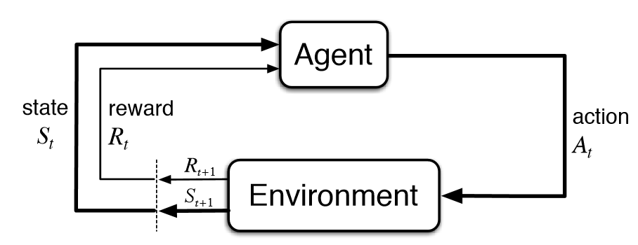

.. DO NOT EDIT.
.. THIS FILE WAS AUTOMATICALLY GENERATED BY SPHINX-GALLERY.
.. TO MAKE CHANGES, EDIT THE SOURCE PYTHON FILE:
.. "auto_tutorials/sensormanagement/04_ReinforcementSensorManagement.py"
.. LINE NUMBERS ARE GIVEN BELOW.

.. only:: html

    .. note::
        :class: sphx-glr-download-link-note

        Click :ref:`here <sphx_glr_download_auto_tutorials_sensormanagement_04_ReinforcementSensorManagement.py>`
        to download the full example code or to run this example in your browser via Binder

.. rst-class:: sphx-glr-example-title

.. _sphx_glr_auto_tutorials_sensormanagement_04_ReinforcementSensorManagement.py:

==========================================================
4 - Reinforcement Learning Sensor Management
==========================================================

.. GENERATED FROM PYTHON SOURCE LINES 11-22

This tutorial introduces using a Deep Q Network (DQN) reinforcement learning (RL) sensor management algorithm in
Stone Soup.

This is compared to the performance of a brute force algorithm using the same metrics as in previous tutorials.

This example is similar to previous examples, simulating 3 targets and a :class:`~.RadarRotatingBearingRange` sensor,
which can be actioned to point in different directions.

Tensorflow-agents is used as the reinforcement learning framework. This currently only works on Linux based OSes, or
via Windows Subsystem for Linux (WSL). See Tensorflow instructions for creating environments (with GPU support if
applicable) [#]_.

.. GENERATED FROM PYTHON SOURCE LINES 24-30

Sensor Management example
-------------------------
Setup
^^^^^

First a simulation must be set up using components from Stone Soup. For this the following imports are required.

.. GENERATED FROM PYTHON SOURCE LINES 32-44

.. code-block:: default

    import numpy as np
    import random
    from datetime import datetime, timedelta

    start_time = datetime.now()

    from stonesoup.models.transition.linear import CombinedLinearGaussianTransitionModel, ConstantVelocity
    from stonesoup.types.groundtruth import GroundTruthPath, GroundTruthState

.. GENERATED FROM PYTHON SOURCE LINES 45-56

Generate ground truths
^^^^^^^^^^^^^^^^^^^^^^

Following the methods from previous Stone Soup tutorials, generate a series of combined linear Gaussian transition
models and generate ground truths. Each ground truth is offset in the y-direction by 10.

The number of targets in this simulation is defined by `ntruths` - here there are 3 targets travelling in different
directions. The time the simulation is observed for is defined by `time_max`.

We can fix our random number generator in order to probe a particular example repeatedly. To produce random examples,
comment out the next two lines.

.. GENERATED FROM PYTHON SOURCE LINES 56-90

.. code-block:: default

    np.random.seed(1990)
    random.seed(1990)

    # Generate transition model
    # i.e. fk(xk|xk-1)
    transition_model = CombinedLinearGaussianTransitionModel([ConstantVelocity(0.005),
                                                              ConstantVelocity(0.005)])

    yps = range(0, 100, 10)  # y value for prior state
    truths = []
    ntruths = 3  # number of ground truths in simulation
    time_max = 50  # timestamps the simulation is observed over

    xdirection = 1
    ydirection = 1

    # Generate ground truths
    for j in range(0, ntruths):
        truth = GroundTruthPath([GroundTruthState([0, xdirection, yps[j], ydirection], timestamp=start_time)],
                                id=f"id{j}")

        for k in range(1, time_max):
            truth.append(
                GroundTruthState(transition_model.function(truth[k - 1], noise=True, time_interval=timedelta(seconds=1)),
                                 timestamp=start_time + timedelta(seconds=k)))
        truths.append(truth)

        # alternate directions when initiating tracks
        xdirection *= -1
        if j % 2 == 0:
            ydirection *= -1

.. GENERATED FROM PYTHON SOURCE LINES 91-92

Plot the ground truths. This is done using the :class:`~.Plotterly` class from Stone Soup.

.. GENERATED FROM PYTHON SOURCE LINES 92-102

.. code-block:: default

    from stonesoup.plotter import Plotterly

    # Stonesoup plotter requires sets not lists
    truths_set = set(truths)

    plotter = Plotterly()
    plotter.plot_ground_truths(truths_set, [0, 2])
    plotter.fig

.. raw:: html

    

    
                            
                            

                    

    

     
     

.. GENERATED FROM PYTHON SOURCE LINES 103-114

Create sensors
^^^^^^^^^^^^^^
Create a sensor for each sensor management algorithm. This tutorial uses the
:class:`~.RadarRotatingBearingRange` sensor. This sensor is an :class:`~.Actionable` so
is capable of returning the actions it can possibly
take at a given time step and can also be given an action to take before taking
measurements.
See the Creating an Actionable Sensor Example for a more detailed explanation of actionable sensors.

The :class:`~.RadarRotatingBearingRange` has a dwell centre which is an :class:`~.ActionableProperty`
so in this case the action is changing the dwell centre to point in a specific direction.

.. GENERATED FROM PYTHON SOURCE LINES 114-145

.. code-block:: default

    from stonesoup.types.state import StateVector
    from stonesoup.sensor.radar.radar import RadarRotatingBearingRange

    sensorA = RadarRotatingBearingRange(
        position_mapping=(0, 2),
        noise_covar=np.array([[np.radians(0.5) ** 2, 0],
                              [0, 1 ** 2]]),
        ndim_state=4,
        position=np.array([[10], [0]]),
        rpm=60,
        fov_angle=np.radians(45),
        dwell_centre=StateVector([0.0]),
        max_range=np.inf
    )
    sensorA.timestamp = start_time

    sensorB = RadarRotatingBearingRange(
        position_mapping=(0, 2),
        noise_covar=np.array([[np.radians(0.5) ** 2, 0],
                              [0, 1 ** 2]]),
        ndim_state=4,
        position=np.array([[10], [0]]),
        rpm=60,
        fov_angle=np.radians(45),
        dwell_centre=StateVector([0.0]),
        max_range=np.inf
    )
    sensorB.timestamp = start_time

.. GENERATED FROM PYTHON SOURCE LINES 146-152

Create the Kalman predictor and updater
^^^^^^^^^^^^^^^^^^^^^^^^^^^^^^^^^^^^^^^

Construct a predictor and updater using the :class:`~.KalmanPredictor` and :class:`~.ExtendedKalmanUpdater`
components from Stone Soup. The :class:`~.ExtendedKalmanUpdater` is used because it can be used for both linear
and nonlinear measurement models.

.. GENERATED FROM PYTHON SOURCE LINES 152-160

.. code-block:: default

    from stonesoup.predictor.kalman import KalmanPredictor
    predictor = KalmanPredictor(transition_model)

    from stonesoup.updater.kalman import ExtendedKalmanUpdater
    updater = ExtendedKalmanUpdater(measurement_model=None)
    # measurement model is added to detections by the sensor

.. GENERATED FROM PYTHON SOURCE LINES 161-167

Run the Kalman filters
^^^^^^^^^^^^^^^^^^^^^^

First create `ntruths` priors which estimate the targets’ initial states, one for each target. In this example
each prior is offset by 0.5 in the y direction meaning the position of the track is initially not very accurate. The
velocity is also systematically offset by +0.5 in both the x and y directions.

.. GENERATED FROM PYTHON SOURCE LINES 167-181

.. code-block:: default

    from stonesoup.types.state import GaussianState

    priors = []
    xdirection = 1.2
    ydirection = 1.2
    for j in range(0, ntruths):
        priors.append(GaussianState([[0], [xdirection], [yps[j]+0.1], [ydirection]],
                                    np.diag([0.5, 0.5, 0.5, 0.5]+np.random.normal(0,5e-4,4)),
                                    timestamp=start_time))
        xdirection *= -1
        if j % 2 == 0:
            ydirection *= -1

.. GENERATED FROM PYTHON SOURCE LINES 182-184

Initialise the tracks by creating an empty list and appending the priors generated. This needs to be done separately
for both sensor manager methods as they will generate different sets of tracks.

.. GENERATED FROM PYTHON SOURCE LINES 184-197

.. code-block:: default

    from stonesoup.types.track import Track

    # Initialise tracks from the RandomSensorManager
    tracksA = []
    for j, prior in enumerate(priors):
        tracksA.append(Track([prior]))

    tracksB = []
    for j, prior in enumerate(priors):
        tracksB.append(Track([prior]))

.. GENERATED FROM PYTHON SOURCE LINES 198-209

Reward function
^^^^^^^^^^^^^^^

A reward function is used to quantify the benefit of sensors taking a particular action or set of actions.
This can be crafted specifically for an example in order to achieve a particular objective. The function used in
this example is quite generic but could be substituted for any callable function which returns a numeric
value that the sensor manager can maximise.

The :class:`~.UncertaintyRewardFunction` calculates the uncertainty reduction by computing the difference between the
covariance matrix norms of the
prediction, and the posterior assuming a predicted measurement corresponding to that prediction.

.. GENERATED FROM PYTHON SOURCE LINES 209-221

.. code-block:: default

    from stonesoup.hypothesiser.distance import DistanceHypothesiser
    from stonesoup.measures import Mahalanobis
    hypothesiser = DistanceHypothesiser(predictor, updater, measure=Mahalanobis(), missed_distance=5)

    from stonesoup.dataassociator.neighbour import GNNWith2DAssignment
    data_associator = GNNWith2DAssignment(hypothesiser)

    from stonesoup.sensormanager.reward import UncertaintyRewardFunction
    reward_function = UncertaintyRewardFunction(predictor=predictor, updater=updater)

.. GENERATED FROM PYTHON SOURCE LINES 222-234

Reinforcement Learning
^^^^^^^^^^^^^^^^^^^^^^

Reinforcement learning is when an intelligent agents make decisions to maximise a cumulative reward. First, the agent
must train in an environment to create a policy, which determines which actions to take. During training, the agent
makes decisions and receives rewards, which is uses to optimise the policy.

Once training has completed, the policy can be exploited to gain rewards.

.. GENERATED FROM PYTHON SOURCE LINES 237-247

Design Environment
^^^^^^^^^^^^^^^^^^

An environment is needed for the RL agent to learn in. There are resources online for how to design these [#]_.

For this tutorial, a pre-designed environment has been created for you to go through.
In this example, the action space is equal to the number of targets in the simulation, so at each time step, the
sensor can look at one target.
The :class:`~.UncertaintyRewardFunction` to calculate the reward obtained for each step in the environment.
The trace of the covariances for each object is used as the observation for the agent to learn from.

.. GENERATED FROM PYTHON SOURCE LINES 247-378

.. code-block:: default

    from stonesoup.sensormanager.reinforcement import BaseEnvironment
    import numpy as np
    from tf_agents.specs import array_spec
    from tf_agents.trajectories import time_step as ts
    from tf_agents.environments import utils
    from stonesoup.sensor.action.dwell_action import DwellActionsGenerator
    from stonesoup.functions import mod_bearing
    import copy
    from ordered_set import OrderedSet

    class StoneSoupEnv(BaseEnvironment):
        """Example reinforcement learning environment. Environments must contain __init__, _reset,
        _step, and generate_action methods
        """

        def __init__(self):
            super().__init__()
            # Action size is number of targets
            self._action_spec = array_spec.BoundedArraySpec(
                shape=(), dtype=np.int32, minimum=0, maximum=ntruths-1, name='action')
            # Observation size is also number of targets
            self.obs_size = ntruths
            self._observation_spec = array_spec.BoundedArraySpec(
                shape=(self.obs_size,), dtype=np.float32, name='observation')
            self._episode_ended = False
            self.max_episode_length = time_max
            self.current_step = 0
            self.start_time = start_time
            # Use deepcopy to prevent the original sensor/tracks being changed
            self.sensor = copy.deepcopy(sensorA)
            self.sensor.timestamp = start_time
            self.tracks = copy.deepcopy(tracksA)

        def _reset(self):
            """Restarts the environment from the first step, resets the initial state
            and observation values, and returns an initial observation
            """
            self._episode_ended = False
            self.current_step = 0
            self.sensor = copy.deepcopy(sensorA)
            self.sensor.timestamp = start_time
            self.tracks = copy.deepcopy(tracksA)
            return ts.restart(np.zeros((self.obs_size,), dtype=np.float32))

        def _step(self, action):
            """Apply action and take one step through environment, and return new time_step.
            """

            reward = 0
            if self._episode_ended:
                # The last action ended the episode. Ignore the current action and start
                # a new episode.
                return self.reset()

            uncertainty = []
            for i, target in enumerate(self.tracks):
                # Calculate the bearing of the chosen target from the sensor
                if i == action:
                    x_target = target.state.state_vector[0]-self.sensor.position[0]
                    y_target = target.state.state_vector[2]-self.sensor.position[1]
                    bearing_target = mod_bearing(np.arctan2(y_target, x_target))

                uncertainty.append(np.trace(target.covar))

            current_timestep = self.start_time + timedelta(seconds=self.current_step)
            next_timestep = self.start_time + timedelta(seconds=self.current_step+1)

            # Create action generator which contains possible actions
            action_generator = DwellActionsGenerator(self.sensor,
                                                     attribute='dwell_centre',
                                                     start_time=current_timestep,
                                                     end_time=next_timestep)

            # Action the environment's sensor to point towards the chosen target
            current_action = [action_generator.action_from_value(bearing_target)]
            config = ({self.sensor: current_action})
            reward += reward_function(config, self.tracks, next_timestep)

            self.sensor.add_actions(current_action)
            self.sensor.act(next_timestep)

            # Calculate a measurement from the sensor
            measurement = set()
            measurement |= self.sensor.measure(OrderedSet(truth[current_timestep] for truth in truths), noise=True)
            hypotheses = data_associator.associate(self.tracks,
                                                   measurement,
                                                   current_timestep)

            for track in self.tracks:
                hypothesis = hypotheses[track]
                if hypothesis.measurement:
                    post = updater.update(hypothesis)
                    track.append(post)
                else:  # When data associator says no detections are good enough, we'll keep the prediction
                    track.append(hypothesis.prediction)

            # Set the observation as the prior uncertainty of each target
            observation = np.array(uncertainty, dtype=np.float32)

            self.current_step += 1

            if self.current_step >= self.max_episode_length-1:
                self._episode_ended = True
                return ts.termination(observation, reward)
            else:
                return ts.transition(observation, reward=reward, discount=1.0)

        @staticmethod
        def generate_action(action, tracks, sensor):
            """This method is used to convert a tf-agents action into a Stone Soup action"""
            for i, target in enumerate(tracks):
                if i == action:
                    x_target = target.state.state_vector[0]-sensor.position[0]
                    y_target = target.state.state_vector[2]-sensor.position[1]
                    action_bearing = mod_bearing(np.arctan2(y_target, x_target))

            action_generators = DwellActionsGenerator(sensor,
                                                      attribute='dwell_centre',
                                                      start_time=sensor.timestamp,
                                                      end_time=sensor.timestamp+timedelta(seconds=1))

            current_action = [action_generators.action_from_value(action_bearing)]
            return current_action

    # Validate the environment to ensure that the environment returns the expected specs
    train_env = StoneSoupEnv()
    utils.validate_py_environment(train_env, episodes=5)

.. GENERATED FROM PYTHON SOURCE LINES 379-383

Create Sensor Managers
^^^^^^^^^^^^^^^^^^^^^^

We initiate our reinforcement learning sensor manager with the environment we have designed

.. GENERATED FROM PYTHON SOURCE LINES 383-391

.. code-block:: default

    from stonesoup.sensormanager.reinforcement import ReinforcementSensorManager
    reinforcementsensormanager = ReinforcementSensorManager({sensorA}, env=StoneSoupEnv())

    from stonesoup.sensormanager import BruteForceSensorManager
    bruteforcesensormanager = BruteForceSensorManager({sensorB}, reward_function=reward_function)

.. GENERATED FROM PYTHON SOURCE LINES 392-399

Train RL agent
^^^^^^^^^^^^^^

To generate a policy, we need to train the reinforcement learning agent using the environment we created above.
Some hyperparameters are created that the agent uses to train with.

To train the agent, the hyperparameters are passed to the train method in the :class:`~.ReinforcementSensorManager`.

.. GENERATED FROM PYTHON SOURCE LINES 399-431

.. code-block:: default

    num_iterations = 10000

    initial_collect_steps = 100
    collect_steps_per_iteration = 1
    replay_buffer_max_length = 100000

    batch_size = 64
    learning_rate = 1e-4
    log_interval = 500

    num_eval_episodes = 10
    eval_interval = 1000
    fc_layer_params = (100, 50)

    # ---- Optional ----
    max_train_reward = 250

    hyper_parameters = {'num_iterations': num_iterations,
                        'initial_collect_steps': initial_collect_steps,
                        'collect_steps_per_iteration': collect_steps_per_iteration,
                        'replay_buffer_max_length': replay_buffer_max_length,
                        'batch_size': batch_size,
                        'learning_rate': learning_rate,
                        'log_interval': log_interval,
                        'num_eval_episodes': num_eval_episodes,
                        'eval_interval': eval_interval,
                        'fc_layer_params': fc_layer_params,
                        'max_train_reward': max_train_reward}

    reinforcementsensormanager.train(hyper_parameters)

.. rst-class:: sphx-glr-script-out

 .. code-block:: none

    WARNING:tensorflow:From /home/sgboakes/venvs/stonesoup-rl/lib/python3.10/site-packages/tensorflow/python/util/dispatch.py:1176: calling foldr_v2 (from tensorflow.python.ops.functional_ops) with back_prop=False is deprecated and will be removed in a future version.
    Instructions for updating:
    back_prop=False is deprecated. Consider using tf.stop_gradient instead.
    Instead of:
    results = tf.foldr(fn, elems, back_prop=False)
    Use:
    results = tf.nest.map_structure(tf.stop_gradient, tf.foldr(fn, elems))
    step = 500: loss = 20322.578125
    step = 1000: loss = 8591.23046875
    step = 1000: Average Return = 424.5835876464844

    -----
    Training complete
    -----

.. GENERATED FROM PYTHON SOURCE LINES 432-438

Run the sensor managers
^^^^^^^^^^^^^^^^^^^^^^^

To be able to exploit the policy generated by the reinforcement sensor manager, it  must be passed appropriate
'timesteps'.
These are distinct from the timesteps in Stonesoup, and is of the form time_step_spec from tf-agents.

.. GENERATED FROM PYTHON SOURCE LINES 438-498

.. code-block:: default

    from itertools import chain

    timesteps = []
    for state in truths[0]:
        timesteps.append(state.timestamp)

    tf_timestep = reinforcementsensormanager.test_env.reset()
    reinforcementsensormanager.env.reset()
    for timestep in timesteps[1:]:

        # Generate chosen configuration
        # i.e. {a}k
        # Need to make our own "timestamp" that matches tensorflow time_step_spec
        observation = []
        uncertainty = []
        for target in tracksA:
            x_target = target.state.state_vector[0]-sensorA.position[0]
            y_target = target.state.state_vector[2]-sensorA.position[1]
            bearing_target = mod_bearing(np.arctan2(y_target, x_target))
            uncertainty.append(np.trace(target.covar))

            # observation.append(np.degrees(bearing_target))
            observation.append(np.trace(target.covar))

        observation = np.array(uncertainty, dtype=np.float32)
        # observation = np.array(observation, dtype=np.float32)

        chosen_actions = reinforcementsensormanager.choose_actions(tracksA, [sensorA], tf_timestep)

        # Create empty dictionary for measurements
        measurementsA = []

        for chosen_action in chosen_actions:
            # chosen_action is a pair of {sensor, action}
            for sensor, actions in chosen_action.items():
                sensor.add_actions(list(chain.from_iterable(actions)))

        sensorA.act(timestep)

        # Observe this ground truth
        # i.e. {z}k
        measurements = sensorA.measure(OrderedSet(truth[timestep] for truth in truths), noise=True)
        measurementsA.extend(measurements)

        hypotheses = data_associator.associate(tracksA,
                                               measurementsA,
                                               timestep)
        for track in tracksA:
            hypothesis = hypotheses[track]
            if hypothesis.measurement:
                post = updater.update(hypothesis)
                track.append(post)
            else:  # When data associator says no detections are good enough, we'll keep the prediction
                track.append(hypothesis.prediction)

        # Propagate environment
        action_step = reinforcementsensormanager.agent.policy.action(tf_timestep)
        tf_timestep = reinforcementsensormanager.test_env.step(action_step.action)

.. GENERATED FROM PYTHON SOURCE LINES 499-500

Plot ground truths, tracks and uncertainty ellipses for each target.

.. GENERATED FROM PYTHON SOURCE LINES 500-508

.. code-block:: default

    plotterA = Plotterly()
    plotterA.plot_sensors(sensorA)
    plotterA.plot_ground_truths(truths_set, [0, 2])
    plotterA.plot_tracks(set(tracksA), [0, 2], uncertainty=True)
    plotterA.fig

.. raw:: html

    

    
                            
                            

            <script type="text/javascript">                                    window.PLOTLYENV=window.PLOTLYENV || {};                                    if (document.getElementById("6cb3192c-2d6b-48d7-b514-839159a58eda")) {                    Plotly.newPlot(                        "6cb3192c-2d6b-48d7-b514-839159a58eda",                        [{"legendgroup":"Sensors","legendrank":50,"marker":{"color":"black","symbol":"x"},"mode":"markers","name":"Sensors","showlegend":true,"x":[10],"y":[0],"type":"scatter"},{"legendgroup":"Ground Truth","legendrank":100,"line":{"dash":"dash"},"mode":"lines","name":"Ground Truth","showlegend":true,"text":["GroundTruthState [[0]\n [1]\n [0]\n [1]] 2023-11-02 15:07:32.665618","GroundTruthState [[0.9893974 ]\n [1.04019666]\n [0.9966697 ]\n [0.98364249]] 2023-11-02 15:07:33.665618","GroundTruthState [[2.0566408 ]\n [1.07842161]\n [1.95142746]\n [0.88856775]] 2023-11-02 15:07:34.665618","GroundTruthState [[3.11671454]\n [1.11664376]\n [2.88222347]\n [0.90315265]] 2023-11-02 15:07:35.665618","GroundTruthState [[4.26392931]\n [1.17837142]\n [3.65833865]\n [0.71534604]] 2023-11-02 15:07:36.665618","GroundTruthState [[5.45818028]\n [1.22342893]\n [4.36130375]\n [0.69516906]] 2023-11-02 15:07:37.665618","GroundTruthState [[6.68569551]\n [1.2065384 ]\n [5.04972738]\n [0.70439841]] 2023-11-02 15:07:38.665618","GroundTruthState [[7.96342527]\n [1.28293561]\n [5.80271228]\n [0.70322803]] 2023-11-02 15:07:39.665618","GroundTruthState [[9.22005381]\n [1.24784341]\n [6.52965928]\n [0.67740348]] 2023-11-02 15:07:40.665618","GroundTruthState [[10.4970401 ]\n [ 1.27850448]\n [ 7.18586116]\n [ 0.61093518]] 2023-11-02 15:07:41.665618","GroundTruthState [[11.76624714]\n [ 1.29321314]\n [ 7.81272894]\n [ 0.63583035]] 2023-11-02 15:07:42.665618","GroundTruthState [[13.04149203]\n [ 1.24387687]\n [ 8.41103669]\n [ 0.61407517]] 2023-11-02 15:07:43.665618","GroundTruthState [[14.24761314]\n [ 1.175732  ]\n [ 9.02773553]\n [ 0.57707113]] 2023-11-02 15:07:44.665618","GroundTruthState [[15.5055568 ]\n [ 1.30800951]\n [ 9.62049519]\n [ 0.54781123]] 2023-11-02 15:07:45.665618","GroundTruthState [[16.84350894]\n [ 1.37406193]\n [10.18043897]\n [ 0.60362725]] 2023-11-02 15:07:46.665618","GroundTruthState [[18.29023997]\n [ 1.42859447]\n [10.78738089]\n [ 0.6375124 ]] 2023-11-02 15:07:47.665618","GroundTruthState [[19.76176224]\n [ 1.48509312]\n [11.36530267]\n [ 0.60030411]] 2023-11-02 15:07:48.665618","GroundTruthState [[21.1995444 ]\n [ 1.49561139]\n [11.95680513]\n [ 0.5615977 ]] 2023-11-02 15:07:49.665618","GroundTruthState [[22.68005004]\n [ 1.43907348]\n [12.52138507]\n [ 0.5686915 ]] 2023-11-02 15:07:50.665618","GroundTruthState [[24.16455589]\n [ 1.50782563]\n [13.11843122]\n [ 0.6621933 ]] 2023-11-02 15:07:51.665618","GroundTruthState [[25.6910055 ]\n [ 1.57152865]\n [13.82228252]\n [ 0.73038877]] 2023-11-02 15:07:52.665618","GroundTruthState [[27.30732875]\n [ 1.63147906]\n [14.5123013 ]\n [ 0.70030909]] 2023-11-02 15:07:53.665618","GroundTruthState [[28.89483697]\n [ 1.58617138]\n [15.17869687]\n [ 0.65650419]] 2023-11-02 15:07:54.665618","GroundTruthState [[30.50071609]\n [ 1.61631273]\n [15.86498254]\n [ 0.71531237]] 2023-11-02 15:07:55.665618","GroundTruthState [[32.09109934]\n [ 1.55835209]\n [16.58171794]\n [ 0.74242384]] 2023-11-02 15:07:56.665618","GroundTruthState [[33.66489693]\n [ 1.55065915]\n [17.39046221]\n [ 0.88548285]] 2023-11-02 15:07:57.665618","GroundTruthState [[35.20989565]\n [ 1.53783934]\n [18.32370725]\n [ 0.92083713]] 2023-11-02 15:07:58.665618","GroundTruthState [[36.73800758]\n [ 1.54615807]\n [19.35639459]\n [ 1.0937865 ]] 2023-11-02 15:07:59.665618","GroundTruthState [[38.27073975]\n [ 1.49801427]\n [20.43171506]\n [ 1.15836153]] 2023-11-02 15:08:00.665618","GroundTruthState [[39.75096571]\n [ 1.5066285 ]\n [21.52262819]\n [ 1.14236467]] 2023-11-02 15:08:01.665618","GroundTruthState [[41.24548882]\n [ 1.52931918]\n [22.69230073]\n [ 1.17355861]] 2023-11-02 15:08:02.665618","GroundTruthState [[42.77582282]\n [ 1.5089466 ]\n [23.84296023]\n [ 1.10822804]] 2023-11-02 15:08:03.665618","GroundTruthState [[44.324576  ]\n [ 1.54074676]\n [25.02197981]\n [ 1.25277507]] 2023-11-02 15:08:04.665618","GroundTruthState [[45.94194345]\n [ 1.61920412]\n [26.28461276]\n [ 1.25683768]] 2023-11-02 15:08:05.665618","GroundTruthState [[47.50992166]\n [ 1.51341645]\n [27.49741408]\n [ 1.19343677]] 2023-11-02 15:08:06.665618","GroundTruthState [[49.08246132]\n [ 1.58503889]\n [28.68450897]\n [ 1.15184222]] 2023-11-02 15:08:07.665618","GroundTruthState [[50.68763643]\n [ 1.62363487]\n [29.82888258]\n [ 1.07612595]] 2023-11-02 15:08:08.665618","GroundTruthState [[52.30276917]\n [ 1.64318579]\n [30.92268633]\n [ 1.08052709]] 2023-11-02 15:08:09.665618","GroundTruthState [[53.92019166]\n [ 1.54977046]\n [32.00072955]\n [ 1.03071239]] 2023-11-02 15:08:10.665618","GroundTruthState [[55.45566739]\n [ 1.5074451 ]\n [33.05149883]\n [ 1.04503274]] 2023-11-02 15:08:11.665618","GroundTruthState [[57.03749678]\n [ 1.62822223]\n [34.02357892]\n [ 0.88092875]] 2023-11-02 15:08:12.665618","GroundTruthState [[58.59353643]\n [ 1.47466537]\n [34.87495   ]\n [ 0.84122124]] 2023-11-02 15:08:13.665618","GroundTruthState [[60.09131563]\n [ 1.47229854]\n [35.75989713]\n [ 0.83104764]] 2023-11-02 15:08:14.665618","GroundTruthState [[61.58782601]\n [ 1.48668615]\n [36.53933038]\n [ 0.76080559]] 2023-11-02 15:08:15.665618","GroundTruthState [[62.98271294]\n [ 1.32691841]\n [37.33240199]\n [ 0.80034496]] 2023-11-02 15:08:16.665618","GroundTruthState [[64.34944536]\n [ 1.33652087]\n [38.22801608]\n [ 0.90148801]] 2023-11-02 15:08:17.665618","GroundTruthState [[65.63550282]\n [ 1.26943079]\n [39.12023134]\n [ 0.91232777]] 2023-11-02 15:08:18.665618","GroundTruthState [[66.83967525]\n [ 1.16216225]\n [40.02282423]\n [ 0.87937327]] 2023-11-02 15:08:19.665618","GroundTruthState [[68.08305509]\n [ 1.28770974]\n [40.93268054]\n [ 0.94518308]] 2023-11-02 15:08:20.665618","GroundTruthState [[69.38695617]\n [ 1.30224267]\n [41.96722493]\n [ 1.08321919]] 2023-11-02 15:08:21.665618"],"x":[0,0.9893973973614787,2.056640804389175,3.1167145352158516,4.263929313923897,5.458180282304253,6.685695510587328,7.963425265880301,9.220053805032439,10.49704010040622,11.766247140091682,13.041492032835848,14.247613142391273,15.505556798891705,16.843508936172633,18.29023997441558,19.76176223640003,21.19954439973072,22.680050044165018,24.164555889410998,25.691005496856036,27.307328754439766,28.89483697482363,30.50071608707973,32.09109934034874,33.66489692991074,35.209895653560906,36.738007576946956,38.27073975294268,39.750965708166795,41.2454888234644,42.77582282415579,44.32457599663492,45.94194344693898,47.509921658990365,49.082461323915325,50.68763643430976,52.302769166234604,53.92019166091384,55.455667389337165,57.03749678252632,58.593536428171,60.09131562753373,61.587826005265505,62.982712938165854,64.34944535591872,65.63550282406126,66.8396752484983,68.08305508619615,69.38695616676095],"y":[0,0.9966696960883556,1.951427457273027,2.88222347458036,3.6583386466698524,4.361303750748592,5.04972738444826,5.802712280233346,6.529659280162841,7.185861161861761,7.812728936597637,8.411036690371045,9.027735527766401,9.620495192710852,10.180438974680264,10.787380890738154,11.365302671649763,11.956805125507792,12.52138507180686,13.118431223930136,13.822282518372841,14.512301299068438,15.178696872430798,15.864982540160376,16.58171794333089,17.390462212021927,18.32370724837566,19.35639458777209,20.431715064495968,21.52262819048583,22.692300727232144,23.842960229220232,25.02197980982772,26.284612761432548,27.497414076520847,28.6845089719183,29.828882575596577,30.922686327207302,32.00072955400686,33.05149882702067,34.02357892033132,34.87495000336286,35.7598971302576,36.53933038326331,37.33240198828703,38.22801607840703,39.1202313351066,40.02282423348028,40.93268053629052,41.96722493186914],"type":"scatter"},{"legendgroup":"Ground Truth","legendrank":100,"line":{"dash":"dash"},"mode":"lines","name":"Ground Truth","showlegend":false,"text":["GroundTruthState [[ 0]\n [ 1]\n [20]\n [-1]] 2023-11-02 15:07:32.665618","GroundTruthState [[ 1.01664956]\n [ 0.95331305]\n [19.048748  ]\n [-0.95661609]] 2023-11-02 15:07:33.665618","GroundTruthState [[ 2.0234389 ]\n [ 1.02310869]\n [18.12737158]\n [-0.9549    ]] 2023-11-02 15:07:34.665618","GroundTruthState [[ 2.98368337]\n [ 0.9453227 ]\n [17.20566838]\n [-0.90353668]] 2023-11-02 15:07:35.665618","GroundTruthState [[ 3.89284343]\n [ 0.84879909]\n [16.34263949]\n [-0.88381206]] 2023-11-02 15:07:36.665618","GroundTruthState [[ 4.7838522 ]\n [ 0.89030971]\n [15.42077734]\n [-0.9099168 ]] 2023-11-02 15:07:37.665618","GroundTruthState [[ 5.66559253]\n [ 0.86954678]\n [14.49343659]\n [-0.94151729]] 2023-11-02 15:07:38.665618","GroundTruthState [[ 6.48259142]\n [ 0.73944795]\n [13.57072994]\n [-0.94276991]] 2023-11-02 15:07:39.665618","GroundTruthState [[ 7.24196938]\n [ 0.74241915]\n [12.57018224]\n [-1.09039692]] 2023-11-02 15:07:40.665618","GroundTruthState [[ 7.94444019]\n [ 0.69032166]\n [11.45812014]\n [-1.10262923]] 2023-11-02 15:07:41.665618","GroundTruthState [[ 8.61851286]\n [ 0.73677701]\n [10.38335313]\n [-1.01927772]] 2023-11-02 15:07:42.665618","GroundTruthState [[ 9.33648512]\n [ 0.71000879]\n [ 9.31861278]\n [-1.07988216]] 2023-11-02 15:07:43.665618","GroundTruthState [[10.09372855]\n [ 0.7546838 ]\n [ 8.22048775]\n [-1.09046297]] 2023-11-02 15:07:44.665618","GroundTruthState [[10.76789539]\n [ 0.71968476]\n [ 7.1405317 ]\n [-1.08649472]] 2023-11-02 15:07:45.665618","GroundTruthState [[11.50328491]\n [ 0.81532796]\n [ 6.06751257]\n [-1.07229845]] 2023-11-02 15:07:46.665618","GroundTruthState [[12.29349198]\n [ 0.70327367]\n [ 5.04049097]\n [-1.05250744]] 2023-11-02 15:07:47.665618","GroundTruthState [[13.02356486]\n [ 0.75286845]\n [ 3.93096712]\n [-1.12829009]] 2023-11-02 15:07:48.665618","GroundTruthState [[13.77094906]\n [ 0.77513203]\n [ 2.85015376]\n [-1.03602258]] 2023-11-02 15:07:49.665618","GroundTruthState [[14.53090456]\n [ 0.73550647]\n [ 1.7897566 ]\n [-1.08463173]] 2023-11-02 15:07:50.665618","GroundTruthState [[15.26179298]\n [ 0.68756649]\n [ 0.76202357]\n [-0.96698838]] 2023-11-02 15:07:51.665618","GroundTruthState [[15.92572884]\n [ 0.66916281]\n [-0.24439345]\n [-1.08485362]] 2023-11-02 15:07:52.665618","GroundTruthState [[16.61049486]\n [ 0.71036273]\n [-1.27859491]\n [-0.9222305 ]] 2023-11-02 15:07:53.665618","GroundTruthState [[17.31521851]\n [ 0.72268963]\n [-2.24052528]\n [-1.00163062]] 2023-11-02 15:07:54.665618","GroundTruthState [[17.99114285]\n [ 0.62951184]\n [-3.2528789 ]\n [-1.06732284]] 2023-11-02 15:07:55.665618","GroundTruthState [[18.55981321]\n [ 0.56095385]\n [-4.26943821]\n [-0.98287027]] 2023-11-02 15:07:56.665618","GroundTruthState [[19.0739405 ]\n [ 0.40925403]\n [-5.26866194]\n [-0.9836899 ]] 2023-11-02 15:07:57.665618","GroundTruthState [[19.489778  ]\n [ 0.44850559]\n [-6.25584635]\n [-0.95416282]] 2023-11-02 15:07:58.665618","GroundTruthState [[19.91433897]\n [ 0.42772067]\n [-7.15013337]\n [-0.92284898]] 2023-11-02 15:07:59.665618","GroundTruthState [[20.37844333]\n [ 0.46509633]\n [-8.07531556]\n [-0.88282286]] 2023-11-02 15:08:00.665618","GroundTruthState [[20.84303393]\n [ 0.48118335]\n [-8.99454563]\n [-0.93914894]] 2023-11-02 15:08:01.665618","GroundTruthState [[21.26361848]\n [ 0.40397784]\n [-9.93182099]\n [-0.95629512]] 2023-11-02 15:08:02.665618","GroundTruthState [[ 21.68854156]\n [  0.4895365 ]\n [-10.93915268]\n [ -1.03626681]] 2023-11-02 15:08:03.665618","GroundTruthState [[ 22.21666611]\n [  0.58920782]\n [-12.05210149]\n [ -1.09747256]] 2023-11-02 15:08:04.665618","GroundTruthState [[ 22.86032881]\n [  0.64495785]\n [-13.17759538]\n [ -1.17405215]] 2023-11-02 15:08:05.665618","GroundTruthState [[ 23.51428241]\n [  0.74587544]\n [-14.30507196]\n [ -1.11718007]] 2023-11-02 15:08:06.665618","GroundTruthState [[ 24.22942226]\n [  0.77506168]\n [-15.40841721]\n [ -1.06210557]] 2023-11-02 15:08:07.665618","GroundTruthState [[ 25.00274504]\n [  0.78121102]\n [-16.45153373]\n [ -1.02692197]] 2023-11-02 15:08:08.665618","GroundTruthState [[ 25.77068654]\n [  0.73321492]\n [-17.45446742]\n [ -1.04382273]] 2023-11-02 15:08:09.665618","GroundTruthState [[ 26.55827041]\n [  0.84772749]\n [-18.51015281]\n [ -1.0404462 ]] 2023-11-02 15:08:10.665618","GroundTruthState [[ 27.45993311]\n [  0.97286031]\n [-19.56553762]\n [ -1.05724252]] 2023-11-02 15:08:11.665618","GroundTruthState [[ 28.52103444]\n [  1.11460941]\n [-20.63873242]\n [ -1.07290545]] 2023-11-02 15:08:12.665618","GroundTruthState [[ 29.67773278]\n [  1.15317256]\n [-21.69918712]\n [ -1.10430288]] 2023-11-02 15:08:13.665618","GroundTruthState [[ 30.79331516]\n [  1.05878299]\n [-22.77009966]\n [ -1.04696073]] 2023-11-02 15:08:14.665618","GroundTruthState [[ 31.83133315]\n [  1.03895768]\n [-23.78234508]\n [ -0.94740636]] 2023-11-02 15:08:15.665618","GroundTruthState [[ 32.83462379]\n [  0.93930877]\n [-24.75678008]\n [ -0.97059465]] 2023-11-02 15:08:16.665618","GroundTruthState [[ 33.7416144 ]\n [  0.90507563]\n [-25.768665  ]\n [ -1.07769544]] 2023-11-02 15:08:17.665618","GroundTruthState [[ 34.60748533]\n [  0.83986419]\n [-26.84737664]\n [ -1.11894447]] 2023-11-02 15:08:18.665618","GroundTruthState [[ 35.43852866]\n [  0.82612719]\n [-27.98527142]\n [ -1.14822192]] 2023-11-02 15:08:19.665618","GroundTruthState [[ 36.27889145]\n [  0.83134103]\n [-29.10251303]\n [ -1.16716492]] 2023-11-02 15:08:20.665618","GroundTruthState [[ 37.04778808]\n [  0.75236725]\n [-30.28831714]\n [ -1.24278467]] 2023-11-02 15:08:21.665618"],"x":[0,1.0166495558337476,2.023438902842779,2.9836833656399833,3.8928434346880194,4.78385219866485,5.665592526502125,6.482591420201845,7.241969380629406,7.9444401922997985,8.618512861528655,9.336485118352984,10.093728547369672,10.767895390937959,11.50328491302578,12.293491982916642,13.023564864253302,13.770949062250581,14.530904560975381,15.261792984097141,15.9257288444309,16.61049485904189,17.31521851303341,17.9911428476105,18.559813209444265,19.073940496500665,19.489778004392445,19.914338974525304,20.378443334339693,20.843033925213863,21.263618475466988,21.688541562884048,22.21666610572574,22.860328806635952,23.514282412223288,24.229422260169716,25.002745039697643,25.770686539312653,26.558270405404695,27.45993310585353,28.52103444435865,29.677732775871124,30.793315155256796,31.831333147907834,32.834623791075295,33.741614399925616,34.60748533018476,35.438528660597754,36.278891449461454,37.047788076020026],"y":[20,19.048748001295184,18.127371582844344,17.205668378429465,16.342639491932996,15.420777343390965,14.493436593175455,13.57072993676291,12.570182239918958,11.45812013599411,10.383353130721625,9.31861278110823,8.220487749566017,7.140531698267381,6.067512565108187,5.040490967599949,3.9309671184067088,2.850153759696182,1.7897565991307627,0.7620235729034426,-0.24439344633287202,-1.2785949064997184,-2.2405252802971667,-3.252878903662942,-4.269438205878609,-5.268661937904412,-6.25584634772372,-7.150133366046742,-8.075315558666624,-8.994545629710698,-9.931820993942685,-10.939152682964412,-12.05210148662359,-13.177595383624208,-14.305071956353922,-15.408417213765102,-16.4515337278963,-17.4544674244681,-18.51015280813566,-19.56553762050416,-20.638732421493557,-21.699187119176653,-22.77009966476415,-23.78234507742334,-24.756780083270822,-25.768664998892337,-26.847376643272735,-27.985271423048307,-29.10251303246006,-30.288317135906638],"type":"scatter"},{"legendgroup":"Ground Truth","legendrank":100,"line":{"dash":"dash"},"mode":"lines","name":"Ground Truth","showlegend":false,"text":["GroundTruthState [[ 0]\n [-1]\n [10]\n [-1]] 2023-11-02 15:07:32.665618","GroundTruthState [[-0.97331269]\n [-0.97017382]\n [ 8.99161485]\n [-1.05761107]] 2023-11-02 15:07:33.665618","GroundTruthState [[-1.92998836]\n [-0.93554483]\n [ 7.98234696]\n [-1.02752892]] 2023-11-02 15:07:34.665618","GroundTruthState [[-2.86571807]\n [-0.89867842]\n [ 6.95110088]\n [-1.11612956]] 2023-11-02 15:07:35.665618","GroundTruthState [[-3.71619402]\n [-0.8018948 ]\n [ 5.83286758]\n [-1.11578999]] 2023-11-02 15:07:36.665618","GroundTruthState [[-4.5862394 ]\n [-0.90076672]\n [ 4.70956666]\n [-1.13343868]] 2023-11-02 15:07:37.665618","GroundTruthState [[-5.41898766]\n [-0.78330007]\n [ 3.56098339]\n [-1.13095111]] 2023-11-02 15:07:38.665618","GroundTruthState [[-6.1505379 ]\n [-0.65890266]\n [ 2.42771491]\n [-1.11530977]] 2023-11-02 15:07:39.665618","GroundTruthState [[-6.82194342]\n [-0.67118719]\n [ 1.27504482]\n [-1.18266487]] 2023-11-02 15:07:40.665618","GroundTruthState [[-7.50852883]\n [-0.71284487]\n [ 0.088035  ]\n [-1.13908857]] 2023-11-02 15:07:41.665618","GroundTruthState [[-8.24090174]\n [-0.70285664]\n [-0.99644145]\n [-1.07332735]] 2023-11-02 15:07:42.665618","GroundTruthState [[-8.88040799]\n [-0.66175389]\n [-2.03106539]\n [-1.0276089 ]] 2023-11-02 15:07:43.665618","GroundTruthState [[-9.51025119]\n [-0.58721263]\n [-3.02254495]\n [-0.96083188]] 2023-11-02 15:07:44.665618","GroundTruthState [[-10.11007064]\n [ -0.56659771]\n [ -3.93607905]\n [ -0.89662898]] 2023-11-02 15:07:45.665618","GroundTruthState [[-10.64567477]\n [ -0.51761049]\n [ -4.805989  ]\n [ -0.87312855]] 2023-11-02 15:07:46.665618","GroundTruthState [[-11.26102208]\n [ -0.62123976]\n [ -5.72747725]\n [ -0.9901584 ]] 2023-11-02 15:07:47.665618","GroundTruthState [[-11.84829582]\n [ -0.58234787]\n [ -6.70126675]\n [ -1.01749089]] 2023-11-02 15:07:48.665618","GroundTruthState [[-12.45009571]\n [ -0.64311801]\n [ -7.79265588]\n [ -1.10182289]] 2023-11-02 15:07:49.665618","GroundTruthState [[-13.10924016]\n [ -0.59337747]\n [ -8.83930034]\n [ -1.09788013]] 2023-11-02 15:07:50.665618","GroundTruthState [[-13.70370885]\n [ -0.59263974]\n [ -9.9424339 ]\n [ -1.1517299 ]] 2023-11-02 15:07:51.665618","GroundTruthState [[-14.28701672]\n [ -0.60584333]\n [-11.05767272]\n [ -1.10369766]] 2023-11-02 15:07:52.665618","GroundTruthState [[-14.87167043]\n [ -0.56976892]\n [-12.17893186]\n [ -1.13722919]] 2023-11-02 15:07:53.665618","GroundTruthState [[-15.41829871]\n [ -0.54519935]\n [-13.28726932]\n [ -1.0383462 ]] 2023-11-02 15:07:54.665618","GroundTruthState [[-15.96529117]\n [ -0.55415448]\n [-14.26176762]\n [ -0.94486402]] 2023-11-02 15:07:55.665618","GroundTruthState [[-16.54117233]\n [ -0.58325428]\n [-15.1848673 ]\n [ -0.86851518]] 2023-11-02 15:07:56.665618","GroundTruthState [[-17.09771822]\n [ -0.54120127]\n [-16.0277843 ]\n [ -0.84037158]] 2023-11-02 15:07:57.665618","GroundTruthState [[-17.67185639]\n [ -0.58937755]\n [-16.88733825]\n [ -0.81871575]] 2023-11-02 15:07:58.665618","GroundTruthState [[-18.24600903]\n [ -0.58646095]\n [-17.69521444]\n [ -0.72341427]] 2023-11-02 15:07:59.665618","GroundTruthState [[-18.80640171]\n [ -0.51807645]\n [-18.37687474]\n [ -0.66872839]] 2023-11-02 15:08:00.665618","GroundTruthState [[-19.3867699 ]\n [ -0.63303611]\n [-19.05967331]\n [ -0.71732293]] 2023-11-02 15:08:01.665618","GroundTruthState [[-19.99561017]\n [ -0.63534153]\n [-19.8603715 ]\n [ -0.83334245]] 2023-11-02 15:08:02.665618","GroundTruthState [[-20.66004954]\n [ -0.70245638]\n [-20.67589631]\n [ -0.78774249]] 2023-11-02 15:08:03.665618","GroundTruthState [[-21.33091985]\n [ -0.62534133]\n [-21.50575141]\n [ -0.81009275]] 2023-11-02 15:08:04.665618","GroundTruthState [[-21.94706798]\n [ -0.55675468]\n [-22.26459692]\n [ -0.7420524 ]] 2023-11-02 15:08:05.665618","GroundTruthState [[-22.47177099]\n [ -0.55831679]\n [-22.93746593]\n [ -0.63737026]] 2023-11-02 15:08:06.665618","GroundTruthState [[-22.99452237]\n [ -0.4983036 ]\n [-23.58914318]\n [ -0.60744311]] 2023-11-02 15:08:07.665618","GroundTruthState [[-23.51182807]\n [ -0.56054356]\n [-24.16466617]\n [ -0.6010825 ]] 2023-11-02 15:08:08.665618","GroundTruthState [[-24.02380209]\n [ -0.45794134]\n [-24.80897026]\n [ -0.68968258]] 2023-11-02 15:08:09.665618","GroundTruthState [[-24.49160476]\n [ -0.47549414]\n [-25.54660556]\n [ -0.74528043]] 2023-11-02 15:08:10.665618","GroundTruthState [[-24.9621073 ]\n [ -0.42652147]\n [-26.26664965]\n [ -0.70537537]] 2023-11-02 15:08:11.665618","GroundTruthState [[-25.43002351]\n [ -0.46905983]\n [-26.95616689]\n [ -0.63311618]] 2023-11-02 15:08:12.665618","GroundTruthState [[-25.9026116 ]\n [ -0.43749882]\n [-27.56835101]\n [ -0.63773525]] 2023-11-02 15:08:13.665618","GroundTruthState [[-26.37055243]\n [ -0.49247109]\n [-28.21333413]\n [ -0.63688718]] 2023-11-02 15:08:14.665618","GroundTruthState [[-26.86243009]\n [ -0.52802774]\n [-28.8579962 ]\n [ -0.6933815 ]] 2023-11-02 15:08:15.665618","GroundTruthState [[-27.44567542]\n [ -0.69600112]\n [-29.55758816]\n [ -0.71266654]] 2023-11-02 15:08:16.665618","GroundTruthState [[-28.17655736]\n [ -0.75371671]\n [-30.23374142]\n [ -0.61417228]] 2023-11-02 15:08:17.665618","GroundTruthState [[-28.92602524]\n [ -0.7535069 ]\n [-30.84222423]\n [ -0.59350584]] 2023-11-02 15:08:18.665618","GroundTruthState [[-29.68555988]\n [ -0.69157756]\n [-31.46280431]\n [ -0.58237187]] 2023-11-02 15:08:19.665618","GroundTruthState [[-30.33191912]\n [ -0.62304843]\n [-32.09469201]\n [ -0.65858827]] 2023-11-02 15:08:20.665618","GroundTruthState [[-30.91573788]\n [ -0.55719086]\n [-32.76778953]\n [ -0.71530296]] 2023-11-02 15:08:21.665618"],"x":[0,-0.9733126895203568,-1.9299883611115223,-2.8657180675250804,-3.7161940172600274,-4.586239399139096,-5.418987655994909,-6.150537895753105,-6.821943422790228,-7.508528832039406,-8.240901737735951,-8.880407992479201,-9.510251187745395,-10.110070643730667,-10.645674765107902,-11.261022079068352,-11.848295822045774,-12.450095708612308,-13.109240164643197,-13.70370885487114,-14.287016722849371,-14.871670434909399,-15.418298709312886,-15.965291171957473,-16.541172326976096,-17.0977182177739,-17.671856387966468,-18.24600902995875,-18.806401709485876,-19.38676989868042,-19.995610172410093,-20.660049538894874,-21.330919853685486,-21.947067978338104,-22.47177099291766,-22.99452237497913,-23.511828071531216,-24.023802089388187,-24.49160476352958,-24.962107303226723,-25.430023512740835,-25.9026115969473,-26.370552429306475,-26.862430087322284,-27.44567541775362,-28.176557361308802,-28.92602524029008,-29.685559884568878,-30.331919117262476,-30.91573788497819],"y":[10,8.991614853029997,7.982346955681971,6.9511008807138,5.832867579530728,4.709566658075888,3.5609833885406927,2.427714914979377,1.27504482493505,0.08803499536513613,-0.9964414477493737,-2.0310653884947123,-3.0225449462252483,-3.9360790515393496,-4.805989002014136,-5.727477248791482,-6.7012667549729805,-7.79265588091065,-8.839300343985013,-9.94243390421377,-11.057672716535306,-12.178931858116796,-13.287269323493785,-14.26176762186834,-15.184867295163198,-16.027784299833026,-16.887338253963065,-17.695214437415107,-18.37687474243751,-19.059673310424117,-19.860371497747455,-20.675896313002223,-21.50575140645717,-22.264596923969847,-22.937465928974802,-23.589143180552643,-24.16466617186037,-24.80897025769439,-25.546605557095013,-26.26664964694905,-26.956166885460316,-27.568351014660315,-28.213334126977653,-28.85799620070116,-29.55758815678393,-30.233741418894127,-30.84222423491662,-31.462804309962106,-32.09469200729998,-32.767789530438066],"type":"scatter"},{"legendgroup":"Tracks","legendrank":300,"marker":{"symbol":["circle","circle","circle","square","circle","circle","square","square","circle","circle","circle","circle","circle","square","square","circle","circle","circle","circle","circle","square","square","circle","circle","circle","circle","circle","circle","square","square","circle","circle","circle","circle","circle","circle","square","square","circle","circle","circle","circle","circle","circle","square","circle","circle","circle","circle","circle"]},"mode":"markers+lines","name":"Tracks","showlegend":true,"text":["GaussianState [[ 0. ]\n [-1.2]\n [10.1]\n [-1.2]] 2023-11-02 15:07:32.665618","GaussianStatePrediction [[-1.2]\n [-1.2]\n [ 8.9]\n [-1.2]] 2023-11-02 15:07:33.665618","GaussianStatePrediction [[-2.4]\n [-1.2]\n [ 7.7]\n [-1.2]] 2023-11-02 15:07:34.665618","GaussianStateUpdate [[-3.16369926]\n [-1.06833056]\n [ 7.09131351]\n [-1.02154381]] 2023-11-02 15:07:35.665618","GaussianStatePrediction [[-4.23202982]\n [-1.06833056]\n [ 6.0697697 ]\n [-1.02154381]] 2023-11-02 15:07:36.665618","GaussianStatePrediction [[-5.30036038]\n [-1.06833056]\n [ 5.04822589]\n [-1.02154381]] 2023-11-02 15:07:37.665618","GaussianStateUpdate [[-5.45395632]\n [-0.90054275]\n [ 3.52714305]\n [-1.12216533]] 2023-11-02 15:07:38.665618","GaussianStateUpdate [[-5.64059239]\n [-0.76707907]\n [ 2.44664081]\n [-1.05587036]] 2023-11-02 15:07:39.665618","GaussianStatePrediction [[-6.40767147]\n [-0.76707907]\n [ 1.39077045]\n [-1.05587036]] 2023-11-02 15:07:40.665618","GaussianStatePrediction [[-7.17475054]\n [-0.76707907]\n [ 0.33490009]\n [-1.05587036]] 2023-11-02 15:07:41.665618","GaussianStatePrediction [[-7.94182962]\n [-0.76707907]\n [-0.72097027]\n [-1.05587036]] 2023-11-02 15:07:42.665618","GaussianStatePrediction [[-8.70890869]\n [-0.76707907]\n [-1.77684064]\n [-1.05587036]] 2023-11-02 15:07:43.665618","GaussianStatePrediction [[-9.47598776]\n [-0.76707907]\n [-2.832711  ]\n [-1.05587036]] 2023-11-02 15:07:44.665618","GaussianStateUpdate [[-10.97856887]\n [ -0.85638099]\n [ -4.03834542]\n [ -1.09356315]] 2023-11-02 15:07:45.665618","GaussianStateUpdate [[-11.36950546]\n [ -0.78717208]\n [ -5.17426857]\n [ -1.12089955]] 2023-11-02 15:07:46.665618","GaussianStatePrediction [[-12.15667753]\n [ -0.78717208]\n [ -6.29516812]\n [ -1.12089955]] 2023-11-02 15:07:47.665618","GaussianStatePrediction [[-12.94384961]\n [ -0.78717208]\n [ -7.41606767]\n [ -1.12089955]] 2023-11-02 15:07:48.665618","GaussianStatePrediction [[-13.73102168]\n [ -0.78717208]\n [ -8.53696722]\n [ -1.12089955]] 2023-11-02 15:07:49.665618","GaussianStatePrediction [[-14.51819376]\n [ -0.78717208]\n [ -9.65786678]\n [ -1.12089955]] 2023-11-02 15:07:50.665618","GaussianStatePrediction [[-15.30536583]\n [ -0.78717208]\n [-10.77876633]\n [ -1.12089955]] 2023-11-02 15:07:51.665618","GaussianStateUpdate [[-15.03819393]\n [ -0.66319296]\n [-11.45904865]\n [ -1.05502762]] 2023-11-02 15:07:52.665618","GaussianStateUpdate [[-15.56808551]\n [ -0.65165255]\n [-12.37276892]\n [ -1.02610868]] 2023-11-02 15:07:53.665618","GaussianStatePrediction [[-16.21973805]\n [ -0.65165255]\n [-13.3988776 ]\n [ -1.02610868]] 2023-11-02 15:07:54.665618","GaussianStatePrediction [[-16.8713906 ]\n [ -0.65165255]\n [-14.42498628]\n [ -1.02610868]] 2023-11-02 15:07:55.665618","GaussianStatePrediction [[-17.52304315]\n [ -0.65165255]\n [-15.45109495]\n [ -1.02610868]] 2023-11-02 15:07:56.665618","GaussianStatePrediction [[-18.17469569]\n [ -0.65165255]\n [-16.47720363]\n [ -1.02610868]] 2023-11-02 15:07:57.665618","GaussianStatePrediction [[-18.82634824]\n [ -0.65165255]\n [-17.50331231]\n [ -1.02610868]] 2023-11-02 15:07:58.665618","GaussianStatePrediction [[-19.47800078]\n [ -0.65165255]\n [-18.52942098]\n [ -1.02610868]] 2023-11-02 15:07:59.665618","GaussianStateUpdate [[-19.34790041]\n [ -0.56972023]\n [-18.79238559]\n [ -0.92416535]] 2023-11-02 15:08:00.665618","GaussianStateUpdate [[-20.07853496]\n [ -0.60368034]\n [-19.54470696]\n [ -0.88273392]] 2023-11-02 15:08:01.665618","GaussianStatePrediction [[-20.6822153 ]\n [ -0.60368034]\n [-20.42744088]\n [ -0.88273392]] 2023-11-02 15:08:02.665618","GaussianStatePrediction [[-21.28589564]\n [ -0.60368034]\n [-21.3101748 ]\n [ -0.88273392]] 2023-11-02 15:08:03.665618","GaussianStatePrediction [[-21.88957598]\n [ -0.60368034]\n [-22.19290872]\n [ -0.88273392]] 2023-11-02 15:08:04.665618","GaussianStatePrediction [[-22.49325632]\n [ -0.60368034]\n [-23.07564264]\n [ -0.88273392]] 2023-11-02 15:08:05.665618","GaussianStatePrediction [[-23.09693666]\n [ -0.60368034]\n [-23.95837656]\n [ -0.88273392]] 2023-11-02 15:08:06.665618","GaussianStatePrediction [[-23.700617  ]\n [ -0.60368034]\n [-24.84111048]\n [ -0.88273392]] 2023-11-02 15:08:07.665618","GaussianStateUpdate [[-25.0513701 ]\n [ -0.7080802 ]\n [-25.2666035 ]\n [ -0.80407846]] 2023-11-02 15:08:08.665618","GaussianStateUpdate [[-25.22862057]\n [ -0.63948343]\n [-25.76705602]\n [ -0.77072087]] 2023-11-02 15:08:09.665618","GaussianStatePrediction [[-25.868104  ]\n [ -0.63948343]\n [-26.53777689]\n [ -0.77072087]] 2023-11-02 15:08:10.665618","GaussianStatePrediction [[-26.50758742]\n [ -0.63948343]\n [-27.30849776]\n [ -0.77072087]] 2023-11-02 15:08:11.665618","GaussianStatePrediction [[-27.14707085]\n [ -0.63948343]\n [-28.07921862]\n [ -0.77072087]] 2023-11-02 15:08:12.665618","GaussianStatePrediction [[-27.78655427]\n [ -0.63948343]\n [-28.84993949]\n [ -0.77072087]] 2023-11-02 15:08:13.665618","GaussianStatePrediction [[-28.4260377 ]\n [ -0.63948343]\n [-29.62066036]\n [ -0.77072087]] 2023-11-02 15:08:14.665618","GaussianStatePrediction [[-29.06552112]\n [ -0.63948343]\n [-30.39138123]\n [ -0.77072087]] 2023-11-02 15:08:15.665618","GaussianStateUpdate [[-28.12326965]\n [ -0.4524949 ]\n [-30.29807395]\n [ -0.67803235]] 2023-11-02 15:08:16.665618","GaussianStatePrediction [[-28.57576456]\n [ -0.4524949 ]\n [-30.9761063 ]\n [ -0.67803235]] 2023-11-02 15:08:17.665618","GaussianStatePrediction [[-29.02825946]\n [ -0.4524949 ]\n [-31.65413865]\n [ -0.67803235]] 2023-11-02 15:08:18.665618","GaussianStatePrediction [[-29.48075436]\n [ -0.4524949 ]\n [-32.33217099]\n [ -0.67803235]] 2023-11-02 15:08:19.665618","GaussianStatePrediction [[-29.93324927]\n [ -0.4524949 ]\n [-33.01020334]\n [ -0.67803235]] 2023-11-02 15:08:20.665618","GaussianStatePrediction [[-30.38574417]\n [ -0.4524949 ]\n [-33.68823569]\n [ -0.67803235]] 2023-11-02 15:08:21.665618"],"x":[0.0,-1.2,-2.4,-3.163699259480569,-4.232029818790997,-5.3003603781014235,-5.453956319428949,-5.640592394856487,-6.407671468585374,-7.174750542314261,-7.941829616043147,-8.708908689772034,-9.475987763500921,-10.978568865657413,-11.36950545817525,-12.156677533464078,-12.943849608752906,-13.731021684041734,-14.518193759330561,-15.305365834619389,-15.038193927254364,-15.56808550805059,-16.219738054031108,-16.871390600011626,-17.523043145992144,-18.174695691972662,-18.82634823795318,-19.478000783933698,-19.347900409963362,-20.07853496415925,-20.682215303494694,-21.285895642830138,-21.88957598216558,-22.493256321501025,-23.09693666083647,-23.700617000171913,-25.051370100226684,-25.22862056943457,-25.868103995136213,-26.507587420837854,-27.147070846539496,-27.786554272241137,-28.42603769794278,-29.06552112364442,-28.123269651583612,-28.575764555394517,-29.028259459205422,-29.480754363016327,-29.933249266827232,-30.385744170638137],"y":[10.1,8.9,7.7,7.091313513129801,6.069769703743436,5.048225894357071,3.527143046298151,2.4466408129929618,1.390770450904563,0.3349000888161644,-0.7209702732722343,-1.776840635360633,-2.8327109974490314,-4.0383454226049755,-5.174268568641553,-6.295168120684477,-7.416067672727401,-8.536967224770324,-9.657866776813247,-10.77876632885617,-11.459048646748387,-12.372768921559402,-13.398877598758911,-14.424986275958421,-15.45109495315793,-16.47720363035744,-17.50331230755695,-18.52942098475646,-18.792385587386782,-19.54470696404522,-20.4274408831285,-21.310174802211783,-22.192908721295066,-23.075642640378348,-23.95837655946163,-24.841110478544913,-25.266603499177254,-25.767056021722254,-26.53777688922115,-27.308497756720044,-28.07921862421894,-28.849939491717834,-29.62066035921673,-30.391381226715623,-30.298073952283296,-30.976106299001707,-31.654138645720117,-32.33217099243853,-33.01020333915694,-33.68823568587535],"type":"scatter"},{"legendgroup":"Tracks","legendrank":300,"marker":{"symbol":["circle","circle","circle","circle","square","square","circle","circle","square","square","square","square","square","circle","circle","square","square","square","circle","circle","circle","circle","circle","circle","square","square","circle","circle","circle","circle","circle","circle","square","square","circle","circle","circle","circle","square","circle","circle","circle","square","square","circle","circle","circle","circle","square","square"]},"mode":"markers+lines","name":"ef5ea418-d994-4d43-abea-5bfde324cf5b","showlegend":false,"text":["GaussianState [[ 0. ]\n [ 1.2]\n [20.1]\n [-1.2]] 2023-11-02 15:07:32.665618","GaussianStatePrediction [[ 1.2]\n [ 1.2]\n [18.9]\n [-1.2]] 2023-11-02 15:07:33.665618","GaussianStatePrediction [[ 2.4]\n [ 1.2]\n [17.7]\n [-1.2]] 2023-11-02 15:07:34.665618","GaussianStatePrediction [[ 3.6]\n [ 1.2]\n [16.5]\n [-1.2]] 2023-11-02 15:07:35.665618","GaussianStateUpdate [[ 3.68310438]\n [ 0.93525314]\n [17.43014764]\n [-0.69507362]] 2023-11-02 15:07:36.665618","GaussianStateUpdate [[ 4.62762111]\n [ 0.82717607]\n [15.88575835]\n [-0.9143668 ]] 2023-11-02 15:07:37.665618","GaussianStatePrediction [[ 5.45479718]\n [ 0.82717607]\n [14.97139155]\n [-0.9143668 ]] 2023-11-02 15:07:38.665618","GaussianStatePrediction [[ 6.28197325]\n [ 0.82717607]\n [14.05702475]\n [-0.9143668 ]] 2023-11-02 15:07:39.665618","GaussianStateUpdate [[ 7.27413485]\n [ 0.87481598]\n [13.13755011]\n [-0.90894664]] 2023-11-02 15:07:40.665618","GaussianStateUpdate [[ 8.0876959 ]\n [ 0.78215466]\n [11.32675777]\n [-1.06619165]] 2023-11-02 15:07:41.665618","GaussianStateUpdate [[ 8.75685211]\n [ 0.71498978]\n [10.19995308]\n [-1.07768772]] 2023-11-02 15:07:42.665618","GaussianStateUpdate [[ 9.34043936]\n [ 0.60527842]\n [ 8.59006907]\n [-1.16687058]] 2023-11-02 15:07:43.665618","GaussianStateUpdate [[ 9.96871938]\n [ 0.63583518]\n [ 7.84153033]\n [-1.09395381]] 2023-11-02 15:07:44.665618","GaussianStatePrediction [[10.60455456]\n [ 0.63583518]\n [ 6.74757652]\n [-1.09395381]] 2023-11-02 15:07:45.665618","GaussianStatePrediction [[11.24038975]\n [ 0.63583518]\n [ 5.65362271]\n [-1.09395381]] 2023-11-02 15:07:46.665618","GaussianStateUpdate [[12.21113761]\n [ 0.7609878 ]\n [ 4.99388279]\n [-1.03310515]] 2023-11-02 15:07:47.665618","GaussianStateUpdate [[12.82592112]\n [ 0.72756666]\n [ 3.60873557]\n [-1.10060155]] 2023-11-02 15:07:48.665618","GaussianStateUpdate [[13.71281243]\n [ 0.75316395]\n [ 2.84699601]\n [-0.98574133]] 2023-11-02 15:07:49.665618","GaussianStatePrediction [[14.46597638]\n [ 0.75316395]\n [ 1.86125468]\n [-0.98574133]] 2023-11-02 15:07:50.665618","GaussianStatePrediction [[15.21914033]\n [ 0.75316395]\n [ 0.87551335]\n [-0.98574133]] 2023-11-02 15:07:51.665618","GaussianStatePrediction [[15.97230428]\n [ 0.75316395]\n [-0.11022798]\n [-0.98574133]] 2023-11-02 15:07:52.665618","GaussianStatePrediction [[16.72546823]\n [ 0.75316395]\n [-1.09596932]\n [-0.98574133]] 2023-11-02 15:07:53.665618","GaussianStatePrediction [[17.47863218]\n [ 0.75316395]\n [-2.08171065]\n [-0.98574133]] 2023-11-02 15:07:54.665618","GaussianStatePrediction [[18.23179613]\n [ 0.75316395]\n [-3.06745198]\n [-0.98574133]] 2023-11-02 15:07:55.665618","GaussianStateUpdate [[17.66698151]\n [ 0.56533512]\n [-3.84379705]\n [-0.92014097]] 2023-11-02 15:07:56.665618","GaussianStateUpdate [[18.46058504]\n [ 0.57849045]\n [-4.94718139]\n [-0.98285329]] 2023-11-02 15:07:57.665618","GaussianStatePrediction [[19.03907549]\n [ 0.57849045]\n [-5.93003468]\n [-0.98285329]] 2023-11-02 15:07:58.665618","GaussianStatePrediction [[19.61756593]\n [ 0.57849045]\n [-6.91288797]\n [-0.98285329]] 2023-11-02 15:07:59.665618","GaussianStatePrediction [[20.19605638]\n [ 0.57849045]\n [-7.89574126]\n [-0.98285329]] 2023-11-02 15:08:00.665618","GaussianStatePrediction [[20.77454682]\n [ 0.57849045]\n [-8.87859455]\n [-0.98285329]] 2023-11-02 15:08:01.665618","GaussianStatePrediction [[21.35303727]\n [ 0.57849045]\n [-9.86144783]\n [-0.98285329]] 2023-11-02 15:08:02.665618","GaussianStatePrediction [[ 21.93152772]\n [  0.57849045]\n [-10.84430112]\n [ -0.98285329]] 2023-11-02 15:08:03.665618","GaussianStateUpdate [[ 22.45976079]\n [  0.54518124]\n [-12.58548362]\n [ -1.10152601]] 2023-11-02 15:08:04.665618","GaussianStateUpdate [[ 22.49948761]\n [  0.51581895]\n [-13.02455998]\n [ -0.99033122]] 2023-11-02 15:08:05.665618","GaussianStatePrediction [[ 23.01530655]\n [  0.51581895]\n [-14.01489121]\n [ -0.99033122]] 2023-11-02 15:08:06.665618","GaussianStatePrediction [[ 23.5311255 ]\n [  0.51581895]\n [-15.00522243]\n [ -0.99033122]] 2023-11-02 15:08:07.665618","GaussianStatePrediction [[ 24.04694445]\n [  0.51581895]\n [-15.99555365]\n [ -0.99033122]] 2023-11-02 15:08:08.665618","GaussianStatePrediction [[ 24.5627634 ]\n [  0.51581895]\n [-16.98588487]\n [ -0.99033122]] 2023-11-02 15:08:09.665618","GaussianStateUpdate [[ 26.57209284]\n [  0.75357407]\n [-18.59992893]\n [ -1.03696239]] 2023-11-02 15:08:10.665618","GaussianStatePrediction [[ 27.32566691]\n [  0.75357407]\n [-19.63689132]\n [ -1.03696239]] 2023-11-02 15:08:11.665618","GaussianStatePrediction [[ 28.07924098]\n [  0.75357407]\n [-20.67385371]\n [ -1.03696239]] 2023-11-02 15:08:12.665618","GaussianStatePrediction [[ 28.83281504]\n [  0.75357407]\n [-21.7108161 ]\n [ -1.03696239]] 2023-11-02 15:08:13.665618","GaussianStateUpdate [[ 30.6481142 ]\n [  0.93833828]\n [-23.11990549]\n [ -1.04608262]] 2023-11-02 15:08:14.665618","GaussianStateUpdate [[ 31.3942703 ]\n [  0.9519475 ]\n [-23.42612261]\n [ -0.9145403 ]] 2023-11-02 15:08:15.665618","GaussianStatePrediction [[ 32.34621779]\n [  0.9519475 ]\n [-24.34066291]\n [ -0.9145403 ]] 2023-11-02 15:08:16.665618","GaussianStatePrediction [[ 33.29816529]\n [  0.9519475 ]\n [-25.25520321]\n [ -0.9145403 ]] 2023-11-02 15:08:17.665618","GaussianStatePrediction [[ 34.25011279]\n [  0.9519475 ]\n [-26.16974351]\n [ -0.9145403 ]] 2023-11-02 15:08:18.665618","GaussianStatePrediction [[ 35.20206029]\n [  0.9519475 ]\n [-27.08428381]\n [ -0.9145403 ]] 2023-11-02 15:08:19.665618","GaussianStateUpdate [[ 35.64052645]\n [  0.85935932]\n [-28.16997911]\n [ -0.95940629]] 2023-11-02 15:08:20.665618","GaussianStateUpdate [[ 37.21608535]\n [  0.94708179]\n [-30.13523053]\n [ -1.10777538]] 2023-11-02 15:08:21.665618"],"x":[0.0,1.2,2.4,3.5999999999999996,3.683104384281176,4.6276211072081095,5.454797180043858,6.281973252879607,7.274134849759693,8.087695897118778,8.756852110434185,9.340439355541438,9.968719376608668,10.604554560965319,11.24038974532197,12.211137611236015,12.82592112420188,13.712812425769844,14.465976377255032,15.21914032874022,15.972304280225408,16.725468231710597,17.478632183195785,18.231796134680973,17.666981508659962,18.460585038842964,19.039075485188206,19.61756593153345,20.19605637787869,20.774546824223933,21.353037270569175,21.931527716914417,22.459760789040843,22.499487605496164,23.015306552981755,23.531125500467347,24.04694444795294,24.56276339543853,26.572092841987914,27.325666908576483,28.079240975165053,28.832815041753623,30.64811420291559,31.394270296823123,32.34621779404127,33.29816529125942,34.25011278847757,35.20206028569572,35.640526451524025,37.21608535288398],"y":[20.1,18.900000000000002,17.700000000000003,16.500000000000004,17.430147643880385,15.88575835162571,14.971391549977566,14.057024748329422,13.13755011033907,11.326757768673767,10.199953075218545,8.590069072298643,7.841530328764799,6.74757652085164,5.65362271293848,4.993882790156745,3.6087355741136307,2.846996011395366,1.8612546792708153,0.8755133471462647,-0.1102279849782859,-1.0959693171028366,-2.081710649227387,-3.0674519813519376,-3.8437970457914714,-4.9471813918718945,-5.930034680243522,-6.912887968615149,-7.895741256986777,-8.878594545358403,-9.86144783373003,-10.844301122101658,-12.58548362361441,-13.024559984863679,-14.014891205258516,-15.005222425653354,-15.995553646048192,-16.98588486644303,-18.59992893284512,-19.636891320295316,-20.67385370774551,-21.710816095195707,-23.119905489355375,-23.426122607475268,-24.340662908506527,-25.255203209537786,-26.169743510569045,-27.084283811600304,-28.169979110892356,-30.135230534622195],"type":"scatter"},{"legendgroup":"Tracks","legendrank":300,"marker":{"symbol":["circle","square","square","square","circle","circle","circle","circle","square","square","square","circle","circle","circle","circle","square","square","square","square","square","circle","circle","square","square","circle","circle","square","square","circle","circle","square","square","circle","circle","square","square","circle","circle","circle","square","square","square","circle","circle","circle","square","square","square","circle","circle"]},"mode":"markers+lines","name":"6f543a6d-6515-411a-b3ba-bed7811455fb","showlegend":false,"text":["GaussianState [[0. ]\n [1.2]\n [0.1]\n [1.2]] 2023-11-02 15:07:32.665618","GaussianStateUpdate [[1.32241169]\n [1.26140625]\n [0.96872195]\n [1.03379962]] 2023-11-02 15:07:33.665618","GaussianStateUpdate [[2.00200932]\n [0.98826762]\n [1.99208674]\n [0.98070059]] 2023-11-02 15:07:34.665618","GaussianStateUpdate [[2.77894667]\n [0.90093307]\n [3.00692333]\n [0.98967029]] 2023-11-02 15:07:35.665618","GaussianStatePrediction [[3.67987973]\n [0.90093307]\n [3.99659363]\n [0.98967029]] 2023-11-02 15:07:36.665618","GaussianStatePrediction [[4.5808128 ]\n [0.90093307]\n [4.98626392]\n [0.98967029]] 2023-11-02 15:07:37.665618","GaussianStatePrediction [[5.48174587]\n [0.90093307]\n [5.97593421]\n [0.98967029]] 2023-11-02 15:07:38.665618","GaussianStatePrediction [[6.38267894]\n [0.90093307]\n [6.96560451]\n [0.98967029]] 2023-11-02 15:07:39.665618","GaussianStateUpdate [[9.63686843]\n [1.23492791]\n [6.64192282]\n [0.77217386]] 2023-11-02 15:07:40.665618","GaussianStateUpdate [[10.61702333]\n [ 1.17502351]\n [ 8.02852202]\n [ 0.88422722]] 2023-11-02 15:07:41.665618","GaussianStateUpdate [[11.93291379]\n [ 1.27637074]\n [ 8.77660656]\n [ 0.81700184]] 2023-11-02 15:07:42.665618","GaussianStatePrediction [[13.20928453]\n [ 1.27637074]\n [ 9.5936084 ]\n [ 0.81700184]] 2023-11-02 15:07:43.665618","GaussianStatePrediction [[14.48565527]\n [ 1.27637074]\n [10.41061024]\n [ 0.81700184]] 2023-11-02 15:07:44.665618","GaussianStatePrediction [[15.76202601]\n [ 1.27637074]\n [11.22761208]\n [ 0.81700184]] 2023-11-02 15:07:45.665618","GaussianStatePrediction [[17.03839675]\n [ 1.27637074]\n [12.04461392]\n [ 0.81700184]] 2023-11-02 15:07:46.665618","GaussianStateUpdate [[18.27387535]\n [ 1.30318488]\n [10.69863121]\n [ 0.44598769]] 2023-11-02 15:07:47.665618","GaussianStateUpdate [[19.40320509]\n [ 1.28739181]\n [10.74147557]\n [ 0.37261385]] 2023-11-02 15:07:48.665618","GaussianStateUpdate [[20.61933478]\n [ 1.25499625]\n [11.15414016]\n [ 0.40051386]] 2023-11-02 15:07:49.665618","GaussianStateUpdate [[22.12553638]\n [ 1.28139731]\n [11.9761855 ]\n [ 0.49467884]] 2023-11-02 15:07:50.665618","GaussianStateUpdate [[23.32268017]\n [ 1.26569608]\n [12.3858117 ]\n [ 0.48035965]] 2023-11-02 15:07:51.665618","GaussianStatePrediction [[24.58837625]\n [ 1.26569608]\n [12.86617135]\n [ 0.48035965]] 2023-11-02 15:07:52.665618","GaussianStatePrediction [[25.85407234]\n [ 1.26569608]\n [13.34653099]\n [ 0.48035965]] 2023-11-02 15:07:53.665618","GaussianStateUpdate [[27.80104664]\n [ 1.37758834]\n [14.48520784]\n [ 0.58995092]] 2023-11-02 15:07:54.665618","GaussianStateUpdate [[30.08460479]\n [ 1.54156402]\n [15.66901412]\n [ 0.66458986]] 2023-11-02 15:07:55.665618","GaussianStatePrediction [[31.6261688 ]\n [ 1.54156402]\n [16.33360398]\n [ 0.66458986]] 2023-11-02 15:07:56.665618","GaussianStatePrediction [[33.16773282]\n [ 1.54156402]\n [16.99819384]\n [ 0.66458986]] 2023-11-02 15:07:57.665618","GaussianStateUpdate [[34.767222  ]\n [ 1.52069816]\n [18.20952762]\n [ 0.79089217]] 2023-11-02 15:07:58.665618","GaussianStateUpdate [[36.06620538]\n [ 1.46764731]\n [19.11208767]\n [ 0.83571321]] 2023-11-02 15:07:59.665618","GaussianStatePrediction [[37.53385269]\n [ 1.46764731]\n [19.94780088]\n [ 0.83571321]] 2023-11-02 15:08:00.665618","GaussianStatePrediction [[39.00149999]\n [ 1.46764731]\n [20.78351409]\n [ 0.83571321]] 2023-11-02 15:08:01.665618","GaussianStateUpdate [[41.12102477]\n [ 1.57743671]\n [21.8715415 ]\n [ 0.85807687]] 2023-11-02 15:08:02.665618","GaussianStateUpdate [[42.94296803]\n [ 1.58979015]\n [23.37637196]\n [ 0.99533188]] 2023-11-02 15:08:03.665618","GaussianStatePrediction [[44.53275818]\n [ 1.58979015]\n [24.37170384]\n [ 0.99533188]] 2023-11-02 15:08:04.665618","GaussianStatePrediction [[46.12254834]\n [ 1.58979015]\n [25.36703572]\n [ 0.99533188]] 2023-11-02 15:08:05.665618","GaussianStateUpdate [[47.43991618]\n [ 1.51663263]\n [26.94600176]\n [ 1.1305974 ]] 2023-11-02 15:08:06.665618","GaussianStateUpdate [[48.5422092 ]\n [ 1.45419698]\n [27.74501992]\n [ 1.07669681]] 2023-11-02 15:08:07.665618","GaussianStatePrediction [[49.99640617]\n [ 1.45419698]\n [28.82171673]\n [ 1.07669681]] 2023-11-02 15:08:08.665618","GaussianStatePrediction [[51.45060315]\n [ 1.45419698]\n [29.89841354]\n [ 1.07669681]] 2023-11-02 15:08:09.665618","GaussianStatePrediction [[52.90480012]\n [ 1.45419698]\n [30.97511035]\n [ 1.07669681]] 2023-11-02 15:08:10.665618","GaussianStateUpdate [[55.22994193]\n [ 1.57328082]\n [32.8911985 ]\n [ 1.20531984]] 2023-11-02 15:08:11.665618","GaussianStateUpdate [[57.14983286]\n [ 1.63520204]\n [33.97680676]\n [ 1.1721623 ]] 2023-11-02 15:08:12.665618","GaussianStateUpdate [[58.57016355]\n [ 1.61500187]\n [34.63217963]\n [ 1.07387155]] 2023-11-02 15:08:13.665618","GaussianStatePrediction [[60.18516543]\n [ 1.61500187]\n [35.70605119]\n [ 1.07387155]] 2023-11-02 15:08:14.665618","GaussianStatePrediction [[61.8001673 ]\n [ 1.61500187]\n [36.77992274]\n [ 1.07387155]] 2023-11-02 15:08:15.665618","GaussianStatePrediction [[63.41516917]\n [ 1.61500187]\n [37.8537943 ]\n [ 1.07387155]] 2023-11-02 15:08:16.665618","GaussianStateUpdate [[65.29135825]\n [ 1.65213805]\n [39.18692543]\n [ 1.11414644]] 2023-11-02 15:08:17.665618","GaussianStateUpdate [[65.67830914]\n [ 1.46764246]\n [39.17256001]\n [ 0.9388587 ]] 2023-11-02 15:08:18.665618","GaussianStateUpdate [[66.93197357]\n [ 1.42594086]\n [40.29299015]\n [ 0.97870935]] 2023-11-02 15:08:19.665618","GaussianStatePrediction [[68.35791443]\n [ 1.42594086]\n [41.27169951]\n [ 0.97870935]] 2023-11-02 15:08:20.665618","GaussianStatePrediction [[69.78385529]\n [ 1.42594086]\n [42.25040886]\n [ 0.97870935]] 2023-11-02 15:08:21.665618"],"x":[0.0,1.3224116888296564,2.0020093191062713,2.7789466672385004,3.679879734832101,4.580812802425702,5.481745870019303,6.382678937612904,9.636868426321486,10.61702333010616,11.932913788313105,13.20928452970201,14.485655271090916,15.762026012479822,17.038396753868728,18.273875347901107,19.40320508654196,20.61933478303674,22.12553637685054,23.322680168326233,24.58837625297865,25.85407233763107,27.80104664493237,30.084604785409716,31.626168802648717,33.16773281988772,34.76722200089261,36.06620537937167,37.533852687144154,39.00149999491664,41.12102476537747,42.94296802939912,44.53275818366145,46.12254833792378,47.4399161763372,48.542209196615424,49.99640617221175,51.450603147808074,52.9048001234044,55.22994193374663,57.14983285860138,58.57016355442442,60.18516542735144,61.80016730027847,63.41516917320549,65.29135825304797,65.67830914101748,66.93197357125699,68.35791443095316,69.78385529064933],"y":[0.1,0.9687219507032674,1.9920867448968078,3.0069233340302794,3.996593627418801,4.986263920807323,5.975934214195845,6.9656045075843664,6.641922815909225,8.028522021491739,8.776606562895022,9.593608402379674,10.410610241864326,11.227612081348978,12.04461392083363,10.698631210999643,10.741475566329019,11.1541401572237,11.976185500143657,12.385811700308693,12.866171345840177,13.346530991371662,14.485207836749277,15.669014115034996,16.33360397745377,16.998193839872542,18.209527623939277,19.11208766700318,19.947800877748712,20.783514088494243,21.871541500691308,23.376371958202636,24.371703838035316,25.367035717867996,26.946001755581655,27.745019924603685,28.821716731896,29.898413539188315,30.97511034648063,32.89119850410744,33.976806764917924,34.63217963249693,35.7060511868046,36.77992274111227,37.853794295419945,39.186925428051374,39.17256000632245,40.29299015382849,41.27169950650186,42.25040885917523],"type":"scatter"},{"fill":"toself","fillcolor":"#FFA15A","hoverinfo":"skip","legendgroup":"Tracks (Ellipses)","legendrank":310,"mode":"none","name":"Tracks (Ellipses)","opacity":0.2,"showlegend":true,"x":[0.0,0.14704437242995105,0.2876622001875296,0.4157078094405285,0.5255849926335884,0.6124915896119504,0.6726293650635394,0.7033700096280581,0.7033700096280582,0.6726293650635395,0.6124915896119504,0.5255849926335886,0.4157078094405286,0.28766220018752947,0.14704437242995136,8.66124551826256e-17,-0.1470443724299512,-0.28766220018752936,-0.41570780944052843,-0.525584992633588,-0.6124915896119502,-0.6726293650635392,-0.7033700096280581,-0.7033700096280581,-0.6726293650635395,-0.6124915896119504,-0.5255849926335883,-0.41570780944052865,-0.2876622001875296,-0.14704437242995144,0.0],"y":[10.807153116150163,10.791700123913717,10.746016517116793,10.672098888590684,10.573177793398115,10.453576558075081,10.318522330515602,10.173917628526109,10.02608237147389,9.881477669484397,9.746423441924918,9.626822206601885,9.527901111409316,9.453983482883206,9.408299876086282,9.392846883849836,9.408299876086282,9.453983482883206,9.527901111409316,9.626822206601885,9.746423441924918,9.881477669484397,10.02608237147389,10.173917628526109,10.3185223305156,10.453576558075081,10.573177793398115,10.672098888590684,10.746016517116793,10.791700123913717,10.807153116150163],"type":"scatter"},{"fill":"toself","fillcolor":"#FFA15A","hoverinfo":"skip","legendgroup":"Tracks (Ellipses)","legendrank":310,"mode":"none","name":"Tracks (Ellipses)","opacity":0.2,"showlegend":false,"x":[-1.2,-0.9918696979364237,-0.7928356887930212,-0.6115967138404984,-0.4560737859653724,-0.3330640033975921,-0.24794348390179588,-0.20443240263351958,-0.20443240263351947,-0.24794348390179577,-0.333064003397592,-0.45607378596537196,-0.6115967138404983,-0.7928356887930205,-0.9918696979364232,-1.1999999999999997,-1.4081303020635756,-1.607164311206978,-1.7884032861595012,-1.9439262140346272,-2.0669359966024072,-2.1520565160982037,-2.1955675973664803,-2.1955675973664803,-2.152056516098204,-2.066935996602408,-1.9439262140346285,-1.7884032861595016,-1.6071643112069796,-1.408130302063577,-1.2],"y":[9.901009635126226,9.87913517291014,9.814467805226041,9.709833806350183,9.56980618412307,9.400504817563114,9.20932898878707,9.004633998875859,8.795366001124142,8.590671011212931,8.399495182436889,8.23019381587693,8.090166193649818,7.98553219477396,7.9208648270898605,7.898990364873775,7.9208648270898605,7.98553219477396,8.090166193649818,8.230193815876929,8.399495182436887,8.59067101121293,8.79536600112414,9.004633998875859,9.20932898878707,9.400504817563112,9.56980618412307,9.709833806350183,9.814467805226041,9.87913517291014,9.901009635126226],"type":"scatter"},{"fill":"toself","fillcolor":"#FFA15A","hoverinfo":"skip","legendgroup":"Tracks (Ellipses)","legendrank":310,"mode":"none","name":"Tracks (Ellipses)","opacity":0.2,"showlegend":false,"x":[-3.9857171865474283,-3.9510654614637275,-3.8486247328762078,-3.682872152189298,-3.4610519025481437,-3.192858593273715,-2.8900135589155838,-2.5657525806869104,-2.234247419313091,-1.909986441084416,-1.6071414067262866,-1.3389480974518575,-1.1171278478107016,-0.9513752671237923,-0.8489345385362725,-0.8142828134525715,-0.8489345385362721,-0.9513752671237914,-1.117127847810701,-1.338948097451855,-1.607141406726284,-1.909986441084413,-2.2342474193130877,-2.565752580686909,-2.8900135589155824,-3.192858593273713,-3.4610519025481414,-3.6828721521892973,-3.848624732876207,-3.951065461463727,-3.9857171865474283],"y":[7.7,8.029692566150695,8.344975985120149,8.632070858601697,8.878429762990146,9.073285632002541,9.208122329140842,9.277046843721845,9.277046843721845,9.208122329140842,9.073285632002541,8.878429762990148,8.632070858601697,8.344975985120149,8.029692566150697,7.700000000000001,7.370307433849306,7.055024014879853,6.767929141398305,6.521570237009856,6.32671436799746,6.19187767085916,6.1229531562781565,6.122953156278156,6.191877670859158,6.326714367997458,6.521570237009852,6.767929141398303,7.05502401487985,7.370307433849303,7.7],"type":"scatter"},{"fill":"toself","fillcolor":"#FFA15A","hoverinfo":"skip","legendgroup":"Tracks (Ellipses)","legendrank":310,"mode":"none","name":"Tracks (Ellipses)","opacity":0.2,"showlegend":false,"x":[-3.107072997037267,-2.9920936601935058,-2.8783474776265043,-2.7661107980755255,-2.65574574944977,-2.5481192565706774,-2.445205790875568,-2.3555408794020076,-2.3866304838827848,-2.5077455158071595,-2.6292640961041593,-2.7496412111569084,-2.8688936980284208,-2.987069665557111,-3.1042271074303227,-3.2203255219238707,-3.3353058453971043,-3.4490437181907367,-3.5612843687740194,-3.6716415583953292,-3.7792797825207676,-3.882189042583181,-3.971857639374246,-3.9407680353804175,-3.8196575417025653,-3.6981338281621263,-3.577769608656444,-3.45850839319157,-3.340336476290406,-3.2231704055203725,-3.107072997037267],"y":[7.209792968966982,7.153402698689662,7.094643685157944,7.033373591144628,6.969192866795475,6.9013841326967515,6.828281034258629,6.74501497891241,6.679966020589792,6.697439375639082,6.731602883769569,6.772765065955337,6.818329234837055,6.867182831149603,6.918782678856253,6.97283405729262,7.029224824025756,7.08797945586045,7.149251550084807,7.2134274007594925,7.281243237979439,7.35434313427613,7.437612047108241,7.50266100566359,7.485188723511881,7.451023954085284,7.4098664389477005,7.364299215837176,7.3154474531986295,7.263843891493673,7.209792968966982],"type":"scatter"},{"fill":"toself","fillcolor":"#FFA15A","hoverinfo":"skip","legendgroup":"Tracks (Ellipses)","legendrank":310,"mode":"none","name":"Tracks (Ellipses)","opacity":0.2,"showlegend":false,"x":[-4.105252300367643,-3.9438604056770776,-3.7858301479598935,-3.631921083902993,-3.4836307893028122,-3.343778607196155,-3.219228874201847,-3.1350307978638057,-3.187672094448942,-3.3452377744420536,-3.5163308872860033,-3.6882926154325295,-3.8590304610696062,-4.027910144187668,-4.194594014518922,-4.35880733721435,-4.520200091470451,-4.67825638123994,-4.832153334426106,-4.9804371486456445,-5.1202821551602495,-5.244830603819183,-5.329028843369455,-5.27638753070831,-5.118822103607423,-4.9477273050116315,-4.775757185584605,-4.60501259289845,-4.436120591132366,-4.269464733014925,-4.105252300367643],"y":[6.33502703065866,6.254266385811236,6.167652184037316,6.074837707591674,5.975107052870276,5.866990351812432,5.747646684089743,5.613118799170316,5.502977092577861,5.483998055481091,5.50595492640529,5.546868635273241,5.599615151686009,5.661075121290866,5.729652773463063,5.804512376828212,5.8852734716716055,5.971902659999354,6.0647110811363225,6.164438295912317,6.272550005145868,6.391892543161733,6.526420621336686,6.6365623202457185,6.655541362960524,6.63358420221494,6.592668045114863,6.539918646708243,6.478453056528122,6.409886247806573,6.33502703065866],"type":"scatter"},{"fill":"toself","fillcolor":"#FFA15A","hoverinfo":"skip","legendgroup":"Tracks (Ellipses)","legendrank":310,"mode":"none","name":"Tracks (Ellipses)","opacity":0.2,"showlegend":false,"x":[-5.072240504556463,-4.853937299386402,-4.642917942939971,-4.441316352764969,-4.252808513041413,-4.084191913491641,-3.9504687306779918,-3.889368484557318,-3.964934367152452,-4.152067001757164,-4.37607426900151,-4.609201892508987,-4.843396829310335,-5.0756435852601856,-5.3043828407166504,-5.528480251646384,-5.746784062392172,-5.957821081187975,-6.159408395635915,-6.347912143015937,-6.51651950161758,-6.650270807994678,-6.711352276052628,-6.6357860341794,-6.448616256195287,-6.2246604066375975,-5.99151899401676,-5.757319165765302,-5.525056788347971,-5.296337277120154,-5.072240504556463],"y":[5.5255263622910755,5.413745547724281,5.290144441952104,5.154388339234791,5.005573180034844,4.842062159300215,4.662190073706526,4.470972182022878,4.312863482901944,4.240309037681087,4.2313798738993045,4.2598833960628095,4.313094843943322,4.384692938367786,4.471266363454499,4.570925426423066,4.6827065725571435,4.806318795317672,4.942066345675453,5.090878522034093,5.254379281186295,5.434294744075233,5.625480059189364,5.783588586597773,5.856148881424386,5.865072683670665,5.836568416155657,5.783355657423042,5.711751826362617,5.625185162300294,5.5255263622910755],"type":"scatter"},{"fill":"toself","fillcolor":"#FFA15A","hoverinfo":"skip","legendgroup":"Tracks (Ellipses)","legendrank":310,"mode":"none","name":"Tracks (Ellipses)","opacity":0.2,"showlegend":false,"x":[-5.418585611857264,-5.299742395651095,-5.181760020345935,-5.0649352851069755,-4.949631819435513,-4.836726197959298,-4.7282842951826,-4.633635422737667,-4.651787105150683,-4.766469901167097,-4.886861288372656,-5.007956624336119,-5.128968813981199,-5.249601318745909,-5.369765852168786,-5.489327027000635,-5.608171170448681,-5.726142507697437,-5.842967537338942,-5.958270627100859,-6.071186281446346,-6.1796262338783325,-6.274277587615119,-6.256125022025911,-6.141445144323063,-6.021051523901391,-5.89996681435875,-5.778954037968436,-5.658321686404372,-5.538145848166728,-5.418585611857264],"y":[3.6673847414789145,3.6358991166036705,3.601517435942585,3.5640241847583085,3.522904777034576,3.4771824579715527,3.424631122775361,3.3585228867559516,3.2865512255889855,3.2732381300602245,3.2784020058759005,3.291696400125745,3.310179197541821,3.332575926580861,3.3582584339593553,3.386901351117387,3.418387233640068,3.452765567889262,3.4902585955972714,3.5313774639471798,3.5771035649651646,3.629653811808284,3.695763595127243,3.7677350335462623,3.781047943623297,3.775884101014386,3.7625911353406396,3.7441086345046433,3.721712241833168,3.696027445715329,3.6673847414789145],"type":"scatter"},{"fill":"toself","fillcolor":"#FFA15A","hoverinfo":"skip","legendgroup":"Tracks (Ellipses)","legendrank":310,"mode":"none","name":"Tracks (Ellipses)","opacity":0.2,"showlegend":false,"x":[-5.620282974223101,-5.521631859720724,-5.4235115062663,-5.326156062110217,-5.229838566922259,-5.135229849511841,-5.043921563847542,-4.963291684136156,-4.973634926885953,-5.0657895403334505,-5.163979977972462,-5.263308394682603,-5.362914577282601,-5.462462868928965,-5.561836972415726,-5.660901815489873,-5.759553691615844,-5.85766463405952,-5.955019989757078,-6.051337842458087,-6.145954791199151,-6.237261570983756,-6.317893392256782,-6.307549504585243,-6.21539706291957,-6.117204969694315,-6.017885119309241,-5.918279194044895,-5.818730721377784,-5.719347049250811,-5.620282974223101],"y":[2.5645909424285893,2.5463698322828545,2.5256976081101805,2.5023773317771214,2.475960611797331,2.445584350635406,2.409280253317162,2.3609453229691746,2.3008733984513787,2.2822889378716162,2.2786144111626965,2.281630505841826,2.2889494988497887,2.2995336654912566,2.3128677930521224,2.328690683557334,2.346911944047961,2.367582076472168,2.39090206082474,2.417318542836209,2.4476972229291434,2.484000613344424,2.5323365663493362,2.5924083798191173,2.610992526005387,2.6146672152554964,2.6116515939749996,2.60433294480388,2.593749023742331,2.5804137198901578,2.5645909424285893],"type":"scatter"},{"fill":"toself","fillcolor":"#FFA15A","hoverinfo":"skip","legendgroup":"Tracks (Ellipses)","legendrank":310,"mode":"none","name":"Tracks (Ellipses)","opacity":0.2,"showlegend":false,"x":[-6.378742682174722,-6.255928303348278,-6.134078259666414,-6.0135714424380025,-5.895174792588768,-5.780298865407149,-5.672525538370699,-5.586617585679722,-5.599023217818759,-5.701683796367426,-5.8199483923372926,-5.94203868573109,-6.065476879669099,-6.189341482508825,-6.313151507500791,-6.4366002549960255,-6.559415337528831,-6.6812870351174585,-6.801785180171535,-6.920177031201948,-7.035044805066878,-7.142817160005408,-7.2287253623915575,-7.216319704361672,-7.113659409775174,-6.995393755419269,-6.8732949073733325,-6.749851897226032,-6.6259786134622285,-6.502190718642735,-6.378742682174722],"y":[1.5828389077283396,1.5621897084259952,1.5372580363318469,1.507678548378864,1.472713672529046,1.4308896858346718,1.3790358841183548,1.309222721577873,1.2268572490048772,1.1854456080363573,1.1676372668247512,1.161505798275651,1.1629654348000835,1.1701924815501814,1.1822597900038463,1.1987019940807866,1.2193513242274299,1.2442878746846344,1.2738660267550066,1.3088301207809196,1.3506515169181743,1.4025048792742143,1.472318195757767,1.5546836644311728,1.596095231834375,1.613903706580865,1.6200352491819079,1.6185749462941312,1.611346621753969,1.599281029566566,1.5828389077283396],"type":"scatter"},{"fill":"toself","fillcolor":"#FFA15A","hoverinfo":"skip","legendgroup":"Tracks (Ellipses)","legendrank":310,"mode":"none","name":"Tracks (Ellipses)","opacity":0.2,"showlegend":false,"x":[-7.1327201225756145,-6.979823946511369,-6.828657190607174,-6.680123525390669,-6.53580775003478,-6.398696959616135,-6.275961353092791,-6.1909266332569945,-6.206077856097626,-6.314949390806754,-6.453889813957995,-6.602402125117418,-6.754722479144219,-6.908601592861128,-7.062874083378054,-7.216780962052906,-7.369677710396944,-7.520861784986506,-7.669383609674284,-7.81369461847062,-7.950817428693158,-8.073539723481831,-8.158574807612768,-8.14342265815139,-8.034551703293298,-7.895596607057706,-7.747097589053586,-7.594772283013823,-7.440881102643397,-7.286626421337523,-7.1327201225756145],"y":[0.6337915489870661,0.6086284624583986,0.5761745249432467,0.5358613980201424,0.4865252745473573,0.4259512802679507,0.3498807424130699,0.25149367514130894,0.14374523093778485,0.07262467589994853,0.03335622247783482,0.012942220788376868,0.005320042603065345,0.007533326749167069,0.01802878667468033,0.03600862864526261,0.0611718233260779,0.09362997484201904,0.1339406168169316,0.18327539756363698,0.24385569921000372,0.31991942894640596,0.4183073290441265,0.5260556429453589,0.5971754979239736,0.6364468242109802,0.6568580780674225,0.6644802323433208,0.6622660712932342,0.6517713370872866,0.6337915489870661],"type":"scatter"},{"fill":"toself","fillcolor":"#FFA15A","hoverinfo":"skip","legendgroup":"Tracks (Ellipses)","legendrank":310,"mode":"none","name":"Tracks (Ellipses)","opacity":0.2,"showlegend":false,"x":[-7.883728315443995,-7.696486709723815,-7.512110978365665,-7.332325721539018,-7.15995110884393,-7.000154740099655,-6.864380995165977,-6.781172657786471,-6.799657428947486,-6.914458294027522,-7.07345255756135,-7.250023852553447,-7.434335231001061,-7.622138972044319,-7.811178445249957,-7.9999309166423,-8.187163800669188,-8.371561776204805,-8.55133589786776,-8.723707777400007,-8.883498851397325,-9.01927751241437,-9.102484426027017,-9.084005874930632,-8.969201831328865,-8.81021305173027,-8.633635754650708,-8.449321480385477,-8.261506272580364,-8.072489651630425,-7.883728315443995],"y":[-0.29515346556577543,-0.3263745995043657,-0.3688549130951179,-0.4233590777750441,-0.49144569597783,-0.575886846093363,-0.6810665051209827,-0.8103559660140339,-0.9458052108034296,-1.0480704184437322,-1.113032073397414,-1.151574323667016,-1.1709917063111877,-1.1753383254758887,-1.1668696343321927,-1.1467870809786933,-1.1155676712327205,-1.0730820527493214,-1.0185806451681612,-0.9504950070312339,-0.8660572196263928,-0.7608747702187184,-0.6315920534933143,-0.4961419599965974,-0.3938706361557587,-0.3289103525338545,-0.2903662809693921,-0.27094868631521446,-0.26660239401002417,-0.2750702367866274,-0.29515346556577543],"type":"scatter"},{"fill":"toself","fillcolor":"#FFA15A","hoverinfo":"skip","legendgroup":"Tracks (Ellipses)","legendrank":310,"mode":"none","name":"Tracks (Ellipses)","opacity":0.2,"showlegend":false,"x":[-8.632102103290464,-8.407225061248784,-8.186718162021343,-7.973401989418086,-7.771670136929917,-7.589229711389854,-7.441417269076516,-7.359018994898068,-7.381426229407951,-7.503874434166452,-7.682843128475241,-7.888476140675949,-8.106944114155528,-8.331587860686666,-8.558714442904972,-8.785715276253605,-9.010559960153135,-9.231109204667334,-9.444416317878144,-9.646146867731197,-9.828585959864643,-9.976400156365694,-10.058798679019528,-10.036390487267537,-9.913942886059957,-9.73497623178975,-9.529341651952606,-9.310872275768066,-9.086219124009933,-8.859135922897348,-8.632102103290464],"y":[-1.2087836255076785,-1.2473105996795018,-1.3018887416709042,-1.3734213194707396,-1.4637237468223265,-1.5757307228707158,-1.7130298705302753,-1.8749796406386159,-2.0407058377313168,-2.1749597973862906,-2.2680761751080447,-2.3276111341370402,-2.3610982634313955,-2.373413288094226,-2.3674711241515705,-2.3448976452135875,-2.3063774113817654,-2.2517896434597664,-2.180259592840025,-2.0899577184373785,-1.977951804687934,-1.8406513434528073,-1.6787002026847642,-1.5129741350200736,-1.3787214308229738,-1.285605853662108,-1.2260702245821407,-1.1925829081259667,-1.180267852871176,-1.1862080517395404,-1.2087836255076785],"type":"scatter"},{"fill":"toself","fillcolor":"#FFA15A","hoverinfo":"skip","legendgroup":"Tracks (Ellipses)","legendrank":310,"mode":"none","name":"Tracks (Ellipses)","opacity":0.2,"showlegend":false,"x":[-9.37800550023933,-9.11278290323935,-8.853782903254196,-8.605139229253103,-8.373117487320046,-8.167990929030655,-8.008360966850626,-7.925627069243085,-7.95252248801651,-8.08454640688186,-8.284095649450883,-8.519724097596363,-8.774091318606994,-9.037947230649355,-9.305807128465933,-9.573970026762511,-9.83921618626525,-10.098199947765213,-10.346816904036734,-10.578857822886121,-10.783984069119574,-10.94361462483071,-11.026345814624898,-10.999460110536843,-10.867429032674117,-10.667880505752224,-10.432251671927933,-10.177905097683425,-9.914020628152144,-9.646144311009515,-9.37800550023933],"y":[-2.1093857772756586,-2.156274622230913,-2.224723583710434,-2.315692681344043,-2.4310378707720437,-2.573477460919797,-2.745148303784418,-2.9416553909325933,-3.140166388225964,-3.307565463562513,-3.4305820380564773,-3.513316295056567,-3.562780337565514,-3.584318880302659,-3.5813982621665543,-3.5560362176224043,-3.5091422073937344,-3.4406961253441604,-3.3497375622660712,-3.234384250196026,-3.0919449790557283,-2.920273596777107,-2.723783607690302,-2.525271294437202,-2.3578564576060455,-2.234840245183661,-2.1521057636918695,-2.1026444492743166,-2.0811028596108097,-2.084025022172473,-2.1093857772756586],"type":"scatter"},{"fill":"toself","fillcolor":"#FFA15A","hoverinfo":"skip","legendgroup":"Tracks (Ellipses)","legendrank":310,"mode":"none","name":"Tracks (Ellipses)","opacity":0.2,"showlegend":false,"x":[-11.01030822025876,-10.889202816769352,-10.767613686954727,-10.645830500039605,-10.52412101361077,-10.403181714449284,-10.28483096950248,-10.178504605083036,-10.164097073082765,-10.25208713151115,-10.359175138580271,-10.472405256634032,-10.588682127746953,-10.706899414015188,-10.826400686620017,-10.946829511056073,-11.067935691900509,-11.189508983264268,-11.311325225233011,-11.432996253627968,-11.553956350321062,-11.672306166990115,-11.778633177688004,-11.793040621298717,-11.705051123496037,-11.59796228481079,-11.484751854065255,-11.368438264867335,-11.25025303145158,-11.13073627605761,-11.01030822025876],"y":[-3.864584493677106,-3.8443792262845946,-3.828031630591917,-3.8159639035977015,-3.808995375981347,-3.808766669288823,-3.819004485980102,-3.8514512109084396,-3.9303267343657518,-3.998267744382397,-4.04968416794103,-4.092232234476584,-4.128729624321549,-4.160503471834489,-4.188192697366458,-4.212106351532846,-4.232311736258212,-4.2486574449221814,-4.260728374920118,-4.267694799441968,-4.267924164610301,-4.257686451779855,-4.225239602620585,-4.146364063017946,-4.078423397686616,-4.027006548803078,-3.9844652187952705,-3.9479562002956237,-3.9161910424577844,-3.888497982783776,-3.864584493677106],"type":"scatter"},{"fill":"toself","fillcolor":"#FFA15A","hoverinfo":"skip","legendgroup":"Tracks (Ellipses)","legendrank":310,"mode":"none","name":"Tracks (Ellipses)","opacity":0.2,"showlegend":false,"x":[-11.402316536810059,-11.303203837865112,-11.203555225434297,-11.103618297857436,-11.003618848764209,-10.904141806916321,-10.806741873262933,-10.719479117551003,-10.704960076868618,-10.773236758980763,-10.858877996843923,-10.950293657060687,-11.044621171013382,-11.140821165607125,-11.238289376186797,-11.336694379540443,-11.435807685906312,-11.53544257259653,-11.635405843912473,-11.735373437923812,-11.834869552776135,-11.932268693636392,-12.019531824230762,-12.034050823036381,-11.965774453865723,-11.880132519272605,-11.78873463314115,-11.694377133213372,-11.598202483744922,-11.500720941440461,-11.402316536810059],"y":[-5.026829240634554,-5.0064429489108795,-4.989377278495635,-4.976009045270263,-4.967059278700146,-4.963972851602422,-4.970023602453352,-4.995375259149035,-5.060617684895419,-5.1205831609122505,-5.1673675813661575,-5.206765389237921,-5.241056646058731,-5.271338985937572,-5.298138671391688,-5.321707896648552,-5.3420943030377686,-5.359157848046691,-5.372529589002497,-5.381476674026705,-5.384564282690516,-5.378513581935559,-5.353161862604555,-5.287919427538936,-5.2279541672256,-5.18116936519779,-5.1417785756939445,-5.10747623833934,-5.077201893545608,-5.050398312142207,-5.026829240634554],"type":"scatter"},{"fill":"toself","fillcolor":"#FFA15A","hoverinfo":"skip","legendgroup":"Tracks (Ellipses)","legendrank":310,"mode":"none","name":"Tracks (Ellipses)","opacity":0.2,"showlegend":false,"x":[-12.210236982990192,-12.091177949057858,-11.971308116791619,-11.851080638815542,-11.731257971842929,-11.613264807493396,-11.500856654412242,-11.408707303851019,-11.38898788829195,-11.450615354959282,-11.542490018190216,-11.646127201494357,-11.755857773117468,-11.869331829219144,-11.985329684080623,-12.103118083937964,-12.222177596064657,-12.34206221804399,-12.462280182941079,-12.582098685884377,-12.700099293454393,-12.812498398888712,-12.904648421993437,-12.924366876273144,-12.862739722443369,-12.770857336630192,-12.667226434934518,-12.557491936802968,-12.444008638023705,-12.328024914869948,-12.210236982990192],"y":[-6.07030747058499,-6.044768496212162,-6.024837173025053,-6.0111606150761885,-6.004998329210169,-6.00875287821164,-6.027509995984135,-6.073267263261492,-6.156053894431206,-6.238439985375198,-6.30585218905098,-6.362399340162471,-6.410913702323653,-6.452901799959442,-6.4891531467556955,-6.520028770783964,-6.545567836394197,-6.565501222706474,-6.579176114561293,-6.585337935483124,-6.5815825826171315,-6.562826249132487,-6.517068344125303,-6.43428148398885,-6.351896265482193,-6.2844792830258065,-6.22793620488921,-6.179420380590939,-6.1374294816246024,-6.101182960482426,-6.07030747058499],"type":"scatter"},{"fill":"toself","fillcolor":"#FFA15A","hoverinfo":"skip","legendgroup":"Tracks (Ellipses)","legendrank":310,"mode":"none","name":"Tracks (Ellipses)","opacity":0.2,"showlegend":false,"x":[-13.026252266970404,-12.8805369404478,-12.733655496365854,-12.586740869025995,-12.441533232988089,-12.301229054191015,-12.173268268139818,-12.07744624109547,-12.051763245092188,-12.103184473469424,-12.198078411827831,-12.314325326815991,-12.442367998496499,-12.577715839975797,-12.717931678103408,-12.861446950535408,-13.007151681047544,-13.154053593036249,-13.300959916933724,-13.446165648584383,-13.586466280030368,-13.714430564478667,-13.810256630256871,-13.835935021076144,-13.784515002220337,-13.689623885749558,-13.573374179021096,-13.44532980268169,-13.30997411183109,-13.169777817234484,-13.026252266970404],"y":[-7.080328237541966,-7.0492941126427695,-7.027683365092784,-7.016591396443583,-7.018023198526144,-7.035542860254123,-7.075564021067792,-7.147949990877329,-7.252582233556895,-7.361113159923338,-7.4558324298793295,-7.536317421080072,-7.604814347240724,-7.662998865150498,-7.711854220379384,-7.7518071079128354,-7.782839319401505,-7.804453093954602,-7.815544005388303,-7.81411216729436,-7.79659326696606,-7.756571503589112,-7.684180414197855,-7.579547041238786,-7.4710225225666305,-7.376305406401465,-7.295818097957648,-7.227320322017309,-7.16913289683556,-7.120284334864412,-7.080328237541966],"type":"scatter"},{"fill":"toself","fillcolor":"#FFA15A","hoverinfo":"skip","legendgroup":"Tracks (Ellipses)","legendrank":310,"mode":"none","name":"Tracks (Ellipses)","opacity":0.2,"showlegend":false,"x":[-13.846653584889376,-13.66955541312816,-13.490996979952058,-13.313176039080993,-13.139341289859988,-12.975003702378128,-12.83108079999053,-12.728902204631938,-12.696683168705466,-12.740136495213008,-12.836976317024186,-12.96558304821766,-13.11337631575057,-13.273439692152989,-13.44166342333985,-13.615389783194091,-13.792506414040696,-13.971052239879524,-14.148857945703012,-14.322701871800987,-14.487039033391607,-14.630962641361945,-14.733133986666418,-14.765361000308271,-14.721906830108583,-14.625067517297497,-14.496460489177196,-14.348675281380173,-14.188598280273995,-14.020362190697533,-13.846653584889376],"y":[-8.07026209927321,-8.033644125820816,-8.011513983134018,-8.005463213946724,-8.018190214384203,-8.054006460678302,-8.119198261049313,-8.21966675337712,-8.349723986659608,-8.486260846072154,-8.611104976033229,-8.719501482624915,-8.811918149339535,-8.889578901512385,-8.953367746624195,-9.003672350267438,-9.040293387028505,-9.062420939325584,-9.06847138311146,-9.055744263502682,-9.019928187923512,-8.95473614130003,-8.85427957475764,-8.724224318051673,-8.587673527529121,-8.462829944748265,-8.354433088354632,-8.262020811392883,-8.184353234265217,-8.120560793979056,-8.07026209927321],"type":"scatter"},{"fill":"toself","fillcolor":"#FFA15A","hoverinfo":"skip","legendgroup":"Tracks (Ellipses)","legendrank":310,"mode":"none","name":"Tracks (Ellipses)","opacity":0.2,"showlegend":false,"x":[-14.669748592290603,-14.457688348121206,-14.243979287401515,-14.032258221053246,-13.82749514207941,-13.63772835007808,-13.476462756927182,-13.364955005865282,-13.32569195819718,-13.363789950817827,-13.463399765620995,-13.60472865451844,-13.773380474841785,-13.96024057068035,-14.159368849427981,-14.36663892637052,-14.578709060142195,-14.792409954457662,-15.004149349041361,-15.20888138231822,-15.398659068525074,-15.559914657873897,-15.671429635838635,-15.710695588383938,-15.67260277328404,-15.572987822249567,-15.431667533844108,-15.262989895953135,-15.076145383099785,-14.877009225794792,-14.669748592290603],"y":[-9.045071405424268,-9.002922123692157,-8.981332232404734,-8.982338981675749,-9.009113590976389,-9.066115892931096,-9.158494580833173,-9.288417811772378,-9.44717987759251,-9.614107578211188,-9.770994797846331,-9.90988767602841,-10.029002994972132,-10.128591609177832,-10.209102873580578,-10.270662148202225,-10.31281291865512,-10.334401407752136,-10.333393301835812,-10.306622230587848,-10.249617702130347,-10.157246982777664,-10.027321142526066,-9.868559795132017,-9.701637771652988,-9.544738839077851,-9.40585300877249,-9.28672008851294,-9.187141217780548,-9.106627387374791,-9.045071405424268],"type":"scatter"},{"fill":"toself","fillcolor":"#FFA15A","hoverinfo":"skip","legendgroup":"Tracks (Ellipses)","legendrank":310,"mode":"none","name":"Tracks (Ellipses)","opacity":0.2,"showlegend":false,"x":[-15.49472345301399,-15.244785224511293,-14.993118653089345,-14.745012833961075,-14.507476337305864,-14.29074230048625,-14.110425974681517,-13.987238544835918,-13.940518472642307,-13.975111252402503,-14.078903369889979,-14.233847751968792,-14.424589846535586,-14.639999055044603,-14.872427714739993,-15.116008216224786,-15.365951837242795,-15.61764454649202,-15.865713060896367,-16.103294007683434,-16.31998587110567,-16.500325721854125,-16.623491850415686,-16.670213120651848,-16.635611126092712,-16.53183059453723,-16.376854385999323,-16.18614666057643,-15.970704333217755,-15.738298835356357,-15.49472345301399],"y":[-10.007040910786289,-9.95946026408452,-9.939321258843883,-9.949010945116651,-9.991897118581571,-10.072140763943057,-10.193246960504485,-10.354403238021128,-10.544813096697716,-10.744657659865283,-10.935501100209974,-11.106920813557075,-11.254915124921158,-11.37832806136939,-11.476977526287031,-11.55049174692605,-11.598073126184655,-11.618212115412481,-11.608522319001969,-11.565625272954286,-11.485393633382431,-11.364267415711952,-11.203132023527834,-11.01272245881394,-10.812849522608156,-10.622034718498648,-10.450584842079214,-10.30262074311761,-10.179190637033809,-10.080553284745662,-10.007040910786289],"type":"scatter"},{"fill":"toself","fillcolor":"#FFA15A","hoverinfo":"skip","legendgroup":"Tracks (Ellipses)","legendrank":310,"mode":"none","name":"Tracks (Ellipses)","opacity":0.2,"showlegend":false,"x":[-15.137068584230517,-15.018553680489601,-14.898116007166132,-14.776089659997089,-14.653006452271653,-14.529847935034816,-14.409454336055008,-14.304572238021747,-14.267981379016355,-14.316456177520694,-14.399016533528327,-14.495732931196489,-14.600240978439464,-14.709844418842046,-14.823143395255192,-14.93931927027821,-15.057834659216338,-15.178287495147655,-15.30030427871329,-15.42338319294183,-15.546548708503853,-15.666933501521358,-15.771816478232939,-15.808406315201825,-15.759931687310964,-15.677364777798502,-15.580653453741855,-15.47614155042534,-15.366529036381067,-15.25324399313614,-15.137068584230517],"y":[-11.237642884695752,-11.18785863577886,-11.143679363052781,-11.105855983685043,-11.075829606802788,-11.056346262001776,-11.053379382343628,-11.082292020777581,-11.164226983320567,-11.261626191065481,-11.349290796212413,-11.428001052433967,-11.49961104218584,-11.56522747350409,-11.62543119605292,-11.680454408801022,-11.730238848773096,-11.77442324173148,-11.81224300819454,-11.842268055124281,-11.861751940483952,-11.86471791246746,-11.835804715558593,-11.753869296597909,-11.656471115917181,-11.56880055926458,-11.490095153530158,-11.418482854322432,-11.352861712949244,-11.292665863664087,-11.237642884695752],"type":"scatter"},{"fill":"toself","fillcolor":"#FFA15A","hoverinfo":"skip","legendgroup":"Tracks (Ellipses)","legendrank":310,"mode":"none","name":"Tracks (Ellipses)","opacity":0.2,"showlegend":false,"x":[-15.651461845394754,-15.555623727004567,-15.458145279405981,-15.359258531620176,-15.259334042657244,-15.159045333591903,-15.060421436818944,-14.97317078097912,-14.941746638757797,-14.981262504663352,-15.048183421075915,-15.126369419221673,-15.210783536677674,-15.299301460763704,-15.390822847656398,-15.484709170706425,-15.580547701775311,-15.67803907974023,-15.776918054734185,-15.876838893319842,-15.97713059884206,-16.075749557808564,-16.163001131577293,-16.19442421842814,-16.154908524359925,-16.087983966263128,-16.009800030800605,-15.925382624015432,-15.836857309455741,-15.74534777250546,-15.651461845394754],"y":[-12.197787271314581,-12.154635357644953,-12.115873743400815,-12.082096868211499,-12.05445101742099,-12.035126752020677,-12.0289496268581,-12.04883902536795,-12.114787412399851,-12.195080266725059,-12.26778128762955,-12.333498955247787,-12.393687437182619,-12.449205805133573,-12.50050139038027,-12.547750571804222,-12.590902660556079,-12.629669044796314,-12.663442708627453,-12.691087284946143,-12.71041177579774,-12.716588217039737,-12.696698295249178,-12.630749405347837,-12.550457593561891,-12.477753168569263,-12.412037686110072,-12.35184717197287,-12.296324790293696,-12.245036242525455,-12.197787271314581],"type":"scatter"},{"fill":"toself","fillcolor":"#FFA15A","hoverinfo":"skip","legendgroup":"Tracks (Ellipses)","legendrank":310,"mode":"none","name":"Tracks (Ellipses)","opacity":0.2,"showlegend":false,"x":[-16.337870123494675,-16.22342243050642,-16.106570901709787,-15.98785924043074,-15.8680940666712,-15.748780719016214,-15.634023300032979,-15.537858875747455,-15.498677358165427,-15.529516888395483,-15.597577082173258,-15.683493078182016,-15.779612976797114,-15.88245298253676,-15.99015552978918,-16.10160598456754,-16.216054005230475,-16.332915674978384,-16.45161933094191,-16.571381983448003,-16.690688163172226,-16.805471991125227,-16.90161741855268,-16.940798748731467,-16.90994970242697,-16.841903849309674,-16.755983074250604,-16.65986107060269,-16.557013756628045,-16.449320267647064,-16.337870123494675],"y":[-13.155527559857175,-13.103784981281006,-13.058716012579602,-13.021279256766835,-12.993231283214143,-12.977810825086877,-12.981553242420656,-13.017998753439903,-13.098711769773173,-13.196798132417568,-13.289303061389257,-13.373506286579117,-13.450257233837993,-13.520369838363088,-13.584309987356946,-13.642227637660648,-13.69397035360542,-13.739042867200148,-13.776476624087792,-13.804523903449788,-13.819943922326644,-13.816198965506919,-13.779756298941336,-13.699043191634859,-13.600940143192297,-13.508457535244998,-13.424248949751933,-13.347496450895049,-13.277379411470847,-13.213445037672216,-13.155527559857175],"type":"scatter"},{"fill":"toself","fillcolor":"#FFA15A","hoverinfo":"skip","legendgroup":"Tracks (Ellipses)","legendrank":310,"mode":"none","name":"Tracks (Ellipses)","opacity":0.2,"showlegend":false,"x":[-17.038817710253106,-16.89935553495008,-16.756383547936974,-16.61110926038493,-16.46526718120621,-16.321999081670764,-16.188433390840263,-16.08199737777364,-16.03292901337461,-16.05184874081872,-16.117541127344115,-16.21036538346611,-16.31983835383899,-16.440485132517836,-16.569202406924624,-16.703963489770146,-16.843405794949458,-16.986404480463495,-17.131672634921014,-17.277513728430538,-17.420780579005537,-17.55434784593338,-17.6607838399951,-17.709852189441886,-17.690932445455456,-17.625240969163343,-17.532416021143828,-17.422942294775744,-17.302290151078072,-17.17359734204105,-17.038817710253106],"y":[-14.082165077164229,-14.019991885385108,-13.96827293550138,-13.928544287333972,-13.903432328502987,-13.897424049199806,-13.91825651801436,-13.97724436793188,-14.077715983953931,-14.197925101369691,-14.316072128463032,-14.42536599163661,-14.524944574874382,-14.615085555400167,-14.696057112421586,-14.767807474752614,-14.829972637590092,-14.881701794923693,-14.921428421715287,-14.946540190387472,-14.95254856606908,-14.931716022685404,-14.872728166608754,-14.772256543284305,-14.652047414667154,-14.53390167641774,-14.424606768988985,-14.325027525315488,-14.234882950713791,-14.153926173667575,-14.082165077164229],"type":"scatter"},{"fill":"toself","fillcolor":"#FFA15A","hoverinfo":"skip","legendgroup":"Tracks (Ellipses)","legendrank":310,"mode":"none","name":"Tracks (Ellipses)","opacity":0.2,"showlegend":false,"x":[-17.748694875681593,-17.57957964721928,-17.405656290046362,-17.229138881146632,-17.05320479975603,-16.883040142211808,-16.728729364000284,-16.609055651128887,-16.548503900971788,-16.556257830393392,-16.618629481759665,-16.71779663320497,-16.84145725229201,-16.98212894136735,-17.13513904550803,-17.297391416302695,-17.4665188544582,-17.64043409031081,-17.816926793716288,-17.992881373309064,-18.163045886169073,-18.317356981429718,-18.4370247941992,-18.497580798057765,-18.48982844706648,-18.427456943746506,-18.328289735903823,-18.20464455806933,-18.063953917837278,-17.910936016851206,-17.748694875681593],"y":[-14.988673000347708,-14.914869134730408,-14.856519559036819,-14.81583369910822,-14.796316772470236,-14.80334933428878,-14.844685571266565,-14.928273716287784,-15.052366167468207,-15.198126708309017,-15.345199413623254,-15.483659855102195,-15.610344960110439,-15.724433094876211,-15.825619437061082,-15.913516905968153,-15.987325486307522,-16.04567151061277,-16.086352614902943,-16.10587312883748,-16.098840608419145,-16.057504311753075,-15.973922775067939,-15.849832399600157,-15.704063141542663,-15.556990722873067,-15.41853014187053,-15.291858987228188,-15.177754304616565,-15.076563746105716,-14.988673000347708],"type":"scatter"},{"fill":"toself","fillcolor":"#FFA15A","hoverinfo":"skip","legendgroup":"Tracks (Ellipses)","legendrank":310,"mode":"none","name":"Tracks (Ellipses)","opacity":0.2,"showlegend":false,"x":[-18.464820434090246,-18.26250699500843,-18.053977604097255,-17.842819191563876,-17.633785601707487,-17.434447139474283,-17.257244821371994,-17.121402525320132,-17.048065019264858,-17.04575788939529,-17.105263711241886,-17.210892029679943,-17.349503703270337,-17.511878587335378,-17.691710059738455,-17.88457094985508,-18.086891066994458,-18.295397932449426,-18.506586253801217,-18.71561474605317,-18.91494295144924,-19.09215952381852,-19.22798629448146,-19.301325469709337,-19.30363097640261,-19.244128249182445,-19.13849395386537,-18.999877571837544,-18.837525742567966,-18.65767526115125,-18.464820434090246],"y":[-15.880056480286086,-15.793794024638304,-15.728960663154453,-15.688453336032902,-15.676468088064356,-15.698815338426476,-15.762440772298392,-15.872172115808333,-16.02312062997719,-16.197712528439247,-16.376357124516687,-16.54686744914459,-16.703785622692106,-16.844768666319432,-16.968616477005654,-17.074350780428794,-17.160615698313524,-17.225442588849567,-17.265955728572063,-17.277938994900254,-17.255592205548172,-17.191959501543113,-17.08223829927074,-16.931290596071616,-16.756680224718643,-16.57805132775742,-16.407532654946774,-16.250611698761496,-16.10964857497546,-15.985787055659808,-15.880056480286086],"type":"scatter"},{"fill":"toself","fillcolor":"#FFA15A","hoverinfo":"skip","legendgroup":"Tracks (Ellipses)","legendrank":310,"mode":"none","name":"Tracks (Ellipses)","opacity":0.2,"showlegend":false,"x":[-19.185884531511793,-18.947480852406844,-18.701380237704367,-18.452742226719618,-18.20825649998102,-17.977612631649436,-17.775291144474537,-17.62087433270578,-17.533648600898644,-17.521981557075907,-17.579426676224642,-17.69210051421605,-17.846517139397033,-18.031979381389142,-18.240755741750114,-18.466811944394568,-18.70521934900068,-18.951338297700364,-19.199931119320564,-19.444466420792427,-19.67507981295988,-19.877394656925713,-20.03182092559705,-20.119047386951856,-20.1307163810152,-20.073271408025505,-19.960580994325156,-19.806195335417637,-19.620699482772757,-19.411937388041576,-19.185884531511793],"y":[-16.758803790465752,-16.65944437543662,-16.588273067653677,-16.548823319245738,-16.545799505300597,-16.5850242662118,-16.67230263014708,-16.809795710306375,-16.9904190195939,-17.196858065072377,-17.409573635737853,-17.614574823468615,-17.804211750455096,-17.974381886224496,-18.12288388683993,-18.247820824648148,-18.347181554375243,-18.418356521346244,-18.45779923108362,-18.460823225663557,-18.421601495822056,-18.334328592646838,-18.1968304946459,-18.016207537669814,-17.809779018743598,-17.597054849778022,-17.39202790879822,-17.20242969584962,-17.032228544832595,-16.883738627963996,-16.758803790465752],"type":"scatter"},{"fill":"toself","fillcolor":"#FFA15A","hoverinfo":"skip","legendgroup":"Tracks (Ellipses)","legendrank":310,"mode":"none","name":"Tracks (Ellipses)","opacity":0.2,"showlegend":false,"x":[-19.911176965228766,-19.634198372603784,-19.34798195026415,-19.059445443321163,-18.77728092725494,-18.513341028506716,-18.283884065671757,-18.108902174705037,-18.006823956333303,-17.98613978052807,-18.042258440137054,-18.162717293345224,-18.33382179112552,-18.543819482242142,-18.783335437964546,-19.04482460263863,-19.321805340520424,-19.608032032033233,-19.89657736405912,-20.178733282678724,-20.442657104098785,-20.67211172920805,-20.847098770793043,-20.949177339515195,-20.96986233171338,-20.91374437425694,-20.793277481814478,-20.62216554606215,-20.412172359460868,-20.172664220094607,-19.911176965228766],"y":[-17.62636844389785,-17.513370390880937,-17.435967556193614,-17.398270762143518,-17.40531391226583,-17.462668570525103,-17.574858235569433,-17.741807341971878,-17.954612646230935,-18.19558082748435,-18.444751489915944,-18.686484208875985,-18.91094992200924,-19.112395517969823,-19.2871790995916,-19.43247352561507,-19.545472305776162,-19.622876921373543,-19.6605724087998,-19.653526621335146,-19.596174557561714,-19.483987668894297,-19.317035475789048,-19.10423033958606,-18.86326810729098,-18.614093883930863,-18.372347002253946,-18.147876234594506,-17.946438339198533,-17.771661651932178,-17.62636844389785],"type":"scatter"},{"fill":"toself","fillcolor":"#FFA15A","hoverinfo":"skip","legendgroup":"Tracks (Ellipses)","legendrank":310,"mode":"none","name":"Tracks (Ellipses)","opacity":0.2,"showlegend":false,"x":[-19.511581560055223,-19.39267663111471,-19.270197990346137,-19.144649566970326,-19.01673211538398,-18.887761737407963,-18.76154592944636,-18.651981690531017,-18.59831635675777,-18.61778559397249,-18.67907428068019,-18.7614972677486,-18.85641723232183,-18.959805862639957,-19.069502583037753,-19.1842192598715,-19.303123284628434,-19.425613340234896,-19.5511535949835,-19.679068564767668,-19.80803216170003,-19.934253289530492,-20.043819315978396,-20.097484490575585,-20.07801582253891,-20.016730517371176,-19.93430364942501,-19.839381748562875,-19.735985911438373,-19.62629907809913,-19.511581560055223],"y":[-18.537207340883466,-18.465544203894332,-18.401055455728173,-18.34489652079809,-18.299147616111846,-18.26762902190968,-18.258107000846998,-18.286952978172337,-18.37061683987782,-18.482231196239958,-18.592983908403216,-18.697057965065543,-18.794244956783626,-18.884934002541947,-18.969373149232805,-19.0475638338901,-19.11922646018552,-19.183720849378975,-19.23987560284898,-19.285623515794846,-19.31714095118702,-19.326664252036963,-19.297818080847815,-19.214154117040675,-19.102541466229596,-18.991793055695307,-18.88771331887616,-18.790524484964774,-18.699829758271566,-18.61539863440978,-18.537207340883466],"type":"scatter"},{"fill":"toself","fillcolor":"#FFA15A","hoverinfo":"skip","legendgroup":"Tracks (Ellipses)","legendrank":310,"mode":"none","name":"Tracks (Ellipses)","opacity":0.2,"showlegend":false,"x":[-20.20950534474161,-20.114858490829455,-20.0173541221214,-19.917358022220945,-19.81537542674142,-19.71235325876699,-19.611137939546698,-19.52250419379558,-19.478996528318035,-19.495168896523086,-19.544627661305014,-19.61065426263678,-19.68644779940136,-19.768867806493013,-19.856237157945145,-19.947564583576888,-20.042211711324168,-20.139724636746056,-20.239714022555162,-20.341694461434763,-20.444710267369988,-20.545949122522394,-20.634565918819604,-20.678073425903712,-20.661894577776927,-20.61244596191738,-20.54641569366847,-20.470620465032457,-20.38819451689501,-20.30083251553336,-20.20950534474161],"y":[-19.34474036313624,-19.286371729714844,-19.23357429554675,-19.187247729176388,-19.149020471899046,-19.121898832859515,-19.112078214773742,-19.133066471578353,-19.19949414255334,-19.289114924695134,-19.3779946009816,-19.461590419943388,-19.539799138556717,-19.61294721553172,-19.681236225761754,-19.744673564954198,-19.803042357005502,-19.855844079203063,-19.902167091407016,-19.940393443160048,-19.967513855377256,-19.977335284905152,-19.95634734791542,-19.889919573198856,-19.80028312590837,-19.711424700455144,-19.62782353973761,-19.549613206048868,-19.476460394615465,-19.40817751469686,-19.34474036313624],"type":"scatter"},{"fill":"toself","fillcolor":"#FFA15A","hoverinfo":"skip","legendgroup":"Tracks (Ellipses)","legendrank":310,"mode":"none","name":"Tracks (Ellipses)","opacity":0.2,"showlegend":false,"x":[-20.856493554465157,-20.74425800907104,-20.62807302235934,-20.508668364762837,-20.387053190404217,-20.26510708876882,-20.147593497891958,-20.04820024161432,-19.99550604460675,-20.0023249608965,-20.049507769419183,-20.11977769003306,-20.204346099528767,-20.298737708478637,-20.400458520341864,-20.50793705252423,-20.620160309466545,-20.736364319293305,-20.855763131077925,-20.97737713164332,-21.09932129513782,-21.21683701856862,-21.316230689166364,-21.368924646843812,-21.362105670961014,-21.314923953971796,-21.24465309975466,-21.160083844657883,-21.06568728095134,-20.963983350732605,-20.856493554465157],"y":[-20.16294620715977,-20.094157778750454,-20.03336180047044,-19.981900752512413,-19.94208374296818,-19.917969543143652,-19.917079674729536,-19.95233553143404,-20.03230700861483,-20.137547669409177,-20.245179078318255,-20.347716891022873,-20.443755999462077,-20.53316653152817,-20.615953246264773,-20.69193555909723,-20.760717005321524,-20.821523187599116,-20.872981353412793,-20.912797946698845,-20.93691196268455,-20.937802103334565,-20.902546003877813,-20.822574368999916,-20.717334184691147,-20.609704627930387,-20.507165106842944,-20.41112508406234,-20.321710317535363,-20.238937056814983,-20.16294620715977],"type":"scatter"},{"fill":"toself","fillcolor":"#FFA15A","hoverinfo":"skip","legendgroup":"Tracks (Ellipses)","legendrank":310,"mode":"none","name":"Tracks (Ellipses)","opacity":0.2,"showlegend":false,"x":[-21.521971692929664,-21.38609955026017,-21.244657689551715,-21.099092411702806,-20.95144140053704,-20.80518068826545,-20.667705712513634,-20.554699550350197,-20.489769330357987,-20.483840070664385,-20.525141665118916,-20.59798902983991,-20.691947305999644,-20.800853224141616,-20.9209466203849,-21.04981959273061,-21.18570446350953,-21.32713781260661,-21.47268763186761,-21.62034973530586,-21.766610167996017,-21.904085639933363,-22.017083749345453,-22.082018952226118,-22.08795120431411,-22.04664979778717,-21.973802341713554,-21.87985179535204,-21.770934688818546,-21.65083322681782,-21.521971692929664],"y":[-20.95215227583701,-20.870187052995167,-20.800139635699843,-20.744027716713205,-20.70509291245748,-20.68852182787876,-20.702506551140722,-20.75739325856777,-20.855868987960747,-20.981348990614354,-21.113217320375092,-21.241123446675942,-21.361506762827446,-21.473185658851637,-21.575591180145697,-21.668197328586558,-21.750169541095826,-21.820211831006556,-21.876318202628834,-21.91525666272593,-21.931827767739527,-21.917843036280637,-21.86296303577265,-21.764490592040598,-21.63900054572514,-21.50713267525787,-21.37922628393238,-21.258851723002437,-21.14716080362236,-21.044749478781288,-20.95215227583701],"type":"scatter"},{"fill":"toself","fillcolor":"#FFA15A","hoverinfo":"skip","legendgroup":"Tracks (Ellipses)","legendrank":310,"mode":"none","name":"Tracks (Ellipses)","opacity":0.2,"showlegend":false,"x":[-22.199490302564897,-22.035564961134458,-21.864100976730388,-21.687653499337692,-21.509589184954304,-21.335471765388306,-21.175124931737262,-21.045100688566027,-20.965620475476285,-20.946550681062124,-20.98096827895777,-21.05559623593404,-21.15926602516865,-21.284343990245006,-21.425661381401767,-21.579661661766266,-21.743593770160327,-21.915045996077332,-22.091513246230733,-22.269543503600538,-22.443680131735544,-22.604042228305854,-22.734047940020027,-22.813529961893796,-22.832600280620646,-22.79818370786272,-22.723565590358998,-22.61987635268564,-22.494811805830636,-22.35348461789771,-22.199490302564897],"y":[-21.721908460276975,-21.6248606592118,-21.544854228201544,-21.484703270209057,-21.448524221596138,-21.442299558822167,-21.473916071183318,-21.550707831636064,-21.671501899674887,-21.82128003062115,-21.981065449648238,-22.138523412515042,-22.287707193313995,-22.42596443025927,-22.551763450699074,-22.663908982313156,-22.76096036278158,-22.840961192871475,-22.90111824182403,-22.937290788240595,-22.94351788823879,-22.91189591546441,-22.835112710982933,-22.714319833109204,-22.564521297637917,-22.404752056432375,-22.247310769715163,-22.098098284962443,-21.959856796451895,-21.834049193746477,-21.721908460276975],"type":"scatter"},{"fill":"toself","fillcolor":"#FFA15A","hoverinfo":"skip","legendgroup":"Tracks (Ellipses)","legendrank":310,"mode":"none","name":"Tracks (Ellipses)","opacity":0.2,"showlegend":false,"x":[-22.885701750037985,-22.69034898023851,-22.48524762564079,-22.274318628904886,-22.06265954238416,-21.857862347452954,-21.67183657981764,-21.521738249219673,-21.42584960838934,-21.393686450135732,-21.42134760101671,-21.49770721912564,-21.61158783414079,-21.75409349996914,-21.918810126478444,-22.100810892964066,-22.29616722753384,-22.501286598546947,-22.712179987283548,-22.923880973736466,-23.128646651330225,-23.314664342865754,-23.464772924271244,-23.560662281242223,-23.592826145354067,-23.56516603728892,-23.48879256217584,-23.374933361836074,-23.23240316493343,-23.067699426859104,-22.885701750037985],"y":[-22.47711031221328,-22.36358398114265,-22.273153069312027,-22.20943378846302,-22.17729496421141,-22.183047796423967,-22.233757582404575,-22.33408121368981,-22.480325133792256,-22.657986857819626,-22.848796850518827,-23.038879208266092,-23.22021245769205,-23.388220991354867,-23.540277771488245,-23.674174968543415,-23.787703118902908,-23.87814025214099,-23.941848263912707,-23.97399222381912,-23.9682379832896,-23.917532845308127,-23.817205527384964,-23.670962076841313,-23.493311223513928,-23.302491971234893,-23.112381270775128,-22.931084399790063,-22.76304770324164,-22.611004965380356,-22.47711031221328],"type":"scatter"},{"fill":"toself","fillcolor":"#FFA15A","hoverinfo":"skip","legendgroup":"Tracks (Ellipses)","legendrank":310,"mode":"none","name":"Tracks (Ellipses)","opacity":0.2,"showlegend":false,"x":[-23.57888414642812,-23.349357990424192,-23.107687588519322,-22.859381962395737,-22.61139628674248,-22.373415642604222,-22.159189544041144,-21.986423905551447,-21.872565719572627,-21.827204174585457,-21.84844657950376,-21.926917323485217,-22.051583146801637,-22.212751417705498,-22.402634903816985,-22.61498917524482,-22.844517253359907,-23.086197088905596,-23.334511254895656,-23.58248927615169,-23.820454402473207,-24.034677846007444,-24.207448720659638,-24.32130721948025,-24.366668818264255,-24.345427482859048,-24.26695083227253,-24.142278661841942,-23.981113748286294,-23.79123677533639,-23.57888414642812],"y":[-23.2203175007554,-23.08919545117939,-22.98795519835119,-22.920988542892605,-22.89373878814809,-22.912549552622096,-22.983439615745194,-23.108863719703816,-23.283227592857326,-23.491851353192537,-23.71649666051043,-23.94193750604864,-24.158025187514713,-24.358447828935834,-24.53901248453387,-24.69643561816786,-24.827558617498966,-24.928801840678073,-24.99576841225693,-25.02301459654913,-25.00420419642657,-24.933316467537882,-24.807890122570235,-24.633526453700263,-24.424908388681107,-24.200259711797944,-23.974804511908314,-23.758711258003984,-23.55829646926189,-23.377739256465173,-23.2203175007554],"type":"scatter"},{"fill":"toself","fillcolor":"#FFA15A","hoverinfo":"skip","legendgroup":"Tracks (Ellipses)","legendrank":310,"mode":"none","name":"Tracks (Ellipses)","opacity":0.2,"showlegend":false,"x":[-24.27806741223023,-24.012013257452548,-23.731261377705465,-23.4430742560577,-23.156372274711735,-22.882908984585654,-22.638159178206532,-22.440550048225457,-22.307361464624734,-22.248531930749085,-22.263645479601188,-22.344685927985573,-22.480867849035235,-22.661778334773178,-22.878424300724063,-23.123166588113598,-23.38922181708969,-23.669978844228265,-23.95817018978312,-24.244867476667615,-24.518322746069344,-24.763071675560447,-24.96068359899267,-25.093872332094143,-25.15270177520496,-25.137588952072253,-25.056545822651977,-24.920360364613188,-24.73945130824928,-24.522808792329986,-24.27806741223023],"y":[-23.953031743478704,-23.803354683520688,-23.690943591877232,-23.620927831546084,-23.599183971277675,-23.631894058733607,-23.723992441858908,-23.87606585774774,-24.08090083722016,-24.32321528036712,-24.584281389545794,-24.847492595439565,-25.10071687641553,-25.33572285709478,-25.5467338099331,-25.72918921361112,-25.878866789428105,-25.991279370987478,-26.06129482036999,-26.083036894549764,-26.050327433856815,-25.958230233934355,-25.80615547885954,-25.60132059659615,-25.359009249987604,-25.09794185931257,-24.834723068110794,-24.58149522093391,-24.3464932271043,-24.135486374603836,-23.953031743478704],"type":"scatter"},{"fill":"toself","fillcolor":"#FFA15A","hoverinfo":"skip","legendgroup":"Tracks (Ellipses)","legendrank":310,"mode":"none","name":"Tracks (Ellipses)","opacity":0.2,"showlegend":false,"x":[-25.265409338068796,-25.14619227153588,-25.02194289537921,-24.89347711496719,-24.761895426194794,-24.629245534741802,-24.500674758270314,-24.3904723430022,-24.32718652242095,-24.324982571634095,-24.366883456460908,-24.435335902804738,-24.520710824302565,-24.617916921018033,-24.724068351371596,-24.837330862384572,-24.956531901690102,-25.08080363327282,-25.209263791449953,-25.34084449382011,-25.473492977699976,-25.6020654532227,-25.71226635800388,-25.77555316348725,-25.77775762670984,-25.735857477655195,-25.667404462676735,-25.582028877998294,-25.484818175037383,-25.37868630766288,-25.265409338068796],"y":[-24.97907177896641,-24.896527089799605,-24.82294810745834,-24.759944483156406,-24.710228462784567,-24.678497495774824,-24.67326295280718,-24.708567441798817,-24.793584100885685,-24.909280770019095,-25.030946708008354,-25.14891588285518,-25.260702497595677,-25.365688448841194,-25.463623242918747,-25.554135219388098,-25.636669615332057,-25.71026232411869,-25.77326282378884,-25.822978447285614,-25.854709242246837,-25.85994404444319,-25.824640542732368,-25.739624616808754,-25.623926217443067,-25.502261832712943,-25.384291358821283,-25.272503913002787,-25.167513472286057,-25.06959615591505,-24.97907177896641],"type":"scatter"},{"fill":"toself","fillcolor":"#FFA15A","hoverinfo":"skip","legendgroup":"Tracks (Ellipses)","legendrank":310,"mode":"none","name":"Tracks (Ellipses)","opacity":0.2,"showlegend":false,"x":[-25.399310120742935,-25.303264166084894,-25.203214582776692,-25.099819852344694,-24.993970024875946,-24.887320534844708,-24.78402668451825,-24.6956161505238,-24.64511099393285,-24.643846822189044,-24.678031066994716,-24.73350411747132,-24.80252419914391,-24.88100466246168,-24.966630711778517,-25.057931018126208,-25.153964137956873,-25.254031673542716,-25.35742186051471,-25.46327088750369,-25.56991923049516,-25.67321446122182,-25.76162372839815,-25.812129718995507,-25.813394315329557,-25.77921067511649,-25.723737155504892,-25.65471653309786,-25.576232338717872,-25.49062201892285,-25.399310120742935],"y":[-25.535549679945674,-25.46969063947034,-25.4110391369802,-25.360882588170806,-25.321392361515976,-25.296330739922688,-25.292516795059278,-25.321203675937042,-25.389704723435663,-25.482642818596343,-25.58019224115795,-25.674662806889902,-25.764103836081915,-25.84804295869063,-25.926292367177847,-25.998562363498834,-26.064413242027577,-26.123075653945126,-26.173229703281045,-26.212719611643834,-26.23778109715589,-26.241595247672425,-26.212909203336586,-26.144408770750605,-26.051469218073674,-25.953921053393508,-25.859449432137648,-25.77000773236087,-25.68606500842306,-25.607829524088334,-25.535549679945674],"type":"scatter"},{"fill":"toself","fillcolor":"#FFA15A","hoverinfo":"skip","legendgroup":"Tracks (Ellipses)","legendrank":310,"mode":"none","name":"Tracks (Ellipses)","opacity":0.2,"showlegend":false,"x":[-26.086037263785865,-25.972567468586732,-25.853819792529436,-25.730904036273966,-25.60536149910013,-25.479865305013167,-25.360317673086133,-25.259882279869824,-25.199484284072298,-25.18961034413593,-25.22039782837909,-25.27837205956655,-25.354625377742412,-25.443929369312208,-25.5431135880169,-25.65017072648656,-25.76365197874244,-25.88239198716336,-26.00529609918957,-26.13084634891783,-26.256342242890874,-26.375890379755255,-26.47631778753894,-26.536720421902505,-26.546597638961167,-26.51581032704046,-26.45783600764776,-26.381587874917845,-26.292275657179836,-26.193084215501017,-26.086037263785865],"y":[-26.2423928723055,-26.165397360395183,-26.09825314785459,-26.042735535859553,-26.00170182799854,-25.979779035197716,-25.98447305573387,-26.025824470570203,-26.10769201066823,-26.215847553748365,-26.331458632115353,-26.44489943950952,-26.552752635084744,-26.653806414855516,-26.74745110754625,-26.833160906136797,-26.91016354153443,-26.977302562300324,-27.032815160539876,-27.07385191384454,-27.09577470700431,-27.091080710897057,-27.04973519173627,-26.967871073955635,-26.859706161425475,-26.744095558309443,-26.63065446405584,-26.52280773913539,-26.421744312812095,-26.32809382565702,-26.2423928723055],"type":"scatter"},{"fill":"toself","fillcolor":"#FFA15A","hoverinfo":"skip","legendgroup":"Tracks (Ellipses)","legendrank":310,"mode":"none","name":"Tracks (Ellipses)","opacity":0.2,"showlegend":false,"x":[-26.79179021351076,-26.655316464953852,-26.511717387597937,-26.362949528039643,-26.21157427331288,-26.061930153840606,-25.92199059104682,-25.806039056112926,-25.732393897764357,-25.710656269289863,-25.734983589518972,-25.793790738207658,-25.877494856321086,-25.979630649985005,-26.095903490998616,-26.223384628164947,-26.359864898055637,-26.50345875340072,-26.65223978547161,-26.80359231742229,-26.953244605054188,-27.093174936547708,-27.209132186616944,-27.282779180759732,-27.30451879700279,-27.28019127669011,-27.221388057366745,-27.137670972946243,-27.03554321828704,-26.91926566814893,-26.79179021351076],"y":[-26.922870559329002,-26.831711574157005,-26.754484463144323,-26.693673235369918,-26.65294484972423,-26.637763007143047,-26.65566698529553,-26.71436516433445,-26.81429423952667,-26.942430882286036,-27.081388201816825,-27.2198369751666,-27.352349159123367,-27.47645640168939,-27.59075135752289,-27.694124954111086,-27.785287867268604,-27.862511666666805,-27.923327228002872,-27.964049081573844,-27.97923250626961,-27.961331179815282,-27.902633310469657,-27.80270558823658,-27.674574312735167,-27.535607390685225,-27.39716595095709,-27.264633996632757,-27.140538053148465,-27.026239089798732,-26.922870559329002],"type":"scatter"},{"fill":"toself","fillcolor":"#FFA15A","hoverinfo":"skip","legendgroup":"Tracks (Ellipses)","legendrank":310,"mode":"none","name":"Tracks (Ellipses)","opacity":0.2,"showlegend":false,"x":[-27.510848831457526,-27.347198853198353,-27.174170361880286,-26.9948642855591,-26.81332203760327,-26.63568152108534,-26.47190007006212,-26.336932848629004,-26.247419952652862,-26.21254639443567,-26.22932721902724,-26.288229600975168,-26.37963270036995,-26.495990167342473,-26.63190636958687,-26.783292861621465,-26.9469462785812,-27.119992402699907,-27.299270880884126,-27.480848264911376,-27.658496240666945,-27.82222959079192,-27.95720726847194,-28.046720879782374,-28.081594688761875,-28.064806211076892,-28.005899977566685,-27.914512772123555,-27.798136394498798,-27.662232385622882,-27.510848831457526],"y":[-27.58465474586237,-27.477131034756404,-27.388748668691974,-27.322780727938934,-27.28368752291228,-27.27740206418194,-27.310912711299707,-27.389551942045795,-27.511247370096452,-27.663521493923046,-27.82980290876525,-27.997519156484277,-28.15921189972483,-28.310711088981805,-28.4495796424096,-28.573782502575508,-28.68130821838961,-28.769697856306962,-28.835654597628324,-28.874753490265434,-28.88103258717806,-28.847528929873945,-28.768886699628396,-28.64719179774408,-28.49492854899056,-28.32859913431432,-28.160891902049748,-27.999231006489584,-27.847708806980943,-27.708854920430973,-27.58465474586237],"type":"scatter"},{"fill":"toself","fillcolor":"#FFA15A","hoverinfo":"skip","legendgroup":"Tracks (Ellipses)","legendrank":310,"mode":"none","name":"Tracks (Ellipses)","opacity":0.2,"showlegend":false,"x":[-28.239885529608696,-28.045830620823995,-27.839843776262068,-27.626429605565068,-27.41129967801731,-27.20252945067299,-27.011858362690663,-26.854848234213677,-26.747350510456435,-26.6985875046895,-26.707557842239375,-26.766463110561343,-26.86593222438997,-26.99772178384956,-27.155235320855734,-27.333223014873578,-27.527279724145163,-27.733275524312532,-27.946698060517456,-28.16182092843253,-28.370576037030382,-28.561244273466308,-28.718259592557594,-28.825757613787204,-28.874520405428125,-28.865551239535588,-28.806640875775987,-28.7071659447618,-28.575379320632035,-28.417871711841165,-28.239885529608696],"y":[-28.232217378521874,-28.106649270488617,-28.0062989899335,-27.935245762553944,-27.89860272985011,-27.90248225147732,-27.953022797644323,-28.053498779522396,-28.19997855863397,-28.37990014059615,-28.576948463296777,-28.777258023684862,-28.971490284947716,-29.153779383983146,-29.320196379248525,-29.467661604913793,-29.593230731648756,-29.693584411036976,-29.764638085463883,-29.80127723967257,-29.797397129719336,-29.746858708203575,-29.646380870060728,-29.499901309256902,-29.319985235683397,-29.12293355550174,-28.922609748740875,-28.72837191598898,-28.54609066331657,-28.37968119209269,-28.232217378521874],"type":"scatter"},{"fill":"toself","fillcolor":"#FFA15A","hoverinfo":"skip","legendgroup":"Tracks (Ellipses)","legendrank":310,"mode":"none","name":"Tracks (Ellipses)","opacity":0.2,"showlegend":false,"x":[-28.977039144413855,-28.749937566500222,-28.508109092920474,-28.2576542713971,-28.00609925210714,-27.76347001872307,-27.543183220952898,-27.361547882798266,-27.234282245397964,-27.17095077703923,-27.172024392818212,-27.231112168298253,-27.33919560526959,-27.48745072962293,-27.66822772167976,-27.875036251471702,-28.10213879582261,-28.34397195739128,-28.59443072831631,-28.84598152161998,-29.08860327426987,-29.3088891694341,-29.49052716534323,-29.617792937192252,-29.68112416916271,-29.680051286119138,-29.620961389089487,-29.512874861719474,-29.36462087715747,-29.183846874520878,-28.977039144413855],"y":[-28.868090516354485,-28.72310391361842,-28.610092391076954,-28.533927165792665,-28.50024581397591,-28.51513351529988,-28.58380175936346,-28.70778335241836,-28.88160568821125,-29.092207664407802,-29.322945407019244,-29.55873257586368,-29.78836288210631,-30.004120030539028,-30.200525057141917,-30.37323020207897,-30.518217337479935,-30.631230510595735,-30.70739568021784,-30.74107512915804,-30.72618757247642,-30.657520383019158,-30.53353769993607,-30.35971546258114,-30.14911634923998,-29.918377427649826,-29.68258308375609,-29.452949323626466,-29.237195956958875,-29.04079490087262,-28.868090516354485],"type":"scatter"},{"fill":"toself","fillcolor":"#FFA15A","hoverinfo":"skip","legendgroup":"Tracks (Ellipses)","legendrank":310,"mode":"none","name":"Tracks (Ellipses)","opacity":0.2,"showlegend":false,"x":[-29.72120147417478,-29.458784358167776,-29.178636336269857,-28.888599431538115,-28.598114006567805,-28.319169977270974,-28.06684296173627,-27.85836905416488,-27.709779635069417,-27.63119511470053,-27.624287289261748,-27.68380066631825,-27.801064451709014,-27.966777723844856,-28.17229076578139,-28.409840773114066,-28.67225879121083,-28.952409008442874,-29.242447887206655,-29.532930803253414,-29.811870938736977,-30.064197681339763,-30.272673013489385,-30.421262498412425,-30.499846841490413,-30.506755094834876,-30.447240777706032,-30.329975312004127,-30.16426250200669,-29.95875074408935,-29.72120147417478],"y":[-29.49381104285965,-29.32821781020113,-29.201914456459598,-29.120545032927822,-29.090174445613123,-29.116741760788674,-29.204537257581684,-29.353573775226284,-29.556980019467268,-29.80090318745478,-30.06797812463267,-30.34178748488518,-30.60927924781078,-30.860839622512422,-31.08931551715949,-31.2889514105716,-31.454545129354532,-31.580849130184134,-31.662218408708085,-31.692588033042046,-31.66602097398446,-31.578226013489363,-31.429188855009425,-31.22578265885587,-30.98186104285451,-30.714785682587955,-30.44097253503533,-30.17347867482965,-29.921920224772776,-29.693446224725935,-29.49381104285965],"type":"scatter"},{"fill":"toself","fillcolor":"#FFA15A","hoverinfo":"skip","legendgroup":"Tracks (Ellipses)","legendrank":310,"mode":"none","name":"Tracks (Ellipses)","opacity":0.2,"showlegend":false,"x":[-28.3801269750529,-28.257077085242404,-28.127642722954846,-27.993155351226104,-27.855467948256667,-27.71769978640784,-27.586492965201728,-27.47572731788442,-27.406175407967247,-27.388801297242157,-27.415346991381213,-27.47264132558561,-27.55122260529693,-27.645256100048154,-27.75110446562084,-27.866412328114325,-27.989472118042563,-28.118899941768678,-28.25336996829594,-28.391071244626215,-28.52883924017428,-28.66004639161747,-28.770805392816513,-28.840360838100953,-28.85773800293969,-28.831192400974086,-28.77389803267207,-28.69532561894827,-28.60128064953999,-28.495426155270362,-28.3801269750529],"y":[-29.969280281965634,-29.88114049114343,-29.804327200491137,-29.740945599736985,-29.694308764208817,-29.66962202064418,-29.674989534989827,-29.720526931885654,-29.809561432972423,-29.928047354125738,-30.05665315798857,-30.184351300050757,-30.306671159351044,-30.421806586404024,-30.528798393911856,-30.626867622600958,-30.71501389235362,-30.79182249742964,-30.855196598319193,-30.901839111087288,-30.926525860989393,-30.921158359271406,-30.87562576777446,-30.78659402855647,-30.668100495889753,-30.539495009391135,-30.411796704438,-30.28948893213319,-30.17433849054628,-30.06734147280961,-29.969280281965634],"type":"scatter"},{"fill":"toself","fillcolor":"#FFA15A","hoverinfo":"skip","legendgroup":"Tracks (Ellipses)","legendrank":310,"mode":"none","name":"Tracks (Ellipses)","opacity":0.2,"showlegend":false,"x":[-28.881014822264056,-28.740026341319453,-28.59132634827051,-28.436736140631062,-28.278617221741754,-28.12111170203152,-27.97220177913831,-27.847124700404162,-27.766761288877696,-27.74233824443225,-27.76695518404631,-27.82757485197652,-27.913895364392328,-28.01916469495688,-28.139012115993037,-28.270514288524975,-28.41151103175732,-28.56020565213159,-28.714811480822192,-28.87291181382757,-29.03041726451177,-29.179326690710823,-29.30439939301509,-29.384765336085458,-29.409190876646633,-29.384573968304643,-29.323954294290342,-29.237622335943136,-29.132362264608467,-29.012509816944643,-28.881014822264056],"y":[-30.586286707484014,-30.485663727467937,-30.39893789842278,-30.328697843577938,-30.27882631377455,-30.25528827082794,-30.266711868947535,-30.32276510852859,-30.4253957419197,-30.560259569609485,-30.70756373978162,-30.85482969928553,-30.9963603881634,-31.129611254766054,-31.25317252431225,-31.3659258905194,-31.466554223356315,-31.55327620172764,-31.623521935710283,-31.673386266263886,-31.69692431999279,-31.685500876767,-31.62945128928028,-31.526822638227856,-31.3919536860539,-31.24464899653677,-31.09738296743519,-30.955835961237288,-30.822598898130828,-30.69903333603337,-30.586286707484014],"type":"scatter"},{"fill":"toself","fillcolor":"#FFA15A","hoverinfo":"skip","legendgroup":"Tracks (Ellipses)","legendrank":310,"mode":"none","name":"Tracks (Ellipses)","opacity":0.2,"showlegend":false,"x":[-29.39875793315163,-29.235298972490433,-29.062282358595912,-28.88227070780221,-28.69859756423333,-28.516776711271095,-28.346501635909817,-28.204151348296644,-28.11001919176657,-28.07530934732182,-28.095184773909278,-28.157605104771854,-28.251689387060104,-28.36970922217357,-28.506302032107076,-28.657760985259216,-28.821225860121704,-28.994226011600603,-29.174261384903858,-29.357890193803428,-29.539742156822687,-29.710029713617995,-29.85236439087479,-29.946498028271794,-29.98121000702659,-29.96133415670048,-29.898927333912624,-29.80482179989521,-29.68681732732923,-29.55021181648155,-29.39875793315163],"y":[-31.18159291691711,-31.06579537586414,-30.967636040412494,-30.890349566116473,-30.838572387438546,-30.81898154936284,-30.84034985125121,-30.91106852638828,-31.03112924624395,-31.186224909588695,-31.356693597207745,-31.52861766547381,-31.694591836546053,-31.850984923691414,-31.995570325339116,-32.12668437452312,-32.24248568310623,-32.34063598460061,-32.41793244989251,-32.469698637495405,-32.489295741878195,-32.467923937057854,-32.397211295048606,-32.27715173626349,-32.12203947392546,-31.951583743048804,-31.779688391226987,-31.613673788354102,-31.457301354768127,-31.312702121631677,-31.18159291691711],"type":"scatter"},{"fill":"toself","fillcolor":"#FFA15A","hoverinfo":"skip","legendgroup":"Tracks (Ellipses)","legendrank":310,"mode":"none","name":"Tracks (Ellipses)","opacity":0.2,"showlegend":false,"x":[-29.930265538156473,-29.74055969321005,-29.539019352287337,-29.329222328728793,-29.115820749911666,-28.905893265232795,-28.710972605803583,-28.54848323413071,-28.438033579199132,-28.390879658821568,-28.404205615049584,-28.467333065018764,-28.56922407113941,-28.701120173895443,-28.8567196289338,-29.031243187876182,-29.220952920344704,-29.422513281613494,-29.632277385007303,-29.84572053313485,-30.055658190424094,-30.250522140032942,-30.413023637356783,-30.523474090068827,-30.570627879797417,-30.557294723167246,-30.494162804233966,-30.39228966448363,-30.2603717901687,-30.1047858127505,-29.930265538156473],"y":[-31.75918214484743,-31.62599246859389,-31.51519808420329,-31.43079600262244,-31.37821137504345,-31.364663140866366,-31.398709502095294,-31.487084335045076,-31.627874582810783,-31.80674298303639,-32.004108357069626,-32.20478747275524,-32.39957506623869,-32.58322061297363,-32.75261002258844,-32.905159840029626,-33.038351945028296,-33.149155299052815,-33.2335430332634,-33.28613586757334,-33.29967700725489,-33.26563713182164,-33.17725919241507,-33.03646957051012,-32.857613686850165,-32.66019168929285,-32.45952414262745,-32.26477496985243,-32.081100864694506,-31.91172876468369,-31.75918214484743],"type":"scatter"},{"fill":"toself","fillcolor":"#FFA15A","hoverinfo":"skip","legendgroup":"Tracks (Ellipses)","legendrank":310,"mode":"none","name":"Tracks (Ellipses)","opacity":0.2,"showlegend":false,"x":[-30.473004166812615,-30.25391853062517,-30.020368096846955,-29.777186276666743,-29.530541781765688,-29.2893343373552,-29.066905697429515,-28.881579191062077,-28.752622237562086,-28.69151549772474,-28.697199647607455,-28.760399540421048,-28.870138920545585,-29.01693896503254,-29.193338809657753,-29.39349436684185,-29.612582462167943,-29.846145282112246,-30.089339101673445,-30.33597430029121,-30.57716030754355,-30.799584389611656,-30.984918284824836,-31.113875662247953,-31.174981951769034,-31.169299488106336,-31.10609269230497,-30.996345468923206,-30.84954947419469,-30.67315767559941,-30.473004166812615],"y":[-32.32228921259665,-32.16988080760923,-32.04547941790465,-31.953907722820325,-31.90132806797037,-31.89533283203828,-31.943962747945168,-32.052268080667524,-32.216623319705555,-32.42240270790295,-32.650009285192624,-32.882844815646074,-33.1098915070076,-33.32431767494189,-33.521578156785274,-33.698117465717225,-33.85052737732481,-33.97493401710154,-34.06650694259592,-34.11908079932257,-34.12507417890844,-34.07644711543991,-33.968139509310184,-33.80378460289301,-33.59801293224948,-33.37040124936167,-33.13754533885598,-32.910490997498854,-32.696076191717005,-32.49882649142158,-32.32228921259665],"type":"scatter"},{"fill":"toself","fillcolor":"#FFA15A","hoverinfo":"skip","legendgroup":"Tracks (Ellipses)","legendrank":310,"mode":"none","name":"Tracks (Ellipses)","opacity":0.2,"showlegend":false,"x":[-31.025167690164416,-30.774051229798435,-30.50554292268952,-30.225932724587583,-29.943088044355342,-29.667822618278823,-29.415253479797645,-29.20464288908578,-29.055268897927288,-28.97902320168181,-28.976340447349234,-29.039274239043962,-29.157074021103735,-29.31960560832802,-29.518360236177166,-29.74632065111186,-29.997438651584183,-30.265954562320452,-30.545571550999348,-30.828409771553098,-31.10366260214255,-31.35622979037621,-31.566844843763658,-31.716219064525255,-31.79246430576749,-31.79514826642687,-31.732210996238948,-31.614406332751276,-31.451876688569346,-31.25312683880414,-31.025167690164416],"y":[-32.87321403989741,-32.70004353858909,-32.56120807887556,-32.46238471165392,-32.41040201789277,-32.413052707772515,-32.47770454288085,-32.60781252601071,-32.79820775480585,-33.03373649667377,-33.29443291935459,-33.56240770807918,-33.82474816028549,-34.072811192491706,-34.30056879554676,-34.503257331853284,-34.67642875953712,-34.81526727552712,-34.9140909793392,-34.96607023011419,-34.96341904517952,-34.89876892996597,-34.76865938485705,-34.57826433619655,-34.34274030051858,-34.08204157430156,-33.814054669824465,-33.55170876296312,-33.30365224610915,-33.0759013008232,-32.87321403989741],"type":"scatter"},{"fill":"toself","fillcolor":"#19D3F3","hoverinfo":"skip","legendgroup":"Tracks (Ellipses)","legendrank":310,"mode":"none","name":"Tracks (Ellipses)","opacity":0.2,"showlegend":false,"x":[-0.7063715689825641,-0.6909356554268691,-0.6453025382518985,-0.5714666036501899,-0.4726548362679612,-0.3531857844912821,-0.2182808191589078,-0.07383593460170881,0.0738359346017088,0.2182808191589078,0.35318578449128196,0.4726548362679613,0.5714666036501899,0.6453025382518986,0.690935655426869,0.7063715689825641,0.690935655426869,0.6453025382518988,0.5714666036501898,0.4726548362679613,0.35318578449128174,0.21828081915890787,0.0738359346017092,-0.07383593460170904,-0.2182808191589077,-0.3531857844912822,-0.4726548362679614,-0.5714666036501899,-0.6453025382518983,-0.6909356554268691,-0.7063715689825641],"y":[20.1,20.2470235336399,20.38762143336255,20.515648896286493,20.62551050793802,20.712404788713467,20.772534041577924,20.803270329649038,20.803270329649038,20.772534041577924,20.712404788713467,20.62551050793802,20.515648896286493,20.38762143336255,20.2470235336399,20.1,19.952976466360102,19.812378566637452,19.68435110371351,19.574489492061982,19.487595211286536,19.42746595842208,19.396729670350965,19.396729670350965,19.42746595842208,19.487595211286536,19.574489492061982,19.68435110371351,19.812378566637452,19.952976466360102,20.1],"type":"scatter"},{"fill":"toself","fillcolor":"#19D3F3","hoverinfo":"skip","legendgroup":"Tracks (Ellipses)","legendrank":310,"mode":"none","name":"Tracks (Ellipses)","opacity":0.2,"showlegend":false,"x":[0.2000191579848657,0.22187113860312557,0.28647204404745075,0.390998504760387,0.5308822128351716,0.7000095789924328,0.8909889257679542,1.0954735392870638,1.304526460712936,1.5090110742320455,1.699990421007567,1.8691177871648281,2.0090014952396134,2.113527955952549,2.1781288613968743,2.199980842015134,2.1781288613968743,2.113527955952549,2.0090014952396134,1.8691177871648286,1.6999904210075676,1.5090110742320468,1.3045264607129368,1.0954735392870634,0.8909889257679533,0.7000095789924327,0.530882212835172,0.390998504760387,0.28647204404745064,0.22187113860312568,0.2000191579848657],"y":[18.900000000000002,19.10815113343453,19.30720506351801,19.488462178339066,19.644000672211885,19.76702276659772,19.852151805646407,19.89566724185707,19.89566724185707,19.852151805646407,19.76702276659772,19.644000672211885,19.488462178339066,19.30720506351801,19.10815113343453,18.900000000000002,18.69184886656548,18.492794936481996,18.311537821660938,18.15599932778812,18.032977233402285,17.947848194353597,17.904332758142935,17.904332758142935,17.947848194353597,18.032977233402285,18.15599932778812,18.311537821660938,18.492794936481996,18.691848866565476,18.900000000000002],"type":"scatter"},{"fill":"toself","fillcolor":"#19D3F3","hoverinfo":"skip","legendgroup":"Tracks (Ellipses)","legendrank":310,"mode":"none","name":"Tracks (Ellipses)","opacity":0.2,"showlegend":false,"x":[0.8158185003430996,0.8504366669837209,0.9527781869069951,1.1183702446031778,1.339975672552093,1.60790925017155,1.9104609944316282,2.2344079423038177,2.5655920576961835,2.8895390055683725,3.1920907498284503,3.4600243274479077,3.6816297553968225,3.847221813093005,3.949563333016279,3.9841814996569003,3.949563333016279,3.8472218130930047,3.6816297553968216,3.4600243274479063,3.1920907498284494,2.889539005568372,2.565592057696181,2.234407942303817,1.9104609944316266,1.6079092501715482,1.3399756725520915,1.118370244603177,0.9527781869069949,0.8504366669837202,0.8158185003430996],"y":[17.700000000000003,18.02976961787933,18.345126721047144,18.63228869084373,18.878705171232962,19.07360657958438,19.208474789112294,19.277415411890868,19.277415411890868,19.208474789112294,19.07360657958438,18.878705171232962,18.632288690843726,18.34512672104714,18.02976961787933,17.700000000000003,17.370230382120674,17.05487327895286,16.767711309156276,16.521294828767044,16.326393420415627,16.19152521088771,16.122584588109138,16.122584588109138,16.191525210887715,16.32639342041563,16.521294828767044,16.76771130915628,17.05487327895286,17.370230382120674,17.700000000000003],"type":"scatter"},{"fill":"toself","fillcolor":"#19D3F3","hoverinfo":"skip","legendgroup":"Tracks (Ellipses)","legendrank":310,"mode":"none","name":"Tracks (Ellipses)","opacity":0.2,"showlegend":false,"x":[1.3554579950821686,1.4045066231433774,1.5495088469192986,1.7841273734330576,2.098108247251404,2.4777289975410843,2.9063983758919734,3.365381473486241,3.8346185265137587,4.2936016241080255,4.722271002458914,5.101891752748594,5.415872626566943,5.650491153080701,5.795493376856622,5.84454200491783,5.795493376856622,5.650491153080701,5.415872626566943,5.101891752748595,4.722271002458916,4.293601624108028,3.83461852651376,3.3653814734862397,2.9063983758919734,2.477728997541085,2.098108247251403,1.7841273734330576,1.5495088469192995,1.4045066231433774,1.3554579950821686],"y":[16.500000000000004,16.967238174525967,17.41405579876763,17.820924798476796,18.170063045992094,18.446211524545923,18.63730122051806,18.734980597244427,18.734980597244427,18.63730122051806,18.446211524545927,18.170063045992098,17.820924798476796,17.41405579876763,16.967238174525967,16.500000000000004,16.03276182547404,15.585944201232376,15.179075201523212,14.829936954007911,14.553788475454084,14.36269877948195,14.265019402755582,14.265019402755582,14.362698779481947,14.553788475454082,14.829936954007911,15.17907520152321,15.585944201232373,16.03276182547404,16.500000000000004],"type":"scatter"},{"fill":"toself","fillcolor":"#19D3F3","hoverinfo":"skip","legendgroup":"Tracks (Ellipses)","legendrank":310,"mode":"none","name":"Tracks (Ellipses)","opacity":0.2,"showlegend":false,"x":[3.8164680014176513,3.8579574340179543,3.8966878007476833,3.9323392089145264,3.964326060751369,3.991434778827182,4.010872404866476,4.012422556241079,3.9402535948778366,3.864293571242443,3.8007632867714247,3.7434717908791675,3.6904152942561157,3.6407048781529054,3.5938785517086895,3.5497407671447005,3.5082509952346705,3.4695235540425435,3.433871002094847,3.4018856834895868,3.3747739259128062,3.355336811687269,3.3537864100329142,3.4259560802561997,3.5019129655614054,3.5654456412383535,3.6227314936181,3.6757912957378376,3.7255005435630384,3.7723306011418276,3.8164680014176513],"y":[17.475473578131016,17.349052625452572,17.221802939305523,17.093834654773037,16.965136214816777,16.835849988283698,16.706293970069943,16.579624326409213,16.555095292098294,16.656481013423655,16.77104661414508,16.890088950732043,17.011618566304424,17.13481244789232,17.25929965772425,17.384821709629755,17.511243734481447,17.638483490685037,17.766455180794452,17.895146201028197,18.024445644193104,18.153997072221564,18.28067219185468,18.305199140469163,18.20381791356224,18.08924836139949,17.970218356425967,17.84868192346623,17.7254914391294,17.60099457314981,17.475473578131016],"type":"scatter"},{"fill":"toself","fillcolor":"#19D3F3","hoverinfo":"skip","legendgroup":"Tracks (Ellipses)","legendrank":310,"mode":"none","name":"Tracks (Ellipses)","opacity":0.2,"showlegend":false,"x":[4.753435247714674,4.785920963321404,4.815724076714872,4.842528702396033,4.865750590982121,4.884190846935228,4.895083251510816,4.888633132081192,4.825201426037174,4.7601049383927405,4.706394099330983,4.658642732690516,4.614964588517281,4.574519019231995,4.536861626996825,4.501806966701545,4.469321013492343,4.439520736882262,4.412715964569496,4.389493430775986,4.371051393282892,4.3601590507917605,4.366609178565782,4.430041069969359,4.495136296072981,4.548848030670786,4.596595584048143,4.6402735332535965,4.680719621999649,4.718380864361954,4.753435247714674],"y":[15.926792034152701,15.822830175243817,15.718121868871366,15.612797983901764,15.506900739372389,15.400651682381596,15.294627043160439,15.193053527831866,15.172365264709791,15.250606320587238,15.34266430713048,15.439363174551383,15.53859013382597,15.639464457659345,15.741599786523983,15.84472466909872,15.948687323250924,16.053385212944157,16.15870841772312,16.264606876869166,16.370864842357044,16.476887877562483,16.578463521198962,16.59915121598672,16.520911874250213,16.428852555535183,16.33216193395688,16.232936336142494,16.132061549361307,16.02991613431463,15.926792034152701],"type":"scatter"},{"fill":"toself","fillcolor":"#19D3F3","hoverinfo":"skip","legendgroup":"Tracks (Ellipses)","legendrank":310,"mode":"none","name":"Tracks (Ellipses)","opacity":0.2,"showlegend":false,"x":[5.693486509037949,5.7342869371195215,5.769305006464784,5.797843460084747,5.818529870605177,5.8287191865878825,5.822572690059837,5.784224840350008,5.6908236216778905,5.5917357280835915,5.508322660715104,5.435974365265768,5.371754704158291,5.3141502089298305,5.262383234047518,5.216107851049768,5.175307244564308,5.140284566404861,5.111749142633655,5.091063991657736,5.08087513646114,5.087021661120503,5.1253618650435255,5.218758223309504,5.317858587371978,5.401272528209919,5.473622103266578,5.537843940261471,5.595452334208683,5.647211356105753,5.693486509037949],"y":[15.04801153243336,14.911502337874635,14.773649830107912,14.634800180420307,14.495558064503205,14.357017187653172,14.222289441916434,14.105599589372547,14.075625871949939,14.148190153939465,14.254167465012932,14.372752134913773,14.498014045808555,14.627521505836368,14.760019147928192,14.894771567521772,15.031281406611637,15.169154017607756,15.307992735777361,15.447229353531029,15.585767388090833,15.720493593800027,15.837172702644546,15.86716156137939,15.794592993068031,15.688614413322998,15.57002716397603,15.444760049064355,15.315241936430578,15.18276332407936,15.04801153243336],"type":"scatter"},{"fill":"toself","fillcolor":"#19D3F3","hoverinfo":"skip","legendgroup":"Tracks (Ellipses)","legendrank":310,"mode":"none","name":"Tracks (Ellipses)","opacity":0.2,"showlegend":false,"x":[6.662871395343413,6.71333639792486,6.753438457099312,6.781878387260312,6.796247172019215,6.7921323148758574,6.760958230022819,6.686688343845648,6.561900798998744,6.426570914461186,6.306613433018117,6.202381322414791,6.111194372237447,6.03118175289213,5.961289302292501,5.9010751104158,5.85061049450689,5.810505130940254,5.7820677167479975,5.7676993405831345,5.7718133538386125,5.802987638185658,5.877258370682869,6.002045989951566,6.137373931124664,6.257327118853439,6.361565074297106,6.452753697587575,6.532771070204408,6.602656650107125,6.662871395343413],"y":[14.178027360735493,14.002277072170457,13.824433974920574,13.645537797880753,13.467196373048996,13.292399494064624,13.128662983391163,12.999269953131762,12.959627680414412,13.022437566954665,13.138170136190718,13.278539000588172,13.432473447281241,13.594973566766914,13.763370570269554,13.93602213592335,14.111770918471729,14.289630597018263,14.46851497744715,14.646852924972967,14.82164087040396,14.98538453877496,15.11477973880369,15.154421777252368,15.09161317426632,14.975886335334756,14.83551066223962,14.681573139949384,14.519061934592573,14.35068037945329,14.178027360735493],"type":"scatter"},{"fill":"toself","fillcolor":"#19D3F3","hoverinfo":"skip","legendgroup":"Tracks (Ellipses)","legendrank":310,"mode":"none","name":"Tracks (Ellipses)","opacity":0.2,"showlegend":false,"x":[7.386355784570541,7.40972603633508,7.4307988833882135,7.449327031820315,7.464839820401085,7.476375020097173,7.481718844232413,7.47290633242922,7.411239232963271,7.357750138761979,7.315540324461296,7.278766999534514,7.2456327484028265,7.215345341320539,7.187499423878024,7.161913914948845,7.138543471067951,7.117472096855996,7.0989431700350405,7.083431292825715,7.071894633775054,7.066550881875172,7.075363367023717,7.137030466383215,7.190517831553161,7.232729573105104,7.269499123706713,7.302636023735363,7.332922486235836,7.36077050619709,7.386355784570541],"y":[13.162601168401752,13.052701177591654,12.942369846482286,12.831720319611994,12.720785482632724,12.609773837576665,12.499141769907697,12.392123463294041,12.378357528588609,12.471472387895721,12.573870165838457,12.67926021575441,12.786253045154163,12.894281606434053,13.00309257900921,13.11249905227639,13.222399994095454,13.332723246675345,13.443376651281001,13.554303319880011,13.66532694594856,13.77595432803157,13.882976757118957,13.896742692301249,13.803631575446635,13.701229526012794,13.595850940338917,13.488850330426294,13.380825609782748,13.272006699238837,13.162601168401752],"type":"scatter"},{"fill":"toself","fillcolor":"#19D3F3","hoverinfo":"skip","legendgroup":"Tracks (Ellipses)","legendrank":310,"mode":"none","name":"Tracks (Ellipses)","opacity":0.2,"showlegend":false,"x":[8.178410160343725,8.19309540268107,8.205941985044,8.216759677476007,8.225179272002713,8.230450892484885,8.230849699141109,8.220201005468814,8.169344250785675,8.129982705548032,8.100032365344132,8.07452525274794,8.051973841186667,8.03172400542003,8.013443917997574,7.996981633893829,7.9822962692053325,7.969450498697696,7.958632228632369,7.950213272236195,7.944940871475182,7.944541951966591,7.955190788648674,8.006047543197257,8.045407619384685,8.075359682173357,8.100863989614153,8.12341770715926,8.143666672401473,8.161948030282511,8.178410160343725],"y":[11.34196693795779,11.24892957675797,11.155643525518471,11.062205205837712,10.968651023196783,10.875174240917529,10.782183733597392,10.69236775409179,10.6838411020936,10.765276421881635,10.85330737837899,10.943402467632023,11.034578280539773,11.126439645542714,11.218808329886556,11.311548599389742,11.404586787513795,11.497866590384735,11.591309253347445,11.684854516167118,11.778342160755745,11.87132771363034,11.961147782823103,11.96967443562378,11.88824293524464,11.800207332031444,11.71012276559661,11.618938312500093,11.527081241673242,11.434706385850127,11.34196693795779],"type":"scatter"},{"fill":"toself","fillcolor":"#19D3F3","hoverinfo":"skip","legendgroup":"Tracks (Ellipses)","legendrank":310,"mode":"none","name":"Tracks (Ellipses)","opacity":0.2,"showlegend":false,"x":[8.835046525804142,8.84446122183626,8.852308688999209,8.858432473119343,8.86252344128195,8.863957757038714,8.861300413981926,8.849432729546276,8.804511897002193,8.773669378981435,8.751116106404211,8.73241173478137,8.716255796375995,8.702078037093615,8.689590049691425,8.678657695064228,8.669242919735561,8.661395883845852,8.655271781702252,8.651181104387074,8.649746467892353,8.652403500395348,8.664271491082213,8.709192323438998,8.740033476515594,8.762588444102615,8.78129055273335,8.797448325454255,8.811625517045046,8.824114278438309,8.835046525804142],"y":[10.209290459253483,10.124003755466052,10.03857540969262,9.953090949207231,9.867585580066827,9.782239967819736,9.697419913972483,9.615424806014358,9.610060701679508,9.686960177323671,9.7687638910442,9.852058216980552,9.936113853576316,10.020640330952606,10.105509422387147,10.190615691183607,10.275903177790434,10.361326456455943,10.446814640486615,10.532311019055268,10.617667565782217,10.702481702933353,10.784481343598815,10.789845449501911,10.712950307003657,10.6311409160761,10.547857292690283,10.463792849832071,10.379270066188107,10.294395948570177,10.209290459253483],"type":"scatter"},{"fill":"toself","fillcolor":"#19D3F3","hoverinfo":"skip","legendgroup":"Tracks (Ellipses)","legendrank":310,"mode":"none","name":"Tracks (Ellipses)","opacity":0.2,"showlegend":false,"x":[9.410488621563248,9.415225357266248,9.41857122183914,9.42039242196995,9.420418790470755,9.418109933532179,9.41222125047911,9.398341296943972,9.357276177114835,9.333211793561675,9.316711401173457,9.303676776020795,9.292927574792056,9.2839474901923,9.27647603181099,9.270390089519628,9.265653315628441,9.262307602895547,9.26048629576363,9.260459802861922,9.262768867920116,9.268656923856119,9.28253741372651,9.323602533385435,9.347665719879934,9.364167655317079,9.377200571546547,9.387951070071084,9.396930864618193,9.40440274299117,9.410488621563248],"y":[8.594762463932396,8.513953051299792,8.433086964190492,8.352244268321051,8.271462178322777,8.190919474230913,8.110967530468276,8.03370360524473,8.0309521902562,8.105678748514956,8.184123729334628,8.263649650322977,8.343704504557543,8.424070522218923,8.50465590272017,8.58537568066489,8.666185854642029,8.747047665449516,8.827893330481873,8.90866662007453,8.989220588198695,9.069165624079996,9.146434538049013,9.149185955577966,9.074464269925398,8.996012526627872,8.91649774122731,8.83643418184288,8.756071121079472,8.675481482243885,8.594762463932396],"type":"scatter"},{"fill":"toself","fillcolor":"#19D3F3","hoverinfo":"skip","legendgroup":"Tracks (Ellipses)","legendrank":310,"mode":"none","name":"Tracks (Ellipses)","opacity":0.2,"showlegend":false,"x":[10.027262030897695,10.027786149579288,10.027168527558125,10.025303738103236,10.0219738570865,10.016747919715531,10.00863376899641,9.994119813675436,9.95827551925679,9.94169666636596,9.931454303854187,9.92408396237338,9.918603827182825,9.914584602458234,9.911810184312387,9.91017672231964,9.909652603994967,9.910270190481944,9.912134996853869,9.915464376011743,9.920691136960816,9.928806278224206,9.943318938939516,9.979163233303828,9.99574364778674,10.005984853832484,10.013354003349614,10.018834892346357,10.02285405323225,10.025628590740597,10.027262030897695],"y":[7.842341785466473,7.764505409167619,7.686676419062352,7.60892193030479,7.531268485613807,7.453870029560073,7.377014470078272,7.302256482474553,7.301759648524688,7.376077027586797,7.45268413476246,7.529921285613604,7.607443524992741,7.685118148644816,7.762897097374332,7.840718872063125,7.918556023307086,7.996381988437237,8.074138170339912,8.151782517941564,8.229194276577621,8.306055836163159,8.380804173086467,8.38130101095604,8.306974020803104,8.230372883971599,8.153149007765462,8.075617688701701,7.997944757074971,7.9201627855162,7.842341785466473],"type":"scatter"},{"fill":"toself","fillcolor":"#19D3F3","hoverinfo":"skip","legendgroup":"Tracks (Ellipses)","legendrank":310,"mode":"none","name":"Tracks (Ellipses)","opacity":0.2,"showlegend":false,"x":[10.726221920018729,10.723933901567051,10.719071905627558,10.711397535782798,10.700410593333185,10.685125115360943,10.663290947999576,10.62768378024759,10.567368831633415,10.533543053323081,10.51368709353282,10.500430991145413,10.491497997566466,10.485889424603213,10.483100276799934,10.48288720191191,10.48517524672165,10.490036614858592,10.497710577518601,10.508697409555989,10.523983979086237,10.545817795034448,10.581425482464056,10.641740426847324,10.675565717158808,10.695422003986343,10.708677188998708,10.717610341221263,10.723219296283414,10.726008856089381,10.726221920018729],"y":[6.74627815973159,6.649071157894745,6.552009634456442,6.45530714045599,6.359184717500068,6.264209237111896,6.1717596626801585,6.088641680595992,6.089285127311495,6.173145540626257,6.266038864860406,6.361327086018211,6.457664342690579,6.554507408873735,6.651640468357408,6.748874881971689,6.8460826051353845,6.943134022899221,7.0398353458246685,7.135960030059374,7.230943660932918,7.32339209687212,7.406511557863786,7.405867714675764,7.32200879102183,7.229114321055129,7.133834271820826,7.037499273556045,6.940655027920745,6.84351185162075,6.74627815973159],"type":"scatter"},{"fill":"toself","fillcolor":"#19D3F3","hoverinfo":"skip","legendgroup":"Tracks (Ellipses)","legendrank":310,"mode":"none","name":"Tracks (Ellipses)","opacity":0.2,"showlegend":false,"x":[11.45759386108283,11.452118019364317,11.441520167943036,11.425327843869889,11.40258933658313,11.371450957530854,11.328024841990818,11.263430237565572,11.178632543474514,11.118197184612677,11.080058180878275,11.05457056297891,11.037646372969478,11.027353728957914,11.022697836812402,11.02318562956111,11.028661508592089,11.039261302376932,11.055452986583159,11.078190955088735,11.109328925403045,11.152754624189676,11.217339871708145,11.302137899048477,11.362582283902858,11.400721642482106,11.426209554985926,11.44313404929284,11.453426858190399,11.4580816633252,11.45759386108283],"y":[5.648359899186212,5.52535612073725,5.402901745392326,5.28148174711356,5.1619857985470645,5.046070260286007,4.937962274410184,4.8538342563992884,4.855895769023647,4.943046406215151,5.05312942088995,5.170414639502715,5.290866765968954,5.412918682574757,5.535760314380502,5.6588855266907485,5.781889878634303,5.904361868117938,6.025772074567136,6.145263194598648,6.261176386151335,6.3692831038456506,6.453404515903592,6.451356756970409,6.364199068411874,6.254114766859839,6.136827184496902,6.01637020906628,5.894308481133622,5.771484536867772,5.648359899186212],"type":"scatter"},{"fill":"toself","fillcolor":"#19D3F3","hoverinfo":"skip","legendgroup":"Tracks (Ellipses)","legendrank":310,"mode":"none","name":"Tracks (Ellipses)","opacity":0.2,"showlegend":false,"x":[12.25071226018593,12.221073941085864,12.1906859815464,12.15949761675972,12.127366869385162,12.09405330863714,12.058967557395146,12.020157312955812,11.99426648362697,12.012786035823792,12.035831494813277,12.060869007226918,12.087194416790577,12.11450497270757,12.142655903993097,12.17156296228614,12.201201605479234,12.231589055048335,12.262777359745375,12.29490386396778,12.328225597118749,12.36331072344191,12.402117940183954,12.428008729418448,12.409487372196905,12.38644110883108,12.361409754186695,12.335081014505528,12.307770417370884,12.279619010262211,12.25071226018593],"y":[4.97782009952435,4.905848003079346,4.834188355315442,4.762911552326156,4.692073886162277,4.621880694266665,4.552712279851324,4.486204025863443,4.496712624577172,4.571449598371729,4.645502916017158,4.719075779296509,4.792258869052151,4.865109464693252,4.937675670513953,5.009945480789235,5.081918352942741,5.15357679325612,5.2248534752767934,5.2956819973658735,5.3658924334761915,5.435059050750245,5.50156159953071,5.491052902033827,5.416309726769262,5.342254684821942,5.268699883463527,5.195507279047675,5.122656554778113,5.05008912764722,4.97782009952435],"type":"scatter"},{"fill":"toself","fillcolor":"#19D3F3","hoverinfo":"skip","legendgroup":"Tracks (Ellipses)","legendrank":310,"mode":"none","name":"Tracks (Ellipses)","opacity":0.2,"showlegend":false,"x":[12.858741895653441,12.825795316676974,12.79222037000458,12.757985612517118,12.722979585737459,12.687025374461108,12.64968453282592,12.609612173695776,12.589245162328464,12.611997520736148,12.639110691684165,12.66804813343307,12.698137077540824,12.729090556297077,12.760772258290823,12.793100352750319,12.826047268439956,12.85962105294072,12.893856383615574,12.928858157427364,12.964818949531857,13.002162272644961,13.042230074183527,13.062597086288438,13.03984166729492,13.0127299554581,12.983797875497379,12.953705393652093,12.922752455232795,12.89106966598912,12.858741895653441],"y":[3.5854242781096763,3.5396930405870695,3.4944257029923715,3.4497011821137304,3.4056189213249315,3.3624348773569377,3.3206950726086877,3.2826161519614976,3.2970820354657473,3.3474545992832327,3.3964628875158644,3.4446433137812917,3.4922097328214066,3.5392659955492682,3.5858756476109277,3.632046870117585,3.6777785683768767,3.7230443490596477,3.767769642156683,3.8118466725452227,3.855038690804184,3.896780906524233,3.9348549958570773,3.920389113391321,3.8700106549954683,3.8210055038813224,3.7728339177432204,3.7252617603025584,3.6782062931253305,3.6315950309380094,3.5854242781096763],"type":"scatter"},{"fill":"toself","fillcolor":"#19D3F3","hoverinfo":"skip","legendgroup":"Tracks (Ellipses)","legendrank":310,"mode":"none","name":"Tracks (Ellipses)","opacity":0.2,"showlegend":false,"x":[13.691474344568977,13.730843759129016,13.770617396882086,13.810799592288678,13.851455728273212,13.892663499429569,13.93463676841429,13.97786937040939,13.990994748255448,13.95907431321846,13.923775177469349,13.887142939548884,13.849696760798944,13.811654626506,13.77311667352139,13.73415050697071,13.694780696158961,13.655008547976175,13.614825550553235,13.574174253287307,13.532959258136275,13.490982820613967,13.447755482211981,13.434630102608894,13.466554783080577,13.501851493352744,13.538477261199274,13.575927818453877,13.613969177379666,13.652508566148018,13.691474344568977],"y":[2.875951617719184,2.904541294035965,2.932559235345342,2.959929093545071,2.986533469494935,3.012103299889943,3.0360443324304573,3.056064555254742,3.0382535201651235,3.002892732384198,2.9698890974752765,2.9380959677886027,2.907145355470672,2.8768697999216037,2.8471781069413686,2.818040405071548,2.7894504452507283,2.761433545329439,2.734063124004974,2.7074618319983,2.681887467391615,2.6579448778330232,2.6379274679076867,2.6557385017025057,2.6911034840152874,2.7241045535787243,2.7558921259892744,2.7868464467570453,2.8171214030191005,2.8468142103748253,2.875951617719184],"type":"scatter"},{"fill":"toself","fillcolor":"#19D3F3","hoverinfo":"skip","legendgroup":"Tracks (Ellipses)","legendrank":310,"mode":"none","name":"Tracks (Ellipses)","opacity":0.2,"showlegend":false,"x":[14.41830093424155,14.477980660295975,14.538585172532594,14.600053212328064,14.662267386076566,14.725044625440473,14.787734793230644,14.846099599034222,14.866193139378904,14.835431825001352,14.790147785751099,14.739370284366347,14.685542793651402,14.629672954672564,14.572278886174324,14.513651820268514,14.453971760328333,14.393356724913303,14.331893034257215,14.269681267996795,14.206907652443356,14.144218073374489,14.08585314900857,14.06575961698678,14.096520855825709,14.141805337348881,14.192585914775274,14.246415743338959,14.302289881772385,14.359674190478351,14.41830093424155],"y":[1.9557282552308455,1.9845362361092265,2.0111167863809136,2.0351823169723393,2.0561555204290505,2.07292232530338,2.08292111990603,2.0780599534525885,2.0382426387764423,1.9884045327572852,1.943915065397145,1.9033779290861652,1.8657915879665,1.8306434235020037,1.7976758492534324,1.7667811033107854,1.7379729685373921,1.7113880567969748,1.6873246592047215,1.666352584100191,1.649586927014271,1.6395882474526686,1.6444494075582123,1.6842667264344355,1.734104740849726,1.7785946134530466,1.819133983010082,1.8567215904793064,1.8918719863983389,1.924833686453409,1.9557282552308455],"type":"scatter"},{"fill":"toself","fillcolor":"#19D3F3","hoverinfo":"skip","legendgroup":"Tracks (Ellipses)","legendrank":310,"mode":"none","name":"Tracks (Ellipses)","opacity":0.2,"showlegend":false,"x":[15.139888769375817,15.226744380258626,15.315117545212015,15.404394931187541,15.4936631997314,15.581236224795306,15.663048184324909,15.727779206430272,15.752389867255783,15.730292772628223,15.680307377152143,15.615913664580475,15.543192863095223,15.46506645996994,15.3831290656098,15.298391888104623,15.211543003367156,15.123157252160231,15.033884807934303,14.944617667584408,14.857046761452201,14.775232693787649,14.710499168521713,14.685890841317976,14.707987771390643,14.757971687554893,14.822366829370026,14.895088572172261,14.973219483584858,15.05514519102683,15.139888769375817],"y":[1.0755638322687768,1.1068883650586316,1.132483491482486,1.1515753169123697,1.1627783635995819,1.1636267033113465,1.1495617688592485,1.112951071458766,1.0508311002886093,0.979819352656277,0.913540950258586,0.8541874891396386,0.8012175756736817,0.7539917178390164,0.7121156751619548,0.6754628620237526,0.6441405188427921,0.6185417194879859,0.599451218828132,0.5882483462055939,0.5873998388408221,0.6014648563477469,0.6380779769388949,0.700198872591507,0.7712071401968956,0.8374840383447513,0.8968390727539648,0.9498096320081381,0.9970379087785739,1.0389080083803726,1.0755638322687768],"type":"scatter"},{"fill":"toself","fillcolor":"#19D3F3","hoverinfo":"skip","legendgroup":"Tracks (Ellipses)","legendrank":310,"mode":"none","name":"Tracks (Ellipses)","opacity":0.2,"showlegend":false,"x":[15.862381972140673,15.980691924037465,16.100854456914618,16.221186569371284,16.33924701228711,16.451100734587296,16.549384687714458,16.621093392418295,16.650482958170734,16.633165803468952,16.57966524277839,16.50245504325735,16.409924474755876,16.307118259645776,16.197182670314632,16.082226588310146,15.963908482555196,15.843751398257801,15.723436595844426,15.605361622241979,15.493507980740873,15.39522384136101,15.323518295843025,15.294125908554797,15.311442770482248,15.36494322025437,15.442153462235217,15.534672089095647,15.637492697131146,15.747433583635543,15.862381972140673],"y":[0.21682032371760418,0.25101910113850406,0.2744823954197423,0.28593297000147955,0.2833243522201052,0.26356013133627304,0.22244635975021537,0.1564921424722,0.06904564093224416,-0.026824825674679906,-0.11895413361863667,-0.20226346802011505,-0.2756568945342092,-0.33919921778443296,-0.39307261670446214,-0.4372762936741761,-0.47147704948491986,-0.4949387631037404,-0.5063883495386414,-0.5037803289354104,-0.4840161443724687,-0.4429023106568295,-0.3769527469254248,-0.28950719371548006,-0.19363111014899603,-0.10150196421510382,-0.01819255206490676,0.0551925741669865,0.11874456477110298,0.17261999471816114,0.21682032371760418],"type":"scatter"},{"fill":"toself","fillcolor":"#19D3F3","hoverinfo":"skip","legendgroup":"Tracks (Ellipses)","legendrank":310,"mode":"none","name":"Tracks (Ellipses)","opacity":0.2,"showlegend":false,"x":[16.58520486062326,16.737965303189213,16.89263194825655,17.046027110418205,17.19394258826204,17.330201217322795,17.445267146685193,17.526287622517284,17.560925967432606,17.545572228703342,17.487201618913023,17.396692567552424,17.28341997726589,17.154216513323092,17.013787471603255,16.865731602797933,16.71296779969965,16.55828474216183,16.40491229560601,16.25696916829901,16.120737436626236,16.005656545807632,15.924649724483013,15.890010633074576,15.90536914717891,15.963733535555471,16.054261687423786,16.167514112938512,16.296737276668807,16.43715214667488,16.58520486062326],"y":[-0.6261877597442381,-0.5891644011929185,-0.5689795455219975,-0.5672680780639051,-0.58632760071263,-0.629053696915552,-0.6981177441939778,-0.7936899427515907,-0.9097048828453972,-1.0340354776188994,-1.1548986688826932,-1.2653169042877779,-1.3623733844289032,-1.4450323041131674,-1.512958688997287,-1.5657508744614352,-1.6027748612366282,-1.622960530225543,-1.624670716083569,-1.605605797247391,-1.5628858911893768,-1.4938103697786889,-1.3982502892608244,-1.282235572048564,-1.1578873565981487,-1.0370419640672899,-0.9266038048578719,-0.8295669968708133,-0.7468966947600977,-0.678978628122999,-0.6261877597442381],"type":"scatter"},{"fill":"toself","fillcolor":"#19D3F3","hoverinfo":"skip","legendgroup":"Tracks (Ellipses)","legendrank":310,"mode":"none","name":"Tracks (Ellipses)","opacity":0.2,"showlegend":false,"x":[17.30777754120824,17.497414351899327,17.688794332789197,17.87703412920801,18.05601195934175,18.217527950888133,18.350692849801348,18.442767514195793,18.483034927695893,18.468142776567646,18.403349228720852,18.29842676438201,18.163251340235757,18.005982344951853,17.833016048605817,17.64948682518333,17.45984855750945,17.26846179977152,17.080216507812835,16.90124448178939,16.739738474414906,16.606574750148567,16.514497151307523,16.474229493891933,16.489120426813425,16.553913943995376,16.658843209625076,16.794023980174366,16.951289191044683,17.124249681571868,17.30777754120824],"y":[-1.4560196874721858,-1.4162563503860113,-1.4002391691254068,-1.4097828065049332,-1.4470850034849665,-1.5143203103715495,-1.6124847535638829,-1.7392086591975615,-1.886673418626496,-2.0426096526487285,-2.1948273549575728,-2.334811560755948,-2.4578972860010175,-2.561790835872211,-2.6452659791009188,-2.7074016109825885,-2.74716516254734,-2.7631822837393254,-2.7536367801988866,-2.71633389889882,-2.649102128299724,-2.5509397359171118,-2.4242132547147577,-2.2767485618907375,-2.1208160373837237,-1.968595971883081,-1.8286036462657274,-1.705515560519721,-1.6016264108449612,-1.518154763577647,-1.4560196874721858],"type":"scatter"},{"fill":"toself","fillcolor":"#19D3F3","hoverinfo":"skip","legendgroup":"Tracks (Ellipses)","legendrank":310,"mode":"none","name":"Tracks (Ellipses)","opacity":0.2,"showlegend":false,"x":[18.02976390903138,18.25842379331569,18.488513248655885,18.71329719494327,18.92472298213783,19.112785585615942,19.2654178876889,19.36984968619715,19.41607250098471,19.400777521794947,19.328279953603992,19.20768035199304,19.049245653435946,18.862345365194773,18.65493951447259,18.43382836033056,18.205167804710264,17.975075341734644,17.75028929593814,17.538866415136603,17.350807866844967,17.19817572754238,17.093742699457565,17.04751979167544,17.06281428222922,17.135311641793212,17.25591392892505,17.414351197595384,17.601250095927444,17.808653382214437,18.02976390903138],"y":[-2.274130741787079,-2.2316821022380346,-2.2205157250273277,-2.2424765717267863,-2.2994159124382065,-2.3925610606638483,-2.5212277829084146,-2.6809906744587733,-2.862494292929269,-3.0527491152075354,-3.238748063651142,-3.410496225952391,-3.5616258840796258,-3.688430336308746,-3.7886802190852094,-3.8607732209167986,-3.9032219394195176,-3.9143881559810634,-3.8924263604048472,-3.8354869825884994,-3.742343665184519,-3.613677677963165,-3.4539135504702063,-3.272409955682295,-3.082156806917553,-2.8961571351288633,-2.724405425374602,-2.5732744096704256,-2.4464717949554737,-2.3462234918470664,-2.274130741787079],"type":"scatter"},{"fill":"toself","fillcolor":"#19D3F3","hoverinfo":"skip","legendgroup":"Tracks (Ellipses)","legendrank":310,"mode":"none","name":"Tracks (Ellipses)","opacity":0.2,"showlegend":false,"x":[17.70210816981448,17.798344043502016,17.893853672797636,17.988478579087214,18.08203610594145,18.174039947750643,18.263437625730123,18.345741685170744,18.324689228442196,18.223553345639445,18.123027500700346,18.023384302851635,17.92450680549063,17.82631958648675,17.72876261702888,17.631854847505444,17.53561804470443,17.440112779108578,17.345485093779196,17.251938078955355,17.1599199363687,17.07051341688509,16.988221334103898,17.00927378618021,17.110423523622213,17.21093896218908,17.310566782578253,17.409455525740658,17.507639895999663,17.605201342467588,17.70210816981448],"y":[-3.7655628252751647,-3.8096699148500663,-3.8552986567666196,-3.902547543666357,-3.951687963218763,-4.003198729949155,-4.058214370364366,-4.120385736434816,-4.167273834230306,-4.14707933473254,-4.1168226304826705,-4.0822865513931115,-4.045023902565724,-4.005701480262746,-3.964644411137212,-3.922031266307778,-3.877923742085977,-3.832297111064562,-3.78504688312117,-3.7359121652627576,-3.6843935368665237,-3.629371832725238,-3.5672083570197204,-3.520320257135407,-3.5405184643549847,-3.570772590158404,-3.6053032055763925,-3.6425699218362713,-3.681891158343818,-3.722950085996016,-3.7655628252751647],"type":"scatter"},{"fill":"toself","fillcolor":"#19D3F3","hoverinfo":"skip","legendgroup":"Tracks (Ellipses)","legendrank":310,"mode":"none","name":"Tracks (Ellipses)","opacity":0.2,"showlegend":false,"x":[18.496108225324683,18.573118387267655,18.649398474400513,18.72480573854031,18.799162488207045,18.872017232376113,18.9423807563368,19.006120166083807,18.98495521716338,18.90211814033153,18.820473401200058,18.73987787729425,18.66012622434756,18.581108732837766,18.502752792256434,18.425061852361246,18.348050953216685,18.271774492959192,18.196364856706712,18.122016364231836,18.049150590848352,17.9787797546248,17.915049912957894,17.9362148584756,18.019063445587804,18.100699219399647,18.18128265845084,18.261043305069236,18.34005834802652,18.418418035771577,18.496108225324683],"y":[-4.883318956579166,-4.926955902593011,-4.971834054404818,-5.018025378154622,-5.0657464008181785,-5.115368242158012,-5.167775141019853,-5.225721521594233,-5.263771177959621,-5.240182774727059,-5.208037720671073,-5.172304797278416,-5.134302861554729,-5.0945962138060095,-5.053458643451522,-5.011043827164623,-4.967406455618653,-4.9225304628207995,-4.876337729623735,-4.828622166827823,-4.778992948041683,-4.726580036108587,-4.66864126371721,-4.630591605459079,-4.65418412524988,-4.686326138046578,-4.722053581790663,-4.760059653360456,-4.7997650290835425,-4.8409045421994925,-4.883318956579166],"type":"scatter"},{"fill":"toself","fillcolor":"#19D3F3","hoverinfo":"skip","legendgroup":"Tracks (Ellipses)","legendrank":310,"mode":"none","name":"Tracks (Ellipses)","opacity":0.2,"showlegend":false,"x":[19.119221187750302,19.210988876245718,19.300852530461228,19.388389452574945,19.47296765156063,19.5532148985467,19.625867286889154,19.67815816493005,19.641229754221015,19.542697799646188,19.441774310099063,19.342120460169898,19.24400639634674,19.147447533562897,19.052397264851965,18.958929782626093,18.867161496553123,18.777309022987616,18.68977494237949,18.6051962861387,18.52493593225471,18.452284096310784,18.39999278376408,18.436921286892726,18.53545254233096,18.63637684153478,18.736015010802674,18.83412941665738,18.930692015229408,19.02575432556035,19.119221187750302],"y":[-5.7997085291572,-5.8580462113796,-5.9191342900509,-5.983079840824418,-6.050260112516251,-6.121337447357519,-6.197695721832401,-6.281666795922155,-6.341716752182569,-6.332937728643103,-6.302553049887447,-6.263000830929228,-6.21783130668471,-6.1685638415494335,-6.115935817387823,-6.060360831329832,-6.002022756454207,-5.94094251821507,-5.876999716938803,-5.809820059684002,-5.7387317805893465,-5.662374134086656,-5.578402496263005,-5.518352596837196,-5.527131486962931,-5.55751637535935,-5.597061835300071,-5.642230674249385,-5.691499434676725,-5.744133899232676,-5.7997085291572],"type":"scatter"},{"fill":"toself","fillcolor":"#19D3F3","hoverinfo":"skip","legendgroup":"Tracks (Ellipses)","legendrank":310,"mode":"none","name":"Tracks (Ellipses)","opacity":0.2,"showlegend":false,"x":[19.763008913779515,19.87446615464528,19.981804379561822,20.084086782593644,20.179610678860147,20.265160200099285,20.33342997085059,20.363431767159724,20.311194213705832,20.19878384821739,20.074334084584038,19.949292157793842,19.825998184439644,19.705145234308105,19.58708395195727,19.47212294928738,19.36066530109364,19.253315105544747,19.151041097672024,19.0555204156882,18.969963412456167,18.90170189581082,18.87170012475504,18.923938326737648,19.036348006836043,19.160810921337358,19.28584075218921,19.40913857950566,19.530000714518465,19.648048344616473,19.763008913779515],"y":[-6.691312581195151,-6.768291941303157,-6.850421667439294,-6.937810820956505,-7.030784678021325,-7.129970424384023,-7.2360294579756985,-7.345541416600182,-7.425123523429839,-7.441156336469245,-7.420708149568909,-7.381665844882656,-7.331006068355219,-7.2719274110502985,-7.206105820020319,-7.134463356035148,-7.057483700022326,-6.975344283469428,-6.887961501308965,-6.794990451316928,-6.6957947648755685,-6.589746486430397,-6.480233769832241,-6.400652088699405,-6.384619600317324,-6.4050710823827846,-6.444110476114299,-6.49477208519356,-6.553855910751474,-6.619670373232547,-6.691312581195151],"type":"scatter"},{"fill":"toself","fillcolor":"#19D3F3","hoverinfo":"skip","legendgroup":"Tracks (Ellipses)","legendrank":310,"mode":"none","name":"Tracks (Ellipses)","opacity":0.2,"showlegend":false,"x":[20.419660819105115,20.554057200414228,20.681170752442032,20.799146385537334,20.9048837648814,20.9928446762154,21.05199938891393,21.060102299301203,20.991664553038223,20.864077231295205,20.71487218692828,20.561029327192195,20.40815488900259,20.25839748730469,20.112863159488363,19.972451936652266,19.838067823708467,19.710934493578215,19.592965401526573,19.487229224632262,19.39926976119694,19.340113428485754,19.33201103970028,19.400450407135164,19.528035296001747,19.6772371883074,19.831083061842698,19.98395917155527,20.133724296667072,20.27923619408893,20.419660819105115],"y":[-7.569751133548476,-7.668398542684836,-7.775310067683627,-7.890307722010406,-8.013363801458176,-8.144320768918618,-8.281418493773247,-8.415049893493704,-8.514826167153123,-8.55538755042641,-8.549567964730329,-8.514664249910025,-8.46033178073297,-8.391683660249754,-8.311582310782022,-8.221731380425076,-8.12309360179719,-8.016165667516692,-7.901173767238036,-7.778119015381681,-7.647164719567414,-7.51006424129555,-7.3764300324320695,-7.276654870773335,-7.236094985653966,-7.241914051487362,-7.2768181550470405,-7.331151267959479,-7.3998034187280055,-7.479892225657466,-7.569751133548476],"type":"scatter"},{"fill":"toself","fillcolor":"#19D3F3","hoverinfo":"skip","legendgroup":"Tracks (Ellipses)","legendrank":310,"mode":"none","name":"Tracks (Ellipses)","opacity":0.2,"showlegend":false,"x":[21.086437748800023,21.246165405300253,21.394553282819103,21.52860243792057,21.643603621890037,21.731861323613494,21.7801980100097,21.768636485529722,21.6823025266607,21.536126626723853,21.36075545893079,21.175805603150252,20.99017923105938,20.808002334297125,20.631603955219042,20.462655899647842,20.30291320529663,20.154535972797003,20.020499411418733,19.905490141026856,19.817232571268633,19.768895626316183,19.780452668208792,19.866779839914546,20.01296711232704,20.188337557613686,20.373287838888253,20.55890236833516,20.74109687730936,20.91750652971555,21.086437748800023],"y":[-8.437648179586901,-8.560387878002938,-8.695064412399539,-8.840940975338263,-8.997172986440958,-9.162147157117868,-9.331062750451984,-9.490185959756918,-9.612236322144428,-9.676127050011335,-9.686809719957841,-9.658537950553502,-9.602133557082809,-9.52433125513522,-9.429278762263191,-9.319540911129907,-9.196788668567683,-9.062120329978711,-8.916257997225674,-8.760016282749852,-8.595042516717587,-8.426126248457392,-8.267016683652498,-8.144961520557256,-8.081062021557669,-8.070379332610353,-8.098651091673066,-8.155051092256167,-8.23286052933088,-8.327920329717555,-8.437648179586901],"type":"scatter"},{"fill":"toself","fillcolor":"#19D3F3","hoverinfo":"skip","legendgroup":"Tracks (Ellipses)","legendrank":310,"mode":"none","name":"Tracks (Ellipses)","opacity":0.2,"showlegend":false,"x":[21.761845981087184,21.94883934433942,22.119668326149373,22.27001898017392,22.393668228985998,22.4811126888082,22.518358388534885,22.48837939987239,22.38244609783987,22.21436080820988,22.010827953236802,21.792700465193345,21.57175968393198,21.354298589289257,21.144175467527578,20.944228560051165,20.75722685881861,20.586404803848733,20.436042280680276,20.312412180381745,20.22496188905131,20.187716607220107,20.217692631683235,20.32362324426194,20.491700181680898,20.695246467485916,20.913362012512163,21.13433598723883,21.351777825183806,21.561908617643248,21.761845981087184],"y":[-9.29612074287282,-9.444972527751716,-9.6098900469512,-9.789261164427698,-9.981159456266322,-10.181990476299589,-10.384038821288396,-10.570912925622451,-10.717401506167212,-10.804411563124502,-10.832330420022068,-10.812197615963187,-10.754895455628038,-10.668296214735769,-10.557732541597794,-10.426774924587244,-10.277915840220208,-10.113004113370646,-9.933616633783185,-9.741746978278128,-9.540905305845216,-9.338870965681787,-9.151989044247175,-9.005498518859925,-8.918488095692643,-8.89056524849137,-8.910695851539993,-8.968007225942214,-9.054600320710133,-9.165168757514063,-9.29612074287282],"type":"scatter"},{"fill":"toself","fillcolor":"#19D3F3","hoverinfo":"skip","legendgroup":"Tracks (Ellipses)","legendrank":310,"mode":"none","name":"Tracks (Ellipses)","opacity":0.2,"showlegend":false,"x":[22.444916068967718,22.66084918502982,22.85514862931132,23.022140849538925,23.154091390634072,23.240257781829357,23.26649368055391,23.218479407136332,23.091339164570915,22.898549629980682,22.66464539347126,22.411327367665162,22.15273422419829,21.897563569051364,21.651247564109784,21.418139364861116,21.20220152429225,21.007882295251544,20.840915483363283,20.70894359370108,20.62279862357774,20.596562834837727,20.644574633325032,20.77171368349705,20.964532385696586,21.198405963337873,21.451775488299216,21.71031967336853,21.965525787195595,22.211813383872926,22.444916068967718],"y":[-10.145860185703155,-10.322571056330453,-10.51986133065909,-10.735035020798191,-10.964663788606122,-11.20318760329812,-11.440024910636176,-11.657065112062519,-11.830032239820383,-11.940622368455442,-11.98627615266252,-11.97523075223615,-11.917819681008606,-11.822672417215044,-11.69609775613703,-11.542742058500162,-11.366026887773078,-11.168713035389567,-10.953568551882825,-10.723895163597286,-10.48541860879299,-10.248549144195566,-10.031540277083986,-9.858572272858476,-9.747970430337197,-9.702326348461414,-9.713378088944353,-9.770782101581649,-9.865944898987939,-9.992507713884612,-10.145860185703155],"type":"scatter"},{"fill":"toself","fillcolor":"#19D3F3","hoverinfo":"skip","legendgroup":"Tracks (Ellipses)","legendrank":310,"mode":"none","name":"Tracks (Ellipses)","opacity":0.2,"showlegend":false,"x":[22.56176868816946,22.650144300305726,22.73627825377049,22.819789415281424,22.90008054308982,22.975852853229007,23.04407576509859,23.092833779459127,23.04129301871796,22.934553021699806,22.831645008462754,22.732123911455645,22.635261392914845,22.54070040695212,22.448210012171455,22.357752889912224,22.269376610293687,22.18325104439678,22.0997400360236,22.019447776018982,21.943668846626423,21.87544688950362,21.826687702443575,21.87822897266124,21.98496674127988,22.087876400524177,22.187389223763002,22.28425100463799,22.378812667831728,22.47131226536677,22.56176868816946],"y":[-12.477254807137319,-12.562635108005626,-12.650194942527104,-12.73997581001668,-12.832251555543438,-12.927450648379724,-13.026499696659348,-13.130536508255068,-13.185220975289674,-13.142698750962401,-13.080452668596344,-13.010435755249906,-12.935740127996226,-12.85768378660138,-12.776885659979587,-12.6937124400915,-12.60833147807709,-12.520780365627118,-12.431000167483624,-12.338723750061625,-12.2435167610105,-12.144469305088313,-12.040430330648801,-11.985746343806284,-12.028267525371191,-12.090514466649005,-12.160525239224482,-12.23521977598992,-12.313276230678252,-12.39408221447124,-12.477254807137319],"type":"scatter"},{"fill":"toself","fillcolor":"#19D3F3","hoverinfo":"skip","legendgroup":"Tracks (Ellipses)","legendrank":310,"mode":"none","name":"Tracks (Ellipses)","opacity":0.2,"showlegend":false,"x":[22.59150040683513,22.660307557919896,22.7270565721789,22.791400379644177,22.85278316608565,22.91001411991657,22.960303946600355,22.99298188349202,22.948332985765685,22.862937248268278,22.780848151271957,22.701830574513032,22.62524696743327,22.55076960200484,22.478190700379358,22.40747480415709,22.3386671664443,22.271925424443783,22.20758263153134,22.1461985671624,22.088961141124418,22.038671771955336,22.005993304195478,22.050642394134965,22.136037012095063,22.218126985846915,22.297136128425702,22.373718896181977,22.44819800645788,22.520785024759068,22.59150040683513],"y":[-12.934063898775815,-13.005932752939804,-13.079639291772004,-13.155198204892375,-13.232811848356466,-13.312783190562596,-13.395720414957273,-13.48166999740318,-13.525583106471549,-13.491480687389295,-13.439819896803373,-13.381261144013932,-13.318595637243552,-13.25300600291577,-13.18504864415293,-13.115056070951434,-13.04318669448129,-12.96948839432503,-12.893931243156908,-12.81631673901186,-12.73633685388032,-12.653400513967052,-12.567449803005152,-12.523536889371428,-12.557638758903357,-12.609300021640493,-12.667852161136949,-12.73051637585219,-12.796107053875604,-12.864071820815402,-12.934063898775815],"type":"scatter"},{"fill":"toself","fillcolor":"#19D3F3","hoverinfo":"skip","legendgroup":"Tracks (Ellipses)","legendrank":310,"mode":"none","name":"Tracks (Ellipses)","opacity":0.2,"showlegend":false,"x":[23.16709347441305,23.247979598976308,23.324998741774397,23.397497423856837,23.46421794507719,23.522762801797477,23.567584132865033,23.581498451211417,23.522131960607556,23.42082886524149,23.319044487263284,23.220962533114,23.12655292049158,23.035569713130712,22.947888648211446,22.86351963155046,22.782633136307492,22.705603151951863,22.633110768607995,22.566393212595766,22.507849733748575,22.463028989781463,22.44911284867017,22.50847011253689,22.609784190349686,22.711569693389944,22.80965353915142,22.90406670125231,22.995056762228028,23.082724861250387,23.16709347441305],"y":[-13.869379296816916,-13.957239123808518,-14.04823806616614,-14.142371022085925,-14.239686105298272,-14.340329866888663,-14.444099009034783,-14.546091030866473,-14.602994020382246,-14.584787209817842,-14.53562792275,-14.472890030481915,-14.402125866286507,-14.325726432195356,-14.244924809471874,-14.160403113700117,-14.072542867195848,-13.981530489519576,-13.887404659335576,-13.790093253991873,-13.68945144389066,-13.585683452604016,-13.4837023460291,-13.42678973188508,-13.444995181873983,-13.494155104079603,-13.556894455336149,-13.627661737286601,-13.704067765173967,-13.784857989095952,-13.869379296816916],"type":"scatter"},{"fill":"toself","fillcolor":"#19D3F3","hoverinfo":"skip","legendgroup":"Tracks (Ellipses)","legendrank":310,"mode":"none","name":"Tracks (Ellipses)","opacity":0.2,"showlegend":false,"x":[23.76767615832094,23.865028232150806,23.95542901003565,24.03752683484124,24.108950182979477,24.16536564382379,24.197874613316156,24.18727103183594,24.11094809322548,23.99216260099698,23.86544181008817,23.741209322943078,23.621617998171953,23.50715829850755,23.39804621686126,23.294574842613756,23.197225465745102,23.106815150176644,23.024722952514946,22.95330092854114,22.896887434360668,22.864376526211295,22.874979758357927,22.951302375464724,23.070087264901463,23.196803562421863,23.32104146999807,23.440634841458962,23.555101541424804,23.66420173444199,23.76767615832094],"y":[-14.781616230679507,-14.890736019927308,-15.005099091811884,-15.12436966756872,-15.248174001700482,-15.375785199686826,-15.504532642734318,-15.62290863506445,-15.695054727890401,-15.698986460776958,-15.659288962401464,-15.595791124035852,-15.51752230738248,-15.428855355926558,-15.33215821251054,-15.228828620627201,-15.119712037695324,-15.005336521325711,-14.886073273798106,-14.762271064155835,-14.634665405920341,-14.505913353210012,-14.387536737463876,-14.315390304522557,-14.31145818780853,-14.351153491453227,-14.41465360479857,-14.4929238629539,-14.581596844623098,-14.678283765851749,-14.781616230679507],"type":"scatter"},{"fill":"toself","fillcolor":"#19D3F3","hoverinfo":"skip","legendgroup":"Tracks (Ellipses)","legendrank":310,"mode":"none","name":"Tracks (Ellipses)","opacity":0.2,"showlegend":false,"x":[24.382600945862556,24.499413502230034,24.60508078260062,24.6973101019762,24.772379583596223,24.824035980544494,24.841405313238184,24.807733972011857,24.712185973945516,24.573216262368735,24.419362260637378,24.26508338933731,24.115570527314723,23.97278507364659,23.83775595000458,23.71128795004332,23.594461478278063,23.488804264981603,23.396579813596396,23.321509412872835,23.269853149400305,23.252483585621345,23.28615810786094,23.381708948177415,23.52067272179171,23.674525647943803,23.82880526975581,23.97831660094712,24.121109204641716,24.25614927579394,24.382600945862556],"y":[-15.68042671586211,-15.814507574923256,-15.956490068887858,-16.105391870088987,-16.259942059826233,-16.41779139344963,-16.573047791861324,-16.710161915718473,-16.799868813764505,-16.824833833618854,-16.79771306069012,-16.736210447059733,-16.651548044718734,-16.550122283645106,-16.43572684766105,-16.310680576234272,-16.17658247592401,-16.034611587063168,-15.88571725756981,-15.731165475905744,-15.573316902719123,-15.418059411991194,-15.280939539237481,-15.191235668605593,-15.166273461091684,-15.193393934546869,-15.25489672931728,-15.339558114044438,-15.440989204364627,-15.555395418865963,-15.68042671586211],"type":"scatter"},{"fill":"toself","fillcolor":"#19D3F3","hoverinfo":"skip","legendgroup":"Tracks (Ellipses)","legendrank":310,"mode":"none","name":"Tracks (Ellipses)","opacity":0.2,"showlegend":false,"x":[25.00811989512958,25.14664490245598,25.268915275978095,25.371549419717418,25.44952386627983,25.495085954899334,25.496848026766045,25.44145317828934,25.324386958737836,25.161898340920708,24.97880962985074,24.791791344223267,24.608973656682757,24.434240121436396,24.269816084405964,24.117406895747482,23.97887458254276,23.85660940208684,23.753966802867087,23.676002953643366,23.630440858932033,23.62867846455153,23.68406959144491,23.801133183017743,23.96362631492322,24.146716995215318,24.33373536144203,24.51657387374625,24.69128984216634,24.85571956661103,25.00811989512958],"y":[-16.568812080331348,-16.73063633550277,-16.9034485882905,-17.085279892587145,-17.273632041016334,-17.464044802728477,-17.647645449281786,-17.806851188185203,-17.916480129211322,-17.96132130127735,-17.947533246687424,-17.88959315236336,-17.79945734707108,-17.6851204656786,-17.55179568423941,-17.40295765255471,-17.241124038427547,-17.068317826307506,-16.88646836215745,-16.698137779172196,-16.507725097832857,-16.324126403565483,-16.16492494410654,-16.055293196885884,-16.01044859162395,-16.024236452307512,-16.082176545818893,-16.172324338653684,-16.286651592894973,-16.41998195200857,-16.568812080331348],"type":"scatter"},{"fill":"toself","fillcolor":"#19D3F3","hoverinfo":"skip","legendgroup":"Tracks (Ellipses)","legendrank":310,"mode":"none","name":"Tracks (Ellipses)","opacity":0.2,"showlegend":false,"x":[26.72340626652049,26.799448167167714,26.871792812322777,26.939873372439425,27.002566468197355,27.05772323308442,27.100323893751906,27.113944402466355,27.05146904366213,26.950305098397337,26.852034837239238,26.7584492882128,26.668886630518298,26.582879872679786,26.50019758651794,26.420779417455336,26.34473712220812,26.272380906514,26.204306088202966,26.141615982266515,26.086462015346406,26.043861832916768,26.03024135398873,26.09271710011945,26.193880454728767,26.292151679001247,26.38574137360505,26.475307372801844,26.561320153172552,26.643988528100802,26.72340626652049],"y":[-18.47232914557606,-18.565927965467267,-18.662191489003472,-18.761117763358502,-18.862726228954713,-18.96712615316884,-19.074125156928456,-19.1790946509803,-19.2317793481827,-19.200633031500907,-19.140580625334117,-19.068594022330824,-18.989650580430723,-18.905853069753395,-18.8182812331153,-18.72752872011418,-18.633929395721225,-18.53764977655118,-18.438730595895745,-18.33712603256312,-18.23273079353613,-18.125732848829376,-18.02076276062254,-17.96807852272891,-17.999224768462625,-18.05927782479515,-18.131267976570744,-18.210215024168672,-18.294019391814178,-18.38157710668243,-18.47232914557606],"type":"scatter"},{"fill":"toself","fillcolor":"#19D3F3","hoverinfo":"skip","legendgroup":"Tracks (Ellipses)","legendrank":310,"mode":"none","name":"Tracks (Ellipses)","opacity":0.2,"showlegend":false,"x":[27.526836029194403,27.61500946197571,27.697970326301057,27.77485756814407,27.84403965720722,27.902411658981848,27.94296402156776,27.945620804906987,27.870104792720092,27.752357104105016,27.63522214290074,27.523408853196976,27.416735423417887,27.314800573196017,27.217392532002908,27.124497787958564,27.03632399346955,26.953352727707866,26.87647224501426,26.807292994435443,26.748919381603724,26.708369801097703,26.705713382997697,26.781230350613072,26.898976688689874,27.016117884630905,27.127926936882776,27.234604081938457,27.336546631059868,27.433941686905115,27.526836029194403],"y":[-19.46906307786418,-19.57955173543318,-19.693665479608576,-19.8112949777834,-19.932333151022387,-20.056618138062422,-20.183076344489685,-20.303245151217077,-20.366246445494564,-20.34209288612773,-20.279533983213213,-20.199827217166412,-20.110073397700155,-20.013354924403266,-19.911270174260974,-19.80471956272645,-19.694230430885995,-19.580101592468214,-19.462481151441036,-19.341447271808192,-19.217157684049894,-19.090706321864378,-18.97053620891129,-18.90753605986839,-18.931689744421657,-18.994252611184688,-19.07395696758541,-19.16371434918125,-19.260441095625737,-19.362512907191018,-19.46906307786418],"type":"scatter"},{"fill":"toself","fillcolor":"#19D3F3","hoverinfo":"skip","legendgroup":"Tracks (Ellipses)","legendrank":310,"mode":"none","name":"Tracks (Ellipses)","opacity":0.2,"showlegend":false,"x":[28.356300853750312,28.460109096121098,28.556088285062565,28.642837985707395,28.71784513257148,28.77646188789843,28.808926993864876,28.793004878210624,28.700623736424298,28.56309077263633,28.421191004246154,28.284478459053467,28.154203102185647,28.030384636340873,27.912994077012538,27.802181096579794,27.698372565098495,27.602385351024374,27.51564219964113,27.440636828571773,27.38202316166389,27.34955260658715,27.36547721026176,27.457858546586234,27.595415928658056,27.737281895563335,27.874003469999884,28.00428160202206,28.128108253035837,28.24548820308217,28.356300853750312],"y":[-20.4441131056293,-20.576430160076974,-20.713955190988866,-20.856301665508923,-21.003001037642544,-21.153169569885833,-21.303646542415635,-21.440623985151717,-21.517227476401604,-21.507523777898488,-21.44775109401325,-21.36235264052462,-21.26148680795572,-21.149893088409303,-21.03010360077861,-20.903594309861727,-20.771276865386795,-20.63373952681821,-20.491402615180846,-20.344706401536442,-20.19454763914502,-20.044035244103817,-19.907083117830634,-19.830479861187577,-19.840190691377188,-19.899951462801084,-19.985354759954962,-20.086222922334887,-20.197824848254502,-20.31760417102892,-20.4441131056293],"type":"scatter"},{"fill":"toself","fillcolor":"#19D3F3","hoverinfo":"skip","legendgroup":"Tracks (Ellipses)","legendrank":310,"mode":"none","name":"Tracks (Ellipses)","opacity":0.2,"showlegend":false,"x":[29.204009684753917,29.326152951260216,29.436846577052115,29.53393714421679,29.613764700048335,29.669885318713874,29.690172550536698,29.65298391485192,29.54092321512134,29.38108767965755,29.210959992855607,29.04469206750585,28.88587913714055,28.735468126033847,28.593869574652324,28.46162039875333,28.339489873817367,28.228777598950334,28.131692295361837,28.05186554450437,27.995745499120414,27.97545753005649,28.012646326762418,28.124707173923518,28.28454228121281,28.45466705331262,28.62093763815832,28.7797520626653,28.93017022654902,29.071745548058207,29.204009684753917],"y":[-21.4040053663459,-21.56208533303156,-21.727451619871285,-21.899214658944945,-22.0762183120207,-22.25627039291381,-22.433379344347387,-22.58899613118098,-22.681619991275564,-22.688853153169436,-22.635591029317936,-22.54658443604294,-22.434868441981614,-22.307190028962935,-22.167325550329934,-22.017626824045514,-21.859564532350092,-21.694171018782015,-21.52241627142335,-21.345414293954583,-21.165365030827388,-20.988252970354328,-20.832635778413515,-20.74001209668752,-20.73277901668574,-20.786039831276977,-20.87504751795859,-20.986764617995764,-21.114449761211517,-21.25429079937159,-21.4040053663459],"type":"scatter"},{"fill":"toself","fillcolor":"#19D3F3","hoverinfo":"skip","legendgroup":"Tracks (Ellipses)","legendrank":310,"mode":"none","name":"Tracks (Ellipses)","opacity":0.2,"showlegend":false,"x":[30.831461514254812,30.910503158134716,30.98467351012468,31.053138153937727,31.114341429789395,31.165336607762818,31.199581406028106,31.199299213509477,31.132758002404728,31.028891423687938,30.924057324647208,30.823540073987893,30.72753119587515,30.635794467056353,30.548197404857735,30.464766891576367,30.385724953337412,30.31154619103265,30.243087430881566,30.18188638869862,30.130887648852582,30.09664700170242,30.09692943167721,30.1634711827025,30.267336972806106,30.372180725957005,30.472689347993175,30.568701272112627,30.66044485322921,30.748031329167944,30.831461514254812],"y":[-22.962918048095133,-23.059673141282836,-23.159875548709223,-23.263396058744316,-23.370104817208873,-23.479773715693433,-23.59121968528879,-23.696295186791925,-23.753270304568336,-23.737369532240816,-23.686378201062276,-23.619099241908014,-23.542197422520193,-23.458616056072557,-23.36989077287302,-23.276892930615617,-23.18013745939897,-23.079923027266695,-22.976410369150862,-22.86970504155496,-22.760026855213717,-22.648591303167795,-22.543515040538026,-22.486540553340507,-22.50244144309256,-22.553438479991904,-22.62071248959251,-22.69761704430105,-22.781205433293014,-22.869920554895742,-22.962918048095133],"type":"scatter"},{"fill":"toself","fillcolor":"#19D3F3","hoverinfo":"skip","legendgroup":"Tracks (Ellipses)","legendrank":310,"mode":"none","name":"Tracks (Ellipses)","opacity":0.2,"showlegend":false,"x":[31.55263233499636,31.620288647276414,31.683644958628445,31.741941562185726,31.79378108972291,31.836530444871514,31.864433477435746,31.862556034946376,31.80663728484899,31.719185170900992,31.629780051135505,31.543667473278298,31.461295586563917,31.382567492661973,31.307419755192143,31.235908258649886,31.16825171498121,31.10488882937649,31.046597078616507,30.99475923094,30.952005686954703,30.924107427843825,30.925984709994168,30.981903770904264,31.06935374967267,31.158771225740857,31.244873600461066,31.327247847485594,31.405981685217366,31.481121097161235,31.55263233499636],"y":[-23.2870881115543,-23.368037128413466,-23.452083819944207,-23.53909498733206,-23.62893460629404,-23.72134744242613,-23.81516561789816,-23.903112373343337,-23.952206745709834,-23.94268486649512,-23.902879935015992,-23.848523475298748,-23.785493920501427,-23.71643133683099,-23.6427219422301,-23.565157103396235,-23.484207795432265,-23.40015184961578,-23.313147108216196,-23.223310088858344,-23.130886416268993,-23.037081324995007,-22.949132395328544,-22.900038376981588,-22.909559815793067,-22.949371174081584,-23.003722077617184,-23.066753634615715,-23.13582186198935,-23.209523539840855,-23.2870881115543],"type":"scatter"},{"fill":"toself","fillcolor":"#19D3F3","hoverinfo":"skip","legendgroup":"Tracks (Ellipses)","legendrank":310,"mode":"none","name":"Tracks (Ellipses)","opacity":0.2,"showlegend":false,"x":[32.56394233011925,32.64482874725772,32.71921827930675,32.78587297962618,32.84264262027288,32.8856443754008,32.90714601321036,32.891584469320044,32.82303570667872,32.72073767971734,32.61204107512919,32.505820486048755,32.40400711155154,32.307042642597395,32.21511447957777,32.1284932579633,32.04761149825336,31.973212313902568,31.906561859608942,31.849793081467872,31.806792327609784,31.78528960428337,31.800854339569508,31.8694070324567,31.97169741196225,32.08039097384039,32.18661486880197,32.28842967411768,32.385399611814364,32.47731576082968,32.56394233011925],"y":[-24.14858435354358,-24.24605586925656,-24.348042196605864,-24.454150136720035,-24.56389893968733,-24.67636150591953,-24.788611571523457,-24.88975094430657,-24.95022924385785,-24.95306215937398,-24.917732121417504,-24.8610461233091,-24.79103762110597,-24.71167902418316,-24.62514359902469,-24.532741463469474,-24.435275922710858,-24.333276274027853,-24.22717437919287,-24.117427126673284,-24.004968018132526,-23.892714749491716,-23.791568070129586,-23.731094225583497,-23.728263565621305,-23.763592127194414,-23.82027954984534,-23.890289101125394,-23.969652664635642,-24.056176851975763,-24.14858435354358],"type":"scatter"},{"fill":"toself","fillcolor":"#19D3F3","hoverinfo":"skip","legendgroup":"Tracks (Ellipses)","legendrank":310,"mode":"none","name":"Tracks (Ellipses)","opacity":0.2,"showlegend":false,"x":[33.5974877336357,33.6951064296471,33.78282742884316,33.85868088123747,33.91946515052648,33.95982069810018,33.97050869447848,33.937560120432465,33.8525491530426,33.73174686158755,33.59932620122302,33.46735255517551,33.3400730974941,33.21904888015491,33.10508916097761,32.99884284888314,32.90121277639192,32.81350002549319,32.737650846785414,32.676865510474016,32.63651005119027,32.62582189311668,32.658773583025095,32.74378708767149,32.86458379784938,32.99700357250894,33.12897783005455,33.2562554208124,33.377286178347276,33.49125491537963,33.5974877336357],"y":[-24.990387517343454,-25.10940521846516,-25.235001566452553,-25.366255715999483,-25.501953215826088,-25.63987413802514,-25.774600931527214,-25.89225905887712,-25.96747227428724,-25.985837687481794,-25.95880881183407,-25.901944695826334,-25.82507367225718,-25.733793767341602,-25.631428660231222,-25.52001890173212,-25.40098620845895,-25.27539995889928,-25.144152923453458,-25.00845341165716,-24.8705331163906,-24.73580541067588,-24.61814204273676,-24.542931695199815,-24.5245687359244,-24.551597339903243,-24.608461619952283,-24.685331339238,-24.776616353035216,-24.878990877732413,-24.990387517343454],"type":"scatter"},{"fill":"toself","fillcolor":"#19D3F3","hoverinfo":"skip","legendgroup":"Tracks (Ellipses)","legendrank":310,"mode":"none","name":"Tracks (Ellipses)","opacity":0.2,"showlegend":false,"x":[34.64663396673278,34.76355720687401,34.86616964770938,34.95159342210858,35.015528162768604,35.05131480278696,35.04915204065759,34.9975679341713,34.89299234107331,34.75015233355556,34.59084509881874,34.429301415750814,34.2722570532089,34.122843274451725,33.982831253444196,33.85359161022237,33.73666196559314,33.63405409567817,33.54862304639226,33.484697439326524,33.44891079251178,33.45107354333854,33.502653811677135,33.607227047450536,33.75007328664242,33.909380319403645,34.07092408264645,34.22798703866836,34.37738511216482,34.51740216382593,34.64663396673278],"y":[-25.81838635935013,-25.962737772847383,-26.116218616786853,-26.27706552617041,-26.443028503226998,-26.61009294386277,-26.770304009594504,-26.9079428681115,-27.00060485672916,-27.035247486825174,-27.018114662632687,-26.96248352776677,-26.879052854522666,-26.77488429688899,-26.65455286784523,-26.521100661787962,-26.376740574199523,-26.223265351854554,-26.0624017403699,-25.896458600091552,-25.729394239393713,-25.569182968837723,-25.43154992234903,-25.33888527339242,-25.304239532462333,-25.321372320785756,-25.377003458524428,-25.46044558614837,-25.56460491182972,-25.68494155505909,-25.81838635935013],"type":"scatter"},{"fill":"toself","fillcolor":"#19D3F3","hoverinfo":"skip","legendgroup":"Tracks (Ellipses)","legendrank":310,"mode":"none","name":"Tracks (Ellipses)","opacity":0.2,"showlegend":false,"x":[35.70794709434796,35.846161665483685,35.96482331704159,36.06007746819723,36.126539672431235,36.15662766879081,36.14064295529385,36.06950185824662,35.94278821061492,35.774653181268164,35.5856455340734,35.39156237979007,35.201440596627506,35.020253348610304,34.85107171259425,34.69617347704349,34.55795530039166,34.43930818860673,34.34403868315799,34.27758117605496,34.247493011106435,34.26348187154777,34.33461671524004,34.461329349935184,34.629485628065304,34.818472648443475,35.012557115271264,35.20269002407464,35.383849396405836,35.55305339916627,35.70794709434796],"y":[-26.635667394746555,-26.808326092661652,-26.99304366941589,-27.186983947548715,-27.38649507672082,-27.58560562747563,-27.77403317745434,-27.93483675807538,-28.04720439735885,-28.098604095083378,-28.0919455487037,-28.038265757883003,-27.948430901412127,-27.830651870889376,-27.690772189598977,-27.532900228454054,-27.360236523132045,-27.175543225830637,-26.981573021400987,-26.782073663959153,-26.5829644149295,-26.39451658851651,-26.233733657107475,-26.121364875575924,-26.069961438384865,-26.07662167750536,-26.13030145659383,-26.220142384042358,-26.337902592141376,-26.47779961198441,-26.635667394746555],"type":"scatter"},{"fill":"toself","fillcolor":"#19D3F3","hoverinfo":"skip","legendgroup":"Tracks (Ellipses)","legendrank":310,"mode":"none","name":"Tracks (Ellipses)","opacity":0.2,"showlegend":false,"x":[35.86796850192735,35.95516198300424,36.03542364564186,36.10738438496357,36.16869544953986,36.21515330651559,36.23852611882828,36.2228264023414,36.15246212146079,36.04601084870118,35.93122677269119,35.81812672788629,35.70921349617773,35.60518175658508,35.506349132951776,35.4130844011207,35.32589772385542,35.245624318071364,35.17366785866503,35.11235758383662,35.065900545787976,35.04252680260795,35.05822816961514,35.12859450694205,35.235041768184594,35.349823172465776,35.462925910801424,35.571840453308205,35.675877706835905,35.77469597621089,35.86796850192735],"y":[-27.958656321741927,-28.058596215741186,-28.16358683538508,-28.2731998061465,-28.386919700032664,-28.50374628664914,-28.62055759605828,-28.726137476797632,-28.791516966001563,-28.79942862852723,-28.767546476120483,-28.71264253759017,-28.643153258728912,-28.563348174286144,-28.47558618750354,-28.381301900042786,-28.281370321585598,-28.17636444488291,-28.06675731785507,-27.95303879641587,-27.83621497086319,-27.719400914015104,-27.613817132352544,-27.548439856456355,-27.54052955376522,-27.57241057621626,-27.62731553406355,-27.696805701249247,-27.776615482863303,-27.864364638644407,-27.958656321741927],"type":"scatter"},{"fill":"toself","fillcolor":"#19D3F3","hoverinfo":"skip","legendgroup":"Tracks (Ellipses)","legendrank":310,"mode":"none","name":"Tracks (Ellipses)","opacity":0.2,"showlegend":false,"x":[37.40542124060642,37.47785251091133,37.54455733598535,37.60441519838209,37.655494972769965,37.69432736500286,37.71406630760059,37.701198430920776,37.64220760796986,37.553059958835135,37.45733099669552,37.36322442587698,37.27270361430148,37.18628686905747,37.10420732381774,37.02674946516154,36.954323258406106,36.887609112692644,36.82775491049668,36.776675840125236,36.73784421904858,36.71810441901187,36.73097416804177,36.789967353416024,36.87911043740269,36.9748369911929,37.068946063294774,37.15946803696467,37.245889485215976,37.32795758423139,37.40542124060642],"y":[-29.961187858729712,-30.04503394372681,-30.133017947945316,-30.224793402977568,-30.31994375203259,-30.417661209328273,-30.51539189638657,-30.60376628815393,-30.657994621101498,-30.663392961256744,-30.635511080866927,-30.588606429603818,-30.52971322287027,-30.46235980514871,-30.388487819548615,-30.30927321051468,-30.22543337077829,-30.13743709378327,-30.045666667082568,-29.95051754360982,-29.85280266149915,-29.755069485244054,-29.666690670007668,-29.612464907070695,-29.607068060969066,-29.63494887780094,-29.68185451386941,-29.740748525107534,-29.80810601258466,-29.881967679303422,-29.961187858729712],"type":"scatter"},{"fill":"toself","fillcolor":"#FF6692","hoverinfo":"skip","legendgroup":"Tracks (Ellipses)","legendrank":310,"mode":"none","name":"Tracks (Ellipses)","opacity":0.2,"showlegend":false,"x":[-0.706782824808293,-0.6913379243260934,-0.6456782391434223,-0.5717993166022401,-0.4729300201279997,-0.3533914124041464,-0.21840790419809344,-0.07387892254118181,0.07387892254118228,0.21840790419809386,0.35339141240414673,0.47293002012799984,0.5717993166022406,0.6456782391434224,0.6913379243260935,0.706782824808293,0.6913379243260934,0.6456782391434223,0.5717993166022401,0.4729300201279997,0.3533914124041462,0.2184079041980938,0.07387892254118189,-0.07387892254118297,-0.21840790419809483,-0.3533914124041472,-0.47293002012800045,-0.5717993166022409,-0.6456782391434226,-0.6913379243260936,-0.706782824808293],"y":[0.10000000000000005,0.24700915621389877,0.3875933068730525,0.5156082499960561,0.6254591182845833,0.7123449016714762,0.772468274498482,0.8032015568691084,0.8032015568691083,0.7724682744984819,0.7123449016714761,0.6254591182845832,0.5156082499960555,0.38759330687305227,0.2470091562138983,0.09999999999999973,-0.047009156213899145,-0.1875933068730525,-0.3156082499960562,-0.4254591182845834,-0.5123449016714764,-0.5724682744984819,-0.6032015568691085,-0.6032015568691084,-0.5724682744984816,-0.512344901671476,-0.4254591182845827,-0.3156082499960551,-0.18759330687305173,-0.04700915621389776,0.10000000000000005],"type":"scatter"},{"fill":"toself","fillcolor":"#FF6692","hoverinfo":"skip","legendgroup":"Tracks (Ellipses)","legendrank":310,"mode":"none","name":"Tracks (Ellipses)","opacity":0.2,"showlegend":false,"x":[1.3337224179809468,1.4299733424140197,1.5259686545332158,1.6215959046113462,1.7167660875719981,1.8111779341392007,1.904209407098397,1.9929218239232833,1.986103290055547,1.8913517732951397,1.7947402611964327,1.6978639686312005,1.600992155920725,1.504218696449132,1.4075684015148473,1.311100959678366,1.214849096792036,1.1188579967252923,1.0232281428373124,0.9280688044653032,0.8336419067927959,0.7406016305119741,0.6519015560891206,0.6587200849970235,0.7534845349360052,0.8500867629342648,0.9469476467414772,1.043830542058855,1.1406013771477177,1.2372559188254117,1.3337224179809468],"y":[1.0452864557855108,1.0303219325959265,1.013860807842579,0.995778932051964,0.9757962735321191,0.9533790921617715,0.9272864141828757,0.8932503802214115,0.847094427765189,0.8401632159982759,0.8420844738392856,0.8479246896074327,0.856312854127439,0.8666538991693109,0.878652064626461,0.8921574456210238,0.9071221220715355,0.9235825046039833,0.941664836202285,0.9616450694949652,0.984065711264297,1.0101613524957032,1.0441935199602779,1.0903494731492058,1.097280817499416,1.09535926842646,1.089520092037178,1.081131113481319,1.070790384982748,1.0587917121445956,1.0452864557855108],"type":"scatter"},{"fill":"toself","fillcolor":"#FF6692","hoverinfo":"skip","legendgroup":"Tracks (Ellipses)","legendrank":310,"mode":"none","name":"Tracks (Ellipses)","opacity":0.2,"showlegend":false,"x":[2.019241773953526,2.1182825348683245,2.216973527160982,2.31521332562338,2.4129237722688335,2.509821161263596,2.605360738584226,2.6970972503130275,2.6861600505819805,2.585448040423405,2.4845890885733293,2.384018248534754,2.283763247165325,2.1838142270035052,2.0841408451663157,1.9847768642590164,1.8857350740231458,1.7870467471716256,1.688806047637141,1.5911076748891406,1.494190175394598,1.3986479672469696,1.3069213797577315,1.3178585970133554,1.4185812176432555,1.519437180214848,1.6199871797631342,1.7202546402144625,1.8202027529527782,1.9198788291094604,2.019241773953526],"y":[2.0563020010673543,2.0290804392200372,2.0006286735596057,1.9708534188645987,1.939525039159175,1.9062265196063666,1.8699691777986824,1.827402558107483,1.7866459919682476,1.7957251754621686,1.8121715525515132,1.831863068592679,1.8536603828799405,1.8770699826443173,1.9018502529210113,1.9278714887262614,1.955093340258023,1.9835443329591833,2.0133198421475154,2.0446442124063755,2.077949586774322,2.114208350541526,2.15677093634968,2.1975274977861305,2.188446837592573,2.1720005467244614,2.1523131652518237,2.130513276874994,2.107103907935281,2.0823229723018497,2.0563020010673543],"type":"scatter"},{"fill":"toself","fillcolor":"#FF6692","hoverinfo":"skip","legendgroup":"Tracks (Ellipses)","legendrank":310,"mode":"none","name":"Tracks (Ellipses)","opacity":0.2,"showlegend":false,"x":[2.8022496326070816,2.88893146991125,2.9751474481674043,3.0607928728418674,3.1457672997638397,3.2297592805130053,3.312144703833817,3.3902489095146153,3.375513525662288,3.285243216514121,3.1956532425619657,3.10669624424294,3.018269915102021,2.9303101914171856,2.842762727429491,2.755643701869919,2.6689609685864233,2.582747424232565,2.4971010988031916,2.41213709664319,2.3281280212308206,2.2457399074470112,2.167644420240423,2.182379814702027,2.2726597934897415,2.3622465503181265,2.45118548826573,2.53962276092835,2.627581572850962,2.7151315121116206,2.8022496326070816],"y":[3.064159872389503,3.0282441016251553,2.9912328261752714,2.953051634602242,2.91349799233809,2.8722195905525534,2.828367766882065,2.77913725412584,2.7429443188613134,2.7622662298230543,2.788430757340089,2.817564456842441,2.848608975092752,2.8811084007269603,2.9148422643627545,2.949686795671056,2.985602944226018,3.0226131695213154,3.060794743581643,3.100343398877104,3.1416301430571663,3.1854838161083294,3.2347094175255395,3.2709023484706727,3.25157786241375,3.225413890697999,3.196286161626075,3.165237930580476,3.1327388603971027,3.0990040482216243,3.064159872389503],"type":"scatter"},{"fill":"toself","fillcolor":"#FF6692","hoverinfo":"skip","legendgroup":"Tracks (Ellipses)","legendrank":310,"mode":"none","name":"Tracks (Ellipses)","opacity":0.2,"showlegend":false,"x":[3.735833793262797,3.856896109076996,3.9767285160844255,4.095042013754507,4.21146242661677,4.325090909860666,4.433874373742158,4.528873734605028,4.4983461455830245,4.372204628289307,4.244988670482503,4.118728187796003,3.9935035993421,3.8693071010880153,3.7460965082657007,3.623925676401405,3.5028623304787274,3.3830389098555633,3.264721626451224,3.1483087288114677,3.034668127406861,2.925888791157245,2.830885018602899,2.861414463024665,2.9875503455991073,3.11477128971476,3.2410185298251046,3.3662514424857743,3.4904441061983107,3.613664010535969,3.735833793262797],"y":[4.123062845251997,4.068004418309652,4.010409063024502,3.950118648799545,3.8867018865125322,3.8193768442675236,3.7463323636442465,3.662225784588689,3.593223808579519,3.6069554288428334,3.6383258601202235,3.6771339092455904,3.720629777649977,3.767633536451577,3.8175686776156534,3.8701244095856047,3.925183317995456,3.982774258054646,4.043066413165173,4.10647875726957,4.173810680437902,4.246852173949054,4.3309623581530445,4.399963513273556,4.386232732816878,4.354861256251338,4.316057546610009,4.272559088514255,4.225556960282719,4.1756181387640305,4.123062845251997],"type":"scatter"},{"fill":"toself","fillcolor":"#FF6692","hoverinfo":"skip","legendgroup":"Tracks (Ellipses)","legendrank":310,"mode":"none","name":"Tracks (Ellipses)","opacity":0.2,"showlegend":false,"x":[4.682717263344973,4.844821315211359,5.004452252266895,5.160963899342763,5.313437746679755,5.459839872472491,5.595299928506632,5.699989173793213,5.652496911491479,5.489084525143966,5.3178390517566765,5.146876398446064,4.977276311967795,4.809351176117206,4.643163321388422,4.478908341506391,4.316803209999078,4.157191662374673,4.000684766481373,3.8482099320202066,3.7017855755421003,3.5663265779015125,3.4616363671857284,3.5091288347128624,3.6725398645524217,3.843786742147578,4.014724122933393,4.184324133444261,4.352255088842024,4.518463392087424,4.682717263344973],"y":[5.211940303008258,5.135876150873639,5.055026508988835,4.969130740771853,4.877450611655989,4.778635341341094,4.669761855655006,4.5442090678188025,4.4390330066228305,4.434541334370647,4.464161586342947,4.508648735624927,4.5624027205976585,4.623008223596464,4.68928388843623,4.760587538606406,4.83665221689105,4.917491691618976,5.003383890228881,5.095063250446551,5.193892614039638,5.302765160812212,5.428318905924406,5.533494874450582,5.537986637900491,5.508366212850862,5.463886420426397,5.410133684392228,5.349526977773872,5.283243491214402,5.211940303008258],"type":"scatter"},{"fill":"toself","fillcolor":"#FF6692","hoverinfo":"skip","legendgroup":"Tracks (Ellipses)","legendrank":310,"mode":"none","name":"Tracks (Ellipses)","opacity":0.2,"showlegend":false,"x":[5.636599303754451,5.843686213705406,6.046625083596746,6.244447920086532,6.435252504259693,6.615459532017586,6.776340427255959,6.886010397763297,6.821951920961316,6.622681737454692,6.404870415596942,6.185375723932543,5.967103378184778,5.750961800922291,5.537432038221159,5.3268924362841545,5.119804431805334,4.916832391249979,4.719025174173436,4.528228913863152,4.348030723803973,4.187151507040694,4.077481303664094,4.141539942103265,4.3408097152829095,4.558623209835932,4.778128153562424,4.996409171796493,5.212566644590711,5.426060833348395,5.636599303754451],"y":[6.317855550676593,6.219475378391024,6.113522539645621,5.999536625260046,5.8765664066614915,5.742667704083013,5.594059376140906,5.4251815932351874,5.283738211746623,5.254776713189709,5.277675713736988,5.324800599134294,5.387098508302977,5.460594127487186,5.543253398122956,5.634012877715096,5.732393594934638,5.838364653879885,5.952343126993326,6.075309111951083,6.209201930249721,6.357808840483131,6.526686964953884,6.668130273238231,6.697091721528442,6.6741923945257815,6.6270647478085705,6.564763374770352,6.49126092399221,6.4086145670385095,6.317855550676593],"type":"scatter"},{"fill":"toself","fillcolor":"#FF6692","hoverinfo":"skip","legendgroup":"Tracks (Ellipses)","legendrank":310,"mode":"none","name":"Tracks (Ellipses)","opacity":0.2,"showlegend":false,"x":[6.595806411992285,6.850706410233989,7.099506298394436,7.340610562868738,7.571064325802409,7.785280547133533,7.969985242748669,8.081973031466601,8.001227157825511,7.76710254802817,7.50152609163034,7.230942181658707,6.960969254584558,6.69347646267176,6.429428071530831,6.169551463233523,5.914650374182154,5.665817773568615,5.424733620758372,5.194288939936765,4.980068737972372,4.795372672891176,4.683384312895226,4.764133253853662,4.998255262217396,5.263843203069555,5.534421274015888,5.80440419679658,6.0719180526565495,6.335930937767133,6.595806411992285],"y":[7.43728997861715,7.315485532186545,7.182795858637775,7.038663911463248,6.881862463261178,6.709968234509284,6.518733758985697,6.30538886387295,6.12668113672921,6.069721777911482,6.081947201686864,6.129103730000657,6.198417473631447,6.284092487434106,6.3831256660734,6.493919036551583,6.615724033503573,6.748432210370699,6.892553801324744,7.0493499284777155,7.22124843215044,7.412475205187779,7.625823063614106,7.8045294048139455,7.861487233883582,7.849260423792906,7.802104057493805,7.732787014745627,7.647103752278284,7.548082894320875,7.43728997861715],"type":"scatter"},{"fill":"toself","fillcolor":"#FF6692","hoverinfo":"skip","legendgroup":"Tracks (Ellipses)","legendrank":310,"mode":"none","name":"Tracks (Ellipses)","opacity":0.2,"showlegend":false,"x":[9.705948921408257,9.735292539317498,9.763269546040533,9.78972653595013,9.814389402194415,9.836678334903986,9.855278927127474,9.865320171480773,9.82376201923281,9.776728263457748,9.736295010971805,9.699030038625589,9.663902360648535,9.630454465740971,9.598449501472965,9.567787931234715,9.538444034130361,9.51046825644383,9.484010496041428,9.459350306480165,9.437057759338565,9.418455781981777,9.4084166811578,9.449974831892602,9.497014369831785,9.53744325011223,9.574702447773436,9.60983425236078,9.643281247068703,9.675287656143963,9.705948921408257],"y":[6.665928236440737,6.579361149038572,6.4923537835917,6.404946304288352,6.317091647939365,6.2288096230066605,6.140082291030154,6.051523053073321,6.037081628595878,6.11277321543159,6.193922998540782,6.2770160017707886,6.3612231728456194,6.446204012036587,6.531807353394906,6.617917395377712,6.7044853277923595,6.791488808482903,6.878898714202136,6.966743329693297,7.055039239520326,7.1437753744580075,7.23232257630348,7.2467640051353435,7.171061646611142,7.089919628457769,7.006839759433687,6.922623051351755,6.837644593503288,6.752037442370298,6.665928236440737],"type":"scatter"},{"fill":"toself","fillcolor":"#FF6692","hoverinfo":"skip","legendgroup":"Tracks (Ellipses)","legendrank":310,"mode":"none","name":"Tracks (Ellipses)","opacity":0.2,"showlegend":false,"x":[10.676936951759421,10.673668618498334,10.669139082618683,10.66323584786337,10.65571796366841,10.646113255727304,10.63334462662095,10.613984059471855,10.58406264759867,10.569283109437276,10.561582537006274,10.557175827889347,10.554914351744138,10.554296337743269,10.555069292936679,10.5571097084529,10.560378070908433,10.564907086964475,10.570810118252059,10.578327988754571,10.587932904231307,10.600701802036133,10.620062684056244,10.649984083585196,10.664763395203002,10.672463859014357,10.67687056280965,10.679132164266873,10.679750332523868,10.678977356614274,10.676936951759421],"y":[8.02524233322281,7.976785704177505,7.928455155659023,7.88035962730039,7.832616185197307,7.785520890605125,7.739788297189996,7.698877329368246,7.700515122663309,7.743295738523963,7.790150288264338,7.838014424271766,7.886294213865419,7.934746266333573,7.983277499021551,8.031801709760668,8.080258702343391,8.128584327209124,8.176679415858034,8.22442388130347,8.271521017093924,8.317255062355503,8.358166822145154,8.356528803344506,8.313749009088948,8.266895931855748,8.219033648692232,8.170754874831792,8.122302363063262,8.073766179409974,8.02524233322281],"type":"scatter"},{"fill":"toself","fillcolor":"#FF6692","hoverinfo":"skip","legendgroup":"Tracks (Ellipses)","legendrank":310,"mode":"none","name":"Tracks (Ellipses)","opacity":0.2,"showlegend":false,"x":[12.000613208338843,11.988394245784786,11.974761555976642,11.959605972944614,11.942673446097603,11.92347776226801,11.900915899448052,11.871674719805068,11.837775844769945,11.828461869514973,11.827919194513807,11.8313004488183,11.837194951157548,11.844989715170156,11.854381344975756,11.865214368287367,11.877433428229876,11.89106467406403,11.906219966279115,11.923152617867567,11.942350525537734,11.964911283084028,11.994152975892728,12.028051794783154,12.037365652261501,12.037908320894278,12.034527530469193,12.028633333509326,12.020838670278254,12.011446155266555,12.000613208338843],"y":[8.76243074053143,8.70753139443219,8.65299463627848,8.598963599717942,8.545612529004757,8.493359107013868,8.44319958677296,8.399652757264995,8.40675082334221,8.458371839398552,8.513366530177542,8.56893809108124,8.62460152510339,8.680173396068806,8.735592399275905,8.790782385258614,8.845682144100708,8.900213399027452,8.954244022811416,9.007596139499979,9.059855795096187,9.110012775955989,9.153560483535417,9.146462149328146,9.094842143458541,9.03984468320259,8.98427972442091,8.928617298549721,8.873044932809522,8.817620309373035,8.76243074053143],"type":"scatter"},{"fill":"toself","fillcolor":"#FF6692","hoverinfo":"skip","legendgroup":"Tracks (Ellipses)","legendrank":310,"mode":"none","name":"Tracks (Ellipses)","opacity":0.2,"showlegend":false,"x":[13.348870508298749,13.325048689332093,13.29792427550617,13.267285775231986,13.23268469225487,13.193253074309238,13.147376131438259,13.093016425257161,13.041251837917203,13.015943736652597,13.008456787456435,13.010589537260126,13.019001956923539,13.032134607213374,13.04917541201202,13.069698551105272,13.09352047400727,13.120648525537781,13.15128492015405,13.18588491988521,13.225318912930927,13.27119292034234,13.325553241511376,13.377317630162928,13.402625320557348,13.410112401579683,13.407979437680149,13.399566551427235,13.386432481695955,13.369393570517898,13.348870508298749],"y":[9.55188148276075,9.478202711228425,9.405842005649562,9.335243764865716,9.267212303757908,9.203265750597536,9.147030513759228,9.110345358990266,9.125819164188929,9.186320064246745,9.25850244556268,9.333602815971469,9.409460120905633,9.485285022992091,9.560670135227413,9.635335321998598,9.709014391910406,9.781384088573267,9.851976535796542,9.920005496799002,9.98395527748457,10.04018628338632,10.076871626233627,10.061397156377334,10.000896751061179,9.928709221894348,9.853612853008059,9.777752863629285,9.701921962849173,9.626546363062948,9.55188148276075],"type":"scatter"},{"fill":"toself","fillcolor":"#FF6692","hoverinfo":"skip","legendgroup":"Tracks (Ellipses)","legendrank":310,"mode":"none","name":"Tracks (Ellipses)","opacity":0.2,"showlegend":false,"x":[14.724186492269872,14.686523563259186,14.642480975848049,14.591871352552998,14.534216686907593,14.4687451503958,14.39484005479099,14.314924012064761,14.242886743509137,14.1961711886536,14.173795673066646,14.168498037565035,14.175408115207368,14.191757845620753,14.215965862752796,14.247124049911958,14.284782535643213,14.32883224811857,14.379439581367244,14.437093712574915,14.502564134451232,14.576470429329525,14.656386734051065,14.728423954430772,14.775139328741048,14.79751463823668,14.80281250787995,14.795902340177541,14.779551535066542,14.755347702391603,14.724186492269872],"y":[10.327646436068756,10.22983815727636,10.13517976994067,10.044877804360521,9.960886606271982,9.886690424688164,9.829356861469114,9.80365074984012,9.828706033634127,9.898456151434056,9.98927878016807,10.088087846242747,10.189727568812378,10.291940083155932,10.393515379072335,10.493574047659896,10.591371840267858,10.686045974353195,10.7763433142613,10.860333691875288,10.934528842254526,10.991863588833725,11.017569740591982,10.99251431828617,10.922764394536038,10.83194343796365,10.733132871564722,10.631492173961075,10.529274611233687,10.42771608484272,10.327646436068756],"type":"scatter"},{"fill":"toself","fillcolor":"#FF6692","hoverinfo":"skip","legendgroup":"Tracks (Ellipses)","legendrank":310,"mode":"none","name":"Tracks (Ellipses)","opacity":0.2,"showlegend":false,"x":[16.11624031778693,16.062906414080725,15.999225016438231,15.925253108740757,15.840898762532962,15.746183043959888,15.642526739038482,15.535940878106722,15.440588183042184,15.371133838942114,15.330463433103002,15.313895397713424,15.316366295281618,15.334261642617328,15.365229739219808,15.407811707172714,15.461149915370248,15.52482866122849,15.598790072931575,15.6831531978075,15.777868807304605,15.88152532837247,15.988104384871392,16.083458375478607,16.152918207717615,16.193588543612922,16.210156622687897,16.207686921466145,16.18978978813669,16.158819568194705,16.11624031778693],"y":[11.094301615002315,10.968901755256415,10.849309614772684,10.737810722750046,10.637871105677075,10.554990634692937,10.498470846609699,10.482275621929512,10.518164088525776,10.600610998445903,10.711449145148277,10.836211758623158,10.966983782909324,11.099568762999546,11.231465488487757,11.36092254769564,11.486331437810227,11.605917333833188,11.717401547875701,11.817352990245801,11.900233403102789,11.95675333158507,11.972949120715215,11.937064096457446,11.854613124611497,11.743775225979803,11.619012496885206,11.488255151543878,11.355652215417757,11.223749046585745,11.094301615002315],"type":"scatter"},{"fill":"toself","fillcolor":"#FF6692","hoverinfo":"skip","legendgroup":"Tracks (Ellipses)","legendrank":310,"mode":"none","name":"Tracks (Ellipses)","opacity":0.2,"showlegend":false,"x":[17.521760373395352,17.45127099566852,17.365773003727078,17.265839777586134,17.152054002050434,17.025800231775285,16.890676893479956,16.755162710808595,16.63363819202887,16.539898150340296,16.479062954447603,16.448856669084947,16.44482297516977,16.462993255976603,16.500405630973972,16.555033134342104,16.625524834145388,16.711012047541864,16.81096025381488,16.924741152476507,17.050991916510775,17.186129323172064,17.321627977677487,17.443152966282195,17.536902516558772,17.597730090345003,17.62793706277496,17.631970066318807,17.613802821607482,17.576386500373967,17.521760373395352],"y":[11.854118084813651,11.698510103260242,11.552043484516899,11.418321752278366,11.302295021379372,11.211271529573313,11.15562517348633,11.147815389076152,11.195709452123696,11.293860562507895,11.426744531029987,11.579426254414908,11.741878022458602,11.907849316572845,12.073245116288495,12.235109756853609,12.390722244297105,12.537171528051681,12.670913763853846,12.78693425655611,12.877955533804693,12.933605794094685,12.941412875024678,12.893520004109783,12.795356323144981,12.662484807141299,12.509799413649091,12.347339757489339,12.181393674137981,12.015977846792063,11.854118084813651],"type":"scatter"},{"fill":"toself","fillcolor":"#FF6692","hoverinfo":"skip","legendgroup":"Tracks (Ellipses)","legendrank":310,"mode":"none","name":"Tracks (Ellipses)","opacity":0.2,"showlegend":false,"x":[18.384340487438223,18.326500772665,18.266393168017704,18.20392149374718,18.138754363760807,18.070313678974767,17.99732704004561,17.917053636839615,17.862171322985752,17.87943323228275,17.914598719986515,17.957156341277546,18.00425543107821,18.054677437295542,18.107838850738247,18.16341020836399,18.221250362415777,18.2813516378978,18.343822323952608,18.408990716420913,18.47744104542642,18.55042254877217,18.630697309818025,18.685579383137778,18.668317892605927,18.63314971111017,18.590598153767207,18.543500540140325,18.49307824542683,18.43991143975259,18.384340487438223],"y":[10.627934826924509,10.540057098034158,10.453780845818176,10.369436534434284,10.287510222685798,10.209080300425777,10.136684469918041,10.080647367151425,10.115771134651405,10.2121368054929,10.308729103733075,10.403741179555452,10.497233839503238,10.589288390036034,10.679997214299853,10.769327595074778,10.857205972943872,10.943473367481376,11.02781690530327,11.10974542504616,11.188186473873097,11.260576968927047,11.31661515919359,11.281491015852113,11.185127033507278,11.088527837096088,10.993529179171594,10.900038590457957,10.807982818591386,10.71726453698203,10.627934826924509],"type":"scatter"},{"fill":"toself","fillcolor":"#FF6692","hoverinfo":"skip","legendgroup":"Tracks (Ellipses)","legendrank":310,"mode":"none","name":"Tracks (Ellipses)","opacity":0.2,"showlegend":false,"x":[19.486462262035374,19.43062523370361,19.373101230917808,19.313837913028873,19.252604225756134,19.189017106948693,19.12223396872149,19.050723791912123,19.008596004536873,19.032800012273388,19.071288374834072,19.11551435673436,19.16323201855244,19.213481370527873,19.265807812222892,19.319947911048544,19.375785373691375,19.43330366034044,19.49256654566539,19.553800566087396,19.6173929578797,19.684174996281495,19.75568667416484,19.79781414037881,19.77361075765065,19.735121868099306,19.690899804768826,19.64318281414005,19.592933448657206,19.540601952689038,19.486462262035374],"y":[10.675089686692223,10.606803289077583,10.539986357757485,10.474907928158421,10.411977067680379,10.35209362638762,10.297361045672464,10.256202207353947,10.289792859185757,10.368673890181388,10.445965903501195,10.521296554783818,10.595005573482512,10.667270914693061,10.738221121722514,10.807861445965814,10.876148361455078,10.942958802846748,11.008037119797855,11.070968744835406,11.130857409905214,11.185589198863145,11.226749021114403,11.193157966501394,11.114278617977599,11.036985356164248,10.96166100859529,10.887952484918245,10.815686696919594,10.74472947221859,10.675089686692223],"type":"scatter"},{"fill":"toself","fillcolor":"#FF6692","hoverinfo":"skip","legendgroup":"Tracks (Ellipses)","legendrank":310,"mode":"none","name":"Tracks (Ellipses)","opacity":0.2,"showlegend":false,"x":[20.698672894786302,20.641235530704385,20.58218036524523,20.521480697418543,20.458944320369014,20.39426877465178,20.32682893128528,20.25613058355372,20.21755475841979,20.24281411313043,20.28285577554607,20.32877392601256,20.378216196697842,20.4301832296519,20.484202917745776,20.53999667128727,20.597434454670864,20.65648304716513,20.717181324735975,20.77971842060599,20.844400726010925,20.911839834517558,20.98253912848789,21.021114791685566,20.995855863036915,20.955813833769046,20.90990078634724,20.86045959452207,20.808491790482027,20.754466252811103,20.698672894786302],"y":[11.080938986171102,11.02033560277717,10.961375386420643,10.904347038465751,10.849705467057765,10.798431075333943,10.752823951942979,10.721785246186636,10.757377001806718,10.830341292329411,10.901226194519433,10.969818965600037,11.036543595019474,11.10162692502741,11.165220653010145,11.227341328276399,11.28794514226295,11.346898960332268,11.403926422654427,11.458569134353425,11.509849190459887,11.555455886583683,11.586495096044853,11.550903164912322,11.47793985803465,11.407054189035861,11.338468610836701,11.271744789518365,11.206660002601684,11.143059208899983,11.080938986171102],"type":"scatter"},{"fill":"toself","fillcolor":"#FF6692","hoverinfo":"skip","legendgroup":"Tracks (Ellipses)","legendrank":310,"mode":"none","name":"Tracks (Ellipses)","opacity":0.2,"showlegend":false,"x":[22.045227941261302,22.10444747145473,22.165320566912413,22.227851332676984,22.29220372748213,22.35861918279873,22.427538175013584,22.498467845824244,22.535721994129347,22.51109352003114,22.470429145793194,22.423380294736983,22.372551301557763,22.319039496644724,22.263367090352162,22.20584481243976,22.14662488264775,22.085759413984658,22.023231046498598,21.95887890263586,21.89245347732891,21.823535053017572,21.752604846496013,21.715350765029388,21.73997899339273,21.780643669546322,21.827685022553485,21.878513514234992,21.932026853212705,21.98770604024367,22.045227941261302],"y":[12.057486755058818,12.11428536204741,12.169220798442028,12.221969855344488,12.272011479760721,12.318240330615975,12.358061262088473,12.381819829884916,12.344105191096611,12.273472242911613,12.205048263418963,12.139195917783125,12.075463457054791,12.013587874330376,11.953401863464414,11.894884245228479,11.838085266226662,11.783156517371527,11.730408965181212,11.680366836146058,11.634130609178,11.594309972666052,11.570551165698523,11.608265870509099,11.67889828596213,11.747322829691496,11.813165296713656,11.876898014565288,11.938775976900548,11.998969531820775,12.057486755058818],"type":"scatter"},{"fill":"toself","fillcolor":"#FF6692","hoverinfo":"skip","legendgroup":"Tracks (Ellipses)","legendrank":310,"mode":"none","name":"Tracks (Ellipses)","opacity":0.2,"showlegend":false,"x":[23.23884962148191,23.299583712858404,23.36206527833555,23.426275662232538,23.492353010784896,23.560481527681752,23.63091529817833,23.70216744019093,23.739155083334285,23.716418127390114,23.676059481603218,23.62858955804303,23.57696238017723,23.522362819306007,23.46543309959458,23.40651071517056,23.3457762493932,23.283303436542187,23.219076175758502,23.153019963402542,23.08487848496098,23.01444529131773,22.94319287374683,22.906205254409223,22.928942086559545,22.969301063992962,23.016761386778743,23.06840490638188,23.122990131444915,23.179927589329143,23.23884962148191],"y":[12.475500520301772,12.530451401803163,12.583295050362128,12.6336642294516,12.680958782400834,12.723921932246276,12.759611694251268,12.77758377038209,12.738011368763253,12.668133352514866,12.600267656866967,12.535179629430022,12.472462657802721,12.411779745140844,12.353012803386106,12.296122880315615,12.241171671048486,12.188335186645103,12.137952779907392,12.09067317718412,12.047701280853602,12.012011812256572,11.994039630677278,12.033612054546921,12.103489802976249,12.171356054375032,12.236431739698165,12.299168791058422,12.359835757417084,12.418610948673063,12.475500520301772],"type":"scatter"},{"fill":"toself","fillcolor":"#FF6692","hoverinfo":"skip","legendgroup":"Tracks (Ellipses)","legendrank":310,"mode":"none","name":"Tracks (Ellipses)","opacity":0.2,"showlegend":false,"x":[24.453924381664738,24.531949295840715,24.61295008215098,24.6968372884947,24.783537436713374,24.872924931411067,24.964159139756582,25.050882499415,25.09955618395368,25.089160906859867,25.049745299428444,24.99670801553026,24.93557163372046,24.868786015671663,24.79763024097574,24.722828124292565,24.644802907168064,24.563792462938988,24.47991159141737,24.39321420058619,24.30381883042703,24.21259337367182,24.12586939986186,24.077196205419884,24.087591596720763,24.1270117998125,24.180045058933075,24.24118360318782,24.307974840732903,24.379122543265265,24.453924381664738],"y":[13.014294215907526,13.08187962217352,13.1455051248025,13.20447377488031,13.257490388315345,13.302103046230998,13.332859664533276,13.3348927740336,13.281270466091373,13.195147770632868,13.107317071978176,13.022646176005992,12.941471428149281,12.86367431927825,12.789184955921717,12.718048475772829,12.650462819299495,12.586830143325257,12.52786652471491,12.474851816440115,12.430235878680882,12.399483028810304,12.39745009361779,12.451072846423306,12.537194913771843,12.625033959361096,12.709697333270217,12.79087464172326,12.86867757012152,12.943158013138703,13.014294215907526],"type":"scatter"},{"fill":"toself","fillcolor":"#FF6692","hoverinfo":"skip","legendgroup":"Tracks (Ellipses)","legendrank":310,"mode":"none","name":"Tracks (Ellipses)","opacity":0.2,"showlegend":false,"x":[25.651527481436396,25.751205162954424,25.855689970350205,25.96454353694654,26.0772268470337,26.192699897480082,26.307783900925003,26.411203099724318,26.474022854328446,26.47950532408056,26.445783199417455,26.389584692036028,26.31922479489125,26.23888882569455,26.150884786881925,26.056617193825744,25.956947495221733,25.852447715539366,25.743600016476424,25.630918099016675,25.515447880263746,25.400361085586972,25.29693762863812,25.234120367425955,25.228639301852915,25.26236022366861,25.31855983115439,25.388920647796276,25.469261379592563,25.557252753406523,25.651527481436396],"y":[13.57297089041697,13.65669351198307,13.733556474154373,13.80223296555691,13.860439448984572,13.904084823360124,13.92515506703442,13.908082842461216,13.837854494081677,13.733174604327381,13.621139870221535,13.511231049430913,13.405710413918557,13.305162684131316,13.209846840566973,13.120091092326353,13.036374758059825,12.959500725200527,12.89082837034905,12.832622656516628,12.788978072652858,12.767906930562612,12.784981043901338,12.855211622557945,12.95988707074115,13.071919130658415,13.181830677832584,13.287352611887549,13.38790571351322,13.483207906901479,13.57297089041697],"type":"scatter"},{"fill":"toself","fillcolor":"#FF6692","hoverinfo":"skip","legendgroup":"Tracks (Ellipses)","legendrank":310,"mode":"none","name":"Tracks (Ellipses)","opacity":0.2,"showlegend":false,"x":[27.690088521688004,27.770994415330303,27.854232732303267,27.939776043529143,28.027605776093083,28.11774115128439,28.20980310036855,28.29902175806386,28.343606482199426,28.318456790915565,28.267632241702316,28.20603879837012,28.138182665640752,28.065975577877744,27.990401143520995,27.912004768176736,27.831098464095977,27.74784706898744,27.66231013980451,27.57448381647433,27.484351235609157,27.392290264491574,27.303069552902254,27.258486789321402,27.28363646462678,27.334461615714112,27.39605719924724,27.46391638377727,27.536129540271975,27.611692531566437,27.690088521688004],"y":[14.620710907181042,14.684401365365812,14.7447328424928,14.801183665885663,14.852733317040224,14.897430040974413,14.930752971449158,14.9384580190286,14.884012747783363,14.79806398370239,14.714383176513012,14.63483581889329,14.558900816231962,14.48617637553768,14.416460682700237,14.349704766317512,14.286013997761836,14.225673479296873,14.169227562318992,14.117680338257346,14.072985235255139,14.039662721972261,14.03195807128503,14.08640494793184,14.172351620202972,14.256033303869131,14.33558308124721,14.411520947502034,14.484250677229928,14.553955331962964,14.620710907181042],"type":"scatter"},{"fill":"toself","fillcolor":"#FF6692","hoverinfo":"skip","legendgroup":"Tracks (Ellipses)","legendrank":310,"mode":"none","name":"Tracks (Ellipses)","opacity":0.2,"showlegend":false,"x":[29.984459691221335,30.059504157856885,30.136648472433603,30.215858539666073,30.297101167978475,30.38036245929706,30.46521841368543,30.54704767378389,30.587187908419615,30.563170653236487,30.515567327208174,30.458096352412706,30.394903219982677,30.327745144914875,30.257526481652455,30.184749879598098,30.109705034587993,30.03254867580174,29.95334454365569,29.872105072830205,29.788846270272792,29.703991223109327,29.6221601353354,29.582021667658402,29.60603888672557,29.653642778934895,29.711115677227173,29.77431163769937,29.84147535686778,29.911683444884062,29.984459691221335],"y":[15.795156044176906,15.852405556145612,15.906529279456999,15.95704620381885,16.003015967203634,16.042639548024972,16.071758823804096,16.07736522680762,16.026806734766744,15.948378896733274,15.87233803239808,15.800233713303857,15.73153510041059,15.66584947571387,15.602979034986797,15.542872185893085,15.48562239679333,15.431490619744935,15.380978108526351,15.335010513638508,15.295388328278696,15.266269422586861,15.26066340806054,15.311223302887614,15.38964927278139,15.465690936777628,15.53779736333802,15.606498559694135,15.672188964057495,15.735049500753414,15.795156044176906],"type":"scatter"},{"fill":"toself","fillcolor":"#FF6692","hoverinfo":"skip","legendgroup":"Tracks (Ellipses)","legendrank":310,"mode":"none","name":"Tracks (Ellipses)","opacity":0.2,"showlegend":false,"x":[31.48001678664516,31.57316560453866,31.66954505775169,31.76893496548897,31.871063843650873,31.975437723356528,32.08016246424664,32.17603421968897,32.22675937964996,32.21291886924626,32.165249669900554,32.10125139071817,32.027588340534244,31.94726714977582,31.86187288683502,31.772320818652275,31.679171684700318,31.582782242519553,31.483399541199795,31.38127340642912,31.276910024895372,31.172179191377477,31.076303005181927,31.02557815961895,31.039417352715066,31.08708238952059,31.151086453453466,31.224751642035564,31.305079195579726,31.390465010429836,31.48001678664516],"y":[16.51997621944591,16.589319121289353,16.65357923496135,16.711891818729516,16.76267178560873,16.802952599311674,16.826323073560275,16.817036679079386,16.752352559547614,16.657027245576536,16.560889300811983,16.469138511195464,16.38206410476131,16.299449170760493,16.221161818712336,16.14723173546163,16.0778886105734,16.013622250243976,15.955314449023202,15.904536010537344,15.864258576055947,15.840885311404659,15.850171437212119,15.914855803292992,16.010176878341994,16.106309571466834,16.19806975083379,16.285146457145117,16.367767249487922,16.446046389960735,16.51997621944591],"type":"scatter"},{"fill":"toself","fillcolor":"#FF6692","hoverinfo":"skip","legendgroup":"Tracks (Ellipses)","legendrank":310,"mode":"none","name":"Tracks (Ellipses)","opacity":0.2,"showlegend":false,"x":[32.95785222246462,33.073822868141704,33.19469891573847,33.31983904430371,33.44839593598402,33.578767015375035,33.70658075619162,33.81813507886086,33.88217620279772,33.88260571418115,33.83935785627829,33.77092737875997,33.68670912418265,33.59148211482773,33.48790120438026,33.37761341731081,33.26165429125218,33.140759327181264,33.01562554346079,32.88707001226329,32.75670137416044,32.6288850532626,32.5173290319364,32.45328893797469,32.45285989059592,32.49610655912447,32.56453807718231,32.648757263437346,32.74398951672044,32.84755402290722,32.95785222246462],"y":[17.26758740840061,17.352088333806833,17.428407344425935,17.495057576342262,17.549487973621865,17.587178616799896,17.59954065063775,17.570960209170504,17.488760881651775,17.373602491187757,17.252691495853643,17.13550019218694,17.024161020720307,16.919127567154387,16.820572846827368,16.728800271344475,16.644307178898085,16.567976021628212,16.501329597489587,16.446899817906644,16.40920963207928,16.396847022402874,16.425428370869312,16.507628500826705,16.622785022391888,16.743693656836736,16.86088721579393,16.97222755535268,17.077266229784765,17.175805578893552,17.26758740840061],"type":"scatter"},{"fill":"toself","fillcolor":"#FF6692","hoverinfo":"skip","legendgroup":"Tracks (Ellipses)","legendrank":310,"mode":"none","name":"Tracks (Ellipses)","opacity":0.2,"showlegend":false,"x":[34.63159635578858,34.72388340440379,34.819142438654886,34.917119892233195,35.01748378840703,35.11962354926735,35.221416288458315,35.31331343619745,35.360075720411686,35.344149521034275,35.29540592988556,35.23085892248543,35.15701336834204,35.076804682669184,34.99178265452655,34.90284764599664,34.810560291530855,34.715291623872595,34.617321221191496,34.516959940341096,34.414829757000305,34.31303121443675,34.22113023604848,34.174368233440234,34.19029319353778,34.239032788946,34.30358526742274,34.377432885370624,34.45764783344393,34.5426616311539,34.63159635578858],"y":[18.395867338462118,18.459514713850364,18.518081571350102,18.570727229018466,18.61591063886053,18.650752256351037,18.669088473853016,18.656137023955672,18.591889362329194,18.500456959013306,18.409224795243354,18.322749298965842,18.24113654437357,18.164091890226853,18.091441362413853,18.023187909416436,17.95954033449017,17.900967939766968,17.848326585410703,17.80314449952538,17.768305537549857,17.7499669957279,17.762918380750573,17.82716624734139,17.918595025430804,18.009822381326522,18.09630617507117,18.17792101136686,18.254971052162567,18.327614115167737,18.395867338462118],"type":"scatter"},{"fill":"toself","fillcolor":"#FF6692","hoverinfo":"skip","legendgroup":"Tracks (Ellipses)","legendrank":310,"mode":"none","name":"Tracks (Ellipses)","opacity":0.2,"showlegend":false,"x":[35.943669096238594,36.02689826819088,36.11281819098679,36.20118350513351,36.29167058639354,36.38368005745967,36.47518871575072,36.55741114824983,36.59928400016043,36.58550771903041,36.54205294970571,36.48416198029252,36.41776135482453,36.34554087745317,36.26892437712981,36.18874166250474,36.105512223129935,36.01958388731549,35.931224838888205,35.840740009221676,35.74873838477656,35.65722472707746,35.57499935019438,35.533126718925566,35.54690206609144,35.59035347182653,35.648248890466576,35.71465128261196,35.78687730794273,35.86348662969264,35.943669096238594],"y":[19.28193377220228,19.338769324095786,19.39094541617724,19.437689870806302,19.477592447870087,19.508024702871914,19.523402696869034,19.510594873810913,19.452555637281716,19.37048696562899,19.288493226923276,19.21078267386575,19.137498377204103,19.068388202552278,19.00330031569724,18.94224156180408,18.88540583736086,18.83322497649011,18.786484285939164,18.74658282230746,18.71615264821059,18.70077277114557,18.713580588486977,18.771619984199255,18.853685863515924,18.935675451764972,19.01339279481566,19.08667887704594,19.155793810654625,19.220875217670518,19.28193377220228],"type":"scatter"},{"fill":"toself","fillcolor":"#FF6692","hoverinfo":"skip","legendgroup":"Tracks (Ellipses)","legendrank":310,"mode":"none","name":"Tracks (Ellipses)","opacity":0.2,"showlegend":false,"x":[37.36488828931242,37.46695708285022,37.57289915984749,37.68213941055599,37.793899801818746,37.90671581871485,38.0166601053811,38.11151500825389,38.16344486769346,38.15905289122263,38.11709908645056,38.05396337640246,37.97772485334746,37.89243638026597,37.800337438561755,37.70281708497589,37.600757542269854,37.494799488758446,37.38556496086372,37.27380584137847,37.16099219397511,37.051045472459535,36.95618818616127,36.90425989580362,36.90865243142616,36.950605010733995,37.013741829365394,37.08998125726079,37.17527455044028,37.26735949514702,37.36488828931242],"y":[20.183388946424465,20.25179983624604,20.313152051956536,20.36621735002927,20.408870792888028,20.437333715458212,20.444403514546806,20.41692767036627,20.344523213874545,20.245864133691303,20.14399093537782,20.046262136353825,19.95408263854826,19.867632364654142,19.78694693809123,19.71221280907296,19.643807698545555,19.582446114319357,19.52938396761799,19.486731049486057,19.458268495111838,19.45119822655629,19.478675467976277,19.55108104981777,19.649737424387514,19.751608466981196,19.84933939229475,19.941519926449708,20.027974610377193,20.108647908372497,20.183388946424465],"type":"scatter"},{"fill":"toself","fillcolor":"#FF6692","hoverinfo":"skip","legendgroup":"Tracks (Ellipses)","legendrank":310,"mode":"none","name":"Tracks (Ellipses)","opacity":0.2,"showlegend":false,"x":[38.770264819815075,38.895871495481735,39.02700758235657,39.162493673520814,39.30069389413062,39.43873371467932,39.57018171805201,39.680300879740244,39.745049504867,39.7527034064863,39.71538693618125,39.648629453057374,39.562332310866594,39.46218738506167,39.35160798161951,39.23273517001821,39.107114579619555,38.97598785763232,38.84051237568426,38.702306274488315,38.564266887321985,38.432818198819305,38.322708859815926,38.257954283831836,38.25029659379308,38.28761281039811,38.35437043662388,38.44066352974702,38.540816210235334,38.65140445703696,38.770264819815075],"y":[21.106783803952837,21.18950185609244,21.26159162313639,21.321169677783473,21.365176419976432,21.388595629844573,21.383155526363947,21.337474158537574,21.246948469173976,21.12798797289962,21.001830004039878,20.878757789085352,20.762179390963027,20.653213342043678,20.552404310006988,20.46024437303565,20.377517916635945,20.305434297229862,20.245860815104763,20.20185180180887,20.17843259521273,20.183872664492593,20.229546676228768,20.320068108937715,20.43904027761879,20.565197609133186,20.68827023317553,20.804843799708753,20.91381841182324,21.014634320600766,21.106783803952837],"type":"scatter"},{"fill":"toself","fillcolor":"#FF6692","hoverinfo":"skip","legendgroup":"Tracks (Ellipses)","legendrank":310,"mode":"none","name":"Tracks (Ellipses)","opacity":0.2,"showlegend":false,"x":[40.96056402397039,41.05834593304908,41.15979953586978,41.2643703053461,41.37130616651779,41.47919238177617,41.58424733042083,41.67474611945743,41.72406007865293,41.719469432083336,41.678983696143156,41.618278658793535,41.54507801692215,41.46325444105128,41.37494764285052,41.28148550678455,41.18371246389938,41.082243557028455,40.97767826617698,40.87074362147296,40.76285966946676,40.65780239431704,40.56730134067662,40.51798888038554,40.522580048655726,40.56306460603467,40.62377071006436,40.69697222007214,40.77880041738445,40.86709379169986,40.96056402397039],"y":[22.09729236080809,22.1622290829737,22.220406403402322,22.270653203847356,22.31094255394109,22.33767050547144,22.343972519848442,22.31733551259606,22.247957707536155,22.153729430197124,22.056581825207275,21.9634785993371,21.875729661758964,21.793490721342724,21.716786854408785,21.645790640574525,21.580859405088137,21.522673197534207,21.47242938360426,21.432140529332937,21.405412919515005,21.39911046697673,21.425748814826832,21.495127685288267,21.589353383196908,21.686498934993015,21.779604186022816,21.867354109487675,21.94959724238307,22.026289577003652,22.09729236080809],"type":"scatter"},{"fill":"toself","fillcolor":"#FF6692","hoverinfo":"skip","legendgroup":"Tracks (Ellipses)","legendrank":310,"mode":"none","name":"Tracks (Ellipses)","opacity":0.2,"showlegend":false,"x":[42.79878553297073,42.88688300638179,42.97828297440629,43.07245746975818,43.16868722928601,43.26562359847382,43.35973341120403,43.44039822932362,43.48434063685184,43.48056171378545,43.44455849345861,43.39019986334615,43.32445415088907,43.250848084085725,43.17133931782488,43.08715052582751,42.99906190476806,42.907647540279136,42.81347781113869,42.71724905933126,42.62031446064883,42.526202764302006,42.44553685784219,42.40159514948702,42.40537431533335,42.441376594991965,42.495736051175555,42.561482479800496,42.63509255891363,42.71458866052814,42.79878553297073],"y":[23.581797019169564,23.639482769840484,23.69097645835728,23.735208617494624,23.77033637622323,23.793100791261057,23.79736736928106,23.772230188771484,23.709623667329183,23.625216210284496,23.538158838804254,23.454734241171423,23.37617594759113,23.30264810454649,23.234183565286152,23.17094689723571,23.11326653901955,23.061764587468787,23.017534971975643,22.982407610527368,22.959643433929433,22.955376536499756,22.980514368532535,23.043121380706214,23.12752759275093,23.21458330134893,23.29800948301125,23.376568589263456,23.450100050079158,23.518553858885095,23.581797019169564],"type":"scatter"},{"fill":"toself","fillcolor":"#FF6692","hoverinfo":"skip","legendgroup":"Tracks (Ellipses)","legendrank":310,"mode":"none","name":"Tracks (Ellipses)","opacity":0.2,"showlegend":false,"x":[44.34039867427088,44.44782078893181,44.559805396290905,44.67536671208396,44.79313843733074,44.91070095248885,45.02260287911909,45.116157990209615,45.17035501610223,45.17513279242383,45.1415073585346,45.083062242363425,45.00827337564732,44.92195402329292,44.8269723160886,44.72511769305202,44.61768302511613,44.50570689432689,44.39015344997862,44.272378093944326,44.15481600988377,44.04291342509772,43.94936722980084,43.895164657378025,43.890383585073145,43.92400876336995,43.982454031144904,44.05724035834504,44.143565600542466,44.238555324703306,44.34039867427088],"y":[24.646304365767094,24.71561834576191,24.775981377100642,24.825825015902954,24.862587472167778,24.882038726354008,24.877138562213506,24.83804264268056,24.760668421910992,24.659396378203695,24.552552894707347,24.44870992135383,24.35058123173181,24.259008218445196,24.17439044887904,24.097103310303538,24.02778189839771,23.967424315914073,23.917584082642904,23.880820244124475,23.861368994537337,23.866269125971733,23.905358297473704,23.9827286328617,24.08401136131479,24.190854237430475,24.294697614371096,24.392823363907805,24.484402611537565,24.56902648607436,24.646304365767094],"type":"scatter"},{"fill":"toself","fillcolor":"#FF6692","hoverinfo":"skip","legendgroup":"Tracks (Ellipses)","legendrank":310,"mode":"none","name":"Tracks (Ellipses)","opacity":0.2,"showlegend":false,"x":[45.866975903146525,45.99836169281474,46.136012427547186,46.278157262099256,46.42247388901022,46.56493915589268,46.69796058642893,46.80742911436697,46.87462938773171,46.89022452652897,46.86126210992054,46.799960788005194,46.71581688852539,46.61501482924656,46.501553691301794,46.37812077270104,46.24672742637055,46.109081619533,45.96692271449564,45.82262285345956,45.680157644900476,45.54713739718032,45.437671797475815,45.37046920862796,45.354872057375,45.38383452379075,45.44513585366968,45.52929062702657,45.63008386502633,45.74354964588711,45.866975903146525],"y":[25.732175256142554,25.815664723181825,25.886270150602314,25.94175030693374,25.978730403128623,25.992061702191187,25.97441529454879,25.917925580663304,25.82191324409322,25.69972390573842,25.568701208887834,25.439410035729836,25.316489827857577,25.201918366527945,25.096763145673588,25.001896179593437,24.918402376304638,24.847800094778524,24.79231567692416,24.755341044701577,24.742009732862325,24.759655762508405,24.81614226747218,24.912152983364138,25.03434617162185,25.16537010921992,25.294661341550896,25.4175954313665,25.53215513156653,25.63731390543012,25.732175256142554],"type":"scatter"},{"fill":"toself","fillcolor":"#FF6692","hoverinfo":"skip","legendgroup":"Tracks (Ellipses)","legendrank":310,"mode":"none","name":"Tracks (Ellipses)","opacity":0.2,"showlegend":false,"x":[47.251160950281815,47.35470854270908,47.462765756202614,47.57429676716511,47.68785410832505,47.800934718522996,47.90807319822173,47.997231065030654,48.049544966896875,48.05593044831246,48.02566828936854,47.97106814342482,47.90019916234288,47.817779078537804,47.72666567392612,47.628671402392584,47.52511336511394,47.4170631516753,47.305542692828936,47.19197837287795,47.07889803224131,46.97175909857215,46.882608264909024,46.83029012098648,46.82390191224816,46.85416390557137,46.908764137322805,46.97962832531349,47.062056003586626,47.15317602294732,47.251160950281815],"y":[27.215940598878632,27.282424005375294,27.339950585724914,27.386953230828535,27.420904036746816,27.437713209506875,27.4307814440972,27.391399640972676,27.316581015018823,27.219330862929777,27.116321144598107,27.015879439960237,26.92086747829555,26.832252617340725,26.75050919175503,26.676062912284678,26.60957337404474,26.55205127827033,26.50505286281646,26.471099504027755,26.4542903241209,26.461222079089932,26.500598408418863,26.575414068107136,26.67267270484636,26.775682000368448,26.87612396064555,26.971130243670597,27.0597535640076,27.141502025194423,27.215940598878632],"type":"scatter"},{"fill":"toself","fillcolor":"#FF6692","hoverinfo":"skip","legendgroup":"Tracks (Ellipses)","legendrank":310,"mode":"none","name":"Tracks (Ellipses)","opacity":0.2,"showlegend":false,"x":[48.37003542809021,48.46243058801047,48.5589670794321,48.65869995031836,48.76030834468155,48.861523880674646,48.95743098343372,49.037359169638684,49.08481722156205,49.09174726323853,49.06597651235944,49.018246017234624,48.95573377966965,48.88268421439392,48.80168427178558,48.714382965140636,48.62197894984351,48.525448375314774,48.42572577837229,48.32411015518693,48.22289482649625,48.12698736197475,48.04706509457116,47.99960354989678,47.99267113602912,48.018441760413374,48.066172317390496,48.128679648732394,48.20173649141002,48.28274201835539,48.37003542809021],"y":[27.987361410759483,28.047601661633692,28.099739625071596,28.1423458667292,28.173126483137896,28.188395426639325,28.182259011088313,28.14705938507773,28.080256574336754,27.99320351604175,27.900619685653776,27.810068686548668,27.724245810047893,27.644100332180912,27.57010623282036,27.502678438447887,27.442432911204627,27.390298799301885,27.34769668352642,27.316913390965407,27.30164444071228,27.307780848394124,27.342975899313533,27.40977622859698,27.49683638170544,27.589419873075656,27.679971070155947,27.765788001352995,27.845941822855018,27.919940241836457,27.987361410759483],"type":"scatter"},{"fill":"toself","fillcolor":"#FF6692","hoverinfo":"skip","legendgroup":"Tracks (Ellipses)","legendrank":310,"mode":"none","name":"Tracks (Ellipses)","opacity":0.2,"showlegend":false,"x":[49.77271615408594,49.88469977180489,50.00221683442775,50.123699205043785,50.24709008075136,50.36887475684721,50.48252965067919,50.57620775109329,50.63454105912903,50.649710117376564,50.62709145056999,50.57660550830316,50.50621693593271,50.4212107707186,50.32505352090834,50.22009619033756,50.10810676377344,49.99059346933967,49.86910029057929,49.74572593144512,49.62393767023351,49.510287653679,49.416607793919844,49.35827278761232,49.34310197687171,49.36572086741229,49.41620500679739,49.48660360746508,49.57160312475872,49.66776391976936,49.77271615408594],"y":[29.135991010981733,29.208255499954376,29.26929761804385,29.317152728013728,29.34889332652002,29.360113941811758,29.344660806418375,29.296136370836578,29.21417893464839,29.109774357059923,28.997331141863732,28.885933353082088,28.779755028418222,28.680634037728343,28.589590096487747,28.507442452810267,28.435174583461936,28.37413491145253,28.32627651162085,28.29454080212809,28.283319521316102,28.298771203066746,28.3472943936569,28.429250621071496,28.533653944041603,28.64610224361148,28.757496862915293,28.863689192324966,28.96280104822813,29.053847748815485,29.135991010981733],"type":"scatter"},{"fill":"toself","fillcolor":"#FF6692","hoverinfo":"skip","legendgroup":"Tracks (Ellipses)","legendrank":310,"mode":"none","name":"Tracks (Ellipses)","opacity":0.2,"showlegend":false,"x":[51.1609087268505,51.296929596983375,51.44030454062142,51.58856620103922,51.73851566937078,51.885096097114264,52.0200594907044,52.13073105690945,52.202674886849515,52.228180998455045,52.21043785912759,52.158082379704524,52.079433260793216,51.980788913600136,51.86666738532514,51.74029756876565,51.604273318861715,51.46091984935032,51.312638886684454,51.16269745337342,51.016112442585715,50.88113214642294,50.77047680582584,50.698532231002915,50.673024988972315,50.69076786051515,50.74312086491413,50.82177375691777,50.92040414381541,51.03454182309028,51.1609087268505],"y":[30.304900382879683,30.39162642448638,30.462876034690105,30.516033115632066,30.547472949550997,30.552252787547786,30.524428605033442,30.459235850119725,30.358286551389167,30.232416572036673,30.095744133374225,29.958744403741726,29.827271455524723,29.704458289915962,29.59220134047342,29.491926695496947,29.40519873921693,29.333958801730912,29.280793615839404,29.24935499953673,29.24457412541522,29.27240386006979,29.33758981736713,29.438538585235715,29.564426120216407,29.701080769794707,29.838076505418623,29.969556651406997,30.09235421646692,30.204628307809095,30.304900382879683],"type":"scatter"},{"fill":"toself","fillcolor":"#FF6692","hoverinfo":"skip","legendgroup":"Tracks (Ellipses)","legendrank":310,"mode":"none","name":"Tracks (Ellipses)","opacity":0.2,"showlegend":false,"x":[52.53779144805441,52.70136332503771,52.8744465216145,53.05341396204099,53.23363032813841,53.4084303905663,53.5678873742545,53.698498790440965,53.786315934802275,53.82346249569335,53.8114351389164,53.757613532548135,53.67037743542727,53.55683607359064,53.42253611150565,53.271808798754385,53.10823502514861,52.93514234358283,52.75616580026425,52.57595655405809,52.40117270395076,52.24171911740966,52.11110222302292,52.023284746052674,51.98613824347622,51.99816452919993,52.05199208378853,52.13923432353081,52.252772207412434,52.38706574291769,52.53779144805441],"y":[31.489624247888717,31.59271568364091,31.67515351280051,31.73361397312056,31.763833844659448,31.76057878619762,31.71839683960453,31.634140710012396,31.511028441301516,31.36009690144839,31.195597930830747,31.029275265604234,30.86871925686274,30.71852387990402,30.58169853691542,30.460596445072543,30.357503962095826,30.27506260179447,30.216601597276693,30.18638577086592,30.18964153832879,30.231821182524563,30.31607925993696,30.439191291394064,30.590117017360246,30.754619949604667,30.920957713198476,31.081519137114462,31.2317060842082,31.368523608433797,31.489624247888717],"type":"scatter"},{"fill":"toself","fillcolor":"#FF6692","hoverinfo":"skip","legendgroup":"Tracks (Ellipses)","legendrank":310,"mode":"none","name":"Tracks (Ellipses)","opacity":0.2,"showlegend":false,"x":[54.99175467935801,55.10687324240892,55.2279623225459,55.35325145405844,55.4804214121152,55.605622659630555,55.722011078169864,55.81793225032738,55.8789137186979,55.897442243372666,55.87782225856454,55.82913940239662,55.759220608435214,55.67347973657182,55.57560394167651,55.46812918813525,55.35300597445326,55.23192579967093,55.10662214707639,54.979477736239424,54.854261253552686,54.737862207895795,54.6419540404332,54.58097134791949,54.56244181639808,54.58206159560963,54.63073719859443,54.70066962494655,54.78640095113075,54.884283973809445,54.99175467935801],"y":[33.22172807914701,33.296623146284865,33.359419943731915,33.40800611003247,33.43931046227886,33.44886344558284,33.43072643584745,33.37920060937871,33.294576072086606,33.187294084687075,33.07113528876395,32.95537495209051,32.84466515256357,32.741172974076946,32.646180388013384,32.56066892906787,32.48577114584784,32.422978997388725,32.374387611709054,32.34308910929711,32.333533561433356,32.351673898925995,32.403194326534695,32.48781798168091,32.59511401386736,32.71126167572895,32.82700837133393,32.93774055475967,33.04122060956082,33.136220172548086,33.22172807914701],"type":"scatter"},{"fill":"toself","fillcolor":"#FF6692","hoverinfo":"skip","legendgroup":"Tracks (Ellipses)","legendrank":310,"mode":"none","name":"Tracks (Ellipses)","opacity":0.2,"showlegend":false,"x":[56.94094753753121,57.04062107596706,57.14555536721158,57.25417545798311,57.36442181213089,57.47289896598937,57.573662292009715,57.65674136912022,57.70993433356218,57.72684419344346,57.710897060848204,57.66967351526975,57.60984755388557,57.53609697778589,57.45164506750153,57.358718179671556,57.25904091848493,57.154115946643856,57.045482046108084,56.93526099699251,56.82676678378398,56.725995590412126,56.64292625941347,56.58973234528449,56.57282158137968,56.588768647174746,56.62998421102253,56.689823204568675,56.7635645816246,56.84802388100515,56.94094753753121],"y":[34.26490372185404,34.33007047192796,34.38461091977143,34.426669153048344,34.453568331406046,34.46145187926577,34.44527267564716,34.400306864728684,34.32694153764417,34.2340107981571,34.13320221715535,34.03253539860412,33.936136189813226,33.845961325972,33.76318893015577,33.68870980798181,33.62354087578322,33.56900515405897,33.52694175906756,33.50004801550305,33.492161649575266,33.50834335616051,33.55330502817405,33.62666966668594,33.71961095605319,33.82041128141447,33.92106276194408,34.01748433240724,34.107647675377024,34.19042745960735,34.26490372185404],"type":"scatter"},{"fill":"toself","fillcolor":"#FF6692","hoverinfo":"skip","legendgroup":"Tracks (Ellipses)","legendrank":310,"mode":"none","name":"Tracks (Ellipses)","opacity":0.2,"showlegend":false,"x":[58.37113678274172,58.46412138931545,58.5621635838716,58.66364497748661,58.76646187321286,58.867243619768566,58.96037511665361,59.0369914345959,59.086771892081266,59.10420199638856,59.0916935818685,59.05546781004547,59.001363437645104,58.93371812968184,58.85560365559091,58.769190326107115,58.67620310580726,58.57817406743768,58.476677416213185,58.37386653029487,58.27308476724866,58.17994305438547,58.10333693080839,58.05355587294508,58.03612495287742,58.048633195534734,58.08485871760262,58.138966496984146,58.206601255499464,58.28472570725074,58.37113678274172],"y":[34.907303926840164,34.96764849618044,35.017601939039636,35.05537790494505,35.07847161056165,35.08340801252945,35.06589355875092,35.02229810306998,34.95348354645717,34.86708397662465,34.773138322618266,34.678962806556456,34.588541348011596,34.50396495923265,34.42648882549042,34.35705533815369,34.29670925678031,34.24676198459775,34.2089799383516,34.185887839813184,34.18095118031696,34.198468819010664,34.24206005705114,34.3108741793465,34.397284751365554,34.49121970582252,34.58539528680886,34.675821950444174,34.76038575056446,34.83787244881089,34.907303926840164],"type":"scatter"},{"fill":"toself","fillcolor":"#FF6692","hoverinfo":"skip","legendgroup":"Tracks (Ellipses)","legendrank":310,"mode":"none","name":"Tracks (Ellipses)","opacity":0.2,"showlegend":false,"x":[59.93130689108551,60.04385809529412,60.16299972354797,60.28631699057199,60.41070963562839,60.53166478689792,60.64233525462466,60.733208760437506,60.794298051560936,60.81996985091977,60.811410568254104,60.77397775400966,60.71361388942602,60.63527073344245,60.54275979121459,60.43902396361737,60.32647126924362,60.20732214390445,60.08399752982109,59.95961031694752,59.83866813804815,59.728000588619366,59.63712271570502,59.57603315402138,59.550361386621084,59.55891986196803,59.59635749642392,59.656726162267944,59.735066471740076,59.82757232715446,59.93130689108551],"y":[36.05703423861533,36.12915676137831,36.187283593597996,36.22911848529989,36.251675883165184,36.251221570868545,36.223749777113824,36.16676194543328,36.08230003027886,35.97814856660733,35.86444436673184,35.7494400095061,35.638367638938135,35.53434112001724,35.439381635935675,35.35506813499387,35.28294477291506,35.224815056075634,35.18297958919098,35.16042545598653,35.16088056722104,35.18835054888294,35.24533985386032,35.32980157332433,35.433948428182816,35.54765596697727,35.662672394258934,35.77374890179671,35.87776862310861,35.972721890144975,36.05703423861533],"type":"scatter"},{"fill":"toself","fillcolor":"#FF6692","hoverinfo":"skip","legendgroup":"Tracks (Ellipses)","legendrank":310,"mode":"none","name":"Tracks (Ellipses)","opacity":0.2,"showlegend":false,"x":[61.47685288942439,61.61344676836918,61.75859720332095,61.90879097084978,62.05965531418014,62.205258974722035,62.337470023085935,62.446160383644376,62.52143830707949,62.55741066072724,62.55413957828146,62.515999233591934,62.44880213970855,62.35803053402123,62.24830976322788,62.12348171113254,61.986887077943955,61.841732959582394,61.691535990329065,61.54067484436176,61.39507715625206,61.26286694795693,61.15417449429001,61.07889646006809,61.04292424780422,61.04619478649492,61.084336962097865,61.15153648994814,61.24230708689175,61.352025465935945,61.47685288942439],"y":[37.227147318165486,37.31350468204834,37.38112581558233,37.427128089123414,37.448086451172166,37.440181586117895,37.39997532983702,37.32620835251272,37.222080067288836,37.09574032642363,36.95759071950071,36.81685519772254,36.6801700643456,36.55196766645161,36.43533206122575,36.33269816405906,36.24634038721405,36.17871795105142,36.13271567228246,36.11175881779339,36.11966363912707,36.15986904542875,36.23363686269829,36.33776506783049,36.464102557779945,36.60225322889767,36.742994435710024,36.87968213261421,37.007881491840195,37.12451400774814,37.227147318165486],"type":"scatter"},{"fill":"toself","fillcolor":"#FF6692","hoverinfo":"skip","legendgroup":"Tracks (Ellipses)","legendrank":310,"mode":"none","name":"Tracks (Ellipses)","opacity":0.2,"showlegend":false,"x":[63.01110150761021,63.175232252577075,63.35022224456397,63.53123358856817,63.712423481650376,63.886328506132074,64.0434964322097,64.17304991542659,64.26485012266902,64.3125617269748,64.31528798321065,64.27653102350939,64.20188701502937,64.09726596491726,63.9681034836468,63.81923683880076,63.65510571919288,63.480113943278766,63.29910120895729,63.11791304702651,62.94401074923872,62.78684303083393,62.65728855622615,62.5654883023243,62.517776811136805,62.515050260769506,62.5538079090128,62.6284530959983,62.73307380239976,62.86223517023365,63.01110150761021],"y":[38.41304433300906,38.51555383605457,38.593716537636766,38.644039296821475,38.66273027087926,38.64603107622686,38.59117332513862,38.49806760637197,38.3710114383573,38.21877240649854,38.052328450275056,37.881979501196454,37.71582671146212,37.55977410461373,37.41818076409389,37.29454425783082,37.19203455485151,37.1138712705685,37.063548609229585,37.04485830386518,37.06155732184809,37.1164146944412,37.20952086027262,37.33657699457506,37.48881494480218,37.655259217052965,37.8256108103671,37.991765033684686,38.14781628982262,38.289408119648634,38.41304433300906],"type":"scatter"},{"fill":"toself","fillcolor":"#FF6692","hoverinfo":"skip","legendgroup":"Tracks (Ellipses)","legendrank":310,"mode":"none","name":"Tracks (Ellipses)","opacity":0.2,"showlegend":false,"x":[65.01167842968353,65.13329939901541,65.26223814209803,65.39550694115042,65.52935376501887,65.65859432450881,65.77593838578058,65.87206794030351,65.93775061637356,65.96761603614621,65.96208392538178,65.92557336525368,65.86362045752222,65.7812556400499,65.68260869824128,65.57103807641242,65.44941623965424,65.3204732317612,65.1872006076065,65.05335733207082,64.92412379777059,64.80678087284333,64.71064889169844,64.64496608063371,64.61510076601046,64.62063229645901,64.65714518683278,64.71910091307807,64.80146441831066,64.90010853643815,65.01167842968353],"y":[39.58017982597412,39.65603534695393,39.715664578008706,39.75655402671046,39.775638141274094,39.76938787424184,39.734472892331034,39.66945630166397,39.57710054682105,39.46495467898706,39.34265282587838,39.21852647271372,39.09835993730793,38.98588958064684,38.883659912091936,38.79367103012863,38.717815039225805,38.65818430070501,38.61729479183486,38.5982124282052,38.604462721246264,38.63937669399129,38.70439423909715,38.79674989793279,38.90889316031265,39.03119641803084,39.155329398708005,39.275498711237326,39.387965474424504,39.49019160915898,39.58017982597412],"type":"scatter"},{"fill":"toself","fillcolor":"#FF6692","hoverinfo":"skip","legendgroup":"Tracks (Ellipses)","legendrank":310,"mode":"none","name":"Tracks (Ellipses)","opacity":0.2,"showlegend":false,"x":[65.43418442335434,65.54042002752476,65.65304100288913,65.76941361913211,65.88623601389797,65.99896319775613,66.10123804810775,66.18498171153985,66.24222220341679,66.26831697633719,66.2635962121673,66.23184868973819,66.17785875064527,66.10599920836556,66.01987633657271,65.92243385868062,65.81619753102586,65.70357300496947,65.58719722544161,65.4703778099701,65.3576564520757,65.25538251878386,65.17163684001844,65.11439623669021,65.08830155379567,65.09302183060798,65.12477127504195,65.17876356578172,65.25062203009699,65.33674255296225,65.43418442335434],"y":[39.51694999734759,39.582936812716255,39.63468461494243,39.67000112042671,39.68622544337464,39.68031419682016,39.649425778148824,39.59238313307339,39.511633090606644,39.41372315002084,39.30699117525755,39.1986715459582,39.09381429050815,38.99569810383369,38.906562821594314,38.82817001529731,38.76218280999734,38.710433764437866,38.67511722661962,38.658894350405156,38.66480558939356,38.695693169749376,38.752736617466006,38.833486580929254,38.93139435409802,39.03812747177607,39.146452600876174,39.25131218849037,39.34942540104153,39.4385577446025,39.51694999734759],"type":"scatter"},{"fill":"toself","fillcolor":"#FF6692","hoverinfo":"skip","legendgroup":"Tracks (Ellipses)","legendrank":310,"mode":"none","name":"Tracks (Ellipses)","opacity":0.2,"showlegend":false,"x":[66.70463766765786,66.80335342808306,66.9080195533795,67.01612549118427,67.12453934235711,67.22899580826427,67.32361679262472,67.40104817468611,67.45410917367604,67.47859407854972,67.47470075431306,67.44575417663147,67.39605899762545,67.32961926228461,67.24978201957856,67.15930947485612,67.06059312729334,66.95592413429422,66.8478156892918,66.73940430098592,66.6349524904779,66.54033218268373,66.46289918198116,66.40983809517002,66.38535327230277,66.38924619157926,66.41819427198085,66.46789135884443,66.53433026145971,66.61416561514118,66.70463766765786],"y":[40.61531260415425,40.67618617175936,40.723648316045995,40.75566378787506,40.76979703291753,40.76331370957835,40.733736680866386,40.68015878500247,40.60492749889914,40.514004338608196,40.41494574174043,40.31437582069177,40.21699443403224,40.125900047296646,40.04322985140588,39.970667703502734,39.90979382256237,39.862330694598974,39.8303152319902,39.816183134843435,39.822666394888174,39.852242752675394,39.90582131225064,39.98105253641317,40.07197394919532,40.17103340855319,40.27160773625363,40.368991057714936,40.460083079562956,40.542750904183,40.61531260415425],"type":"scatter"},{"fill":"toself","fillcolor":"#FF6692","hoverinfo":"skip","legendgroup":"Tracks (Ellipses)","legendrank":310,"mode":"none","name":"Tracks (Ellipses)","opacity":0.2,"showlegend":false,"x":[68.07524585622458,68.19383761701106,68.3199239828429,68.4501020208148,68.58023733252887,68.70498906244282,68.81749684591351,68.90976465654937,68.97431005066552,69.00655979591926,69.0060983360866,68.97577766950768,68.91989150015993,68.84283915529872,68.7485806172936,68.64058300568173,68.52199091301522,68.39590296204179,68.26572366417727,68.13558985905054,68.01084057250075,67.89833300421732,67.80606431649308,67.7415188794944,67.70926921487774,67.70973042236774,67.74005176269728,67.79593899165212,67.87299099117641,67.96724851923567,68.07524585622458],"y":[41.6727876913222,41.74511610163321,41.80017872418314,41.83551065808216,41.848384157568994,41.83603308729413,41.796347397017264,41.72915534765511,41.637569617403294,41.528078568643025,41.40877782840099,41.28714071757718,41.168915275372804,41.05819975966871,40.95797277946917,40.870611321681515,40.798282738274786,40.74321960935803,40.70788775866017,40.69501484632364,40.70736575951549,40.7470511050025,40.8142435531883,40.90582925321847,41.01531934185271,41.134620400699184,41.25625986540567,41.374486528996,41.48520083020669,41.58542648787434,41.6727876913222],"type":"scatter"},{"fill":"toself","fillcolor":"#FF6692","hoverinfo":"skip","legendgroup":"Tracks (Ellipses)","legendrank":310,"mode":"none","name":"Tracks (Ellipses)","opacity":0.2,"showlegend":false,"x":[69.43187067240297,69.57462234149116,69.72684232579881,69.88394407360728,70.04054608966632,70.19003188045795,70.32443133226751,70.43500471441389,70.51383786962738,70.55588433480597,70.56006096556226,70.52866616361555,70.46587875685707,70.37644706421446,70.26499647586404,70.13583990889569,69.99307948556047,69.84086730449533,69.68376499244796,69.52716378192527,69.37767913730349,69.24327972647934,69.13270591893,69.05387274477206,69.01182633496202,69.00764957250217,69.03904463791082,69.10183256270328,69.19126413602858,69.30272125294191,69.43187067240297],"y":[42.74996175524409,42.83609994106987,42.90006701480652,42.93890029174249,42.949618635719915,42.92954298018253,42.877083492331984,42.79292297672057,42.681039286261566,42.54859424274293,42.404380030403935,42.256856974161956,42.11299399085805,41.978119507054465,41.856305834868714,41.750855963106375,41.664713315277936,41.600750386089075,41.56191718406318,41.551199102360755,41.571274628120904,41.62373396146738,41.707894687882415,41.819778364993184,41.9522229369822,42.096437239905335,42.243961419150104,42.3878250727657,42.522699000026016,42.64451862584396,42.74996175524409],"type":"scatter"}],                        {"colorway":["#636EFA","#EF553B","#00CC96","#AB63FA","#FFA15A","#19D3F3","#FF6692","#B6E880","#FF97FF","#FECB52"],"xaxis":{"title":{"text":"<i>x</i>"}},"yaxis":{"scaleanchor":"x","scaleratio":1,"title":{"text":"<i>y</i>"}},"template":{"data":{"histogram2dcontour":[{"type":"histogram2dcontour","colorbar":{"outlinewidth":0,"ticks":""},"colorscale":[[0.0,"#0d0887"],[0.1111111111111111,"#46039f"],[0.2222222222222222,"#7201a8"],[0.3333333333333333,"#9c179e"],[0.4444444444444444,"#bd3786"],[0.5555555555555556,"#d8576b"],[0.6666666666666666,"#ed7953"],[0.7777777777777778,"#fb9f3a"],[0.8888888888888888,"#fdca26"],[1.0,"#f0f921"]]}],"choropleth":[{"type":"choropleth","colorbar":{"outlinewidth":0,"ticks":""}}],"histogram2d":[{"type":"histogram2d","colorbar":{"outlinewidth":0,"ticks":""},"colorscale":[[0.0,"#0d0887"],[0.1111111111111111,"#46039f"],[0.2222222222222222,"#7201a8"],[0.3333333333333333,"#9c179e"],[0.4444444444444444,"#bd3786"],[0.5555555555555556,"#d8576b"],[0.6666666666666666,"#ed7953"],[0.7777777777777778,"#fb9f3a"],[0.8888888888888888,"#fdca26"],[1.0,"#f0f921"]]}],"heatmap":[{"type":"heatmap","colorbar":{"outlinewidth":0,"ticks":""},"colorscale":[[0.0,"#0d0887"],[0.1111111111111111,"#46039f"],[0.2222222222222222,"#7201a8"],[0.3333333333333333,"#9c179e"],[0.4444444444444444,"#bd3786"],[0.5555555555555556,"#d8576b"],[0.6666666666666666,"#ed7953"],[0.7777777777777778,"#fb9f3a"],[0.8888888888888888,"#fdca26"],[1.0,"#f0f921"]]}],"heatmapgl":[{"type":"heatmapgl","colorbar":{"outlinewidth":0,"ticks":""},"colorscale":[[0.0,"#0d0887"],[0.1111111111111111,"#46039f"],[0.2222222222222222,"#7201a8"],[0.3333333333333333,"#9c179e"],[0.4444444444444444,"#bd3786"],[0.5555555555555556,"#d8576b"],[0.6666666666666666,"#ed7953"],[0.7777777777777778,"#fb9f3a"],[0.8888888888888888,"#fdca26"],[1.0,"#f0f921"]]}],"contourcarpet":[{"type":"contourcarpet","colorbar":{"outlinewidth":0,"ticks":""}}],"contour":[{"type":"contour","colorbar":{"outlinewidth":0,"ticks":""},"colorscale":[[0.0,"#0d0887"],[0.1111111111111111,"#46039f"],[0.2222222222222222,"#7201a8"],[0.3333333333333333,"#9c179e"],[0.4444444444444444,"#bd3786"],[0.5555555555555556,"#d8576b"],[0.6666666666666666,"#ed7953"],[0.7777777777777778,"#fb9f3a"],[0.8888888888888888,"#fdca26"],[1.0,"#f0f921"]]}],"surface":[{"type":"surface","colorbar":{"outlinewidth":0,"ticks":""},"colorscale":[[0.0,"#0d0887"],[0.1111111111111111,"#46039f"],[0.2222222222222222,"#7201a8"],[0.3333333333333333,"#9c179e"],[0.4444444444444444,"#bd3786"],[0.5555555555555556,"#d8576b"],[0.6666666666666666,"#ed7953"],[0.7777777777777778,"#fb9f3a"],[0.8888888888888888,"#fdca26"],[1.0,"#f0f921"]]}],"mesh3d":[{"type":"mesh3d","colorbar":{"outlinewidth":0,"ticks":""}}],"scatter":[{"fillpattern":{"fillmode":"overlay","size":10,"solidity":0.2},"type":"scatter"}],"parcoords":[{"type":"parcoords","line":{"colorbar":{"outlinewidth":0,"ticks":""}}}],"scatterpolargl":[{"type":"scatterpolargl","marker":{"colorbar":{"outlinewidth":0,"ticks":""}}}],"bar":[{"error_x":{"color":"#2a3f5f"},"error_y":{"color":"#2a3f5f"},"marker":{"line":{"color":"#E5ECF6","width":0.5},"pattern":{"fillmode":"overlay","size":10,"solidity":0.2}},"type":"bar"}],"scattergeo":[{"type":"scattergeo","marker":{"colorbar":{"outlinewidth":0,"ticks":""}}}],"scatterpolar":[{"type":"scatterpolar","marker":{"colorbar":{"outlinewidth":0,"ticks":""}}}],"histogram":[{"marker":{"pattern":{"fillmode":"overlay","size":10,"solidity":0.2}},"type":"histogram"}],"scattergl":[{"type":"scattergl","marker":{"colorbar":{"outlinewidth":0,"ticks":""}}}],"scatter3d":[{"type":"scatter3d","line":{"colorbar":{"outlinewidth":0,"ticks":""}},"marker":{"colorbar":{"outlinewidth":0,"ticks":""}}}],"scattermapbox":[{"type":"scattermapbox","marker":{"colorbar":{"outlinewidth":0,"ticks":""}}}],"scatterternary":[{"type":"scatterternary","marker":{"colorbar":{"outlinewidth":0,"ticks":""}}}],"scattercarpet":[{"type":"scattercarpet","marker":{"colorbar":{"outlinewidth":0,"ticks":""}}}],"carpet":[{"aaxis":{"endlinecolor":"#2a3f5f","gridcolor":"white","linecolor":"white","minorgridcolor":"white","startlinecolor":"#2a3f5f"},"baxis":{"endlinecolor":"#2a3f5f","gridcolor":"white","linecolor":"white","minorgridcolor":"white","startlinecolor":"#2a3f5f"},"type":"carpet"}],"table":[{"cells":{"fill":{"color":"#EBF0F8"},"line":{"color":"white"}},"header":{"fill":{"color":"#C8D4E3"},"line":{"color":"white"}},"type":"table"}],"barpolar":[{"marker":{"line":{"color":"#E5ECF6","width":0.5},"pattern":{"fillmode":"overlay","size":10,"solidity":0.2}},"type":"barpolar"}],"pie":[{"automargin":true,"type":"pie"}]},"layout":{"autotypenumbers":"strict","colorway":["#636efa","#EF553B","#00cc96","#ab63fa","#FFA15A","#19d3f3","#FF6692","#B6E880","#FF97FF","#FECB52"],"font":{"color":"#2a3f5f"},"hovermode":"closest","hoverlabel":{"align":"left"},"paper_bgcolor":"white","plot_bgcolor":"#E5ECF6","polar":{"bgcolor":"#E5ECF6","angularaxis":{"gridcolor":"white","linecolor":"white","ticks":""},"radialaxis":{"gridcolor":"white","linecolor":"white","ticks":""}},"ternary":{"bgcolor":"#E5ECF6","aaxis":{"gridcolor":"white","linecolor":"white","ticks":""},"baxis":{"gridcolor":"white","linecolor":"white","ticks":""},"caxis":{"gridcolor":"white","linecolor":"white","ticks":""}},"coloraxis":{"colorbar":{"outlinewidth":0,"ticks":""}},"colorscale":{"sequential":[[0.0,"#0d0887"],[0.1111111111111111,"#46039f"],[0.2222222222222222,"#7201a8"],[0.3333333333333333,"#9c179e"],[0.4444444444444444,"#bd3786"],[0.5555555555555556,"#d8576b"],[0.6666666666666666,"#ed7953"],[0.7777777777777778,"#fb9f3a"],[0.8888888888888888,"#fdca26"],[1.0,"#f0f921"]],"sequentialminus":[[0.0,"#0d0887"],[0.1111111111111111,"#46039f"],[0.2222222222222222,"#7201a8"],[0.3333333333333333,"#9c179e"],[0.4444444444444444,"#bd3786"],[0.5555555555555556,"#d8576b"],[0.6666666666666666,"#ed7953"],[0.7777777777777778,"#fb9f3a"],[0.8888888888888888,"#fdca26"],[1.0,"#f0f921"]],"diverging":[[0,"#8e0152"],[0.1,"#c51b7d"],[0.2,"#de77ae"],[0.3,"#f1b6da"],[0.4,"#fde0ef"],[0.5,"#f7f7f7"],[0.6,"#e6f5d0"],[0.7,"#b8e186"],[0.8,"#7fbc41"],[0.9,"#4d9221"],[1,"#276419"]]},"xaxis":{"gridcolor":"white","linecolor":"white","ticks":"","title":{"standoff":15},"zerolinecolor":"white","automargin":true,"zerolinewidth":2},"yaxis":{"gridcolor":"white","linecolor":"white","ticks":"","title":{"standoff":15},"zerolinecolor":"white","automargin":true,"zerolinewidth":2},"scene":{"xaxis":{"backgroundcolor":"#E5ECF6","gridcolor":"white","linecolor":"white","showbackground":true,"ticks":"","zerolinecolor":"white","gridwidth":2},"yaxis":{"backgroundcolor":"#E5ECF6","gridcolor":"white","linecolor":"white","showbackground":true,"ticks":"","zerolinecolor":"white","gridwidth":2},"zaxis":{"backgroundcolor":"#E5ECF6","gridcolor":"white","linecolor":"white","showbackground":true,"ticks":"","zerolinecolor":"white","gridwidth":2}},"shapedefaults":{"line":{"color":"#2a3f5f"}},"annotationdefaults":{"arrowcolor":"#2a3f5f","arrowhead":0,"arrowwidth":1},"geo":{"bgcolor":"white","landcolor":"#E5ECF6","subunitcolor":"white","showland":true,"showlakes":true,"lakecolor":"white"},"title":{"x":0.05},"mapbox":{"style":"light"}}}},                        {"responsive": true}                    )                };                            </script>        

    

     
     

.. GENERATED FROM PYTHON SOURCE LINES 509-511

Run brute force sensor manager
^^^^^^^^^^^^^^^^^^^^^^^^^^^^^^

.. GENERATED FROM PYTHON SOURCE LINES 511-542

.. code-block:: default

    for timestep in timesteps[1:]:

        # Generate chosen configuration
        # i.e. {a}k
        chosen_actions = bruteforcesensormanager.choose_actions(tracksB, timestep)

        # Create empty dictionary for measurements
        measurementsB = set()

        for chosen_action in chosen_actions:
            for sensor, actions in chosen_action.items():
                sensor.add_actions(actions)

        sensorB.act(timestep)

        # Observe this ground truth
        # i.e. {z}k
        measurementsB |= sensorB.measure(OrderedSet(truth[timestep] for truth in truths), noise=True)

        hypotheses = data_associator.associate(tracksB,
                                               measurementsB,
                                               timestep)
        for track in tracksB:
            hypothesis = hypotheses[track]
            if hypothesis.measurement:
                post = updater.update(hypothesis)
                track.append(post)
            else:  # When data associator says no detections are good enough, we'll keep the prediction
                track.append(hypothesis.prediction)

.. GENERATED FROM PYTHON SOURCE LINES 543-544

Plot ground truths, tracks and uncertainty ellipses for each target.

.. GENERATED FROM PYTHON SOURCE LINES 544-551

.. code-block:: default

    plotterB = Plotterly()
    plotterB.plot_sensors(sensorA)
    plotterB.plot_ground_truths(truths_set, [0, 2])
    plotterB.plot_tracks(set(tracksB), [0, 2], uncertainty=True)
    plotterB.fig

.. raw:: html

    

    
                            
                            

            <script type="text/javascript">                                    window.PLOTLYENV=window.PLOTLYENV || {};                                    if (document.getElementById("af5c3962-2ed9-4055-9f92-3cc2e5e63b45")) {                    Plotly.newPlot(                        "af5c3962-2ed9-4055-9f92-3cc2e5e63b45",                        [{"legendgroup":"Sensors","legendrank":50,"marker":{"color":"black","symbol":"x"},"mode":"markers","name":"Sensors","showlegend":true,"x":[10],"y":[0],"type":"scatter"},{"legendgroup":"Ground Truth","legendrank":100,"line":{"dash":"dash"},"mode":"lines","name":"Ground Truth","showlegend":true,"text":["GroundTruthState [[0]\n [1]\n [0]\n [1]] 2023-11-02 15:07:32.665618","GroundTruthState [[0.9893974 ]\n [1.04019666]\n [0.9966697 ]\n [0.98364249]] 2023-11-02 15:07:33.665618","GroundTruthState [[2.0566408 ]\n [1.07842161]\n [1.95142746]\n [0.88856775]] 2023-11-02 15:07:34.665618","GroundTruthState [[3.11671454]\n [1.11664376]\n [2.88222347]\n [0.90315265]] 2023-11-02 15:07:35.665618","GroundTruthState [[4.26392931]\n [1.17837142]\n [3.65833865]\n [0.71534604]] 2023-11-02 15:07:36.665618","GroundTruthState [[5.45818028]\n [1.22342893]\n [4.36130375]\n [0.69516906]] 2023-11-02 15:07:37.665618","GroundTruthState [[6.68569551]\n [1.2065384 ]\n [5.04972738]\n [0.70439841]] 2023-11-02 15:07:38.665618","GroundTruthState [[7.96342527]\n [1.28293561]\n [5.80271228]\n [0.70322803]] 2023-11-02 15:07:39.665618","GroundTruthState [[9.22005381]\n [1.24784341]\n [6.52965928]\n [0.67740348]] 2023-11-02 15:07:40.665618","GroundTruthState [[10.4970401 ]\n [ 1.27850448]\n [ 7.18586116]\n [ 0.61093518]] 2023-11-02 15:07:41.665618","GroundTruthState [[11.76624714]\n [ 1.29321314]\n [ 7.81272894]\n [ 0.63583035]] 2023-11-02 15:07:42.665618","GroundTruthState [[13.04149203]\n [ 1.24387687]\n [ 8.41103669]\n [ 0.61407517]] 2023-11-02 15:07:43.665618","GroundTruthState [[14.24761314]\n [ 1.175732  ]\n [ 9.02773553]\n [ 0.57707113]] 2023-11-02 15:07:44.665618","GroundTruthState [[15.5055568 ]\n [ 1.30800951]\n [ 9.62049519]\n [ 0.54781123]] 2023-11-02 15:07:45.665618","GroundTruthState [[16.84350894]\n [ 1.37406193]\n [10.18043897]\n [ 0.60362725]] 2023-11-02 15:07:46.665618","GroundTruthState [[18.29023997]\n [ 1.42859447]\n [10.78738089]\n [ 0.6375124 ]] 2023-11-02 15:07:47.665618","GroundTruthState [[19.76176224]\n [ 1.48509312]\n [11.36530267]\n [ 0.60030411]] 2023-11-02 15:07:48.665618","GroundTruthState [[21.1995444 ]\n [ 1.49561139]\n [11.95680513]\n [ 0.5615977 ]] 2023-11-02 15:07:49.665618","GroundTruthState [[22.68005004]\n [ 1.43907348]\n [12.52138507]\n [ 0.5686915 ]] 2023-11-02 15:07:50.665618","GroundTruthState [[24.16455589]\n [ 1.50782563]\n [13.11843122]\n [ 0.6621933 ]] 2023-11-02 15:07:51.665618","GroundTruthState [[25.6910055 ]\n [ 1.57152865]\n [13.82228252]\n [ 0.73038877]] 2023-11-02 15:07:52.665618","GroundTruthState [[27.30732875]\n [ 1.63147906]\n [14.5123013 ]\n [ 0.70030909]] 2023-11-02 15:07:53.665618","GroundTruthState [[28.89483697]\n [ 1.58617138]\n [15.17869687]\n [ 0.65650419]] 2023-11-02 15:07:54.665618","GroundTruthState [[30.50071609]\n [ 1.61631273]\n [15.86498254]\n [ 0.71531237]] 2023-11-02 15:07:55.665618","GroundTruthState [[32.09109934]\n [ 1.55835209]\n [16.58171794]\n [ 0.74242384]] 2023-11-02 15:07:56.665618","GroundTruthState [[33.66489693]\n [ 1.55065915]\n [17.39046221]\n [ 0.88548285]] 2023-11-02 15:07:57.665618","GroundTruthState [[35.20989565]\n [ 1.53783934]\n [18.32370725]\n [ 0.92083713]] 2023-11-02 15:07:58.665618","GroundTruthState [[36.73800758]\n [ 1.54615807]\n [19.35639459]\n [ 1.0937865 ]] 2023-11-02 15:07:59.665618","GroundTruthState [[38.27073975]\n [ 1.49801427]\n [20.43171506]\n [ 1.15836153]] 2023-11-02 15:08:00.665618","GroundTruthState [[39.75096571]\n [ 1.5066285 ]\n [21.52262819]\n [ 1.14236467]] 2023-11-02 15:08:01.665618","GroundTruthState [[41.24548882]\n [ 1.52931918]\n [22.69230073]\n [ 1.17355861]] 2023-11-02 15:08:02.665618","GroundTruthState [[42.77582282]\n [ 1.5089466 ]\n [23.84296023]\n [ 1.10822804]] 2023-11-02 15:08:03.665618","GroundTruthState [[44.324576  ]\n [ 1.54074676]\n [25.02197981]\n [ 1.25277507]] 2023-11-02 15:08:04.665618","GroundTruthState [[45.94194345]\n [ 1.61920412]\n [26.28461276]\n [ 1.25683768]] 2023-11-02 15:08:05.665618","GroundTruthState [[47.50992166]\n [ 1.51341645]\n [27.49741408]\n [ 1.19343677]] 2023-11-02 15:08:06.665618","GroundTruthState [[49.08246132]\n [ 1.58503889]\n [28.68450897]\n [ 1.15184222]] 2023-11-02 15:08:07.665618","GroundTruthState [[50.68763643]\n [ 1.62363487]\n [29.82888258]\n [ 1.07612595]] 2023-11-02 15:08:08.665618","GroundTruthState [[52.30276917]\n [ 1.64318579]\n [30.92268633]\n [ 1.08052709]] 2023-11-02 15:08:09.665618","GroundTruthState [[53.92019166]\n [ 1.54977046]\n [32.00072955]\n [ 1.03071239]] 2023-11-02 15:08:10.665618","GroundTruthState [[55.45566739]\n [ 1.5074451 ]\n [33.05149883]\n [ 1.04503274]] 2023-11-02 15:08:11.665618","GroundTruthState [[57.03749678]\n [ 1.62822223]\n [34.02357892]\n [ 0.88092875]] 2023-11-02 15:08:12.665618","GroundTruthState [[58.59353643]\n [ 1.47466537]\n [34.87495   ]\n [ 0.84122124]] 2023-11-02 15:08:13.665618","GroundTruthState [[60.09131563]\n [ 1.47229854]\n [35.75989713]\n [ 0.83104764]] 2023-11-02 15:08:14.665618","GroundTruthState [[61.58782601]\n [ 1.48668615]\n [36.53933038]\n [ 0.76080559]] 2023-11-02 15:08:15.665618","GroundTruthState [[62.98271294]\n [ 1.32691841]\n [37.33240199]\n [ 0.80034496]] 2023-11-02 15:08:16.665618","GroundTruthState [[64.34944536]\n [ 1.33652087]\n [38.22801608]\n [ 0.90148801]] 2023-11-02 15:08:17.665618","GroundTruthState [[65.63550282]\n [ 1.26943079]\n [39.12023134]\n [ 0.91232777]] 2023-11-02 15:08:18.665618","GroundTruthState [[66.83967525]\n [ 1.16216225]\n [40.02282423]\n [ 0.87937327]] 2023-11-02 15:08:19.665618","GroundTruthState [[68.08305509]\n [ 1.28770974]\n [40.93268054]\n [ 0.94518308]] 2023-11-02 15:08:20.665618","GroundTruthState [[69.38695617]\n [ 1.30224267]\n [41.96722493]\n [ 1.08321919]] 2023-11-02 15:08:21.665618"],"x":[0,0.9893973973614787,2.056640804389175,3.1167145352158516,4.263929313923897,5.458180282304253,6.685695510587328,7.963425265880301,9.220053805032439,10.49704010040622,11.766247140091682,13.041492032835848,14.247613142391273,15.505556798891705,16.843508936172633,18.29023997441558,19.76176223640003,21.19954439973072,22.680050044165018,24.164555889410998,25.691005496856036,27.307328754439766,28.89483697482363,30.50071608707973,32.09109934034874,33.66489692991074,35.209895653560906,36.738007576946956,38.27073975294268,39.750965708166795,41.2454888234644,42.77582282415579,44.32457599663492,45.94194344693898,47.509921658990365,49.082461323915325,50.68763643430976,52.302769166234604,53.92019166091384,55.455667389337165,57.03749678252632,58.593536428171,60.09131562753373,61.587826005265505,62.982712938165854,64.34944535591872,65.63550282406126,66.8396752484983,68.08305508619615,69.38695616676095],"y":[0,0.9966696960883556,1.951427457273027,2.88222347458036,3.6583386466698524,4.361303750748592,5.04972738444826,5.802712280233346,6.529659280162841,7.185861161861761,7.812728936597637,8.411036690371045,9.027735527766401,9.620495192710852,10.180438974680264,10.787380890738154,11.365302671649763,11.956805125507792,12.52138507180686,13.118431223930136,13.822282518372841,14.512301299068438,15.178696872430798,15.864982540160376,16.58171794333089,17.390462212021927,18.32370724837566,19.35639458777209,20.431715064495968,21.52262819048583,22.692300727232144,23.842960229220232,25.02197980982772,26.284612761432548,27.497414076520847,28.6845089719183,29.828882575596577,30.922686327207302,32.00072955400686,33.05149882702067,34.02357892033132,34.87495000336286,35.7598971302576,36.53933038326331,37.33240198828703,38.22801607840703,39.1202313351066,40.02282423348028,40.93268053629052,41.96722493186914],"type":"scatter"},{"legendgroup":"Ground Truth","legendrank":100,"line":{"dash":"dash"},"mode":"lines","name":"Ground Truth","showlegend":false,"text":["GroundTruthState [[ 0]\n [ 1]\n [20]\n [-1]] 2023-11-02 15:07:32.665618","GroundTruthState [[ 1.01664956]\n [ 0.95331305]\n [19.048748  ]\n [-0.95661609]] 2023-11-02 15:07:33.665618","GroundTruthState [[ 2.0234389 ]\n [ 1.02310869]\n [18.12737158]\n [-0.9549    ]] 2023-11-02 15:07:34.665618","GroundTruthState [[ 2.98368337]\n [ 0.9453227 ]\n [17.20566838]\n [-0.90353668]] 2023-11-02 15:07:35.665618","GroundTruthState [[ 3.89284343]\n [ 0.84879909]\n [16.34263949]\n [-0.88381206]] 2023-11-02 15:07:36.665618","GroundTruthState [[ 4.7838522 ]\n [ 0.89030971]\n [15.42077734]\n [-0.9099168 ]] 2023-11-02 15:07:37.665618","GroundTruthState [[ 5.66559253]\n [ 0.86954678]\n [14.49343659]\n [-0.94151729]] 2023-11-02 15:07:38.665618","GroundTruthState [[ 6.48259142]\n [ 0.73944795]\n [13.57072994]\n [-0.94276991]] 2023-11-02 15:07:39.665618","GroundTruthState [[ 7.24196938]\n [ 0.74241915]\n [12.57018224]\n [-1.09039692]] 2023-11-02 15:07:40.665618","GroundTruthState [[ 7.94444019]\n [ 0.69032166]\n [11.45812014]\n [-1.10262923]] 2023-11-02 15:07:41.665618","GroundTruthState [[ 8.61851286]\n [ 0.73677701]\n [10.38335313]\n [-1.01927772]] 2023-11-02 15:07:42.665618","GroundTruthState [[ 9.33648512]\n [ 0.71000879]\n [ 9.31861278]\n [-1.07988216]] 2023-11-02 15:07:43.665618","GroundTruthState [[10.09372855]\n [ 0.7546838 ]\n [ 8.22048775]\n [-1.09046297]] 2023-11-02 15:07:44.665618","GroundTruthState [[10.76789539]\n [ 0.71968476]\n [ 7.1405317 ]\n [-1.08649472]] 2023-11-02 15:07:45.665618","GroundTruthState [[11.50328491]\n [ 0.81532796]\n [ 6.06751257]\n [-1.07229845]] 2023-11-02 15:07:46.665618","GroundTruthState [[12.29349198]\n [ 0.70327367]\n [ 5.04049097]\n [-1.05250744]] 2023-11-02 15:07:47.665618","GroundTruthState [[13.02356486]\n [ 0.75286845]\n [ 3.93096712]\n [-1.12829009]] 2023-11-02 15:07:48.665618","GroundTruthState [[13.77094906]\n [ 0.77513203]\n [ 2.85015376]\n [-1.03602258]] 2023-11-02 15:07:49.665618","GroundTruthState [[14.53090456]\n [ 0.73550647]\n [ 1.7897566 ]\n [-1.08463173]] 2023-11-02 15:07:50.665618","GroundTruthState [[15.26179298]\n [ 0.68756649]\n [ 0.76202357]\n [-0.96698838]] 2023-11-02 15:07:51.665618","GroundTruthState [[15.92572884]\n [ 0.66916281]\n [-0.24439345]\n [-1.08485362]] 2023-11-02 15:07:52.665618","GroundTruthState [[16.61049486]\n [ 0.71036273]\n [-1.27859491]\n [-0.9222305 ]] 2023-11-02 15:07:53.665618","GroundTruthState [[17.31521851]\n [ 0.72268963]\n [-2.24052528]\n [-1.00163062]] 2023-11-02 15:07:54.665618","GroundTruthState [[17.99114285]\n [ 0.62951184]\n [-3.2528789 ]\n [-1.06732284]] 2023-11-02 15:07:55.665618","GroundTruthState [[18.55981321]\n [ 0.56095385]\n [-4.26943821]\n [-0.98287027]] 2023-11-02 15:07:56.665618","GroundTruthState [[19.0739405 ]\n [ 0.40925403]\n [-5.26866194]\n [-0.9836899 ]] 2023-11-02 15:07:57.665618","GroundTruthState [[19.489778  ]\n [ 0.44850559]\n [-6.25584635]\n [-0.95416282]] 2023-11-02 15:07:58.665618","GroundTruthState [[19.91433897]\n [ 0.42772067]\n [-7.15013337]\n [-0.92284898]] 2023-11-02 15:07:59.665618","GroundTruthState [[20.37844333]\n [ 0.46509633]\n [-8.07531556]\n [-0.88282286]] 2023-11-02 15:08:00.665618","GroundTruthState [[20.84303393]\n [ 0.48118335]\n [-8.99454563]\n [-0.93914894]] 2023-11-02 15:08:01.665618","GroundTruthState [[21.26361848]\n [ 0.40397784]\n [-9.93182099]\n [-0.95629512]] 2023-11-02 15:08:02.665618","GroundTruthState [[ 21.68854156]\n [  0.4895365 ]\n [-10.93915268]\n [ -1.03626681]] 2023-11-02 15:08:03.665618","GroundTruthState [[ 22.21666611]\n [  0.58920782]\n [-12.05210149]\n [ -1.09747256]] 2023-11-02 15:08:04.665618","GroundTruthState [[ 22.86032881]\n [  0.64495785]\n [-13.17759538]\n [ -1.17405215]] 2023-11-02 15:08:05.665618","GroundTruthState [[ 23.51428241]\n [  0.74587544]\n [-14.30507196]\n [ -1.11718007]] 2023-11-02 15:08:06.665618","GroundTruthState [[ 24.22942226]\n [  0.77506168]\n [-15.40841721]\n [ -1.06210557]] 2023-11-02 15:08:07.665618","GroundTruthState [[ 25.00274504]\n [  0.78121102]\n [-16.45153373]\n [ -1.02692197]] 2023-11-02 15:08:08.665618","GroundTruthState [[ 25.77068654]\n [  0.73321492]\n [-17.45446742]\n [ -1.04382273]] 2023-11-02 15:08:09.665618","GroundTruthState [[ 26.55827041]\n [  0.84772749]\n [-18.51015281]\n [ -1.0404462 ]] 2023-11-02 15:08:10.665618","GroundTruthState [[ 27.45993311]\n [  0.97286031]\n [-19.56553762]\n [ -1.05724252]] 2023-11-02 15:08:11.665618","GroundTruthState [[ 28.52103444]\n [  1.11460941]\n [-20.63873242]\n [ -1.07290545]] 2023-11-02 15:08:12.665618","GroundTruthState [[ 29.67773278]\n [  1.15317256]\n [-21.69918712]\n [ -1.10430288]] 2023-11-02 15:08:13.665618","GroundTruthState [[ 30.79331516]\n [  1.05878299]\n [-22.77009966]\n [ -1.04696073]] 2023-11-02 15:08:14.665618","GroundTruthState [[ 31.83133315]\n [  1.03895768]\n [-23.78234508]\n [ -0.94740636]] 2023-11-02 15:08:15.665618","GroundTruthState [[ 32.83462379]\n [  0.93930877]\n [-24.75678008]\n [ -0.97059465]] 2023-11-02 15:08:16.665618","GroundTruthState [[ 33.7416144 ]\n [  0.90507563]\n [-25.768665  ]\n [ -1.07769544]] 2023-11-02 15:08:17.665618","GroundTruthState [[ 34.60748533]\n [  0.83986419]\n [-26.84737664]\n [ -1.11894447]] 2023-11-02 15:08:18.665618","GroundTruthState [[ 35.43852866]\n [  0.82612719]\n [-27.98527142]\n [ -1.14822192]] 2023-11-02 15:08:19.665618","GroundTruthState [[ 36.27889145]\n [  0.83134103]\n [-29.10251303]\n [ -1.16716492]] 2023-11-02 15:08:20.665618","GroundTruthState [[ 37.04778808]\n [  0.75236725]\n [-30.28831714]\n [ -1.24278467]] 2023-11-02 15:08:21.665618"],"x":[0,1.0166495558337476,2.023438902842779,2.9836833656399833,3.8928434346880194,4.78385219866485,5.665592526502125,6.482591420201845,7.241969380629406,7.9444401922997985,8.618512861528655,9.336485118352984,10.093728547369672,10.767895390937959,11.50328491302578,12.293491982916642,13.023564864253302,13.770949062250581,14.530904560975381,15.261792984097141,15.9257288444309,16.61049485904189,17.31521851303341,17.9911428476105,18.559813209444265,19.073940496500665,19.489778004392445,19.914338974525304,20.378443334339693,20.843033925213863,21.263618475466988,21.688541562884048,22.21666610572574,22.860328806635952,23.514282412223288,24.229422260169716,25.002745039697643,25.770686539312653,26.558270405404695,27.45993310585353,28.52103444435865,29.677732775871124,30.793315155256796,31.831333147907834,32.834623791075295,33.741614399925616,34.60748533018476,35.438528660597754,36.278891449461454,37.047788076020026],"y":[20,19.048748001295184,18.127371582844344,17.205668378429465,16.342639491932996,15.420777343390965,14.493436593175455,13.57072993676291,12.570182239918958,11.45812013599411,10.383353130721625,9.31861278110823,8.220487749566017,7.140531698267381,6.067512565108187,5.040490967599949,3.9309671184067088,2.850153759696182,1.7897565991307627,0.7620235729034426,-0.24439344633287202,-1.2785949064997184,-2.2405252802971667,-3.252878903662942,-4.269438205878609,-5.268661937904412,-6.25584634772372,-7.150133366046742,-8.075315558666624,-8.994545629710698,-9.931820993942685,-10.939152682964412,-12.05210148662359,-13.177595383624208,-14.305071956353922,-15.408417213765102,-16.4515337278963,-17.4544674244681,-18.51015280813566,-19.56553762050416,-20.638732421493557,-21.699187119176653,-22.77009966476415,-23.78234507742334,-24.756780083270822,-25.768664998892337,-26.847376643272735,-27.985271423048307,-29.10251303246006,-30.288317135906638],"type":"scatter"},{"legendgroup":"Ground Truth","legendrank":100,"line":{"dash":"dash"},"mode":"lines","name":"Ground Truth","showlegend":false,"text":["GroundTruthState [[ 0]\n [-1]\n [10]\n [-1]] 2023-11-02 15:07:32.665618","GroundTruthState [[-0.97331269]\n [-0.97017382]\n [ 8.99161485]\n [-1.05761107]] 2023-11-02 15:07:33.665618","GroundTruthState [[-1.92998836]\n [-0.93554483]\n [ 7.98234696]\n [-1.02752892]] 2023-11-02 15:07:34.665618","GroundTruthState [[-2.86571807]\n [-0.89867842]\n [ 6.95110088]\n [-1.11612956]] 2023-11-02 15:07:35.665618","GroundTruthState [[-3.71619402]\n [-0.8018948 ]\n [ 5.83286758]\n [-1.11578999]] 2023-11-02 15:07:36.665618","GroundTruthState [[-4.5862394 ]\n [-0.90076672]\n [ 4.70956666]\n [-1.13343868]] 2023-11-02 15:07:37.665618","GroundTruthState [[-5.41898766]\n [-0.78330007]\n [ 3.56098339]\n [-1.13095111]] 2023-11-02 15:07:38.665618","GroundTruthState [[-6.1505379 ]\n [-0.65890266]\n [ 2.42771491]\n [-1.11530977]] 2023-11-02 15:07:39.665618","GroundTruthState [[-6.82194342]\n [-0.67118719]\n [ 1.27504482]\n [-1.18266487]] 2023-11-02 15:07:40.665618","GroundTruthState [[-7.50852883]\n [-0.71284487]\n [ 0.088035  ]\n [-1.13908857]] 2023-11-02 15:07:41.665618","GroundTruthState [[-8.24090174]\n [-0.70285664]\n [-0.99644145]\n [-1.07332735]] 2023-11-02 15:07:42.665618","GroundTruthState [[-8.88040799]\n [-0.66175389]\n [-2.03106539]\n [-1.0276089 ]] 2023-11-02 15:07:43.665618","GroundTruthState [[-9.51025119]\n [-0.58721263]\n [-3.02254495]\n [-0.96083188]] 2023-11-02 15:07:44.665618","GroundTruthState [[-10.11007064]\n [ -0.56659771]\n [ -3.93607905]\n [ -0.89662898]] 2023-11-02 15:07:45.665618","GroundTruthState [[-10.64567477]\n [ -0.51761049]\n [ -4.805989  ]\n [ -0.87312855]] 2023-11-02 15:07:46.665618","GroundTruthState [[-11.26102208]\n [ -0.62123976]\n [ -5.72747725]\n [ -0.9901584 ]] 2023-11-02 15:07:47.665618","GroundTruthState [[-11.84829582]\n [ -0.58234787]\n [ -6.70126675]\n [ -1.01749089]] 2023-11-02 15:07:48.665618","GroundTruthState [[-12.45009571]\n [ -0.64311801]\n [ -7.79265588]\n [ -1.10182289]] 2023-11-02 15:07:49.665618","GroundTruthState [[-13.10924016]\n [ -0.59337747]\n [ -8.83930034]\n [ -1.09788013]] 2023-11-02 15:07:50.665618","GroundTruthState [[-13.70370885]\n [ -0.59263974]\n [ -9.9424339 ]\n [ -1.1517299 ]] 2023-11-02 15:07:51.665618","GroundTruthState [[-14.28701672]\n [ -0.60584333]\n [-11.05767272]\n [ -1.10369766]] 2023-11-02 15:07:52.665618","GroundTruthState [[-14.87167043]\n [ -0.56976892]\n [-12.17893186]\n [ -1.13722919]] 2023-11-02 15:07:53.665618","GroundTruthState [[-15.41829871]\n [ -0.54519935]\n [-13.28726932]\n [ -1.0383462 ]] 2023-11-02 15:07:54.665618","GroundTruthState [[-15.96529117]\n [ -0.55415448]\n [-14.26176762]\n [ -0.94486402]] 2023-11-02 15:07:55.665618","GroundTruthState [[-16.54117233]\n [ -0.58325428]\n [-15.1848673 ]\n [ -0.86851518]] 2023-11-02 15:07:56.665618","GroundTruthState [[-17.09771822]\n [ -0.54120127]\n [-16.0277843 ]\n [ -0.84037158]] 2023-11-02 15:07:57.665618","GroundTruthState [[-17.67185639]\n [ -0.58937755]\n [-16.88733825]\n [ -0.81871575]] 2023-11-02 15:07:58.665618","GroundTruthState [[-18.24600903]\n [ -0.58646095]\n [-17.69521444]\n [ -0.72341427]] 2023-11-02 15:07:59.665618","GroundTruthState [[-18.80640171]\n [ -0.51807645]\n [-18.37687474]\n [ -0.66872839]] 2023-11-02 15:08:00.665618","GroundTruthState [[-19.3867699 ]\n [ -0.63303611]\n [-19.05967331]\n [ -0.71732293]] 2023-11-02 15:08:01.665618","GroundTruthState [[-19.99561017]\n [ -0.63534153]\n [-19.8603715 ]\n [ -0.83334245]] 2023-11-02 15:08:02.665618","GroundTruthState [[-20.66004954]\n [ -0.70245638]\n [-20.67589631]\n [ -0.78774249]] 2023-11-02 15:08:03.665618","GroundTruthState [[-21.33091985]\n [ -0.62534133]\n [-21.50575141]\n [ -0.81009275]] 2023-11-02 15:08:04.665618","GroundTruthState [[-21.94706798]\n [ -0.55675468]\n [-22.26459692]\n [ -0.7420524 ]] 2023-11-02 15:08:05.665618","GroundTruthState [[-22.47177099]\n [ -0.55831679]\n [-22.93746593]\n [ -0.63737026]] 2023-11-02 15:08:06.665618","GroundTruthState [[-22.99452237]\n [ -0.4983036 ]\n [-23.58914318]\n [ -0.60744311]] 2023-11-02 15:08:07.665618","GroundTruthState [[-23.51182807]\n [ -0.56054356]\n [-24.16466617]\n [ -0.6010825 ]] 2023-11-02 15:08:08.665618","GroundTruthState [[-24.02380209]\n [ -0.45794134]\n [-24.80897026]\n [ -0.68968258]] 2023-11-02 15:08:09.665618","GroundTruthState [[-24.49160476]\n [ -0.47549414]\n [-25.54660556]\n [ -0.74528043]] 2023-11-02 15:08:10.665618","GroundTruthState [[-24.9621073 ]\n [ -0.42652147]\n [-26.26664965]\n [ -0.70537537]] 2023-11-02 15:08:11.665618","GroundTruthState [[-25.43002351]\n [ -0.46905983]\n [-26.95616689]\n [ -0.63311618]] 2023-11-02 15:08:12.665618","GroundTruthState [[-25.9026116 ]\n [ -0.43749882]\n [-27.56835101]\n [ -0.63773525]] 2023-11-02 15:08:13.665618","GroundTruthState [[-26.37055243]\n [ -0.49247109]\n [-28.21333413]\n [ -0.63688718]] 2023-11-02 15:08:14.665618","GroundTruthState [[-26.86243009]\n [ -0.52802774]\n [-28.8579962 ]\n [ -0.6933815 ]] 2023-11-02 15:08:15.665618","GroundTruthState [[-27.44567542]\n [ -0.69600112]\n [-29.55758816]\n [ -0.71266654]] 2023-11-02 15:08:16.665618","GroundTruthState [[-28.17655736]\n [ -0.75371671]\n [-30.23374142]\n [ -0.61417228]] 2023-11-02 15:08:17.665618","GroundTruthState [[-28.92602524]\n [ -0.7535069 ]\n [-30.84222423]\n [ -0.59350584]] 2023-11-02 15:08:18.665618","GroundTruthState [[-29.68555988]\n [ -0.69157756]\n [-31.46280431]\n [ -0.58237187]] 2023-11-02 15:08:19.665618","GroundTruthState [[-30.33191912]\n [ -0.62304843]\n [-32.09469201]\n [ -0.65858827]] 2023-11-02 15:08:20.665618","GroundTruthState [[-30.91573788]\n [ -0.55719086]\n [-32.76778953]\n [ -0.71530296]] 2023-11-02 15:08:21.665618"],"x":[0,-0.9733126895203568,-1.9299883611115223,-2.8657180675250804,-3.7161940172600274,-4.586239399139096,-5.418987655994909,-6.150537895753105,-6.821943422790228,-7.508528832039406,-8.240901737735951,-8.880407992479201,-9.510251187745395,-10.110070643730667,-10.645674765107902,-11.261022079068352,-11.848295822045774,-12.450095708612308,-13.109240164643197,-13.70370885487114,-14.287016722849371,-14.871670434909399,-15.418298709312886,-15.965291171957473,-16.541172326976096,-17.0977182177739,-17.671856387966468,-18.24600902995875,-18.806401709485876,-19.38676989868042,-19.995610172410093,-20.660049538894874,-21.330919853685486,-21.947067978338104,-22.47177099291766,-22.99452237497913,-23.511828071531216,-24.023802089388187,-24.49160476352958,-24.962107303226723,-25.430023512740835,-25.9026115969473,-26.370552429306475,-26.862430087322284,-27.44567541775362,-28.176557361308802,-28.92602524029008,-29.685559884568878,-30.331919117262476,-30.91573788497819],"y":[10,8.991614853029997,7.982346955681971,6.9511008807138,5.832867579530728,4.709566658075888,3.5609833885406927,2.427714914979377,1.27504482493505,0.08803499536513613,-0.9964414477493737,-2.0310653884947123,-3.0225449462252483,-3.9360790515393496,-4.805989002014136,-5.727477248791482,-6.7012667549729805,-7.79265588091065,-8.839300343985013,-9.94243390421377,-11.057672716535306,-12.178931858116796,-13.287269323493785,-14.26176762186834,-15.184867295163198,-16.027784299833026,-16.887338253963065,-17.695214437415107,-18.37687474243751,-19.059673310424117,-19.860371497747455,-20.675896313002223,-21.50575140645717,-22.264596923969847,-22.937465928974802,-23.589143180552643,-24.16466617186037,-24.80897025769439,-25.546605557095013,-26.26664964694905,-26.956166885460316,-27.568351014660315,-28.213334126977653,-28.85799620070116,-29.55758815678393,-30.233741418894127,-30.84222423491662,-31.462804309962106,-32.09469200729998,-32.767789530438066],"type":"scatter"},{"legendgroup":"Tracks","legendrank":300,"marker":{"symbol":["circle","square","square","square","circle","circle","circle","square","circle","square","circle","circle","square","circle","square","circle","square","circle","square","circle","square","circle","square","circle","circle","square","circle","circle","square","circle","circle","square","circle","circle","square","circle","circle","square","circle","circle","square","circle","circle","square","circle","circle","square","circle","circle","square"]},"mode":"markers+lines","name":"Tracks","showlegend":true,"text":["GaussianState [[ 0. ]\n [-1.2]\n [10.1]\n [-1.2]] 2023-11-02 15:07:32.665618","GaussianStateUpdate [[-0.81956771]\n [-1.00914199]\n [ 8.89653609]\n [-1.2017381 ]] 2023-11-02 15:07:33.665618","GaussianStateUpdate [[-0.57792647]\n [-0.32148206]\n [ 7.21061721]\n [-1.27757936]] 2023-11-02 15:07:34.665618","GaussianStateUpdate [[-2.62204262]\n [-0.96622358]\n [ 7.02240648]\n [-0.89920691]] 2023-11-02 15:07:35.665618","GaussianStatePrediction [[-3.5882662 ]\n [-0.96622358]\n [ 6.12319957]\n [-0.89920691]] 2023-11-02 15:07:36.665618","GaussianStatePrediction [[-4.55448978]\n [-0.96622358]\n [ 5.22399266]\n [-0.89920691]] 2023-11-02 15:07:37.665618","GaussianStatePrediction [[-5.52071336]\n [-0.96622358]\n [ 4.32478576]\n [-0.89920691]] 2023-11-02 15:07:38.665618","GaussianStateUpdate [[-5.74515514]\n [-0.84951212]\n [ 2.31583168]\n [-1.1477702 ]] 2023-11-02 15:07:39.665618","GaussianStatePrediction [[-6.59466726]\n [-0.84951212]\n [ 1.16806148]\n [-1.1477702 ]] 2023-11-02 15:07:40.665618","GaussianStateUpdate [[-7.36940976]\n [-0.83801155]\n [ 0.02876265]\n [-1.14075563]] 2023-11-02 15:07:41.665618","GaussianStatePrediction [[-8.20742131]\n [-0.83801155]\n [-1.11199298]\n [-1.14075563]] 2023-11-02 15:07:42.665618","GaussianStatePrediction [[-9.04543287]\n [-0.83801155]\n [-2.25274861]\n [-1.14075563]] 2023-11-02 15:07:43.665618","GaussianStateUpdate [[-9.24497742]\n [-0.7524138 ]\n [-3.17089154]\n [-1.06772428]] 2023-11-02 15:07:44.665618","GaussianStatePrediction [[-9.99739122]\n [-0.7524138 ]\n [-4.23861582]\n [-1.06772428]] 2023-11-02 15:07:45.665618","GaussianStateUpdate [[-10.06426004]\n [ -0.67266222]\n [ -4.88565398]\n [ -0.94415795]] 2023-11-02 15:07:46.665618","GaussianStatePrediction [[-10.73692225]\n [ -0.67266222]\n [ -5.82981193]\n [ -0.94415795]] 2023-11-02 15:07:47.665618","GaussianStateUpdate [[-11.45746321]\n [ -0.69576412]\n [ -6.56462223]\n [ -0.87498834]] 2023-11-02 15:07:48.665618","GaussianStatePrediction [[-12.15322732]\n [ -0.69576412]\n [ -7.43961057]\n [ -0.87498834]] 2023-11-02 15:07:49.665618","GaussianStateUpdate [[-12.52772563]\n [ -0.60356147]\n [ -8.84013759]\n [ -1.05187308]] 2023-11-02 15:07:50.665618","GaussianStatePrediction [[-13.1312871 ]\n [ -0.60356147]\n [ -9.89201067]\n [ -1.05187308]] 2023-11-02 15:07:51.665618","GaussianStateUpdate [[-14.078769  ]\n [ -0.66658085]\n [-10.91184222]\n [ -1.0259823 ]] 2023-11-02 15:07:52.665618","GaussianStatePrediction [[-14.74534985]\n [ -0.66658085]\n [-11.93782452]\n [ -1.0259823 ]] 2023-11-02 15:07:53.665618","GaussianStateUpdate [[-15.73484088]\n [ -0.70440991]\n [-13.28632804]\n [ -1.10002865]] 2023-11-02 15:07:54.665618","GaussianStatePrediction [[-16.43925079]\n [ -0.70440991]\n [-14.38635669]\n [ -1.10002865]] 2023-11-02 15:07:55.665618","GaussianStatePrediction [[-17.14366069]\n [ -0.70440991]\n [-15.48638533]\n [ -1.10002865]] 2023-11-02 15:07:56.665618","GaussianStateUpdate [[-17.14001881]\n [ -0.60035011]\n [-16.21965085]\n [ -1.04341461]] 2023-11-02 15:07:57.665618","GaussianStatePrediction [[-17.74036892]\n [ -0.60035011]\n [-17.26306545]\n [ -1.04341461]] 2023-11-02 15:07:58.665618","GaussianStatePrediction [[-18.34071903]\n [ -0.60035011]\n [-18.30648006]\n [ -1.04341461]] 2023-11-02 15:07:59.665618","GaussianStateUpdate [[-19.49863054]\n [ -0.71190075]\n [-18.98386416]\n [ -0.94236914]] 2023-11-02 15:08:00.665618","GaussianStatePrediction [[-20.21053129]\n [ -0.71190075]\n [-19.9262333 ]\n [ -0.94236914]] 2023-11-02 15:08:01.665618","GaussianStatePrediction [[-20.92243204]\n [ -0.71190075]\n [-20.86860244]\n [ -0.94236914]] 2023-11-02 15:08:02.665618","GaussianStateUpdate [[-21.15175661]\n [ -0.66080924]\n [-21.16949849]\n [ -0.83175321]] 2023-11-02 15:08:03.665618","GaussianStatePrediction [[-21.81256585]\n [ -0.66080924]\n [-22.0012517 ]\n [ -0.83175321]] 2023-11-02 15:08:04.665618","GaussianStatePrediction [[-22.47337509]\n [ -0.66080924]\n [-22.83300491]\n [ -0.83175321]] 2023-11-02 15:08:05.665618","GaussianStateUpdate [[-23.12188115]\n [ -0.64902594]\n [-23.89091092]\n [ -0.87674679]] 2023-11-02 15:08:06.665618","GaussianStatePrediction [[-23.77090709]\n [ -0.64902594]\n [-24.76765772]\n [ -0.87674679]] 2023-11-02 15:08:07.665618","GaussianStatePrediction [[-24.41993304]\n [ -0.64902594]\n [-25.64440451]\n [ -0.87674679]] 2023-11-02 15:08:08.665618","GaussianStateUpdate [[-24.46837532]\n [ -0.59010932]\n [-25.49167858]\n [ -0.70161334]] 2023-11-02 15:08:09.665618","GaussianStatePrediction [[-25.05848464]\n [ -0.59010932]\n [-26.19329192]\n [ -0.70161334]] 2023-11-02 15:08:10.665618","GaussianStatePrediction [[-25.64859396]\n [ -0.59010932]\n [-26.89490526]\n [ -0.70161334]] 2023-11-02 15:08:11.665618","GaussianStateUpdate [[-25.61018999]\n [ -0.52596042]\n [-26.51002928]\n [ -0.5213733 ]] 2023-11-02 15:08:12.665618","GaussianStatePrediction [[-26.13615041]\n [ -0.52596042]\n [-27.03140259]\n [ -0.5213733 ]] 2023-11-02 15:08:13.665618","GaussianStatePrediction [[-26.66211083]\n [ -0.52596042]\n [-27.55277589]\n [ -0.5213733 ]] 2023-11-02 15:08:14.665618","GaussianStateUpdate [[-27.22572289]\n [ -0.49472191]\n [-29.14335357]\n [ -0.71638633]] 2023-11-02 15:08:15.665618","GaussianStatePrediction [[-27.7204448 ]\n [ -0.49472191]\n [-29.8597399 ]\n [ -0.71638633]] 2023-11-02 15:08:16.665618","GaussianStatePrediction [[-28.21516671]\n [ -0.49472191]\n [-30.57612623]\n [ -0.71638633]] 2023-11-02 15:08:17.665618","GaussianStateUpdate [[-29.4980201 ]\n [ -0.60940946]\n [-31.72672963]\n [ -0.76945987]] 2023-11-02 15:08:18.665618","GaussianStatePrediction [[-30.10742956]\n [ -0.60940946]\n [-32.4961895 ]\n [ -0.76945987]] 2023-11-02 15:08:19.665618","GaussianStatePrediction [[-30.71683902]\n [ -0.60940946]\n [-33.26564938]\n [ -0.76945987]] 2023-11-02 15:08:20.665618","GaussianStateUpdate [[-31.06041497]\n [ -0.5907357 ]\n [-33.25128575]\n [ -0.63829332]] 2023-11-02 15:08:21.665618"],"x":[0.0,-0.8195677111995925,-0.5779264743798409,-2.6220426219341366,-3.5882662004896964,-4.554489779045256,-5.520713357600815,-5.74515513938677,-6.594667258983154,-7.369409760592449,-8.20742131396782,-9.045432867343193,-9.244977420121206,-9.997391224708283,-10.064260037972732,-10.736922253116253,-11.457463207727761,-12.153227322788434,-12.527725631266566,-13.13128709829048,-14.078769000135738,-14.745349849340293,-15.734840881856803,-16.439250788332494,-17.143660694808187,-17.140018805397595,-17.74036891662967,-18.340719027861745,-19.49863054475954,-20.21053129350807,-20.9224320422566,-21.15175661114964,-21.812565849238894,-22.473375087328147,-23.121881153279652,-23.770907094296444,-24.419933035313235,-24.468375321619668,-25.058484640379675,-25.64859395913968,-25.610189985666505,-26.13615040925841,-26.662110832850313,-27.225722890089642,-27.720444799421976,-28.21516670875431,-29.49802009893307,-30.107429559294633,-30.7168390196562,-31.060414974232664],"y":[10.1,8.896536087216873,7.2106172120284935,7.02240647778639,6.123199571152859,5.2239926645193275,4.324785757885796,2.315831681130602,1.1680614846322417,0.02876265252749018,-1.1119929767985195,-2.252748606124529,-3.1708915390150234,-4.2386158214942,-4.885653977571679,-5.829811929204465,-6.564622226074988,-7.439610569457914,-8.840137585352569,-9.892010670170043,-10.911842218888271,-11.93782451683306,-13.28632804252939,-14.386356687967062,-15.486385333404733,-16.219650845587804,-17.26306545327833,-18.306480060968855,-18.98386416183962,-19.926233299584275,-20.86860243732893,-21.16949849059995,-22.001251701256482,-22.833004911913015,-23.890910924221213,-24.767657718758578,-25.644404513295942,-25.49167858039969,-26.19329191801894,-26.89490525563819,-26.510029284400566,-27.03140258717251,-27.552775889944456,-29.143353574052277,-29.859739901691007,-30.576126229329738,-31.7267296304556,-32.49618950424775,-33.2656493780399,-33.251285747080736],"type":"scatter"},{"legendgroup":"Tracks","legendrank":300,"marker":{"symbol":["circle","circle","circle","square","square","circle","circle","circle","square","circle","square","square","circle","square","circle","square","circle","square","circle","square","circle","circle","circle","square","circle","circle","square","circle","circle","square","circle","circle","square","circle","circle","square","circle","circle","square","circle","circle","square","circle","circle","square","circle","circle","square","circle","circle"]},"mode":"markers+lines","name":"a6ccbc31-1f59-4501-8308-06c11dbc72ac","showlegend":false,"text":["GaussianState [[ 0. ]\n [ 1.2]\n [20.1]\n [-1.2]] 2023-11-02 15:07:32.665618","GaussianStatePrediction [[ 1.2]\n [ 1.2]\n [18.9]\n [-1.2]] 2023-11-02 15:07:33.665618","GaussianStatePrediction [[ 2.4]\n [ 1.2]\n [17.7]\n [-1.2]] 2023-11-02 15:07:34.665618","GaussianStateUpdate [[ 3.40573909]\n [ 1.14137037]\n [16.17142224]\n [-1.29916927]] 2023-11-02 15:07:35.665618","GaussianStateUpdate [[ 4.16197968]\n [ 1.16691139]\n [16.74056203]\n [-0.76000736]] 2023-11-02 15:07:36.665618","GaussianStatePrediction [[ 5.32889107]\n [ 1.16691139]\n [15.98055467]\n [-0.76000736]] 2023-11-02 15:07:37.665618","GaussianStatePrediction [[ 6.49580245]\n [ 1.16691139]\n [15.22054732]\n [-0.76000736]] 2023-11-02 15:07:38.665618","GaussianStatePrediction [[ 7.66271384]\n [ 1.16691139]\n [14.46053996]\n [-0.76000736]] 2023-11-02 15:07:39.665618","GaussianStateUpdate [[ 6.93280882]\n [ 0.71388353]\n [13.58842521]\n [-0.83024729]] 2023-11-02 15:07:40.665618","GaussianStatePrediction [[ 7.64669235]\n [ 0.71388353]\n [12.75817792]\n [-0.83024729]] 2023-11-02 15:07:41.665618","GaussianStateUpdate [[ 8.67924227]\n [ 0.80037128]\n [10.1955565 ]\n [-1.09412346]] 2023-11-02 15:07:42.665618","GaussianStateUpdate [[ 9.32221181]\n [ 0.72108113]\n [ 9.17335621]\n [-1.08636279]] 2023-11-02 15:07:43.665618","GaussianStatePrediction [[10.04329294]\n [ 0.72108113]\n [ 8.08699342]\n [-1.08636279]] 2023-11-02 15:07:44.665618","GaussianStateUpdate [[10.74566986]\n [ 0.69693193]\n [ 6.31993204]\n [-1.19595092]] 2023-11-02 15:07:45.665618","GaussianStatePrediction [[11.44260178]\n [ 0.69693193]\n [ 5.12398112]\n [-1.19595092]] 2023-11-02 15:07:46.665618","GaussianStateUpdate [[12.02365811]\n [ 0.62126264]\n [ 4.54901314]\n [-1.06492013]] 2023-11-02 15:07:47.665618","GaussianStatePrediction [[12.64492076]\n [ 0.62126264]\n [ 3.48409301]\n [-1.06492013]] 2023-11-02 15:07:48.665618","GaussianStateUpdate [[13.35449961]\n [ 0.63772065]\n [ 2.60246412]\n [-1.02231088]] 2023-11-02 15:07:49.665618","GaussianStatePrediction [[13.99222026]\n [ 0.63772065]\n [ 1.58015324]\n [-1.02231088]] 2023-11-02 15:07:50.665618","GaussianStateUpdate [[15.00121462]\n [ 0.72302043]\n [ 0.71508042]\n [-1.02083792]] 2023-11-02 15:07:51.665618","GaussianStatePrediction [[15.72423505]\n [ 0.72302043]\n [-0.30575751]\n [-1.02083792]] 2023-11-02 15:07:52.665618","GaussianStatePrediction [[16.44725548]\n [ 0.72302043]\n [-1.32659543]\n [-1.02083792]] 2023-11-02 15:07:53.665618","GaussianStatePrediction [[17.17027591]\n [ 0.72302043]\n [-2.34743335]\n [-1.02083792]] 2023-11-02 15:07:54.665618","GaussianStateUpdate [[18.34904408]\n [ 0.80717027]\n [-3.27595522]\n [-0.99489426]] 2023-11-02 15:07:55.665618","GaussianStatePrediction [[19.15621436]\n [ 0.80717027]\n [-4.27084948]\n [-0.99489426]] 2023-11-02 15:07:56.665618","GaussianStatePrediction [[19.96338463]\n [ 0.80717027]\n [-5.26574374]\n [-0.99489426]] 2023-11-02 15:07:57.665618","GaussianStateUpdate [[20.08212771]\n [ 0.6154419 ]\n [-6.68701405]\n [-1.17637661]] 2023-11-02 15:07:58.665618","GaussianStatePrediction [[20.69756961]\n [ 0.6154419 ]\n [-7.86339066]\n [-1.17637661]] 2023-11-02 15:07:59.665618","GaussianStatePrediction [[21.3130115 ]\n [ 0.6154419 ]\n [-9.03976728]\n [-1.17637661]] 2023-11-02 15:08:00.665618","GaussianStateUpdate [[ 22.10736349]\n [  0.65769679]\n [-10.15040544]\n [ -1.14456448]] 2023-11-02 15:08:01.665618","GaussianStatePrediction [[ 22.76506028]\n [  0.65769679]\n [-11.29496992]\n [ -1.14456448]] 2023-11-02 15:08:02.665618","GaussianStatePrediction [[ 23.42275707]\n [  0.65769679]\n [-12.43953441]\n [ -1.14456448]] 2023-11-02 15:08:03.665618","GaussianStateUpdate [[ 23.07711387]\n [  0.50227879]\n [-12.90085487]\n [ -1.06098784]] 2023-11-02 15:08:04.665618","GaussianStatePrediction [[ 23.57939266]\n [  0.50227879]\n [-13.96184271]\n [ -1.06098784]] 2023-11-02 15:08:05.665618","GaussianStatePrediction [[ 24.08167145]\n [  0.50227879]\n [-15.02283055]\n [ -1.06098784]] 2023-11-02 15:08:06.665618","GaussianStateUpdate [[ 24.88737133]\n [  0.55714227]\n [-16.22021638]\n [ -1.06912525]] 2023-11-02 15:08:07.665618","GaussianStatePrediction [[ 25.4445136 ]\n [  0.55714227]\n [-17.28934163]\n [ -1.06912525]] 2023-11-02 15:08:08.665618","GaussianStatePrediction [[ 26.00165587]\n [  0.55714227]\n [-18.35846687]\n [ -1.06912525]] 2023-11-02 15:08:09.665618","GaussianStateUpdate [[ 27.01375412]\n [  0.69679961]\n [-18.91294837]\n [ -0.93751403]] 2023-11-02 15:08:10.665618","GaussianStatePrediction [[ 27.71055373]\n [  0.69679961]\n [-19.8504624 ]\n [ -0.93751403]] 2023-11-02 15:08:11.665618","GaussianStatePrediction [[ 28.40735334]\n [  0.69679961]\n [-20.78797643]\n [ -0.93751403]] 2023-11-02 15:08:12.665618","GaussianStateUpdate [[ 29.86951512]\n [  0.85793788]\n [-21.76473859]\n [ -0.90016477]] 2023-11-02 15:08:13.665618","GaussianStatePrediction [[ 30.727453  ]\n [  0.85793788]\n [-22.66490337]\n [ -0.90016477]] 2023-11-02 15:08:14.665618","GaussianStatePrediction [[ 31.58539088]\n [  0.85793788]\n [-23.56506814]\n [ -0.90016477]] 2023-11-02 15:08:15.665618","GaussianStateUpdate [[ 33.29831026]\n [  0.99080462]\n [-25.19133455]\n [ -0.98859537]] 2023-11-02 15:08:16.665618","GaussianStatePrediction [[ 34.28911488]\n [  0.99080462]\n [-26.17992992]\n [ -0.98859537]] 2023-11-02 15:08:17.665618","GaussianStatePrediction [[ 35.2799195 ]\n [  0.99080462]\n [-27.16852528]\n [ -0.98859537]] 2023-11-02 15:08:18.665618","GaussianStateUpdate [[ 35.60857291]\n [  0.84655853]\n [-28.48448139]\n [ -1.08277935]] 2023-11-02 15:08:19.665618","GaussianStatePrediction [[ 36.45513145]\n [  0.84655853]\n [-29.56726075]\n [ -1.08277935]] 2023-11-02 15:08:20.665618","GaussianStatePrediction [[ 37.30168998]\n [  0.84655853]\n [-30.6500401 ]\n [ -1.08277935]] 2023-11-02 15:08:21.665618"],"x":[0.0,1.2,2.4,3.405739093168932,4.161979682518184,5.328891067922465,6.495802453326745,7.662713838731026,6.932808824101153,7.646692354451425,8.679242268055141,9.3222118065989,10.04329293743962,10.74566985712892,11.442601784009561,12.023658113894879,12.644920757113423,13.354499612770873,13.992220262253154,15.001214621819303,15.724235052466147,16.447255483112993,17.170275913759838,18.349044084321406,19.15621435549294,19.96338462666447,20.082127709729527,20.697569607000833,21.31301150427214,22.107363494778742,22.765060280738542,23.422757066698342,23.077113873151134,23.57939266181425,24.081671450477366,24.887371330433876,25.444513597853188,26.0016558652725,27.013754121260586,27.710553729640527,28.407353338020467,29.869515117288696,30.727452997689188,31.58539087808968,33.298310262499385,34.289114881607475,35.279919500715565,35.60857291390494,36.455131446096196,37.30168997828745],"y":[20.1,18.900000000000002,17.700000000000003,16.171422237783258,16.740562030840344,15.980554674761219,15.220547318682094,14.460539962602969,13.588425206292738,12.758177915502745,10.195556501747804,9.173356209357003,8.086993421588673,6.319932042668274,5.123981120424333,4.5490131433457455,3.4840930118977544,2.6024641151982033,1.580153236826897,0.7150804151707048,-0.3057575070702018,-1.3265954293111082,-2.3474333515520147,-3.2759552235192766,-4.270849481523808,-5.265743739528339,-6.687014049280801,-7.863390663254196,-9.039767277227591,-10.150405443547257,-11.294969924456423,-12.439534405365588,-12.90085486929689,-13.961842708436661,-15.022830547576433,-16.220216382397073,-17.289341628375254,-18.358466874353436,-18.912948369091836,-19.85046240148841,-20.787976433884985,-21.76473859307787,-22.664903365809682,-23.565068138541495,-25.191334548712675,-26.17992991643107,-27.168525284149467,-28.484481391428123,-29.567260745474144,-30.650040099520165],"type":"scatter"},{"legendgroup":"Tracks","legendrank":300,"marker":{"symbol":["circle","circle","square","circle","square","square","square","circle","square","circle","square","square","circle","square","circle","square","circle","square","circle","square","circle","square","circle","circle","square","circle","circle","square","circle","circle","square","circle","circle","square","circle","circle","square","circle","circle","square","circle","circle","square","circle","circle","square","circle","circle","square","circle"]},"mode":"markers+lines","name":"cf94f6a4-69f8-46a4-ac20-1a541c4aa9a9","showlegend":false,"text":["GaussianState [[0. ]\n [1.2]\n [0.1]\n [1.2]] 2023-11-02 15:07:32.665618","GaussianStatePrediction [[1.2]\n [1.2]\n [1.3]\n [1.2]] 2023-11-02 15:07:33.665618","GaussianStateUpdate [[2.3730928 ]\n [1.18918735]\n [1.78760998]\n [0.91371432]] 2023-11-02 15:07:34.665618","GaussianStatePrediction [[3.56228015]\n [1.18918735]\n [2.7013243 ]\n [0.91371432]] 2023-11-02 15:07:35.665618","GaussianStateUpdate [[4.196265  ]\n [1.03387859]\n [3.69584699]\n [0.91413163]] 2023-11-02 15:07:36.665618","GaussianStateUpdate [[5.39726884]\n [1.07745158]\n [4.49684395]\n [0.88317434]] 2023-11-02 15:07:37.665618","GaussianStateUpdate [[6.64169248]\n [1.06842511]\n [5.12675129]\n [0.8113861 ]] 2023-11-02 15:07:38.665618","GaussianStatePrediction [[7.7101176 ]\n [1.06842511]\n [5.9381374 ]\n [0.8113861 ]] 2023-11-02 15:07:39.665618","GaussianStateUpdate [[9.44497071]\n [1.23021983]\n [5.89275321]\n [0.62574282]] 2023-11-02 15:07:40.665618","GaussianStatePrediction [[10.67519054]\n [ 1.23021983]\n [ 6.51849603]\n [ 0.62574282]] 2023-11-02 15:07:41.665618","GaussianStateUpdate [[11.70076322]\n [ 1.15884596]\n [ 7.69942658]\n [ 0.74827078]] 2023-11-02 15:07:42.665618","GaussianStateUpdate [[13.07348548]\n [ 1.29359524]\n [ 8.45160886]\n [ 0.68656353]] 2023-11-02 15:07:43.665618","GaussianStatePrediction [[14.36708073]\n [ 1.29359524]\n [ 9.13817239]\n [ 0.68656353]] 2023-11-02 15:07:44.665618","GaussianStateUpdate [[15.31164753]\n [ 1.1814605 ]\n [ 9.39028605]\n [ 0.63618576]] 2023-11-02 15:07:45.665618","GaussianStatePrediction [[16.49310803]\n [ 1.1814605 ]\n [10.02647181]\n [ 0.63618576]] 2023-11-02 15:07:46.665618","GaussianStateUpdate [[18.04403816]\n [ 1.31373328]\n [10.60201333]\n [ 0.56475004]] 2023-11-02 15:07:47.665618","GaussianStatePrediction [[19.35777145]\n [ 1.31373328]\n [11.16676337]\n [ 0.56475004]] 2023-11-02 15:07:48.665618","GaussianStateUpdate [[20.92282637]\n [ 1.40266812]\n [11.61331039]\n [ 0.49801452]] 2023-11-02 15:07:49.665618","GaussianStatePrediction [[22.3254945 ]\n [ 1.40266812]\n [12.11132491]\n [ 0.49801452]] 2023-11-02 15:07:50.665618","GaussianStateUpdate [[24.08731843]\n [ 1.45382591]\n [13.09394099]\n [ 0.58108695]] 2023-11-02 15:07:51.665618","GaussianStatePrediction [[25.54114434]\n [ 1.45382591]\n [13.67502794]\n [ 0.58108695]] 2023-11-02 15:07:52.665618","GaussianStateUpdate [[26.62288452]\n [ 1.3843432 ]\n [14.02409753]\n [ 0.56061901]] 2023-11-02 15:07:53.665618","GaussianStatePrediction [[28.00722772]\n [ 1.3843432 ]\n [14.58471654]\n [ 0.56061901]] 2023-11-02 15:07:54.665618","GaussianStatePrediction [[29.39157091]\n [ 1.3843432 ]\n [15.14533555]\n [ 0.56061901]] 2023-11-02 15:07:55.665618","GaussianStateUpdate [[31.54948294]\n [ 1.52678545]\n [15.8893568 ]\n [ 0.54683722]] 2023-11-02 15:07:56.665618","GaussianStatePrediction [[33.07626839]\n [ 1.52678545]\n [16.43619401]\n [ 0.54683722]] 2023-11-02 15:07:57.665618","GaussianStatePrediction [[34.60305385]\n [ 1.52678545]\n [16.98303123]\n [ 0.54683722]] 2023-11-02 15:07:58.665618","GaussianStateUpdate [[37.07805265]\n [ 1.60536211]\n [19.30476901]\n [ 0.87946609]] 2023-11-02 15:07:59.665618","GaussianStatePrediction [[38.68341476]\n [ 1.60536211]\n [20.18423511]\n [ 0.87946609]] 2023-11-02 15:08:00.665618","GaussianStatePrediction [[40.28877687]\n [ 1.60536211]\n [21.0637012 ]\n [ 0.87946609]] 2023-11-02 15:08:01.665618","GaussianStateUpdate [[41.49902356]\n [ 1.49977507]\n [22.78261181]\n [ 1.07854801]] 2023-11-02 15:08:02.665618","GaussianStatePrediction [[42.99879863]\n [ 1.49977507]\n [23.86115983]\n [ 1.07854801]] 2023-11-02 15:08:03.665618","GaussianStatePrediction [[44.4985737 ]\n [ 1.49977507]\n [24.93970784]\n [ 1.07854801]] 2023-11-02 15:08:04.665618","GaussianStateUpdate [[45.65737429]\n [ 1.44415125]\n [26.0009826 ]\n [ 1.08929333]] 2023-11-02 15:08:05.665618","GaussianStatePrediction [[47.10152554]\n [ 1.44415125]\n [27.09027593]\n [ 1.08929333]] 2023-11-02 15:08:06.665618","GaussianStatePrediction [[48.54567678]\n [ 1.44415125]\n [28.17956927]\n [ 1.08929333]] 2023-11-02 15:08:07.665618","GaussianStateUpdate [[50.80513108]\n [ 1.55375792]\n [29.94064929]\n [ 1.18681508]] 2023-11-02 15:08:08.665618","GaussianStatePrediction [[52.358889  ]\n [ 1.55375792]\n [31.12746437]\n [ 1.18681508]] 2023-11-02 15:08:09.665618","GaussianStatePrediction [[53.91264692]\n [ 1.55375792]\n [32.31427945]\n [ 1.18681508]] 2023-11-02 15:08:10.665618","GaussianStateUpdate [[55.40679101]\n [ 1.56491341]\n [32.83428313]\n [ 1.06822657]] 2023-11-02 15:08:11.665618","GaussianStatePrediction [[56.97170442]\n [ 1.56491341]\n [33.9025097 ]\n [ 1.06822657]] 2023-11-02 15:08:12.665618","GaussianStatePrediction [[58.53661783]\n [ 1.56491341]\n [34.97073627]\n [ 1.06822657]] 2023-11-02 15:08:13.665618","GaussianStateUpdate [[59.94692688]\n [ 1.53571142]\n [36.22328903]\n [ 1.1041998 ]] 2023-11-02 15:08:14.665618","GaussianStatePrediction [[61.4826383 ]\n [ 1.53571142]\n [37.32748883]\n [ 1.1041998 ]] 2023-11-02 15:08:15.665618","GaussianStatePrediction [[63.01834972]\n [ 1.53571142]\n [38.43168863]\n [ 1.1041998 ]] 2023-11-02 15:08:16.665618","GaussianStateUpdate [[64.80696084]\n [ 1.58165069]\n [39.22553514]\n [ 1.04621144]] 2023-11-02 15:08:17.665618","GaussianStatePrediction [[66.38861153]\n [ 1.58165069]\n [40.27174658]\n [ 1.04621144]] 2023-11-02 15:08:18.665618","GaussianStatePrediction [[67.97026222]\n [ 1.58165069]\n [41.31795802]\n [ 1.04621144]] 2023-11-02 15:08:19.665618","GaussianStateUpdate [[68.16383252]\n [ 1.39311432]\n [41.15429402]\n [ 0.87317841]] 2023-11-02 15:08:20.665618","GaussianStatePrediction [[69.55694685]\n [ 1.39311432]\n [42.02747243]\n [ 0.87317841]] 2023-11-02 15:08:21.665618"],"x":[0.0,1.2,2.373092796889593,3.5622801484767472,4.196265000347951,5.3972688420284225,6.641692483740737,7.710117595375269,9.444970714244258,10.675190539658429,11.700763215919778,13.073485482973451,14.367080726396084,15.311647525493472,16.493108026418554,18.044038161453663,19.357771445613704,20.92282637445482,22.32549449552833,24.08731843308513,25.54114433996181,26.622884523421874,28.007227718935745,29.391570914449616,31.549482942174926,33.076268394748844,34.60305384732276,37.078052647670255,38.68341475812969,40.28877686858913,41.49902356332766,42.99879863414389,44.498573704960116,45.657374291156955,47.10152553651468,48.5456767818724,50.805131080678976,52.35888900023986,53.91264691980075,55.40679100952631,56.971704421097144,58.53661783266798,59.946926880860374,61.48263829958614,63.01834971831191,64.80696084408275,66.38861153122565,67.97026221836855,68.16383252147777,69.55694684590047],"y":[0.1,1.3,1.7876099832313324,2.7013243023871474,3.6958469929011843,4.496843950187281,5.126751293751577,5.938137398709163,5.892753214669249,6.518496031442905,7.6994265806067865,8.451608855625452,9.13817238739678,9.390286051004678,10.026471811433757,10.60201332734978,11.166763370705844,11.613310392253066,12.11132490971925,13.093940988996357,13.675027937366155,14.024097529884491,14.584716541268445,15.1453355526524,15.889356795945151,16.436194014674758,16.983031233404365,19.30476901465141,20.184235109237335,21.06370120382326,22.782611813652153,23.86115982609135,24.939707838530545,26.000982601731934,27.09027593385509,28.179569265978245,29.940649286466172,31.12746436930277,32.314279452139374,32.83428312844531,33.90250970038225,34.970736272319186,36.22328903247177,37.32748883191919,38.43168863136661,39.225535139493815,40.271746578834595,41.317958018175375,41.15429402126889,42.02747243098736],"type":"scatter"},{"fill":"toself","fillcolor":"#FFA15A","hoverinfo":"skip","legendgroup":"Tracks (Ellipses)","legendrank":310,"mode":"none","name":"Tracks (Ellipses)","opacity":0.2,"showlegend":true,"x":[0.0,0.14704437242995105,0.2876622001875296,0.4157078094405285,0.5255849926335884,0.6124915896119504,0.6726293650635394,0.7033700096280581,0.7033700096280582,0.6726293650635395,0.6124915896119504,0.5255849926335886,0.4157078094405286,0.28766220018752947,0.14704437242995136,8.66124551826256e-17,-0.1470443724299512,-0.28766220018752936,-0.41570780944052843,-0.525584992633588,-0.6124915896119502,-0.6726293650635392,-0.7033700096280581,-0.7033700096280581,-0.6726293650635395,-0.6124915896119504,-0.5255849926335883,-0.41570780944052865,-0.2876622001875296,-0.14704437242995144,0.0],"y":[10.807153116150163,10.791700123913717,10.746016517116793,10.672098888590684,10.573177793398115,10.453576558075081,10.318522330515602,10.173917628526109,10.02608237147389,9.881477669484397,9.746423441924918,9.626822206601885,9.527901111409316,9.453983482883206,9.408299876086282,9.392846883849836,9.408299876086282,9.453983482883206,9.527901111409316,9.626822206601885,9.746423441924918,9.881477669484397,10.02608237147389,10.173917628526109,10.3185223305156,10.453576558075081,10.573177793398115,10.672098888590684,10.746016517116793,10.791700123913717,10.807153116150163],"type":"scatter"},{"fill":"toself","fillcolor":"#FFA15A","hoverinfo":"skip","legendgroup":"Tracks (Ellipses)","legendrank":310,"mode":"none","name":"Tracks (Ellipses)","opacity":0.2,"showlegend":false,"x":[-0.742497642214105,-0.6642564669400219,-0.5877300976256544,-0.5132348779846228,-0.44125289986364735,-0.372841771099016,-0.31047807438422725,-0.26404518937469224,-0.30268393634394664,-0.3929986196779875,-0.4816437928261095,-0.56806324958742,-0.6526062752993086,-0.7354761909160412,-0.8168189288655775,-0.8966377801850797,-0.9748795403821806,-1.0513982702431373,-1.1258930964443152,-1.1978765697478078,-1.2662985367057478,-1.3286564283510853,-1.375090324035725,-1.3364511836271444,-1.2461382397430196,-1.1574851586180652,-1.071079392296363,-0.9865376434448596,-0.9036668953892639,-0.8223158846647627,-0.742497642214105],"y":[8.993523230014999,8.929730581594168,8.863966841194328,8.796172027642456,8.726079069952076,8.653244577881967,8.576700781016916,8.4947588329569,8.446134342979882,8.472857024729803,8.516313395414583,8.566510880474267,8.62079950813243,8.678054110280113,8.73774046244325,8.799548944418747,8.86334208222523,8.929099101866816,8.99689315212692,9.066987073836964,9.139833106335988,9.21637013152707,9.298313630825009,9.346937808158588,9.320215760535904,9.276755264557714,9.226565730557212,9.172278341661437,9.115023528670658,9.055331252738851,8.993523230014999],"type":"scatter"},{"fill":"toself","fillcolor":"#FFA15A","hoverinfo":"skip","legendgroup":"Tracks (Ellipses)","legendrank":310,"mode":"none","name":"Tracks (Ellipses)","opacity":0.2,"showlegend":false,"x":[-0.5120766593411984,-0.4233092660648292,-0.33598402570607133,-0.25038348900163887,-0.166915264189883,-0.08650282265765252,-0.011287477569618232,0.04986484472193575,0.015233880279556411,-0.08297630627065278,-0.1802182864744003,-0.27571409854563134,-0.3697036764454232,-0.46232481905388545,-0.5536861487835046,-0.6437762894187854,-0.7325443975480584,-0.8198621398750018,-0.9054639022827962,-0.9889299567025291,-1.0693501065820001,-1.1445636647006743,-1.2057180961549554,-1.1710861524410578,-1.0728791391520573,-0.9756346862763504,-0.8801477593936357,-0.786155397982333,-0.6935353418747987,-0.6021660635600906,-0.5120766593411984],"y":[7.311005668395106,7.2513373969351,7.189647475243283,7.125844919330966,7.059620221149148,6.990439045816381,6.917084780943843,6.836573842724111,6.783777652423323,6.807799403015348,6.847569280411507,6.893773853419226,6.943953281890403,6.997055400863901,7.0525754386381845,7.110228755662079,7.169897519538297,7.231582031689881,7.29538523983996,7.361607845912792,7.430795360561988,7.504147705699554,7.584661187534805,7.6374567354824086,7.613435906281181,7.573665154507969,7.527465126714771,7.477284540839205,7.424183286318511,7.36865852587502,7.311005668395106],"type":"scatter"},{"fill":"toself","fillcolor":"#FFA15A","hoverinfo":"skip","legendgroup":"Tracks (Ellipses)","legendrank":310,"mode":"none","name":"Tracks (Ellipses)","opacity":0.2,"showlegend":false,"x":[-2.5733623772142677,-2.482868220106121,-2.393408526630181,-2.305193516205826,-2.2185021299875816,-2.1340042781745483,-2.0532063000799345,-1.9825389494514352,-2.0099680724221365,-2.1074267348633486,-2.2040448224779565,-2.2993891998710594,-2.393640791650957,-2.4869116727254563,-2.5792761750825823,-2.670722866654005,-2.7612178279766604,-2.850671701669645,-2.9388911210781923,-3.0255738640315566,-3.110081839162981,-3.1908753535792864,-3.261546294071564,-3.234117172026822,-3.136662998759582,-3.040039412250397,-2.9447062679644143,-2.8504451019482255,-2.7571788089503872,-2.6648082474813344,-2.5733623772142677],"y":[7.11015922680487,7.0588364301656545,7.00577826002064,6.950887685213207,6.893873804425597,6.834227746551703,6.770752135663656,6.6999765538908385,6.650531837567663,6.673021965792322,6.707967939051727,6.748086834841804,6.7914509460965755,6.837238232508383,6.885046088814983,6.934653728767909,6.9859769916834065,7.039031651248807,7.093924883004426,7.150932871673124,7.210585853485363,7.274057767979994,7.344836401212974,7.3942811180498,7.371792420156605,7.33684461662068,7.296730644224978,7.253362319053417,7.207577366752132,7.159766431288467,7.11015922680487],"type":"scatter"},{"fill":"toself","fillcolor":"#FFA15A","hoverinfo":"skip","legendgroup":"Tracks (Ellipses)","legendrank":310,"mode":"none","name":"Tracks (Ellipses)","opacity":0.2,"showlegend":false,"x":[-3.4996866320453117,-3.3695697274417644,-3.2414920894763077,-3.1159171816195403,-2.9935073926072064,-2.8757462786802788,-2.7661391202058,-2.679177527717907,-2.722934053782769,-2.8604831684541123,-3.0004844428361026,-3.139067498018836,-3.276004153142212,-3.4112620389493085,-3.5449043349022857,-3.676845768934081,-3.8069636270380167,-3.9350278836666965,-4.060601332335803,-4.183014097613199,-4.300785955531302,-4.410391869127918,-4.4973550287777115,-4.453598001397605,-4.316051157203998,-4.176048160973296,-4.037477384152661,-3.9005434703843793,-3.765283529104151,-3.6316270855212887,-3.4996866320453117],"y":[6.28817348265764,6.216122030920726,6.140660402284115,6.061616389921885,5.978466446183885,5.8902718586938265,5.794954998786195,5.687576320211955,5.606081923037018,5.619249106363099,5.657955265375613,5.707397907847515,5.7634993304750175,5.824505184873724,5.889569959709511,5.958225659648078,6.030277655808162,6.105731180352552,6.1847736938074585,6.267924953775962,6.356127150805881,6.451442770085926,6.5588231338744425,6.6403172618778115,6.627150453884228,6.588443942572534,6.539006051970517,6.4829063830786735,6.421900140453833,6.356828688565058,6.28817348265764],"type":"scatter"},{"fill":"toself","fillcolor":"#FFA15A","hoverinfo":"skip","legendgroup":"Tracks (Ellipses)","legendrank":310,"mode":"none","name":"Tracks (Ellipses)","opacity":0.2,"showlegend":false,"x":[-4.411817513415802,-4.2371984925656925,-4.066183779581883,-3.8994905762176995,-3.73859400330082,-3.5862589934237445,-3.4492295000053326,-3.353175364048946,-3.4155922948818978,-3.594240794684076,-3.7826212055654804,-3.970300895004985,-4.155798258801504,-4.338929023957758,-4.519445908156095,-4.69716204467471,-4.871782099523682,-5.042828212321752,-5.209509588313606,-5.370355064079767,-5.522721332596561,-5.659749667388165,-5.755804207675644,-5.6933872187329415,-5.514739351450681,-5.326357364296075,-5.138714858729597,-4.953158146495487,-4.770015641071936,-4.589532578734645,-4.411817513415802],"y":[5.491274016131946,5.394337653986716,5.291655580725981,5.182878068093236,5.067312242183595,4.943501422462206,4.808548908082458,4.657866942255241,4.540935375061823,4.536886811729919,4.575635539057661,4.633314228693898,4.702660151671458,4.780615270543575,4.865574534550371,4.956711312906709,5.0536482717653834,5.156350021107759,5.265121325239614,5.380649944787427,5.504484581640494,5.639435974881194,5.790118431181798,5.907049967356823,5.911098593676264,5.872349527624056,5.814683554824137,5.745315883394666,5.667354392839597,5.58241026746655,5.491274016131946],"type":"scatter"},{"fill":"toself","fillcolor":"#FFA15A","hoverinfo":"skip","legendgroup":"Tracks (Ellipses)","legendrank":310,"mode":"none","name":"Tracks (Ellipses)","opacity":0.2,"showlegend":false,"x":[-5.315072337676388,-5.092988991552406,-4.8764271790355185,-4.666628168033945,-4.465976489604223,-4.278981007239409,-4.116477499465665,-4.015751829935725,-4.097869361878864,-4.31726997179877,-4.556368606796997,-4.796403313681745,-5.034171505894792,-5.268735681491046,-5.499603332218855,-5.726354377525242,-5.948438805481466,-6.165033156855676,-6.374814845238778,-6.5754578104825105,-6.762447504966847,-6.924949112371196,-7.025675718624773,-6.943553050606321,-6.724156914235663,-6.485055673779106,-6.245014093444434,-6.007236491482112,-5.772654371104025,-5.5418222549339475,-5.315072337676388],"y":[4.7096253228226015,4.585340586126763,4.452454125772567,4.310535709378944,4.158658234181717,3.994927882521408,3.8159550413868204,3.619384856806387,3.465702747275117,3.440189448036406,3.4758156454824616,3.5402723987467937,3.6226676959404704,3.718197804197141,3.82439399746353,3.939946192948991,4.064231563320731,4.197139014464689,4.339047426030205,4.490919407412147,4.654645360477857,4.8336163379951715,5.030191277557426,5.183870642563813,5.209382077864414,5.173755336322096,5.109296216005864,5.026896728543719,4.931357779795872,4.825176971122539,4.7096253228226015],"type":"scatter"},{"fill":"toself","fillcolor":"#FFA15A","hoverinfo":"skip","legendgroup":"Tracks (Ellipses)","legendrank":310,"mode":"none","name":"Tracks (Ellipses)","opacity":0.2,"showlegend":false,"x":[-5.7139599613102225,-5.59869392529984,-5.484209420223933,-5.370799798531527,-5.258822082506436,-5.1491354380605765,-5.043778539288028,-4.951997659285978,-4.967793821869717,-5.0772992166735005,-5.193252458690467,-5.310202553892217,-5.427244108379748,-5.544029571157844,-5.660447617260015,-5.776350317463318,-5.891617235031363,-6.0060905702013585,-6.119499836461611,-6.23147859257287,-6.341174661258446,-6.446529943068755,-6.538312911206409,-6.5225160647638765,-6.413013089207,-6.2970580138821886,-6.180117851191994,-6.063077206982948,-5.946291233469092,-5.8298617701535616,-5.7139599613102225],"y":[2.455183435195256,2.427888877793376,2.3976986103611146,2.3643916662196287,2.3274494430077914,2.285882120934878,2.237439236658026,2.1753264886093033,2.1047619611522794,2.087708229451031,2.0888081730355186,2.0979743876355,2.112300549254697,2.1305252665584953,2.152025249329048,2.1764799270659476,2.2037747048035388,2.2339618916955946,2.267268392013197,2.3042105435933853,2.345781167508864,2.3942231823803466,2.4563371744909683,2.5269015488599247,2.543955045518464,2.542855198964499,2.5336900157096256,2.5193643623290973,2.5011398949496235,2.4796379363838716,2.455183435195256],"type":"scatter"},{"fill":"toself","fillcolor":"#FFA15A","hoverinfo":"skip","legendgroup":"Tracks (Ellipses)","legendrank":310,"mode":"none","name":"Tracks (Ellipses)","opacity":0.2,"showlegend":false,"x":[-6.554197996750499,-6.414427085229405,-6.275791231027257,-6.138783208726153,-6.004041853865394,-5.873019943360644,-5.749270867411513,-5.648000079627274,-5.666403320882953,-5.79105188741533,-5.929149310828057,-6.070042257922503,-6.211613482661834,-6.35324394186137,-6.494501738752044,-6.63513652121582,-6.774908327471989,-6.9135262988053094,-7.050571556014739,-7.185270405433366,-7.3163149155337575,-7.4400630321114,-7.541334482022736,-7.522931134215875,-7.398283341734497,-7.260184835070898,-7.119315889477537,-6.977699947336492,-6.836108004318265,-6.694831873336394,-6.554197996750499],"y":[1.3692529714851118,1.3389064424458739,1.3041915558163417,1.2647772461735833,1.2198945072748761,1.1680722672944297,1.1060683701789231,1.0252378660183397,0.93374653607684,0.8983589653996376,0.8890252844691084,0.8918945445014295,0.9025972450968018,0.9192271908608644,0.9408135152357315,0.9668699977793737,0.9972167356114028,1.031926858138913,1.0713519712724215,1.1162204394825643,1.1680508510827081,1.2300542348325756,1.3108851616481685,1.4023764701571084,1.4377639070636357,1.4470976904904322,1.4442296325551314,1.4335236579490145,1.4168981458732597,1.395309300631877,1.3692529714851118],"type":"scatter"},{"fill":"toself","fillcolor":"#FFA15A","hoverinfo":"skip","legendgroup":"Tracks (Ellipses)","legendrank":310,"mode":"none","name":"Tracks (Ellipses)","opacity":0.2,"showlegend":false,"x":[-7.3644692584291285,-7.2633484583062415,-7.16248432086478,-7.062144211857464,-6.962628634841004,-6.864668456365591,-6.770068172736967,-6.687341396807421,-6.689681821306536,-6.775250525241464,-6.871573811449444,-6.970728516775573,-7.071069327836306,-7.171956371336993,-7.273125265587921,-7.37435026275584,-7.475471759700006,-7.576324052840332,-7.676661395712937,-7.776177758842036,-7.874151081997404,-7.968750557058532,-8.05147820986269,-8.049137609302596,-7.96356980565949,-7.867245692307677,-7.768104262510844,-7.667764201259648,-7.5668743447834235,-7.465693557340896,-7.3644692584291285],"y":[0.16517190442788504,0.16007879179072274,0.1520485196933671,0.14081504836545636,0.12581366858678783,0.1059369204779489,0.0786816322556744,0.03641300710397701,-0.028209488428664758,-0.06438307226437298,-0.08472318923018791,-0.09746259318401802,-0.10522502576493926,-0.10916975756089091,-0.10988207427649067,-0.1076465993729021,-0.10255344166562534,-0.09452427437399738,-0.08329155072749266,-0.06829064430638956,-0.048411611349425676,-0.021156609198507325,0.021112371415389512,0.08573486057141416,0.12190815331075157,0.14224849710534765,0.15498657310436556,0.16274953467123965,0.16669481208307196,0.16740737387434818,0.16517190442788504],"type":"scatter"},{"fill":"toself","fillcolor":"#FFA15A","hoverinfo":"skip","legendgroup":"Tracks (Ellipses)","legendrank":310,"mode":"none","name":"Tracks (Ellipses)","opacity":0.2,"showlegend":false,"x":[-8.207629173762493,-8.084862266699032,-7.962479432237125,-7.840904000639947,-7.7209294594871976,-7.604023265518079,-7.493976754072812,-7.406010698036979,-7.405925916870781,-7.493773525109177,-7.603741493688823,-7.720590497535948,-7.840522610807064,-7.962063423213651,-8.084450645320842,-8.207213454173148,-8.32998097093488,-8.452382592752844,-8.57394840766179,-8.693917977477456,-8.8108205059345,-8.920865793391819,-9.008833399350223,-9.008915245272807,-8.92106918322464,-8.811099991366756,-8.694247323179127,-8.57431023925464,-8.452759810763665,-8.33039137296355,-8.207629173762493],"y":[-0.9024749270660561,-0.9047258444228301,-0.9118601947850984,-0.9243408814463163,-0.9430999015293675,-0.9699603467140663,-1.008819420740519,-1.0692078524970723,-1.1531860439108819,-1.2137507721394254,-1.2528277625663682,-1.2799195214502634,-1.2989162048239586,-1.3116377791996765,-1.3190164990300721,-1.3215110265309828,-1.3192600860772645,-1.3121242176809196,-1.2996438258367355,-1.2808851454162553,-1.2540252880108793,-1.2151665695193683,-1.1547762649949924,-1.0707980706860598,-1.0102352182800896,-0.9711578698908161,-0.9440655159552245,-0.9250684830556501,-0.9123465947823414,-0.9049694302603233,-0.9024749270660561],"type":"scatter"},{"fill":"toself","fillcolor":"#FFA15A","hoverinfo":"skip","legendgroup":"Tracks (Ellipses)","legendrank":310,"mode":"none","name":"Tracks (Ellipses)","opacity":0.2,"showlegend":false,"x":[-9.053216512076611,-8.902876463685146,-8.75316952567777,-8.605076822166877,-8.460225500546608,-8.3216418766644,-8.196655065245883,-8.107196486413624,-8.104556847664025,-8.189681510049954,-8.311616271025942,-8.448014191799215,-8.591325052406876,-8.738376839727032,-8.887503240133086,-9.037649222609774,-9.187989732761759,-9.337710638369378,-9.485792618500573,-9.630640389927386,-9.769213552408695,-9.894207721071774,-9.98366943624481,-9.986308716082785,-9.901187078508208,-9.77925957164047,-9.642851389098094,-9.499537008304118,-9.352474543400657,-9.203362033994509,-9.053216512076611],"y":[-1.937535432725298,-1.937764302428016,-1.9461111334427876,-1.9633276744464494,-1.9908904363296647,-2.0315444845627604,-2.0904420378158055,-2.176102811524306,-2.282992621382618,-2.3729666862839736,-2.437963630790564,-2.485403828496974,-2.5200816496536413,-2.5445853460762216,-2.5603129020808737,-2.56796177952376,-2.5677328968754773,-2.5593848587839423,-2.542168980855442,-2.514606739274453,-2.473956477410307,-2.4150570162099734,-2.329394060275169,-2.222504241554146,-2.1325325110181086,-2.06753783526092,-2.020093339462682,-1.9854148234129747,-1.9609099354554251,-1.9451842744475376,-1.937535432725298],"type":"scatter"},{"fill":"toself","fillcolor":"#FFA15A","hoverinfo":"skip","legendgroup":"Tracks (Ellipses)","legendrank":310,"mode":"none","name":"Tracks (Ellipses)","opacity":0.2,"showlegend":false,"x":[-9.270017822977918,-9.163779778001608,-9.057236597984733,-8.950588309393392,-8.844251592390123,-8.73895769100738,-8.636704831031604,-8.547159154545772,-8.536252207886747,-8.611300444326472,-8.704524462896543,-8.803629884659296,-8.905597336481721,-9.009345588258645,-9.114242838062067,-9.219937017264494,-9.32617569328152,-9.43273853005188,-9.539379647344918,-9.64568241152847,-9.750997726383401,-9.853249716793375,-9.942795704017326,-9.953702618972349,-9.87865465573164,-9.785429841062681,-9.686344774662881,-9.584344826182468,-9.48058939296988,-9.37571137762675,-9.270017822977918],"y":[-3.0091305179626797,-2.9944858492245765,-2.983500464010533,-2.9765592720438665,-2.97444190893017,-2.978677644493141,-2.992708384948805,-3.0267965597786177,-3.0972553384390493,-3.1568225683869495,-3.2011126411002437,-3.2369926347128883,-3.2671156791549283,-3.2927436408680193,-3.314490365273565,-3.332652560067367,-3.347297305034111,-3.358284336396643,-3.365224384727062,-3.367341308096282,-3.363105387721256,-3.34907475564353,-3.314986504757534,-3.2445277211893444,-3.1849606576905285,-3.140670218756347,-3.10479687571899,-3.074663984725728,-3.049034944863696,-3.027292594620699,-3.0091305179626797],"type":"scatter"},{"fill":"toself","fillcolor":"#FFA15A","hoverinfo":"skip","legendgroup":"Tracks (Ellipses)","legendrank":310,"mode":"none","name":"Tracks (Ellipses)","opacity":0.2,"showlegend":false,"x":[-10.039429848836173,-9.91247703329699,-9.784990897728372,-9.657413058786137,-9.530515816909617,-9.40573055439589,-9.286854349536508,-9.189195825886756,-9.173176895917491,-9.246722203750577,-9.349672290427447,-9.463371991106039,-9.582491006645743,-9.70486583617661,-9.82937750515148,-9.955352600580392,-10.082305975268984,-10.209809411404098,-10.337377040100002,-10.464269443368723,-10.589056169218813,-10.707928067669881,-10.805587646344508,-10.821604953482463,-10.748060272390482,-10.645106342135021,-10.531407853828833,-10.412284177510598,-10.289899319970354,-10.165404393750139,-10.039429848836173],"y":[-4.008503937697188,-3.9880780104108426,-3.973247754369308,-3.964627916178534,-3.9634309625734367,-3.9719904378347213,-3.9953054496244094,-4.045664508033464,-4.133344665985756,-4.21498177981575,-4.278820430459807,-4.330948898740747,-4.374695600675103,-4.411738539668237,-4.4429467751801015,-4.468727705291212,-4.4891537103068915,-4.503985549316408,-4.512604037632548,-4.513800610229714,-4.505240692512147,-4.481926202994517,-4.431566126030226,-4.3438856716065235,-4.262249883569826,-4.198409221750866,-4.14628168474545,-4.102533628397427,-4.06548834199737,-4.03428474281554,-4.008503937697188],"type":"scatter"},{"fill":"toself","fillcolor":"#FFA15A","hoverinfo":"skip","legendgroup":"Tracks (Ellipses)","legendrank":310,"mode":"none","name":"Tracks (Ellipses)","opacity":0.2,"showlegend":false,"x":[-10.102877745233076,-10.002231813227898,-9.900974367513525,-9.799292976698485,-9.697560126910524,-9.596427575488073,-9.49773439423763,-9.4105999115421,-9.394221281185093,-9.45899421520918,-9.543621240400268,-9.635058009868125,-9.730015541445072,-9.827172173024909,-9.925846190793562,-10.025642330712387,-10.126288830515222,-10.227564001584039,-10.329238141715969,-10.430966981870945,-10.532093224087205,-10.63078549061808,-10.717920174715086,-10.734298788740256,-10.669526017605717,-10.58489819494677,-10.49345559251351,-10.398494096225996,-10.301330244071591,-10.202673326961195,-10.102877745233076],"y":[-4.7269468720775,-4.704307807772481,-4.685329230449944,-4.670419891914551,-4.660403487824319,-4.656885511549805,-4.663484232611453,-4.690952610470332,-4.758263795613316,-4.822695417395293,-4.873900619957161,-4.917238902143485,-4.955082460134462,-4.988555694747343,-5.01822717938921,-5.0443610830658585,-5.067000264621651,-5.08598179534054,-5.100889435121427,-5.110904961334597,-5.114422438953305,-5.107823750515985,-5.080355337841433,-5.013044148724494,-4.948612650400064,-4.897406998592528,-4.854066260545109,-4.816221640058911,-4.782746582954331,-4.753080619021669,-4.7269468720775],"type":"scatter"},{"fill":"toself","fillcolor":"#FFA15A","hoverinfo":"skip","legendgroup":"Tracks (Ellipses)","legendrank":310,"mode":"none","name":"Tracks (Ellipses)","opacity":0.2,"showlegend":false,"x":[-10.797392389565847,-10.67615434940386,-10.55395093796367,-10.43124412836322,-10.308803533406897,-10.188068565408907,-10.072845256632231,-9.978012179742846,-9.9558888736682,-10.016309608213067,-10.108301421958327,-10.212777787395222,-10.323785028890715,-10.43884042640224,-10.556654088995959,-10.676452116666658,-10.797690635289744,-10.919908853081598,-11.042606001692326,-11.165042432226025,-11.285786051572629,-11.400999237706264,-11.495832960609532,-11.517955370381713,-11.457534906882687,-11.365534609251108,-11.261065422361533,-11.150054284865359,-11.034989538186988,-10.917189950145236,-10.797392389565847],"y":[-5.599189255029026,-5.570335902842162,-5.547268767818285,-5.530669222816999,-5.521858249752699,-5.523351001945106,-5.540467875906127,-5.585735730520227,-5.67010837871635,-5.756085133420411,-5.827531255543038,-5.8880782717912306,-5.9404776563505575,-5.986219624807653,-6.026087364787178,-6.060434603379903,-6.089288057849284,-6.112357583735157,-6.1289552310884075,-6.137765659273512,-6.136272173905261,-6.119155985560886,-6.073887536143275,-5.989514652933196,-5.90353873348923,-5.832087047047668,-5.771544914633839,-5.719143961480262,-5.673398906136329,-5.633536347976855,-5.599189255029026],"type":"scatter"},{"fill":"toself","fillcolor":"#FFA15A","hoverinfo":"skip","legendgroup":"Tracks (Ellipses)","legendrank":310,"mode":"none","name":"Tracks (Ellipses)","opacity":0.2,"showlegend":false,"x":[-11.507341179053189,-11.409068207512096,-11.309934875552761,-11.210143595015026,-11.110069530339123,-11.010376460262165,-10.912974885248442,-10.827209935501868,-10.806840225131197,-10.863768440531903,-10.942742858644948,-11.029699191988575,-11.120863588410687,-11.214703994333082,-11.310430716772402,-11.407585236402333,-11.505858720068113,-11.605008052082534,-11.704791771188253,-11.804861782595568,-11.904550868129013,-12.001951428074225,-12.08771827090962,-12.108085358181226,-12.051158052848017,-11.972182783279589,-11.885222845984195,-11.794054531978913,-11.700206677467392,-11.60449519821972,-11.507341179053189],"y":[-6.401869153537413,-6.373749061513867,-6.349475388849405,-6.329500442917287,-6.314725826697382,-6.306898871168927,-6.3099350357095885,-6.335118988892716,-6.401581183617726,-6.470497221420969,-6.52758600116169,-6.576959704859423,-6.620792566319207,-6.660158576453746,-6.69560386271506,-6.7273752986125634,-6.755495526771471,-6.779772752070191,-6.799745582090779,-6.814519198293338,-6.822345611961281,-6.819309428346385,-6.794124300884867,-6.727661302274212,-6.658747297816129,-6.601657965127058,-6.552282477688594,-6.508448173466362,-6.469079679210968,-6.433640415248394,-6.401869153537413],"type":"scatter"},{"fill":"toself","fillcolor":"#FFA15A","hoverinfo":"skip","legendgroup":"Tracks (Ellipses)","legendrank":310,"mode":"none","name":"Tracks (Ellipses)","opacity":0.2,"showlegend":false,"x":[-12.228146789847758,-12.109176769273143,-11.988897963292663,-11.867800673307613,-11.746673851316093,-11.627001876180243,-11.512688798871988,-11.418507428155424,-11.391935752067068,-11.443807437528312,-11.529046912324436,-11.62826446176794,-11.734978659454596,-11.846424172928296,-11.961156125238624,-12.07830785572911,-12.197278304461864,-12.317570355730835,-12.43865839733506,-12.55978156170928,-12.6794666156955,-12.793764756388661,-12.887947652812265,-12.914518766033092,-12.862647949547965,-12.777396723648419,-12.678189525353773,-12.571471994336427,-12.460017650582996,-12.345298105250006,-12.228146789847758],"y":[-7.204971124393084,-7.170122801089819,-7.1413112621467665,-7.119285161647459,-7.105474400437197,-7.102577467200887,-7.116226656712204,-7.159165684492065,-7.2423842498229565,-7.3319585866547685,-7.4093186371487985,-7.476316989193823,-7.535254424531408,-7.587477620065766,-7.633705553642076,-7.674250014522744,-7.709098451981927,-7.73791277351087,-7.759936642510076,-7.773746795443878,-7.7766431978052255,-7.762994735985536,-7.720055062108067,-7.636836317055717,-7.547263390934613,-7.469894091463681,-7.402903751401733,-7.343964692157953,-7.291737955677323,-7.245515430184363,-7.204971124393084],"type":"scatter"},{"fill":"toself","fillcolor":"#FFA15A","hoverinfo":"skip","legendgroup":"Tracks (Ellipses)","legendrank":310,"mode":"none","name":"Tracks (Ellipses)","opacity":0.2,"showlegend":false,"x":[-12.588405396876356,-12.490758534733063,-12.392012795216834,-12.292406110581027,-12.19234949134658,-12.092583802298892,-11.99525113536532,-11.910331695424015,-11.886652198778542,-11.936637941243024,-12.011181299580507,-12.09512415656286,-12.18409536683235,-12.276294556570793,-12.370792207560825,-12.467045865656777,-12.564693186353415,-12.663453246928302,-12.763052096659008,-12.863104787245057,-12.96286853042148,-13.060200082884604,-13.145111573782664,-13.168801906615974,-13.118813352609369,-13.044269095418457,-12.960324488019033,-12.871349584854505,-12.779142785384428,-12.684658609489933,-12.588405396876356],"y":[-8.668979572145906,-8.636573894101769,-8.608331739638473,-8.584766760752624,-8.566887546810182,-8.55663569573769,-8.558307747531742,-8.583658002234062,-8.65046741498774,-8.72363675030615,-8.786242778501546,-8.841119858256736,-8.89025532923225,-8.93468993795214,-8.974958706792703,-9.011295598559231,-9.043701418420445,-9.071947307002812,-9.095509865703812,-9.113388061127175,-9.123639532643182,-9.121967428055505,-9.09662251152118,-9.029816940465166,-8.956638452084063,-8.894031762908966,-8.839153752284279,-8.790016597801234,-8.74557893375918,-8.7053162852264,-8.668979572145906],"type":"scatter"},{"fill":"toself","fillcolor":"#FFA15A","hoverinfo":"skip","legendgroup":"Tracks (Ellipses)","legendrank":310,"mode":"none","name":"Tracks (Ellipses)","opacity":0.2,"showlegend":false,"x":[-13.21979500773715,-13.101211775532033,-12.980998699299684,-12.859702411653808,-12.738175863636934,-12.618003678772101,-12.503449110527932,-12.409401122253742,-12.379068082783185,-12.423632992705295,-12.50351039701409,-12.599070534870926,-12.703228100795705,-12.81288025067866,-12.9263919808944,-13.04277918884381,-13.161362802519065,-13.281587658772159,-13.402875148430425,-13.52439858361828,-13.644560373960928,-13.759121657999392,-13.85317335340833,-13.883506060679723,-13.838943330991016,-13.759071460032697,-13.663503453738361,-13.55934312849174,-13.449682697937941,-13.336181848304246,-13.21979500773715],"y":[-9.648642603028033,-9.608935418932893,-9.575665193422902,-9.549665531581134,-9.532502460546793,-9.527099106698747,-9.53942776732055,-9.582257060158835,-9.665662571178276,-9.758904871958213,-9.841946241876691,-9.914996319131143,-9.979909320895619,-10.037900001963287,-10.089632032484223,-10.135378737312053,-10.17508603820976,-10.208359147732468,-10.234356415224353,-10.25151890448416,-10.256922410359824,-10.2445943514491,-10.201764029925624,-10.118358398092237,-10.025119267110973,-9.942081750240863,-9.869024879099817,-9.804110323530612,-9.746115825659599,-9.69438915231635,-9.648642603028033],"type":"scatter"},{"fill":"toself","fillcolor":"#FFA15A","hoverinfo":"skip","legendgroup":"Tracks (Ellipses)","legendrank":310,"mode":"none","name":"Tracks (Ellipses)","opacity":0.2,"showlegend":false,"x":[-14.156130046894441,-14.060294647852459,-13.9629658911536,-13.864405597105234,-13.765035045533143,-13.665628490506567,-13.568433657918138,-13.483647646368983,-13.454773619223248,-13.49535000342274,-13.56302932349017,-13.641831984143533,-13.726735645540716,-13.815622300980936,-13.907393627393516,-14.001407953377035,-14.097243754019686,-14.194585062807159,-14.293137605604334,-14.392504606109519,-14.49191558545085,-14.589104325556796,-14.67389112214503,-14.702764221682452,-14.66218800730474,-14.594504100393403,-14.51570465053155,-14.430797777793806,-14.341903741702449,-14.250143986487736,-14.156130046894441],"y":[-10.734612900563738,-10.695264466576623,-10.660374776162149,-10.630535027116428,-10.606883937343856,-10.591595045247495,-10.589413893595886,-10.612694368629779,-10.678841693428975,-10.756844011008807,-10.826628791683634,-10.88913032895752,-10.945914937024595,-10.9978957512496,-11.045550064178338,-11.089071537212805,-11.128420125756856,-11.163313957529455,-11.19315082852911,-11.216800831543603,-11.232089999939248,-11.234270545495644,-11.21098957414917,-11.144841844446596,-11.06684043997853,-10.997051603839509,-10.934553123015943,-10.877766649898938,-10.82578210860627,-10.778134184195117,-10.734612900563738],"type":"scatter"},{"fill":"toself","fillcolor":"#FFA15A","hoverinfo":"skip","legendgroup":"Tracks (Ellipses)","legendrank":310,"mode":"none","name":"Tracks (Ellipses)","opacity":0.2,"showlegend":false,"x":[-14.857067290051814,-14.74075025302991,-14.622208926249577,-14.502020581058272,-14.381050881982116,-14.26091433271229,-14.145938212617308,-14.050612745624218,-14.013613827622416,-14.04719411317897,-14.117992837920776,-14.206521101500313,-14.30510878788995,-14.410271923395998,-14.520152791435946,-14.633632408628772,-14.74994977646568,-14.868501318872031,-14.988681574061351,-15.109648747926055,-15.229778221716227,-15.344780691342892,-15.440087131537103,-15.477085863618955,-15.443495550234918,-15.372711768087543,-15.284178650835878,-15.185588830180338,-15.080418263688989,-14.970546592476705,-14.857067290051814],"y":[-11.689833622933087,-11.641222744056767,-11.599396318622722,-11.565303607610604,-11.540688392487569,-11.528763306417035,-11.535970987193567,-11.575453336678503,-11.657583458515175,-11.75512455742627,-11.846037195164307,-11.928110573477941,-12.00240326325429,-12.069828281723357,-12.13090515218989,-12.185815410733035,-12.234426417213033,-12.276256084439446,-12.310346030870242,-12.334960630380431,-12.346885495457956,-12.339674454942122,-12.300195549025789,-12.218065343434018,-12.120507712133007,-12.02961703582798,-11.947538504542667,-11.873244331330785,-11.80581508539204,-11.744743718251193,-11.689833622933087],"type":"scatter"},{"fill":"toself","fillcolor":"#FFA15A","hoverinfo":"skip","legendgroup":"Tracks (Ellipses)","legendrank":310,"mode":"none","name":"Tracks (Ellipses)","opacity":0.2,"showlegend":false,"x":[-15.827171478359004,-15.731635429412348,-15.634242948275904,-15.535300262913385,-15.435273703668564,-15.335037617131373,-15.237090212298646,-15.152108938053702,-15.119166791506379,-15.151922526067844,-15.214113523690738,-15.289210793838016,-15.37153673011509,-15.458630784737,-15.549207007333491,-15.642510285354602,-15.738046686010787,-15.835450151092978,-15.934385302336043,-16.03440879202583,-16.1346552730085,-16.23259154629991,-16.317573276631272,-16.35051493200003,-16.317759240450666,-16.25556042798044,-16.180470391567948,-16.09814178879008,-16.011040709073264,-15.920474421019897,-15.827171478359004],"y":[-13.100025107636906,-13.05548434213445,-13.015795614981494,-12.981641422399965,-12.954309671464598,-12.936234006343383,-12.93261668028107,-12.956131717260629,-13.022601141526494,-13.10446643997996,-13.180208559922155,-13.249031007376521,-13.31207153280926,-13.37011537247476,-13.42358410545719,-13.472630977421876,-13.517171896683456,-13.556864748641633,-13.591015847044371,-13.618346583240278,-13.63642342775952,-13.64003940514585,-13.6165240750946,-13.550054407403605,-13.468189649372036,-13.39243948839135,-13.323624597957417,-13.2605822445099,-13.20253428356549,-13.149071792853146,-13.100025107636906],"type":"scatter"},{"fill":"toself","fillcolor":"#FFA15A","hoverinfo":"skip","legendgroup":"Tracks (Ellipses)","legendrank":310,"mode":"none","name":"Tracks (Ellipses)","opacity":0.2,"showlegend":false,"x":[-16.569548933089767,-16.453448103201094,-16.334640487752544,-16.213774970182,-16.091798485357206,-15.970478644309825,-15.854420668674798,-15.75817062558059,-15.716511575292351,-15.741753874547738,-15.805812799928349,-15.889596306319556,-15.984883614158832,-16.08779961172978,-16.196251351451703,-16.30895264357522,-16.425048728329156,-16.54387019303044,-16.664728343045116,-16.786702852724517,-16.90801814304387,-17.024080121363422,-17.120328123488108,-17.161989826913736,-17.136748053728283,-17.07269180823291,-16.988905447057768,-16.893616540925798,-16.79069392451683,-16.68225469508152,-16.569548933089767],"y":[-14.128820574934196,-14.074294427267823,-14.027054280374937,-13.988174653537332,-13.959587078077643,-13.944793958235266,-13.95062142548109,-13.99006198571861,-14.072404976824656,-14.173310339189111,-14.270268019641373,-14.359243040169455,-14.440577713316364,-14.514917458219175,-14.58265885711378,-14.643892800999929,-14.698416889575261,-14.745662381414714,-14.784539210031145,-14.813126253943258,-14.827919176437295,-14.822092092419647,-14.782653685851805,-14.700312037077428,-14.599403754593078,-14.502449071900399,-14.413470501966616,-14.332134552417537,-14.257790529442191,-14.190057121979493,-14.128820574934196],"type":"scatter"},{"fill":"toself","fillcolor":"#FFA15A","hoverinfo":"skip","legendgroup":"Tracks (Ellipses)","legendrank":310,"mode":"none","name":"Tracks (Ellipses)","opacity":0.2,"showlegend":false,"x":[-17.323940651437255,-17.18219089626828,-17.03658932143121,-16.88840694893417,-16.73945660860117,-16.593007202777155,-16.456390695155385,-16.34712399058099,-16.294836499102537,-16.31040097939143,-16.373844356165048,-16.465689668359403,-16.575188899071996,-16.696628122979234,-16.826700756730965,-16.963380738179115,-17.10515129623361,-17.250738565147326,-17.398915046501024,-17.54786450676112,-17.69431288258607,-17.830930752769113,-17.94019900211766,-17.992485200448304,-17.97692039024807,-17.913477761941643,-17.821631909554668,-17.712132018042702,-17.590687694474013,-17.460601307625552,-17.323940651437255],"y":[-15.133901187679044,-15.067679033055912,-15.012345651378734,-14.969533796497418,-14.942007743132951,-14.934449583497189,-14.954823851940036,-15.014504142470862,-15.116735275570868,-15.240263474856212,-15.362960229810925,-15.477278611338901,-15.581937743320468,-15.677024361931151,-15.762685389905874,-15.838869479130423,-15.905100451103957,-15.960427197755486,-16.003237015737398,-16.03076288942033,-16.038321126350347,-16.017946797416368,-15.958264984863112,-15.856033190375529,-15.732507134460914,-15.609811519694444,-15.495492257789033,-15.390832517401394,-15.295742314382501,-15.210073570493153,-15.133901187679044],"type":"scatter"},{"fill":"toself","fillcolor":"#FFA15A","hoverinfo":"skip","legendgroup":"Tracks (Ellipses)","legendrank":310,"mode":"none","name":"Tracks (Ellipses)","opacity":0.2,"showlegend":false,"x":[-17.264752040758673,-17.16247248989395,-17.057544460203427,-16.950391134519343,-16.84161913972438,-16.732361874851918,-16.625890330383644,-16.53418015417634,-16.492552079902286,-16.51513533049236,-16.5723782729518,-16.64648439551731,-16.73038510298518,-16.820849677305173,-16.916157167324833,-17.015285570036518,-17.117565421465354,-17.222502809828352,-17.329648839004353,-17.438418460059374,-17.54766862529708,-17.65416501361966,-17.745857656740874,-17.787485545684593,-17.76489461054852,-17.70766374431249,-17.633553223312184,-17.549650593772725,-17.45917945945315,-17.363880161260298,-17.264752040758673],"y":[-16.004288071578394,-15.948683302646605,-15.89901215954822,-15.856183983289284,-15.821857157041606,-15.799097879497404,-15.794200673080823,-15.820770556272914,-15.892644831604356,-15.985399521791225,-16.075336753555014,-16.158774278089794,-16.236038591423977,-16.30766537275929,-16.373967447577478,-16.435013619597214,-16.49061854144886,-16.540293759642616,-16.583118559037008,-16.61744453118871,-16.640202810950605,-16.64509968679079,-16.618531003038655,-16.54665662036808,-16.45388612526056,-16.363970607345017,-16.28052742117138,-16.203261473896543,-16.131630044050738,-16.0653340589884,-16.004288071578394],"type":"scatter"},{"fill":"toself","fillcolor":"#FFA15A","hoverinfo":"skip","legendgroup":"Tracks (Ellipses)","legendrank":310,"mode":"none","name":"Tracks (Ellipses)","opacity":0.2,"showlegend":false,"x":[-17.907256303301153,-17.78481849935565,-17.658725260192192,-17.52975015307398,-17.398986988723404,-17.268472495439088,-17.143375000648767,-17.03885648650427,-16.987532679815427,-17.00267417338401,-17.060625192189416,-17.142085528975393,-17.23777796445763,-17.34310563132261,-17.45553583220389,-17.573481529958187,-17.695908370918538,-17.8220205731456,-17.950988868297337,-18.08175053151413,-18.212262279340415,-18.3373625975577,-18.441883761040117,-18.493205602703764,-18.478063740791804,-18.42011434311364,-18.33865251819151,-18.242958945875912,-18.137625360016038,-18.025212170713292,-17.907256303301153],"y":[-16.97953818325504,-16.912596165843457,-16.85402297522367,-16.80514704229766,-16.768289638003814,-16.747571923558812,-16.750739590214014,-16.79144446889985,-16.878636940450857,-16.98977851671484,-17.10069200251755,-17.204743653973082,-17.301180183317136,-17.390216515609428,-17.472043175799904,-17.546592723301618,-17.613529195153117,-17.67211131561297,-17.72098426028525,-17.757841197667787,-17.778558734182567,-17.775391354283286,-17.734684583517083,-17.64749095532983,-17.536352613765622,-17.42544145732232,-17.321387491855152,-17.22494987668485,-17.135909039057147,-17.054094624111492,-16.97953818325504],"type":"scatter"},{"fill":"toself","fillcolor":"#FFA15A","hoverinfo":"skip","legendgroup":"Tracks (Ellipses)","legendrank":310,"mode":"none","name":"Tracks (Ellipses)","opacity":0.2,"showlegend":false,"x":[-18.56309539067515,-18.415726187468554,-18.26333553902521,-18.107308470957022,-17.94959413163652,-17.793657315231194,-17.647176867948424,-17.527868047135684,-17.46467954249247,-17.46973486512475,-17.525780491967048,-17.613665731510846,-17.72199776011152,-17.844467233354287,-17.97735360479394,-18.11834266504834,-18.26573031241276,-18.418108414961303,-18.574127113127723,-18.73184368375548,-18.887779803338482,-19.034261268964688,-19.153575001658385,-19.216759960284506,-19.21170317024459,-19.155658019646946,-19.06777247588369,-18.95944212146923,-18.836965928382675,-18.70406758504751,-18.56309539067515],"y":[-17.9321144742691,-17.851860455166126,-17.783535831476044,-17.72906024132827,-17.691612240587002,-17.67647734676583,-17.692449267661356,-17.751682506291786,-17.858054889390168,-17.99116875806926,-18.127443517791157,-18.25714056508027,-18.377727018477078,-18.48867887861625,-18.58981059287546,-18.68084564766861,-18.76110882550871,-18.829426650467568,-18.88389914781401,-18.921347839553203,-18.936482766529725,-18.92051083322772,-18.861273247926437,-18.754898758463547,-18.621791282501945,-18.48551742298465,-18.355819747912797,-18.235234923414612,-18.124277192638754,-18.023137713333472,-17.9321144742691],"type":"scatter"},{"fill":"toself","fillcolor":"#FFA15A","hoverinfo":"skip","legendgroup":"Tracks (Ellipses)","legendrank":310,"mode":"none","name":"Tracks (Ellipses)","opacity":0.2,"showlegend":false,"x":[-19.644974264224807,-19.542209912740898,-19.43622242181795,-19.327472537097822,-19.216597168676874,-19.104794890283667,-18.995484674827853,-18.900770478126624,-18.853389412880922,-18.867946399960978,-18.91902529981768,-18.98894057703919,-19.070078989906413,-19.1588454503225,-19.253302885519016,-19.35228682529427,-19.455048651994804,-19.561047291238683,-19.66979034152198,-19.780663743261304,-19.892461015541897,-20.001775380464267,-20.096490744674142,-20.14387169960239,-20.129315053012455,-20.078238687407488,-20.008320633922352,-19.92718071029098,-19.838408267717146,-19.743960545343633,-19.644974264224807],"y":[-18.76015422311996,-18.69705258747287,-18.640313706664646,-18.59097675453765,-18.550899402622367,-18.523475046966098,-18.51552512918445,-18.54105128561542,-18.61348075249816,-18.710489443328107,-18.807462597816205,-18.898909485398548,-18.984440766636673,-19.064311612228554,-19.13869880787271,-19.207574100559277,-19.270674284784523,-19.327418891736656,-19.37675230318824,-19.41682886615954,-19.444252380669518,-19.45220325002806,-19.42667695472333,-19.35424741567452,-19.257239850201753,-19.160270116406515,-19.068818978994656,-18.983286211869313,-18.903410522756182,-18.829031247645652,-18.76015422311996],"type":"scatter"},{"fill":"toself","fillcolor":"#FFA15A","hoverinfo":"skip","legendgroup":"Tracks (Ellipses)","legendrank":310,"mode":"none","name":"Tracks (Ellipses)","opacity":0.2,"showlegend":false,"x":[-20.402524048347022,-20.280350610076624,-20.153810305053543,-20.023722059407387,-19.891217315755142,-19.75839908830624,-19.630544192614995,-19.522545949696934,-19.4648528802107,-19.47118046608722,-19.521478226277676,-19.59718676856346,-19.68870621894721,-19.791107650073965,-19.901633272096042,-20.018538538669116,-20.14069774918741,-20.26725936353798,-20.397341419918195,-20.529844966970195,-20.66266130133904,-20.790518333873155,-20.898516361227188,-20.95620963206591,-20.949882136995495,-20.89958544859316,-20.823876012016964,-20.73235570625488,-20.62994904917166,-20.51944233656824,-20.402524048347022],"y":[-19.636275827371364,-19.5610879007958,-19.494716000014062,-19.43864687603033,-19.395427199420844,-19.369514170028193,-19.369099653506424,-19.408024002634804,-19.49515530400547,-19.609779148513194,-19.72732798145587,-19.839488008445784,-19.944603583786108,-20.042474379955063,-20.13307617575631,-20.216190771797187,-20.291370587659596,-20.35775399144967,-20.413820063609652,-20.457039318535017,-20.48295217932354,-20.483366953877894,-20.44444279479393,-20.35731162674698,-20.24268750958753,-20.125140543178674,-20.01297883916038,-19.907862326804857,-19.80998702397192,-19.719400355646492,-19.636275827371364],"type":"scatter"},{"fill":"toself","fillcolor":"#FFA15A","hoverinfo":"skip","legendgroup":"Tracks (Ellipses)","legendrank":310,"mode":"none","name":"Tracks (Ellipses)","opacity":0.2,"showlegend":false,"x":[-21.174898450169103,-21.028570379064988,-20.87630621467959,-20.719544822202955,-20.560301776316862,-20.402089000663775,-20.252606084268344,-20.129028222615645,-20.058560701214024,-20.0537980447847,-20.100489066898064,-20.180752029467843,-20.283194011617383,-20.401260213500777,-20.53101211124692,-20.669965634344095,-20.8163094316221,-20.96856300945486,-21.125311321791585,-21.28456211072171,-21.442774431909715,-21.59225808158327,-21.71582543522423,-21.78629959668937,-21.79106602561914,-21.744375293643763,-21.66411216985606,-21.56167564056805,-21.443599739173948,-21.313837807154997,-21.174898450169103],"y":[-20.489871274001665,-20.400332050305288,-20.32320926357041,-20.26062099998914,-20.21601017871278,-20.194991944270985,-20.206706737213615,-20.263372463348876,-20.369089745614307,-20.50494353865075,-20.64743054206841,-20.78538257073786,-20.915216382235045,-21.035827588810587,-21.146699248984078,-21.247333600656198,-21.336881617473104,-21.413997945416508,-21.476581152096625,-21.521194653861752,-21.542212903046664,-21.530498118831527,-21.473840858989355,-21.368128003064157,-21.232261253767845,-21.089774923843265,-20.95182247000955,-20.821994774561087,-20.701373439718104,-20.590494492264384,-20.489871274001665],"type":"scatter"},{"fill":"toself","fillcolor":"#FFA15A","hoverinfo":"skip","legendgroup":"Tracks (Ellipses)","legendrank":310,"mode":"none","name":"Tracks (Ellipses)","opacity":0.2,"showlegend":false,"x":[-21.316038719649466,-21.211921684519062,-21.104078657164365,-20.993105996781267,-20.87982021420027,-20.76575451732868,-20.65497703003151,-20.56004644566519,-20.50942471055802,-20.516292416864186,-20.56099569623913,-20.62682213873511,-20.70563018859692,-20.793359445167876,-20.887770849624513,-20.987474502649814,-21.091582431974807,-21.19944149842299,-21.31040827600324,-21.423692735996276,-21.537755940268276,-21.648535964101534,-21.743469291639983,-21.794089154855786,-21.78722086885286,-21.742518918390523,-21.676691258271244,-21.597882250229514,-21.5101479940052,-21.415750719055044,-21.316038719649466],"y":[-20.929661910257682,-20.863068464850308,-20.8036184427654,-20.752526741291106,-20.711903098076423,-20.68550337524144,-20.680485661495112,-20.70990218852358,-20.78380320035474,-20.882952595015652,-20.984436644916727,-21.081257208070916,-21.17221268447543,-21.257225920280433,-21.336317215078815,-21.409335070942216,-21.47592309353743,-21.535382054084064,-21.586470673110085,-21.62709380119094,-21.65349318399394,-21.658511340099594,-21.629093128495033,-21.55519083446472,-21.45604460630686,-21.354562761782933,-21.257739997250077,-21.16678347370997,-21.08176586614067,-21.00268629762322,-20.929661910257682],"type":"scatter"},{"fill":"toself","fillcolor":"#FFA15A","hoverinfo":"skip","legendgroup":"Tracks (Ellipses)","legendrank":310,"mode":"none","name":"Tracks (Ellipses)","opacity":0.2,"showlegend":false,"x":[-22.02476448603488,-21.901007133901196,-21.772289001583147,-21.63963253974369,-21.504441058625808,-21.36927156934062,-21.24009150114869,-21.13175557797092,-21.070653151620252,-21.06913758656661,-21.112123935678667,-21.182787412720813,-21.27130326369911,-21.372295691669727,-21.482623726640444,-21.600367212442904,-21.724141852871384,-21.852848196473797,-21.985499645963333,-22.1206904040982,-22.25585906679182,-22.385040262157492,-22.493378877507446,-22.554479483436815,-22.555994099134967,-22.513008231686676,-22.442344425981084,-22.35382808839766,-22.252831549583824,-22.14249233945797,-22.02476448603488],"y":[-21.692804604099887,-21.614120939870887,-21.54524782963425,-21.487886179287074,-21.444858353481347,-21.42093802124435,-21.42436151985852,-21.467455353825102,-21.55627049747476,-21.67285614670259,-21.79472359433312,-21.912407157258958,-22.023280318948135,-22.12665831769599,-22.222238264900334,-22.309698798413077,-22.388392583161618,-22.45725824023814,-22.514617407603417,-22.557644989132996,-22.58156528587504,-22.57814187151786,-22.535045990422823,-22.446229594399824,-22.329647191285098,-22.207780766210146,-22.090096444012364,-21.979222694453544,-21.875840902314216,-21.78025261009222,-21.692804604099887],"type":"scatter"},{"fill":"toself","fillcolor":"#FFA15A","hoverinfo":"skip","legendgroup":"Tracks (Ellipses)","legendrank":310,"mode":"none","name":"Tracks (Ellipses)","opacity":0.2,"showlegend":false,"x":[-22.748144402304682,-22.600123032582605,-22.44547956822832,-22.285926036169485,-22.12387279383096,-21.96333169387019,-21.812575837606648,-21.688226141449867,-21.614083076976193,-21.601662652836122,-21.640460066282117,-21.714773942191453,-21.813434976138492,-21.929572239112588,-22.058895695172275,-22.198605772351613,-22.346638580835474,-22.50127447696942,-22.660806719988322,-22.822877258919437,-22.983418188164844,-23.134174395208586,-23.258517103157722,-23.33266420641939,-23.345087515238646,-23.306290217690343,-23.231976298542346,-23.133326892515527,-23.017174903658514,-22.88784430082185,-22.748144402304682],"y":[-22.43433020330625,-22.341217469516163,-22.261722806260313,-22.19820033825279,-22.154359008061252,-22.135982548517365,-22.15188465123202,-22.212539378914453,-22.32012108659729,-22.457907663487443,-22.60445141752564,-22.747938464902216,-22.88378924929912,-23.0102677252707,-23.126484539871264,-23.23167962051978,-23.324798889580947,-23.404288787744008,-23.467803606271396,-23.51165079148698,-23.530027269782316,-23.514125157485836,-23.45347617821329,-23.345897254090552,-23.2081021006108,-23.061558677792046,-22.91807146420545,-22.78223475975504,-22.655739111534334,-22.53951692035054,-22.43433020330625],"type":"scatter"},{"fill":"toself","fillcolor":"#FFA15A","hoverinfo":"skip","legendgroup":"Tracks (Ellipses)","legendrank":310,"mode":"none","name":"Tracks (Ellipses)","opacity":0.2,"showlegend":false,"x":[-23.29974829427347,-23.195012876925386,-23.086152156041535,-22.973877133913593,-22.85915671231283,-22.74379266659337,-22.632309254991046,-22.537349300136793,-22.484403962782892,-22.48562637866389,-22.525155335491448,-22.587354261215218,-22.663856066095146,-22.750291671737283,-22.84419839339499,-22.944014012285834,-23.048736122322836,-23.157615920627254,-23.26988585033439,-23.38460534098889,-23.499967999276564,-23.611453039034267,-23.706412040763176,-23.75935804121395,-23.75813593068402,-23.71860772648684,-23.656408199560463,-23.579905751721153,-23.493465918569946,-23.399575993855077,-23.29974829427347],"y":[-23.639975251692956,-23.57093839251988,-23.50964240299232,-23.45744049357871,-23.41662864381012,-23.391201078656074,-23.388438724513687,-23.42047390863974,-23.49517010468363,-23.595379528207186,-23.699658037555444,-23.80008905865086,-23.894818217410492,-23.98346460139527,-24.065895772728105,-24.14184659674947,-24.21087532347599,-24.272182418505768,-24.324381634973598,-24.365193130084194,-24.39062054505825,-24.393383125372704,-24.36134859940215,-24.2866528733717,-24.186442332540103,-24.08216528455807,-23.981733004067383,-23.887003084356746,-23.798352787205253,-23.71593593868172,-23.639975251692956],"type":"scatter"},{"fill":"toself","fillcolor":"#FFA15A","hoverinfo":"skip","legendgroup":"Tracks (Ellipses)","legendrank":310,"mode":"none","name":"Tracks (Ellipses)","opacity":0.2,"showlegend":false,"x":[-23.99821503477775,-23.87387884734279,-23.74411759353441,-23.61009699987079,-23.473434545966587,-23.336974749285826,-23.207083069455663,-23.098362908401267,-23.03466245513578,-23.027553867369775,-23.06491695809229,-23.13133297950157,-23.21700403772189,-23.31630817933389,-23.42587708321156,-23.543599153815137,-23.66794921185068,-23.797701125595275,-23.931711401724453,-24.06837946409924,-24.20483882354002,-24.334731191432518,-24.443441574609864,-24.507147986385828,-24.514260310579672,-24.47689747729589,-24.41048130959184,-24.32481412586792,-24.2255024123874,-24.115924685052555,-23.99821503477775],"y":[-24.447912202188103,-24.366537336501615,-24.295659679660606,-24.237133237029326,-24.193972433577756,-24.171123768579577,-24.176751350174438,-24.22210330570781,-24.311714642314705,-24.42928822758423,-24.553818127565005,-24.675194114662833,-24.790092633838672,-24.89743446072163,-24.996696704291683,-25.087403235329052,-25.168786426140077,-25.23965799007887,-25.298180005010423,-25.34134295963717,-25.364191621847983,-25.358564073461732,-25.31321947551896,-25.223612374833056,-25.10602713709057,-24.98149787606042,-24.860121476913545,-24.745227548029046,-24.637877431221547,-24.538608368058213,-24.447912202188103],"type":"scatter"},{"fill":"toself","fillcolor":"#FFA15A","hoverinfo":"skip","legendgroup":"Tracks (Ellipses)","legendrank":310,"mode":"none","name":"Tracks (Ellipses)","opacity":0.2,"showlegend":false,"x":[-24.711610673301134,-24.563121007552844,-24.40746537463058,-24.24658019004914,-24.08299721503261,-23.921151789173216,-23.769536006201147,-23.644262836206988,-23.567157265809218,-23.549184243814448,-23.58201156185064,-23.651450506618414,-23.746640457304675,-23.860583800095473,-23.98878814488788,-24.12825539732534,-24.276754178581687,-24.43240385217399,-24.5933060745921,-24.75686877130948,-24.918714114715023,-25.07033010603036,-25.195597971006546,-25.27270641535464,-25.290681823929326,-25.25785456480658,-25.188415607140346,-25.09321252600408,-24.97927984961333,-24.851069894248145,-24.711610673301134],"y":[-25.23466721134506,-25.138519653803336,-25.05675997301871,-24.991921887554998,-24.947840217693155,-24.93042308116595,-24.94820853837443,-25.010632770181353,-25.118950691798243,-25.25775000165056,-25.40683420219141,-25.554060236899844,-25.694182387049384,-25.824991849860314,-25.945301778563486,-26.054141815246826,-26.150294714595024,-26.23205052221027,-26.296893993339904,-26.340968792451424,-26.35838594389398,-26.34060047685427,-26.278180608707878,-26.16986473295562,-26.031058981908863,-25.881974981449957,-25.734748863948194,-25.59460980203029,-25.46381467522947,-25.343500383490465,-25.23466721134506],"type":"scatter"},{"fill":"toself","fillcolor":"#FFA15A","hoverinfo":"skip","legendgroup":"Tracks (Ellipses)","legendrank":310,"mode":"none","name":"Tracks (Ellipses)","opacity":0.2,"showlegend":false,"x":[-24.66463634673225,-24.559574746575578,-24.449824241741684,-24.336245151327102,-24.22000420741912,-24.10322750628797,-23.990917365080954,-23.895554724557055,-23.83937417081943,-23.83347353847411,-23.866019064884036,-23.922957392295157,-23.995845367934724,-24.079994159729097,-24.172647146901067,-24.272114296507084,-24.377189933244843,-24.486930907992868,-24.600505387279878,-24.716746243575376,-24.83352231580951,-24.945833338782275,-25.041199141536215,-25.097377702918216,-25.103277095634553,-25.070731908750737,-25.01379335926641,-24.940905347177477,-24.85675290638504,-24.764090929162965,-24.66463634673225],"y":[-25.228551024019396,-25.15603764525652,-25.092005460197246,-25.037989856659525,-24.996517985884097,-24.97184537000127,-24.97129369557967,-25.00581047374788,-25.081129778044385,-25.182378882033326,-25.28987241224816,-25.394769569929057,-25.494364724189868,-25.587828971365276,-25.674764511329467,-25.754806136779983,-25.82732845210196,-25.89135409229484,-25.94536726027454,-25.986839119079725,-26.011511690317374,-26.01206345671537,-25.977544444769286,-25.90222365441878,-25.800978218233332,-25.69348550697669,-25.58858775922109,-25.48899252439554,-25.395524551733118,-25.30858174287548,-25.228551024019396],"type":"scatter"},{"fill":"toself","fillcolor":"#FFA15A","hoverinfo":"skip","legendgroup":"Tracks (Ellipses)","legendrank":310,"mode":"none","name":"Tracks (Ellipses)","opacity":0.2,"showlegend":false,"x":[-25.30754964722858,-25.182998835551967,-25.05232715886727,-24.916889723578027,-24.77857911054301,-24.640583476904332,-24.509663473562835,-24.399911969282645,-24.332326190022563,-24.317656283462373,-24.347090668489383,-24.40713253332942,-24.488222276283814,-24.58450919181719,-24.69235873415887,-24.809419633530766,-24.93398067796139,-25.06464558058701,-25.200065962879442,-25.338390055660977,-25.476385511773877,-25.607305862121176,-25.717050637527915,-25.78464012200296,-25.7993129929456,-25.769878712570073,-25.70983680664543,-25.628755862755987,-25.532457428053462,-25.424601518671505,-25.30754964722858],"y":[-25.86091596557876,-25.775397460462173,-25.70125122602307,-25.64054130331036,-25.596527420552484,-25.5743423989455,-25.58197796191729,-25.62937634542236,-25.71957307583807,-25.838210493776845,-25.966007429656756,-26.092221121319938,-26.212619169480675,-26.325545486646188,-26.430134048331155,-26.52566787045912,-26.611192788129284,-26.68533437052727,-26.74603728043502,-26.790056387303412,-26.81224141804287,-26.804605862584864,-26.757212536424017,-26.66701858250096,-26.548373286306973,-26.420576681361425,-26.29436281675068,-26.173976239045594,-26.061035524210972,-25.95644176732042,-25.86091596557876],"type":"scatter"},{"fill":"toself","fillcolor":"#FFA15A","hoverinfo":"skip","legendgroup":"Tracks (Ellipses)","legendrank":310,"mode":"none","name":"Tracks (Ellipses)","opacity":0.2,"showlegend":false,"x":[-25.965576633016784,-25.81712249929223,-25.660655404691795,-25.498350649447463,-25.333053307336982,-25.169544630772563,-25.016528537695933,-24.889398494017357,-24.807677767467712,-24.781782312371863,-24.805904898202893,-24.867876607500733,-24.95739846368465,-25.067431472332007,-25.193246910735724,-25.33161128526258,-25.480072041644487,-25.636530907589805,-25.79885198762838,-25.964122560680885,-26.127643211279743,-26.28064665254659,-26.40778578624396,-26.489508321624754,-26.515405698099414,-26.491283041508463,-26.429316932358585,-26.33978043570599,-26.229757637636933,-26.103935262610506,-25.965576633016784],"y":[-26.47299143089726,-26.371969333766156,-26.28632222886881,-26.21881722290696,-26.173509272570733,-26.15638814735701,-26.175626816205497,-26.23944104101348,-26.348215759984104,-26.488094711158688,-26.640404074001122,-26.79269236691249,-26.93881673812787,-27.07592469670082,-27.202354322383993,-27.31681908037912,-27.417845239247022,-27.503487507188805,-27.5709984120201,-27.61629887869098,-27.633422363700852,-27.614187288521755,-27.550372429288156,-27.441599069287303,-27.301729025370484,-27.149406510427713,-26.99712906115417,-26.850981062742836,-26.713887141251444,-26.587450958894326,-26.47299143089726],"type":"scatter"},{"fill":"toself","fillcolor":"#FFA15A","hoverinfo":"skip","legendgroup":"Tracks (Ellipses)","legendrank":310,"mode":"none","name":"Tracks (Ellipses)","opacity":0.2,"showlegend":false,"x":[-25.816136974110833,-25.710454015399304,-25.5997782203002,-25.485069019913528,-25.367645323593926,-25.24983731660782,-25.136941954761863,-25.04132853658249,-24.983596539107758,-24.974247236877186,-25.003310693179685,-25.05766671052968,-25.128900831129762,-25.21216486287658,-25.304551566009927,-25.404242997222177,-25.50993779786468,-25.620605631187566,-25.73530605562878,-25.852734493442426,-25.970542118058994,-26.083438079771394,-26.179042779175717,-26.236779853485174,-26.246132727177443,-26.21706947835087,-26.162713344157925,-26.09148241665324,-26.008212076039445,-25.91581788053127,-25.816136974110833],"y":[-26.238843732718948,-26.164815458255593,-26.0997428963443,-26.04526582586577,-26.00404335443917,-25.980445749198722,-25.981735748186313,-26.01808965842906,-26.094114897257114,-26.195967779888253,-26.30506625674157,-26.412215246811847,-26.514267167781856,-26.61013474571649,-26.699273857592626,-26.781214836082185,-26.855250736361132,-26.920317739131608,-26.974790705957304,-27.01601517082929,-27.03961276132997,-27.038322810558462,-27.001975037527927,-26.92595365421067,-26.824090725332802,-26.714992813385038,-26.60784345893658,-26.50579557030239,-26.409920640131173,-26.320775351018874,-26.238843732718948],"type":"scatter"},{"fill":"toself","fillcolor":"#FFA15A","hoverinfo":"skip","legendgroup":"Tracks (Ellipses)","legendrank":310,"mode":"none","name":"Tracks (Ellipses)","opacity":0.2,"showlegend":false,"x":[-26.395241158470213,-26.2699860419083,-26.13828492083808,-26.00161636055937,-25.862047891676845,-25.722986731660793,-25.591425600570656,-25.481212058573536,-25.412027320295653,-25.394148208859203,-25.420156317033758,-25.477512772896574,-25.55683005531923,-25.652160295987773,-25.759731253406656,-25.877059660046605,-26.00232343310808,-26.13401887483333,-26.27066728862735,-26.41025283933578,-26.549313895069876,-26.680875261352494,-26.791083354402264,-26.86027096485341,-26.87815260748042,-26.85214456253593,-26.79478808907451,-26.715481681576975,-26.620138264916896,-26.512561979454407,-26.395241158470213],"y":[-26.690721970153454,-26.603697788226146,-26.528572426850502,-26.467518193816584,-26.42390956046194,-26.402937941789997,-26.41241785923156,-26.46152494971578,-26.552499527585518,-26.67181952247506,-26.801132477100968,-26.92953817568531,-27.05240061456976,-27.167776374589337,-27.274619269699404,-27.37208320419157,-27.45911285827433,-27.534234264972476,-27.59528040976144,-27.63889559304634,-27.659867222362973,-27.65038730534054,-27.601284351941263,-27.510311958385767,-27.390985607430324,-27.261672879338406,-27.133267077418086,-27.010419349970206,-26.89502633614529,-26.788179024496745,-26.690721970153454],"type":"scatter"},{"fill":"toself","fillcolor":"#FFA15A","hoverinfo":"skip","legendgroup":"Tracks (Ellipses)","legendrank":310,"mode":"none","name":"Tracks (Ellipses)","opacity":0.2,"showlegend":false,"x":[-26.989571435495726,-26.84036501649578,-26.682794735796517,-26.519185907999383,-26.352570738167106,-26.187969608466886,-26.03423886134614,-25.90637578399643,-25.822965204015176,-25.794050561387472,-25.81481439699884,-25.873995479154495,-25.96158669762104,-26.070545810511412,-26.196017122466714,-26.3346502302049,-26.48386225296436,-26.64141865200247,-26.805048198811367,-26.971625327616557,-27.136252007203808,-27.28999489667309,-27.417842904836046,-27.501254911912007,-27.530171301890462,-27.50940728170331,-27.45023767541241,-27.362627518338673,-27.253681915297015,-27.128199712723347,-26.989571435495726],"y":[-27.122374613895804,-27.019830258780036,-26.933241025480214,-26.865481329606638,-26.820691207857845,-26.804853393356836,-26.82585639658956,-26.89124814469964,-27.000881195684084,-27.141538064770273,-27.29531392295594,-27.44975009980241,-27.59834705879173,-27.73797169601717,-27.86672484184025,-27.98317716599311,-28.085724982282795,-28.172306757531786,-28.240074736794167,-28.284855736474242,-28.30069838688842,-28.279691831538482,-28.21430606712311,-28.104674101909826,-27.964001113525974,-27.810237905245305,-27.65582506265073,-27.507193874126834,-27.36758699572924,-27.238822460556374,-27.122374613895804],"type":"scatter"},{"fill":"toself","fillcolor":"#FFA15A","hoverinfo":"skip","legendgroup":"Tracks (Ellipses)","legendrank":310,"mode":"none","name":"Tracks (Ellipses)","opacity":0.2,"showlegend":false,"x":[-27.43569893239332,-27.329085326517696,-27.217353699471314,-27.10154079358529,-26.983082723457915,-26.864470357469415,-26.7512230801055,-26.65568489947666,-26.597549070417728,-26.586869150457957,-26.61459388729586,-26.668118650290562,-26.73905268178164,-26.822453116268154,-26.915318128864147,-27.015746847785966,-27.122371127894127,-27.23409561928044,-27.349897374900102,-27.468362924164552,-27.586975013476312,-27.700222758999924,-27.79575340277134,-27.853893525600487,-27.864576623757202,-27.836852040862546,-27.783327200309728,-27.71239814088071,-27.628989915000727,-27.5361181909988,-27.43569893239332],"y":[-28.865690187522123,-28.79150402639092,-28.72661069096555,-28.67270795884002,-28.6325234725016,-28.610470715663272,-28.61371326764187,-28.651859743313118,-28.728740553198016,-28.831047845596792,-28.9408973098587,-29.04901877609244,-29.15205997000274,-29.248803889665624,-29.338631242370028,-29.42101696058243,-29.49520993222441,-29.56009831240765,-29.613996103268516,-29.654183639937358,-29.67623639448803,-29.67299386998115,-29.634852830811575,-29.557975267983796,-29.455659242954578,-29.34581022167086,-29.23768848984346,-29.134653661512946,-29.037900358954754,-28.94806748999261,-28.865690187522123],"type":"scatter"},{"fill":"toself","fillcolor":"#FFA15A","hoverinfo":"skip","legendgroup":"Tracks (Ellipses)","legendrank":310,"mode":"none","name":"Tracks (Ellipses)","opacity":0.2,"showlegend":false,"x":[-27.983329131920325,-27.85698146434894,-27.724069496243494,-27.586206771532485,-27.445489786294583,-27.305613326481616,-27.173724630564788,-27.063565578886426,-26.994051364672032,-26.97508007495861,-26.99990532270458,-27.056508272150857,-27.13559821798507,-27.23116400056701,-27.3393423893091,-27.457560466923628,-27.58391593139606,-27.71682281083486,-27.85470022398232,-27.99539973947024,-28.13527612661385,-28.267165004829874,-28.377319328903575,-28.44683599627451,-28.46580952242724,-28.4409843212653,-28.384381362475054,-28.30528041007846,-28.209723554627114,-28.101540392716743,-27.983329131920325],"y":[-29.511876164708536,-29.424851552531948,-29.350113765745146,-29.289905719066486,-29.24761328753003,-29.228468646326753,-29.240089766370925,-29.2910726735934,-29.38306044806384,-29.502947679587866,-29.6329993377065,-29.762336213727306,-29.886147503646082,-30.00234985587754,-30.109806292624857,-30.207603638673483,-30.29463312429178,-30.369367393453288,-30.429580551553386,-30.471866499395126,-30.491011151507138,-30.479390028154643,-30.42841078724472,-30.336424866650844,-30.21653208621402,-30.08648060437322,-29.957143655465334,-29.833317329388603,-29.71712771227135,-29.609667340458653,-29.511876164708536],"type":"scatter"},{"fill":"toself","fillcolor":"#FFA15A","hoverinfo":"skip","legendgroup":"Tracks (Ellipses)","legendrank":310,"mode":"none","name":"Tracks (Ellipses)","opacity":0.2,"showlegend":false,"x":[-28.546199932597393,-28.3957551102114,-28.236836860594167,-28.071893166455727,-27.904111399485288,-27.738707084466544,-27.584668779858987,-27.456832402140332,-27.373150064738084,-27.343356036271878,-27.36309798349094,-27.421583947289196,-27.509018866995017,-27.618292108579013,-27.74447606362543,-27.884133484911228,-28.03458333831643,-28.19348435432191,-28.35845138573871,-28.526229365754343,-28.691625243190156,-28.845676263895147,-28.973498426966906,-29.057181990881453,-29.0869776565223,-29.067235710168646,-29.008746211735772,-28.92130792872961,-28.812050206938824,-28.685853025028624,-28.546199932597393],"y":[-30.137779790351892,-30.03538588337497,-29.94939248556958,-29.882724939608924,-29.839550076956677,-29.825796354626142,-29.849094168093483,-29.916440996228907,-30.027252461940382,-30.168623047865047,-30.32317054590778,-30.478490596558874,-30.628051437861945,-30.7684768917253,-30.89778460625021,-31.014472668307583,-31.116869644616738,-31.202854193573156,-31.269531235833078,-31.312703679094014,-31.326456126981874,-31.3031546967464,-31.23581361474897,-31.125003075282773,-30.983617244885423,-30.829082967286887,-30.67375514982384,-30.524191328137803,-30.383785722302736,-30.254463853293576,-30.137779790351892],"type":"scatter"},{"fill":"toself","fillcolor":"#FFA15A","hoverinfo":"skip","legendgroup":"Tracks (Ellipses)","legendrank":310,"mode":"none","name":"Tracks (Ellipses)","opacity":0.2,"showlegend":false,"x":[-29.726079718063474,-29.619517453848147,-29.50724163356712,-29.390440541285564,-29.27076777051088,-29.15098309382078,-29.03689664056842,-28.940420254980047,-28.8790819835609,-28.862278052451174,-28.88344127590385,-28.931547150212026,-28.9984725339985,-29.07913057950805,-29.17032193743198,-29.269960479802663,-29.37653072770581,-29.48880129681915,-29.6055862484658,-29.72527234184054,-29.845056902557815,-29.959143599662674,-30.055614682454497,-30.11695570037572,-30.133762143810294,-30.112598983782494,-30.064493089269504,-29.99757608277881,-29.916907562113106,-29.825711289841607,-29.726079718063474],"y":[-31.439819464957313,-31.362229194238527,-31.294620631929718,-31.23886642030589,-31.19789269450726,-31.1762538378189,-31.18095114745964,-31.220544733171153,-31.297714100613458,-31.400629834610594,-31.512834812513372,-31.624648971844035,-31.732003766905944,-31.833200380561912,-31.927323794154788,-32.01363979595389,-32.09123537285231,-32.15884010683856,-32.21458730398555,-32.255566543491,-32.27720540629723,-32.27250810528766,-32.23291832643147,-32.1557511421332,-32.05282938318604,-31.940624640901248,-31.82881036720761,-31.72146730728739,-31.620256551704962,-31.52612888605334,-31.439819464957313],"type":"scatter"},{"fill":"toself","fillcolor":"#FFA15A","hoverinfo":"skip","legendgroup":"Tracks (Ellipses)","legendrank":310,"mode":"none","name":"Tracks (Ellipses)","opacity":0.2,"showlegend":false,"x":[-30.39257013555357,-30.26657216763393,-30.133247880425717,-29.994407098607393,-29.852405675292516,-29.711226417877597,-29.578195865953173,-29.46644613229646,-29.392907546455323,-29.366968243778373,-29.384049816157123,-29.43390573459852,-29.507764087239497,-29.599600265335766,-29.705363658126196,-29.822288983035698,-29.948292611652477,-30.08161004852269,-30.220464701555464,-30.362443248253346,-30.50363263386464,-30.636652287678046,-30.748409739747217,-30.821949868512693,-30.847890627042208,-30.830809319373323,-30.78095789845548,-30.707087501862958,-30.615259719652578,-30.509490592998688,-30.39257013555357],"y":[-32.13902247159374,-32.04774201960167,-31.969560947142952,-31.906929262984487,-31.863430210429065,-31.844375150848876,-31.857074032787825,-31.909057224935296,-32.00117322606989,-32.121668703090904,-32.254196587080145,-32.387658242262745,-32.51647748245349,-32.63800995870617,-32.750700897649644,-32.853356536901764,-32.94464069462291,-33.02281744308983,-33.08545458640421,-33.1289464842211,-33.148003855456935,-33.1353077202592,-33.083324267960464,-32.991209498603425,-32.87072160591249,-32.738182486117104,-32.60473019556987,-32.47589023164588,-32.35437007294465,-32.241673411528055,-32.13902247159374],"type":"scatter"},{"fill":"toself","fillcolor":"#FFA15A","hoverinfo":"skip","legendgroup":"Tracks (Ellipses)","legendrank":310,"mode":"none","name":"Tracks (Ellipses)","opacity":0.2,"showlegend":false,"x":[-31.074413990283066,-30.924773448856584,-30.765711210502932,-30.59991118626283,-30.43087564367192,-30.263980649549815,-30.108392618804338,-29.978128232517243,-29.889541411959875,-29.852019960926977,-29.86297791969655,-29.913420292071702,-29.994323125474757,-30.098691274212726,-30.221573177653887,-30.35926404902933,-30.508908166171352,-30.667988962086497,-30.83376617291711,-31.002833788146518,-31.169694708583904,-31.325303117806737,-31.45554802394146,-31.544135614619897,-31.581659540340052,-31.570700651062808,-31.52024530572929,-31.439355292569015,-31.33497123313736,-31.212101839547284,-31.074413990283066],"y":[-32.818981061305976,-32.711437822488,-32.62119465232719,-32.55140751682765,-32.506423992476456,-32.49215125747029,-32.515820148922344,-32.583496232542494,-32.694156126249894,-32.83605395538891,-32.99307108229789,-33.152763547647794,-33.307884927155584,-33.45437061213242,-33.58984064546001,-33.71231769477383,-33.819863228728224,-33.91011505693187,-33.97989100367104,-34.024880472590816,-34.03914755537436,-34.01547313917703,-33.94780396134889,-33.83714468415268,-33.69522633570025,-33.53823030237574,-33.37850582662187,-33.22341444100401,-33.07690894467045,-32.94145512394522,-32.818981061305976],"type":"scatter"},{"fill":"toself","fillcolor":"#FFA15A","hoverinfo":"skip","legendgroup":"Tracks (Ellipses)","legendrank":310,"mode":"none","name":"Tracks (Ellipses)","opacity":0.2,"showlegend":false,"x":[-31.30718703574888,-31.199471774699564,-31.085410446353055,-30.966465130559186,-30.844530959928434,-30.72287332549482,-30.607656957894843,-30.51031632186679,-30.446107209657697,-30.423552951044357,-30.438354404125292,-30.481278860969617,-30.544642449134102,-30.623258605769873,-30.71369957325787,-30.81364291271645,-30.921363626104217,-31.03542143885855,-31.154377088056403,-31.276294247001076,-31.39795654559331,-31.513166941813697,-31.610510348647818,-31.67472102073823,-31.697276863495684,-31.682475563946365,-31.639553185331014,-31.57618022007659,-31.49756993304784,-31.407125688395464,-31.30718703574888],"y":[-32.94956375778761,-32.8694000078249,-32.800207613871756,-32.74407764241141,-32.704098896272946,-32.68492944067237,-32.69314757293696,-32.73586232275557,-32.81437077986312,-32.91825294367493,-33.032803664511995,-33.14824507403588,-33.259809673496754,-33.36526562448441,-33.463331108722684,-33.553007736373864,-33.63317516464902,-33.70236492652713,-33.75849879515212,-33.798471417192765,-33.8176420491462,-33.80942528212134,-33.7667115877629,-33.68820440644943,-33.5843247489995,-33.46976790462736,-33.35433083320745,-33.24275077502018,-33.13730417896938,-33.039235771154985,-32.94956375778761],"type":"scatter"},{"fill":"toself","fillcolor":"#19D3F3","hoverinfo":"skip","legendgroup":"Tracks (Ellipses)","legendrank":310,"mode":"none","name":"Tracks (Ellipses)","opacity":0.2,"showlegend":false,"x":[-0.7063715689825641,-0.6909356554268691,-0.6453025382518985,-0.5714666036501899,-0.4726548362679612,-0.3531857844912821,-0.2182808191589078,-0.07383593460170881,0.0738359346017088,0.2182808191589078,0.35318578449128196,0.4726548362679613,0.5714666036501899,0.6453025382518986,0.690935655426869,0.7063715689825641,0.690935655426869,0.6453025382518988,0.5714666036501898,0.4726548362679613,0.35318578449128174,0.21828081915890787,0.0738359346017092,-0.07383593460170904,-0.2182808191589077,-0.3531857844912822,-0.4726548362679614,-0.5714666036501899,-0.6453025382518983,-0.6909356554268691,-0.7063715689825641],"y":[20.1,20.2470235336399,20.38762143336255,20.515648896286493,20.62551050793802,20.712404788713467,20.772534041577924,20.803270329649038,20.803270329649038,20.772534041577924,20.712404788713467,20.62551050793802,20.515648896286493,20.38762143336255,20.2470235336399,20.1,19.952976466360102,19.812378566637452,19.68435110371351,19.574489492061982,19.487595211286536,19.42746595842208,19.396729670350965,19.396729670350965,19.42746595842208,19.487595211286536,19.574489492061982,19.68435110371351,19.812378566637452,19.952976466360102,20.1],"type":"scatter"},{"fill":"toself","fillcolor":"#19D3F3","hoverinfo":"skip","legendgroup":"Tracks (Ellipses)","legendrank":310,"mode":"none","name":"Tracks (Ellipses)","opacity":0.2,"showlegend":false,"x":[0.2000191579848657,0.22187113860312557,0.28647204404745075,0.390998504760387,0.5308822128351716,0.7000095789924328,0.8909889257679542,1.0954735392870638,1.304526460712936,1.5090110742320455,1.699990421007567,1.8691177871648281,2.0090014952396134,2.113527955952549,2.1781288613968743,2.199980842015134,2.1781288613968743,2.113527955952549,2.0090014952396134,1.8691177871648286,1.6999904210075676,1.5090110742320468,1.3045264607129368,1.0954735392870634,0.8909889257679533,0.7000095789924327,0.530882212835172,0.390998504760387,0.28647204404745064,0.22187113860312568,0.2000191579848657],"y":[18.900000000000002,19.10815113343453,19.30720506351801,19.488462178339066,19.644000672211885,19.76702276659772,19.852151805646407,19.89566724185707,19.89566724185707,19.852151805646407,19.76702276659772,19.644000672211885,19.488462178339066,19.30720506351801,19.10815113343453,18.900000000000002,18.69184886656548,18.492794936481996,18.311537821660938,18.15599932778812,18.032977233402285,17.947848194353597,17.904332758142935,17.904332758142935,17.947848194353597,18.032977233402285,18.15599932778812,18.311537821660938,18.492794936481996,18.691848866565476,18.900000000000002],"type":"scatter"},{"fill":"toself","fillcolor":"#19D3F3","hoverinfo":"skip","legendgroup":"Tracks (Ellipses)","legendrank":310,"mode":"none","name":"Tracks (Ellipses)","opacity":0.2,"showlegend":false,"x":[0.8158185003430996,0.8504366669837209,0.9527781869069951,1.1183702446031778,1.339975672552093,1.60790925017155,1.9104609944316282,2.2344079423038177,2.5655920576961835,2.8895390055683725,3.1920907498284503,3.4600243274479077,3.6816297553968225,3.847221813093005,3.949563333016279,3.9841814996569003,3.949563333016279,3.8472218130930047,3.6816297553968216,3.4600243274479063,3.1920907498284494,2.889539005568372,2.565592057696181,2.234407942303817,1.9104609944316266,1.6079092501715482,1.3399756725520915,1.118370244603177,0.9527781869069949,0.8504366669837202,0.8158185003430996],"y":[17.700000000000003,18.02976961787933,18.345126721047144,18.63228869084373,18.878705171232962,19.07360657958438,19.208474789112294,19.277415411890868,19.277415411890868,19.208474789112294,19.07360657958438,18.878705171232962,18.632288690843726,18.34512672104714,18.02976961787933,17.700000000000003,17.370230382120674,17.05487327895286,16.767711309156276,16.521294828767044,16.326393420415627,16.19152521088771,16.122584588109138,16.122584588109138,16.191525210887715,16.32639342041563,16.521294828767044,16.76771130915628,17.05487327895286,17.370230382120674,17.700000000000003],"type":"scatter"},{"fill":"toself","fillcolor":"#19D3F3","hoverinfo":"skip","legendgroup":"Tracks (Ellipses)","legendrank":310,"mode":"none","name":"Tracks (Ellipses)","opacity":0.2,"showlegend":false,"x":[3.5493894357921376,3.5948931187124753,3.637343780082088,3.6763698484826444,3.711297346753236,3.7407324427929614,3.7614559012733464,3.7618543554369914,3.6884685829292225,3.6066272879962886,3.5372759941061314,3.4745556492558163,3.4163983207805177,3.3618803304709597,3.310510139986546,3.2620887505457263,3.216584725393129,3.174137978053004,3.135111601838588,3.1001837081624983,3.070745783452205,3.050022557328404,3.049623935053134,3.123010030137959,3.204849470866319,3.2742020912483225,3.336917221816283,3.3950749228205384,3.4495932274466785,3.500968434167282,3.5493894357921376],"y":[16.227140494844193,16.10549848765235,15.98281883854633,15.859228339679142,15.734729072865523,15.60948602354327,15.483939947146927,15.362134470548373,15.333669546736386,15.423888448398868,15.530570731821108,15.642915220789115,15.75840427047496,15.87598584338596,15.995192593844344,16.115703980722323,16.237346937843483,16.360014861383096,16.483605231214995,16.608104378585878,16.733358258559225,16.858902113285176,16.980710523806614,17.00917461595986,16.918957994225412,16.812273913519583,16.699939329885485,16.584450458621184,16.466868997980917,16.347650949473497,16.227140494844193],"type":"scatter"},{"fill":"toself","fillcolor":"#19D3F3","hoverinfo":"skip","legendgroup":"Tracks (Ellipses)","legendrank":310,"mode":"none","name":"Tracks (Ellipses)","opacity":0.2,"showlegend":false,"x":[4.280515012062255,4.317241675588111,4.351466213709399,4.382888802754317,4.410963320962641,4.434560465295657,4.451073846453459,4.4510722014429955,4.3896791012912235,4.322704769077202,4.266289312715218,4.215381310618698,4.168245805883633,4.124110022436397,4.082565476660477,4.043444352973825,4.006717407655391,3.972495887990754,3.941072879420957,3.912998418901579,3.889398922830357,3.8728857641449395,3.8728872701062307,3.9342806966772885,4.001253267652656,4.057669992988083,4.10857360952409,4.15571002646968,4.199845781382061,4.241394208352677,4.280515012062255],"y":[16.784416014522307,16.681467007375804,16.577706769696984,16.473239664305076,16.368067667937137,16.26233035210088,16.156385535962546,16.05348677276177,16.03077294160586,16.108895822931995,16.200075955908865,16.295719547906803,16.393838146455902,16.493602496819307,16.594643983091927,16.696708047159156,16.79965787464625,16.9034086280111,17.007876266619192,17.113046794118176,17.218793591482974,17.32473619838143,17.427637829854795,17.450350778714686,17.37223016550729,17.281048210459844,17.185413347546337,17.087293596271873,16.987529923777448,16.886479272374043,16.784416014522307],"type":"scatter"},{"fill":"toself","fillcolor":"#19D3F3","hoverinfo":"skip","legendgroup":"Tracks (Ellipses)","legendrank":310,"mode":"none","name":"Tracks (Ellipses)","opacity":0.2,"showlegend":false,"x":[5.565626529522297,5.613792021585331,5.656297708476319,5.692450626758628,5.72087722560806,5.7389237289274595,5.740637780778228,5.708889304208311,5.6134750650301966,5.508488342665717,5.418893496128071,5.340045349139309,5.269077925751809,5.204533102483316,5.145667914492715,5.092155606322632,5.04398988558148,5.001478069927439,4.965328791490223,4.936903887294673,4.918858295958846,4.917144346187033,4.94889438291028,5.044309919272532,5.1492937104232555,5.238889456672322,5.317739986202475,5.388709846059149,5.453258953226303,5.512114504125141,5.565626529522297],"y":[16.06669729190094,15.92601046538314,15.783756305559745,15.640216272009262,15.495896307093446,15.351688441600515,15.21023146901677,15.08472266527744,15.050001588552453,15.125757715833362,15.235235319433688,15.357313731776708,15.48614763597971,15.619344175438327,15.75567001929866,15.894412057621498,16.035099596761118,16.177376058592223,16.320905087025498,16.465219240440597,16.60942231141029,16.750877762321032,16.876389267218016,16.911106778978667,16.8353517185297,16.72587288349945,16.603790211732605,16.474950765958464,16.341743455738914,16.205438637285805,16.06669729190094],"type":"scatter"},{"fill":"toself","fillcolor":"#19D3F3","hoverinfo":"skip","legendgroup":"Tracks (Ellipses)","legendrank":310,"mode":"none","name":"Tracks (Ellipses)","opacity":0.2,"showlegend":false,"x":[6.881930669047929,6.943359913582747,6.994495595793278,7.034004877549077,7.059394161538721,7.066028564734916,7.044538720430868,6.97544290245779,6.8446239205167565,6.69863502360868,6.568315790164708,6.453722625890855,6.35205013681984,6.2614092281448634,6.180759590023462,6.109674237605562,6.048244820090391,5.997104910737726,5.957599202880998,5.9322107277620635,5.925575940972126,5.947065138219549,6.016162343079555,6.146981481014201,6.292966321218626,6.423279798285218,6.537882390400676,6.639557172097556,6.730203927444133,6.8108455490673645,6.881930669047929],"y":[15.35970753820035,15.174123581859726,14.985985216077873,14.79619812521085,14.606169023562945,14.418514910444511,14.240183422912274,14.094753913806617,14.047606640124,14.115524019982338,14.239153706708374,14.387885413897976,14.550417263616255,14.721761800487332,14.899282558852846,15.081387099163837,15.266971628675329,15.455127663527191,15.64490127520103,15.834925806611784,16.022565604165717,16.200906896207304,16.346341090218854,16.393487931065636,16.32557327424864,16.201951550637908,16.053209063915208,15.890673178703633,15.719315981744295,15.541811526768713,15.35970753820035],"type":"scatter"},{"fill":"toself","fillcolor":"#19D3F3","hoverinfo":"skip","legendgroup":"Tracks (Ellipses)","legendrank":310,"mode":"none","name":"Tracks (Ellipses)","opacity":0.2,"showlegend":false,"x":[8.2124251439618,8.288021433079813,8.347747712348932,8.389536417678087,8.40969898900178,8.401740377960154,8.353977944233511,8.24809318828286,8.079860921865997,7.8920202259472765,7.718402384995141,7.564383467488962,7.428328015795844,7.308387438070115,7.203410788598894,7.113002533500252,7.037412612115618,6.977676838420379,6.935890986634903,6.915728706368202,6.923686740882424,6.971449616354026,7.077337403519034,7.245570641548265,7.433407160263701,7.607021680705221,7.76104386518558,7.8971007601056415,8.01704709736132,8.122007730001346,8.2124251439618],"y":[14.657488149419708,14.423148815528075,14.185212956181266,13.945498842312075,13.70672205085644,13.473862722521636,13.258569908328544,13.091583613928712,13.031308555761274,13.093061971362342,13.229044152291609,13.403866636198982,13.601119097163092,13.812819733394374,14.034583658851307,14.263591775786228,14.497908941177764,14.735881571766459,14.97558314488703,15.214357309624852,15.447212194727152,15.662509700411366,15.829498885423227,15.889771231677864,15.828018124088153,15.692039286725368,15.517213736618565,15.319959061731145,15.108246925895418,14.886517434861315,14.657488149419708],"type":"scatter"},{"fill":"toself","fillcolor":"#19D3F3","hoverinfo":"skip","legendgroup":"Tracks (Ellipses)","legendrank":310,"mode":"none","name":"Tracks (Ellipses)","opacity":0.2,"showlegend":false,"x":[7.050960463811729,7.060425075503166,7.067489577992596,7.0719171688020035,7.07323311783989,7.070485359512758,7.061480327569365,7.038514908997662,6.973052517575359,6.930608534474178,6.900932053576259,6.877198303587662,6.85738906967835,6.8406207680452,6.826446663419852,6.814657184390577,6.805192500303475,6.7981284290622455,6.7937005452664305,6.792384478483314,6.795132324049219,6.804136772638703,6.827102739069118,6.892565130429758,6.935007747138336,6.9646857685984935,6.988417090718144,7.008228176405267,7.024995926182297,7.039171097980672,7.050960463811729],"y":[13.599098031593439,13.481348817880866,13.363462615237085,13.245585612768055,13.127808699870164,13.010465320700815,12.894289818411133,12.783526160410124,12.777612838949047,12.882472529480774,12.995148527732848,13.110112851673982,13.226209560301932,13.342976521257173,13.460212140566215,13.57775238099204,13.695502623837905,13.813380503756976,13.931262194258341,14.049029420049521,14.166385868583525,14.28255597664143,14.393324251819028,14.399237573962708,14.294382327690208,14.181701127063077,14.066749645292916,13.950643427468314,13.833881131161563,13.716637246568695,13.599098031593439],"type":"scatter"},{"fill":"toself","fillcolor":"#19D3F3","hoverinfo":"skip","legendgroup":"Tracks (Ellipses)","legendrank":310,"mode":"none","name":"Tracks (Ellipses)","opacity":0.2,"showlegend":false,"x":[7.824381123297391,7.832833952540476,7.837510076401476,7.838035247194253,7.8336518775497,7.82285082842088,7.802178393103817,7.760273723286804,7.672364129276654,7.612825214351713,7.572562280837179,7.541643813751747,7.516910599441022,7.49697044278166,7.481112226818993,7.46900358560546,7.46055070749079,7.455874894429839,7.455349266926384,7.459732187193367,7.4705338583543845,7.491205926272804,7.533111161212859,7.621020795658112,7.680558838878805,7.720822376285598,7.751738449551238,7.776471652053854,7.7964125294866555,7.812272585327225,7.824381123297391],"y":[12.7710882268297,12.629459064222651,12.487729744980863,12.346183999137228,12.20508559079331,12.065145298115503,11.928112268455394,11.803080117051687,11.79669260061182,11.914356298707888,12.046960318605036,12.183881658660896,12.322867737373377,12.463001024104736,12.603903009124416,12.745267604175789,12.886897815562536,13.028612279073622,13.170156164895161,13.311257731066291,13.451210326146684,13.588241693052437,13.713276006441667,13.719662966360318,13.602001325854397,13.46939571377386,13.332486456998192,13.193503567905363,13.053368506768182,12.912451777053237,12.7710882268297],"type":"scatter"},{"fill":"toself","fillcolor":"#19D3F3","hoverinfo":"skip","legendgroup":"Tracks (Ellipses)","legendrank":310,"mode":"none","name":"Tracks (Ellipses)","opacity":0.2,"showlegend":false,"x":[8.776811147619128,8.789078073924507,8.799378905041797,8.807515687474469,8.813098416927499,8.815339353326756,8.812425881647714,8.797899464957025,8.74256524637422,8.703532420354852,8.674815921757137,8.650912694431717,8.630199132360934,8.611962748640911,8.595843252334527,8.581673388491154,8.569406360285212,8.559106134335707,8.550968893335613,8.54538656607466,8.543145181307368,8.54605832667348,8.560585070948475,8.615919289365936,8.654950548961592,8.683668932407807,8.707569423910455,8.728285278981831,8.746520856488168,8.762641420144638,8.776811147619128],"y":[10.208101577507293,10.10517418341179,10.002054314626392,9.898850035503195,9.795609000631952,9.69255953268677,9.590177583598734,9.491441680252468,9.484326994672866,9.576181329323857,9.674490243141635,9.774767034329754,9.87605194388731,9.977962650221643,10.080327763266249,10.183011425988315,10.285939748865857,10.389053083964452,10.492262303831978,10.595492736263878,10.698554733730928,10.800930479939785,10.899671322563309,10.906786009428703,10.81493637052985,10.716621538136486,10.61635698235703,10.51506171347388,10.413155903185084,10.31078431587926,10.208101577507293],"type":"scatter"},{"fill":"toself","fillcolor":"#19D3F3","hoverinfo":"skip","legendgroup":"Tracks (Ellipses)","legendrank":310,"mode":"none","name":"Tracks (Ellipses)","opacity":0.2,"showlegend":false,"x":[9.3936626631915,9.399217579987218,9.40336319099853,9.40596395172134,9.406747101677139,9.405166334575224,9.399966486199862,9.386673346944908,9.344050423542992,9.318931435829588,9.301468210187505,9.2875093562835,9.27586353356224,9.266009261235075,9.257683112622418,9.2507609500063,9.245205986359652,9.241060550486218,9.238459673610587,9.2376764789551,9.239257376996159,9.24445822399866,9.257750265684564,9.300373188806358,9.325494967731908,9.342955895997612,9.35691274384431,9.368560005660857,9.378414010564756,9.38674057388738,9.3936626631915],"y":[9.178486938786568,9.091560071146933,9.004565821561876,8.917582482073163,8.830639075807992,8.743906179512491,8.65771828924828,8.573975858469186,8.570915201707079,8.651887488129702,8.736457082575594,8.822087235744123,8.908240858826328,8.994706024166844,9.08139595020122,9.168225479927438,9.255153185215734,9.342143319069727,9.429129334842056,9.516062979438995,9.602809008141367,9.68900605997625,9.772736558243453,9.77579721890656,9.6948132792169,9.610252609662888,9.524635436256046,9.438472157245807,9.352009657326215,9.265315632764914,9.178486938786568],"type":"scatter"},{"fill":"toself","fillcolor":"#19D3F3","hoverinfo":"skip","legendgroup":"Tracks (Ellipses)","legendrank":310,"mode":"none","name":"Tracks (Ellipses)","opacity":0.2,"showlegend":false,"x":[10.180758332403085,10.18536075365207,10.18702034626394,10.185448562230567,10.18005749384804,10.169679394240285,10.151650158791119,10.117378113794864,10.05063464346734,10.006156230748413,9.976688016449012,9.954535739539157,9.937224089141944,9.923658258164592,9.913280200935976,9.905827542476146,9.90122509852246,9.899565540113723,9.901136899271776,9.906527551879245,9.916906467907213,9.934935446497049,9.969207862561033,10.035951349677488,10.080429247722163,10.109897834738142,10.13204801451517,10.149359895314584,10.162926387181782,10.173305737788596,10.180758332403085],"y":[8.09480499619055,7.988654009387469,7.88247767122873,7.776508184034595,7.670973955739333,7.566469230941191,7.464466799942812,7.372429746993515,7.368636850823873,7.456200117351359,7.555502447294915,7.658169914105044,7.762415679637687,7.867522877100917,7.973192063061324,8.07918184698696,8.185333596498223,8.291498217720486,8.397465597413868,8.50300143841314,8.60751751476307,8.709518908465416,8.801557250150262,8.80534985087406,8.717787822749154,8.618484491285706,8.515828210462518,8.411584094353417,8.306474851088836,8.200794019746231,8.09480499619055],"type":"scatter"},{"fill":"toself","fillcolor":"#19D3F3","hoverinfo":"skip","legendgroup":"Tracks (Ellipses)","legendrank":310,"mode":"none","name":"Tracks (Ellipses)","opacity":0.2,"showlegend":false,"x":[10.804906754161603,10.79604071682262,10.786027795980939,10.774769832092108,10.76205083518913,10.747456173594676,10.73002289432899,10.706400644318533,10.66963110460177,10.662003347862388,10.660976295545819,10.662898831323156,10.666750165425361,10.672085629399827,10.678683600268432,10.686432960096237,10.695299092933928,10.705311660827139,10.716569795070397,10.729287154348484,10.743884439867143,10.761319136920497,10.784939069581162,10.821708609477373,10.829336746846264,10.830363378592878,10.828441263135094,10.824589582704226,10.81925423024447,10.812656041218013,10.804906754161603],"y":[6.314004705375713,6.231035079330206,6.148201482780312,6.0655822702726985,5.983223509094538,5.901324462116651,5.820265270370864,5.741907401289005,5.745586620298743,5.827061639777618,5.9099730343124595,5.993155438332784,6.076391498906661,6.159604748671889,6.242777168151805,6.325859379960835,6.408829845702085,6.491660595221203,6.574281213263465,6.656630125383002,6.7385442739645995,6.819608356756115,6.897956683177718,6.894277465961352,6.812792633858107,6.729886314318003,6.646719232398141,6.563473193555937,6.480261355212792,6.3970860752149665,6.314004705375713],"type":"scatter"},{"fill":"toself","fillcolor":"#19D3F3","hoverinfo":"skip","legendgroup":"Tracks (Ellipses)","legendrank":310,"mode":"none","name":"Tracks (Ellipses)","opacity":0.2,"showlegend":false,"x":[11.560925039720667,11.545307088677657,11.527239093386806,11.506518317622085,11.48269080965261,11.454878745407315,11.421073684395239,11.3749098769687,11.313877747977315,11.293116958738514,11.287023488652228,11.287532035197927,11.292300235007373,11.300309909876967,11.31105424074295,11.324278528298455,11.339896612033817,11.357962840143529,11.378683461250422,11.40251044815734,11.43032478397148,11.46412907586402,11.510294002325416,11.571326015188205,11.592086376235995,11.598180076557282,11.597671791892223,11.592903857779561,11.58489445545143,11.574149232529527,11.560925039720667],"y":[5.107174851903273,5.005814392470114,4.9049058083633525,4.804672233179636,4.7053637966708814,4.607609237157396,4.512892921358672,4.428220255713833,4.436888653112356,4.5310695620241,4.631451006266931,4.733092771013348,4.835107415504679,4.937146859411706,5.039086124181972,5.140787388945394,5.242148646317162,5.343047931495836,5.4432819519944315,5.5425895454354865,5.640352880503267,5.735067370287755,5.819742357967202,5.811073142973202,5.716894775857102,5.61651136365716,5.51487865991492,5.412863060609134,5.3108240013368615,5.208875313338319,5.107174851903273],"type":"scatter"},{"fill":"toself","fillcolor":"#19D3F3","hoverinfo":"skip","legendgroup":"Tracks (Ellipses)","legendrank":310,"mode":"none","name":"Tracks (Ellipses)","opacity":0.2,"showlegend":false,"x":[12.057615193105201,12.026921347591243,11.995582545117669,11.963559604203441,11.930731938440507,11.89690232315125,11.86158122854868,11.823183540566236,11.801276668889782,11.822123031038194,11.847046052987247,11.873733171332047,11.901551180332149,11.930228953551419,11.959637888241788,11.989701034684556,12.020395209533278,12.051733336173477,12.083756375724716,12.116579805207099,12.150417079435949,12.185738426686745,12.22413270047453,12.246039553824394,12.22519097294683,12.200267782881925,12.173586736727014,12.145765263795816,12.117087592187236,12.087678023678315,12.057615193105201],"y":[4.530918309360396,4.474077919075168,4.417591214919829,4.361526606927677,4.305952828496398,4.2510797924486035,4.197322442707531,4.146406883688822,4.158080457081863,4.218341869562963,4.2776401804527,4.336335807695529,4.3945698235991895,4.45241722468085,4.5099307267991176,4.567107977331095,4.623948969429725,4.6804344559215005,4.736499252600159,4.79206601163839,4.846951508955434,4.900708825906905,4.951619418020383,4.939945810235261,4.879678793816976,4.820380674351765,4.761698353915363,4.703456907054058,4.645609693074197,4.588094950903981,4.530918309360396],"type":"scatter"},{"fill":"toself","fillcolor":"#19D3F3","hoverinfo":"skip","legendgroup":"Tracks (Ellipses)","legendrank":310,"mode":"none","name":"Tracks (Ellipses)","opacity":0.2,"showlegend":false,"x":[12.734145878376983,12.687339077190932,12.63869033586869,12.588127696696771,12.535390786201258,12.480028053240522,12.421061495592427,12.356581946603427,12.313112920294891,12.326508316930804,12.35468688399564,12.38897026839055,12.426993265480434,12.4677434978259,12.510735879101437,12.555695635849863,12.602502781676113,12.651146111676056,12.701707564322861,12.754445043325967,12.80981340052504,12.86877929316889,12.933259711359959,12.976728601503186,12.963333474753782,12.935154664032636,12.900875079949666,12.862853035900896,12.822102301595702,12.779105317297661,12.734145878376983],"y":[3.42496203808849,3.356339278782877,3.289068061953575,3.223426094558395,3.159827056900734,3.0991806724299775,3.04363386082491,3.001806983387218,3.030614483199109,3.106296916007366,3.1822464550630345,3.2568727083281357,3.330224553585097,3.4023675329940857,3.4733764399647624,3.543223985707019,3.611847235940808,3.6791111650813986,3.744752085401449,3.8083523984407175,3.869005289081082,3.924551554745939,3.9663790930038774,3.9375713877266345,3.861890012915014,3.785939648684852,3.7113211103357613,3.637970285623661,3.56582580546664,3.4948090751342358,3.42496203808849],"type":"scatter"},{"fill":"toself","fillcolor":"#19D3F3","hoverinfo":"skip","legendgroup":"Tracks (Ellipses)","legendrank":310,"mode":"none","name":"Tracks (Ellipses)","opacity":0.2,"showlegend":false,"x":[13.333456501673355,13.384184910783256,13.435308542883758,13.48683336087422,13.538835032264101,13.591395826078946,13.644768294417586,13.699629597546702,13.713373476460646,13.669314903214996,13.62235037442804,13.574184902784745,13.525276689196975,13.475815190840137,13.425882430210626,13.375542723868325,13.324813765859801,13.273691022931153,13.222166266315515,13.17017135838807,13.117597784338528,13.06422632807802,13.00936959126566,12.995625775485827,13.03968825359935,13.08665391043114,13.13480766204746,13.183722154421336,13.233183705100172,13.28311733579946,13.333456501673355],"y":[2.6304856489900343,2.668175447373622,2.705328218913101,2.741872939669057,2.777709566576515,2.812591708180382,2.8460010396522097,2.8759550541535694,2.857653426498373,2.813323047304946,2.7713829715262204,2.7306223968661105,2.6906800248792995,2.6513878544121594,2.612651120482032,2.574442581406323,2.53675237959897,2.499600255903116,2.463055571810652,2.427223519317171,2.39233288422836,2.3589244335445687,2.328973159411661,2.347274834478266,2.3916088348421822,2.433549636984152,2.474300306360171,2.5142478981679286,2.5535401173535863,2.5922775245639573,2.6304856489900343],"type":"scatter"},{"fill":"toself","fillcolor":"#19D3F3","hoverinfo":"skip","legendgroup":"Tracks (Ellipses)","legendrank":310,"mode":"none","name":"Tracks (Ellipses)","opacity":0.2,"showlegend":false,"x":[13.941683812936754,14.012934839862613,14.085169163278055,14.158338729052062,14.232503001783165,14.307684816408267,14.383884231417987,14.459459154897546,14.48479059762774,14.437988987085768,14.379034516959232,14.315643501488758,14.249714290201505,14.182037594175391,14.112974064675823,14.042756711569554,13.97150514272109,13.899278152267472,13.826109284981403,13.751943829784306,13.67675059111802,13.600557514801588,13.52498112506803,13.499650033240643,13.546450654281369,13.605410174752853,13.66879154623174,13.734719433240832,13.802396539171458,13.871466986054974,13.941683812936754],"y":[1.666990287686783,1.7072666864684234,1.7456659132547152,1.7819312319370253,1.8156195481811124,1.8458008875258176,1.870318323969319,1.8812061760596654,1.8376794262659861,1.7773474123738164,1.723210993968468,1.6727452303069767,1.6249036808874227,1.579201209573917,1.535369980512058,1.493316185967011,1.4530394898583823,1.4146440526551185,1.378378808560457,1.3446896410546978,1.3145037005658915,1.2899884712767986,1.2791003142034705,1.3226272682116311,1.3829581579139743,1.4370989972268526,1.4875571010982254,1.535398042932706,1.5811010847083258,1.624936817442971,1.666990287686783],"type":"scatter"},{"fill":"toself","fillcolor":"#19D3F3","hoverinfo":"skip","legendgroup":"Tracks (Ellipses)","legendrank":310,"mode":"none","name":"Tracks (Ellipses)","opacity":0.2,"showlegend":false,"x":[14.995999581795722,15.054816894068878,15.113722378769095,15.172680659513237,15.231698476977932,15.290712208737258,15.349636131061805,15.407835525514356,15.411115487720048,15.35565501044725,15.298344239558109,15.240428645606881,15.182194546777648,15.12375433198395,15.065149744448448,15.006429661842883,14.947611743587302,14.888708028848933,14.829749021631077,14.770738426991745,14.711713044522666,14.652786591647361,14.594593716255844,14.591313757655021,14.646780533740989,14.704088905226458,14.761993057842137,14.82023426409196,14.878673755666684,14.937280103148717,14.995999581795722],"y":[0.7547424362973467,0.762097688327947,0.7686858108901841,0.7744311736249915,0.7791870056573073,0.782654247023064,0.7841523782525184,0.7812339784558436,0.7562888472618281,0.7384265043437503,0.7246407775715517,0.7127325231814822,0.7020716993533249,0.6923806739672351,0.6835177888431723,0.6754183940440628,0.6680630701634243,0.6614751415857719,0.6557296959061917,0.6509743671626311,0.6475064038233732,0.6460084471890701,0.6489268521503244,0.6738719838183351,0.6917360069556148,0.7055209109077567,0.7174268509676539,0.7280890557479085,0.7377799734631801,0.7466431287397035,0.7547424362973467],"type":"scatter"},{"fill":"toself","fillcolor":"#19D3F3","hoverinfo":"skip","legendgroup":"Tracks (Ellipses)","legendrank":310,"mode":"none","name":"Tracks (Ellipses)","opacity":0.2,"showlegend":false,"x":[15.724620709394776,15.80305046505507,15.881357577321753,15.959344512792098,16.036796906130878,16.113184949470504,16.187196604913858,16.252518204070174,16.252334827970657,16.186790858592346,16.112645508077556,16.036155475283575,15.958638147576048,15.880610438382854,15.802287760873194,15.723849395537455,15.645419095451453,15.567121089011735,15.489136214989994,15.411683131842086,15.335285158035243,15.261274150749866,15.195951827166116,15.196135351085763,15.261678594111288,15.335824594277552,15.412304686722294,15.489821327292882,15.567851101491986,15.646182888597453,15.724620709394776],"y":[-0.20068787252534534,-0.20207440902746715,-0.2057231265741816,-0.21184501703790062,-0.2208812860439425,-0.23370091601914722,-0.25227347931069477,-0.28270633848454585,-0.3326860591568688,-0.36263883999067753,-0.38066739118502774,-0.3929272300403909,-0.4013943203872296,-0.406943076240333,-0.41001637247745865,-0.41082714161505796,-0.40944058778032155,-0.4057924170593036,-0.39967101874931044,-0.39063511122767386,-0.37781409863923976,-0.35924174117627905,-0.32880861706514064,-0.2788288969353889,-0.24887637571379576,-0.23084762345445398,-0.21858909427670858,-0.2101216373914001,-0.20457240453067554,-0.20149862832736043,-0.20068787252534534],"type":"scatter"},{"fill":"toself","fillcolor":"#19D3F3","hoverinfo":"skip","legendgroup":"Tracks (Ellipses)","legendrank":310,"mode":"none","name":"Tracks (Ellipses)","opacity":0.2,"showlegend":false,"x":[16.464442541200263,16.569194358602484,16.673001731348297,16.77521813311315,16.87473356186001,16.969457506610212,17.05440384748747,17.11377230972516,17.107726441149854,17.038670985724064,16.94705492163235,16.84760543123663,16.74477191221862,16.640340372338287,16.535239978624638,16.430068425025723,16.32531624390252,16.221497868909545,16.119289370763525,16.01977690025201,15.925042074560738,15.840109074460205,15.780738466512549,15.786784778320975,15.85583782089004,15.947468125382354,16.046906059513923,16.149742610102354,16.254182150931324,16.359271354258553,16.464442541200263],"y":[-1.1159148774799945,-1.1270478419835894,-1.1434250028296116,-1.1654800929611189,-1.194089214452789,-1.2309012165600637,-1.2790699913173205,-1.3436654667387011,-1.4177790190583914,-1.4718994788271802,-1.5056589610660107,-1.5266347018219784,-1.5387359946861983,-1.5439324015583988,-1.5432682867369893,-1.5372759811422219,-1.5261429688507033,-1.5097637496667986,-1.4877099048116076,-1.4591014771143718,-1.422284420720976,-1.3741222848192776,-1.309524986101993,-1.2354114699406888,-1.1812924615856082,-1.1475285905294539,-1.1265560736602394,-1.1144545756425062,-1.1092582209688753,-1.10992258368065,-1.1159148774799945],"type":"scatter"},{"fill":"toself","fillcolor":"#19D3F3","hoverinfo":"skip","legendgroup":"Tracks (Ellipses)","legendrank":310,"mode":"none","name":"Tracks (Ellipses)","opacity":0.2,"showlegend":false,"x":[17.214224244446733,17.34937826004711,17.482056814178367,17.610656181799854,17.732656917135724,17.843595674313725,17.934395479300655,17.98608105441743,17.973066624113937,17.89828350506039,17.789689849714268,17.665580961926786,17.534103680048396,17.3991004751176,17.262681944947804,17.126327583072943,16.991191001347076,16.858488401521925,16.729894949049026,16.607895160952165,16.496957504568282,16.406156344607687,16.3544711483211,16.36748440837771,16.44226832704787,16.550860425599108,16.674970591146312,16.806448887679913,16.941458217517383,17.0778521308065,17.214224244446733],"y":[-2.012235686443695,-2.0346810794108974,-2.0664890322398892,-2.1082147866565295,-2.1609749017971276,-2.226613459259183,-2.3075364334629547,-2.40391376548339,-2.5031713954932315,-2.5829655716467874,-2.637746516168847,-2.672566894372679,-2.6920928180468358,-2.6992563813284622,-2.6957847776907133,-2.6826310166603338,-2.6601891426077358,-2.628375821417544,-2.5866516562182578,-2.5338919267858886,-2.4682542001177783,-2.3873302653767383,-2.290954615297382,-2.191696831854482,-2.11190112826801,-2.0571207625163375,-2.02229986537476,-2.002773813219635,-1.9956102393125872,-1.9990808310793873,-2.012235686443695],"type":"scatter"},{"fill":"toself","fillcolor":"#19D3F3","hoverinfo":"skip","legendgroup":"Tracks (Ellipses)","legendrank":310,"mode":"none","name":"Tracks (Ellipses)","opacity":0.2,"showlegend":false,"x":[18.377812553334312,18.46297536793376,18.547543283580392,18.631382235047788,18.714342151449085,18.796015562626593,18.875526541578846,18.94911885646071,18.931801130978517,18.84281741723481,18.754209826948845,18.666289820506066,18.578981207244937,18.49222959251512,18.40598787080623,18.3202756153085,18.235111973650532,18.150547803099553,18.06670651811202,17.983755996720856,17.902069627473303,17.822551123792838,17.74896931403207,17.766287035176834,17.855282765505088,17.9438815934862,18.03178773919254,18.119106351759967,18.20585557946689,18.292101135635882,18.377812553334312],"y":[-3.2077391712296697,-3.2444206334206136,-3.282427875325458,-3.3218490298148127,-3.3629221437377286,-3.4060697386875356,-3.452292454483663,-3.5048385995245286,-3.545902539779645,-3.5298840688828603,-3.5052085753294704,-3.476835511631863,-3.4461011503142163,-3.4135799370464923,-3.3795522237237092,-3.3441712758088835,-3.307489449825467,-3.2694839121205006,-3.230061698810192,-3.1889933908880703,-3.145839070638873,-3.0996114532353274,-3.047071849184433,-3.006007907100112,-3.0220293349911818,-3.0467028614899934,-3.075071340304291,-3.105809074704859,-3.138329356018753,-3.1723585616358805,-3.2077391712296697],"type":"scatter"},{"fill":"toself","fillcolor":"#19D3F3","hoverinfo":"skip","legendgroup":"Tracks (Ellipses)","legendrank":310,"mode":"none","name":"Tracks (Ellipses)","opacity":0.2,"showlegend":false,"x":[19.21402701800052,19.31615453068353,19.41697062919244,19.516167019918644,19.613320252991233,19.707457468181122,19.79630039964321,19.8701672973907,19.84047336937568,19.733870284279067,19.625501287637178,19.517990774461705,19.411509675558545,19.306091817336053,19.20170157945385,19.098401692985355,18.996273384670253,18.895466669088513,18.796269934499087,18.69911702251298,18.60497137265902,18.516130029184772,18.44226114379888,18.471955843504535,18.57855621986597,18.686927271052866,18.79442837750034,18.900910148705027,19.006327890201543,19.110727945618883,19.21402701800052],"y":[-4.150196103731269,-4.200635042832476,-4.253540868589649,-4.309054543896241,-4.367575943854614,-4.429829808797278,-4.497455967955735,-4.574849527303384,-4.636820898310925,-4.6277408025369455,-4.600869658125711,-4.566502592954696,-4.527449457533243,-4.484919216480956,-4.439497153145175,-4.391502859316346,-4.341063515298889,-4.28816274312658,-4.232649194483255,-4.17412839901283,-4.111869245265777,-4.044244445636973,-3.966849008670622,-3.904878007428732,-3.913957730491993,-3.940829260741391,-3.9751930657777,-4.014246072706398,-4.056775966397828,-4.102202176304324,-4.150196103731269],"type":"scatter"},{"fill":"toself","fillcolor":"#19D3F3","hoverinfo":"skip","legendgroup":"Tracks (Ellipses)","legendrank":310,"mode":"none","name":"Tracks (Ellipses)","opacity":0.2,"showlegend":false,"x":[20.07187418438011,20.196291113666817,20.317825535565255,20.435836115803745,20.549073898972008,20.655180975522992,20.7484553453988,20.808689106415795,20.764453605290164,20.641498499368474,20.508124314008768,20.374307532382886,20.241690007952034,20.11075205238178,19.98174832681374,19.85489506894883,19.730477503503675,19.608923885765137,19.490922847009315,19.37769003710652,19.271587338879453,19.178313994988066,19.118079449555758,19.16231861670472,19.28527061555652,19.418646183884626,19.552468153593164,19.68509095185184,19.816038700151402,19.945021587973294,20.07187418438011],"y":[-5.0560749816697665,-5.123436173671063,-5.195446664907221,-5.272357601286856,-5.354697708425216,-5.4435524609720405,-5.540940680194297,-5.648939033705096,-5.734433803828121,-5.747647017277981,-5.727759332080171,-5.692468544251699,-5.647594606459579,-5.59569101962532,-5.538066789101126,-5.475412497386911,-5.408050945223509,-5.336028510048124,-5.259122818530906,-5.176785652921101,-5.087934157834111,-4.990546906809027,-4.882545302105938,-4.797052428904783,-4.783840453063968,-4.803728416537655,-4.839020896880662,-4.883897195329577,-4.935805541462874,-4.993421001223208,-5.0560749816697665],"type":"scatter"},{"fill":"toself","fillcolor":"#19D3F3","hoverinfo":"skip","legendgroup":"Tracks (Ellipses)","legendrank":310,"mode":"none","name":"Tracks (Ellipses)","opacity":0.2,"showlegend":false,"x":[20.134234054848704,20.223409132066898,20.31146847101623,20.39818749554026,20.48326090896894,20.56596810512803,20.64467305491737,20.712436830288624,20.683569203273706,20.58695506524308,20.491194390013245,20.396798814169014,20.303576324006578,20.211411363221604,20.120222508008148,20.03002136461035,19.94084551329769,19.85279235913483,19.76606983012128,19.681003292868503,19.59828677677638,19.51958539476089,19.45181858935678,19.480686215852614,19.577296480129558,19.673061659115653,19.767446806148442,19.860677040521445,19.952838382982243,20.044033703540677,20.134234054848704],"y":[-6.596924240994437,-6.6496843512343045,-6.704234201019442,-6.760669590845272,-6.819284832732949,-6.880593723222803,-6.945797165680776,-7.0182698970783655,-7.068180880976854,-7.045581319988614,-7.009875863626336,-6.968752935413298,-6.924243991769844,-6.877216192797405,-6.828091746854576,-6.777103857567165,-6.724343278846805,-6.669797329901795,-6.61335978181393,-6.554749518410899,-6.493433958156065,-6.428233659051191,-6.3557582017598895,-6.3058472175611735,-6.328445511415602,-6.364152492854449,-6.405270668509396,-6.449783089840078,-6.496808927365621,-6.545936789079623,-6.596924240994437],"type":"scatter"},{"fill":"toself","fillcolor":"#19D3F3","hoverinfo":"skip","legendgroup":"Tracks (Ellipses)","legendrank":310,"mode":"none","name":"Tracks (Ellipses)","opacity":0.2,"showlegend":false,"x":[20.783480894984944,20.88863394086805,20.991783241018453,21.09249026028657,21.190106874186636,21.283210758753853,21.368427999177626,21.43225471978764,21.39136319361437,21.278164901822723,21.163028568215328,21.0494101442086,20.937484524953884,20.8272401519419,20.718608285105084,20.611658319016634,20.50650454872454,20.40336712516435,20.302662480591106,20.205044621553775,20.111928461112917,20.02671193421402,19.962884441298637,20.003776169745493,20.116973256974603,20.232110638331196,20.345714596284576,20.45763956019218,20.567887096999854,20.676531678401055,20.783480894984944],"y":[-7.721463712139014,-7.787142284879994,-7.855783020661221,-7.9275111265673885,-8.002749851477526,-8.082245335092804,-8.167599009657716,-8.26195743125282,-8.329511176353595,-8.316713223076384,-8.280788401901773,-8.235153113641893,-8.183550970953782,-8.12758499144957,-8.068029307047386,-8.005317614369325,-7.939638574804385,-7.871005973961698,-7.799280196140535,-7.724041383201197,-7.644535996760482,-7.559183131335406,-7.464823754372802,-7.397270131712368,-7.410067843718476,-7.4459929218884975,-7.491621925538143,-7.5432230058533705,-7.599190009834257,-7.6587524448270266,-7.721463712139014],"type":"scatter"},{"fill":"toself","fillcolor":"#19D3F3","hoverinfo":"skip","legendgroup":"Tracks (Ellipses)","legendrank":310,"mode":"none","name":"Tracks (Ellipses)","opacity":0.2,"showlegend":false,"x":[21.451456095167252,21.577183892741438,21.69923048500557,21.816817354707705,21.92845680669414,22.031329553927442,22.118731667062054,22.168364629879317,22.113796031218563,21.984382952457867,21.845168877621617,21.706366726766284,21.56957292807649,21.435198276826945,21.303458703995766,21.174566913377028,21.0488385233238,20.92677421560462,20.80919720193738,20.697562565672243,20.594692433734185,20.507291383977584,20.4576596842882,20.51221412926707,20.641639977961383,20.780855601420352,20.919660928795544,21.056460054783898,21.190845037095148,21.322564927400517,21.451456095167252],"y":[-8.8177540054232,-8.899678974737077,-8.986557888507491,-9.078590015178813,-9.17622489636405,-9.280389749854075,-9.392592419861547,-9.512400745680308,-9.599892578592975,-9.608037305810265,-9.578924525851683,-9.532383428845367,-9.47509799398569,-9.410009661821952,-9.33863301192062,-9.261780549031982,-9.17985517643235,-9.092963024992178,-9.000937573411534,-8.903306264940468,-8.79914366729786,-8.686942200770556,-8.567147476672591,-8.47964681770786,-8.471497239604558,-8.50061044489265,-8.54715289775219,-8.604441084952644,-8.66953533043718,-8.740901897113451,-8.8177540054232],"type":"scatter"},{"fill":"toself","fillcolor":"#19D3F3","hoverinfo":"skip","legendgroup":"Tracks (Ellipses)","legendrank":310,"mode":"none","name":"Tracks (Ellipses)","opacity":0.2,"showlegend":false,"x":[22.189816214837546,22.269247479648396,22.346844409816896,22.42227467767694,22.495027213514668,22.56398547890366,22.626534721293908,22.67230828518994,22.631139427164957,22.538379048374996,22.447654777010563,22.359409780038717,22.273196013787317,22.188791264985944,22.106032664846108,22.024910774719938,21.945478920172892,21.867889825070254,21.79246006110112,21.71970572787564,21.650744963654756,21.588193148877078,21.542418624192372,21.58358785417197,21.67634652890589,21.76706756586246,21.85530991327889,21.94152207116749,22.025927817385586,22.108694939946616,22.189816214837546],"y":[-10.051181509528156,-10.118906055519163,-10.1886463201004,-10.260456839122355,-10.3346034531926,-10.411521701948045,-10.49215469853126,-10.577984225270733,-10.627527372486789,-10.598239256591418,-10.551506296265671,-10.49779254076326,-10.439841761067344,-10.378832695534113,-10.315320643958131,-10.249629377566357,-10.181904315581324,-10.112171260938998,-10.040361662632627,-9.966213747250384,-9.889293268710468,-9.80865746113447,-9.722826379958386,-9.67328354182772,-9.702570997737384,-9.749301943747767,-9.803013650847626,-9.860962901758146,-9.921972294125313,-9.985490728444844,-10.051181509528156],"type":"scatter"},{"fill":"toself","fillcolor":"#19D3F3","hoverinfo":"skip","legendgroup":"Tracks (Ellipses)","legendrank":310,"mode":"none","name":"Tracks (Ellipses)","opacity":0.2,"showlegend":false,"x":[22.89324420306326,22.985318015736414,23.074265918045555,23.159572166296467,23.24019367630745,23.31414869014751,23.3767136943039,23.411194352582573,23.35620983214714,23.24749904100322,23.13844813007098,23.032499369080796,22.92952385776824,22.829309246494677,22.731758111409487,22.636876358413822,22.54480202466299,22.455838548904484,22.37053886483057,22.28992096498329,22.215971418774203,22.153406993595745,22.118926208119706,22.173910748333075,22.282621259808835,22.39167313191568,22.49762914383359,22.600608340515787,22.700829553202322,22.798363003597483,22.89324420306326],"y":[-11.149211655213906,-11.233014547071859,-11.31989434528151,-11.40995330170587,-11.503396606529277,-11.6007002239053,-11.70259274711431,-11.807759397447096,-11.870282457629777,-11.849522672925815,-11.800490947291484,-11.739580326138947,-11.671563169781216,-11.598469825874387,-11.521339252851353,-11.440728193698938,-11.356924810870206,-11.27002918824025,-11.179976042081528,-11.086535987965064,-10.989238977013983,-10.887347348329781,-10.78218043240539,-10.719657389615966,-10.740417082102734,-10.789449267665551,-10.850364467451485,-10.918384788999498,-10.991483900830868,-11.068601050130832,-11.149211655213906],"type":"scatter"},{"fill":"toself","fillcolor":"#19D3F3","hoverinfo":"skip","legendgroup":"Tracks (Ellipses)","legendrank":310,"mode":"none","name":"Tracks (Ellipses)","opacity":0.2,"showlegend":false,"x":[23.61996651917231,23.728888546833975,23.83244494085223,23.929604832587962,24.018467231449012,24.095436299168625,24.152448266155897,24.167032550680034,24.09578675981476,23.96930164153641,23.836252959603403,23.705894757827398,23.5795004447739,23.45724379675927,23.339203448548528,23.225547614224375,23.11662518390005,23.013057118231973,22.915905388281356,22.827046108440957,22.750071025403,22.69306587047373,22.678481752678294,22.749728236790908,22.876212481564774,23.00927421424751,23.139620592572264,23.26601889617309,23.38828476101242,23.506311123511768,23.61996651917231],"y":[-12.223266088791386,-12.327342777049205,-12.436304746085067,-12.55011520773714,-12.668842264350316,-12.792632966090608,-12.920994309577475,-13.046669810974285,-13.124801687297877,-13.121840714334027,-13.076884430527857,-13.011624620923365,-12.93406380580071,-12.847792972621356,-12.754688960343342,-12.655802721939791,-12.551725630350102,-12.442750694324696,-12.328948734724525,-12.210225397503041,-12.08642337768435,-11.958074511194374,-11.832398117170305,-11.754266873000853,-11.757228094101581,-11.802190013288579,-11.867444874261489,-11.945008453022542,-12.031286631252257,-12.124380214239507,-12.223266088791386],"type":"scatter"},{"fill":"toself","fillcolor":"#19D3F3","hoverinfo":"skip","legendgroup":"Tracks (Ellipses)","legendrank":310,"mode":"none","name":"Tracks (Ellipses)","opacity":0.2,"showlegend":false,"x":[23.18643396819436,23.263806352595996,23.338629350446652,23.410443082217064,23.478509350193786,23.541267320460825,23.595047715358575,23.62639431106542,23.57700969224981,23.48248133538723,23.389839097976797,23.300389288976604,23.213725620752022,23.12947002684016,23.04750468645889,22.967793778107904,22.890420910278785,22.81560758578229,22.74377451857254,22.675729712479054,22.612960242505558,22.559180256741968,22.527833432005835,22.577218102743224,22.67174595451083,22.764388929972778,22.85382331683634,22.940514486745506,23.02474731786268,23.106723573100496,23.18643396819436],"y":[-12.787043957986832,-12.863703244010955,-12.942732887947544,-13.024142116916163,-13.10816258386793,-13.195142251139204,-13.285694625845233,-13.379036792127394,-13.430450158998106,-13.402884495131966,-13.35279153661924,-13.293573252155257,-13.228963160848123,-13.16046476730536,-13.088891474749152,-13.014665780606945,-12.93800600037689,-12.85898689060626,-12.777555659014071,-12.693561851786663,-12.606567212961759,-12.516015560429974,-12.422672897866262,-12.371259580868571,-12.398825035859494,-12.448918374117344,-12.508125770589402,-12.572756233707434,-12.64123619277603,-12.712818726995541,-12.787043957986832],"type":"scatter"},{"fill":"toself","fillcolor":"#19D3F3","hoverinfo":"skip","legendgroup":"Tracks (Ellipses)","legendrank":310,"mode":"none","name":"Tracks (Ellipses)","opacity":0.2,"showlegend":false,"x":[23.738324152362754,23.829204722714792,23.91603194274702,23.99810661555797,24.074081144913322,24.141387810234882,24.194055959503455,24.21330469867915,24.150796515090374,24.039982159220546,23.927788988726807,23.81919354686616,23.714309128061966,23.612936860122606,23.5149777716667,23.420461171265746,23.32958017807405,23.242740538961844,23.160672946492653,23.084701802766737,23.01739686152237,22.96472938658024,22.94547913228508,23.00797699632697,23.118803102669172,23.230997506330116,23.33959528664279,23.444483685413992,23.545863589010498,23.643808009530353,23.738324152362754],"y":[-13.799749377583016,-13.892493482633528,-13.988746382897885,-14.088529059571314,-14.191941087005711,-14.299233975482673,-14.410412568730163,-14.520880972487637,-14.58462239484108,-14.56755148446849,-14.517084032517458,-14.451905397685879,-14.377985770478574,-14.297899321093187,-14.212972658379753,-14.123936039290307,-14.031191484912531,-13.934924158526037,-13.835148979507967,-13.731740866113059,-13.624450282577019,-13.513272909451503,-13.402816288294762,-13.339064747690571,-13.356133911161539,-13.406602013276078,-13.47178232645108,-13.545705261539437,-13.625798642214152,-13.710713172401018,-13.799749377583016],"type":"scatter"},{"fill":"toself","fillcolor":"#19D3F3","hoverinfo":"skip","legendgroup":"Tracks (Ellipses)","legendrank":310,"mode":"none","name":"Tracks (Ellipses)","opacity":0.2,"showlegend":false,"x":[24.3119333452615,24.420164513045687,24.521886536325894,24.615839868695534,24.69976060679847,24.769434702523853,24.815746174072814,24.81641127769459,24.738042461361587,24.608919378939532,24.47219149245149,24.338292632752882,24.209007872533455,24.08465743297502,23.965381601595983,23.85140955569323,23.743178060348317,23.641446739538598,23.54750070153498,23.463582184253525,23.39391301272253,23.34759753536418,23.34693174836706,23.425300846149927,23.554419723791558,23.691140539594254,23.825050454341792,23.954338334509092,24.078697420650087,24.197961662850993,24.3119333452615],"y":[-14.790760076921833,-14.903888465892306,-15.022360503036882,-15.145988320923546,-15.274623576938021,-15.407992472216776,-15.544355139641713,-15.673472765395914,-15.752457405547755,-15.752801834455303,-15.707554674512652,-15.638930971834604,-15.556021387393093,-15.4630453700739,-15.362244128833334,-15.254901018231033,-15.141772268319967,-15.023288714384806,-14.899669486275501,-14.771037332929065,-14.637679454511563,-14.501309747525625,-14.372187922208925,-14.29320356131353,-14.292858481907192,-14.338101691237654,-14.406730231768039,-14.48964201268908,-14.582625256948203,-14.683417291046384,-14.790760076921833],"type":"scatter"},{"fill":"toself","fillcolor":"#19D3F3","hoverinfo":"skip","legendgroup":"Tracks (Ellipses)","legendrank":310,"mode":"none","name":"Tracks (Ellipses)","opacity":0.2,"showlegend":false,"x":[25.01588628743829,25.089604080615786,25.1602229782209,25.2272676732324,25.289780287558518,25.345932269553035,25.39140843640769,25.411422218786065,25.356624028031646,25.26218922209671,25.170000926215423,25.081685011775136,24.996697537952922,24.91466254855289,24.835397243416732,24.758856373429463,24.685138169703645,24.614507119928668,24.547467752304094,24.484958044342275,24.42881003397604,24.383334304641192,24.36332044318025,24.418118647791893,24.512553235274762,24.604742355343966,24.693063920897256,24.778054416434543,24.860094804065426,24.93934586023761,25.01588628743829],"y":[-16.1021063858637,-16.18515108589658,-16.27065413427033,-16.35865433678809,-16.44923207452797,-16.54261510206461,-16.638977057872818,-16.735440172173426,-16.78580174920784,-16.75773400821765,-16.704303492084225,-16.64048996458626,-16.570573402812517,-16.4963605988793,-16.41877742338744,-16.338326378930446,-16.255281199828552,-16.169762824461603,-16.08176848974619,-15.991194030170263,-15.897817009618782,-15.801455917920718,-15.704992577704427,-15.654631015748029,-15.682698658907926,-15.736129683789564,-15.79994767476399,-15.869867408690293,-15.944086015317719,-16.02165579084758,-16.1021063858637],"type":"scatter"},{"fill":"toself","fillcolor":"#19D3F3","hoverinfo":"skip","legendgroup":"Tracks (Ellipses)","legendrank":310,"mode":"none","name":"Tracks (Ellipses)","opacity":0.2,"showlegend":false,"x":[25.626090627525162,25.712584249190915,25.794350171127796,25.87058217583896,25.939755458367785,25.998969394603385,26.041645761739854,26.04870992879438,25.980466589077686,25.869497049143728,25.757725281586854,25.650302784797823,25.547311492744207,25.448486948063355,25.353688802176332,25.262936568181214,25.176442589744735,25.09466635176356,25.01844100385428,24.949270544397972,24.890055029683136,24.84738144026862,24.84031756867329,24.908561858676315,25.019530122776864,25.131307696386283,25.23872634506225,25.341721250134015,25.44055329519598,25.535338786540688,25.626090627525162],"y":[-17.125301238645523,-17.225321611225112,-17.3289154517812,-17.436013704094314,-17.546578138154914,-17.66057586901398,-17.777272461771265,-17.889532310231733,-17.951185689542708,-17.932795087432034,-17.8785293158998,-17.808078726672402,-17.728072641052645,-17.641399180124683,-17.549555827154034,-17.45338201810499,-17.353361214187302,-17.24975360418615,-17.142663568250438,-17.03210305308485,-16.918101293673374,-16.801410819529,-16.689149718709388,-16.627497391274538,-16.645888160563825,-16.700157314888553,-16.77060592596184,-16.850615216823666,-16.937296132022414,-17.029127828194678,-17.125301238645523],"type":"scatter"},{"fill":"toself","fillcolor":"#19D3F3","hoverinfo":"skip","legendgroup":"Tracks (Ellipses)","legendrank":310,"mode":"none","name":"Tracks (Ellipses)","opacity":0.2,"showlegend":false,"x":[26.25922489936585,26.36204073097463,26.457461903243328,26.544107842861745,26.619523489981646,26.679186028543345,26.713651071308448,26.701697194097555,26.61680290172138,26.486697178252818,26.350189168685734,26.217491666612883,26.090327221606188,25.96895366958513,25.853467269290693,25.74408683117915,25.64127103749017,25.545841921121827,25.45920230292211,25.38378829732225,25.32412851649326,25.28966089900741,25.301614640285553,25.3865090909293,25.516612538565916,25.653114845377704,25.78581995629092,25.91298692396423,26.034368314553703,26.149844418298144,26.25922489936585],"y":[-18.12815098343374,-18.24973869683105,-18.376631478603677,-18.508483081577257,-18.644897909882964,-18.78512011211702,-18.9263394169712,-19.055917671406668,-19.13182953585676,-19.129277259232104,-19.079295519194265,-19.00439094946252,-18.914253616474692,-18.81346937772954,-18.704500385776335,-18.58878276527313,-18.46719509935054,-18.34029106628059,-18.208448059382736,-18.072035953499885,-17.9318217167958,-17.790596384939132,-17.661015825190763,-17.585104137735943,-17.587656022526126,-17.637634532621558,-17.712542730066872,-17.80268199756425,-17.90347347576368,-18.01243331995929,-18.12815098343374],"type":"scatter"},{"fill":"toself","fillcolor":"#19D3F3","hoverinfo":"skip","legendgroup":"Tracks (Ellipses)","legendrank":310,"mode":"none","name":"Tracks (Ellipses)","opacity":0.2,"showlegend":false,"x":[27.1663880859642,27.23891141612871,27.307573070824844,27.371748019121988,27.430230957589796,27.4807215684047,27.517927688106628,27.52571085156546,27.466086378557186,27.37044022297263,27.275928034449887,27.18565644627585,27.099312132804194,27.016536833682693,26.93714806963158,26.86112015655697,26.788596495934804,26.71992523941764,26.65575592398271,26.597275612765735,26.546786187284585,26.50958056727085,26.501795071054563,26.561411245044518,26.65706797361452,26.751581203672757,26.841854478090408,26.928202009807325,27.010983505059,27.090360536271863,27.1663880859642],"y":[-18.781941538699066,-18.869982515316146,-18.960819811411813,-19.054413180056514,-19.150741203785486,-19.249814953719735,-19.351140561161703,-19.449109900493724,-19.50027761870625,-19.47773005445725,-19.425592217558034,-19.360665671952113,-19.28825718076743,-19.210640594438434,-19.12898886932269,-19.043955199484607,-18.9559138045469,-18.86506316558224,-18.771476929552243,-18.67515256469644,-18.576080702543955,-18.474756225465203,-18.376797224958185,-18.325619837692038,-18.348166663674,-18.400305165865063,-18.465233169318143,-18.537644812123403,-18.615268047608037,-18.69690825892217,-18.781941538699066],"type":"scatter"},{"fill":"toself","fillcolor":"#19D3F3","hoverinfo":"skip","legendgroup":"Tracks (Ellipses)","legendrank":310,"mode":"none","name":"Tracks (Ellipses)","opacity":0.2,"showlegend":false,"x":[27.920331127240626,28.005797087590718,28.085530116688616,28.158523007708798,28.222931047006018,28.27529808301953,28.3080876663402,28.302382303290443,28.229185206630564,28.116955494435977,28.002390053957082,27.892246254173358,27.787113259332113,27.686857028023283,27.591387853321997,27.500776332040427,27.415310090972234,27.335569132996937,27.26258223357208,27.198176170475616,27.14581387705832,27.11302052606673,27.118725336764918,27.19192276219764,27.304147327345085,27.41870599032116,27.528861644906833,27.63399749566495,27.734260921211845,27.8297199217558,27.920331127240626],"y":[-19.672000805897824,-19.77767666284487,-19.887332903320505,-20.00076204022351,-20.117733422084832,-20.237835152218523,-20.35921859727605,-20.471986611499418,-20.53425709766431,-20.521812906123067,-20.469987044500318,-20.399053913702744,-20.316732916371162,-20.22651057669154,-20.13022303245121,-20.028923997078998,-19.923247774616353,-19.81357993924447,-19.700159063715027,-19.583190896069425,-19.463101946104725,-19.34171102298522,-19.228937704610313,-19.166667604910113,-19.179110401094135,-19.230931345175776,-19.30187120565454,-19.38419466881074,-19.47442424675303,-19.570702106199146,-19.672000805897824],"type":"scatter"},{"fill":"toself","fillcolor":"#19D3F3","hoverinfo":"skip","legendgroup":"Tracks (Ellipses)","legendrank":310,"mode":"none","name":"Tracks (Ellipses)","opacity":0.2,"showlegend":false,"x":[28.696233736958728,28.797905338311175,28.890919989449976,28.97365445415229,29.043297849395287,29.09479960203635,29.11823252884465,29.09418446006503,29.004036299353167,28.872322410793718,28.73298446132694,28.597216587689367,28.467458573428473,28.344248145529775,28.227805248504424,28.118472939082206,28.016808236920248,27.923780727002118,27.841051386384727,27.771408970471196,27.719908229877262,27.696474160653114,27.720525437430517,27.810677148600917,27.942383786687856,28.08171819257513,28.21748977848202,28.34724947931381,28.470466627386767,28.586893438992877,28.696233736958728],"y":[-20.543434755273772,-20.671316197929038,-20.80493359312307,-20.943714914224614,-21.086938390401098,-21.233220508511227,-21.37841632434309,-21.507929959276552,-21.584245356771646,-21.586582503720898,-21.5394973121352,-21.464552545076213,-21.372219716863263,-21.267713927100676,-21.153899553645577,-21.0325181124962,-20.90464592445902,-20.77101006747795,-20.632236417825368,-20.489014815626373,-20.342736630855438,-20.197537030897774,-20.068016581621645,-19.991705378331346,-19.98937027029458,-20.036453710376264,-20.11140012499508,-20.203734228494778,-20.308246338592287,-20.42204498166041,-20.543434755273772],"type":"scatter"},{"fill":"toself","fillcolor":"#19D3F3","hoverinfo":"skip","legendgroup":"Tracks (Ellipses)","legendrank":310,"mode":"none","name":"Tracks (Ellipses)","opacity":0.2,"showlegend":false,"x":[30.039477071532556,30.114204255446392,30.184408743442734,30.24930928394446,30.30745044586432,30.35607558971473,30.38905901776512,30.389716912242957,30.328044251218945,30.23084495115084,30.132422066200363,30.037886182051743,29.94747735692776,29.861001656824204,29.77834923345677,29.699553163044836,29.624825700826253,29.554613250614143,29.489718277301623,29.431579231735654,29.382950667602255,29.349971218664106,29.349313538955144,29.410986708915487,29.50818527471201,29.606617250543582,29.701145005747904,29.79155670020038,29.87803886585494,29.96068131077785,30.039477071532556],"y":[-21.61636655860053,-21.706073627502775,-21.799046624017915,-21.895172059195637,-21.994342239509336,-22.096369773570366,-22.200206114548912,-22.298392645592834,-22.352231668141854,-22.33832256089391,-22.291626227103905,-22.22966582984403,-22.15866944917,-22.08139066910155,-21.999266265693254,-21.91311062755521,-21.823403208209275,-21.73041905601717,-21.634300904786315,-21.535133908715082,-21.433097704499687,-21.329271080654266,-21.231083837819188,-21.1772453982628,-21.191154622205346,-21.23785621069717,-21.29981204833233,-21.37081095592315,-21.448096235693715,-21.530211243536325,-21.61636655860053],"type":"scatter"},{"fill":"toself","fillcolor":"#19D3F3","hoverinfo":"skip","legendgroup":"Tracks (Ellipses)","legendrank":310,"mode":"none","name":"Tracks (Ellipses)","opacity":0.2,"showlegend":false,"x":[30.954954212608268,31.043543127444423,31.125603344961167,31.199927337019464,31.264367591019212,31.314970730448692,31.343506617506115,31.331615358688424,31.25676455908364,31.143263584602398,31.02455589396545,30.909384426491865,30.799185680993787,30.694151146315747,30.594346052297205,30.499951782770108,30.41136310586924,30.329295908688433,30.25497732434948,30.19053845797572,30.13993758844358,30.11139955711804,30.123290727653668,30.198141659653288,30.31164072386208,30.430343529932095,30.545521465389335,30.655722370081293,30.760763651560982,30.86055967268096,30.954954212608268],"y":[-22.46587152143738,-22.572989715353586,-22.684682304552314,-22.80062975337475,-22.920457699662776,-23.04345181110134,-23.16704335699952,-23.27996373829657,-23.34544788567986,-23.342226209637868,-23.297515328192993,-23.231018317629843,-23.15122625022458,-23.062158507771205,-22.965974015252915,-22.863935210181985,-22.75681732099064,-22.645114641792972,-22.5291747252731,-22.409349143569468,-22.286361862371585,-22.162765100666444,-22.049842780162468,-21.984358784111667,-21.987580114934296,-22.032288177951617,-22.098788346015233,-22.17858210299052,-22.26765620623618,-22.363832440043875,-22.46587152143738],"type":"scatter"},{"fill":"toself","fillcolor":"#19D3F3","hoverinfo":"skip","legendgroup":"Tracks (Ellipses)","legendrank":310,"mode":"none","name":"Tracks (Ellipses)","opacity":0.2,"showlegend":false,"x":[31.89140429885844,31.997046789515803,32.09310267965266,32.177705149671475,32.24771056319936,32.297618400405305,32.317174913208504,32.28839476405448,32.196936077264404,32.064111220453405,31.920830381359075,31.779645733929154,31.644072223506335,31.515167511744618,31.393420349096516,31.27937745732092,31.173747114417104,31.077674232144627,30.99307611512432,30.92307132969236,30.87316392189576,30.853606842714562,30.88238647583911,30.973844657954675,31.106670498091223,31.249949184349358,31.39113571231638,31.52671036672289,31.655620940077817,31.777347228803556,31.89140429885844],"y":[-23.296875211260986,-23.425903284406385,-23.56139905023067,-23.70262635858006,-23.84864455272818,-23.997664507669892,-24.144779210311093,-24.274954777981602,-24.355109488486896,-24.366566479771116,-24.32788215182739,-24.258860348273572,-24.17030841427857,-24.067918294539567,-23.954900396068435,-23.833261065822004,-23.704248901723563,-23.56872983192321,-23.42750901217216,-23.281492055077305,-23.132474053873555,-22.985357104700682,-22.855182460651367,-22.775027174302455,-22.763569792591127,-22.80225326438948,-22.871275749899798,-22.959828468819335,-23.062223755010663,-23.175221751538704,-23.296875211260986],"type":"scatter"},{"fill":"toself","fillcolor":"#19D3F3","hoverinfo":"skip","legendgroup":"Tracks (Ellipses)","legendrank":310,"mode":"none","name":"Tracks (Ellipses)","opacity":0.2,"showlegend":false,"x":[33.48661854664146,33.564850468072194,33.63774867663597,33.70432122971963,33.76278952154364,33.80985648155554,33.83851642383654,33.832367879144364,33.7691643050379,33.67077287336181,33.56786447631282,33.467898129640545,33.37201720376458,33.280359812549065,33.19297323087858,33.11000197835731,33.031769832764176,32.95886533822372,32.89229784662793,32.8338309879719,32.78676678805875,32.75810150569206,32.7642527412039,32.82745647825757,32.925865225563555,33.02874898045006,33.12872242370585,33.22460548092096,33.3162690450772,33.403647546478894,33.48661854664146],"y":[-25.020133616790122,-25.110943497656745,-25.205672120774036,-25.30410187389563,-25.405997234582163,-25.510914013514075,-25.616998531503253,-25.71526746732296,-25.772729313256853,-25.7695232470251,-25.73091177290922,-25.674098500710393,-25.606220507435335,-25.53060798098683,-25.449037065863575,-25.362535480635227,-25.271725324882357,-25.176987985222137,-25.078564915858262,-24.97667183289,-24.87176244602937,-24.76565266465445,-24.667401379728357,-24.609939713024254,-24.613150133968016,-24.65175389322795,-24.708570614972448,-24.776450251221778,-24.852068450947957,-24.933632280813278,-25.020133616790122],"type":"scatter"},{"fill":"toself","fillcolor":"#19D3F3","hoverinfo":"skip","legendgroup":"Tracks (Ellipses)","legendrank":310,"mode":"none","name":"Tracks (Ellipses)","opacity":0.2,"showlegend":false,"x":[34.53628900644786,34.62908952104158,34.71435227757318,34.79059977015544,34.855298900166126,34.903923276754625,34.92764587060542,34.90947801455481,34.833196709871956,34.71876773706191,34.59565660780073,34.47451627061703,34.35800020019838,34.246835550359805,34.14135203921344,34.04194075676709,33.94914773619759,33.86387231095429,33.787629315946816,33.722931000498576,33.67430743786061,33.65058390733056,33.66875337255922,33.74503660391318,33.85946174721593,33.98257009370247,34.103713208895215,34.22023064915139,34.33140113019333,34.43686911332263,34.53628900644786],"y":[-25.954178429564898,-26.062431827939832,-26.176073891175808,-26.29462347432552,-26.417493615578667,-26.54354914743697,-26.66931734594477,-26.78256371355745,-26.852235634697955,-26.860091668979386,-26.825094244020143,-26.765273304585197,-26.689731311037576,-26.60308297838573,-26.507880819652346,-26.405681403297244,-26.297437331336972,-26.183778526131057,-26.065235206465328,-25.942366514630894,-25.816313846098026,-25.69054276833795,-25.5772927015552,-25.507622889916846,-25.499768123778583,-25.534764355579433,-25.594586364506725,-25.670129300323765,-25.756782678416933,-25.851970706669082,-25.954178429564898],"type":"scatter"},{"fill":"toself","fillcolor":"#19D3F3","hoverinfo":"skip","legendgroup":"Tracks (Ellipses)","legendrank":310,"mode":"none","name":"Tracks (Ellipses)","opacity":0.2,"showlegend":false,"x":[35.60575477131042,35.71625153798204,35.815959546261226,35.90269044589843,35.972887893491865,36.02057932842489,36.03540040591675,36.00145981760314,35.90870783903142,35.77505919745746,35.62774693475706,35.480435540018014,35.33797274278142,35.20216467340412,35.07395359600159,34.954084230120706,34.84357431591107,34.74387582950958,34.657149512740496,34.58695120153705,34.53925988562985,34.52443859939801,34.558382308849524,34.65113697907946,34.78477988863093,34.93209112285885,35.07940323555711,35.221864574906355,35.35767944282433,35.48590089675177,35.60575477131042],"y":[-26.870125385425276,-27.000174731383723,-27.13767387008598,-27.281652909627514,-27.4308480317884,-27.58293057913616,-27.732117323387843,-27.863288353618792,-27.948233305691385,-27.97053784955412,-27.94268527360176,-27.88183551280173,-27.798818658026583,-27.699795909657336,-27.588419853400946,-27.46692518287366,-27.336859127714764,-27.199371244302455,-27.055399433234257,-26.906202771484008,-26.7541209553572,-26.604933160268175,-26.473756650708882,-26.38881463776993,-26.366512722301994,-26.394364998127912,-26.455214941645792,-26.538230801070686,-26.637258748800637,-26.748645277661165,-26.870125385425276],"type":"scatter"},{"fill":"toself","fillcolor":"#19D3F3","hoverinfo":"skip","legendgroup":"Tracks (Ellipses)","legendrank":310,"mode":"none","name":"Tracks (Ellipses)","opacity":0.2,"showlegend":false,"x":[35.82057186237456,35.9018568767109,35.97668011046103,36.04376508593283,36.10092208098,36.14423233935777,36.16602229827852,36.15139112549926,36.08580962247999,35.986587853646206,35.87959208805596,35.77416207975987,35.672632753643605,35.57565264146516,35.48351833988093,35.39657396543533,35.315295301104825,35.240461114541425,35.173380127711944,35.11622386834034,35.07291437242564,35.051123546626684,35.06575625194969,35.1313396645515,35.23055770822469,35.33755098552692,35.44298350158979,35.54451404875397,35.64149929960564,35.733620213966454,35.82057186237456],"y":[-28.28746054870247,-28.38060694191214,-28.478462593542584,-28.58062814170112,-28.68662310093536,-28.795515024842473,-28.904393659340574,-29.002805149141118,-29.063755116119925,-29.07115045500655,-29.04145432001791,-28.99029655335229,-28.925540902432587,-28.851167497809282,-28.76937545063443,-28.681502234153776,-28.58836360013414,-28.490493722077304,-28.388333618908845,-28.282339937954287,-28.17345058446577,-28.064569391422594,-27.96615427884996,-27.9052063666258,-27.897812291205202,-27.92750737450306,-27.978666089592434,-28.043422567711854,-28.117800348546087,-28.19958043170924,-28.28746054870247],"type":"scatter"},{"fill":"toself","fillcolor":"#19D3F3","hoverinfo":"skip","legendgroup":"Tracks (Ellipses)","legendrank":310,"mode":"none","name":"Tracks (Ellipses)","opacity":0.2,"showlegend":false,"x":[36.72864295805105,36.824764155530275,36.9119467197784,36.98836738675814,37.051038253489224,37.094868289359326,37.110810918116414,37.08435353096246,37.00541137856404,36.890087962894505,36.76307143790658,36.63619727284421,36.51346735586525,36.39632317438001,36.28551101945197,36.181619934141345,36.08548593519226,35.99831266177992,35.92189524090599,35.85922473507473,35.81539486757306,35.79945197533754,35.82591078123979,35.90485425658568,36.020174992619445,36.14719039021168,36.27406539742191,36.39679598901713,36.51394459143922,36.62476684360136,36.72864295805105],"y":[-29.31254506498965,-29.423533761494124,-29.540849276950375,-29.663740334067757,-29.791247778635757,-29.921567626025475,-30.050041076640998,-30.163768961464203,-30.237287500710185,-30.255595915460134,-30.230561919643634,-30.17758038541991,-30.106005744877177,-30.02104735090896,-29.925757027490157,-29.82197642595864,-29.710971808454143,-29.59366707786055,-29.470780684193546,-29.343273941668553,-29.212954950559176,-29.084480350915065,-28.97074988075615,-28.8972327620798,-28.878925578735426,-28.903959230071823,-28.956940993098904,-29.02851604352692,-29.113478006849384,-29.208778364148596,-29.31254506498965],"type":"scatter"},{"fill":"toself","fillcolor":"#19D3F3","hoverinfo":"skip","legendgroup":"Tracks (Ellipses)","legendrank":310,"mode":"none","name":"Tracks (Ellipses)","opacity":0.2,"showlegend":false,"x":[37.65547803763519,37.769468037848085,37.871003275183696,37.9575145129029,38.02498742937688,38.06710509261541,38.07387864375127,38.03233594940972,37.93665258702539,37.80184429018594,37.650913169392595,37.497887942535584,37.34889986657877,37.206639191859075,37.072591459187535,36.947901918939706,36.83390356564359,36.73237430589938,36.64587357241618,36.57839257098375,36.536274916052776,36.52950131929639,36.5710392141832,36.66671910542612,36.801535728495054,36.9524664850744,37.10549189572748,37.25446484508324,37.396744241210335,37.53079850810816,37.65547803763519],"y":[-30.32027811010181,-30.453289262118233,-30.594821717350893,-30.743542188193842,-30.897632762103203,-31.054001196788384,-31.20578210469169,-31.338008280939697,-31.427190219147967,-31.45934241285564,-31.441928791667273,-31.388936279334892,-31.31080182706435,-31.214074096032117,-31.102858725681973,-30.97980208893852,-30.846780313504578,-30.705254829395557,-30.556553865615175,-30.40244755862351,-30.246079308773833,-30.094298032544486,-29.96207986531569,-29.872894203062735,-29.84073778406724,-29.858151333887072,-29.911143867484018,-29.98926915011049,-30.086008729069505,-30.19723055170998,-30.32027811010181],"type":"scatter"},{"fill":"toself","fillcolor":"#FF6692","hoverinfo":"skip","legendgroup":"Tracks (Ellipses)","legendrank":310,"mode":"none","name":"Tracks (Ellipses)","opacity":0.2,"showlegend":false,"x":[-0.706782824808293,-0.6913379243260934,-0.6456782391434223,-0.5717993166022401,-0.4729300201279997,-0.3533914124041464,-0.21840790419809344,-0.07387892254118181,0.07387892254118228,0.21840790419809386,0.35339141240414673,0.47293002012799984,0.5717993166022406,0.6456782391434224,0.6913379243260935,0.706782824808293,0.6913379243260934,0.6456782391434223,0.5717993166022401,0.4729300201279997,0.3533914124041462,0.2184079041980938,0.07387892254118189,-0.07387892254118297,-0.21840790419809483,-0.3533914124041472,-0.47293002012800045,-0.5717993166022409,-0.6456782391434226,-0.6913379243260936,-0.706782824808293],"y":[0.10000000000000005,0.24700915621389877,0.3875933068730525,0.5156082499960561,0.6254591182845833,0.7123449016714762,0.772468274498482,0.8032015568691084,0.8032015568691083,0.7724682744984819,0.7123449016714761,0.6254591182845832,0.5156082499960555,0.38759330687305227,0.2470091562138983,0.09999999999999973,-0.047009156213899145,-0.1875933068730525,-0.3156082499960562,-0.4254591182845834,-0.5123449016714764,-0.5724682744984819,-0.6032015568691085,-0.6032015568691084,-0.5724682744984816,-0.512344901671476,-0.4254591182845827,-0.3156082499960551,-0.18759330687305173,-0.04700915621389776,0.10000000000000005],"type":"scatter"},{"fill":"toself","fillcolor":"#FF6692","hoverinfo":"skip","legendgroup":"Tracks (Ellipses)","legendrank":310,"mode":"none","name":"Tracks (Ellipses)","opacity":0.2,"showlegend":false,"x":[0.1996531377259212,0.22151311676501906,0.28613766790248685,0.3907023881506152,0.5306372974773644,0.6998265688629605,0.8908758192876547,1.0954352797518714,1.3045647202481285,1.5091241807123452,1.7001734311370391,1.8693627025226354,2.0092976118493846,2.113862332097513,2.1784868832349806,2.2003468622740785,2.1784868832349806,2.113862332097513,2.0092976118493846,1.8693627025226358,1.7001734311370398,1.5091241807123454,1.3045647202481292,1.0954352797518712,0.8908758192876548,0.6998265688629605,0.5306372974773642,0.3907023881506153,0.2861376679024872,0.22151311676501906,0.1996531377259212],"y":[1.3,1.5080819004126425,1.7070696232895135,1.8882664502918614,2.0437532106008396,2.166734386682691,2.2518351110134818,2.2953360735813746,2.2953360735813746,2.2518351110134818,2.166734386682691,2.0437532106008396,1.8882664502918614,1.7070696232895133,1.5080819004126427,1.3,1.0919180995873574,0.8929303767104868,0.711733549708139,0.5562467893991607,0.4332656133173093,0.3481648889865182,0.3046639264186254,0.3046639264186254,0.3481648889865181,0.43326561331730906,0.5562467893991607,0.7117335497081386,0.8929303767104859,1.091918099587358,1.3],"type":"scatter"},{"fill":"toself","fillcolor":"#FF6692","hoverinfo":"skip","legendgroup":"Tracks (Ellipses)","legendrank":310,"mode":"none","name":"Tracks (Ellipses)","opacity":0.2,"showlegend":false,"x":[2.394888323844963,2.5040063574868334,2.612691289178333,2.7208327898894447,2.8283434391256463,2.934907982324335,3.0399291873961105,3.1407825885688267,3.126766827095182,3.014639868616654,2.902933868247494,2.791750007171781,2.681036032412587,2.5707442087861745,2.460821972277524,2.351297269934223,2.2421780842068775,2.13349561280112,2.025353625799012,1.9178565183344343,1.81126821133161,1.706246398026419,1.605402980643492,1.6194187955178547,1.7315565256628322,1.8432616101698676,1.954420708676804,2.0651487192760447,2.1754400565612775,2.285364782206079,2.394888323844963],"y":[1.8538682513573157,1.8172910224117704,1.7794509310446331,1.7402566598753264,1.6994716915655244,1.6566780997873718,1.6108727802603844,1.5586891280404505,1.5160812092598,1.5339583545232531,1.5594445046840906,1.588277139742706,1.619277564444226,1.651936505524233,1.6860068606860867,1.721351715105349,1.757929337546021,1.7957685710087816,1.8349630022273904,1.8757426837538977,1.9185457749786723,1.9643518127744168,2.0165308536906554,2.0591387549053026,2.0412593934789913,2.015773026397623,1.9869468545472921,1.9559426450279531,1.9232838638440923,1.8892127384840154,1.8538682513573157],"type":"scatter"},{"fill":"toself","fillcolor":"#FF6692","hoverinfo":"skip","legendgroup":"Tracks (Ellipses)","legendrank":310,"mode":"none","name":"Tracks (Ellipses)","opacity":0.2,"showlegend":false,"x":[3.668408457920926,3.844732649360888,4.017855906068271,4.186790893256009,4.349714420605025,4.503187829099652,4.638909952072422,4.728819273209622,4.688334192721705,4.537534833988725,4.361638891480645,4.180190459318386,3.9976613372095127,3.8156393183932495,3.634944884505785,3.4561518390325685,3.2798268771153953,3.1066803509310272,2.937759342806314,2.774842278024542,2.621367595951722,2.485650380261395,2.3957404080324443,2.436227802039748,2.587025413379537,2.762927378657574,2.9443739649516676,3.1269099971964947,3.3089464521317438,3.4896162047757464,3.668408457920926],"y":[3.02392961957235,2.9617666637407942,2.8921027668528603,2.814460069526947,2.727827983909626,2.630222264122563,2.517895694714654,2.38575959906389,2.2626904965444097,2.2097391141851532,2.1999282283725745,2.212501652811274,2.239514776772921,2.2773280874815063,2.3240581376831315,2.3787189852019446,2.4408822313042906,2.510556161149187,2.588193489895143,2.6748226956338415,2.77242979834108,2.884752874494196,3.016891030913237,3.139959372348228,3.192909482975027,3.202720266354675,3.190146485208165,3.1631318418722323,3.12531455192734,3.0785902432418495,3.02392961957235],"type":"scatter"},{"fill":"toself","fillcolor":"#FF6692","hoverinfo":"skip","legendgroup":"Tracks (Ellipses)","legendrank":310,"mode":"none","name":"Tracks (Ellipses)","opacity":0.2,"showlegend":false,"x":[4.227638743650876,4.318112931562368,4.407987692559409,4.49716009520161,4.585526319506568,4.672763151820189,4.75825013052488,4.839472382576725,4.818684421349772,4.721505618432368,4.626535494454384,4.532743211522136,4.439812878376286,4.347581874910041,4.2559436661128425,4.164891257045026,4.074416080221212,3.98454244807282,3.895370606094642,3.807015969631883,3.719756080998048,3.6342736066892196,3.5530575145414507,3.573845714763629,3.671031512803787,3.766006239694857,3.859773738166102,3.9527163919920714,4.044947982119671,4.13658733621335,4.227638743650876],"y":[3.741550607497563,3.678825066434621,3.6152386141478656,3.550747010779247,3.4851829345604415,3.4182999738277315,3.349449398004486,3.276586898906602,3.2463038372374133,3.295907577600583,3.3509338481002233,3.4083184404812026,3.4672081431812725,3.5272429087013464,3.5882580262535115,3.650143378304806,3.712869611846017,3.7764552715969133,3.8409464622327034,3.9065017985390127,3.9734024384162563,4.042249816576446,4.115107192117451,4.145390089725768,4.09578244250824,4.040753117860373,3.983383687159437,3.9244863121066897,3.8644511717254604,3.8034352855975007,3.741550607497563],"type":"scatter"},{"fill":"toself","fillcolor":"#FF6692","hoverinfo":"skip","legendgroup":"Tracks (Ellipses)","legendrank":310,"mode":"none","name":"Tracks (Ellipses)","opacity":0.2,"showlegend":false,"x":[5.4330289530832,5.493573187363909,5.55342016265721,5.612464751514359,5.6705690664934725,5.727382079068391,5.782164001411003,5.831993572593613,5.809204774178319,5.740775321990487,5.674979811297223,5.610586258596914,5.5471922219640675,5.484607648418845,5.422721179943447,5.361508730973645,5.300963866807853,5.241118425725045,5.182073374332898,5.123976232502538,5.067151147023871,5.012368225315158,4.962544105638666,4.985332919345495,5.053769207316141,5.119563046958523,5.183942974802298,5.247344987435212,5.309929089328588,5.371817148034465,5.4330289530832],"y":[4.535485834206572,4.4787871947668965,4.421356175309829,4.3631647709106645,4.3040800503241305,4.2439142950211775,4.182172804560095,4.11739671546608,4.09277143809289,4.137436427458239,4.187279464313665,4.239279567229872,4.29263309270222,4.34700017534467,4.402224212696641,4.45820206616799,4.514901302594399,4.57233084607048,4.630522687654974,4.689599964776363,4.7497784492455155,4.81152153824667,4.876291193951959,4.900916457174025,4.856246530250345,4.806404366121713,4.754415315352894,4.701055213965979,4.646688558656762,4.591463105854436,4.535485834206572],"type":"scatter"},{"fill":"toself","fillcolor":"#FF6692","hoverinfo":"skip","legendgroup":"Tracks (Ellipses)","legendrank":310,"mode":"none","name":"Tracks (Ellipses)","opacity":0.2,"showlegend":false,"x":[6.6839402411658915,6.72108401676091,6.757387842783175,6.792740720349639,6.8269675441334705,6.859674006016005,6.889980547606362,6.914501291941417,6.888929774253144,6.841851956281408,6.798227371540083,6.756381700423978,6.715772449253512,6.676153648693913,6.637392877026761,6.599444726315583,6.562300590272372,6.525998300767614,6.490644492946757,6.456421523568001,6.423709691645349,6.393400650558097,6.3688836760490855,6.394455191750133,6.441538949409455,6.485159300495239,6.5269982362287555,6.567612235327249,6.60723003361663,6.645992466755011,6.6839402411658915],"y":[5.156176488980398,5.101989472859453,5.047244402494776,4.991938909011373,4.935987568984895,4.879292271784243,4.8215848574866,4.762323655477382,4.744513318157115,4.788053363164029,4.83649205477054,4.886834878258673,4.938331741974216,4.990668117554957,5.04369853719765,5.097326098522757,5.151513649064521,5.20625638012888,5.261563286020282,5.317508139403448,5.3742126023687105,5.431925454202378,5.491178930261669,5.50898927043513,5.465443010767951,5.417008548871073,5.3666739401984085,5.315171212170496,5.262836198839013,5.209803526926308,5.156176488980398],"type":"scatter"},{"fill":"toself","fillcolor":"#FF6692","hoverinfo":"skip","legendgroup":"Tracks (Ellipses)","legendrank":310,"mode":"none","name":"Tracks (Ellipses)","opacity":0.2,"showlegend":false,"x":[7.817877709477295,7.857607729041324,7.894889405427125,7.929378074999592,7.960470103898086,7.986922306884814,8.00585990311662,8.007452749558846,7.958818930770617,7.894941790133039,7.837682502494592,7.784914751725351,7.735471606452294,7.688723253769193,7.64439339622812,7.602357481273243,7.562627217439103,7.525350297041603,7.490852370087798,7.459770106759259,7.4333128098603325,7.414375350642082,7.4127824499339425,7.4614162952123,7.525293112996202,7.582552861188747,7.635311632711564,7.6847705060985545,7.731506227646801,7.7758420681582905,7.817877709477295],"y":[5.9974610642278074,5.9225636745617365,5.846493760773363,5.769351515194824,5.6911364365274695,5.611952859798423,5.532198993575741,5.455592740836104,5.428819014758371,5.471137214156354,5.5297936694111,5.594506771931392,5.662589095970596,5.733008094997027,5.805185162860152,5.87881373319052,5.95371160132208,6.029771423834442,6.106934478066107,6.185124761141732,6.264322189129318,6.344075423560729,6.420682092745956,6.447455770704958,6.405137839890707,6.34648093095893,6.281779540758571,6.213675703603423,6.143275655924895,6.071089172259008,5.9974610642278074],"type":"scatter"},{"fill":"toself","fillcolor":"#FF6692","hoverinfo":"skip","legendgroup":"Tracks (Ellipses)","legendrank":310,"mode":"none","name":"Tracks (Ellipses)","opacity":0.2,"showlegend":false,"x":[9.501934884916002,9.51454999452622,9.526033603190845,9.536268186245321,9.54502962065507,9.551858395472571,9.555703102201795,9.55274787068735,9.519107097946122,9.491303022996275,9.469309870404228,9.45003989817492,9.43258477452938,9.416544687649202,9.40171588767777,9.388006543572514,9.375391319287194,9.363908271936255,9.353673307399115,9.344912734449412,9.338082881138542,9.334238092860453,9.337193557572563,9.370834329825339,9.398641852428076,9.420632111215097,9.439899387412302,9.457356539995516,9.473396108481749,9.488225676390435,9.501934884916002],"y":[5.9039220062458355,5.836683808067304,5.769253264842828,5.701681174381477,5.6339673932239505,5.566199179041514,5.498537289816149,5.432144458830162,5.425548616195968,5.485900816012335,5.55001227397226,5.615351176074926,5.681352757741836,5.747788963774539,5.814560105424847,5.881584423092663,5.948823261503832,6.0162503946876855,6.0838247933906615,6.1515310891504935,6.219309087509377,6.286978840026926,6.353361969170009,6.3599578142954485,6.299596542885098,6.235492396826341,6.170162961753882,6.1041541235934265,6.037720198958426,5.970945687772743,5.9039220062458355],"type":"scatter"},{"fill":"toself","fillcolor":"#FF6692","hoverinfo":"skip","legendgroup":"Tracks (Ellipses)","legendrank":310,"mode":"none","name":"Tracks (Ellipses)","opacity":0.2,"showlegend":false,"x":[10.797607355135712,10.804236829682736,10.808185932920832,10.809183179579712,10.806683190120092,10.79960205879486,10.785482549669423,10.756659452476343,10.700001928464875,10.658228443958146,10.62924036938792,10.606756748051435,10.588621818964924,10.57386622132845,10.561993600240816,10.552773724181142,10.546144214386832,10.542195445278955,10.541197803545458,10.543697194006088,10.550779035768311,10.564898403161813,10.593721663311216,10.65037919598382,10.692152414610856,10.721140748394943,10.743621256326511,10.761756758795704,10.776513295321422,10.78838754882817,10.797607355135712],"y":[6.529572340138754,6.441870988472967,6.354071547178851,6.266392636624319,6.179056214436496,6.09262087729856,6.008504572790697,5.933747565574547,5.928621128242162,5.996991109846027,6.077206373247064,6.160980070724293,6.246449582259636,6.3328806035011,6.4199521663717425,6.507419722747079,6.595121656207501,6.682910171485812,6.770586016536911,6.857922527243416,6.944371316330735,7.028486953486937,7.103244548864981,7.108370890473354,7.040001458230173,6.959785563755168,6.876024972245004,6.790555655305778,6.704121689257656,6.6170393178413915,6.529572340138754],"type":"scatter"},{"fill":"toself","fillcolor":"#FF6692","hoverinfo":"skip","legendgroup":"Tracks (Ellipses)","legendrank":310,"mode":"none","name":"Tracks (Ellipses)","opacity":0.2,"showlegend":false,"x":[11.761192683839186,11.744312609156594,11.726234596029048,11.706866823621397,11.685990545374962,11.66319498179487,11.637521109172576,11.605823624441117,11.571063571938993,11.569772326765515,11.575972231468054,11.585431394602411,11.596985936457497,11.610133642915427,11.624625743804291,11.640333748000371,11.657213983154012,11.675290906336594,11.694659476328688,11.715533451172488,11.738331850054053,11.764003813699878,11.795702806975832,11.830462859789156,11.831754309665989,11.825554064979046,11.81609622719138,11.804540576903,11.791393477318056,11.776900549202143,11.761192683839186],"y":[7.6845232214369785,7.618599714908641,7.553008207936886,7.4878553741476015,7.423252959773374,7.359507843784677,7.297288310204815,7.239711733581949,7.24828439863235,7.314000473575337,7.381017918871295,7.448061060003132,7.514955100813619,7.581644972912645,7.648116728786167,7.7143299397765945,7.78025405043934,7.845841702976194,7.910997360613568,7.975593005262713,8.039346370260022,8.101561537822969,8.159141427066535,8.150568763278068,8.084856322514392,8.017834124250271,7.95079960451813,7.883898499274449,7.817211498057981,7.750735822956788,7.6845232214369785],"type":"scatter"},{"fill":"toself","fillcolor":"#FF6692","hoverinfo":"skip","legendgroup":"Tracks (Ellipses)","legendrank":310,"mode":"none","name":"Tracks (Ellipses)","opacity":0.2,"showlegend":false,"x":[13.136250448084466,13.112278490357692,13.087063572032173,13.060518422262481,13.03242145098506,13.002365438040183,12.969396358167769,12.930483918676426,12.894573781623478,12.899150133242195,12.911845867679615,12.928020480306389,12.946414316754606,12.966485950536265,12.987968343302903,13.010720517862437,13.034692699813768,13.059906063296298,13.086452365912148,13.114546299724609,13.144605994287359,13.177572780408363,13.216487046840772,13.252397184275406,13.247821358120095,13.235124878293623,13.218952417085893,13.200556774957324,13.180486086259144,13.15900242077958,13.136250448084466],"y":[8.429933858330585,8.362494539984867,8.295525535630418,8.229149999576576,8.163510053585249,8.098974681580875,8.03635751799357,7.979321188045142,7.991722249065845,8.060619875836808,8.130233228897145,8.19957179975492,8.26855473831732,8.337169211761989,8.405422609134659,8.473283852920318,8.540723784324815,8.607688743473275,8.674067281178141,8.739700427630755,8.804243980872213,8.866857011545235,8.92389652273561,8.911495462820234,8.842601466738238,8.772983446058404,8.703653584870299,8.634663421401898,8.566052021344394,8.497794481335896,8.429933858330585],"type":"scatter"},{"fill":"toself","fillcolor":"#FF6692","hoverinfo":"skip","legendgroup":"Tracks (Ellipses)","legendrank":310,"mode":"none","name":"Tracks (Ellipses)","opacity":0.2,"showlegend":false,"x":[14.49469078563069,14.458160474386105,14.418863037066135,14.376645386878268,14.331085105607743,14.281404859413147,14.225962384468927,14.161342125638399,14.104831794239399,14.09561204021611,14.105338057380244,14.123610929053287,14.147228391817201,14.174825909387842,14.205693939404739,14.239470667161479,14.276001210307703,14.31529307488843,14.357521876143172,14.403067521429529,14.452756824709052,14.508198848125694,14.572819352475394,14.629329668722027,14.638549424749257,14.62882332980183,14.610554480062556,14.586929643171388,14.559339388732639,14.52846731534938,14.49469078563069],"y":[9.085747004223576,9.000744762774916,8.917074674488093,8.83511865821048,8.755421776701322,8.679175691234782,8.609252104361127,8.556993821142795,8.580209647889655,8.662803595251912,8.751507886006708,8.84067550592494,8.929355733651692,9.017344257445448,9.104463677024865,9.190597770569985,9.275600528326631,9.35925922735279,9.441236856252715,9.520908441730365,9.597169410912887,9.667092430353247,9.71935096480189,9.69613510117225,9.61354150508283,9.524836493350877,9.43568582571384,9.346977318604315,9.259012004693174,9.171880567548722,9.085747004223576],"type":"scatter"},{"fill":"toself","fillcolor":"#FF6692","hoverinfo":"skip","legendgroup":"Tracks (Ellipses)","legendrank":310,"mode":"none","name":"Tracks (Ellipses)","opacity":0.2,"showlegend":false,"x":[15.391564095966533,15.349940296995756,15.306707688522408,15.26178104504352,15.214901546914389,15.165611333721342,15.112859476013497,15.053820119083202,15.011236003167157,15.025478892237679,15.051637024417573,15.08273244322828,15.116904666089273,15.153356678699282,15.191703151451383,15.23173095502041,15.273355104761263,15.31658408844056,15.361511471113998,15.408388866419157,15.45768376033386,15.510433996930653,15.56947547435001,15.612059047377631,15.597816799134957,15.57165800188415,15.540565779931704,15.50639234212359,15.469941155309577,15.431591575292316,15.391564095966533],"y":[9.345636545529109,9.273010111201303,9.201363652097061,9.13090362720973,9.061916183022559,8.995062966601783,8.931872062588655,8.878804091385344,8.902595262081531,8.98069432833854,9.058740501297109,9.13576842661126,9.211851548179961,9.287048199541271,9.361416644517124,9.434935556480246,9.507562587488943,9.579203166428012,9.649664616068138,9.71864933910377,9.785509190907034,9.84869831601256,9.901768345063156,9.877976202670181,9.799880020949354,9.721831534942156,9.644811074047155,9.568724735268884,9.493529460275992,9.419154845990652,9.345636545529109],"type":"scatter"},{"fill":"toself","fillcolor":"#FF6692","hoverinfo":"skip","legendgroup":"Tracks (Ellipses)","legendrank":310,"mode":"none","name":"Tracks (Ellipses)","opacity":0.2,"showlegend":false,"x":[16.626208677718655,16.56986163913923,16.51066207837272,16.44850949870444,16.383032410344736,16.31358206803706,16.238855786748267,16.157155210122916,16.098338565565296,16.10301477969454,16.1300182977509,16.166682785438457,16.209245269951783,16.256138655996395,16.30653507273099,16.360007375118453,16.416354765740955,16.475545980920614,16.53771492974239,16.603171024844944,16.67263431335606,16.747359984509362,16.829060871729144,16.887877493692162,16.883201343806345,16.856197605099254,16.819540762772295,16.77696488149024,16.73008382141931,16.679680663276418,16.626208677718655],"y":[9.944335463995012,9.856242565488639,9.770151957567089,9.686520337314503,9.606037435473333,9.530183355118302,9.46248219025829,9.4162619992284,9.452557696813454,9.546310003991866,9.643459933447318,9.739569186479756,9.834154203973378,9.927234369093343,10.01874051372528,10.108608158872501,10.19670158846268,10.282780467234677,10.366434089964867,10.446891471454329,10.52276060038742,10.590461212285003,10.636681631012657,10.600385896813414,10.50663396935635,10.409483246587108,10.313392313280286,10.218777087645627,10.125721420047572,10.03420255632829,9.944335463995012],"type":"scatter"},{"fill":"toself","fillcolor":"#FF6692","hoverinfo":"skip","legendgroup":"Tracks (Ellipses)","legendrank":310,"mode":"none","name":"Tracks (Ellipses)","opacity":0.2,"showlegend":false,"x":[18.12921598851911,18.075548682122747,18.020164503425576,17.96299428575958,17.903783711775617,17.84210001566081,17.77696521805722,17.70615178596335,17.661787496480933,17.684545051517375,17.72107066299302,17.763181468837534,17.808724847851757,17.856780585427654,17.90690920749171,17.95886033438851,18.012528077049236,18.067907237507928,18.125077778252983,18.184287051707823,18.245976253637572,18.31110953813662,18.381924995935453,18.426288788343857,18.403532019469807,18.367005693741515,18.324898911090912,18.279354910836876,18.231299740736684,18.181166706755594,18.12921598851911],"y":[10.541597749720994,10.467752932574667,10.395232689658275,10.324288472866252,10.255290318468468,10.189067851832444,10.127549423628267,10.078631731413086,10.110098245708517,10.19310435563499,10.274912565118786,10.355027937085088,10.433718027316436,10.511127975545035,10.58736592770917,10.662428904978988,10.736274307950039,10.80878811827008,10.879733049517007,10.948730090102824,11.014958748245988,11.076475889621223,11.125395124417398,11.093927909314214,11.010924221161336,10.929114158232844,10.849006029378415,10.770314343523692,10.692904936402455,10.616660121585541,10.541597749720994],"type":"scatter"},{"fill":"toself","fillcolor":"#FF6692","hoverinfo":"skip","legendgroup":"Tracks (Ellipses)","legendrank":310,"mode":"none","name":"Tracks (Ellipses)","opacity":0.2,"showlegend":false,"x":[19.494361580179785,19.425578482711146,19.35390310197647,19.279203032390164,19.20121977649832,19.119381428974055,19.032660563100574,18.940740663881304,18.88109990556682,18.893942809114563,18.93146349241369,18.979480910497735,19.033817318557883,19.092750728832875,19.15536454217269,19.221181311047623,19.289964826890323,19.361653774057206,19.43634935244914,19.514307550052315,19.596161913831196,19.682882054379398,19.77480225215602,19.834442989205264,19.82160017189001,19.78407916344846,19.73607204504468,19.681718497572618,19.622780525162106,19.560177966194672,19.494361580179785],"y":[11.064378726004383,10.975706829830505,10.889537913453639,10.806302896152092,10.726884547401596,10.652951436416918,10.588516142938444,10.548271926219822,10.592977166777835,10.69249597817132,10.793809438161825,10.893121312531585,10.99022080071015,11.08526469053508,11.178251796672436,11.269148015407305,11.357820432729362,11.44400503914417,11.52723399088807,11.60662715981262,11.680575682182223,11.745010424936273,11.785254818749763,11.740549549822013,11.641031074677498,11.539716763994711,11.440424586015235,11.343293982213016,11.248244080006192,11.155274396970556,11.064378726004383],"type":"scatter"},{"fill":"toself","fillcolor":"#FF6692","hoverinfo":"skip","legendgroup":"Tracks (Ellipses)","legendrank":310,"mode":"none","name":"Tracks (Ellipses)","opacity":0.2,"showlegend":false,"x":[21.015131245292295,20.951500122738253,20.885981351236985,20.8185375882452,20.748938950160117,20.67681702325255,20.601405915203912,20.52194742972267,20.477186494344952,20.503755424569018,20.54725656723083,20.59753080435508,20.65187809619429,20.709150659657094,20.76880476530003,20.83052150361744,20.894153089027117,20.959664511071665,21.027106651874206,21.096706003034107,21.168835659898047,21.244245962924122,21.32370547664369,21.368466241481546,21.34189775377415,21.298396224186767,21.248127735251323,21.19378160347845,21.1365081545098,21.076847548337952,21.015131245292295],"y":[11.531919288030947,11.461685840696935,11.393286234156552,11.32704984502378,11.263492112364846,11.203726000367087,11.150365516727776,11.113561675661682,11.153030081358015,11.236471506109183,11.31796784433747,11.397012045786438,11.474019753199913,11.549222211468868,11.622779108955646,11.69470149647529,11.764935440927104,11.833327568176097,11.899562860122824,11.963121852007948,12.022894732997747,12.07625472508,12.11305914189656,12.073590542792608,11.990150210260104,11.90865301181193,11.829617326806131,11.752610484477882,11.677406279442021,11.603841154110759,11.531919288030947],"type":"scatter"},{"fill":"toself","fillcolor":"#FF6692","hoverinfo":"skip","legendgroup":"Tracks (Ellipses)","legendrank":310,"mode":"none","name":"Tracks (Ellipses)","opacity":0.2,"showlegend":false,"x":[22.46703744821816,22.38674161413724,22.303412352146424,22.21699086378605,22.127331983381055,22.034092452831423,21.936918425165345,21.838555330922134,21.78077508825678,21.797305020981387,21.842181263315883,21.899278056894484,21.963656619514477,22.033202855573837,22.106831273916175,22.183951542838496,22.264247800927848,22.34759070828838,22.434005987478876,22.523661464293134,22.616897416868067,22.714070459731214,22.81243613902275,22.87021421520139,22.853684007976238,22.808807245510096,22.75170794795804,22.687326368613142,22.61777424554438,22.544157326202733,22.46703744821816],"y":[11.980162459048795,11.896696998495493,11.816513393128686,11.740170628264913,11.668766592851698,11.604392983301645,11.551977412516374,11.527900006125094,11.581440578392781,11.681351968728615,11.782228391340784,11.880087995848786,11.97491189769633,12.066880183349285,12.15607840752412,12.242487360389706,12.325953245341784,12.406149423406692,12.482485810787855,12.55388656123081,12.618257386756515,12.670672360817532,12.694749688996346,12.641206778781152,12.541297960067752,12.440420510142443,12.342557126369815,12.247729581058133,12.155754619388688,12.066570956870233,11.980162459048795],"type":"scatter"},{"fill":"toself","fillcolor":"#FF6692","hoverinfo":"skip","legendgroup":"Tracks (Ellipses)","legendrank":310,"mode":"none","name":"Tracks (Ellipses)","opacity":0.2,"showlegend":false,"x":[23.989606895956246,24.061480839475152,24.135381098328388,24.21129446236851,24.28939485933034,24.369922910912297,24.453255341844333,24.538026401226574,24.581951387620336,24.553671672420055,24.50514166024852,24.448497482355393,24.387099871107164,24.322293786574487,24.25481002730354,24.185029970214018,24.11315556806253,24.03926525411533,23.963331497324766,23.885255926644763,23.80471367493841,23.721381909170727,23.63661042541818,23.59268548122441,23.62096500261017,23.669495388872132,23.72612896048319,23.787545958153355,23.85233469150629,23.919827271016473,23.989606895956246],"y":[13.197308434078526,13.26315204964185,13.326590916199956,13.38720831671322,13.444325511833476,13.496515028601225,13.54043064091031,13.56398232413981,13.517514838085962,13.434201261958505,13.353469778078232,13.275989054304226,13.201246536698628,13.128841122240283,13.05863314005064,12.99057354391419,12.924729521337827,12.861298929087171,12.800665298031356,12.743566122310483,12.691366781933406,12.647451506858314,12.623899653399477,12.670367179344273,12.753680341341177,12.834412470377822,12.911879568675179,12.986645860419411,13.059031826707026,13.129249272970847,13.197308434078526],"type":"scatter"},{"fill":"toself","fillcolor":"#FF6692","hoverinfo":"skip","legendgroup":"Tracks (Ellipses)","legendrank":310,"mode":"none","name":"Tracks (Ellipses)","opacity":0.2,"showlegend":false,"x":[25.396693240798044,25.486356142475,25.579144278410542,25.67501573876691,25.773961758903067,25.87601097415569,25.980659030188953,26.082014022080156,26.137321076811567,26.118889862032045,26.068862458967015,26.004821238358925,25.93252194383036,25.854454439002232,25.77190621032843,25.685595439125578,25.595932131587297,25.503131030091293,25.407266913831005,25.30832453477341,25.206274778477358,25.101629683000304,25.000273289234933,24.944967435778505,24.963398805515148,25.01342787409764,25.077469073818236,25.149771406348425,25.22784564600228,25.310382845494587,25.396693240798044],"y":[13.834163793854133,13.912184540578272,13.986111344003838,14.055255268735785,14.118302077829767,14.17274809327973,14.212864248496471,14.221553821110408,14.160625512249787,14.060580959759234,13.960296117238844,13.863977687051763,13.771581982720026,13.68283831472909,13.597606517806215,13.515892080878176,13.437870995847286,13.363934368760251,13.294796498296929,13.231752388383962,13.177306404412754,13.137191635444593,13.128502354452332,13.189431753736539,13.28947488275152,13.389762538211645,13.486080426842971,13.578479494740932,13.667229888208642,13.75244972824066,13.834163793854133],"type":"scatter"},{"fill":"toself","fillcolor":"#FF6692","hoverinfo":"skip","legendgroup":"Tracks (Ellipses)","legendrank":310,"mode":"none","name":"Tracks (Ellipses)","opacity":0.2,"showlegend":false,"x":[26.51588989800109,26.593650824735278,26.673648556647446,26.755883052348864,26.84037402056521,26.92721909627728,27.01627220868159,27.10371813556619,27.147866094642183,27.12231997669126,27.072642091152677,27.012984307116536,26.947504380081057,26.877959683256076,26.805252609715687,26.729879148842656,26.652117803512944,26.572106713220656,26.489878117838565,26.40539039427223,26.318549183025713,26.22949695350855,26.14205042327172,26.097902955309834,26.123449016475252,26.173127441559775,26.232788145562704,26.298271065896284,26.367821461867617,26.440516830265572,26.51588989800109],"y":[14.149898356320394,14.213615426060837,14.274255845891396,14.331346210456527,14.383948691543337,14.430269616455007,14.466118023488514,14.477778393726814,14.425871146251012,14.341430310184746,14.259287223683545,14.181007232479052,14.106058502811651,14.03405963425411,13.964821700870893,13.898296703448588,13.834579303481757,13.773929197198132,13.71684364708655,13.66424367094675,13.617925075886971,13.582077071904102,13.570416742257356,13.622324407429678,13.706764641451835,13.788908534693379,13.867191966260803,13.942143496406784,14.014147415950628,14.083373719057247,14.149898356320394],"type":"scatter"},{"fill":"toself","fillcolor":"#FF6692","hoverinfo":"skip","legendgroup":"Tracks (Ellipses)","legendrank":310,"mode":"none","name":"Tracks (Ellipses)","opacity":0.2,"showlegend":false,"x":[27.853005118640933,27.94904553126693,28.048482085596874,28.151153354089896,28.256879955870915,28.365331193078124,28.47509036253069,28.577514629763876,28.63259440501329,28.61742711373332,28.56736734922954,28.500891102533625,28.42471152910041,28.341814561436895,28.253763364300834,28.161450319230557,28.06540954918875,27.96596164958939,27.863298074296207,27.757574682377868,27.649112139578225,27.539365081403325,27.436940211840373,27.381860933775343,27.397028322052,27.447094710069166,27.513564872584325,27.589746981787453,27.672650794283367,27.760692403609152,27.853005118640933],"y":[14.770311791572656,14.846325936117996,14.917363073187515,14.982571673285364,15.040374003798133,15.087789995651509,15.118276601264508,15.114630168406311,15.048346325057981,14.946985064260458,14.844673791068098,14.746726379941126,14.653372277054874,14.564381587541698,14.479621740091332,14.399121290964235,14.323106877267955,14.252062100386244,14.186859030091497,14.129058681170006,14.081638605983569,14.051156482265386,14.05480312596057,14.121087382450277,14.22244801249819,14.324770371695156,14.42270741591449,14.516064311611817,14.605061551874227,14.689811644543024,14.770311791572656],"type":"scatter"},{"fill":"toself","fillcolor":"#FF6692","hoverinfo":"skip","legendgroup":"Tracks (Ellipses)","legendrank":310,"mode":"none","name":"Tracks (Ellipses)","opacity":0.2,"showlegend":false,"x":[29.17288222530732,29.291607284264344,29.41542147021523,29.54379598574158,29.676055224298437,29.810908102849098,29.94450755630635,30.063258525092248,30.131889134767345,30.131343601751283,30.085381175690546,30.01414008356612,29.927224277971188,29.82937767232176,29.723197449079134,29.610259603591913,29.49154230156648,29.367711595894768,29.239344329385034,29.107086909713438,28.97223796836276,28.838634811024935,28.719876231284523,28.651250456678383,28.65179811195073,28.69775874519438,28.769001562688146,28.85591862946323,28.953771263055888,29.05993736491897,29.17288222530732],"y":[15.412026679730277,15.503487720461415,15.587019555500538,15.661162783645043,15.723378458955757,15.769092179480156,15.789274651652716,15.766112983438957,15.682422800579115,15.561427196446221,15.43436565561503,15.311083057241609,15.193574150222625,15.082215637436063,14.977147916654891,14.878644425574521,14.787188988895684,14.703646053282613,14.629507524190297,14.567292771656733,14.521580024141501,14.50139646357479,14.524561816233366,14.608255963885366,14.72924338280046,14.85630150469323,14.979587773406058,15.097098283324211,15.208462984263482,15.31351667969054,15.412026679730277],"type":"scatter"},{"fill":"toself","fillcolor":"#FF6692","hoverinfo":"skip","legendgroup":"Tracks (Ellipses)","legendrank":310,"mode":"none","name":"Tracks (Ellipses)","opacity":0.2,"showlegend":false,"x":[31.42517954122097,31.515153864462985,31.607776559194548,31.702942317831365,31.80052463458328,31.900319683503024,32.00131770952852,32.0963897240032,32.14344649989488,32.11959733268766,32.06578932388556,31.99887818554828,31.924363649852044,31.84461460921393,31.760857830073174,31.67378634312888,31.58381162552113,31.49117641281871,31.39601801307418,31.298439237368534,31.19864182764933,31.097648199643825,31.00257505920316,30.955519327044076,30.979368540911498,31.033179241193167,31.1000891510545,31.17460669404555,31.254362535857133,31.338108423453157,31.42517954122097],"y":[16.051747806920375,16.117611792295833,16.179314742641875,16.236196436705907,16.286997984800458,16.329320045455955,16.35774682789322,16.356738361398936,16.295264073887807,16.20322529416258,16.11315641962654,16.02787082269962,15.946940114597682,15.869932559044008,15.796622851136268,15.726965784969925,15.661101523818672,15.599390676367626,15.542514037462833,15.491714646957622,15.449391952223424,15.420966768420191,15.421975587797562,15.483450674241519,15.57548827492107,15.665560977533922,15.750844461101178,15.831778024089916,15.908791363411465,15.982091049437274,16.051747806920375],"type":"scatter"},{"fill":"toself","fillcolor":"#FF6692","hoverinfo":"skip","legendgroup":"Tracks (Ellipses)","legendrank":310,"mode":"none","name":"Tracks (Ellipses)","opacity":0.2,"showlegend":false,"x":[32.9080692287348,33.01687128157443,33.12939897904914,33.2453419738415,33.364301979353876,33.485539922617804,33.60648701632558,33.71579405015558,33.773076424463376,33.75761915503556,33.70269723618759,33.628371980976794,33.5425409814793,33.448806643857516,33.34907843455039,33.244467560762885,33.13566516217088,33.02312657218101,32.90719173564973,32.788234633280034,32.667006672287,32.54605311696214,32.43674240683592,32.3794603055812,32.39491649976801,32.44983419715044,32.5241649274746,32.60999817191949,32.70373968041413,32.80345867440488,32.9080692287348],"y":[16.65891483646697,16.73672454416324,16.808388767716817,16.872866782924596,16.928264508548168,16.971055337404568,16.993745648814436,16.978720090466176,16.90286995379259,16.79361946451507,16.68349085165364,16.578596686551627,16.4793365604186,16.385466902861605,16.296833339334633,16.213473192882546,16.13566325141151,16.0639925455535,15.999519664915754,15.944123447441195,15.901335471232086,15.878642609028235,15.893668095284584,15.969518438168354,16.078765411168295,16.188888506940465,16.293791492839635,16.393053998670556,16.486930098247083,16.575554958607885,16.65891483646697],"type":"scatter"},{"fill":"toself","fillcolor":"#FF6692","hoverinfo":"skip","legendgroup":"Tracks (Ellipses)","legendrank":310,"mode":"none","name":"Tracks (Ellipses)","opacity":0.2,"showlegend":false,"x":[34.374244010007665,34.506400184368715,34.643851493947864,34.785868516241436,34.93147680653002,35.078836881457725,35.222953699854145,35.34812999425143,35.418322006616705,35.41554203671775,35.36352900369135,35.28350997304726,35.18606512273294,35.07652823458803,34.95785145823553,34.83186368463786,34.699719792063384,34.562247551930625,34.420237902944194,34.27463123874908,34.12727417268291,33.98315424124917,33.85797512629793,33.787784909544236,33.79056560099337,33.84257712709665,33.92259750701471,34.02004349414608,34.12958653873585,34.248245080230575,34.374244010007665],"y":[17.288417249134824,17.381019386575275,17.46442318536474,17.53699256429609,17.595906088650374,17.636150062375364,17.648159275774248,17.614416054523854,17.52073463264564,17.39111675569296,17.256174412207958,17.126056793082675,17.002863767012485,16.886958169510457,16.778455723660777,16.677645217673906,16.585051109499084,16.501634437342577,16.42906931492468,16.370156499111193,16.32991305054589,16.317903178216714,16.35164797690309,16.445330744139543,16.574945470982037,16.709885011901573,16.84000537119114,16.963199758825475,17.07911123695262,17.1875972115663,17.288417249134824],"type":"scatter"},{"fill":"toself","fillcolor":"#FF6692","hoverinfo":"skip","legendgroup":"Tracks (Ellipses)","legendrank":310,"mode":"none","name":"Tracks (Ellipses)","opacity":0.2,"showlegend":false,"x":[36.94159777963097,37.04022232907477,37.141806024650045,37.24606120386186,37.35259844694117,37.4607009990869,37.567980520684486,37.66402092277543,37.71114277827256,37.69157431570319,37.63764345629278,37.56733418344771,37.487452988213214,37.401058129286646,37.309762995881314,37.21450751570954,37.115882638011165,37.01428862392906,36.910040981310466,36.80350654062993,36.69541427286984,36.588128553579935,36.4920840240684,36.44496247726149,36.464529488465665,36.5184559660861,36.58877132889906,36.66865476919795,36.755056372645534,36.84634260552849,36.94159777963097],"y":[19.503748751747402,19.567770833805316,19.626395370737605,19.67875185359564,19.723239550093087,19.756865803539053,19.77324119033953,19.757124294146486,19.688411104222862,19.593009938102536,19.498829702867564,19.410110496906437,19.32675811838151,19.248372862291706,19.17472484724122,19.105789277555417,19.041766994171894,18.983136901155973,18.93078473759347,18.886298365447146,18.85267466837418,18.83629697799644,18.852413912424264,18.92112731403923,19.01652461614586,19.110699899838153,19.199427778510607,19.28278229409677,19.361173024489066,19.434813415737974,19.503748751747402],"type":"scatter"},{"fill":"toself","fillcolor":"#FF6692","hoverinfo":"skip","legendgroup":"Tracks (Ellipses)","legendrank":310,"mode":"none","name":"Tracks (Ellipses)","opacity":0.2,"showlegend":false,"x":[38.50381126628655,38.62224294647575,38.74469809029603,38.870577661945546,38.99906052979988,39.12859964074245,39.25492613484099,39.36391195385566,39.42057589743105,39.40891841356246,39.354480868233175,39.2770360529461,39.18565837969503,39.08475210534444,38.97671662130763,38.86301824997284,38.74459345119686,38.62212256164501,38.49625028129092,38.36776927221377,38.238234229755925,38.111903978692844,38.0029245489124,37.946255160310535,37.95791091783478,38.01234635137665,38.08979327470023,38.18117233055898,38.28208488377735,38.39010655554119,38.50381126628655],"y":[20.449699663746664,20.52473373890014,20.592033018735428,20.65030123447148,20.697255643035135,20.728777524873017,20.736796325760604,20.705677352573762,20.621918835769204,20.50918581226873,20.394904582398404,20.28639091293445,20.184596330148413,20.089430727288725,20.000786496614687,19.918770554728006,19.8437405513786,19.776432701500312,19.718168328085444,19.671214664119024,19.639693422854897,19.63167385251154,19.66278840541584,19.74654323831701,19.85928383683874,19.97356186558449,20.082079073280347,20.183875104470165,20.27904604607882,20.36767884894402,20.449699663746664],"type":"scatter"},{"fill":"toself","fillcolor":"#FF6692","hoverinfo":"skip","legendgroup":"Tracks (Ellipses)","legendrank":310,"mode":"none","name":"Tracks (Ellipses)","opacity":0.2,"showlegend":false,"x":[40.05105580298038,40.19389476918033,40.34224564242889,40.494944126076625,40.6503856653238,40.805642517777926,40.95385584487902,41.077799047195725,41.14657587434535,41.14602195724338,41.094322407311864,41.01115756527719,40.90782869151391,40.79046426702912,40.66263004997068,40.526497934197884,40.38363828322132,40.23530154952157,40.08260900686295,39.92716835423857,39.77191255305013,39.623697824055924,39.49975235687672,39.43097710934601,39.43153179458813,39.48323072199962,39.56639600072668,39.66972548043831,39.787094813704236,39.91494245573498,40.05105580298038],"y":[21.41794180426824,21.506529295544595,21.583927417416785,21.64822202925317,21.696221611206894,21.722507145540504,21.7176743579762,21.667514058531417,21.565027816075492,21.431317666952694,21.292328036725817,21.158616032803653,21.0329622537075,20.916026235581796,20.808084957190474,20.709460603378282,20.62086130184319,20.5434718964508,20.479180156031166,20.43118086576521,20.40489537279141,20.409728061784204,20.4598901188425,20.56237742133699,20.696084808437284,20.83507317870804,20.968786139797885,21.094440628829474,21.211381056519045,21.31933211621801,21.41794180426824],"type":"scatter"},{"fill":"toself","fillcolor":"#FF6692","hoverinfo":"skip","legendgroup":"Tracks (Ellipses)","legendrank":310,"mode":"none","name":"Tracks (Ellipses)","opacity":0.2,"showlegend":false,"x":[41.33639833449327,41.440253977357436,41.54778939076091,41.65842229797987,41.771355197575886,41.885089383569934,41.9956212249086,42.090438377215285,42.14076019107932,42.13328759856673,42.08811111184295,42.02202655616574,41.94312833396492,41.85543304718213,41.761150514263605,41.661648792162055,41.55780170788263,41.45025067101531,41.33962372700632,41.22669219933107,41.11296066950767,41.00242617078259,40.907605637474326,40.85728615992969,40.864759451714534,40.90993452779346,40.976020396043296,41.05491961712676,41.14261998445407,41.236888759959186,41.33639833449327],"y":[23.020702890430577,23.08697454036836,23.1461830002407,23.197130406754912,23.23773124832521,23.26426350160594,23.26959765664337,23.24059399674755,23.166922973822242,23.06804716119557,22.967025288558485,22.870735968751532,22.78030928441455,22.695791965580252,22.6171491161475,22.54452073687373,22.478254174689095,22.41903704668375,22.368092765688854,22.327492460720084,22.300960579294642,22.295625947591933,22.324631678483943,22.39830429720394,22.497176207111664,22.598195777794498,22.694487436548233,22.78491520363227,22.86943694025011,22.948068389563204,23.020702890430577],"type":"scatter"},{"fill":"toself","fillcolor":"#FF6692","hoverinfo":"skip","legendgroup":"Tracks (Ellipses)","legendrank":310,"mode":"none","name":"Tracks (Ellipses)","opacity":0.2,"showlegend":false,"x":[42.78813953409969,42.91195190982719,43.04067911249584,43.17329759810075,43.30840089326167,43.44342658602139,43.57239810038368,43.68044008364798,43.74113151687072,43.742176535499766,43.698768848929994,43.627763996797896,43.538980018821384,43.43778200969955,43.32730298467109,43.209457734188085,43.08562799362434,42.956912636333755,42.8242991790196,42.68919661171018,42.554171754038286,42.42519910372461,42.31715451681649,42.25646485543222,42.255420745702224,42.2988279426294,42.369833130064855,42.4586175996709,42.559819739881846,42.67030999849007,42.78813953409969],"y":[24.169605600096787,24.247742625942376,24.316080546633128,24.372926930263375,24.415471332172242,24.438958533075585,24.43518186971309,24.39185842224208,24.302996296782634,24.186593399609805,24.065086281124007,23.947861410970592,23.837497855558272,23.734655634562607,23.639623620222945,23.55271405208591,23.474566937954382,23.406236450481746,23.349392537802096,23.306848379390118,23.283361212266897,23.287137793674432,23.330463233937785,23.419326569509135,23.535726316430363,23.657232406639785,23.774458042354734,23.88482218713869,23.987668192762158,24.08270853611128,24.169605600096787],"type":"scatter"},{"fill":"toself","fillcolor":"#FF6692","hoverinfo":"skip","legendgroup":"Tracks (Ellipses)","legendrank":310,"mode":"none","name":"Tracks (Ellipses)","opacity":0.2,"showlegend":false,"x":[44.22561163674492,44.37380955216044,44.52857115805513,44.68817586136375,44.850199696502024,45.01061067399659,45.16110931258123,45.28505945568962,45.358701553485744,45.37060620505402,45.331329493672854,45.2565858619621,45.157545722849434,45.041079069418345,44.911475562863295,44.77153577317531,44.62332642986708,44.468572385987336,44.308989014177264,44.14694783489494,43.986537026814595,43.836038039465436,43.71209483637461,43.63844870569776,43.626541211636834,43.665817806605745,43.7405614817796,43.839589924085736,43.956071374553034,44.08568202531658,44.22561163674492],"y":[25.339037808143893,25.43146455862338,25.51025861061126,25.57307438893439,25.616215985230273,25.63392247898898,25.617426758317524,25.556343651163097,25.448604585707656,25.31094326295744,25.164726320373056,25.021692976445873,24.88637818801659,24.760492356898364,24.64490903662498,24.540377868917197,24.447944648068777,24.369155316686584,24.306347106399297,24.263199715517448,24.24549320238479,24.261988934030335,24.32306628595301,24.430802594732153,24.568472473577998,24.71468908721659,24.85772259603006,24.99302332809863,25.118926286847053,25.234514938956266,25.339037808143893],"type":"scatter"},{"fill":"toself","fillcolor":"#FF6692","hoverinfo":"skip","legendgroup":"Tracks (Ellipses)","legendrank":310,"mode":"none","name":"Tracks (Ellipses)","opacity":0.2,"showlegend":false,"x":[45.46712938955933,45.57361352825089,45.684594657961206,45.799182971377526,45.91616274011244,46.03332430161025,46.145521827121726,46.24005160239825,46.29453808368427,46.29819611280815,46.26331448665435,46.20414208236416,46.12917089818464,46.0430985314548,45.94868361613185,45.84761919275458,45.7411207850608,45.63014935564041,45.515565594959504,45.39858603636217,45.28142511134395,45.169226695089954,45.074693872843135,45.020209374657036,45.01655247991763,45.051433745447014,45.11060638751796,45.18557769529619,45.27165371576758,45.36607780560364,45.46712938955933],"y":[26.267826149142213,26.33799704008267,26.39960668647561,26.451141927338107,26.490106052292568,26.512295838183256,26.51050229581008,26.474036128130045,26.397613754897787,26.29635656334317,26.18970304350201,26.08617674685345,25.98829039865101,25.896766465080646,25.81194048525285,25.734139054321655,25.663959502554686,25.60235621577888,25.550823269823038,25.511859203145384,25.48966944929084,25.49146291736608,25.527931335711962,25.604355122786348,25.705608700105685,25.81226140208839,25.915788290000773,26.013674817862185,26.10520230729657,26.19003538421279,26.267826149142213],"type":"scatter"},{"fill":"toself","fillcolor":"#FF6692","hoverinfo":"skip","legendgroup":"Tracks (Ellipses)","legendrank":310,"mode":"none","name":"Tracks (Ellipses)","opacity":0.2,"showlegend":false,"x":[46.859399642863785,46.98571479359981,47.11791470518657,47.25459276982849,47.39377598345074,47.532153448862275,47.66278237733484,47.771386141158864,47.837018007774816,47.84928621091795,47.817315720008196,47.75475892768209,47.67124692747942,47.5726669484575,47.46267748665805,47.34365143016557,47.21732603009622,47.085132908411154,46.948472244548185,46.80927520267041,46.670897908486836,46.5402686418504,46.43167139798329,46.36603583182068,46.353764867500104,46.38573525013418,46.448292085154655,46.53179489350792,46.63038681548872,46.74038267624212,46.859399642863785],"y":[27.428247498061822,27.51103298776291,27.58229184325463,27.639985337512815,27.680891717916925,27.699950160775245,27.68933767809628,27.63948299522177,27.547866810260388,27.4290062601327,27.30190583600759,27.177013290104533,27.058373903062044,26.947532165458362,26.845284770340182,26.752304369648357,26.669512761774858,26.598258357738708,26.540571565389868,26.499660174944836,26.480601719007623,26.491214202214696,26.54106375396277,26.632677288535376,26.7515456626132,26.87864576637686,27.00353847861471,27.122166383886185,27.23302244170042,27.33527483397882,27.428247498061822],"type":"scatter"},{"fill":"toself","fillcolor":"#FF6692","hoverinfo":"skip","legendgroup":"Tracks (Ellipses)","legendrank":310,"mode":"none","name":"Tracks (Ellipses)","opacity":0.2,"showlegend":false,"x":[48.237411975344166,48.38789948730625,48.54608417715533,48.7097214442633,48.875866676620724,49.03959631131706,49.1920313206967,49.317649989557765,49.39704045016293,49.42013023024869,49.39303274870983,49.32809058962741,49.23569771602341,49.12294608565417,48.99460513382055,48.85394158840064,48.70344746828583,48.54527161343243,48.38161751728692,48.21549999858296,48.051757325921386,47.899335362674684,47.773707083388324,47.6943148233986,47.67122296755716,47.698320792977796,47.76325664657349,47.85566498240195,47.96840580520442,48.09675419573513,48.237411975344166],"y":[28.608457500923382,28.706250267173456,28.788467963429326,28.852385723855853,28.89400882923448,28.907460059791774,28.88478927073555,28.818184675919664,28.707726981728555,28.56742146710496,28.415724520527313,28.264810056504402,28.120620987299088,27.98587698060558,27.86215491797569,27.750681031033107,27.652884403836374,27.570671584639165,27.50674808109363,27.465131969421122,27.45167847072172,27.474345235527284,27.540950872088672,27.65140727296631,27.791703346364013,27.943413941308712,28.094316770305053,28.2385298786062,28.37325976451995,28.49698864685938,28.608457500923382],"type":"scatter"},{"fill":"toself","fillcolor":"#FF6692","hoverinfo":"skip","legendgroup":"Tracks (Ellipses)","legendrank":310,"mode":"none","name":"Tracks (Ellipses)","opacity":0.2,"showlegend":false,"x":[50.592060043843844,50.70122923805612,50.81560349761484,50.933967919276334,51.05462063810583,51.17470773103783,51.288238984557665,51.38289618700714,51.440588450831676,51.45222359991776,51.42551195179997,51.37218205786396,51.30056096953405,51.2157567849079,51.120949254064016,51.01820211751411,50.90902416255974,50.794655700646096,50.67630653396385,50.55564161957339,50.4355546703077,50.32202313064427,50.22737154390709,50.1696761395322,50.15803856559771,50.18475012481128,50.238080052919116,50.30969310318282,50.39450766961104,50.48932065830859,50.592060043843844],"y":[30.232989199412845,30.305802708157714,30.368616118077355,30.419643596502812,30.456067795645296,30.473468598454694,30.465016743055404,30.42235121658936,30.343192385119316,30.240024939242197,30.1293572737307,30.020363759731893,29.916645425001626,29.819599215241603,29.729951484381743,29.6483093735195,29.57549054019164,29.512680998937597,29.461659520083003,29.42523079943673,29.40782998632084,29.41628184035312,29.458943013698427,29.5380995561881,29.641273680837187,29.75194107436327,29.860934728285333,29.96464283730313,30.061701732780655,30.15135379851019,30.232989199412845],"type":"scatter"},{"fill":"toself","fillcolor":"#FF6692","hoverinfo":"skip","legendgroup":"Tracks (Ellipses)","legendrank":310,"mode":"none","name":"Tracks (Ellipses)","opacity":0.2,"showlegend":false,"x":[52.09201503039039,52.22127108469819,52.35720116065189,52.497945690296724,52.64106850066911,52.78244750641111,52.91452040805082,53.02377136284252,53.09291434191513,53.112941882657346,53.08943058263844,53.033356127487004,52.953786844557804,52.85683824366342,52.74657311123984,52.62576297008933,52.49650075513006,52.36057569948123,52.21981865453559,52.076717388982836,51.935330571803114,51.80326645296458,51.69401001459081,51.62486530191579,51.60483586605006,51.62834739449814,51.6844180662561,51.763999696106104,51.86094061327988,51.971210263876785,52.09201503039039],"y":[31.49288398750774,31.578410439764397,31.650745086768257,31.707549288806625,31.745370089263652,31.759066399140664,31.741555436306665,31.68562647611951,31.59095000123649,31.469855455766766,31.338726914957384,31.208214398711693,31.083407930161904,30.966614548341337,30.85914795665197,30.762044751097804,30.676514624723975,30.604183117034847,30.547374846944713,30.5095601252753,30.495862339136558,30.513370735944285,30.56929945848091,30.663974667276033,30.785064061565606,30.91620174950062,31.04670727404826,31.17153241569255,31.288315113776083,31.39578553230948,31.49288398750774],"type":"scatter"},{"fill":"toself","fillcolor":"#FF6692","hoverinfo":"skip","legendgroup":"Tracks (Ellipses)","legendrank":310,"mode":"none","name":"Tracks (Ellipses)","opacity":0.2,"showlegend":false,"x":[53.577944425135776,53.73154810832294,53.89371326021404,54.061685146800706,54.231893563549015,54.39867245158563,54.55272191958951,54.679633616110415,54.7628513594402,54.793408374014135,54.774816733924624,54.71685355891689,54.62894807068695,54.5182331819779,54.389818912179635,54.247349414465724,54.09374183253978,53.93160058445298,53.76360631512297,53.59340716243997,53.42662388482686,53.272555466961215,53.14566207104744,53.06244346400882,53.03188494031971,53.05047649047478,53.108437264178896,53.19634717333378,53.307046125266154,53.43547827626167,53.577944425135776],"y":[32.77218877282594,32.87277417291532,32.95590301349007,33.01857052036719,33.05660789034464,33.06430557408928,33.03473979526061,32.96223563414765,32.8483838274647,32.705471332894845,32.549696126199365,32.39311961569843,32.24249727412255,32.10145576581003,31.972195911584883,31.856370131452806,31.755782458764145,31.67266476948572,31.609987667437164,31.571951985916595,31.564253180408425,31.59382490201227,31.666321648955286,31.7801728243222,31.923105006571177,32.078860353615354,32.23543302217976,32.38606367815324,32.527086772513364,32.65636601761185,32.77218877282594],"type":"scatter"},{"fill":"toself","fillcolor":"#FF6692","hoverinfo":"skip","legendgroup":"Tracks (Ellipses)","legendrank":310,"mode":"none","name":"Tracks (Ellipses)","opacity":0.2,"showlegend":false,"x":[55.16796244859823,55.28093319092417,55.39993210088087,55.52321430261969,55.64849787789747,55.77199815940976,55.88700360014398,55.98210536115736,56.04314294611526,56.06265561959421,56.0446618889428,55.997942372137494,55.9301435542591,55.84658621717862,55.75090968365816,55.64561957045439,55.53264437683394,55.41365482731462,55.29035786957107,55.16510067974096,55.04158390197648,54.926568467433285,54.83147899454983,54.770440251277776,54.75092645575351,54.76892011825201,54.81563194121071,54.883444495542165,54.96699215978216,55.062676196550875,55.16796244859823],"y":[33.15916069685599,33.2341581791774,33.29721098472311,33.34620945380634,33.37809641936281,33.38843325407903,33.37133696493321,33.321165059039885,33.23813465453526,33.13240868702354,33.01752977980331,32.9027230232654,32.7926818007053,32.68962015728541,32.594859681551235,32.50940556003462,32.43440542370768,32.371357553537074,32.322353562520284,32.29047274126215,32.2801330020025,32.29723234361875,32.34739923289177,32.430428785880224,32.53616797858119,32.65103643644025,32.76582831455643,32.875892887793356,32.97894209467101,33.07371003209891,33.15916069685599],"type":"scatter"},{"fill":"toself","fillcolor":"#FF6692","hoverinfo":"skip","legendgroup":"Tracks (Ellipses)","legendrank":310,"mode":"none","name":"Tracks (Ellipses)","opacity":0.2,"showlegend":false,"x":[56.67651726217527,56.8099687745629,56.9510148465302,57.09717399419554,57.24520566387014,57.39019061277632,57.52392140377694,57.634165810310876,57.70705402376244,57.73498194435544,57.72057818328526,57.67185005442975,57.59676229412617,57.501495451438394,57.390436510618514,57.26689158001902,57.13343707515768,56.99237561901521,56.84623780724012,56.6981778258409,56.55322065533081,56.419471589827154,56.309244420637604,56.236355571427765,56.20842617964047,56.222830091121416,56.271569629634364,56.34664482459581,56.44192663074779,56.55297489216029,56.67651726217527],"y":[34.30393281582357,34.391685566886366,34.463977646957,34.51815576698363,34.550580249960014,34.55636630604957,34.529695929288124,34.46601034210864,34.36688946424102,34.24269191102037,34.10707124142917,33.97042721025441,33.838763951183786,33.71541574155649,33.602317050256545,33.50108658494092,33.413332085813714,33.341033621786046,33.28686451524417,33.25443570946032,33.24865293199998,33.27532917293143,33.33900783613272,33.43812824649443,33.56234431735811,33.697945795197754,33.834615364743954,33.966252887602565,34.089618776536184,34.20270468589406,34.30393281582357],"type":"scatter"},{"fill":"toself","fillcolor":"#FF6692","hoverinfo":"skip","legendgroup":"Tracks (Ellipses)","legendrank":310,"mode":"none","name":"Tracks (Ellipses)","opacity":0.2,"showlegend":false,"x":[58.17155736756412,58.32958661699164,58.49717969652369,58.67084490368022,58.846120534521376,59.01657985483437,59.17262158162845,59.30113093443265,59.38847260922201,59.426817097887714,59.41741863815857,59.367299449392085,59.28451801914329,59.17593939373297,59.04692923022992,58.90167829777184,58.743647218569905,58.576044965386544,58.40237091761957,58.22710215782647,58.05665858895845,57.90062019265826,57.77210548622764,57.68476349151592,57.64641914168431,57.6558165033483,57.70594126106847,57.78872858944436,57.897303953693466,58.0263079780967,58.17155736756412],"y":[35.467293838156685,35.570084798649525,35.652866769449574,35.712348134022385,35.744308239668065,35.743553105264155,35.70463377305899,35.62429990853022,35.50549687194688,35.358869616874514,35.19832618370352,35.035416243269864,34.87765831605674,34.72963309018657,34.59435434859352,34.47417870648169,34.371386701232225,34.288601165406604,34.22911914692914,34.19716307343432,34.19791911988624,34.23683626083565,34.31717194389208,34.43597474527407,34.58259634799439,34.74314361366382,34.90606831643483,35.06383159917205,35.21184858193536,35.34711963088628,35.467293838156685],"type":"scatter"},{"fill":"toself","fillcolor":"#FF6692","hoverinfo":"skip","legendgroup":"Tracks (Ellipses)","legendrank":310,"mode":"none","name":"Tracks (Ellipses)","opacity":0.2,"showlegend":false,"x":[59.69003940063753,59.80693732627831,59.93043389710063,60.05827212082653,60.187514619714584,60.31372761256109,60.429792012129994,60.52514839255678,60.58817577344827,60.61249528154768,60.600182044799986,60.55790775770508,60.49246354513994,60.40921499920911,60.31201944626852,60.20381436108322,60.0869141134525,59.96340567768791,59.835587940433804,59.706320185344,59.58010058423295,59.464069779669984,59.36870641031726,59.30567855430198,59.281358858633695,59.29367766289767,59.335954090244265,59.40138655240182,59.48464897710162,59.58183630174713,59.69003940063753],"y":[36.57816958198997,36.653635761286274,36.71533639200657,36.76095122543594,36.78733533158547,36.79033994301016,36.765145984657,36.70819262119289,36.62112212625264,36.512740123070046,36.39464691368679,36.275679382530754,36.16112134863372,36.05394370021675,35.95588803490664,35.86840848295357,35.79294097621228,35.73123558499061,35.685628625400774,35.6592404541366,35.65624026845682,35.6814290416328,35.73838450558286,35.82545465659513,35.93382936444052,36.05195610758659,36.170915978736026,36.28545128976324,36.39264594031695,36.49069182123115,36.57816958198997],"type":"scatter"},{"fill":"toself","fillcolor":"#FF6692","hoverinfo":"skip","legendgroup":"Tracks (Ellipses)","legendrank":310,"mode":"none","name":"Tracks (Ellipses)","opacity":0.2,"showlegend":false,"x":[61.16910562425887,61.30680033494939,61.45266604741804,61.603627605336435,61.75576051630102,61.90343566330663,62.038298274251545,62.14902368382515,62.22392323396154,62.25633257792083,62.24736890659116,62.20309944231288,62.1304997556053,62.03553135421774,61.922867880959565,61.796170974913416,61.65847472802835,61.512601335332775,61.361632433108014,61.209505335321246,61.06184330328806,60.92698339842097,60.81625353817431,60.741353721658555,60.70894446690578,60.71790723195854,60.76218139400972,60.83478604923178,60.92975170948951,61.04241001646463,61.16910562425887],"y":[37.76139754707887,37.849307775478714,37.91973115692757,37.96983456447547,37.99599876693377,37.99379779304965,37.95864170753873,37.88789194663217,37.78423558769509,37.65689161810534,37.517813701616944,37.37692673552992,37.240705108678505,37.113100212336356,36.99671357284253,36.89358011675951,36.80566902895447,36.73524274577312,36.68513887971817,36.658977988084615,36.66117957308645,36.69633380921386,36.767085135819805,36.87074130227716,36.99808055466992,37.137161621037485,37.278060847095794,37.41428695373074,37.54188502107066,37.65826527969787,37.76139754707887],"type":"scatter"},{"fill":"toself","fillcolor":"#FF6692","hoverinfo":"skip","legendgroup":"Tracks (Ellipses)","legendrank":310,"mode":"none","name":"Tracks (Ellipses)","opacity":0.2,"showlegend":false,"x":[62.63499600310333,62.79750568462377,62.97014721720883,63.148764010726225,63.32817682322159,63.501344502396165,63.65858361624753,63.787796045827704,63.87714569163111,63.91960099411303,63.91529221559879,63.86950669702856,63.7892186509832,63.6809757920797,63.55028371734673,63.40170343352049,63.23919282545204,63.06654676422384,62.887926018968024,62.70851711794063,62.53535679614401,62.37811873596574,62.24890373244432,62.15955394959071,62.1170988135852,62.12140692933391,62.167194725612845,62.247485764648424,62.35572736502413,62.486416492214865,62.63499600310333],"y":[38.962953862489805,39.06554024967681,39.14591030596311,39.20064262576275,39.22565875522979,39.21639260241456,39.168709124882646,39.08105904930246,38.95723498367862,38.806979265697514,38.642726850030506,38.47547242074555,38.31309293505042,38.16082842028252,38.022315433597186,37.90042340024342,37.797836506332835,37.71746484826302,37.66273251480862,37.63771823999322,37.64698434928847,37.69466677850626,37.782317884373825,37.90614185110411,38.056394801604185,38.22064854765887,38.38790997301039,38.55029258621634,38.702553354982264,38.84106254873812,38.962953862489805],"type":"scatter"},{"fill":"toself","fillcolor":"#FF6692","hoverinfo":"skip","legendgroup":"Tracks (Ellipses)","legendrank":310,"mode":"none","name":"Tracks (Ellipses)","opacity":0.2,"showlegend":false,"x":[64.53003891090017,64.65016798401221,64.77754934867959,64.90938611070963,65.04213296530867,65.17078435472364,65.28808010705406,65.38442361377186,65.45007482988957,65.47940776890017,65.47309931900185,65.43600098455038,65.37391919006153,65.29195611278665,65.19419390899782,65.08388277726533,64.9637525966808,64.83636573148786,64.70452384683598,64.57178133865344,64.44313920973065,64.32584518941468,64.22949851103031,64.16384711199609,64.13451428260127,64.14082202710047,64.17792353674987,64.24000891891731,64.32197016936766,64.41972871126153,64.53003891090017],"y":[39.60828471329398,39.684861295778795,39.74583473137673,39.78870900075614,39.81035760584592,39.80705113246939,39.775063696890406,39.71245282792708,39.62171235089282,39.51061542345953,39.38920206877642,39.26598094388239,39.14667048830029,39.03485564245172,38.93293423138465,38.842785565693646,38.766208366589105,38.70523288709231,38.66235838138147,38.64071212213028,38.644018888744355,38.67600501126089,38.73861704014047,38.829357384833386,38.94045093693575,39.06186634744452,39.18509617640781,39.30441002652336,39.41622008073139,39.518136906623425,39.60828471329398],"type":"scatter"},{"fill":"toself","fillcolor":"#FF6692","hoverinfo":"skip","legendgroup":"Tracks (Ellipses)","legendrank":310,"mode":"none","name":"Tracks (Ellipses)","opacity":0.2,"showlegend":false,"x":[66.05322252372657,66.19422934174032,66.34412934303491,66.49923969039293,66.65499066018448,66.80522363710358,66.94156871884941,67.05369474066126,67.13156689687294,67.16917445136893,67.16647470809518,67.12780429677925,67.05903183018017,66.9657582924017,66.85275165225671,66.72400053872472,66.58299300763903,66.43308953327973,66.27797620099258,66.1222282869571,65.97200090707099,65.83565657244856,65.7235285813337,65.64565632229687,65.60804891164928,65.61074813323395,65.64942022602091,65.71819498948992,65.81146760851753,65.92447200345626,66.05322252372657],"y":[40.73541439418099,40.82450536497699,40.894086188651706,40.94117409075421,40.96225686714003,40.95346285208287,40.911369725766626,40.8348192702972,40.72716264455605,40.596707851528414,40.454039518385514,40.30860844071527,40.167285461275455,40.03470544021173,39.9141143475726,39.8080787634882,39.71898740304869,39.64940535999327,39.60231747427146,39.58123610919561,39.59003005007712,39.63212238087362,39.70867363682412,39.81633018818785,39.94678286031191,40.08945215203998,40.23488856871159,40.37621400860451,40.50879118960362,40.629379365375115,40.73541439418099],"type":"scatter"},{"fill":"toself","fillcolor":"#FF6692","hoverinfo":"skip","legendgroup":"Tracks (Ellipses)","legendrank":310,"mode":"none","name":"Tracks (Ellipses)","opacity":0.2,"showlegend":false,"x":[67.56340904742471,67.72922092605992,67.90595317632771,68.08878784231804,68.2718859450346,68.44773927657576,68.60675747319887,68.7378124541159,68.83048215392388,68.87828549721459,68.88040371107105,68.8405489449364,68.76452339889518,68.65837690734917,68.52761930235472,68.37711538931238,68.2113030901971,68.03456883197468,67.85173258132737,67.66863640608648,67.49278616458706,67.33376822464581,67.20271212470213,67.11004237160509,67.06223915101825,67.06012060847935,67.09997617170285,67.17600304509496,67.28214913326347,67.4129054799998,67.56340904742471],"y":[41.88045487766741,41.984267841073475,42.063688765293364,42.11518536172281,42.13488179505753,42.1188805691132,42.06423301938392,41.97070031413127,41.84257930718557,41.6888295045035,41.520697038832175,41.34867686982333,41.18095017189978,41.02342586814707,40.88043903211605,40.75546115868334,40.65164796996954,40.5722263827745,40.52072988396564,40.50103421288387,40.51703525953951,40.5716823785807,40.66521558189426,40.79333655029606,40.94708513427839,41.11521797855989,41.2872411384134,41.45496942829538,41.61249219648503,41.755477333044155,41.88045487766741],"type":"scatter"},{"fill":"toself","fillcolor":"#FF6692","hoverinfo":"skip","legendgroup":"Tracks (Ellipses)","legendrank":310,"mode":"none","name":"Tracks (Ellipses)","opacity":0.2,"showlegend":false,"x":[67.86902905746577,67.99264670227545,68.12408755897935,68.25996580597452,68.39612272680831,68.52706948645059,68.64555352971506,68.742877593916,68.81075173639077,68.84415771849582,68.84284287493175,68.81017854898495,68.75097180075838,68.66997437098208,68.57134365708617,68.45863598548978,68.33501787021191,68.20357474376608,68.06769461868616,67.93153977645322,67.80059659666506,67.68211294994313,67.58478761345391,67.51691340678474,67.48350753078915,67.48482202166942,67.51748737631758,67.57669563403987,67.6576925178951,67.7563217761154,67.86902905746577],"y":[41.56647078833133,41.643357666523464,41.702697207409614,41.74188966784617,41.75796319051503,41.747768164498446,41.708700478843774,41.64016932296608,41.54527164357929,41.43102254852778,41.30627123554555,41.17905844554588,41.055401534298746,40.939475399765705,40.83425872117534,40.74211725420645,40.665230124288556,40.605889820216646,40.56669742418878,40.55062478684242,40.56081967752483,40.599886855102184,40.668418557530714,40.76331619100339,40.87756390541155,41.00231575784043,41.12953197937684,41.25319057163559,41.36911490802487,41.474329685250055,41.56647078833133],"type":"scatter"},{"fill":"toself","fillcolor":"#FF6692","hoverinfo":"skip","legendgroup":"Tracks (Ellipses)","legendrank":310,"mode":"none","name":"Tracks (Ellipses)","opacity":0.2,"showlegend":false,"x":[69.20277827125261,69.34747782867949,69.50167039650083,69.66102296316542,69.82032552540568,69.97297410940122,70.11068837165506,70.22403476984312,70.30428119616528,70.34596733655471,70.34827092018124,70.31415369957854,70.24843060688438,70.15624644736225,70.04237913838789,69.91111542054833,69.76641523017888,69.61222160588919,69.45286796847722,69.2935667759142,69.14092030506544,69.00320618694495,68.88985901850712,68.80961255618466,68.7679265035897,68.76562268974635,68.79974044140842,68.8654644588653,68.95764835725154,69.07151507303575,69.20277827125261],"y":[42.523071365654765,42.61227568346945,42.679842337006754,42.72272417368967,42.73765559068005,42.721457848315964,42.671876064867135,42.5890104593352,42.476719138987704,42.3426422433097,42.19629267529129,42.046628645121466,41.90075103523645,41.76387698130212,41.63988021424545,41.531873496319946,41.4426688459639,41.375101927120745,41.33222018099471,41.31728927254791,41.33348685279139,41.383068343561575,41.465934305586686,41.578225600207375,41.71230165169097,41.85865145087041,42.00831753278299,42.15419627379407,42.29106928537126,42.415065138842614,42.523071365654765],"type":"scatter"}],                        {"colorway":["#636EFA","#EF553B","#00CC96","#AB63FA","#FFA15A","#19D3F3","#FF6692","#B6E880","#FF97FF","#FECB52"],"xaxis":{"title":{"text":"<i>x</i>"}},"yaxis":{"scaleanchor":"x","scaleratio":1,"title":{"text":"<i>y</i>"}},"template":{"data":{"histogram2dcontour":[{"type":"histogram2dcontour","colorbar":{"outlinewidth":0,"ticks":""},"colorscale":[[0.0,"#0d0887"],[0.1111111111111111,"#46039f"],[0.2222222222222222,"#7201a8"],[0.3333333333333333,"#9c179e"],[0.4444444444444444,"#bd3786"],[0.5555555555555556,"#d8576b"],[0.6666666666666666,"#ed7953"],[0.7777777777777778,"#fb9f3a"],[0.8888888888888888,"#fdca26"],[1.0,"#f0f921"]]}],"choropleth":[{"type":"choropleth","colorbar":{"outlinewidth":0,"ticks":""}}],"histogram2d":[{"type":"histogram2d","colorbar":{"outlinewidth":0,"ticks":""},"colorscale":[[0.0,"#0d0887"],[0.1111111111111111,"#46039f"],[0.2222222222222222,"#7201a8"],[0.3333333333333333,"#9c179e"],[0.4444444444444444,"#bd3786"],[0.5555555555555556,"#d8576b"],[0.6666666666666666,"#ed7953"],[0.7777777777777778,"#fb9f3a"],[0.8888888888888888,"#fdca26"],[1.0,"#f0f921"]]}],"heatmap":[{"type":"heatmap","colorbar":{"outlinewidth":0,"ticks":""},"colorscale":[[0.0,"#0d0887"],[0.1111111111111111,"#46039f"],[0.2222222222222222,"#7201a8"],[0.3333333333333333,"#9c179e"],[0.4444444444444444,"#bd3786"],[0.5555555555555556,"#d8576b"],[0.6666666666666666,"#ed7953"],[0.7777777777777778,"#fb9f3a"],[0.8888888888888888,"#fdca26"],[1.0,"#f0f921"]]}],"heatmapgl":[{"type":"heatmapgl","colorbar":{"outlinewidth":0,"ticks":""},"colorscale":[[0.0,"#0d0887"],[0.1111111111111111,"#46039f"],[0.2222222222222222,"#7201a8"],[0.3333333333333333,"#9c179e"],[0.4444444444444444,"#bd3786"],[0.5555555555555556,"#d8576b"],[0.6666666666666666,"#ed7953"],[0.7777777777777778,"#fb9f3a"],[0.8888888888888888,"#fdca26"],[1.0,"#f0f921"]]}],"contourcarpet":[{"type":"contourcarpet","colorbar":{"outlinewidth":0,"ticks":""}}],"contour":[{"type":"contour","colorbar":{"outlinewidth":0,"ticks":""},"colorscale":[[0.0,"#0d0887"],[0.1111111111111111,"#46039f"],[0.2222222222222222,"#7201a8"],[0.3333333333333333,"#9c179e"],[0.4444444444444444,"#bd3786"],[0.5555555555555556,"#d8576b"],[0.6666666666666666,"#ed7953"],[0.7777777777777778,"#fb9f3a"],[0.8888888888888888,"#fdca26"],[1.0,"#f0f921"]]}],"surface":[{"type":"surface","colorbar":{"outlinewidth":0,"ticks":""},"colorscale":[[0.0,"#0d0887"],[0.1111111111111111,"#46039f"],[0.2222222222222222,"#7201a8"],[0.3333333333333333,"#9c179e"],[0.4444444444444444,"#bd3786"],[0.5555555555555556,"#d8576b"],[0.6666666666666666,"#ed7953"],[0.7777777777777778,"#fb9f3a"],[0.8888888888888888,"#fdca26"],[1.0,"#f0f921"]]}],"mesh3d":[{"type":"mesh3d","colorbar":{"outlinewidth":0,"ticks":""}}],"scatter":[{"fillpattern":{"fillmode":"overlay","size":10,"solidity":0.2},"type":"scatter"}],"parcoords":[{"type":"parcoords","line":{"colorbar":{"outlinewidth":0,"ticks":""}}}],"scatterpolargl":[{"type":"scatterpolargl","marker":{"colorbar":{"outlinewidth":0,"ticks":""}}}],"bar":[{"error_x":{"color":"#2a3f5f"},"error_y":{"color":"#2a3f5f"},"marker":{"line":{"color":"#E5ECF6","width":0.5},"pattern":{"fillmode":"overlay","size":10,"solidity":0.2}},"type":"bar"}],"scattergeo":[{"type":"scattergeo","marker":{"colorbar":{"outlinewidth":0,"ticks":""}}}],"scatterpolar":[{"type":"scatterpolar","marker":{"colorbar":{"outlinewidth":0,"ticks":""}}}],"histogram":[{"marker":{"pattern":{"fillmode":"overlay","size":10,"solidity":0.2}},"type":"histogram"}],"scattergl":[{"type":"scattergl","marker":{"colorbar":{"outlinewidth":0,"ticks":""}}}],"scatter3d":[{"type":"scatter3d","line":{"colorbar":{"outlinewidth":0,"ticks":""}},"marker":{"colorbar":{"outlinewidth":0,"ticks":""}}}],"scattermapbox":[{"type":"scattermapbox","marker":{"colorbar":{"outlinewidth":0,"ticks":""}}}],"scatterternary":[{"type":"scatterternary","marker":{"colorbar":{"outlinewidth":0,"ticks":""}}}],"scattercarpet":[{"type":"scattercarpet","marker":{"colorbar":{"outlinewidth":0,"ticks":""}}}],"carpet":[{"aaxis":{"endlinecolor":"#2a3f5f","gridcolor":"white","linecolor":"white","minorgridcolor":"white","startlinecolor":"#2a3f5f"},"baxis":{"endlinecolor":"#2a3f5f","gridcolor":"white","linecolor":"white","minorgridcolor":"white","startlinecolor":"#2a3f5f"},"type":"carpet"}],"table":[{"cells":{"fill":{"color":"#EBF0F8"},"line":{"color":"white"}},"header":{"fill":{"color":"#C8D4E3"},"line":{"color":"white"}},"type":"table"}],"barpolar":[{"marker":{"line":{"color":"#E5ECF6","width":0.5},"pattern":{"fillmode":"overlay","size":10,"solidity":0.2}},"type":"barpolar"}],"pie":[{"automargin":true,"type":"pie"}]},"layout":{"autotypenumbers":"strict","colorway":["#636efa","#EF553B","#00cc96","#ab63fa","#FFA15A","#19d3f3","#FF6692","#B6E880","#FF97FF","#FECB52"],"font":{"color":"#2a3f5f"},"hovermode":"closest","hoverlabel":{"align":"left"},"paper_bgcolor":"white","plot_bgcolor":"#E5ECF6","polar":{"bgcolor":"#E5ECF6","angularaxis":{"gridcolor":"white","linecolor":"white","ticks":""},"radialaxis":{"gridcolor":"white","linecolor":"white","ticks":""}},"ternary":{"bgcolor":"#E5ECF6","aaxis":{"gridcolor":"white","linecolor":"white","ticks":""},"baxis":{"gridcolor":"white","linecolor":"white","ticks":""},"caxis":{"gridcolor":"white","linecolor":"white","ticks":""}},"coloraxis":{"colorbar":{"outlinewidth":0,"ticks":""}},"colorscale":{"sequential":[[0.0,"#0d0887"],[0.1111111111111111,"#46039f"],[0.2222222222222222,"#7201a8"],[0.3333333333333333,"#9c179e"],[0.4444444444444444,"#bd3786"],[0.5555555555555556,"#d8576b"],[0.6666666666666666,"#ed7953"],[0.7777777777777778,"#fb9f3a"],[0.8888888888888888,"#fdca26"],[1.0,"#f0f921"]],"sequentialminus":[[0.0,"#0d0887"],[0.1111111111111111,"#46039f"],[0.2222222222222222,"#7201a8"],[0.3333333333333333,"#9c179e"],[0.4444444444444444,"#bd3786"],[0.5555555555555556,"#d8576b"],[0.6666666666666666,"#ed7953"],[0.7777777777777778,"#fb9f3a"],[0.8888888888888888,"#fdca26"],[1.0,"#f0f921"]],"diverging":[[0,"#8e0152"],[0.1,"#c51b7d"],[0.2,"#de77ae"],[0.3,"#f1b6da"],[0.4,"#fde0ef"],[0.5,"#f7f7f7"],[0.6,"#e6f5d0"],[0.7,"#b8e186"],[0.8,"#7fbc41"],[0.9,"#4d9221"],[1,"#276419"]]},"xaxis":{"gridcolor":"white","linecolor":"white","ticks":"","title":{"standoff":15},"zerolinecolor":"white","automargin":true,"zerolinewidth":2},"yaxis":{"gridcolor":"white","linecolor":"white","ticks":"","title":{"standoff":15},"zerolinecolor":"white","automargin":true,"zerolinewidth":2},"scene":{"xaxis":{"backgroundcolor":"#E5ECF6","gridcolor":"white","linecolor":"white","showbackground":true,"ticks":"","zerolinecolor":"white","gridwidth":2},"yaxis":{"backgroundcolor":"#E5ECF6","gridcolor":"white","linecolor":"white","showbackground":true,"ticks":"","zerolinecolor":"white","gridwidth":2},"zaxis":{"backgroundcolor":"#E5ECF6","gridcolor":"white","linecolor":"white","showbackground":true,"ticks":"","zerolinecolor":"white","gridwidth":2}},"shapedefaults":{"line":{"color":"#2a3f5f"}},"annotationdefaults":{"arrowcolor":"#2a3f5f","arrowhead":0,"arrowwidth":1},"geo":{"bgcolor":"white","landcolor":"#E5ECF6","subunitcolor":"white","showland":true,"showlakes":true,"lakecolor":"white"},"title":{"x":0.05},"mapbox":{"style":"light"}}}},                        {"responsive": true}                    )                };                            </script>        

    

     
     

.. GENERATED FROM PYTHON SOURCE LINES 552-556

With a properly trained policy, the :class:`~.ReinforcementSensorManager` performs almost as well as the
:class:`~.BruteForceSensorManager`. Also, once the policy has been learnt, the time taken to run the
tracking loop is far smaller for the :class:`~.ReinforcementSensorManager` than for the
:class:`~.BruteForceSensorManager`, which must re-calculate the best actions each time it is run.

.. GENERATED FROM PYTHON SOURCE LINES 559-565

Metrics
^^^^^^^

Metrics can be used to compare how well different sensor management techniques are working.
Full explanations of the OSPA
and SIAP metrics can be found in the Metrics Example.

.. GENERATED FROM PYTHON SOURCE LINES 565-602

.. code-block:: default

    from stonesoup.metricgenerator.ospametric import OSPAMetric
    ospa_generatorA = OSPAMetric(c=40, p=1,
                                 generator_name='ReinforcementSensorManager',
                                 tracks_key='tracksA',
                                 truths_key='truths')

    ospa_generatorB = OSPAMetric(c=40, p=1,
                                 generator_name='BruteForceSensorManager',
                                 tracks_key='tracksB',
                                 truths_key='truths')

    from stonesoup.metricgenerator.tracktotruthmetrics import SIAPMetrics
    from stonesoup.measures import Euclidean
    siap_generatorA = SIAPMetrics(position_measure=Euclidean((0, 2)),
                                  velocity_measure=Euclidean((1, 3)),
                                  generator_name='Reinforcement',
                                  tracks_key='tracksA',
                                  truths_key='truths')

    siap_generatorB = SIAPMetrics(position_measure=Euclidean((0, 2)),
                                  velocity_measure=Euclidean((1, 3)),
                                  generator_name='BruteForceSensorManager',
                                  tracks_key='tracksB',
                                  truths_key='truths')

    from stonesoup.dataassociator.tracktotrack import TrackToTruth
    associator = TrackToTruth(association_threshold=30)

    from stonesoup.metricgenerator.uncertaintymetric import SumofCovarianceNormsMetric
    uncertainty_generatorA = SumofCovarianceNormsMetric(generator_name='ReinforcementSensorManager',
                                                        tracks_key='tracksA')

    uncertainty_generatorB = SumofCovarianceNormsMetric(generator_name='BruteForceSensorManager',
                                                        tracks_key='tracksB')

.. GENERATED FROM PYTHON SOURCE LINES 603-604

Generate a metrics manager.

.. GENERATED FROM PYTHON SOURCE LINES 604-616

.. code-block:: default

    from stonesoup.metricgenerator.manager import MultiManager

    metric_manager = MultiManager([ospa_generatorA,
                                   ospa_generatorB,
                                   siap_generatorA,
                                   siap_generatorB,
                                   uncertainty_generatorA,
                                   uncertainty_generatorB],
                                   associator=associator)

.. GENERATED FROM PYTHON SOURCE LINES 617-619

For each time step, data is added to the metric manager on truths and tracks. The metrics themselves can then be
generated from the metric manager.

.. GENERATED FROM PYTHON SOURCE LINES 619-625

.. code-block:: default

    metric_manager.add_data({'truths': truths, 'tracksA': tracksA, 'tracksB': tracksB})

    metrics = metric_manager.generate_metrics()

.. GENERATED FROM PYTHON SOURCE LINES 626-630

OSPA metric
^^^^^^^^^^^

First we look at the OSPA metric. This is plotted over time for each sensor manager method.

.. GENERATED FROM PYTHON SOURCE LINES 630-637

.. code-block:: default

    from stonesoup.plotter import MetricPlotter

    fig = MetricPlotter()
    fig.plot_metrics(metrics, metric_names=['OSPA distances'])

.. image-sg:: /auto_tutorials/sensormanagement/images/sphx_glr_04_ReinforcementSensorManagement_001.png
   :alt: OSPA distances
   :srcset: /auto_tutorials/sensormanagement/images/sphx_glr_04_ReinforcementSensorManagement_001.png
   :class: sphx-glr-single-img

.. GENERATED FROM PYTHON SOURCE LINES 638-641

The :class:`~.BruteForceSensorManager` generally results in a smaller OSPA distance
than the observations of the :class:`~.ReinforcementSensorManager`, reflecting the better tracking performance
seen in the tracking plots.

.. GENERATED FROM PYTHON SOURCE LINES 643-648

SIAP metrics
^^^^^^^^^^^^

Next we look at SIAP metrics. We are only interested in the positional accuracy (PA) and velocity accuracy (VA).
These metrics can be plotted to show how they change over time.

.. GENERATED FROM PYTHON SOURCE LINES 648-653

.. code-block:: default

    fig2 = MetricPlotter()
    fig2.plot_metrics(metrics, metric_names=['SIAP Position Accuracy at times',
                                             'SIAP Velocity Accuracy at times'])

.. image-sg:: /auto_tutorials/sensormanagement/images/sphx_glr_04_ReinforcementSensorManagement_002.png
   :alt: SIAP Position Accuracy, SIAP Velocity Accuracy
   :srcset: /auto_tutorials/sensormanagement/images/sphx_glr_04_ReinforcementSensorManagement_002.png
   :class: sphx-glr-single-img

.. GENERATED FROM PYTHON SOURCE LINES 654-658

Similar to the OSPA distances the :class:`~.BruteForceSensorManager`
generally results in both a better positional accuracy and velocity accuracy than the observations
of the :class:`~.ReinforcementSensorManager`.

.. GENERATED FROM PYTHON SOURCE LINES 660-665

Uncertainty metric
^^^^^^^^^^^^^^^^^^

Finally we look at the uncertainty metric which computes the sum of covariance matrix norms of each state at each
time step. This is plotted over time for each sensor manager method.

.. GENERATED FROM PYTHON SOURCE LINES 665-669

.. code-block:: default

    fig3 = MetricPlotter()
    fig3.plot_metrics(metrics, metric_names=['Sum of Covariance Norms Metric'])

.. image-sg:: /auto_tutorials/sensormanagement/images/sphx_glr_04_ReinforcementSensorManagement_003.png
   :alt: Sum of Covariance Norms Metric
   :srcset: /auto_tutorials/sensormanagement/images/sphx_glr_04_ReinforcementSensorManagement_003.png
   :class: sphx-glr-single-img

.. GENERATED FROM PYTHON SOURCE LINES 670-675

This metric shows that the uncertainty in the tracks generated by the :class:`~.ReinforcementSensorManager` is a
little higher than for those generated by the :class:`~.BruteForceSensorManager`. This is also reflected by the
uncertainty ellipses in the initial plots of tracks and truths.

.. GENERATED FROM PYTHON SOURCE LINES 677-682

References
^^^^^^^^^^

.. [#] *https://www.tensorflow.org/install/pip#windows-wsl2*
.. [#] *https://github.com/tensorflow/agents/blob/master/docs/tutorials/2_environments_tutorial.ipynb*

.. rst-class:: sphx-glr-timing

   **Total running time of the script:** ( 1 minutes  31.256 seconds)

.. _sphx_glr_download_auto_tutorials_sensormanagement_04_ReinforcementSensorManagement.py:

.. only:: html

  .. container:: sphx-glr-footer sphx-glr-footer-example

    .. container:: binder-badge

      .. image:: images/binder_badge_logo.svg
        :target: https://mybinder.org/v2/gh/dstl/Stone-Soup/main?filepath=notebooks/auto_tutorials/sensormanagement/04_ReinforcementSensorManagement.ipynb
        :alt: Launch binder
        :width: 150 px

    .. container:: sphx-glr-download sphx-glr-download-python

      :download:`Download Python source code: 04_ReinforcementSensorManagement.py <04_ReinforcementSensorManagement.py>`

    .. container:: sphx-glr-download sphx-glr-download-jupyter

      :download:`Download Jupyter notebook: 04_ReinforcementSensorManagement.ipynb <04_ReinforcementSensorManagement.ipynb>`

.. only:: html

 .. rst-class:: sphx-glr-signature

    `Gallery generated by Sphinx-Gallery <https://sphinx-gallery.github.io>`_
