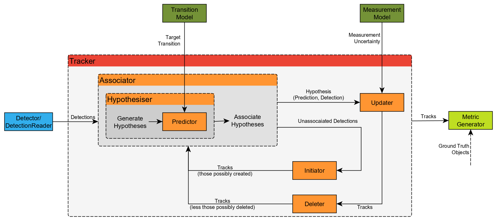

Framework Design [#]_
=====================

Stone Soup is initially targeted at two different groups of users:

 - Academics conducting research into tracking and state estimation, looking to quickly develop
   algorithms, and compare against other algorithms assessed against metrics.
 - User, owners and processors of real data, looking to identify the best approach for their
   application, without the need for deep expertise required to implement many algorithms.

The central theme of the Stone Soup design philosophy is interchangeability. The framework is
designed with the idea that users can easily insert their own components into existing constructs,
and that they could mix and match components in new and unexpected ways. In support of this goal,
the Stone Soup code architecture has been built on the principles of modularity and uniformity of
external interfaces.

Stone Soup is object oriented and makes use of encapsulation, abstraction and inheritance:

Abstraction
  Stone Soup trackers are built as hierarchical objects. For example, a
  :class:`~.MultiTargetTracker` object may contain track :class:`~.Initiator`, a track
  :class:`~.Deleter`, :class:`~.Detector`, :class:`~.DataAssociator`, and :class:`~.Updater`
  objects. Each of these objects is defined by an abstract class that specifies the external
  interface for that class; that is, the parameters and functions an object of that class must make
  available to the outside world.

Inheritance
  An example, the :class:`~.Updater` abstract class specifies that an :class:`~.Updater` object
  must have a :attr:`~.Updater.measurement_model` attribute, and that it must have methods
  :meth:`~.Updater.predict_measurement()` and :meth:`~.Updater.update()` that returns a
  :class:`~.MeasurementPrediction` and :class:`~.State` object respectively. Therefore, all
  implementations of Updaters in Stone Soup (:class:`~.KalmanUpdater`,
  :class:`~.ExtendedKalmanUpdater`, :class:`~.ParticleUpdater`, etc.) must have the specified
  elements.

Encapsulation
  With the :class:`~.Updater` example, this approach ensures that different Updaters are
  interchangeable (within limits), and that the :class:`~.Tracker` can utilize them without knowing
  the details of the :class:`~.Updater` implementation.

Components
----------
Stone Soup has a number of components used to both build a algorithm, but also enable an
environment for testing and assessment.

Enabling Components
^^^^^^^^^^^^^^^^^^^
The enabling components in Stone Soup consist of components for reading/simulating data, feeding
into the algorithm, and then writing and assessing the output.

.. figure:: _static/Logical_Data_Flow.png
    :figwidth: 80%
    :align: center
    :alt: Stone Soup Logical Data Flow

    Stone Soup Logical Data Flow

The figure above shows the overall flow of data from the various components, showing for example
how :class:`~.Detection` data can be read directly from a :class:`~.DetectionReader`, or maybe via
a :class:`~.DetectionSimulator` which uses :class:`~.GroundTruthPath` data. This could also include
reading data direct from a sensor. Outputs can also be passed into :class:`~.MetricGenerator`, or
written to file or database for later analysis. Note that all these components are optional.

Algorithm Components
^^^^^^^^^^^^^^^^^^^^
The algorithm components are those used to create a tracking or state estimation algorithm, where
the main component (e.g. :class:`~.MultiTargetTracker`) will define the parts required. These are
currently mainly focused on target tracking use case in Stone Soup, but intent is also for general
state estimation as well.

    Stone Soup Multi Target Tracker

The figure above shows an example of a :class:`~.MultiTargetTracker`, but note that other types of
algorithms may use different components, and different combination/sequence. In this examples, this
is processing detections over time, which then is predicting, associating, updating, initiating and
deleting tracks. By using in here an :class:`~.KalmanPredictor`, a :class:`~.KalmanUpdater`, and a
:class:`~.GaussianInitiator`, this becomes a Kalman tracker; but with a
:class:`~.ParticlePredictor`, a :class:`~.ParticleUpdater`, and a :class:`~.ParticleInitiator`,
this becomes a Particle tracker.

Data Types
^^^^^^^^^^
A key part of Stone Soup is the data types, that allow data to be passed between components. A
fundamental example of this in Stone Soup is the :class:`~.State` data type. This has a
:attr:`~.State.state_vector`, and optional :attr:`~.State.timestamp`, which describes the state of
something at a particular time. One child class of this is the :class:`~.Detection` class, which
describes a measurement from a sensor at a particular time; or the :class:`~.GaussianState` which
not only has a :attr:`~.GaussianState.state_vector` (Gaussian mean), but also has a
:attr:`~.GaussianState.covar` (Gaussian covariance) and such describes the state with uncertainty
in the form of a multivariate Gaussian distribution.

Stone Soup also employs |duck typing|_, a technique that means that data types are flexible. For
example, a :class:`~.State` (as mentioned above) and :class:`~.GroundTruthPath` (describing how
target's true state changes over time), both have a similar interface in terms of have a state
vector and timestamp (in case of :class:`~.GroundTruthPath` the most recent
:class:`~.GroundTruthState`). They therefore can both be used with :class:`~.TransitionModel`
instances, allowing models to be used for both target prediction (in case with
:class:`~.Predictor`) and in simulating targets (in case with :class:`~.Platform`).

.. |duck typing| replace:: *duck typing*
.. _duck typing: https://en.wikipedia.org/wiki/Duck_typing

.. rubric:: Footnotes

.. [#] *David Last, Paul Thomas, Steven Hiscocks, Jordi Barr, David Kirkland, Mamoon Rashid,
   Sang Bin Li, and Lyudmil Vladimirov* **"Stone Soup: announcement of beta release of an open-source
   framework for tracking and state estimation"**, Proc. SPIE 11018, Signal Processing,
   Sensor/Information Fusion, and Target Recognition XXVIII, 1101807 (7 May 2019);
   https://doi.org/10.1117/12.2518514
   [`PDF <https://isif-ostewg.org/uploads/stone-soup-spie-2019-paper.pdf>`_]
