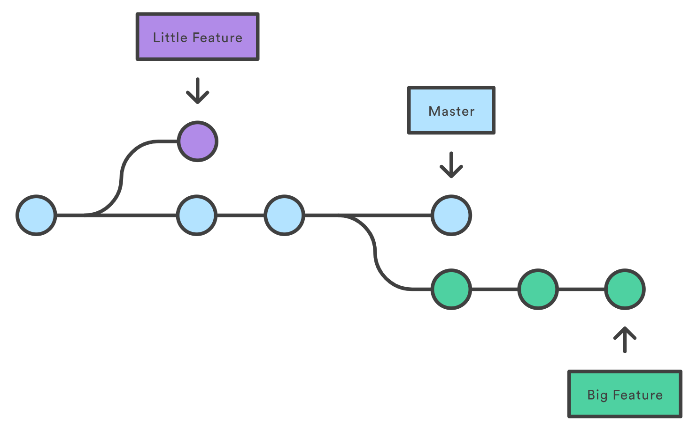

Contributing
============

As mentioned before, Stone Soup uses Git for version control and the Stone Soup repository is hosted on GitHub. In plain terms, GitHub is to Git repositories, what Dropbox is to files. Not only does GitHub host (i.e. store) repositories, it also provides access control and several collaboration features, such as a wikis and basic task management tools. 

Background
----------

To be able to effectively interact with Stone Soup, there are a few Git concepts that must be comprehended:

Branches
~~~~~~~~
During the installation process, we briefly spoke about the notion of Git branches. 

In Git, branches are a part of your everyday development process. When you want to add a new feature or fix a bug—no matter how big or how small—you spawn a new branch to encapsulate your changes. This makes sure that unstable code is never committed to the main code base, and it gives you the chance to clean up your feature’s history before merging it into the main branch.

   A repository with three branches: ``little feature``, ``master``, and ``big feature``.

The diagram above visualizes a repository with two isolated lines of development. The ``master`` branch contains the baseline code, while ``litle feature`` and ``big feature`` each contain an identical copy of the ``master`` branch, up to the point in time at which they were diverted/branched out. 

We can see that ``little feature`` branch is "behind" ``master`` by 3 commits (blue circles to the right of branch) and "ahead" by 1 commit (purple circle), while ``big feature`` is behind of master by 1 commit "ahead" of ``master`` by 3 commits (green circles).

In a similar manner, new branches are created in Stone Soup for each new feature that is currently being worked on. See `here <https://github.com/dstl/Stone-Soup/branches/all>`_ for a list all branches currently active in Stone Soup. As a matter of fact, a branch named ``liverpool-walk`` has been created for the purposes of this occassion.

Staging/Commiting
~~~~~~~~~~~~~~~~~
In the save way that we can save changes made to files, we can also save changes made to a Git branch. Git's "saving" mechanism however is slightly more involved. It consists of a two-part process of "Staging" and "Commiting" file changes. 

 - "Staging" refers to the process of preparing a set of changes (i.e. modified files) to be "Committed". 
    
    The git command to perform staging of the changed applied to an example ``file.py`` is given below:
    
        .. code::

            git add file.py

 - "Committing" then refers to the actual process of saving any staged changes to the git repository (or more specifically one of its branches). It's like when you save a file, except in Git, with every commit, a unique ID (a.k.a. the "SHA" or "hash") is also created, that allows you to keep record of what changes were made, when and by who.

    The git command to commit all previously staged changes is shown below:

        .. code::

            git commit

.. note::

    "Committing" only saves changes to the local copy of the repository/branch. 
    
    To push any changes to the GitHub (a.k.a. remote or origin) repository, a seperate process of "Pushing" is performed, which will be discussed further down.

Pushing
~~~~~~~
The term "Push" is used to describe the process of publishing local (committed) changes to the remote repository. 

More specifically, once some changes to the working branch have been committed (using the process described above), they can subsequently be "pushed" to the remote repository/branch. Any uncommited changes remain locally (i.e. they are not uploded). 

The git command for pushing committed changes from a local branch ``feature`` to a ``remote`` repository is given below:

    .. code::
        
        git push <remote> feature 

Pulling
~~~~~~~
Pulling refers to the process of acquiring the latest changes made to a remote branch and applying them locally.

In plain terms, "pulling" is like updating the local branch to it's latest version, only  a lot smarter.  

The git command for pulling the latest changes in the ``feature`` branch from ``remote`` and applying them locally is given below:

    .. code::
        
        git pull <remote> feature

Branch Checkout
~~~~~~~~~~~~~~~
The term "Checkout" refers to the git process of "opening" an existing branch. 

Checking out a ``feature`` branch that is already present locally can be done as follows:

    .. code::
        
        git checkout feature

If ``feature`` is only present on the ``remote`` repository (i.e. never previously checked out), the following command can be used to create and open a local copy:

    .. code:: 

        git checkout --track remote/feature

.. warning::

    To avoid losing work, **always make sure you have committed any changes to the current branch, before switching to a new one!** 

Branch Creation
~~~~~~~~~~~~~~~
New branches can be created by branching out of other branches. For example to create a ``new-branch`` which branches out from master, we can proceed as follows:

    .. code::

        git checkout master
        git branch new-branch
        git checkout new-branch      

Merging
~~~~~~~
Merging can be used to merge the changes/history of one branch into another. 

A striking example use-case is when work on a ``feature`` branch is completed and the branch is subsequently merged back into ``master``, as shown in the figure below. 

.. figure:: ./_static/git_merge.PNG
   :scale: 45 %
   :align: center
   :alt: map to buried treasure

   An example where a ``feature`` branch is merged back into ``master``.

The commands necessary to merge ``feature`` into ``master`` is shown below:

    .. code::

        git checkout master
        git merge feature

Rebasing
~~~~~~~~
Rebasing refers to the process of "choping/cherry picking" a given branch and placing on top of another branch. In other words, it is like taking all the changes applied to a given branch since it's creation, and reapplying them on top of a different version of the code.

.. figure:: ./_static/git_rebase.PNG
   :scale: 50 %
   :align: center
   :alt: map to buried treasure

   An example where a ``feature`` branch is rebased on top of ``master``.

To commands to rebase an example ``feature`` branch on top of ``master`` is shown below:

    .. code::

        git checkout feature
        git rebase master

Pull Requests
~~~~~~~~~~~~~
When development on any Stone Soup branch is thought of as completed, the person/team working on the branch must submit a Pull Request, essentially requesting the repository maintainer to merge the changes into ``master``. 

Currently Stone Soup uses `GitHub Flow <https://guides.github.com/introduction/flow/index.html>`_ as an approach to development. See `here <https://github.com/dstl/Stone-Soup/pull/72>`_ for an example of an active Stone Soup Pull Request.  

    .. code::

        branch = new Branch('feature')
        pull_request_approved = False
        pull_request_submitted = False
        while not pull_request_approved:
            
            if branch.remote_contains_new_commits():
                branch.pull_from_remote()
            
            make_changes()
            for change in changes:
                branch.stage_change()
                branch.commit_change()
            
            if ready_to_push():
                branch.push()

            if ready_to_merge():
                branch.rebaseTo('master')

            if not pull_request_submitted and ready_to_merge():
                branch.submit_pull_request()
                pull_request_submitted = True

            if pull_request_is_approved():
                pull_request_approved = True
            

            